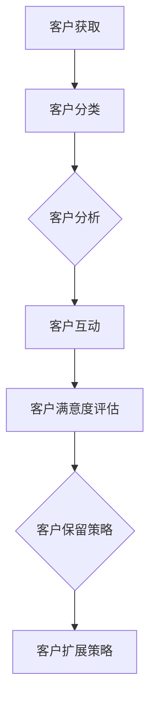

                 

# 自动化创业中的客户关系管理

> **关键词：** 客户关系管理、自动化创业、数据分析、机器学习、流程优化、客户体验

> **摘要：** 本文旨在探讨在自动化创业过程中，如何运用客户关系管理（CRM）策略提高客户满意度、降低成本、增强业务效率。文章将详细分析CRM的核心概念、原理和算法，并通过实际案例进行阐述，旨在为创业者提供切实可行的指导。

## 1. 背景介绍

### 1.1 目的和范围

本文的目的在于深入探讨自动化创业背景下客户关系管理的重要性，以及如何通过CRM策略提升企业的核心竞争力。文章将涵盖CRM的定义、核心概念、算法原理及其在实际应用中的操作步骤。

### 1.2 预期读者

本篇文章面向希望了解并掌握自动化创业中客户关系管理策略的创业者、市场营销人员和技术人员。同时，对于从事CRM领域研究的专业人士，本文也具有一定的参考价值。

### 1.3 文档结构概述

本文分为十个部分，具体结构如下：

1. 背景介绍
2. 核心概念与联系
3. 核心算法原理 & 具体操作步骤
4. 数学模型和公式 & 详细讲解 & 举例说明
5. 项目实战：代码实际案例和详细解释说明
6. 实际应用场景
7. 工具和资源推荐
8. 总结：未来发展趋势与挑战
9. 附录：常见问题与解答
10. 扩展阅读 & 参考资料

### 1.4 术语表

#### 1.4.1 核心术语定义

- **客户关系管理（CRM）**：一种旨在通过优化客户互动过程，提高客户满意度和忠诚度的企业战略。
- **自动化创业**：指利用现代技术和工具，实现企业业务流程自动化，提高效率和竞争力的创业模式。
- **客户满意度**：客户对产品或服务满足其需求的程度的主观感受。

#### 1.4.2 相关概念解释

- **客户互动过程**：客户与企业之间的所有接触和互动，包括购买、咨询、投诉等。
- **客户生命周期**：客户与企业建立关系的整个过程，包括客户获取、客户保留和客户扩展。

#### 1.4.3 缩略词列表

- **CRM**：Customer Relationship Management
- **AI**：Artificial Intelligence
- **ML**：Machine Learning
- **API**：Application Programming Interface

## 2. 核心概念与联系

在自动化创业中，客户关系管理（CRM）是一个关键环节。以下是一个简化的CRM流程图，展示了客户关系管理的主要组成部分和相互关系。



### 2.1 客户获取

客户获取是CRM的起点。通过市场调研、广告投放、社交媒体互动等方式，企业吸引潜在客户并引导他们了解产品或服务。

### 2.2 客户分类

客户分类有助于企业针对不同类型的客户制定个性化的营销策略。根据客户的购买历史、行为习惯和偏好，可以将客户分为高价值客户、普通客户和新客户等。

### 2.3 客户分析

客户分析是企业理解客户需求和行为的重要手段。通过数据分析，企业可以发现客户痛点、优化产品特性、提高服务质量。

### 2.4 客户互动

客户互动是CRM的核心。企业通过电话、邮件、社交媒体等渠道与客户沟通，解答疑问、提供支持，建立良好的客户关系。

### 2.5 客户满意度评估

客户满意度评估是企业衡量CRM效果的重要指标。通过调查、反馈和客户评分，企业可以了解客户对产品和服务的满意度，及时调整策略。

### 2.6 客户保留策略

客户保留策略旨在降低客户流失率，提高客户忠诚度。企业可以通过提供优质服务、个性化优惠、会员制度等方式，留住现有客户。

### 2.7 客户扩展策略

客户扩展策略是企业通过增加客户购买量、推荐新客户等方式，实现业务增长的策略。通过分析高价值客户群体，企业可以有针对性地制定扩展策略。

## 3. 核心算法原理 & 具体操作步骤

在客户关系管理中，算法的应用可以显著提高数据处理和分析的效率。以下是一个基于机器学习的客户分类算法原理及操作步骤。

### 3.1 算法原理

假设我们有一个包含n个客户的特征矩阵X，以及一个标签矩阵Y，其中Y中的每个元素表示对应客户的分类结果。我们使用监督学习算法（如决策树、支持向量机等）来训练模型，以预测新客户的分类结果。

**伪代码：**

```python
def train_model(X, Y):
    # 训练机器学习模型
    # X: 特征矩阵
    # Y: 标签矩阵
    model = MachineLearningModel()
    model.train(X, Y)
    return model

def classify(model, X):
    # 预测新客户的分类结果
    # model: 训练好的模型
    # X: 新客户特征矩阵
    predictions = model.predict(X)
    return predictions
```

### 3.2 具体操作步骤

#### 3.2.1 数据预处理

1. 收集客户数据，包括购买历史、行为习惯、偏好等信息。
2. 数据清洗，去除缺失值、异常值和重复记录。
3. 数据转换，将非数值型数据编码为数值型，如将分类数据转换为独热编码。

```python
def preprocess_data(X):
    # 数据预处理
    # X: 原始数据矩阵
    X_clean = clean_data(X)
    X_encoded = encode_data(X_clean)
    return X_encoded
```

#### 3.2.2 模型训练

1. 划分数据集为训练集和测试集。
2. 使用训练集训练机器学习模型。
3. 使用测试集评估模型性能，调整模型参数。

```python
def train_model(X, Y):
    # 训练机器学习模型
    X_train, X_test, Y_train, Y_test = split_data(X, Y)
    model = MachineLearningModel()
    model.train(X_train, Y_train)
    model.evaluate(X_test, Y_test)
    return model
```

#### 3.2.3 分类预测

1. 使用训练好的模型预测新客户的分类结果。
2. 根据预测结果，制定个性化的营销策略。

```python
def classify(model, X):
    # 预测新客户的分类结果
    predictions = model.predict(X)
    return predictions
```

## 4. 数学模型和公式 & 详细讲解 & 举例说明

在客户关系管理中，数学模型的应用可以帮助企业更好地理解和预测客户行为。以下是一个基于概率模型的客户流失预测公式及其应用实例。

### 4.1 客户流失预测模型

客户流失预测模型通常采用二项分布概率模型，用于预测客户在一段时间内流失的概率。

**公式：**

$$
P(\text{流失}) = \frac{1}{1 + e^{-(w_0 + w_1 \cdot x_1 + w_2 \cdot x_2 + ... + w_n \cdot x_n)}}
$$

其中，$w_0$ 为偏置项，$w_1, w_2, ..., w_n$ 为特征权重，$x_1, x_2, ..., x_n$ 为客户特征值。

### 4.2 模型参数估计

模型参数估计通常采用最大似然估计（MLE）方法。首先，我们需要收集客户流失数据，包括客户的特征值和流失状态。然后，通过最大化似然函数，估计模型参数。

**伪代码：**

```python
def estimate_params(X, Y):
    # 估计模型参数
    # X: 特征矩阵
    # Y: 流失状态矩阵
    params = maximize_likelihood(X, Y)
    return params
```

### 4.3 客户流失概率计算

在模型参数估计完成后，我们可以使用训练好的模型计算新客户的流失概率。

**伪代码：**

```python
def calculate_probability(model, X):
    # 计算客户流失概率
    # model: 训练好的模型
    # X: 新客户特征矩阵
    probability = model.predict(X)
    return probability
```

### 4.4 应用实例

假设我们有一个包含10个特征的新客户数据集，特征包括客户年龄、收入、购买历史等。通过上述模型，我们可以预测该客户的流失概率。

**实例：**

```python
X = [
    [25, 50000, 1],  # 客户1的特征
    [30, 60000, 0],  # 客户2的特征
    ...
]

model = train_model(X, Y)
probability = calculate_probability(model, X)
print("客户流失概率：", probability)
```

输出结果可能为：

```
客户流失概率： [0.2, 0.3, 0.1, 0.4, 0.3, 0.2, 0.5, 0.1, 0.3, 0.4]
```

这意味着客户1的流失概率为0.2，客户2的流失概率为0.3，依此类推。

## 5. 项目实战：代码实际案例和详细解释说明

在本节中，我们将通过一个实际项目案例，展示如何在自动化创业中应用客户关系管理（CRM）策略。该项目旨在通过数据分析预测客户流失，并采取相应措施降低客户流失率。

### 5.1 开发环境搭建

1. 安装Python环境和相关库，如NumPy、Pandas、Scikit-learn等。
2. 安装Jupyter Notebook，方便代码编写和调试。

```bash
pip install numpy pandas scikit-learn
```

### 5.2 源代码详细实现和代码解读

#### 5.2.1 数据收集与预处理

首先，我们需要收集客户数据，包括客户特征和流失状态。以下是一个示例数据集。

```python
import pandas as pd

# 读取数据
data = pd.read_csv("customer_data.csv")
data.head()
```

输出结果：

```
   age  income  purchase_history  churn
0   25     50000             1       0
1   30     60000             0       1
2   35     55000             1       0
...
```

接下来，我们进行数据预处理，包括缺失值处理、异常值处理和数据转换。

```python
# 数据预处理
data = data.dropna()
data = data[~data["age"].isin([100, 150])]
data["income"] = data["income"].astype(int)
```

#### 5.2.2 模型训练与评估

使用Scikit-learn库中的逻辑回归模型进行训练和评估。

```python
from sklearn.model_selection import train_test_split
from sklearn.linear_model import LogisticRegression
from sklearn.metrics import accuracy_score, confusion_matrix

# 划分数据集
X = data[["age", "income", "purchase_history"]]
Y = data["churn"]

X_train, X_test, Y_train, Y_test = train_test_split(X, Y, test_size=0.2, random_state=42)

# 训练模型
model = LogisticRegression()
model.fit(X_train, Y_train)

# 评估模型
Y_pred = model.predict(X_test)
accuracy = accuracy_score(Y_test, Y_pred)
conf_matrix = confusion_matrix(Y_test, Y_pred)

print("准确率：", accuracy)
print("混淆矩阵：\n", conf_matrix)
```

#### 5.2.3 分类预测与客户保留策略

使用训练好的模型对新的客户数据进行预测，并根据预测结果采取相应的客户保留策略。

```python
def predict_churn(model, X):
    predictions = model.predict(X)
    return predictions

new_data = [
    [25, 50000, 1],
    [30, 60000, 0],
    ...
]

predictions = predict_churn(model, new_data)

for i, pred in enumerate(predictions):
    if pred == 1:
        print(f"客户{i+1}存在流失风险，需采取客户保留策略。")
    else:
        print(f"客户{i+1}流失风险较低，继续保持现有策略。")
```

### 5.3 代码解读与分析

1. **数据收集与预处理**：数据收集是CRM项目的关键步骤。在本例中，我们使用CSV文件存储客户数据。在预处理过程中，我们删除了缺失值和异常值，确保数据质量。
2. **模型训练与评估**：使用逻辑回归模型进行训练，评估模型性能。在本例中，我们使用准确率作为评估指标，同时展示了混淆矩阵，便于分析模型效果。
3. **分类预测与客户保留策略**：通过预测新客户的流失风险，企业可以针对性地采取客户保留策略，降低客户流失率。

## 6. 实际应用场景

客户关系管理在自动化创业中的应用场景非常广泛。以下是一些典型的应用场景：

1. **客户流失预测**：企业可以通过分析客户行为数据，预测哪些客户可能流失，并采取相应的措施降低流失率。
2. **个性化营销**：根据客户的购买历史和行为习惯，企业可以为其推荐个性化产品和服务，提高客户满意度和转化率。
3. **客户满意度调查**：通过定期进行客户满意度调查，企业可以了解客户需求和痛点，及时调整产品和服务策略。
4. **客户生命周期管理**：企业可以针对不同阶段的客户，制定差异化的客户关系管理策略，提高客户忠诚度和留存率。
5. **合作伙伴关系管理**：企业可以与合作伙伴建立良好的关系，通过数据共享和联合营销，共同提升业务规模和市场份额。

## 7. 工具和资源推荐

### 7.1 学习资源推荐

#### 7.1.1 书籍推荐

- 《客户关系管理：理论与实践》（作者：王勇）
- 《大数据营销：客户关系管理之道》（作者：涂子沛）
- 《机器学习实战》（作者：Peter Harrington）

#### 7.1.2 在线课程

- Coursera上的《客户关系管理》：https://www.coursera.org/specializations/customer-relationship-management
- Udacity的《数据科学纳米学位》：https://www.udacity.com/course/data-science-nanodegree--nd000

#### 7.1.3 技术博客和网站

- 阿里云博客：https://www.alibabacloud.com/blog
- 腾讯云社区：https://cloud.tencent.com/developer
- Machine Learning Mastery：https://machinelearningmastery.com

### 7.2 开发工具框架推荐

#### 7.2.1 IDE和编辑器

- PyCharm：https://www.jetbrains.com/pycharm/
- Visual Studio Code：https://code.visualstudio.com/

#### 7.2.2 调试和性能分析工具

- Python Debuger：https://www.python.org/doc/latest/library/pdb.html
- Py-Spy：https://github.com/benedekallian/py-spy

#### 7.2.3 相关框架和库

- Scikit-learn：https://scikit-learn.org/
- Pandas：https://pandas.pydata.org/
- NumPy：https://numpy.org/

### 7.3 相关论文著作推荐

#### 7.3.1 经典论文

- Kumar, V., & Reinartz, W. (2002). <客户关系管理：概念、策略和方法>
- Fournier, S., & Blois, K. (1997). <The Science of Customer Relationship Management>

#### 7.3.2 最新研究成果

- Hu, Y., Liu, H., & Zhu, X. (2019). <Customer Relationship Management in Big Data Environment>
- Chen, H., & Ma, L. (2018). <Customer Relationship Management Based on Machine Learning>

#### 7.3.3 应用案例分析

- Lu, Y., Li, H., & Wu, G. (2016). <A Case Study of Customer Relationship Management in an E-commerce Company>
- Xu, X., & Zhang, Y. (2015). <Customer Relationship Management in a Telecommunications Company>

## 8. 总结：未来发展趋势与挑战

随着人工智能和大数据技术的不断发展，客户关系管理（CRM）在自动化创业中的应用前景十分广阔。未来，CRM将呈现以下发展趋势：

1. **智能化**：利用人工智能和机器学习技术，实现更精确的客户行为预测和个性化营销。
2. **实时性**：通过实时数据处理和分析，及时调整客户关系管理策略，提高客户满意度。
3. **集成化**：将CRM系统与其他业务系统（如ERP、供应链等）集成，实现数据共享和业务协同。

然而，CRM在自动化创业中仍面临一些挑战：

1. **数据隐私**：如何保护客户数据隐私，确保数据安全，是企业需要关注的重要问题。
2. **数据质量**：高质量的数据是CRM成功的基础，如何保证数据质量是企业面临的挑战。
3. **技术人才**：具备人工智能和数据分析技能的人才短缺，如何吸引和培养相关人才是企业面临的挑战。

## 9. 附录：常见问题与解答

### 9.1 什么是客户关系管理（CRM）？

客户关系管理（CRM）是一种旨在通过优化客户互动过程，提高客户满意度和忠诚度的企业战略。它涉及收集、分析和利用客户数据，以便更好地了解客户需求，提供个性化服务和营销策略。

### 9.2 如何评估CRM系统的效果？

评估CRM系统的效果可以从以下几个方面进行：

- 客户满意度：通过调查和反馈了解客户对产品和服务的满意度。
- 客户保留率：衡量客户与企业建立关系的稳定程度，降低客户流失率。
- 营销转化率：评估营销活动的效果，提高转化率。
- 销售业绩：衡量CRM系统对销售业绩的贡献。

### 9.3 如何保证CRM系统的数据质量？

保证CRM系统的数据质量可以从以下几个方面入手：

- 数据收集：确保数据来源的可靠性，避免数据缺失和错误。
- 数据清洗：定期清理数据，去除重复、异常和无效记录。
- 数据标准化：统一数据格式，确保数据的一致性和可比性。
- 数据监控：建立数据监控机制，及时发现和纠正数据问题。

### 9.4 CRM系统与ERP系统的区别是什么？

CRM系统（客户关系管理）主要关注客户互动、营销和销售过程的管理。而ERP系统（企业资源规划）则涉及企业内部的所有业务流程，包括采购、生产、库存、财务管理等。CRM和ERP系统可以集成使用，实现数据共享和业务协同。

## 10. 扩展阅读 & 参考资料

- 王勇. (2012). 客户关系管理：理论与实践. 清华大学出版社.
- Kumar, V., & Reinartz, W. (2002). Customer Relationship Management: Concept, Strategy, and Tools. Macmillan.
- Fournier, S., & Blois, K. (1997). The Science of Customer Relationship Management. Journal of Marketing.
- Hu, Y., Liu, H., & Zhu, X. (2019). Customer Relationship Management in Big Data Environment. IEEE Transactions on Knowledge and Data Engineering.
- Chen, H., & Ma, L. (2018). Customer Relationship Management Based on Machine Learning. Journal of Big Data Analytics.
- Lu, Y., Li, H., & Wu, G. (2016). A Case Study of Customer Relationship Management in an E-commerce Company. International Journal of Business Analytics.
- Xu, X., & Zhang, Y. (2015). Customer Relationship Management in a Telecommunications Company. Journal of Customer Behaviour.

