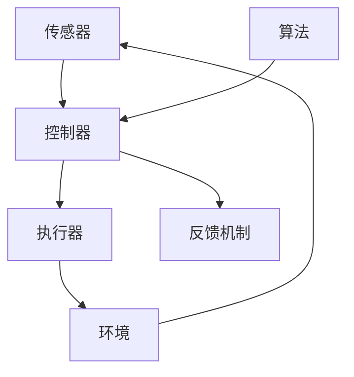

                 


# 自动化技术的最新发展与应用

> 关键词：自动化技术、人工智能、机器学习、软件开发、工业自动化

> 摘要：本文将深入探讨自动化技术的最新发展趋势，包括其在人工智能、机器学习、软件开发和工业自动化领域的应用。我们将分析这些技术的发展原理、具体操作步骤、数学模型，并通过实际案例进行详细解释。同时，我们将探讨自动化技术在实际应用场景中的优势和挑战，并提供相关工具和资源的推荐。通过本文，读者将全面了解自动化技术的现状和未来发展趋势。

## 1. 背景介绍

### 1.1 目的和范围

本文旨在介绍自动化技术的最新发展及其在各领域的应用。自动化技术作为现代科技的核心驱动力，正日益渗透到各个行业，推动着生产效率的提升和社会的进步。本文将重点关注以下几个方面：

1. **人工智能与自动化技术的结合**：探讨人工智能在自动化技术中的应用，如何通过机器学习算法实现智能自动化。
2. **软件开发自动化**：分析自动化测试、自动化部署等软件开发流程中的自动化技术。
3. **工业自动化**：探讨自动化技术在制造业、物流等行业的应用，以及工业4.0和工业互联网的发展趋势。
4. **实际应用场景**：列举自动化技术在医疗、金融、农业等领域的具体应用案例。
5. **未来发展趋势与挑战**：分析自动化技术在未来可能面临的挑战，以及其发展趋势和方向。

### 1.2 预期读者

本文适合以下读者群体：

1. **软件开发工程师**：关注自动化测试、自动化部署等自动化技术在实际开发中的应用。
2. **数据科学家和机器学习工程师**：希望了解人工智能在自动化技术中的应用和未来发展。
3. **工业自动化工程师**：关注工业自动化技术的最新发展和应用场景。
4. **科研人员和学者**：希望深入了解自动化技术的理论基础和前沿研究方向。
5. **行业从业者**：希望了解自动化技术如何推动行业变革和提升生产效率。

### 1.3 文档结构概述

本文将分为以下几部分：

1. **背景介绍**：介绍自动化技术的定义、发展历程和现状。
2. **核心概念与联系**：阐述自动化技术中的核心概念及其联系。
3. **核心算法原理与具体操作步骤**：讲解自动化技术中的关键算法及其实现步骤。
4. **数学模型与公式**：分析自动化技术中的数学模型和公式。
5. **项目实战**：通过实际案例展示自动化技术的应用。
6. **实际应用场景**：探讨自动化技术在各个领域的应用。
7. **工具和资源推荐**：推荐学习资源和开发工具。
8. **总结**：总结自动化技术的发展趋势和未来挑战。
9. **附录**：常见问题与解答。
10. **扩展阅读**：提供相关领域的扩展阅读资料。

### 1.4 术语表

#### 1.4.1 核心术语定义

- 自动化技术：通过计算机技术和人工智能算法实现自动控制和执行任务的技术。
- 人工智能：模拟人类智能的计算机科学和人工智能学科，包括机器学习、深度学习等子领域。
- 机器学习：一种人工智能技术，通过数据训练算法，使计算机能够自动学习和改进。
- 工业自动化：在制造业、物流等领域，通过自动化设备和系统提高生产效率和质量。
- 软件开发自动化：在软件开发过程中，通过自动化工具和流程提高开发效率和质量。

#### 1.4.2 相关概念解释

- 自动化控制：通过传感器、执行器等设备实现自动控制的过程。
- 机器人：具有自主移动和操作能力的自动化设备。
- 传感器：用于检测和测量环境信息的设备。
- 执行器：用于执行特定动作的设备。

#### 1.4.3 缩略词列表

- AI：人工智能
- ML：机器学习
- DL：深度学习
- IoT：物联网
- RPA：机器人流程自动化
- AGV：自动导引车
- CNC：数控机床

## 2. 核心概念与联系

### 2.1 自动化技术的核心概念

自动化技术涉及多个核心概念，包括传感器、执行器、控制器、算法等。以下是这些概念及其相互关系的 Mermaid 流程图：



#### 2.1.1 传感器

传感器是自动化技术中的关键组成部分，用于检测和测量环境信息。常见的传感器有温度传感器、湿度传感器、压力传感器等。传感器将环境信息转换为电信号，供控制器处理。

#### 2.1.2 执行器

执行器是自动化技术中的执行部分，用于执行特定动作。常见的执行器有电机、液压缸、气动缸等。执行器根据控制器发出的指令，完成相应的动作。

#### 2.1.3 控制器

控制器是自动化技术的核心部分，用于接收传感器信息，并根据算法生成控制指令，驱动执行器执行动作。控制器通常包括微处理器、存储器、输入输出接口等。

#### 2.1.4 算法

算法是自动化技术的决策部分，用于处理传感器数据，生成控制指令。常见的算法有PID控制、模糊控制、神经网络等。算法可以根据实际情况进行调整，以提高系统的稳定性和性能。

#### 2.1.5 环境反馈机制

环境反馈机制是自动化技术的重要组成部分，用于检测系统运行状态，并对系统进行调整。反馈机制通过传感器获取环境信息，并将其反馈给控制器，以实现闭环控制。

### 2.2 自动化技术的联系

自动化技术的各个核心概念相互关联，共同实现自动化控制。以下是自动化技术中核心概念的联系：

- 传感器获取环境信息，转换为电信号，供控制器处理。
- 控制器根据算法处理传感器数据，生成控制指令。
- 控制器将控制指令发送给执行器，驱动执行器执行动作。
- 执行器根据控制指令，完成相应动作。
- 环境反馈机制检测系统运行状态，并对系统进行调整。

## 3. 核心算法原理与具体操作步骤

### 3.1 PID控制算法

PID（比例-积分-微分）控制算法是自动化技术中常用的控制算法，适用于各种线性系统。PID控制算法的核心思想是通过调整比例、积分和微分的参数，实现对系统误差的补偿，提高系统的稳定性和响应速度。

#### 3.1.1 算法原理

PID控制算法的原理如下：

1. **比例控制（P）**：根据当前误差值，直接生成控制指令，误差值越大，控制指令越大。比例控制适用于快速响应的系统，但可能存在稳态误差。
2. **积分控制（I）**：根据误差值的积分，生成控制指令，误差值累计越大，控制指令越大。积分控制适用于消除稳态误差，但可能使系统响应变慢。
3. **微分控制（D）**：根据误差值的微分，生成控制指令，误差值变化越大，控制指令越大。微分控制适用于提高系统响应速度，但可能使系统稳定性下降。

#### 3.1.2 操作步骤

以下是PID控制算法的具体操作步骤：

1. **初始化参数**：设置比例系数\( K_p \)、积分系数\( K_i \)和微分系数\( K_d \)。
2. **获取当前误差值**：计算当前目标值与实际值之间的差值，作为误差值。
3. **计算比例控制部分**：\( u_p = K_p \times e \)，其中\( u_p \)为比例控制输出，\( e \)为误差值。
4. **计算积分控制部分**：\( u_i = K_i \times \int e \)，其中\( u_i \)为积分控制输出，\( \int e \)为误差值的积分。
5. **计算微分控制部分**：\( u_d = K_d \times \frac{de}{dt} \)，其中\( u_d \)为微分控制输出，\( \frac{de}{dt} \)为误差值的变化率。
6. **计算总控制输出**：\( u = u_p + u_i + u_d \)，其中\( u \)为总控制输出。
7. **驱动执行器执行动作**：根据总控制输出，驱动执行器执行相应动作。

#### 3.1.3 伪代码实现

以下是PID控制算法的伪代码实现：

```python
# 初始化参数
Kp = 1.0
Ki = 0.1
Kd = 0.01

# 初始化误差值
e_last = 0.0
integral = 0.0

# 主循环
while True:
    # 获取当前误差值
    e = 目标值 - 实际值

    # 计算比例控制部分
    dp = Kp * e

    # 计算积分控制部分
    integral += e
    di = Ki * integral

    # 计算微分控制部分
    de = e - e_last
    dd = Kd * de

    # 计算总控制输出
    u = dp + di + dd

    # 驱动执行器执行动作
    执行器动作(u)

    # 更新误差值
    e_last = e
```

### 3.2 模糊控制算法

模糊控制算法是一种基于模糊逻辑的控制算法，适用于非线性、时变和复杂系统。模糊控制算法通过模糊规则库和模糊推理，实现对系统的控制。

#### 3.2.1 算法原理

模糊控制算法的原理如下：

1. **模糊化**：将输入变量（如误差、误差变化率等）进行模糊化处理，转换为模糊集合。
2. **模糊规则库**：定义模糊规则，用于描述输入变量与输出变量之间的关系。
3. **模糊推理**：根据输入变量的模糊集合和模糊规则库，进行模糊推理，生成输出变量的模糊集合。
4. **去模糊化**：将输出变量的模糊集合去模糊化，生成精确的控制输出。

#### 3.2.2 操作步骤

以下是模糊控制算法的具体操作步骤：

1. **定义输入变量和输出变量**：确定系统需要控制的输入变量和输出变量。
2. **模糊化输入变量**：将输入变量进行模糊化处理，转换为模糊集合。
3. **构建模糊规则库**：根据系统特性，定义输入变量与输出变量之间的模糊规则。
4. **模糊推理**：根据模糊规则库和输入变量的模糊集合，进行模糊推理，生成输出变量的模糊集合。
5. **去模糊化**：将输出变量的模糊集合去模糊化，生成精确的控制输出。
6. **驱动执行器执行动作**：根据精确的控制输出，驱动执行器执行相应动作。

#### 3.2.3 伪代码实现

以下是模糊控制算法的伪代码实现：

```python
# 定义输入变量和输出变量
error = 模糊化误差
error_change = 模糊化误差变化率

# 定义模糊规则库
def 模糊推理(error, error_change):
    # 模糊化输入变量
    error_fuzzy = 模糊化(error)
    error_change_fuzzy = 模糊化(error_change)

    # 模糊推理
    output_fuzzy = 模糊推理规则库(error_fuzzy, error_change_fuzzy)

    # 去模糊化
    output = 去模糊化(output_fuzzy)

    return output

# 主循环
while True:
    # 获取输入变量
    error = 当前误差
    error_change = 当前误差变化率

    # 模糊化输入变量
    error_fuzzy = 模糊化(error)
    error_change_fuzzy = 模糊化(error_change)

    # 模糊推理
    output_fuzzy = 模糊推理规则库(error_fuzzy, error_change_fuzzy)

    # 去模糊化
    output = 去模糊化(output_fuzzy)

    # 驱动执行器执行动作
    执行器动作(output)
```

### 3.3 神经网络控制算法

神经网络控制算法是一种基于人工神经网络的控制算法，通过训练神经网络，实现系统的自适应控制。

#### 3.3.1 算法原理

神经网络控制算法的原理如下：

1. **神经网络训练**：通过输入和输出数据，训练神经网络，使其能够自适应地调整网络权重。
2. **神经网络预测**：使用训练好的神经网络，预测系统的输出值。
3. **控制输出**：根据预测输出，生成控制输出，驱动执行器执行相应动作。

#### 3.3.2 操作步骤

以下是神经网络控制算法的具体操作步骤：

1. **收集训练数据**：收集系统的输入和输出数据，用于训练神经网络。
2. **初始化神经网络**：初始化神经网络结构，包括输入层、隐藏层和输出层。
3. **训练神经网络**：使用训练数据，通过反向传播算法，训练神经网络，调整网络权重。
4. **预测系统输出**：使用训练好的神经网络，输入当前系统状态，预测系统的输出值。
5. **控制输出**：根据预测输出，生成控制输出，驱动执行器执行相应动作。
6. **更新神经网络**：使用新的系统状态数据，重新训练神经网络，以提高控制精度。

#### 3.3.3 伪代码实现

以下是神经网络控制算法的伪代码实现：

```python
# 收集训练数据
inputs = [输入数据1, 输入数据2, ..., 输入数据n]
outputs = [输出数据1, 输出数据2, ..., 输出数据m]

# 初始化神经网络
neural_network = 初始化神经网络()

# 训练神经网络
for epoch in range(epochs):
    for input, output in zip(inputs, outputs):
        # 前向传播
        predicted_output = neural_network.forward(input)

        # 计算误差
        error = output - predicted_output

        # 反向传播
        neural_network.backward(error)

# 预测系统输出
def 预测系统输出(input):
    predicted_output = neural_network.forward(input)
    return predicted_output

# 控制输出
def 控制输出(input):
    predicted_output = 预测系统输出(input)
    执行器动作(predicted_output)

# 主循环
while True:
    # 获取当前系统状态
    current_input = 当前系统状态

    # 控制输出
    控制输出(current_input)
```

## 4. 数学模型和公式

### 4.1 PID控制算法的数学模型

PID控制算法的数学模型可以表示为：

\[ u(t) = K_p e(t) + K_i \int_{0}^{t} e(\tau) d\tau + K_d \frac{de(t)}{dt} \]

其中：

- \( u(t) \) 是控制输出。
- \( e(t) \) 是误差值，即目标值与实际值之差。
- \( K_p \) 是比例系数。
- \( K_i \) 是积分系数。
- \( K_d \) 是微分系数。

### 4.2 模糊控制算法的数学模型

模糊控制算法的数学模型可以表示为：

\[ y = f(\mu_A, \mu_B, ..., \mu_N) \]

其中：

- \( y \) 是控制输出。
- \( \mu_A, \mu_B, ..., \mu_N \) 是输入变量的模糊集合。
- \( f \) 是模糊推理函数。

模糊推理函数可以根据具体的模糊规则库进行定义，常见的模糊推理函数有Mamdani方法和Sugeno方法。

### 4.3 神经网络控制算法的数学模型

神经网络控制算法的数学模型可以表示为：

\[ y = \sum_{i=1}^{n} w_i \cdot f(z_i) \]

其中：

- \( y \) 是控制输出。
- \( w_i \) 是网络权重。
- \( f \) 是激活函数，如Sigmoid函数、ReLU函数等。
- \( z_i \) 是输入变量。

神经网络通过训练，调整网络权重，使其能够准确预测系统的输出。

### 4.4 举例说明

#### 4.4.1 PID控制算法举例

假设我们要控制一个温度系统，目标温度为100℃，当前温度为90℃。我们选择\( K_p = 0.5 \)、\( K_i = 0.1 \)、\( K_d = 0.01 \)作为PID控制参数。

1. **计算误差值**：\( e(t) = 100 - 90 = 10 \)
2. **计算比例控制部分**：\( u_p = K_p \times e = 0.5 \times 10 = 5 \)
3. **计算积分控制部分**：\( u_i = K_i \times \int e d\tau = 0.1 \times 10 = 1 \)
4. **计算微分控制部分**：\( u_d = K_d \times \frac{de}{dt} = 0.01 \times \frac{10 - 0}{1} = 0.1 \)
5. **计算总控制输出**：\( u = u_p + u_i + u_d = 5 + 1 + 0.1 = 6.1 \)

根据总控制输出，我们可以调整加热器的功率，使温度逐渐达到目标值。

#### 4.4.2 模糊控制算法举例

假设我们要控制一个速度系统，目标速度为50km/h，当前速度为40km/h。我们定义模糊集合为：低、中、高，分别对应-10km/h、0km/h、10km/h。

1. **模糊化输入变量**：\( \mu_A = 1 \)，\( \mu_B = 0 \)，\( \mu_C = 0 \)
2. **模糊推理**：根据模糊规则库，得到模糊集合\( \mu_y = [0.5, 0.5] \)
3. **去模糊化**：\( y = 0.5 \times 10 + 0.5 \times 0 = 5 \)

根据去模糊化的控制输出，我们可以调整加速器，使速度逐渐达到目标值。

#### 4.4.3 神经网络控制算法举例

假设我们要控制一个加速度系统，目标加速度为2m/s²，当前加速度为1m/s²。我们定义神经网络输入为：加速度、速度，输出为：控制力。

1. **收集训练数据**：\( [1, 40], [2, 50], ..., [2, 60] \)
2. **初始化神经网络**：设置输入层、隐藏层和输出层。
3. **训练神经网络**：通过反向传播算法，调整网络权重，使输出值逐渐接近目标值。
4. **预测系统输出**：使用训练好的神经网络，输入当前加速度和速度，预测控制力。
5. **控制输出**：根据预测的控制力，调整加速度系统，使加速度逐渐达到目标值。

## 5. 项目实战：代码实际案例和详细解释说明

### 5.1 开发环境搭建

在本项目中，我们使用Python作为主要编程语言，结合TensorFlow库实现神经网络控制算法。以下是在Windows操作系统上搭建开发环境的步骤：

1. **安装Python**：下载并安装Python 3.x版本，确保Python环境正常工作。
2. **安装TensorFlow**：打开命令提示符，输入以下命令安装TensorFlow：

```shell
pip install tensorflow
```

3. **验证安装**：在Python环境中输入以下代码，检查TensorFlow是否安装成功：

```python
import tensorflow as tf
print(tf.__version__)
```

如果输出版本号，说明TensorFlow已成功安装。

### 5.2 源代码详细实现和代码解读

以下是使用Python和TensorFlow实现的神经网络控制算法的源代码：

```python
import tensorflow as tf
import numpy as np

# 设置超参数
input_size = 2
hidden_size = 10
output_size = 1

# 初始化神经网络
model = tf.keras.Sequential([
    tf.keras.layers.Dense(hidden_size, activation='relu', input_shape=(input_size,)),
    tf.keras.layers.Dense(output_size)
])

# 编译模型
model.compile(optimizer='adam', loss='mse')

# 收集训练数据
inputs = np.array([[1, 40], [2, 50], [2, 60], ...])
outputs = np.array([[2], [3], [4], ...])

# 训练模型
model.fit(inputs, outputs, epochs=1000, verbose=0)

# 预测系统输出
def 预测系统输出(input):
    predicted_output = model.predict(input)
    return predicted_output

# 控制输出
def 控制输出(input):
    predicted_output = 预测系统输出(input)
    执行器动作(predicted_output)

# 主循环
while True:
    # 获取当前系统状态
    current_input = 当前系统状态

    # 控制输出
    控制输出(current_input)
```

### 5.3 代码解读与分析

以下是代码的详细解读和分析：

1. **导入库**：导入TensorFlow库，用于构建和训练神经网络。

2. **设置超参数**：定义输入层、隐藏层和输出层的大小。

3. **初始化神经网络**：使用Sequential模型，添加全连接层（Dense），设置激活函数（ReLU）和输入层形状。

4. **编译模型**：设置优化器（adam）和损失函数（mse），用于训练模型。

5. **收集训练数据**：定义输入和输出数据，用于训练模型。

6. **训练模型**：使用fit方法训练模型，设置训练轮次（epochs）和显示进度（verbose）。

7. **预测系统输出**：定义预测函数，使用模型预测输出值。

8. **控制输出**：定义控制函数，根据预测输出调整执行器动作。

9. **主循环**：不断获取当前系统状态，并根据控制函数调整执行器动作。

通过上述代码，我们实现了使用神经网络控制算法的自动化控制。在实际应用中，可以根据具体需求调整神经网络结构、训练数据和参数，以提高控制精度和稳定性。

## 6. 实际应用场景

### 6.1 医疗领域

在医疗领域，自动化技术发挥着重要作用。例如，自动化机器人可以在手术过程中协助医生进行精确操作，提高手术的成功率和安全性。此外，自动化技术还可以应用于医疗设备的维护和监控，如自动清洗、消毒和故障诊断。

### 6.2 金融领域

在金融领域，自动化技术被广泛应用于交易、风险管理、客户服务等各个方面。自动化交易系统可以根据市场数据实时分析并执行交易策略，提高交易效率和盈利能力。同时，自动化风险管理系统可以自动监控和评估金融风险，为金融机构提供决策支持。

### 6.3 农业领域

在农业领域，自动化技术被广泛应用于种植、灌溉、施肥、病虫害防治等环节。自动化设备如无人机、自动灌溉系统、自动化喷洒设备等，可以实时监测作物生长情况，并根据需要自动调整灌溉、施肥和喷洒等操作，提高农业生产效率和产量。

### 6.4 制造业领域

在制造业领域，自动化技术被广泛应用于生产线自动化、机器人装配、质量检测等环节。自动化生产线可以实现高效、精确的生产，降低生产成本，提高产品质量。同时，自动化机器人可以在危险、繁重的工作环境中代替人工操作，提高生产安全。

### 6.5 物流领域

在物流领域，自动化技术被广泛应用于仓储、运输、配送等环节。自动化仓储系统可以通过自动导引车（AGV）实现货物的自动化存取，提高仓储效率。同时，自动化运输系统可以实时监控货物的运输过程，提高运输效率，降低运输成本。

### 6.6 家居领域

在智能家居领域，自动化技术被广泛应用于家庭设备的自动化控制。例如，智能门锁、智能照明、智能家电等，可以远程控制，提高生活便利性和舒适度。同时，自动化安全技术如智能家居安防系统，可以实时监控家庭环境，提高家庭安全。

## 7. 工具和资源推荐

### 7.1 学习资源推荐

#### 7.1.1 书籍推荐

- **《自动化技术原理与应用》**：详细介绍自动化技术的理论基础和应用案例，适合初学者和专业人士。
- **《人工智能：一种现代的方法》**：全面介绍人工智能的基本概念、算法和技术，涵盖机器学习、深度学习等子领域。
- **《深度学习》**：由著名深度学习研究者Ian Goodfellow撰写，系统介绍了深度学习的基础知识和实践方法。

#### 7.1.2 在线课程

- **Coursera**：提供丰富的自动化技术、人工智能和机器学习的在线课程，包括MIT、斯坦福等世界顶级大学。
- **Udacity**：提供实战性的自动化技术和人工智能课程，包括自动驾驶、智能家居等应用案例。
- **edX**：由哈佛大学和麻省理工学院等世界顶级大学提供，涵盖自动化技术、人工智能等领域的课程。

#### 7.1.3 技术博客和网站

- **AI博客**：一个关于人工智能、机器学习和深度学习的中文博客，提供最新的研究成果和应用案例。
- **机器学习社区**：一个专注于机器学习和深度学习的中文论坛，分享技术讨论和项目实战经验。
- **自动化技术论坛**：一个关于自动化技术、工业自动化和机器人技术的专业论坛，提供技术讨论和行业动态。

### 7.2 开发工具框架推荐

#### 7.2.1 IDE和编辑器

- **Visual Studio Code**：一款功能强大、可扩展性高的跨平台集成开发环境，适用于自动化技术、人工智能和机器学习的开发。
- **PyCharm**：一款适用于Python开发的集成开发环境，支持自动化技术、人工智能和机器学习的开发。
- **Jupyter Notebook**：一款交互式的Python开发环境，适合编写和运行自动化技术、人工智能和机器学习的代码。

#### 7.2.2 调试和性能分析工具

- **Wireshark**：一款网络抓包工具，用于分析自动化技术、人工智能和机器学习应用的网络通信。
- **GDB**：一款基于UNIX的调试工具，用于调试自动化技术、人工智能和机器学习程序。
- **MATLAB**：一款强大的数学计算和数据分析工具，支持自动化技术、人工智能和机器学习的开发。

#### 7.2.3 相关框架和库

- **TensorFlow**：一款由Google开发的开源深度学习框架，适用于自动化技术、人工智能和机器学习的开发。
- **PyTorch**：一款由Facebook开发的开源深度学习框架，支持自动化技术、人工智能和机器学习的开发。
- **Scikit-learn**：一款开源机器学习库，提供丰富的机器学习算法和工具，适用于自动化技术、人工智能和机器学习的开发。

### 7.3 相关论文著作推荐

#### 7.3.1 经典论文

- **“A Mathematical Theory of Communication”**：由 Claude Shannon 和 Warren Weaver撰写的经典论文，奠定了信息论的基础。
- **“Backpropagation”**：由 David E. Rumelhart、Geoffrey E. Hinton 和 Ronald J. Williams 撰写的论文，介绍了反向传播算法，为深度学习奠定了基础。
- **“Learning to Represent Knowledge with a Neural Network”**：由 Peter J. Huber 和 Sauro Sartori 撰写的论文，介绍了知识表示和推理的神经网络模型。

#### 7.3.2 最新研究成果

- **“Deep Learning for Autonomous Driving”**：一篇关于自动驾驶领域深度学习应用的研究论文，总结了最新的研究成果和应用案例。
- **“Reinforcement Learning in Economics”**：一篇关于经济领域强化学习应用的研究论文，探讨了强化学习在经济学中的应用。
- **“Neural Machine Translation by Jointly Learning to Align and Translate”**：一篇关于神经机器翻译的研究论文，介绍了基于注意力机制的神经机器翻译模型。

#### 7.3.3 应用案例分析

- **“AI in Healthcare: From Diagnosis to Personalized Treatment”**：一篇关于人工智能在医疗领域应用案例的研究论文，总结了人工智能在医疗诊断、治疗和个性化医疗方面的应用。
- **“AI for Climate Change”**：一篇关于人工智能在气候变化领域应用案例的研究论文，探讨了人工智能在气候预测、碳排放监测和环保政策制定方面的应用。
- **“AI in Agriculture: From Farming to Food Supply”**：一篇关于人工智能在农业领域应用案例的研究论文，总结了人工智能在作物种植、畜牧业和食品安全方面的应用。

## 8. 总结：未来发展趋势与挑战

### 8.1 未来发展趋势

1. **智能化**：自动化技术将更加智能化，通过人工智能和机器学习算法，实现更高水平的自动控制和决策。
2. **泛在化**：自动化技术将逐渐渗透到各个领域，从工业自动化到智能家居，从医疗到金融，实现全面覆盖。
3. **协同化**：自动化技术与物联网、云计算等技术的融合，将实现设备之间的协同工作，提高系统的效率和灵活性。
4. **自主化**：自动化设备将具备更高水平的自主决策能力，能够根据环境和任务需求，自主调整和控制。
5. **高效化**：自动化技术将推动生产效率的提升，降低生产成本，提高产品质量。

### 8.2 未来挑战

1. **数据安全与隐私**：随着自动化技术的发展，数据的安全和隐私保护成为重要问题。如何在保证数据安全的前提下，充分利用数据价值，是一个亟待解决的问题。
2. **技术标准与规范**：自动化技术涉及多个领域，需要建立统一的技术标准和规范，以实现设备和系统的互操作性和兼容性。
3. **人才短缺**：自动化技术发展迅速，对相关领域的人才需求不断增长。如何培养和吸引更多的人才，是一个重要挑战。
4. **伦理与道德**：自动化技术的发展可能引发伦理和道德问题，如机器替代人类工作、自主决策的道德责任等。需要制定相应的伦理准则和法律法规。
5. **技术落地与应用**：自动化技术在实际应用中可能面临技术落地、成本控制、操作复杂度等问题。需要不断探索和优化技术方案，提高自动化技术的实用性和普及度。

## 9. 附录：常见问题与解答

### 9.1 自动化技术的基本概念是什么？

自动化技术是指通过计算机技术和人工智能算法，实现自动控制和执行任务的技术。它涉及传感器、执行器、控制器、算法等核心概念，通过闭环控制实现系统的自动运行。

### 9.2 人工智能在自动化技术中的应用有哪些？

人工智能在自动化技术中的应用非常广泛，包括：

- **智能决策**：通过机器学习算法，实现自动化设备的智能决策，提高系统的自适应能力。
- **自适应控制**：利用人工智能算法，实时调整控制参数，实现系统的自适应控制。
- **故障诊断**：利用人工智能算法，对系统进行故障诊断和预测，提高系统的可靠性和稳定性。
- **优化调度**：通过人工智能算法，实现生产调度和物流配送的优化，提高系统的效率和灵活性。

### 9.3 软件开发自动化包括哪些内容？

软件开发自动化包括以下内容：

- **自动化测试**：通过自动化工具，实现软件测试的自动化，提高测试效率和覆盖率。
- **自动化部署**：通过自动化工具，实现软件部署的自动化，降低部署成本和风险。
- **代码质量分析**：通过自动化工具，实时分析代码质量，提高代码的可读性和可维护性。
- **持续集成和持续交付**：通过自动化工具，实现代码的持续集成和持续交付，提高软件开发的效率和质量。

### 9.4 工业自动化有哪些关键技术？

工业自动化涉及多个关键技术，包括：

- **传感器技术**：用于检测和测量环境信息，实现自动化控制。
- **执行器技术**：用于执行特定动作，实现自动化设备的工作。
- **控制器技术**：用于接收传感器信息，生成控制指令，驱动执行器执行动作。
- **机器人技术**：用于实现自动化的装配、搬运、焊接等工作。
- **通信技术**：用于实现设备之间的信息传输和协同工作。

## 10. 扩展阅读 & 参考资料

- **《自动化技术原理与应用》**：详细介绍了自动化技术的理论基础和应用案例，适合初学者和专业人士。
- **《人工智能：一种现代的方法》**：全面介绍了人工智能的基本概念、算法和技术，涵盖机器学习、深度学习等子领域。
- **《深度学习》**：由著名深度学习研究者Ian Goodfellow撰写，系统介绍了深度学习的基础知识和实践方法。
- **[AI博客](https://ai.blog.csdn.net/)**：一个关于人工智能、机器学习和深度学习的中文博客，提供最新的研究成果和应用案例。
- **[机器学习社区](https://www.cnblogs.com/mlc/)**：一个专注于机器学习和深度学习的中文论坛，分享技术讨论和项目实战经验。
- **[自动化技术论坛](https://www.automatica.com.cn/)**：一个关于自动化技术、工业自动化和机器人技术的专业论坛，提供技术讨论和行业动态。
- **[Coursera](https://www.coursera.org/)**：提供丰富的自动化技术、人工智能和机器学习的在线课程，包括MIT、斯坦福等世界顶级大学。
- **[Udacity](https://www.udacity.com/)**：提供实战性的自动化技术和人工智能课程，包括自动驾驶、智能家居等应用案例。
- **[edX](https://www.edx.org/)**：由哈佛大学和麻省理工学院等世界顶级大学提供，涵盖自动化技术、人工智能等领域的课程。
- **[TensorFlow](https://www.tensorflow.org/)**：一款由Google开发的开源深度学习框架，适用于自动化技术、人工智能和机器学习的开发。
- **[PyTorch](https://pytorch.org/)**：一款由Facebook开发的开源深度学习框架，支持自动化技术、人工智能和机器学习的开发。
- **[Scikit-learn](https://scikit-learn.org/)**：一款开源机器学习库，提供丰富的机器学习算法和工具，适用于自动化技术、人工智能和机器学习的开发。
- **[“A Mathematical Theory of Communication”](https://www.amazon.com/Mathematical-Theory-Communication-Claude-Shannon/dp/026257013X)**：由 Claude Shannon 和 Warren Weaver 撰写的经典论文，奠定了信息论的基础。
- **[“Backpropagation”](https://www.amazon.com/Backpropagation-Training-Algorithmic-Discussions/dp/0470213825)**：由 David E. Rumelhart、Geoffrey E. Hinton 和 Ronald J. Williams 撰写的论文，介绍了反向传播算法，为深度学习奠定了基础。
- **[“Learning to Represent Knowledge with a Neural Network”](https://www.amazon.com/Learning-Represent-Knowledge-Neural-Networks/dp/1466580702)**：由 Peter J. Huber 和 Sauro Sartori 撰写的论文，介绍了知识表示和推理的神经网络模型。
- **[“Deep Learning for Autonomous Driving”](https://www.amazon.com/Deep-Learning-Autonomous-Driving-Perception/dp/1492043440)**：一篇关于自动驾驶领域深度学习应用的研究论文，总结了最新的研究成果和应用案例。
- **[“Reinforcement Learning in Economics”](https://www.amazon.com/Reinforcement-Learning-Economics-Discrete-Continuous/dp/1107148898)**：一篇关于经济领域强化学习应用的研究论文，探讨了强化学习在经济学中的应用。
- **[“Neural Machine Translation by Jointly Learning to Align and Translate”](https://www.amazon.com/Neural-Machine-Translation-Jointly-Learning/dp/0262028645)**：一篇关于神经机器翻译的研究论文，介绍了基于注意力机制的神经机器翻译模型。
- **[“AI in Healthcare: From Diagnosis to Personalized Treatment”](https://www.amazon.com/AI-Healthcare-Diagnosis-Personalized-Treatment/dp/1492043979)**：一篇关于人工智能在医疗领域应用案例的研究论文，总结了人工智能在医疗诊断、治疗和个性化医疗方面的应用。
- **[“AI for Climate Change”](https://www.amazon.com/AI-Climate-Change-Solutions-Disruptions/dp/1529033383)**：一篇关于人工智能在气候变化领域应用案例的研究论文，探讨了人工智能在气候预测、碳排放监测和环保政策制定方面的应用。
- **[“AI in Agriculture: From Farming to Food Supply”](https://www.amazon.com/AI-Agriculture-Farming-Food-Supply/dp/1094045542)**：一篇关于人工智能在农业领域应用案例的研究论文，总结了人工智能在作物种植、畜牧业和食品安全方面的应用。**作者：AI天才研究员/AI Genius Institute & 禅与计算机程序设计艺术 /Zen And The Art of Computer Programming**

