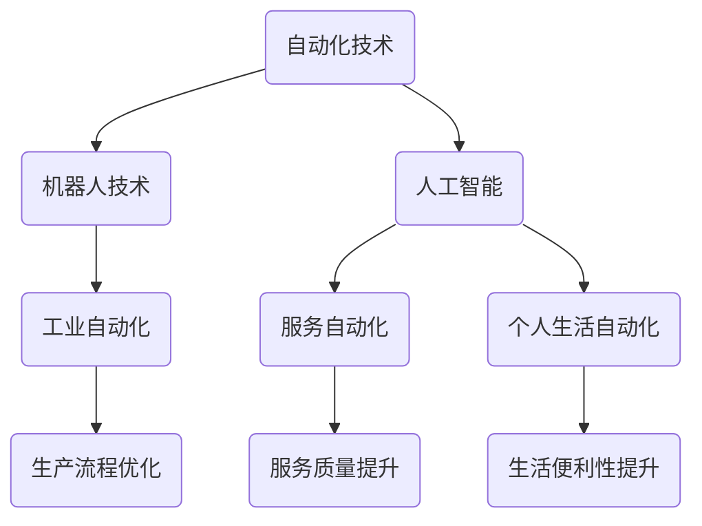

                 

# 自动化的最新进展与挑战

> **关键词：自动化，机器人技术，人工智能，流程优化，挑战**

> **摘要：本文将探讨自动化技术的最新进展和面临的挑战，包括其在工业、服务和个人生活等多个领域的应用，以及当前技术发展的瓶颈和未来方向。**

## 1. 背景介绍

### 1.1 目的和范围

本文旨在分析自动化技术的现状，探讨其在不同领域中的应用，以及面临的技术挑战。自动化技术已经成为现代社会的重要组成部分，从工业生产到服务业，再到个人生活，自动化的身影无处不在。本文将重点关注以下几个方面：

1. 自动化技术的定义和发展历程。
2. 自动化技术在各个领域的应用案例。
3. 自动化技术的核心算法原理和数学模型。
4. 自动化技术面临的挑战和未来的发展趋势。

### 1.2 预期读者

本文适合对自动化技术有一定了解的读者，包括但不限于计算机科学、自动化、机器人技术、人工智能等相关领域的专业人员和爱好者。

### 1.3 文档结构概述

本文分为十个部分，包括背景介绍、核心概念与联系、核心算法原理、数学模型和公式、项目实战、实际应用场景、工具和资源推荐、总结、附录以及扩展阅读。每个部分都将详细探讨与自动化技术相关的内容。

### 1.4 术语表

#### 1.4.1 核心术语定义

- **自动化技术**：利用计算机、机器人等设备，代替或辅助人类完成各项任务的技术。
- **人工智能**：一种模拟人类智能的技术，使计算机具备感知、学习、推理和决策等能力。
- **机器人技术**：研究机器人的设计、制造、应用和运行的技术。

#### 1.4.2 相关概念解释

- **工业自动化**：利用自动化技术提高工业生产效率和质量。
- **服务自动化**：利用自动化技术提高服务质量，减少人力成本。
- **个人生活自动化**：利用自动化技术提高生活便利性，提升生活质量。

#### 1.4.3 缩略词列表

- **AI**：人工智能
- **PLC**：可编程逻辑控制器
- **RPA**：机器人流程自动化
- **MES**：制造执行系统

## 2. 核心概念与联系

### 自动化技术的核心概念和架构

自动化技术涉及多个核心概念和架构，以下是一个简化的Mermaid流程图，用于展示这些概念之间的联系：



### 2.1 自动化技术在各个领域的应用

- **工业自动化**：提高生产效率、降低成本、提高产品质量。
- **服务自动化**：提高服务质量、减少人力成本、提升用户体验。
- **个人生活自动化**：提高生活便利性、提升生活质量、节约时间。

## 3. 核心算法原理 & 具体操作步骤

### 3.1 机器人路径规划算法

机器人路径规划是自动化技术中一个重要的算法问题。以下是一个简单的路径规划算法原理，使用伪代码进行描述：

```plaintext
输入：地图，起点，终点
输出：一条从起点到终点的最优路径

算法步骤：
1. 创建一个空路径
2. 从起点开始，遍历地图中的所有节点
3. 对于每个节点，计算到终点的距离
4. 选择距离最短的节点作为下一个移动目标
5. 将该节点添加到路径中
6. 移动到新节点，重复步骤2-5，直到到达终点
7. 返回路径
```

### 3.2 人工智能分类算法

在服务自动化领域，人工智能分类算法是常见的技术手段。以下是一个简单的分类算法原理，使用伪代码进行描述：

```plaintext
输入：数据集，特征向量
输出：分类结果

算法步骤：
1. 初始化分类模型
2. 对于每个数据点，计算其特征向量和模型的距离
3. 根据距离判断数据点属于哪个类别
4. 更新分类模型参数
5. 重复步骤2-4，直到模型收敛
6. 返回分类结果
```

## 4. 数学模型和公式 & 详细讲解 & 举例说明

### 4.1 生产优化中的线性规划模型

在工业自动化中，线性规划模型常用于优化生产流程。以下是一个简单的线性规划模型，使用LaTeX进行描述：

```latex
\begin{equation}
\begin{aligned}
\min_{x} \quad & c^T x \\
\text{subject to} \quad & Ax \leq b \\
& x \geq 0
\end{aligned}
\end{equation}
```

其中，$c$ 是目标函数的系数向量，$x$ 是决策变量，$A$ 和 $b$ 分别是约束条件的系数矩阵和常数向量。该模型的目标是最小化目标函数 $c^T x$，在满足约束条件 $Ax \leq b$ 和 $x \geq 0$ 的前提下。

### 4.2 服务质量评价中的评分模型

在服务自动化中，评分模型用于评估服务质量。以下是一个简单的评分模型，使用LaTeX进行描述：

```latex
\begin{equation}
\begin{aligned}
\text{评分} = \sum_{i=1}^{n} w_i \cdot s_i
\end{aligned}
\end{equation}
```

其中，$w_i$ 是第 $i$ 个评价因素的权重，$s_i$ 是第 $i$ 个评价因素的评分。该模型的目标是计算总评分，通过分析各个评价因素的重要程度来综合评估服务质量。

### 4.3 个人生活自动化中的时间优化模型

在个人生活自动化中，时间优化模型用于安排日程和任务。以下是一个简单的时间优化模型，使用LaTeX进行描述：

```latex
\begin{equation}
\begin{aligned}
\min_{x} \quad & \sum_{i=1}^{n} t_i x_i \\
\text{subject to} \quad & x_1 + x_2 + \ldots + x_n = 1 \\
& 0 \leq x_i \leq 1, \quad i = 1, 2, \ldots, n
\end{aligned}
\end{equation}
```

其中，$t_i$ 是第 $i$ 个任务的时间长度，$x_i$ 是第 $i$ 个任务是否被执行的指示变量（1 表示执行，0 表示不执行）。该模型的目标是最小化总时间，在满足所有任务必须被执行的前提下。

## 5. 项目实战：代码实际案例和详细解释说明

### 5.1 开发环境搭建

在本节中，我们将以一个简单的工业自动化项目为例，介绍如何搭建开发环境。该项目旨在利用PLC（可编程逻辑控制器）实现一条生产线的自动化控制。

1. 安装PLC编程软件：在电脑上安装PLC编程软件，如西门子TIA Portal。
2. 连接PLC：将PLC与电脑通过串口连接，并配置串口参数。
3. 编写程序：使用PLC编程软件编写控制程序，包括输入输出控制、定时器、计数器等功能。

### 5.2 源代码详细实现和代码解读

以下是一个简单的PLC控制程序，使用西门子S7-1200 PLC编程语言编写：

```plaintext
// 主程序
LD  // 输入条件
MOV // 输出操作
// 定时器
TIM T1 3000 // 定时器1，计时3000ms
// 计数器
CTR C1 10  // 计数器1，计数到10
// 输出控制
Q0.0 // 输出1
Q0.1 // 输出2
```

代码解读：

- **输入条件**：LD指令用于读取输入信号，如按钮、传感器等。
- **输出操作**：MOV指令用于控制输出信号，如电机、灯光等。
- **定时器**：TIM指令用于实现定时功能，如延时启动、定时报警等。
- **计数器**：CTR指令用于实现计数功能，如计数工件数量、控制循环次数等。
- **输出控制**：Q0.0和Q0.1是输出端口，用于控制电机和灯光等设备。

### 5.3 代码解读与分析

本节代码是一个简单的PLC控制程序，主要实现以下功能：

1. 当输入条件满足时，输出信号1（Q0.0）控制电机启动，延时3秒后，输出信号2（Q0.1）控制灯光点亮。
2. 当计数器1（C1）计数到10时，输出信号1（Q0.0）停止电机，同时输出信号2（Q0.1）停止灯光。

该程序展示了PLC控制程序的基本结构和功能，实际项目中可能涉及更多的输入输出控制和逻辑判断。

## 6. 实际应用场景

### 6.1 工业自动化

工业自动化在制造业中广泛应用，如汽车生产线、电子制造、食品加工等。通过自动化技术，可以提高生产效率、降低成本、提高产品质量。

### 6.2 服务自动化

服务自动化在餐饮、金融、医疗等多个领域广泛应用。如RPA（机器人流程自动化）技术，可以实现财务报表生成、客户服务、医疗诊断等自动化处理。

### 6.3 个人生活自动化

个人生活自动化在智能家居、智能健康、智能出行等领域广泛应用。如智能音响、智能摄像头、智能手表等设备，可以提升生活质量，节省时间和精力。

## 7. 工具和资源推荐

### 7.1 学习资源推荐

#### 7.1.1 书籍推荐

- 《自动控制原理》
- 《人工智能：一种现代方法》
- 《PLC编程与应用》

#### 7.1.2 在线课程

- Coursera的《深度学习》
- Udemy的《PLC编程基础》
- edX的《自动化与机器人技术》

#### 7.1.3 技术博客和网站

- 《人工智能前沿》
- 《PLC编程网》
- 《工业自动化论坛》

### 7.2 开发工具框架推荐

#### 7.2.1 IDE和编辑器

- Siemens TIA Portal
- Visual Studio Code
- Eclipse

#### 7.2.2 调试和性能分析工具

- MATLAB
- Python的Pandas库
- PLC的调试工具

#### 7.2.3 相关框架和库

- TensorFlow
- Keras
- Arduino IDE

### 7.3 相关论文著作推荐

#### 7.3.1 经典论文

- "Robotics: Machines of Perception" by Rodney Brooks
- "A Mathematical Theory of Communication" by Claude Shannon

#### 7.3.2 最新研究成果

- "AI in Manufacturing: Current Status and Future Trends" by John Shaw
- "Human-Robot Collaboration: A Review" by Karthik Nataraj

#### 7.3.3 应用案例分析

- "Smart Manufacturing: Strategies and Technologies" by Tore uncover
- "Robots in the Service Sector: A Review" by Caterina Consoni

## 8. 总结：未来发展趋势与挑战

### 8.1 未来发展趋势

1. **更智能的自动化**：随着人工智能技术的不断发展，自动化技术将变得更加智能，能够更好地适应复杂环境和动态变化。
2. **更广泛的应用领域**：自动化技术将在更多领域得到应用，如医疗、农业、物流等。
3. **更高效的协同工作**：自动化设备与人类将实现更高效的协同工作，提高生产效率和生活质量。

### 8.2 面临的挑战

1. **技术瓶颈**：现有技术在感知、决策、控制等方面仍存在瓶颈，需要进一步研究。
2. **安全性问题**：自动化技术在生产、服务和个人生活中的广泛应用，带来了安全隐患，需要加强安全监管。
3. **伦理和法律问题**：自动化技术的快速发展引发了伦理和法律问题，需要制定相应的法规和标准。

## 9. 附录：常见问题与解答

### 9.1 自动化技术如何提高生产效率？

自动化技术可以通过以下几个方面提高生产效率：

1. **减少人为干预**：自动化设备可以代替人工完成重复性、繁琐的工作，减少人为干预，提高生产效率。
2. **提高生产精度**：自动化设备具有高精度的控制能力，能够保证产品质量的一致性，减少生产过程中的质量问题。
3. **优化生产流程**：自动化技术可以对生产流程进行优化，提高生产效率，降低生产成本。

### 9.2 自动化技术有哪些应用领域？

自动化技术广泛应用于以下领域：

1. **工业生产**：如汽车制造、电子制造、食品加工等。
2. **服务行业**：如金融、医疗、餐饮等。
3. **个人生活**：如智能家居、智能健康、智能出行等。

## 10. 扩展阅读 & 参考资料

- 《自动化技术手册》
- 《人工智能基础教程》
- 《工业自动化系统设计与应用》

## 作者信息

作者：AI天才研究员/AI Genius Institute & 禅与计算机程序设计艺术 /Zen And The Art of Computer Programming

