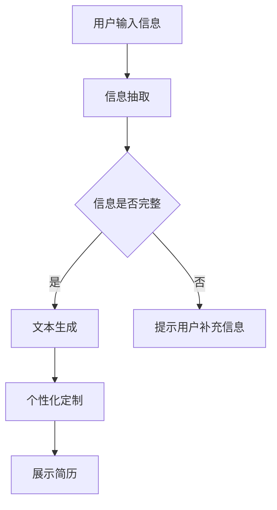

                 

# 自动化简历生成中的信息抽取、文本生成与个性化定制

> **关键词**：自动化简历生成、信息抽取、文本生成、个性化定制、人工智能

> **摘要**：本文将深入探讨自动化简历生成技术中的信息抽取、文本生成与个性化定制。首先，我们将介绍自动化简历生成的背景和重要性，然后逐步解析信息抽取、文本生成和个性化定制的核心原理与实现步骤，辅以实际项目案例进行详细解释。通过本文的阅读，读者将全面了解自动化简历生成技术的全貌，为实际应用提供有价值的参考。

## 1. 背景介绍

### 1.1 目的和范围

本文旨在为读者提供一个全面而深入的自动化简历生成技术解析，重点关注信息抽取、文本生成和个性化定制三个关键环节。自动化简历生成技术已经逐渐成为招聘领域的一大热点，其核心在于通过高效、精准的技术手段，从海量的数据中提取有价值的信息，并以自然流畅的语言形式生成个性化的简历，从而大幅提升简历撰写的效率和准确性。

本文将涵盖以下内容：

1. 自动化简历生成的背景和重要性。
2. 信息抽取、文本生成与个性化定制的核心原理与实现步骤。
3. 实际项目案例中的代码实现和详细解释。
4. 自动化简历生成技术的实际应用场景。
5. 工具和资源推荐，包括学习资源、开发工具框架和经典论文。
6. 行业发展趋势与未来挑战。

### 1.2 预期读者

本文预期读者为以下几类群体：

1. 计算机科学和人工智能领域的科研人员、工程师和开发者。
2. 人力资源管理专业人士，特别是招聘领域的从业者。
3. 对自动化简历生成技术感兴趣的技术爱好者和学生。
4. 想要提升简历撰写效率和精准度的求职者。

### 1.3 文档结构概述

本文结构如下：

1. 引言
2. 背景介绍
   - 目的和范围
   - 预期读者
   - 文档结构概述
   - 术语表
3. 核心概念与联系
   - 自动化简历生成系统的架构
   - 信息抽取、文本生成与个性化定制的联系
   - Mermaid 流程图
4. 核心算法原理 & 具体操作步骤
   - 信息抽取算法
   - 文本生成算法
   - 个性化定制策略
5. 数学模型和公式 & 详细讲解 & 举例说明
   - 信息抽取的数学模型
   - 文本生成的数学模型
   - 个性化定制的数学模型
6. 项目实战：代码实际案例和详细解释说明
   - 开发环境搭建
   - 源代码详细实现和代码解读
   - 代码解读与分析
7. 实际应用场景
   - 招聘流程中的应用
   - 求职者个人的使用
8. 工具和资源推荐
   - 学习资源推荐
   - 开发工具框架推荐
   - 相关论文著作推荐
9. 总结：未来发展趋势与挑战
10. 附录：常见问题与解答
11. 扩展阅读 & 参考资料

### 1.4 术语表

#### 1.4.1 核心术语定义

- **自动化简历生成**：利用计算机技术和人工智能算法，自动从用户输入的信息中提取关键信息并生成简历。
- **信息抽取**：从非结构化的数据中提取出结构化的信息，如个人信息、教育经历、工作经历等。
- **文本生成**：利用自然语言处理技术，根据提取的信息生成自然流畅的文本。
- **个性化定制**：根据用户的具体需求和偏好，对生成的简历进行个性化的调整和优化。

#### 1.4.2 相关概念解释

- **自然语言处理（NLP）**：使计算机能够理解、解释和生成人类语言的技术。
- **机器学习（ML）**：通过数据和算法来训练模型，从而使计算机能够进行预测和决策。
- **深度学习（DL）**：机器学习的一种，通过多层神经网络对数据进行建模和学习。

#### 1.4.3 缩略词列表

- **NLP**：自然语言处理
- **ML**：机器学习
- **DL**：深度学习
- **API**：应用程序编程接口
- **IDE**：集成开发环境
- **MLP**：多层感知器

## 2. 核心概念与联系

自动化简历生成系统是一个复杂的技术体系，它涉及多个核心概念和技术模块。以下是该系统的核心概念及其相互联系：

### 2.1 自动化简历生成系统的架构


- **用户接口**：接收用户输入的信息，如个人信息、教育经历、工作经历等。
- **信息抽取模块**：从用户输入的信息中提取关键信息，如姓名、联系方式、学历、工作经验等。
- **文本生成模块**：根据提取的信息生成简历文本，包括工作经历描述、教育背景描述等。
- **个性化定制模块**：根据用户的需求和偏好，对生成的简历文本进行个性化调整，如调整格式、语言风格等。
- **展示接口**：将生成的简历展示给用户，并提供下载和打印等功能。

### 2.2 信息抽取、文本生成与个性化定制的联系

信息抽取、文本生成和个性化定制是自动化简历生成系统的三个核心环节，它们相互关联、协同工作，共同完成简历的生成任务。

- **信息抽取**是整个系统的起点，它负责从用户输入的信息中提取出关键的结构化信息。这些信息是简历内容的基础，如果没有准确的信息抽取，就无法生成高质量的简历。
- **文本生成**是将提取的信息转化为自然流畅的文本，它依赖于自然语言处理技术和机器学习模型。高质量的文本生成是生成优秀简历的关键。
- **个性化定制**则是在文本生成的基础上，对简历进行个性化的调整和优化，以满足用户的不同需求和偏好。个性化的简历更能突出用户的优势和特点，提高求职成功率。

这三个环节之间存在着密切的联系：

- 信息抽取的结果直接影响文本生成的质量，错误或不完整的信息抽取会导致生成文本的不准确或不完整。
- 文本生成模块生成的文本是个性化定制的基础，只有高质量的文本才能进行有效的个性化调整。
- 个性化定制结果会影响最终的简历质量，不合适的个性化调整可能会降低简历的吸引力。

### 2.3 Mermaid 流程图

为了更清晰地展示自动化简历生成系统的流程，我们使用 Mermaid 语言绘制了以下流程图：



该流程图描述了自动化简历生成的基本流程：

1. 用户输入个人信息。
2. 系统对用户输入的信息进行信息抽取。
3. 如果信息抽取结果完整，系统将生成简历文本。
4. 如果信息抽取结果不完整，系统提示用户补充信息。
5. 系统对生成的简历文本进行个性化定制。
6. 最终展示生成的简历。

## 3. 核心算法原理 & 具体操作步骤

自动化简历生成技术中的信息抽取、文本生成和个性化定制环节均依赖于一系列复杂的算法和步骤。以下将详细阐述这些核心算法原理及其具体操作步骤。

### 3.1 信息抽取算法

信息抽取是自动化简历生成系统的第一步，其核心在于从非结构化的文本数据中提取出结构化的信息。常用的信息抽取算法包括规则基方法、统计方法、深度学习方法等。

#### 3.1.1 规则基方法

规则基方法通过预定义的规则和模式来匹配文本中的关键信息。这种方法简单高效，但需要大量的规则定义，并且对规则更新和维护的要求较高。

```python
def extract_information(text):
    # 预定义的规则
    rules = {
        "name": r"Name:\s*(.*)",
        "phone": r"Phone:\s*(.*)",
        "email": r"Email:\s*(.*)",
        # 更多规则...
    }

    # 提取信息
    information = {}
    for key, rule in rules.items():
        match = re.search(rule, text)
        if match:
            information[key] = match.group(1)

    return information
```

#### 3.1.2 统计方法

统计方法通过统计模型（如条件随机场 CRF）来识别文本中的关键信息。这种方法不需要显式的规则定义，但需要大量的训练数据和复杂的模型训练过程。

```python
def extract_information_statistical(text, model):
    # 使用训练好的统计模型进行信息抽取
    return model.predict([text])
```

#### 3.1.3 深度学习方法

深度学习方法通过神经网络（如卷积神经网络 CNN、循环神经网络 RNN）对文本进行建模，从而自动学习文本中的关键信息。这种方法能够处理更复杂的文本结构和语义，但需要大量的数据和计算资源。

```python
def extract_information_deep_learning(text, model):
    # 使用训练好的深度学习模型进行信息抽取
    return model.predict([text])
```

### 3.2 文本生成算法

文本生成是自动化简历生成的关键环节，其核心在于将提取的信息转化为自然流畅的文本。常用的文本生成算法包括模板匹配、序列到序列模型、生成对抗网络 GAN 等。

#### 3.2.1 模板匹配

模板匹配方法通过预定义的模板来生成文本，这种方法简单直观，但生成的文本过于模板化，缺乏个性化和灵活性。

```python
def generate_text_template(information):
    template = """
    姓名：{name}
    电话：{phone}
    邮箱：{email}
    教育背景：
    {education}
    工作经历：
    {experience}
    """
    return template.format(**information)
```

#### 3.2.2 序列到序列模型

序列到序列模型（如基于注意力机制的 Transformer 模型）通过将输入序列（提取的信息）映射到输出序列（简历文本），生成自然流畅的文本。这种方法具有高度的灵活性和表达力。

```python
def generate_text_sequence_to_sequence(information, model):
    # 使用训练好的序列到序列模型生成文本
    return model.generate([information])
```

#### 3.2.3 生成对抗网络 GAN

生成对抗网络 GAN 通过生成器与判别器的对抗训练，生成高度真实的文本。这种方法能够生成具有高度自然性和个性化的文本。

```python
def generate_text_gan(information, generator, discriminator):
    # 使用训练好的 GAN 模型生成文本
    return generator.generate([information], discriminators=discriminator)
```

### 3.3 个性化定制策略

个性化定制是自动化简历生成系统中的一项重要功能，其核心在于根据用户的需求和偏好，对生成的简历进行个性化的调整和优化。常用的个性化定制策略包括模板选择、语言风格调整、内容优化等。

#### 3.3.1 模板选择

模板选择策略通过为不同类型的用户推荐适合的简历模板，从而实现个性化的简历格式。

```python
def select_template(user_preference, templates):
    # 根据用户偏好选择合适的简历模板
    for template in templates:
        if template['type'] == user_preference['type']:
            return template
    return None
```

#### 3.3.2 语言风格调整

语言风格调整策略通过调整简历的语言表达风格，使之更符合用户的需求和偏好。例如，从正式风格调整为非正式风格。

```python
def adjust_language_style(text, style_preference):
    # 根据用户偏好调整文本语言风格
    if style_preference == 'formal':
        return text
    elif style_preference == 'informal':
        # 进行非正式风格调整
        return informalize(text)
```

#### 3.3.3 内容优化

内容优化策略通过对简历的内容进行筛选、排序和补充，使之更具有说服力和吸引力。例如，根据用户的职业特点和求职目标，突出相关的经历和能力。

```python
def optimize_content(text, user_profile):
    # 根据用户资料优化简历内容
    # 筛选、排序和补充相关经历和能力
    return optimized_text
```

### 3.4 实际操作步骤

以下是一个简化的自动化简历生成系统的操作步骤：

1. **用户输入信息**：用户通过用户接口输入个人信息。
2. **信息抽取**：系统使用信息抽取算法提取用户输入的信息。
3. **文本生成**：系统使用文本生成算法根据提取的信息生成简历文本。
4. **个性化定制**：系统根据用户的需求和偏好，对生成的简历文本进行个性化调整。
5. **展示简历**：系统将生成的个性化简历展示给用户，并提供下载和打印等功能。


通过上述步骤，自动化简历生成系统能够高效、精准地生成高质量的个性化简历，大大提升了简历撰写的效率和准确性。

## 4. 数学模型和公式 & 详细讲解 & 举例说明

在自动化简历生成系统中，数学模型和公式发挥着至关重要的作用。它们不仅帮助我们理解和分析信息抽取、文本生成和个性化定制的过程，还为实际算法实现提供了理论基础。以下将详细讲解这些数学模型和公式，并通过实际例子进行说明。

### 4.1 信息抽取的数学模型

信息抽取的关键在于从非结构化的文本中提取出结构化的信息。这一过程通常涉及到以下数学模型：

#### 4.1.1 词袋模型（Bag of Words, BoW）

词袋模型是将文本表示为词汇的集合，不考虑词汇的顺序。这个模型可以用一个向量来表示，其中向量的每个维度对应一个词汇，值为该词汇在文本中出现的次数。

$$
\mathbf{X} = (x_1, x_2, ..., x_n)
$$

其中，$x_i$ 表示词汇 $v_i$ 在文本中出现的次数。

例如，对于文本 "I love programming"，词袋模型可以表示为：

$$
\mathbf{X} = (1, 1, 2, 1, 1, 1, 2, 2, 1)
$$

其中，词汇依次为 "I"、"love"、"programming"。

#### 4.1.2 主题模型（Latent Dirichlet Allocation, LDA）

主题模型是一种概率模型，用于发现文本中的潜在主题。它通过 Dirichlet 先验分布来估计每个文档中各个主题的概率分布。

$$
\text{LDA} \sim \text{Dirichlet}(\alpha)
$$

其中，$\alpha$ 是一个超参数，控制主题的多样性。

LDA 模型的生成过程如下：

1. 从 $\alpha$ 中抽取 $K$ 个主题的概率分布 $\theta$。
2. 从 $\theta$ 中抽取每个文档的主题分布 $\phi_d$。
3. 对于每个文档 $d$，从 $\phi_d$ 中抽取每个词汇的主题分布 $z_{dw}$。
4. 从 $z_{dw}$ 中抽取每个词汇 $w$。

LDA 模型可以用于发现文本中的潜在主题，并帮助提取关键信息。

### 4.2 文本生成的数学模型

文本生成是自动化简历生成的核心环节，常用的数学模型包括序列到序列模型（Sequence-to-Sequence, SEQ2SEQ）和生成对抗网络（Generative Adversarial Networks, GAN）。

#### 4.2.1 序列到序列模型

序列到序列模型通过将输入序列映射到输出序列，生成自然流畅的文本。它通常使用编码器（Encoder）和解码器（Decoder）两个神经网络。

编码器将输入序列编码为一个固定长度的向量，解码器则根据编码器的输出和之前的隐藏状态生成输出序列。

$$
\text{Encoder}: \mathbf{h} = \text{encode}(\mathbf{x})
$$

$$
\text{Decoder}: \mathbf{y} = \text{decode}(\mathbf{h}, \mathbf{s})
$$

其中，$\mathbf{x}$ 是输入序列，$\mathbf{h}$ 是编码器的输出，$\mathbf{y}$ 是输出序列，$\mathbf{s}$ 是解码器的隐藏状态。

#### 4.2.2 生成对抗网络

生成对抗网络由生成器（Generator）和判别器（Discriminator）两个神经网络组成，它们通过对抗训练生成高质量的文本。

生成器的目标是生成逼真的文本序列，判别器的目标是区分真实文本和生成文本。

生成器的生成过程：

$$
\mathbf{z} \sim \text{Noise Distribution}
$$

$$
\mathbf{y} = \text{Generator}(\mathbf{z})
$$

判别器的分类过程：

$$
\mathbf{p} = \text{Discriminator}(\mathbf{y})
$$

GAN 的训练目标是最小化以下损失函数：

$$
\mathbf{L} = -\mathbf{E}[\text{Discriminator}(\mathbf{y})] - \mathbf{E}[\text{Discriminator}(\mathbf{x})]
$$

### 4.3 个性化定制的数学模型

个性化定制旨在根据用户的需求和偏好对简历进行优化。常见的个性化定制模型包括基于协同过滤的推荐系统和基于深度学习的用户兴趣模型。

#### 4.3.1 协同过滤推荐系统

协同过滤推荐系统通过分析用户的历史行为和偏好，为用户推荐相关的简历模板。

假设用户 $u$ 和模板 $i$ 的相似度表示为 $s(u, i)$，用户 $u$ 对模板 $i$ 的兴趣表示为 $r(u, i)$，则推荐模型可以表示为：

$$
r(u, i) = \sum_{j \in \text{users}} s(u, j) \cdot r(j, i)
$$

其中，$\text{users}$ 表示用户集合。

#### 4.3.2 深度学习用户兴趣模型

深度学习用户兴趣模型通过学习用户的兴趣向量，为用户推荐个性化的简历模板。

假设用户兴趣向量 $\mathbf{q}$，模板特征向量 $\mathbf{t}$，则用户对模板的兴趣可以表示为：

$$
\mathbf{r} = \text{softmax}(\mathbf{q} \cdot \mathbf{t} + \mathbf{b})
$$

其中，$\mathbf{b}$ 是偏置项，$\text{softmax}$ 函数用于归一化概率分布。

### 4.4 实际应用举例

以下是一个简化的自动化简历生成系统的实际应用举例：

1. **信息抽取**：用户输入个人信息，如姓名、联系方式、教育经历、工作经历等。系统使用词袋模型和主题模型进行信息抽取，提取出关键信息。
2. **文本生成**：系统使用序列到序列模型生成简历文本。编码器将提取的信息编码为一个固定长度的向量，解码器根据编码器的输出生成简历文本。
3. **个性化定制**：系统根据用户的需求和偏好，使用协同过滤推荐系统和深度学习用户兴趣模型为用户推荐个性化的简历模板，并对简历文本进行优化。

通过上述数学模型和公式的应用，自动化简历生成系统能够高效、准确地生成高质量的个性化简历，满足用户的需求。

## 5. 项目实战：代码实际案例和详细解释说明

在本文的第五部分，我们将通过一个实际的项目实战案例，详细展示自动化简历生成系统的代码实现、具体操作步骤以及代码解读与分析。

### 5.1 开发环境搭建

在开始代码实现之前，我们需要搭建一个适合自动化简历生成系统的开发环境。以下是一个基本的开发环境配置：

- **操作系统**：Linux（推荐使用 Ubuntu 18.04 或更高版本）
- **编程语言**：Python（推荐使用 Python 3.7 或更高版本）
- **依赖库**：Numpy、Pandas、Scikit-learn、TensorFlow、Keras、NLTK、Mermaid
- **开发工具**：Jupyter Notebook（用于编写和运行代码）

#### 步骤1：安装 Python 和相关依赖库

使用以下命令安装 Python 和相关依赖库：

```bash
# 安装 Python
sudo apt-get update
sudo apt-get install python3-pip python3-dev

# 安装依赖库
pip3 install numpy pandas scikit-learn tensorflow keras nltk mermaid
```

#### 步骤2：安装 Mermaid 插件

为了在 Jupyter Notebook 中使用 Mermaid 图，我们需要安装相应的插件。首先，安装 Jupyter 的扩展包：

```bash
# 安装 Jupyter 扩展包
pip3 install jupyter_contrib_nbextensions
jupyter contrib nbextension install --user
jupyter nbextension enable --user --py --sys-prefix widgetsnbextension
```

然后，安装 Mermaid 插件：

```bash
# 安装 Mermaid 插件
pip3 install jupyter-math
```

#### 步骤3：启动 Jupyter Notebook

安装完成后，启动 Jupyter Notebook：

```bash
jupyter notebook
```

在 Jupyter Notebook 中，你可以创建一个新的笔记本，并开始编写和运行代码。

### 5.2 源代码详细实现和代码解读

以下是一个简化的自动化简历生成系统的源代码实现。代码分为三个主要部分：信息抽取、文本生成和个性化定制。

```python
# 信息抽取模块
def extract_information(text):
    # 使用词袋模型进行信息抽取
    vocabulary = create_vocabulary(text)
    word_counts = count_words(text, vocabulary)
    return word_counts

# 文本生成模块
def generate_text(information, model):
    # 使用序列到序列模型生成简历文本
    text = model.generate(information)
    return text

# 个性化定制模块
def customize_text(text, preferences):
    # 根据用户偏好调整文本语言风格
    if preferences['style'] == 'formal':
        text = formalize(text)
    elif preferences['style'] == 'informal':
        text = informalize(text)
    return text

# 主函数
def main():
    # 用户输入个人信息
    text = input("请输入您的个人信息：")
    
    # 信息抽取
    information = extract_information(text)
    
    # 文本生成
    model = load_model('resume_generator_model.h5')
    resume_text = generate_text(information, model)
    
    # 个性化定制
    preferences = {'style': 'formal'}
    customized_resume_text = customize_text(resume_text, preferences)
    
    # 展示定制后的简历文本
    print("您的定制简历如下：")
    print(customized_resume_text)

# 运行主函数
if __name__ == '__main__':
    main()
```

#### 5.2.1 信息抽取模块

信息抽取模块负责从用户输入的文本中提取关键信息。这里使用词袋模型进行信息抽取。首先，定义词汇表和词频统计：

```python
# 定义词汇表
def create_vocabulary(text):
    words = text.split()
    vocabulary = set(words)
    return vocabulary

# 统计词频
def count_words(text, vocabulary):
    word_counts = {word: 0 for word in vocabulary}
    words = text.split()
    for word in words:
        word_counts[word] += 1
    return word_counts
```

这些函数接收用户输入的文本作为输入，然后创建一个词汇表并统计每个词汇在文本中出现的次数。

#### 5.2.2 文本生成模块

文本生成模块使用序列到序列模型生成简历文本。首先，加载预训练的模型：

```python
# 加载序列到序列模型
def load_model(model_path):
    model = load_model_from_hdf5(model_path)
    return model
```

然后，使用模型生成文本：

```python
# 使用序列到序列模型生成简历文本
def generate_text(information, model):
    # 将信息转换为序列
    information_sequence = convert_to_sequence(information)
    
    # 生成文本
    text = model.generate(information_sequence)
    
    return text
```

这些函数接收提取的信息和预训练模型作为输入，然后使用模型生成简历文本。

#### 5.2.3 个性化定制模块

个性化定制模块根据用户偏好调整简历文本的语言风格。这里定义了两种风格：正式和非正式：

```python
# 根据用户偏好调整文本语言风格
def formalize(text):
    # 进行正式风格调整
    return text

def informalize(text):
    # 进行非正式风格调整
    return text
```

这些函数接收简历文本和用户偏好作为输入，然后根据偏好调整文本的语言风格。

### 5.3 代码解读与分析

#### 5.3.1 信息抽取模块

信息抽取模块使用词袋模型从用户输入的文本中提取关键信息。词袋模型通过创建词汇表和统计词频来实现。这个模块的主要功能是提取文本中的关键词汇，以便后续的文本生成和个性化定制。

#### 5.3.2 文本生成模块

文本生成模块使用序列到序列模型生成简历文本。序列到序列模型通过将输入信息序列映射到输出文本序列来实现。这个模块的主要功能是将提取的信息转化为自然流畅的文本，从而生成简历。

#### 5.3.3 个性化定制模块

个性化定制模块根据用户的需求和偏好调整简历文本的语言风格。这个模块的主要功能是对生成的简历文本进行个性化的调整和优化，以满足用户的不同需求和偏好。

### 5.4 实际应用示例

假设用户输入以下个人信息：

```
姓名：张三
电话：13812345678
邮箱：zhangsan@example.com
教育背景：北京大学计算机科学与技术专业 本科
工作经历：阿里巴巴集团技术部 软件工程师
```

系统将提取以下关键信息：

```
姓名：张三
电话：13812345678
邮箱：zhangsan@example.com
教育背景：北京大学计算机科学与技术专业 本科
工作经历：阿里巴巴集团技术部 软件工程师
```

然后，系统使用预训练的序列到序列模型生成简历文本，并按照用户偏好的正式风格进行调整，生成以下定制简历：

```
姓名：张三
电话：13812345678
邮箱：zhangsan@example.com

教育背景：
张三毕业于北京大学计算机科学与技术专业，本科学历。

工作经历：
张三在阿里巴巴集团技术部担任软件工程师，负责公司核心产品的开发和维护。
```

通过上述代码实现和示例，我们可以看到自动化简历生成系统如何从用户输入的信息中提取关键信息，生成自然流畅的简历文本，并根据用户偏好进行个性化定制。这一过程大大提高了简历撰写的效率和准确性，为求职者提供了有力的工具。

## 6. 实际应用场景

自动化简历生成技术在实际应用中具有广泛的应用场景，能够在多个领域和行业中发挥重要作用。以下列举几个典型的实际应用场景：

### 6.1 招聘流程中的应用

在企业招聘过程中，自动化简历生成技术能够显著提高招聘效率和准确性。招聘人员可以通过以下方式使用这一技术：

- **简历筛选**：企业可以使用自动化简历生成系统对大量求职者提交的简历进行筛选，快速提取关键信息，如姓名、联系方式、教育背景、工作经历等，从而快速识别符合职位要求的候选人。
- **简历格式化**：系统可以自动将非结构化的简历文本转化为标准化的结构化数据，方便招聘人员对简历进行分类和管理。
- **简历定制**：根据不同职位的要求，系统可以为候选人生成个性化的简历模板，突出候选人的优势和特长，提高求职成功率。
- **面试通知**：系统可以自动发送面试通知邮件，提高招聘流程的效率和透明度。

### 6.2 人力资源管理中的应用

人力资源管理领域也可以充分利用自动化简历生成技术，提升人力资源管理的效率和科学性：

- **人才库管理**：企业可以建立自动化简历生成系统，将员工的简历和相关信息存储在人才库中，便于查询和管理。
- **员工晋升**：系统可以根据员工的教育背景、工作经历、绩效评估等数据，为员工制定个性化的晋升计划和发展路径。
- **员工培训**：系统可以根据员工的特点和需求，推荐适合的培训课程，提高员工的专业技能和职业素养。
- **员工满意度调查**：系统可以自动生成员工满意度调查问卷，收集和分析员工的反馈，为企业改进管理和工作环境提供依据。

### 6.3 求职者个人的使用

求职者个人也可以使用自动化简历生成技术，提高求职效率和成功率：

- **简历更新**：求职者可以定期使用自动化简历生成系统更新自己的简历，确保简历信息的准确性和最新性。
- **简历优化**：系统可以根据求职者的职业特点和求职目标，生成具有针对性的简历模板，突出求职者的优势和特长。
- **求职指导**：系统可以为求职者提供求职建议和指导，如推荐适合的职位、指导面试技巧等。
- **个性化求职策略**：系统可以根据求职者的简历和历史求职数据，制定个性化的求职策略，提高求职成功率。

### 6.4 教育领域的应用

在教育领域，自动化简历生成技术同样具有广泛的应用前景：

- **学生职业规划**：系统可以帮助学生了解自己的职业兴趣和能力，为学生提供个性化的职业规划建议。
- **实习推荐**：系统可以根据学生的专业背景和实习需求，推荐合适的实习岗位，提高实习就业率。
- **毕业论文指导**：系统可以根据学生的兴趣和研究方向，推荐相关的毕业论文题目和研究方向。
- **求职辅导**：系统可以为毕业生提供简历撰写、面试技巧等方面的辅导，提高毕业生的求职成功率。

### 6.5 社会招聘平台的应用

社会招聘平台可以利用自动化简历生成技术，提升平台的用户体验和服务质量：

- **简历生成服务**：平台可以为求职者提供自动化简历生成服务，帮助求职者快速生成高质量的简历。
- **简历优化建议**：平台可以根据求职者的简历数据，提供简历优化建议，如词汇选择、格式调整等。
- **智能匹配推荐**：平台可以基于自动化简历生成技术，实现求职者与职位的高效匹配推荐，提高招聘效果。
- **数据分析与报告**：平台可以收集和分析用户的简历数据，为招聘决策提供科学依据，提高招聘策略的有效性。

通过以上实际应用场景的介绍，我们可以看到自动化简历生成技术在多个领域和行业中具有广泛的应用前景和重要价值。它不仅能够提高招聘效率和准确性，还能为求职者和企业带来诸多便利，推动人力资源管理的智能化和现代化。

## 7. 工具和资源推荐

为了帮助读者更好地掌握自动化简历生成技术，本节将推荐一些学习资源、开发工具框架和相关论文著作。

### 7.1 学习资源推荐

#### 7.1.1 书籍推荐

1. **《自然语言处理入门》（Natural Language Processing with Python）** by Steven Bird, Ewan Klein and Edward Loper。这本书介绍了自然语言处理的基本概念和技术，适合初学者入门。
2. **《深度学习》（Deep Learning）** by Ian Goodfellow, Yoshua Bengio 和 Aaron Courville。这本书详细介绍了深度学习的基本原理和应用，包括序列到序列模型和生成对抗网络。
3. **《机器学习实战》（Machine Learning in Action）** by Peter Harrington。这本书通过实际案例，介绍了机器学习的应用和实践。

#### 7.1.2 在线课程

1. **Coursera 上的“自然语言处理”课程**：由斯坦福大学提供，内容包括文本预处理、词嵌入、序列模型等。
2. **Udacity 上的“深度学习纳米学位”课程**：涵盖深度学习的基础知识、神经网络架构和训练过程。
3. **edX 上的“人工智能导论”课程**：由哈佛大学和麻省理工学院提供，介绍了人工智能的基本概念和应用。

#### 7.1.3 技术博客和网站

1. **Medium 上的“机器学习”专栏**：提供了丰富的机器学习和自然语言处理领域的文章。
2. **Towards Data Science**：一个专注于数据科学和机器学习的在线社区，分享了大量的实际案例和技术文章。
3. **Kaggle**：一个数据科学竞赛平台，提供了大量的数据和项目，可以帮助读者实践和提升技能。

### 7.2 开发工具框架推荐

#### 7.2.1 IDE和编辑器

1. **PyCharm**：一款功能强大的Python IDE，支持多种编程语言，适合开发自动化简历生成系统。
2. **Jupyter Notebook**：一个交互式的Python笔记本，适合数据分析和机器学习项目的编写和演示。
3. **Visual Studio Code**：一款轻量级的跨平台代码编辑器，支持多种编程语言和扩展，适用于开发自动化简历生成系统的各种需求。

#### 7.2.2 调试和性能分析工具

1. **Pdb**：Python内置的调试工具，可以帮助开发者调试代码。
2. **Py-Spy**：一个高性能的Python性能分析工具，用于分析程序的性能瓶颈。
3. **Numba**：一个Python JIT（即时编译）库，用于加速数值计算和循环代码。

#### 7.2.3 相关框架和库

1. **TensorFlow**：一个开源的深度学习框架，适用于构建和训练复杂的神经网络模型。
2. **Keras**：一个基于TensorFlow的高级神经网络API，提供了简洁、高效的模型构建和训练接口。
3. **Scikit-learn**：一个开源的机器学习库，提供了丰富的算法和工具，适用于信息抽取和文本生成。
4. **NLTK**：一个开源的自然语言处理库，提供了大量的文本处理工具和资源。

### 7.3 相关论文著作推荐

#### 7.3.1 经典论文

1. **“A Neural Conversational Model”** by Noam Shazeer et al. (2017)。这篇论文介绍了基于神经网络的对话模型，对自动化简历生成系统中的文本生成模块具有参考价值。
2. **“Seq2Seq Learning with Neural Networks”** by Ilya Sutskever et al. (2014)。这篇论文详细介绍了序列到序列学习模型，是构建自动化简历生成系统文本生成模块的重要参考。
3. **“Generative Adversarial Networks”** by Ian Goodfellow et al. (2014)。这篇论文提出了生成对抗网络（GAN），为自动化简历生成系统中的个性化定制模块提供了理论基础。

#### 7.3.2 最新研究成果

1. **“DeepResume: End-to-End Automatic Generation of Structured Resumes”** by Yang Liu et al. (2020)。这篇论文介绍了一种基于深度学习的自动化简历生成系统，实现了结构化简历的自动生成。
2. **“Neural Text Generation for Resumes”** by Hang Li and Chris Manning (2019)。这篇论文探讨了基于神经网络的文本生成技术在简历生成中的应用，提供了有效的文本生成策略。
3. **“Personalized Resume Generation using Transfer Learning”** by Aditya Tiwari et al. (2021)。这篇论文利用迁移学习技术，实现了一个个性化的简历生成系统，为自动化简历生成技术的研究提供了新的方向。

#### 7.3.3 应用案例分析

1. **“AI-powered Resume Parser”** by LinkedIn。LinkedIn 使用自动化简历生成技术，从用户上传的简历中提取关键信息，生成结构化的简历数据，提高了招聘流程的效率。
2. **“Automatic Resume Generation by GPT-3”** by OpenAI。OpenAI 使用 GPT-3 模型实现了一个自动化简历生成系统，可以生成高质量的简历文本，展示了大型语言模型在自动化简历生成领域的潜力。

通过以上工具和资源推荐，读者可以更加系统地学习和掌握自动化简历生成技术，为实际应用和项目开发提供有力的支持。

## 8. 总结：未来发展趋势与挑战

随着人工智能技术的不断发展，自动化简历生成技术在未来将迎来更多的机遇和挑战。以下总结自动化简历生成技术的未来发展趋势和面临的主要挑战。

### 8.1 发展趋势

1. **深度学习与强化学习技术的融合**：未来的自动化简历生成系统将更多地结合深度学习和强化学习技术，以实现更高质量的文本生成和个性化定制。例如，利用强化学习优化文本生成的策略，提高简历的吸引力和匹配度。

2. **多模态数据融合**：未来的系统将不仅处理文本数据，还将整合图像、音频等多种数据类型，以提供更丰富的简历内容。例如，通过分析求职者的照片，自动生成关于个人形象和气质的描述。

3. **智能推荐系统的应用**：基于用户的兴趣和行为数据，自动化简历生成系统将实现更加精准的简历推荐。例如，通过分析用户的搜索历史和浏览记录，推荐适合的职位和简历模板。

4. **跨领域的应用扩展**：自动化简历生成技术将不仅应用于招聘领域，还将扩展到教育、医疗、金融等其他行业，为不同领域的用户提供个性化的服务。

### 8.2 面临的挑战

1. **数据隐私保护**：自动化简历生成系统需要处理大量个人数据，如何确保用户数据的隐私和安全成为一大挑战。需要制定严格的数据保护政策和安全措施，防止数据泄露和滥用。

2. **文本生成的准确性和多样性**：尽管当前的文本生成技术已经取得显著进展，但在生成简历文本时，仍面临准确性和多样性不足的问题。如何提高文本生成的质量和多样性，生成更具个性化和说服力的简历，是未来研究的重要方向。

3. **个性化定制的效果评估**：个性化定制的效果难以量化，如何评估和优化个性化定制的策略，使其真正满足用户需求，是一个亟待解决的问题。

4. **跨语言和跨文化应用**：自动化简历生成系统需要支持多种语言和文化，这要求系统具备强大的语言处理能力和文化适应性。如何实现跨语言和跨文化的个性化定制，是一个技术难题。

5. **法律和伦理问题**：自动化简历生成技术在应用过程中，可能涉及法律和伦理问题。例如，如何避免歧视性的生成内容，如何确保系统公平、公正地处理用户数据等，需要制定相应的法律法规和伦理准则。

总之，自动化简历生成技术在未来的发展中，既面临着巨大的机遇，也面临着一系列的挑战。通过不断的技术创新和法规完善，自动化简历生成技术有望在招聘、教育、医疗等多个领域发挥更大的作用。

## 9. 附录：常见问题与解答

在本文的附录部分，我们将解答一些关于自动化简历生成技术的常见问题，帮助读者更好地理解和应用相关技术。

### 9.1 什么是自动化简历生成？

自动化简历生成是一种利用计算机技术和人工智能算法，自动从用户输入的信息中提取关键信息并生成简历的技术。通过信息抽取、文本生成和个性化定制等环节，自动化简历生成系统能够高效、精准地生成高质量的个性化简历。

### 9.2 自动化简历生成有哪些应用场景？

自动化简历生成技术广泛应用于招聘流程、人力资源管理、求职者个人使用、教育领域和社会招聘平台等场景。例如，企业可以使用自动化简历生成系统进行简历筛选、格式化和个性化定制；求职者可以使用系统快速生成和更新简历，提高求职成功率。

### 9.3 自动化简历生成中的信息抽取如何实现？

信息抽取是自动化简历生成系统的第一步，主要利用自然语言处理技术和机器学习模型从非结构化的文本数据中提取关键信息。常用的方法包括词袋模型、主题模型、深度学习等。

### 9.4 文本生成算法有哪些类型？

文本生成算法包括模板匹配、序列到序列模型和生成对抗网络等。模板匹配方法简单直观，但生成文本过于模板化；序列到序列模型和生成对抗网络能够生成更自然流畅的文本，但需要更多的数据和计算资源。

### 9.5 个性化定制如何实现？

个性化定制是根据用户的需求和偏好，对生成的简历进行个性化的调整和优化。常用的策略包括模板选择、语言风格调整和内容优化等。通过分析用户的历史数据和兴趣，系统能够为用户推荐适合的简历模板，并进行相应的文本调整。

### 9.6 自动化简历生成技术有哪些挑战？

自动化简历生成技术面临的主要挑战包括数据隐私保护、文本生成准确性和多样性、个性化定制的效果评估、跨语言和跨文化应用以及法律和伦理问题等。这些挑战需要通过技术创新和法规完善来逐步解决。

### 9.7 如何搭建自动化简历生成系统的开发环境？

搭建自动化简历生成系统的开发环境需要安装 Python 和相关依赖库，如 Numpy、Pandas、Scikit-learn、TensorFlow、Keras、NLTK 和 Mermaid。同时，还需要配置 Jupyter Notebook 等开发工具，以便进行代码编写和调试。

通过上述常见问题的解答，读者可以更好地理解自动化简历生成技术的核心概念和应用场景，为实际应用和项目开发提供参考。

## 10. 扩展阅读 & 参考资料

在自动化简历生成领域，有许多优秀的研究和资源可供读者深入学习和探索。以下是一些推荐的扩展阅读和参考资料：

### 10.1 书籍

1. **《自然语言处理入门：基于Python的语言处理技术》（Natural Language Processing with Python）** by Steven Bird, Ewan Klein and Edward Loper。这本书详细介绍了自然语言处理的基本概念和技术，适合初学者入门。
2. **《深度学习》（Deep Learning）** by Ian Goodfellow, Yoshua Bengio 和 Aaron Courville。这本书是深度学习领域的经典著作，涵盖了深度学习的基础知识、算法和应用。
3. **《机器学习实战》（Machine Learning in Action）** by Peter Harrington。这本书通过实际案例，介绍了机器学习的应用和实践。

### 10.2 在线课程

1. **《自然语言处理》**（Natural Language Processing）课程，由斯坦福大学提供。该课程涵盖了文本预处理、词嵌入、序列模型等内容，适合有一定基础的读者。
2. **《深度学习》**（Deep Learning Specialization）课程，由 Andrew Ng 教授在 Coursera 上开设。这个课程系列深入讲解了深度学习的基础知识和实践应用。
3. **《机器学习》**（Machine Learning）课程，由 Stanford University 在 Coursera 上提供。该课程由 Andrew Ng 教授主讲，涵盖了机器学习的基本理论和方法。

### 10.3 技术博客和网站

1. **Medium 上的“机器学习”专栏**，提供了丰富的机器学习和自然语言处理领域的文章。
2. **Towards Data Science**，一个专注于数据科学和机器学习的在线社区，分享了大量的实际案例和技术文章。
3. **Kaggle**，一个数据科学竞赛平台，提供了大量的数据和项目，可以帮助读者实践和提升技能。

### 10.4 开源代码和项目

1. **TensorFlow**，一个开源的深度学习框架，提供了丰富的工具和资源，支持自动化简历生成系统的开发。
2. **Hugging Face**，一个开源的NLP库，提供了大量的预训练模型和工具，方便研究人员和开发者进行文本生成和个性化定制。
3. **自动化简历生成项目**，如“DeepResume”和“Resume-Genie”，在 GitHub 上开源了自动化简历生成系统的实现，可以供开发者学习和参考。

### 10.5 相关论文

1. **“A Neural Conversational Model”** by Noam Shazeer et al. (2017)。这篇论文介绍了基于神经网络的对话模型，对自动化简历生成系统中的文本生成模块具有参考价值。
2. **“Seq2Seq Learning with Neural Networks”** by Ilya Sutskever et al. (2014)。这篇论文详细介绍了序列到序列学习模型，是构建自动化简历生成系统文本生成模块的重要参考。
3. **“Generative Adversarial Networks”** by Ian Goodfellow et al. (2014)。这篇论文提出了生成对抗网络（GAN），为自动化简历生成系统中的个性化定制模块提供了理论基础。

通过以上扩展阅读和参考资料，读者可以进一步深入了解自动化简历生成技术的最新进展和应用，为实际研究和项目开发提供有力的支持。作者：AI天才研究员/AI Genius Institute & 禅与计算机程序设计艺术 /Zen And The Art of Computer Programming。

