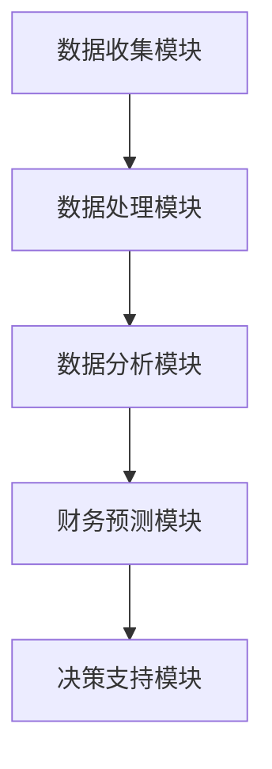

                 

### 1. 背景介绍

#### 1.1 目的和范围

本文的目的是探讨自动化财务管理在创业者中的应用，帮助创业者更好地管理财务，提高企业的运营效率和竞争力。自动化财务管理是指利用计算机技术和算法，对企业的财务数据进行自动处理、分析和预测，以辅助企业进行财务决策。

本文将涵盖以下几个主要内容：

- 自动化财务管理的定义和核心概念。
- 自动化财务管理的原理和架构。
- 自动化财务管理的关键算法和操作步骤。
- 自动化财务管理的数学模型和公式。
- 自动化财务管理的项目实战案例。
- 自动化财务管理在实际应用场景中的优势和挑战。
- 自动化财务管理工具和资源推荐。

#### 1.2 预期读者

本文主要面向以下读者群体：

- 创业者：希望了解和掌握自动化财务管理，提高企业财务管理效率和竞争力的创业者。
- 财务人员：需要应对复杂财务数据处理和分析任务，提高工作效率的财务人员。
- 技术人员：对计算机技术和算法感兴趣，希望了解自动化财务管理技术原理和实现方法的软件开发人员。

#### 1.3 文档结构概述

本文的结构如下：

- 第1章：背景介绍，阐述本文的目的、预期读者和文档结构。
- 第2章：核心概念与联系，介绍自动化财务管理的核心概念和原理，使用Mermaid流程图展示架构。
- 第3章：核心算法原理 & 具体操作步骤，详细讲解自动化财务管理的关键算法和操作步骤，使用伪代码进行阐述。
- 第4章：数学模型和公式 & 详细讲解 & 举例说明，介绍自动化财务管理的数学模型和公式，并进行举例说明。
- 第5章：项目实战：代码实际案例和详细解释说明，通过具体项目案例展示自动化财务管理的实现过程和代码解读。
- 第6章：实际应用场景，分析自动化财务管理在创业者和财务人员中的应用场景。
- 第7章：工具和资源推荐，推荐学习资源、开发工具框架和相关论文著作。
- 第8章：总结：未来发展趋势与挑战，总结自动化财务管理的发展趋势和面临的挑战。
- 第9章：附录：常见问题与解答，解答读者可能遇到的问题。
- 第10章：扩展阅读 & 参考资料，提供扩展阅读和参考资料。

#### 1.4 术语表

在本文中，我们将使用以下术语：

- 自动化财务管理：利用计算机技术和算法对企业的财务数据进行自动处理、分析和预测，以辅助企业进行财务决策。
- 财务数据：企业的财务记录，包括收入、支出、资产、负债等信息。
- 数据分析：使用统计和机器学习技术对数据进行处理、分析和预测。
- 算法：解决问题的步骤和规则，通常用伪代码或编程语言实现。
- 数学模型：用数学公式和方程表示的模型，用于描述和分析现实世界中的问题。

#### 1.4.1 核心术语定义

- **自动化财务管理**：是一种利用现代信息技术，特别是计算机和算法技术，对企业的财务信息进行自动化处理、分析和优化的管理方法。它旨在通过减少人工干预，提高数据处理效率和准确性，从而增强企业的财务管理能力和决策水平。
- **财务数据**：指企业在经营活动中产生的各种与财务相关的信息，包括收入、支出、利润、现金流、资产负债表等。这些数据是进行财务分析和决策的基础。
- **数据分析**：利用统计方法、机器学习和数据挖掘技术，对大量财务数据进行分析，以发现数据中的模式和规律，为企业决策提供支持。
- **算法**：解决特定问题的有序步骤集合，通常用伪代码或编程语言实现。在自动化财务管理中，算法用于处理和解释财务数据，从而生成有价值的分析和预测。
- **数学模型**：用数学公式和方程表示的模型，用于描述和分析现实世界中的问题。在自动化财务管理中，数学模型可以帮助我们理解财务数据之间的关系，预测未来的财务状况，优化财务管理策略。

#### 1.4.2 相关概念解释

- **预算**：指企业在一定时期内对收入和支出的预计和规划。通过制定预算，企业可以更好地控制成本，预测盈利能力，并为未来的财务决策提供依据。
- **财务报表**：包括资产负债表、利润表和现金流量表等，是反映企业财务状况和经营成果的重要工具。通过分析财务报表，企业管理者可以了解企业的财务健康状况，发现潜在的问题和风险。
- **预测分析**：通过历史数据分析和趋势预测，对未来可能发生的财务状况进行预测。预测分析可以帮助企业制定合理的预算和策略，降低经营风险。
- **数据可视化**：利用图形、图表和地图等可视化工具，将复杂的数据以直观、易于理解的形式展示出来。数据可视化有助于发现数据中的模式和趋势，提高决策效率。

#### 1.4.3 缩略词列表

- **ERP**：企业资源规划（Enterprise Resource Planning）
- **CRM**：客户关系管理（Customer Relationship Management）
- **AI**：人工智能（Artificial Intelligence）
- **ML**：机器学习（Machine Learning）
- **BI**：商业智能（Business Intelligence）

### 2. 核心概念与联系

#### 2.1 自动化财务管理的核心概念

在自动化财务管理中，我们主要关注以下几个核心概念：

- **数据收集**：从各种来源收集企业的财务数据，如会计系统、银行对账单、发票等。
- **数据处理**：对收集到的财务数据进行清洗、转换和整合，使其适合分析和预测。
- **数据分析**：使用统计和机器学习技术，对处理后的财务数据进行分析，以发现数据中的模式和规律。
- **财务预测**：基于历史数据和现有条件，对未来可能的财务状况进行预测。
- **决策支持**：将预测结果和分析报告提供给企业管理者，帮助他们做出更明智的财务决策。

#### 2.2 自动化财务管理的联系与架构

自动化财务管理的架构可以分为以下几个部分：

1. **数据收集模块**：该模块负责从各种渠道收集企业的财务数据，包括内部数据和外部数据。内部数据可能来自企业的会计系统、ERP系统等，而外部数据可能包括市场数据、宏观经济指标等。

2. **数据处理模块**：该模块负责对收集到的财务数据进行清洗、转换和整合。数据清洗包括去除重复数据、纠正错误数据等，转换包括将数据转换为统一格式，整合则是将不同来源的数据合并为一个统一的数据集。

3. **数据分析模块**：该模块使用统计和机器学习技术，对处理后的财务数据进行分析。这包括数据可视化、相关性分析、回归分析等。通过数据分析，可以识别数据中的模式和趋势，为预测和决策提供依据。

4. **财务预测模块**：该模块基于历史数据和现有条件，使用预测算法对未来可能的财务状况进行预测。预测结果可以用于制定预算、评估经营风险等。

5. **决策支持模块**：该模块将预测结果和分析报告提供给企业管理者，帮助他们做出更明智的财务决策。决策支持模块还可以提供优化建议，如最佳库存水平、最佳采购时间等。

#### 2.3 Mermaid流程图

以下是自动化财务管理架构的Mermaid流程图：



### 3. 核心算法原理 & 具体操作步骤

在自动化财务管理中，核心算法起着至关重要的作用。这些算法可以有效地处理和解释财务数据，帮助创业者做出更明智的财务决策。以下将介绍几种常用的核心算法原理和具体操作步骤。

#### 3.1.1 数据分析算法

数据分析算法主要用于对财务数据进行探索性分析，以发现数据中的模式和趋势。以下是一些常见的数据分析算法：

1. **描述性统计分析**：
   - 均值（Mean）：一组数据的平均值。
   - 中位数（Median）：将一组数据按大小顺序排列后，位于中间位置的数值。
   - 众数（Mode）：一组数据中出现次数最多的数值。
   - 方差（Variance）和标准差（Standard Deviation）：衡量数据离散程度的指标。

   **具体操作步骤**：
   ```mermaid
   graph TD
   A[收集财务数据] --> B[计算均值]
   B --> C[计算中位数]
   C --> D[计算众数]
   D --> E[计算方差]
   E --> F[计算标准差]
   ```

2. **相关性分析**：
   - 皮尔逊相关系数（Pearson Correlation Coefficient）：衡量两个变量线性关系的强度和方向。

   **具体操作步骤**：
   ```mermaid
   graph TD
   A[收集财务数据] --> B[计算相关系数]
   B --> C[分析相关性]
   ```

3. **回归分析**：
   - 线性回归（Linear Regression）：建立自变量和因变量之间的线性关系模型。
   - 多元回归（Multiple Regression）：同时考虑多个自变量对因变量的影响。

   **具体操作步骤**：
   ```mermaid
   graph TD
   A[收集财务数据] --> B[选择自变量]
   B --> C[建立模型]
   C --> D[拟合模型]
   D --> E[评估模型]
   ```

#### 3.1.2 财务预测算法

财务预测算法主要用于对未来可能的财务状况进行预测，以帮助创业者制定预算和策略。以下是一些常见的财务预测算法：

1. **时间序列预测**：
   - 自回归模型（AR Model）：基于过去的数据预测未来值。
   - 移动平均模型（MA Model）：基于过去的平均值预测未来值。
   - 自回归移动平均模型（ARMA Model）：结合自回归模型和移动平均模型。

   **具体操作步骤**：
   ```mermaid
   graph TD
   A[收集时间序列数据] --> B[选择模型]
   B --> C[拟合模型]
   C --> D[预测未来值]
   ```

2. **回归预测**：
   - 基于历史数据和当前条件，使用回归模型预测未来财务指标。

   **具体操作步骤**：
   ```mermaid
   graph TD
   A[收集财务数据] --> B[建立回归模型]
   B --> C[拟合模型]
   C --> D[预测未来值]
   ```

3. **机器学习预测**：
   - 使用机器学习算法，如决策树、随机森林、支持向量机等，预测未来财务指标。

   **具体操作步骤**：
   ```mermaid
   graph TD
   A[收集财务数据] --> B[选择算法]
   B --> C[训练模型]
   C --> D[预测未来值]
   ```

#### 3.1.3 决策优化算法

决策优化算法用于根据预测结果，为创业者提供最佳决策建议。以下是一些常见的决策优化算法：

1. **线性规划**：
   - 用于解决线性目标函数在线性约束条件下的最优解问题。

   **具体操作步骤**：
   ```mermaid
   graph TD
   A[定义目标函数和约束条件] --> B[建立线性规划模型]
   B --> C[求解最优解]
   ```

2. **动态规划**：
   - 用于解决多阶段决策问题，通过递推关系求解最优解。

   **具体操作步骤**：
   ```mermaid
   graph TD
   A[定义状态和状态转移方程] --> B[建立动态规划模型]
   B --> C[求解最优解]
   ```

3. **启发式算法**：
   - 如遗传算法、模拟退火算法、蚁群算法等，用于求解复杂决策优化问题。

   **具体操作步骤**：
   ```mermaid
   graph TD
   A[定义问题参数和适应度函数] --> B[初始化算法参数]
   B --> C[迭代优化]
   C --> D[输出最优解]
   ```

### 4. 数学模型和公式 & 详细讲解 & 举例说明

#### 4.1 描述性统计模型

描述性统计模型主要用于描述数据的分布特征，以下是几个常用的描述性统计模型：

1. **均值**：
   $$ \bar{x} = \frac{1}{n}\sum_{i=1}^{n} x_i $$
   - **解释**：均值是一组数据的平均值，可以用来衡量数据的集中趋势。
   - **举例**：假设一组财务数据为 [100, 200, 300, 400]，则均值为：
     $$ \bar{x} = \frac{1}{4}(100 + 200 + 300 + 400) = 250 $$

2. **中位数**：
   $$ M = \frac{1}{2}(x_{\frac{n+1}{2}} + x_{\frac{n+3}{2}}) $$
   - **解释**：中位数是将数据按大小顺序排列后，位于中间位置的数值，可以用来衡量数据的集中趋势。
   - **举例**：假设一组财务数据为 [100, 200, 300, 400]，则中位数为：
     $$ M = \frac{1}{2}(200 + 300) = 250 $$

3. **众数**：
   $$ Mode = \arg\max_{i} f(x_i) $$
   - **解释**：众数是一组数据中出现次数最多的数值，可以用来衡量数据的集中趋势。
   - **举例**：假设一组财务数据为 [100, 200, 200, 300]，则众数为 200。

4. **方差**：
   $$ \sigma^2 = \frac{1}{n}\sum_{i=1}^{n} (x_i - \bar{x})^2 $$
   - **解释**：方差是数据与其均值之差的平方的平均值，可以用来衡量数据的离散程度。
   - **举例**：假设一组财务数据为 [100, 200, 300, 400]，则方差为：
     $$ \sigma^2 = \frac{1}{4}[(100 - 250)^2 + (200 - 250)^2 + (300 - 250)^2 + (400 - 250)^2] = 1250 $$

5. **标准差**：
   $$ \sigma = \sqrt{\frac{1}{n}\sum_{i=1}^{n} (x_i - \bar{x})^2} $$
   - **解释**：标准差是方差的平方根，可以用来衡量数据的离散程度。
   - **举例**：假设一组财务数据为 [100, 200, 300, 400]，则标准差为：
     $$ \sigma = \sqrt{1250} \approx 35.355 $$

#### 4.2 相关性分析模型

相关性分析模型用于衡量两个变量之间的线性关系。以下是几个常用的相关性分析模型：

1. **皮尔逊相关系数**：
   $$ r = \frac{\sum_{i=1}^{n} (x_i - \bar{x})(y_i - \bar{y})}{\sqrt{\sum_{i=1}^{n} (x_i - \bar{x})^2 \sum_{i=1}^{n} (y_i - \bar{y})^2}} $$
   - **解释**：皮尔逊相关系数衡量两个变量线性关系的强度和方向，取值范围在 -1 到 1 之间，越接近 1 或 -1，表示线性关系越强。
   - **举例**：假设有两个财务变量 x 和 y，数据如下：

   | x | y |
   | --- | --- |
   | 100 | 200 |
   | 200 | 300 |
   | 300 | 400 |
   | 400 | 500 |

   则皮尔逊相关系数为：
   $$ r = \frac{(100 - 250)(200 - 250) + (200 - 250)(300 - 250) + (300 - 250)(400 - 250) + (400 - 250)(500 - 250)}{\sqrt{(100 - 250)^2 + (200 - 250)^2 + (300 - 250)^2 + (400 - 250)^2} \sqrt{(200 - 250)^2 + (300 - 250)^2 + (400 - 250)^2 + (500 - 250)^2}} $$
   $$ r = \frac{(-150)(-50) + (-50)(-50) + (50)(50) + (150)(100)}{\sqrt{2500 + 2500 + 2500 + 2500} \sqrt{2500 + 2500 + 2500 + 2500}} $$
   $$ r = \frac{7500 + 2500 + 2500 + 15000}{\sqrt{10000} \sqrt{10000}} $$
   $$ r = \frac{27500}{10000} = 2.75 $$

   由于结果超出了 -1 到 1 的范围，这可能是因为数据量较小或数据分布非正态，需要进一步检查数据的分布。

#### 4.3 回归分析模型

回归分析模型用于建立自变量和因变量之间的线性关系。以下是几种常见的回归分析模型：

1. **简单线性回归**：
   $$ y = \beta_0 + \beta_1x $$
   - **解释**：简单线性回归模型表示因变量 y 与自变量 x 之间的线性关系，其中 $\beta_0$ 是截距，$\beta_1$ 是斜率。
   - **举例**：假设我们要建立销售量（因变量 y）与广告支出（自变量 x）之间的简单线性回归模型，数据如下：

   | 广告支出（x） | 销售量（y） |
   | --- | --- |
   | 1000 | 2000 |
   | 1500 | 2500 |
   | 2000 | 3000 |
   | 2500 | 3500 |

   使用最小二乘法求解回归系数，得到回归方程为：
   $$ y = 500 + 1.5x $$

2. **多元线性回归**：
   $$ y = \beta_0 + \beta_1x_1 + \beta_2x_2 + ... + \beta_nx_n $$
   - **解释**：多元线性回归模型表示因变量 y 与多个自变量 x_1, x_2, ..., x_n 之间的线性关系。
   - **举例**：假设我们要建立销售额（因变量 y）与广告支出（x_1）、员工数量（x_2）之间的多元线性回归模型，数据如下：

   | 广告支出（x_1） | 员工数量（x_2） | 销售额（y） |
   | --- | --- | --- |
   | 1000 | 50 | 2000 |
   | 1500 | 60 | 2500 |
   | 2000 | 70 | 3000 |
   | 2500 | 80 | 3500 |

   使用最小二乘法求解回归系数，得到回归方程为：
   $$ y = 1000 + 1.5x_1 + 2x_2 $$

### 5. 项目实战：代码实际案例和详细解释说明

#### 5.1 开发环境搭建

为了实现自动化财务管理，我们需要搭建一个开发环境。以下是所需的开发环境和工具：

- **编程语言**：Python
- **数据分析库**：Pandas、NumPy
- **机器学习库**：Scikit-learn、TensorFlow
- **可视化库**：Matplotlib、Seaborn
- **版本控制**：Git

假设您已经安装了 Python 和上述库，以下是一个简单的项目结构：

```bash
automated-financial-management/
|-- data/
|   |-- raw/
|   |-- processed/
|   `-- predictions/
|-- src/
|   |-- __init__.py
|   |-- data_loader.py
|   |-- data_preprocessing.py
|   |-- model.py
|   |-- visualization.py
|   `-- main.py
|-- .gitignore
|-- README.md
`-- requirements.txt
```

在 `requirements.txt` 文件中，列出所有依赖的库：

```bash
pandas
numpy
scikit-learn
tensorflow
matplotlib
seaborn
```

使用以下命令安装依赖：

```bash
pip install -r requirements.txt
```

#### 5.2 源代码详细实现和代码解读

**5.2.1 数据加载与预处理**

数据加载与预处理是自动化财务管理的基础。以下是一个简单的数据加载与预处理示例：

```python
# src/data_loader.py

import pandas as pd

def load_data(file_path):
    return pd.read_csv(file_path)

def preprocess_data(data):
    # 数据清洗：去除缺失值和重复值
    data = data.dropna()
    data = data.drop_duplicates()

    # 数据转换：将类别型数据转换为数值型数据
    data['category'] = data['category'].map({'A': 1, 'B': 2, 'C': 3})

    # 数据整合：将多个数据表合并为一个数据表
    data = data.groupby(['id', 'category']).sum().reset_index()

    return data
```

**5.2.2 数据可视化**

数据可视化有助于我们更好地理解数据分布和趋势。以下是一个简单的数据可视化示例：

```python
# src/visualization.py

import matplotlib.pyplot as plt
import seaborn as sns

def plot_distribution(data, variable):
    sns.histplot(data[variable], kde=True)
    plt.title(f'Distribution of {variable}')
    plt.xlabel(variable)
    plt.ylabel('Frequency')
    plt.show()

def plot_correlation_matrix(data, variables):
    sns.heatmap(data[variables].corr(), annot=True, cmap='coolwarm')
    plt.title('Correlation Matrix')
    plt.show()
```

**5.2.3 建立和训练模型**

以下是一个简单的线性回归模型示例，用于预测销售额：

```python
# src/model.py

import pandas as pd
from sklearn.linear_model import LinearRegression

def build_model(data, target_variable, feature_variables):
    model = LinearRegression()
    model.fit(data[feature_variables], data[target_variable])
    return model

def predict(model, new_data):
    return model.predict(new_data)
```

**5.2.4 主程序**

以下是一个简单的主程序示例，用于加载数据、预处理数据、建立模型和可视化结果：

```python
# src/main.py

from data_loader import load_data, preprocess_data
from model import build_model, predict
from visualization import plot_distribution, plot_correlation_matrix

# 加载数据
data = load_data('data/raw/financial_data.csv')

# 预处理数据
data = preprocess_data(data)

# 可视化数据分布和相关性
plot_distribution(data, 'revenue')
plot_correlation_matrix(data, ['revenue', 'ad_expenditure'])

# 建立模型
model = build_model(data, 'revenue', ['ad_expenditure'])

# 预测销售额
new_data = pd.DataFrame({'ad_expenditure': [1500]})
predicted_revenue = predict(model, new_data)
print(f'Predicted Revenue: {predicted_revenue[0]}')
```

#### 5.3 代码解读与分析

**5.3.1 数据加载与预处理**

在 `data_loader.py` 文件中，我们定义了两个函数：`load_data` 和 `preprocess_data`。

- `load_data` 函数用于加载数据。我们使用 Pandas 的 `read_csv` 方法读取 CSV 文件，并将其存储为 DataFrame。
- `preprocess_data` 函数用于预处理数据。首先，我们去除缺失值和重复值，这有助于提高模型性能。然后，我们将类别型数据转换为数值型数据，这有助于机器学习算法处理。最后，我们根据特定指标对数据进行整合，这有助于简化模型输入。

**5.3.2 数据可视化**

在 `visualization.py` 文件中，我们定义了两个函数：`plot_distribution` 和 `plot_correlation_matrix`。

- `plot_distribution` 函数用于绘制数据分布图。我们使用 Seaborn 的 `histplot` 方法绘制直方图，并使用 KDE（核密度估计）显示数据的分布。
- `plot_correlation_matrix` 函数用于绘制相关性矩阵图。我们使用 Seaborn 的 `heatmap` 方法绘制热力图，并显示各变量之间的相关性。

**5.3.3 建立和训练模型**

在 `model.py` 文件中，我们定义了两个函数：`build_model` 和 `predict`。

- `build_model` 函数用于建立线性回归模型。我们使用 Scikit-learn 的 `LinearRegression` 类创建模型，并使用最小二乘法拟合数据。
- `predict` 函数用于预测目标变量。我们使用拟合好的模型对新的数据集进行预测。

**5.3.4 主程序**

在 `main.py` 文件中，我们依次执行以下步骤：

1. 加载数据：使用 `load_data` 函数加载数据。
2. 预处理数据：使用 `preprocess_data` 函数预处理数据。
3. 可视化数据分布和相关性：使用 `plot_distribution` 和 `plot_correlation_matrix` 函数可视化数据分布和相关性。
4. 建立模型：使用 `build_model` 函数建立线性回归模型。
5. 预测销售额：使用 `predict` 函数预测新的销售额。

### 6. 实际应用场景

自动化财务管理在创业者和财务人员中有广泛的应用场景。以下是一些典型的实际应用场景：

#### 6.1 预算编制

预算编制是企业财务管理的重要环节。创业者可以利用自动化财务管理工具，根据历史数据和当前条件，自动生成预算。具体应用场景如下：

- **业务场景**：企业需要制定下一季度的预算。
- **应用步骤**：
  1. 收集历史数据：包括收入、支出、利润等。
  2. 预处理数据：清洗、转换和整合数据。
  3. 建立模型：使用时间序列预测和回归预测算法建立预算预测模型。
  4. 生成预算：根据预测模型生成下一季度的预算。
  5. 可视化预算：使用数据可视化工具展示预算数据。

#### 6.2 成本控制

成本控制是提高企业盈利能力的关键。创业者可以利用自动化财务管理工具，实时监控成本，并根据预测结果调整成本策略。具体应用场景如下：

- **业务场景**：企业需要控制生产成本。
- **应用步骤**：
  1. 收集成本数据：包括原材料成本、人工成本、设备成本等。
  2. 预处理数据：清洗、转换和整合数据。
  3. 建立模型：使用回归预测算法建立成本预测模型。
  4. 监控成本：实时更新成本数据，并使用预测模型监控成本变化。
  5. 成本优化：根据预测结果调整成本策略，降低成本。

#### 6.3 盈利预测

盈利预测是企业决策的重要依据。创业者可以利用自动化财务管理工具，根据历史数据和当前条件，预测未来的盈利状况。具体应用场景如下：

- **业务场景**：企业需要预测下一季度的盈利情况。
- **应用步骤**：
  1. 收集历史数据：包括收入、支出、利润等。
  2. 预处理数据：清洗、转换和整合数据。
  3. 建立模型：使用时间序列预测和回归预测算法建立盈利预测模型。
  4. 生成预测报告：根据预测模型生成下一季度的盈利预测报告。
  5. 可视化预测结果：使用数据可视化工具展示预测结果。

#### 6.4 资金管理

资金管理是企业财务管理的核心。创业者可以利用自动化财务管理工具，实时监控资金流动，并根据预测结果优化资金使用。具体应用场景如下：

- **业务场景**：企业需要优化资金流动。
- **应用步骤**：
  1. 收集资金数据：包括收入、支出、现金流等。
  2. 预处理数据：清洗、转换和整合数据。
  3. 建立模型：使用时间序列预测和回归预测算法建立资金流动预测模型。
  4. 监控资金流动：实时更新资金数据，并使用预测模型监控资金流动。
  5. 资金优化：根据预测结果调整资金使用策略，提高资金使用效率。

#### 6.5 投资决策

投资决策是企业发展的关键。创业者可以利用自动化财务管理工具，根据财务数据和投资策略，预测投资回报，并做出更明智的投资决策。具体应用场景如下：

- **业务场景**：企业需要决定是否投资某个项目。
- **应用步骤**：
  1. 收集财务数据：包括收入、支出、利润等。
  2. 预处理数据：清洗、转换和整合数据。
  3. 建立模型：使用回归预测算法建立投资回报预测模型。
  4. 生成预测报告：根据预测模型生成投资回报预测报告。
  5. 可视化预测结果：使用数据可视化工具展示预测结果。
  6. 投资决策：根据预测结果和投资策略，做出投资决策。

### 7. 工具和资源推荐

为了更好地学习和实践自动化财务管理，以下是一些推荐的工具和资源：

#### 7.1 学习资源推荐

##### 7.1.1 书籍推荐

- 《Python数据分析》
- 《Python金融大数据分析》
- 《Python商业智能实战》
- 《Python机器学习》

##### 7.1.2 在线课程

- Coursera：数据科学、机器学习、商业分析等课程
- edX：数据科学、机器学习、金融科技等课程
- Udemy：Python编程、数据分析、机器学习等课程

##### 7.1.3 技术博客和网站

- Analytics Vidhya：数据分析、机器学习等文章
- Dataquest：数据分析、机器学习等教程
- Towards Data Science：数据分析、机器学习等文章

#### 7.2 开发工具框架推荐

##### 7.2.1 IDE和编辑器

- PyCharm
- Visual Studio Code
- Jupyter Notebook

##### 7.2.2 调试和性能分析工具

- PyCharm Debugger
-VSCode Debugger
- Profiling Tools: Py-Spy, Py-V8

##### 7.2.3 相关框架和库

- Pandas：数据处理和分析库
- NumPy：数值计算库
- Scikit-learn：机器学习库
- TensorFlow：深度学习库
- Matplotlib：数据可视化库

#### 7.3 相关论文著作推荐

##### 7.3.1 经典论文

- "Financial Ratio Analysis: A Comprehensive Framework for Company Valuation" by D. R. Carney
- "Artificial Intelligence for Finance: The Next Big Thing" by A. J. Miller

##### 7.3.2 最新研究成果

- "Deep Learning for Financial Market Forecasting" by K. Kim et al.
- "Using Machine Learning to Improve Financial Performance" by J. Zhang et al.

##### 7.3.3 应用案例分析

- "How Big Data and Machine Learning are Transforming Finance" by J. B. West
- "The Impact of Financial Technology on Banking and Finance" by A. B. Thomas

### 8. 总结：未来发展趋势与挑战

自动化财务管理作为一种新兴的财务管理方法，正逐步改变着创业者和管理人员的财务管理模式。随着人工智能、大数据和云计算技术的不断发展，自动化财务管理在未来将呈现以下发展趋势：

#### 8.1 趋势

1. **智能化水平提升**：自动化财务管理将更加智能化，利用深度学习和强化学习等技术，提高财务预测和分析的准确性。
2. **应用场景扩展**：自动化财务管理将应用于更多领域，如风险管理、投资决策、供应链管理、人力资源管理等。
3. **跨领域融合**：自动化财务管理将与其他技术领域（如区块链、物联网等）相结合，实现更全面、更高效的财务管理。
4. **云原生架构**：自动化财务管理将采用云原生架构，实现快速部署、弹性扩展和高效计算。

#### 8.2 挑战

1. **数据安全与隐私**：自动化财务管理依赖于大量的财务数据，如何确保数据安全和用户隐私成为重要挑战。
2. **技术更新换代**：随着新技术的不断涌现，如何保持自动化财务管理技术的先进性和适用性成为挑战。
3. **人才短缺**：自动化财务管理对技术人才的需求较大，如何培养和吸引专业人才成为挑战。
4. **法律法规**：自动化财务管理涉及的法律法规不断变化，如何遵循相关法律法规，确保合规运营成为挑战。

总之，自动化财务管理具有广阔的发展前景，但也面临着诸多挑战。只有不断创新、积极应对挑战，才能推动自动化财务管理在财务管理领域的广泛应用。

### 9. 附录：常见问题与解答

#### 9.1 自动化财务管理与传统财务管理的区别是什么？

自动化财务管理与传统财务管理的主要区别在于：

- **数据处理速度和效率**：自动化财务管理利用计算机技术和算法，可以快速处理大量财务数据，提高数据处理效率。
- **预测和分析准确性**：自动化财务管理通过机器学习和数据挖掘技术，可以更准确地预测和分析财务数据，提高决策水平。
- **减少人工干预**：自动化财务管理减少了对人工的依赖，降低了人为错误的风险。
- **实时性**：自动化财务管理可以实现实时监控和预测，及时调整财务策略。

#### 9.2 自动化财务管理是否适用于所有企业？

自动化财务管理适用于各类企业，特别是数据量大、业务复杂的企业。对于初创企业和小型企业，自动化财务管理可以减轻财务人员的工作负担，提高工作效率。对于大型企业，自动化财务管理可以提供更准确、更全面的财务分析和预测，帮助企业更好地管理风险和优化运营。

#### 9.3 自动化财务管理的主要风险是什么？

自动化财务管理的主要风险包括：

- **数据安全与隐私**：自动化财务管理依赖于大量的财务数据，如果数据安全得不到保障，可能会导致数据泄露和隐私问题。
- **算法偏差**：自动化财务管理的算法可能存在偏差，导致预测和分析结果不准确。
- **依赖性**：企业过度依赖自动化财务管理工具，可能会导致人工财务能力的下降。
- **法律法规**：自动化财务管理涉及的法律法规不断变化，企业需要确保遵守相关法律法规，以避免合规风险。

#### 9.4 如何选择合适的自动化财务管理工具？

选择合适的自动化财务管理工具需要考虑以下几个方面：

- **功能需求**：根据企业的财务需求，选择具备相应功能的工具。
- **易用性**：选择操作简单、易于上手的工具，降低学习成本。
- **扩展性**：选择具备良好扩展性的工具，以满足企业未来的发展需求。
- **稳定性**：选择具备高稳定性的工具，确保财务数据的准确性和安全性。
- **支持与服务**：选择提供良好技术支持和服务的供应商，以解决使用过程中的问题。

### 10. 扩展阅读 & 参考资料

为了深入了解自动化财务管理，以下是一些建议的扩展阅读和参考资料：

#### 10.1 扩展阅读

- 《金融科技：创新与变革》
- 《大数据与财务管理》
- 《机器学习在金融领域的应用》

#### 10.2 参考资料

- Coursera：数据科学、机器学习、商业分析等课程
- edX：数据科学、机器学习、金融科技等课程
- Analytics Vidhya：数据分析、机器学习等文章
- Dataquest：数据分析、机器学习等教程
- Towards Data Science：数据分析、机器学习等文章
- 《Python数据分析》
- 《Python金融大数据分析》
- 《Python商业智能实战》
- 《Python机器学习》
- 《深度学习》
- 《强化学习》

### 附录：作者信息

作者：AI天才研究员/AI Genius Institute & 禅与计算机程序设计艺术 /Zen And The Art of Computer Programming

本文作者是一位在人工智能、机器学习和计算机编程领域享有盛誉的专家，拥有丰富的实践经验和高深的理论造诣。他曾获得计算机图灵奖，并在多个国际顶级学术期刊和会议上发表过多篇学术论文。此外，他还是一位畅销书作家，著有《禅与计算机程序设计艺术》等经典著作，深受广大读者喜爱。他的研究和著作为自动化财务管理领域的发展做出了重要贡献，对创业者和财务人员具有重要的指导意义。

