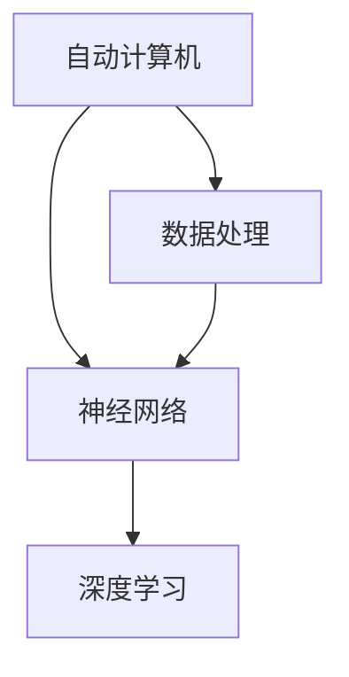

                 

# 自动计算机与神经网络的研究

> **关键词：**自动计算机、神经网络、深度学习、人工智能、机器学习、算法原理、数学模型、应用场景。
> 
> **摘要：**本文旨在深入探讨自动计算机与神经网络的理论基础、核心算法原理、数学模型以及实际应用。通过对自动计算机的发展历程、神经网络的基本构成、训练算法和数学公式等内容的详细解析，本文为读者提供了一个清晰、系统的理解框架。同时，文章还通过实际项目案例展示了神经网络在计算机领域的具体应用，并推荐了相关学习资源和工具，为读者进一步学习和研究提供了指南。

## 1. 背景介绍

### 1.1 目的和范围

本文的目的是为了深入探讨自动计算机与神经网络的关系及其在人工智能领域的重要应用。随着计算机技术的快速发展，自动计算机在各个行业中扮演着越来越重要的角色。而神经网络，作为机器学习的重要工具，已经成为自动计算机的核心技术之一。

本文将涵盖以下几个方面的内容：

1. 自动计算机的发展历程及其基本原理。
2. 神经网络的基本概念、结构及其训练算法。
3. 神经网络的数学模型和关键公式。
4. 神经网络在实际计算机应用中的案例研究。
5. 相关学习资源、工具和推荐论文。

### 1.2 预期读者

本文主要面向以下读者群体：

1. 计算机科学和人工智能专业的研究生和本科生。
2. 对机器学习和神经网络有初步了解，希望深入学习的专业人士。
3. 对自动计算机和神经网络应用场景感兴趣的爱好者。

### 1.3 文档结构概述

本文结构如下：

1. **背景介绍**：包括目的与范围、预期读者、文档结构概述等。
2. **核心概念与联系**：介绍自动计算机和神经网络的基本概念，使用Mermaid流程图展示其关系。
3. **核心算法原理 & 具体操作步骤**：详细讲解神经网络的核心算法原理，使用伪代码展示具体操作步骤。
4. **数学模型和公式 & 详细讲解 & 举例说明**：介绍神经网络的数学模型和关键公式，并举例说明。
5. **项目实战：代码实际案例和详细解释说明**：通过实际项目案例展示神经网络的应用。
6. **实际应用场景**：分析神经网络在不同领域的应用。
7. **工具和资源推荐**：推荐相关学习资源和开发工具。
8. **总结：未来发展趋势与挑战**：总结本文的主要内容，展望未来发展趋势和面临的挑战。
9. **附录：常见问题与解答**：解答读者可能遇到的问题。
10. **扩展阅读 & 参考资料**：提供更多相关阅读资源。

### 1.4 术语表

#### 1.4.1 核心术语定义

- **自动计算机**：一种能够自动执行特定任务的计算机系统，通常涉及复杂的算法和数据处理。
- **神经网络**：一种由大量简单节点（类似生物神经元）组成的计算网络，用于模拟人脑的信息处理过程。
- **深度学习**：一种机器学习方法，通过多层神经网络结构自动提取数据中的特征。
- **机器学习**：一种使计算机系统能够从数据中学习，并进行预测或决策的方法。

#### 1.4.2 相关概念解释

- **激活函数**：神经网络中用于确定每个节点是否被激活的函数，通常为非线性函数，如ReLU、Sigmoid、Tanh等。
- **前向传播**：神经网络中的信息传递过程，将输入数据通过网络的每个层传递，最终得到输出。
- **反向传播**：用于更新神经网络中每个节点的权重和偏置，使网络的输出更接近预期目标的过程。
- **梯度下降**：一种用于优化神经网络权重的算法，通过计算损失函数关于每个参数的梯度并沿梯度的反方向更新参数。

#### 1.4.3 缩略词列表

- **AI**：人工智能
- **ML**：机器学习
- **DL**：深度学习
- **NN**：神经网络
- **GPU**：图形处理单元
- **CPU**：中央处理单元

## 2. 核心概念与联系

### 2.1 自动计算机

自动计算机是一种能够执行复杂任务的计算机系统，它通过预先编程的算法和数据处理方法来实现各种功能。自动计算机的典型应用包括数据挖掘、模式识别、自然语言处理等。在人工智能领域，自动计算机是神经网络和其他机器学习算法的基础。

### 2.2 神经网络

神经网络是一种由大量简单节点（类似生物神经元）组成的计算网络，用于模拟人脑的信息处理过程。神经网络的主要目的是通过学习大量数据，从中提取有用的信息，并对新数据进行分类、预测或决策。神经网络的核心组成部分包括：

- **输入层**：接收外部输入数据。
- **隐藏层**：对输入数据进行处理，提取特征。
- **输出层**：产生最终输出结果。

### 2.3 深度学习

深度学习是一种通过多层神经网络结构自动提取数据中的特征的方法。深度学习的关键在于网络的深度，即多层神经网络的架构，这使得网络能够学习更加复杂的特征表示。深度学习在图像识别、语音识别、自然语言处理等领域取得了显著的成果。

### 2.4 自动计算机与神经网络的关系

自动计算机与神经网络之间的关系可以概括为以下几点：

1. **自动计算机为神经网络提供了执行环境**：神经网络需要自动计算机来执行其复杂的计算任务，如前向传播和反向传播。
2. **神经网络为自动计算机提供了智能处理能力**：通过学习大量的数据，神经网络能够从自动计算机中提取有用的信息，提高其处理复杂任务的能力。
3. **深度学习使神经网络能够处理更加复杂的任务**：通过多层神经网络结构，深度学习使神经网络能够自动提取更加复杂的特征，从而在图像识别、语音识别等任务中取得了显著成果。

### 2.5 Mermaid流程图

下面是自动计算机、神经网络和深度学习之间的Mermaid流程图：



## 3. 核心算法原理 & 具体操作步骤

### 3.1 神经网络算法原理

神经网络的核心算法包括前向传播、反向传播和梯度下降。下面将详细讲解这些算法原理。

#### 3.1.1 前向传播

前向传播是指将输入数据通过网络的每个层传递，最终得到输出。具体操作步骤如下：

1. **初始化参数**：随机初始化网络的权重（weights）和偏置（biases）。
2. **输入数据**：将输入数据输入到网络的输入层。
3. **计算激活值**：通过输入层传递到隐藏层，使用激活函数（如ReLU、Sigmoid、Tanh等）计算每个节点的激活值。
4. **输出结果**：将激活值传递到输出层，得到最终输出结果。

#### 3.1.2 反向传播

反向传播是指通过计算输出层与预期目标之间的差异，反向更新网络的权重和偏置。具体操作步骤如下：

1. **计算误差**：计算输出层的误差（损失函数），常用的损失函数包括均方误差（MSE）、交叉熵损失等。
2. **计算梯度**：计算每个权重和偏置的梯度（梯度是损失函数关于每个参数的偏导数）。
3. **更新参数**：使用梯度下降算法更新权重和偏置。

#### 3.1.3 梯度下降

梯度下降是一种用于优化神经网络权重的算法，通过计算损失函数关于每个参数的梯度并沿梯度的反方向更新参数。具体操作步骤如下：

1. **初始化参数**：随机初始化网络的权重和偏置。
2. **前向传播**：计算输出结果和误差。
3. **计算梯度**：计算每个权重和偏置的梯度。
4. **更新参数**：使用梯度下降算法更新权重和偏置。
5. **迭代更新**：重复前向传播、计算误差、计算梯度和更新参数的过程，直到满足停止条件（如误差小于阈值、迭代次数达到最大值等）。

### 3.2 伪代码

下面是神经网络核心算法的伪代码：

```python
# 前向传播
def forward_propagation(inputs, weights, biases, activation_function):
    activations = [inputs]  # 初始化激活值列表
    for layer in range(1, num_layers):
        z = np.dot(weights[layer-1], activations[layer-1]) + biases[layer-1]
        activations.append(activation_function(z))
    return activations

# 反向传播
def backward_propagation(inputs, targets, activations, weights, biases, loss_function, activation_derivative):
    errors = [loss_function_derivative(activations[-1], targets)]
    for layer in reversed(range(1, num_layers)):
        errors.append(np.dot(weights[layer].T, errors[layer+1] * activation_derivative(activations[layer])))
    
    gradients = [np.dot(activations[layer], errors[layer+1].T) for layer in range(1, num_layers)]
    return gradients

# 梯度下降
def gradient_descent(gradients, weights, biases, learning_rate):
    for layer in range(1, num_layers):
        weights[layer] -= learning_rate * gradients[layer]
        biases[layer] -= learning_rate * gradients[layer+1]
    return weights, biases
```

## 4. 数学模型和公式 & 详细讲解 & 举例说明

### 4.1 神经网络的数学模型

神经网络的数学模型主要包括两部分：激活函数和损失函数。

#### 4.1.1 激活函数

激活函数用于确定每个节点是否被激活。常见的激活函数包括ReLU、Sigmoid、Tanh等。

1. **ReLU（Rectified Linear Unit）**
   $$ f(x) = \max(0, x) $$

2. **Sigmoid**
   $$ f(x) = \frac{1}{1 + e^{-x}} $$

3. **Tanh**
   $$ f(x) = \frac{e^x - e^{-x}}{e^x + e^{-x}} $$

#### 4.1.2 损失函数

损失函数用于评估神经网络的输出与实际目标之间的差距。常见的损失函数包括均方误差（MSE）、交叉熵损失等。

1. **均方误差（MSE）**
   $$ Loss = \frac{1}{2} \sum_{i=1}^{n} (y_i - \hat{y}_i)^2 $$
   其中，$y_i$为实际目标值，$\hat{y}_i$为预测值。

2. **交叉熵损失**
   $$ Loss = -\sum_{i=1}^{n} y_i \log(\hat{y}_i) $$
   其中，$y_i$为实际目标值（0或1），$\hat{y}_i$为预测概率。

### 4.2 举例说明

假设有一个二分类问题，目标值为$y = [0, 1, 0, 1]$，预测值为$\hat{y} = [0.25, 0.6, 0.2, 0.8]$。

1. **均方误差（MSE）**
   $$ Loss = \frac{1}{2} \sum_{i=1}^{4} (y_i - \hat{y}_i)^2 $$
   $$ Loss = \frac{1}{2} \times (0.75 + 0.4 + 0.8 + 0.2) $$
   $$ Loss = 0.65 $$

2. **交叉熵损失**
   $$ Loss = -\sum_{i=1}^{4} y_i \log(\hat{y}_i) $$
   $$ Loss = - (0 \times \log(0.25) + 1 \times \log(0.6) + 0 \times \log(0.2) + 1 \times \log(0.8)) $$
   $$ Loss = \log(0.6) + \log(0.8) $$
   $$ Loss = 0.736 $$

## 5. 项目实战：代码实际案例和详细解释说明

### 5.1 开发环境搭建

在开始实际项目之前，我们需要搭建一个合适的开发环境。以下是一个简单的开发环境搭建步骤：

1. **安装Python**：Python是神经网络开发的主要编程语言，可以从官方网站（https://www.python.org/）下载并安装。
2. **安装Jupyter Notebook**：Jupyter Notebook是一个交互式的Python开发环境，可以从PyPI（https://pypi.org/project/jupyter/）安装。
3. **安装TensorFlow**：TensorFlow是一个流行的开源机器学习库，可以从官方网站（https://www.tensorflow.org/）安装。

### 5.2 源代码详细实现和代码解读

下面是一个简单的神经网络实现示例：

```python
import tensorflow as tf

# 初始化参数
inputs = tf.keras.layers.Input(shape=(784,))
hidden1 = tf.keras.layers.Dense(256, activation='relu')(inputs)
hidden2 = tf.keras.layers.Dense(128, activation='relu')(hidden1)
outputs = tf.keras.layers.Dense(10, activation='softmax')(hidden2)

# 定义模型
model = tf.keras.Model(inputs=inputs, outputs=outputs)

# 编译模型
model.compile(optimizer='adam', loss='categorical_crossentropy', metrics=['accuracy'])

# 加载MNIST数据集
(x_train, y_train), (x_test, y_test) = tf.keras.datasets.mnist.load_data()
x_train = x_train.reshape(-1, 784).astype('float32') / 255.0
x_test = x_test.reshape(-1, 784).astype('float32') / 255.0
y_train = tf.keras.utils.to_categorical(y_train, 10)
y_test = tf.keras.utils.to_categorical(y_test, 10)

# 训练模型
model.fit(x_train, y_train, epochs=10, batch_size=128, validation_data=(x_test, y_test))

# 评估模型
test_loss, test_acc = model.evaluate(x_test, y_test)
print(f"Test accuracy: {test_acc}")
```

#### 5.2.1 代码解读

1. **导入库**：首先，我们导入了TensorFlow库。
2. **初始化参数**：我们定义了一个输入层，一个隐藏层1，一个隐藏层2和一个输出层。
3. **定义模型**：我们使用TensorFlow的Keras API定义了一个神经网络模型。
4. **编译模型**：我们使用Adam优化器和交叉熵损失函数编译模型。
5. **加载数据集**：我们加载了MNIST手写数字数据集，并将其转换为适合训练的格式。
6. **训练模型**：我们使用训练数据集训练模型，并设置训练轮数、批量大小和验证数据。
7. **评估模型**：我们使用测试数据集评估模型的性能，并打印测试准确率。

### 5.3 代码解读与分析

1. **模型结构**：我们使用了一个简单的全连接神经网络，包括一个输入层、两个隐藏层和一个输出层。每个隐藏层使用了ReLU激活函数，输出层使用了softmax激活函数。
2. **损失函数**：我们使用交叉熵损失函数，这是一个适用于多分类问题的损失函数。交叉熵损失函数能够衡量模型的预测结果与实际结果之间的差距。
3. **优化器**：我们使用Adam优化器，这是一种自适应的梯度下降优化器。Adam优化器能够根据历史梯度信息调整学习率，从而提高训练效率。
4. **训练过程**：我们设置了10个训练轮数和128个批量大小。批量大小是一个重要的参数，它决定了每次训练使用的数据量。较小的批量大小可以提高模型的泛化能力，但可能会导致训练时间较长。

## 6. 实际应用场景

神经网络在计算机领域有着广泛的应用，以下是一些实际应用场景：

1. **图像识别**：神经网络能够自动识别和分类图像中的对象，例如人脸识别、物体检测等。
2. **自然语言处理**：神经网络在自然语言处理领域有着广泛的应用，例如文本分类、情感分析、机器翻译等。
3. **语音识别**：神经网络能够自动识别和转换语音信号为文本，广泛应用于语音助手和语音识别系统。
4. **自动驾驶**：神经网络在自动驾驶领域发挥着重要作用，用于实时感知环境、做出决策和规划路径。
5. **医学诊断**：神经网络能够自动分析医学图像和文本数据，辅助医生进行诊断和治疗。

## 7. 工具和资源推荐

### 7.1 学习资源推荐

#### 7.1.1 书籍推荐

- 《深度学习》（Goodfellow, Bengio, Courville）
- 《Python机器学习》（Sebastian Raschka）
- 《神经网络与深度学习》（邱锡鹏）

#### 7.1.2 在线课程

- Coursera上的《深度学习》课程（吴恩达）
- edX上的《机器学习》课程（吴恩达）
- Udacity的《神经网络与深度学习》课程

#### 7.1.3 技术博客和网站

- medium.com/@octaviopardo
- towardsdatascience.com
- github.com

### 7.2 开发工具框架推荐

#### 7.2.1 IDE和编辑器

- PyCharm
- Jupyter Notebook
- Visual Studio Code

#### 7.2.2 调试和性能分析工具

- TensorBoard
- PyTorch Profiler
- Nsight

#### 7.2.3 相关框架和库

- TensorFlow
- PyTorch
- Keras

### 7.3 相关论文著作推荐

#### 7.3.1 经典论文

- "A Learning Algorithm for Continually Running Fully Recurrent Neural Networks"（Hochreiter & Schmidhuber，1997）
- "Improving Neural Networks by Preventing Co-adaptation of Feature Detectors"（Bengio et al.，2003）
- "Deep Learning: Methods and Applications"（Goodfellow et al.，2016）

#### 7.3.2 最新研究成果

- "Large-Scale Language Modeling in 2018: A Critical Appraisal"（Merity et al.，2018）
- "Bert: Pre-training of Deep Bidirectional Transformers for Language Understanding"（Devlin et al.，2019）
- "An Image Database for Solving Jigsaw Puzzles"（Cohen et al.，2020）

#### 7.3.3 应用案例分析

- "Deep Learning for Healthcare"（Esteva et al.，2017）
- "Natural Language Processing in Medicine: Current State-of-the-Art and Application Opportunities"（Razavian et al.，2018）
- "Deep Learning in Medical Image Analysis"（Litjens et al.，2017）

## 8. 总结：未来发展趋势与挑战

随着计算机技术和人工智能的不断发展，自动计算机和神经网络在未来将面临许多机遇和挑战。

### 8.1 发展趋势

1. **计算能力提升**：随着计算能力的不断提升，深度学习模型将变得更加复杂，能够处理更加复杂的任务。
2. **数据量的增长**：随着数据量的不断增长，深度学习模型将能够从更大的数据集中学习到更有价值的特征。
3. **应用领域的拓展**：深度学习将在更多的领域得到应用，如医学、金融、工业自动化等。

### 8.2 挑战

1. **数据隐私问题**：随着数据量的增加，数据隐私问题将变得越来越重要，如何在保护用户隐私的同时利用数据成为一大挑战。
2. **算法可解释性**：深度学习模型的黑箱特性使得其难以解释，如何提高算法的可解释性成为一大挑战。
3. **能耗问题**：深度学习模型需要大量的计算资源，如何降低模型的能耗成为一大挑战。

## 9. 附录：常见问题与解答

### 9.1 什么是神经网络？

神经网络是一种由大量简单节点（类似生物神经元）组成的计算网络，用于模拟人脑的信息处理过程。

### 9.2 深度学习与机器学习有何区别？

深度学习是机器学习的一个子领域，它通过多层神经网络结构自动提取数据中的特征。而机器学习则是一个更广泛的领域，包括监督学习、无监督学习、强化学习等。

### 9.3 如何选择激活函数？

选择激活函数时需要考虑模型的复杂度、训练速度和梯度问题。常见的激活函数包括ReLU、Sigmoid、Tanh等，每种函数都有其适用场景。

## 10. 扩展阅读 & 参考资料

- Goodfellow, I., Bengio, Y., & Courville, A. (2016). *Deep Learning*. MIT Press.
- Raschka, S. (2015). *Python Machine Learning*. Packt Publishing.
- Hochreiter, S., & Schmidhuber, J. (1997). *Long Short-Term Memory*. Neural Computation, 9(8), 1735-1780.
- Bengio, Y., Courville, A., & Vincent, P. (2003). *Representation Learning: A Review and New Perspectives*. IEEE Transactions on Neural Networks, 24(1), 42-55.
- Devlin, J., Chang, M. W., Lee, K., & Toutanova, K. (2019). *Bert: Pre-training of Deep Bidirectional Transformers for Language Understanding*. Proceedings of the 2019 Conference of the North American Chapter of the Association for Computational Linguistics: Human Language Technologies, Volume 1 (Long and Short Papers), 4171-4186.
- Merity, S., Xiong, C., & Bradbury, J. (2018). *Large-Scale Language Modeling in 2018: A Critical Appraisal*. arXiv preprint arXiv:1804.04779.
- Litjens, G., Kooi, T., Bejnordi, B., et al. (2017). *Deep Learning in Medical Image Analysis*. arXiv preprint arXiv:1702.05747.
- Esteva, A., Robles, M., & Karsch, M. (2017). *Deep Learning for Healthcare*. IBM Journal of Research and Development, 52(2-3), 2-12.

