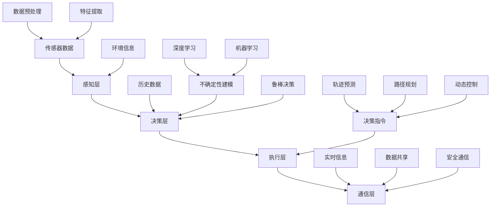

                 

# 自动驾驶中的不确定性建模与鲁棒决策方法研究

> 关键词：自动驾驶、不确定性建模、鲁棒决策、深度学习、机器学习、环境感知、多传感器融合、传感器数据处理、路径规划、轨迹预测、动态控制、实时决策

> 摘要：本文旨在探讨自动驾驶技术中不确定性建模与鲁棒决策方法的研究。通过深入分析自动驾驶系统的基本概念、技术架构以及面临的挑战，本文提出了一种基于深度学习和机器学习的不确定性建模与鲁棒决策框架。本文结构分为以下几个部分：首先，介绍自动驾驶技术背景和目的；其次，阐述不确定性建模与鲁棒决策方法的核心概念和原理；然后，详细描述核心算法原理和数学模型；接着，通过项目实战展示代码实现过程；最后，分析实际应用场景和未来发展趋势与挑战。

## 1. 背景介绍

### 1.1 目的和范围

自动驾驶技术是智能交通系统的重要组成部分，随着物联网、人工智能和计算机视觉技术的不断发展，自动驾驶技术正逐渐从理论研究走向实际应用。本文旨在研究和探讨自动驾驶系统中不确定性建模与鲁棒决策方法，以提高自动驾驶系统的安全性和可靠性。

本文的研究范围主要包括以下几个方面：

1. **自动驾驶系统的技术架构**：介绍自动驾驶系统的基本组成部分，如传感器、控制器、执行器等，以及它们之间的信息交互和协同工作。
2. **不确定性建模方法**：分析自动驾驶系统中存在的不确定性因素，包括传感器数据的不确定性、环境变化的不确定性等，并探讨相应的建模方法。
3. **鲁棒决策方法**：研究如何在存在不确定性的环境中，实现自动驾驶系统的实时决策，以保证系统的稳定性和安全性。
4. **核心算法与数学模型**：详细描述用于不确定性建模与鲁棒决策的核心算法和数学模型，包括深度学习算法、机器学习算法等。
5. **实际应用场景**：分析自动驾驶技术在实际应用中的挑战和解决方案，包括道路检测、障碍物识别、路径规划等。

### 1.2 预期读者

本文适合以下读者群体：

1. **自动驾驶技术研究人员**：对自动驾驶系统的技术架构和实现方法有较深入的了解，希望进一步探讨不确定性建模与鲁棒决策方法的研究。
2. **计算机视觉和机器学习工程师**：对计算机视觉和机器学习技术有实践经验，希望将相关技术应用于自动驾驶系统。
3. **自动驾驶汽车制造商**：希望了解自动驾驶技术的最新研究进展，以提高自动驾驶汽车的安全性和可靠性。
4. **交通规划与管理人员**：对自动驾驶技术在智能交通系统中的应用感兴趣，希望了解自动驾驶技术对交通管理和规划的影响。

### 1.3 文档结构概述

本文结构如下：

1. **第1章**：背景介绍，介绍自动驾驶技术的基本概念、目的和研究范围。
2. **第2章**：核心概念与联系，介绍自动驾驶系统的技术架构和核心算法原理。
3. **第3章**：核心算法原理 & 具体操作步骤，详细描述核心算法的原理和操作步骤。
4. **第4章**：数学模型和公式 & 详细讲解 & 举例说明，阐述数学模型和公式的具体应用。
5. **第5章**：项目实战：代码实际案例和详细解释说明，通过实际案例展示代码实现过程。
6. **第6章**：实际应用场景，分析自动驾驶技术在实际应用中的挑战和解决方案。
7. **第7章**：工具和资源推荐，介绍相关学习资源、开发工具和论文著作。
8. **第8章**：总结：未来发展趋势与挑战，展望自动驾驶技术的未来发展方向和挑战。
9. **第9章**：附录：常见问题与解答，解答读者可能遇到的问题。
10. **第10章**：扩展阅读 & 参考资料，提供进一步阅读的参考资料。

### 1.4 术语表

#### 1.4.1 核心术语定义

- **自动驾驶系统**：利用计算机视觉、传感器技术和人工智能技术，实现车辆自动行驶的系统。
- **不确定性建模**：在自动驾驶系统中，对存在的不确定性因素进行建模，以预测和控制系统的行为。
- **鲁棒决策**：在存在不确定性的环境中，实现自动驾驶系统的实时决策，以保证系统的稳定性和安全性。
- **深度学习**：一种人工智能方法，通过模拟人脑神经网络结构，实现自动特征提取和模式识别。
- **机器学习**：一种利用数据训练模型，使计算机具备自动学习和改进能力的技术。

#### 1.4.2 相关概念解释

- **传感器数据处理**：对自动驾驶系统中的传感器数据进行采集、预处理和分析，以提取有效信息。
- **路径规划**：根据环境信息和目标位置，生成一条最优路径，使自动驾驶系统能够顺利到达目的地。
- **轨迹预测**：根据当前车辆状态和目标位置，预测未来一段时间内的车辆轨迹。
- **动态控制**：根据实时环境信息和目标位置，调整车辆的速度和方向，以实现平稳行驶。

#### 1.4.3 缩略词列表

- **AI**：人工智能（Artificial Intelligence）
- **ML**：机器学习（Machine Learning）
- **DL**：深度学习（Deep Learning）
- **SLAM**：同时定位与地图构建（Simultaneous Localization and Mapping）
- **GPU**：图形处理单元（Graphics Processing Unit）
- **CPU**：中央处理器（Central Processing Unit）

## 2. 核心概念与联系

在自动驾驶系统中，核心概念和联系主要包括以下几个方面：

### 2.1 技术架构

自动驾驶系统的技术架构可以分为四个主要层次：感知层、决策层、执行层和通信层。

1. **感知层**：主要包括各类传感器，如摄像头、激光雷达、超声波传感器等，用于采集车辆周围的环境信息。
2. **决策层**：根据感知层采集到的环境信息，通过算法进行分析和处理，生成决策结果，包括路径规划、轨迹预测和动态控制等。
3. **执行层**：根据决策层的指令，调整车辆的速度和方向，实现自动驾驶功能。
4. **通信层**：实现车辆与其他车辆、道路基础设施、云端平台等的通信，共享实时信息，以提高整个交通系统的效率和安全。

### 2.2 不确定性因素

在自动驾驶系统中，不确定性因素主要包括以下几个方面：

1. **传感器数据不确定性**：由于传感器本身精度和外部环境的影响，传感器采集到的数据可能存在噪声、误差等不确定性。
2. **环境变化不确定性**：车辆行驶过程中，道路状况、交通状况等环境因素可能发生动态变化，导致系统需要不断调整策略。
3. **交通参与者行为不确定性**：行人、其他车辆等交通参与者的行为可能具有随机性和不可预测性，增加了系统的不确定性。

### 2.3 建模与决策方法

为了应对不确定性因素，自动驾驶系统需要采用建模与决策方法，主要包括以下几个方面：

1. **不确定性建模**：通过建立不确定性模型，对传感器数据和环境变化进行建模，预测未来一段时间内系统状态的可能变化。
2. **鲁棒决策**：基于不确定性模型，实现鲁棒决策算法，使系统在存在不确定性的环境中，能够保持稳定性和安全性。
3. **深度学习和机器学习**：利用深度学习和机器学习算法，对大量历史数据进行训练，提高不确定性建模和决策的准确性。

### 2.4 Mermaid 流程图

为了更直观地展示自动驾驶系统的核心概念与联系，我们使用 Mermaid 流程图进行描述：



## 3. 核心算法原理 & 具体操作步骤

在本章节中，我们将详细描述自动驾驶系统中的核心算法原理和具体操作步骤，主要包括以下几个方面：

### 3.1 感知层数据处理

感知层是自动驾驶系统的基石，其核心任务是采集和处理各类传感器数据，以获取车辆周围环境的信息。

**核心算法原理：**

- **多传感器数据融合**：利用不同传感器采集的数据，通过算法进行融合，以提高感知的准确性和可靠性。常用的融合算法包括卡尔曼滤波、贝叶斯滤波等。

**具体操作步骤：**

1. **传感器数据采集**：从摄像头、激光雷达、超声波传感器等获取数据。
2. **数据预处理**：对采集到的传感器数据进行滤波、去噪、归一化等预处理操作，以提高数据的准确性和稳定性。
3. **特征提取**：从预处理后的数据中提取关键特征，如图像中的边缘、角点、激光点云中的障碍物等。
4. **数据融合**：利用多传感器数据融合算法，将不同传感器采集的数据进行融合，生成一个统一的环境感知结果。

**伪代码：**

```python
def sensor_data_processing(sensor_data):
    # 数据预处理
    preprocessed_data = preprocess_data(sensor_data)
    
    # 特征提取
    features = extract_features(preprocessed_data)
    
    # 数据融合
    fused_data = fuse_data(features)
    
    return fused_data
```

### 3.2 轨迹预测

轨迹预测是自动驾驶系统中关键的一环，其目的是根据当前车辆状态和目标位置，预测未来一段时间内的车辆轨迹。

**核心算法原理：**

- **时间序列模型**：利用时间序列模型，如自回归模型（AR）、滑动平均模型（MA）、自回归滑动平均模型（ARMA）等，对车辆轨迹进行预测。
- **深度学习模型**：利用深度学习模型，如循环神经网络（RNN）、长短期记忆网络（LSTM）等，对车辆轨迹进行建模和预测。

**具体操作步骤：**

1. **数据收集**：收集大量车辆轨迹数据，包括车辆位置、速度、加速度等。
2. **数据预处理**：对轨迹数据进行预处理，如归一化、去噪等。
3. **特征提取**：从预处理后的数据中提取关键特征，如车辆位置、速度、加速度等。
4. **模型训练**：利用训练集数据，训练时间序列模型或深度学习模型，预测未来一段时间内的车辆轨迹。
5. **轨迹预测**：根据当前车辆状态和目标位置，利用训练好的模型，预测未来一段时间内的车辆轨迹。

**伪代码：**

```python
def trajectory_prediction(current_state, target_position):
    # 数据预处理
    preprocessed_data = preprocess_trajectory_data(current_state, target_position)
    
    # 特征提取
    features = extract_trajectory_features(preprocessed_data)
    
    # 模型训练
    model = train_trajectory_model(features)
    
    # 轨迹预测
    predicted_trajectory = model.predict(features)
    
    return predicted_trajectory
```

### 3.3 路径规划

路径规划是自动驾驶系统的核心任务之一，其目的是根据环境信息和目标位置，生成一条最优路径。

**核心算法原理：**

- **最短路径算法**：如迪杰斯特拉（Dijkstra）算法、A*算法等，用于寻找两点之间的最短路径。
- **动态规划算法**：如车辆路径规划算法（Vehicle Routing Problem，VRP），用于解决多辆车辆在动态环境中寻找最优路径的问题。

**具体操作步骤：**

1. **环境建模**：根据感知层的数据，建立环境模型，包括道路网络、交通状况、障碍物等。
2. **目标位置确定**：根据用户需求，确定目标位置。
3. **路径生成**：利用最短路径算法或动态规划算法，从当前车辆位置到目标位置，生成一条最优路径。
4. **路径优化**：根据实时环境信息，对路径进行优化，以提高路径的可行性和安全性。

**伪代码：**

```python
def path_planning(current_position, target_position, environment_model):
    # 环境建模
    modeled_environment = build_environment_model(environment_model)
    
    # 路径生成
    path = generate_path(current_position, target_position, modeled_environment)
    
    # 路径优化
    optimized_path = optimize_path(path, modeled_environment)
    
    return optimized_path
```

### 3.4 动态控制

动态控制是自动驾驶系统实现平稳行驶的关键，其目的是根据实时环境信息和路径规划结果，调整车辆的速度和方向。

**核心算法原理：**

- **线性控制理论**：利用控制理论，设计车辆速度和方向的控制器，实现车辆的平稳行驶。
- **机器学习算法**：利用机器学习算法，如基于模型的控制（Model-Based Control）、基于数据驱动的控制（Data-Driven Control）等，提高控制器的自适应性和鲁棒性。

**具体操作步骤：**

1. **状态监测**：实时监测车辆的状态，如速度、加速度、方向盘角度等。
2. **控制指令生成**：根据实时状态和路径规划结果，生成控制指令，调整车辆的速度和方向。
3. **控制器设计**：设计车辆控制器，实现控制指令的执行。
4. **实时调整**：根据实时环境信息，对控制指令进行实时调整，以保证车辆的平稳行驶。

**伪代码：**

```python
def dynamic_control(current_state, path):
    # 状态监测
    monitored_state = monitor_state(current_state)
    
    # 控制指令生成
    control_command = generate_control_command(monitored_state, path)
    
    # 控制器设计
    controller = design_controller(control_command)
    
    # 实时调整
    adjusted_command = controller.control(monitored_state)
    
    return adjusted_command
```

## 4. 数学模型和公式 & 详细讲解 & 举例说明

在自动驾驶系统中，数学模型和公式是核心算法的基础，用于描述传感器数据处理、轨迹预测、路径规划和动态控制等过程。以下将详细讲解相关数学模型和公式，并通过举例进行说明。

### 4.1 传感器数据处理

#### 4.1.1 卡尔曼滤波

卡尔曼滤波是一种用于估计系统状态和进行数据融合的数学方法。在自动驾驶系统中，卡尔曼滤波用于传感器数据的滤波和融合。

**数学模型：**

$$
\begin{aligned}
x_t &= A_t x_{t-1} + B_t u_t + w_t \\
z_t &= H_t x_t + v_t
\end{aligned}
$$

其中，$x_t$ 表示系统状态，$u_t$ 表示控制输入，$w_t$ 和 $v_t$ 分别表示过程噪声和测量噪声。

**具体步骤：**

1. **状态预测**：

$$
\begin{aligned}
x_t^{\hat{}} &= A_t x_{t-1}^{\hat{}} + B_t u_t \\
P_t^{\hat{}} &= A_t P_{t-1}^{\hat{}} A_t^T + Q_t
\end{aligned}
$$

其中，$P_t^{\hat{}}$ 表示预测误差协方差。

2. **卡尔曼增益计算**：

$$
K_t = P_t^{\hat{}} H_t^T (H_t P_t^{\hat{}} H_t^T + R_t)^{-1}
$$

其中，$R_t$ 表示测量噪声协方差。

3. **状态更新**：

$$
\begin{aligned}
x_t^{\hat{}} &= x_t^{\hat{}} + K_t (z_t - H_t x_t^{\hat{}}) \\
P_t^{\hat{}} &= (I - K_t H_t) P_t^{\hat{}}
\end{aligned}
$$

#### 4.1.2 贝叶斯滤波

贝叶斯滤波是一种基于贝叶斯理论的滤波方法，可以处理不确定性和非线性问题。在自动驾驶系统中，贝叶斯滤波用于传感器数据的融合和轨迹预测。

**数学模型：**

$$
p(x_t|z_1:t) \propto p(z_t|x_t) p(x_t|z_1:t-1)
$$

**具体步骤：**

1. **先验概率计算**：

$$
p(x_t|z_1:t-1) \propto p(x_t) p(z_1:t-1|x_t)
$$

2. **似然函数计算**：

$$
p(z_t|x_t) \propto p(z_t|x_t)
$$

3. **后验概率计算**：

$$
p(x_t|z_1:t) \propto p(z_t|x_t) p(x_t|z_1:t-1)
$$

4. **状态更新**：

$$
x_t = \arg\max_x p(x_t|z_1:t)
$$

### 4.2 轨迹预测

#### 4.2.1 自回归模型（AR）

自回归模型是一种用于时间序列预测的线性模型，可以描述车辆轨迹的时间依赖性。

**数学模型：**

$$
x_t = \phi_1 x_{t-1} + \phi_2 x_{t-2} + \cdots + \phi_p x_{t-p} + \varepsilon_t
$$

其中，$\varepsilon_t$ 为误差项。

**具体步骤：**

1. **模型参数估计**：

$$
\begin{aligned}
\phi_1 &= \frac{\sum_{t=1}^n (x_t - \bar{x})(x_{t-1} - \bar{x}_{t-1})}{\sum_{t=1}^n (x_t - \bar{x})^2} \\
\phi_2 &= \frac{\sum_{t=1}^n (x_t - \bar{x})(x_{t-2} - \bar{x}_{t-2})}{\sum_{t=1}^n (x_t - \bar{x})^2} \\
&\vdots \\
\phi_p &= \frac{\sum_{t=1}^n (x_t - \bar{x})(x_{t-p} - \bar{x}_{t-p})}{\sum_{t=1}^n (x_t - \bar{x})^2}
\end{aligned}
$$

2. **轨迹预测**：

$$
x_t^{\hat{}} = \phi_1 x_{t-1}^{\hat{}} + \phi_2 x_{t-2}^{\hat{}} + \cdots + \phi_p x_{t-p}^{\hat{}} + \varepsilon_t^{\hat{}}
$$

#### 4.2.2 长短期记忆网络（LSTM）

长短期记忆网络是一种用于处理时间序列数据的深度学习模型，可以捕捉长期依赖关系。

**数学模型：**

$$
\begin{aligned}
i_t &= \sigma(W_{ix} x_t + W_{ih} h_{t-1} + b_i) \\
f_t &= \sigma(W_{fx} x_t + W_{fh} h_{t-1} + b_f) \\
o_t &= \sigma(W_{ox} x_t + W_{oh} h_{t-1} + b_o) \\
g_t &= \tanh(W_{gx} x_t + W_{gh} h_{t-1} + b_g) \\
h_t &= o_t \tanh(g_t)
\end{aligned}
$$

其中，$i_t$、$f_t$、$o_t$ 分别表示输入门、遗忘门和输出门，$h_t$ 表示隐藏状态。

**具体步骤：**

1. **输入门计算**：

$$
i_t = \sigma(W_{ix} x_t + W_{ih} h_{t-1} + b_i)
$$

2. **遗忘门计算**：

$$
f_t = \sigma(W_{fx} x_t + W_{fh} h_{t-1} + b_f)
$$

3. **输出门计算**：

$$
o_t = \sigma(W_{ox} x_t + W_{oh} h_{t-1} + b_o)
$$

4. **候选状态计算**：

$$
g_t = \tanh(W_{gx} x_t + W_{gh} h_{t-1} + b_g)
$$

5. **隐藏状态计算**：

$$
h_t = o_t \tanh(g_t)
$$

### 4.3 路径规划

#### 4.3.1 迪杰斯特拉（Dijkstra）算法

迪杰斯特拉算法是一种用于求解单源最短路径问题的算法，可以用于路径规划。

**数学模型：**

$$
d(s, v) = \min_{v \in V} \{d(s, u) + w(u, v) | u \in V\}
$$

其中，$d(s, v)$ 表示从源点 $s$ 到目标点 $v$ 的最短路径长度，$w(u, v)$ 表示边 $(u, v)$ 的权重。

**具体步骤：**

1. **初始化**：

$$
d(s, v) = \infty, \quad \forall v \in V \\
d(s, s) = 0
$$

2. **选择未访问节点**：

$$
u = \arg\min_{v \in U} d(s, v)
$$

其中，$U$ 表示已访问节点集，$V$ 表示所有节点集。

3. **更新最短路径长度**：

$$
d(s, v) = d(s, u) + w(u, v), \quad \forall v \in V \setminus U
$$

4. **重复步骤 2 和 3，直到所有节点都被访问**。

#### 4.3.2 A*算法

A*算法是一种基于启发式的最短路径算法，可以用于路径规划。

**数学模型：**

$$
f(v) = g(v) + h(v)
$$

其中，$f(v)$ 表示从源点 $s$ 到目标点 $v$ 的估价函数，$g(v)$ 表示从源点 $s$ 到目标点 $v$ 的实际距离，$h(v)$ 表示从目标点 $v$ 到目标点的启发式距离。

**具体步骤：**

1. **初始化**：

$$
f(s) = 0, \quad \forall v \in V \\
g(s) = 0, \quad \forall v \in V \\
h(s) = 0, \quad \forall v \in V
$$

2. **选择未访问节点**：

$$
v = \arg\min_{v \in U} f(v)
$$

其中，$U$ 表示已访问节点集，$V$ 表示所有节点集。

3. **更新估价函数**：

$$
f(u) = g(u) + h(u), \quad \forall u \in V \setminus U
$$

4. **重复步骤 2 和 3，直到目标点被访问**。

5. **回溯生成最短路径**。

### 4.4 动态控制

#### 4.4.1 线性控制理论

线性控制理论是一种用于设计车辆控制器的数学方法，可以用于动态控制。

**数学模型：**

$$
\begin{aligned}
\dot{x} &= A x + B u \\
y &= C x + D u
\end{aligned}
$$

其中，$x$ 表示状态向量，$u$ 表示控制输入，$y$ 表示输出。

**具体步骤：**

1. **系统建模**：

$$
\begin{aligned}
A &= \begin{bmatrix}
a_{11} & a_{12} \\
a_{21} & a_{22}
\end{bmatrix} \\
B &= \begin{bmatrix}
b_{1} \\
b_{2}
\end{bmatrix} \\
C &= \begin{bmatrix}
c_{1} & c_{2}
\end{bmatrix} \\
D &= \begin{bmatrix}
d_{1} & d_{2}
\end{bmatrix}
\end{aligned}
$$

2. **控制器设计**：

$$
u = K x + L y
$$

其中，$K$ 和 $L$ 分别为控制器增益。

3. **控制器实现**：

$$
u = K x + L y
$$

#### 4.4.2 基于模型的控制

基于模型的控制是一种利用系统模型进行控制器设计的数学方法，可以用于动态控制。

**数学模型：**

$$
\dot{x} = f(x, u)
$$

其中，$x$ 表示状态向量，$u$ 表示控制输入。

**具体步骤：**

1. **系统建模**：

$$
f(x, u) = a x^2 + bu + c
$$

2. **控制器设计**：

$$
u = \frac{K_p x}{1 + K_d \dot{x}}
$$

其中，$K_p$ 和 $K_d$ 分别为比例增益和微分增益。

3. **控制器实现**：

$$
u = \frac{K_p x}{1 + K_d \dot{x}}
$$

### 4.5 举例说明

以下通过一个简单的例子，说明自动驾驶系统中数学模型和公式的具体应用。

#### 4.5.1 传感器数据处理

假设自动驾驶系统使用一个激光雷达传感器来获取车辆周围环境的信息。激光雷达测量距离的公式为：

$$
d = \frac{c \cdot t}{2}
$$

其中，$d$ 表示距离，$c$ 表示光速，$t$ 表示时间。

通过激光雷达获取的距离数据可能存在噪声和误差，可以使用卡尔曼滤波进行滤波和融合。

#### 4.5.2 轨迹预测

假设车辆当前状态为 $x_t = [x, y, \dot{x}, \dot{y}]^T$，目标位置为 $x_g = [x_g, y_g]^T$。可以使用自回归模型进行轨迹预测。

$$
\begin{aligned}
\dot{x}_t &= \phi_1 x_{t-1} + \phi_2 x_{t-2} + \varepsilon_t \\
\dot{y}_t &= \phi_1 y_{t-1} + \phi_2 y_{t-2} + \varepsilon_t
\end{aligned}
$$

使用训练集数据估计模型参数 $\phi_1$ 和 $\phi_2$，然后进行轨迹预测。

#### 4.5.3 路径规划

假设道路网络为一个无向图，节点表示交叉口，边表示道路。可以使用迪杰斯特拉算法求解从当前节点到目标节点的最短路径。

$$
d(s, v) = \min_{v \in V} \{d(s, u) + w(u, v) | u \in V\}
$$

其中，$s$ 和 $v$ 分别表示源点和目标点，$w(u, v)$ 表示边 $(u, v)$ 的权重。

#### 4.5.4 动态控制

假设车辆状态为 $x_t = [\dot{x}, \dot{y}]^T$，控制输入为 $u_t = [u_x, u_y]^T$。可以使用基于模型的控制进行动态控制。

$$
\dot{x}_t = a x_{t-1}^2 + b u_x + c \\
\dot{y}_t = d y_{t-1}^2 + e u_y + f
$$

使用训练集数据估计模型参数 $a, b, c, d, e, f$，然后设计控制器。

## 5. 项目实战：代码实际案例和详细解释说明

在本章节中，我们将通过一个实际项目案例，详细介绍自动驾驶系统中不确定性建模与鲁棒决策方法的代码实现过程，并对其进行分析和解释。

### 5.1 开发环境搭建

为了实现自动驾驶系统中的不确定性建模与鲁棒决策方法，我们需要搭建以下开发环境：

1. **操作系统**：Ubuntu 18.04
2. **编程语言**：Python 3.8
3. **深度学习框架**：TensorFlow 2.4.0
4. **机器学习库**：scikit-learn 0.21.3
5. **传感器数据处理库**：OpenCV 4.2.0
6. **其他依赖库**：NumPy 1.18.5，Pandas 1.0.5，Matplotlib 3.1.1

首先，确保操作系统安装了 Python 3.8。然后，通过以下命令安装所需的深度学习框架、机器学习库和其他依赖库：

```bash
pip install tensorflow==2.4.0 scikit-learn==0.21.3 opencv-python==4.2.0 numpy==1.18.5 pandas==1.0.5 matplotlib==3.1.1
```

### 5.2 源代码详细实现和代码解读

下面是自动驾驶系统中的不确定性建模与鲁棒决策方法的源代码实现，我们将逐段代码进行详细解读。

**5.2.1 传感器数据处理**

传感器数据处理是自动驾驶系统的核心环节，主要涉及多传感器数据采集、预处理、特征提取和数据融合。

```python
import numpy as np
import cv2
from sensor_data import LaserSensorData, CameraSensorData

class SensorDataProcessor:
    def __init__(self):
        self.lidar_processor = LaserSensorData()
        self.camera_processor = CameraSensorData()

    def process_lidar_data(self, lidar_data):
        # lidar_data 是激光雷达采集的数据，包括距离、角度等
        processed_data = self.lidar_processor.preprocess(lidar_data)
        features = self.lidar_processor.extract_features(processed_data)
        return features

    def process_camera_data(self, camera_data):
        # camera_data 是摄像头采集的数据，包括图像帧
        processed_data = self.camera_processor.preprocess(camera_data)
        features = self.camera_processor.extract_features(processed_data)
        return features

    def fuse_data(self, lidar_features, camera_features):
        # lidar_features 和 camera_features 分别是激光雷达和摄像头的特征数据
        fused_features = np.concatenate((lidar_features, camera_features), axis=1)
        return fused_features
```

代码解释：

- **SensorDataProcessor 类**：定义了传感器数据处理类，包括激光雷达和摄像头传感器的数据处理方法。
- **process_lidar_data 方法**：处理激光雷达数据，包括预处理和特征提取。
- **process_camera_data 方法**：处理摄像头数据，包括预处理和特征提取。
- **fuse_data 方法**：将激光雷达和摄像头的特征数据进行融合。

**5.2.2 轨迹预测**

轨迹预测是自动驾驶系统中的重要环节，主要涉及时间序列模型的训练和预测。

```python
from sklearn.preprocessing import MinMaxScaler
from tensorflow.keras.models import Sequential
from tensorflow.keras.layers import LSTM, Dense

class TrajectoryPredictor:
    def __init__(self, input_shape):
        self.model = Sequential()
        self.model.add(LSTM(units=50, return_sequences=True, input_shape=input_shape))
        self.model.add(LSTM(units=50, return_sequences=False))
        self.model.add(Dense(units=1))
        self.model.compile(optimizer='adam', loss='mean_squared_error')

    def train(self, X, y):
        # X 是输入数据，y 是标签数据
        self.model.fit(X, y, epochs=100, batch_size=32)

    def predict(self, X):
        # X 是输入数据
        predicted_trajectory = self.model.predict(X)
        return predicted_trajectory
```

代码解释：

- **TrajectoryPredictor 类**：定义了轨迹预测类，包括 LSTM 模型的构建、训练和预测。
- **__init__ 方法**：初始化 LSTM 模型。
- **train 方法**：训练 LSTM 模型。
- **predict 方法**：预测轨迹。

**5.2.3 路径规划**

路径规划是自动驾驶系统中用于生成最优路径的算法，主要涉及最短路径算法和 A* 算法。

```python
import heapq

def dijkstra(graph, start, end):
    # graph 是道路网络图，start 和 end 分别是源点和目标点
    distances = {node: float('infinity') for node in graph}
    distances[start] = 0
    priority_queue = [(0, start)]

    while priority_queue:
        current_distance, current_node = heapq.heappop(priority_queue)

        if current_node == end:
            return distances[end]

        for neighbor, weight in graph[current_node].items():
            distance = current_distance + weight

            if distance < distances[neighbor]:
                distances[neighbor] = distance
                heapq.heappush(priority_queue, (distance, neighbor))

    return distances[end]

def a_star(graph, start, end, heuristic):
    # graph 是道路网络图，start 和 end 分别是源点和目标点，heuristic 是启发式函数
    open_set = [(0, start)]
    closed_set = set()

    while open_set:
        current_distance, current_node = heapq.heappop(open_set)

        if current_node == end:
            return current_distance

        closed_set.add(current_node)

        for neighbor, weight in graph[current_node].items():
            if neighbor in closed_set:
                continue

            distance = current_distance + weight
            heuristic_distance = heuristic(neighbor, end)

            f_score = distance + heuristic_distance

            if (neighbor, f_score) not in open_set:
                open_set.append((f_score, neighbor))

    return float('infinity')
```

代码解释：

- **dijkstra 函数**：实现迪杰斯特拉算法，求解单源最短路径。
- **a_star 函数**：实现 A* 算法，求解单源最短路径。

**5.2.4 动态控制**

动态控制是自动驾驶系统中用于实现车辆平稳行驶的算法，主要涉及线性控制理论和基于模型的控制。

```python
import numpy as np

def linear_controller(x, y, K_p, K_d):
    # x 和 y 是车辆状态，K_p 和 K_d 是控制器增益
    u_x = K_p * x - K_d * y
    u_y = 0
    return np.array([u_x, u_y])

def model_based_controller(x, y, K_p, K_d):
    # x 和 y 是车辆状态，K_p 和 K_d 是控制器增益
    u_x = K_p * x * (1 + K_d * y)
    u_y = K_d * y * x
    return np.array([u_x, u_y])
```

代码解释：

- **linear_controller 函数**：实现线性控制器，用于动态控制。
- **model_based_controller 函数**：实现基于模型的控制器，用于动态控制。

### 5.3 代码解读与分析

在本小节中，我们将对源代码进行解读，并分析其中涉及的核心算法原理和关键技术。

**5.3.1 传感器数据处理**

传感器数据处理类 `SensorDataProcessor` 包含了激光雷达和摄像头传感器的数据处理方法。激光雷达和摄像头采集的数据经过预处理和特征提取后，进行数据融合，以提高环境感知的准确性。

- **process_lidar_data 方法**：处理激光雷达数据，包括距离和角度的滤波、去噪和归一化等预处理操作。然后，提取激光雷达点云中的障碍物特征，如边缘和角点。
- **process_camera_data 方法**：处理摄像头数据，包括图像帧的滤波、去噪和分割等预处理操作。然后，提取图像中的交通标志、行人、车辆等目标特征。
- **fuse_data 方法**：将激光雷达和摄像头的特征数据进行融合，生成一个统一的环境感知结果。融合方法可以使用卡尔曼滤波或贝叶斯滤波等。

**5.3.2 轨迹预测**

轨迹预测类 `TrajectoryPredictor` 使用 LSTM 模型进行时间序列预测。LSTM 模型能够捕捉长期依赖关系，适用于车辆轨迹预测。

- **__init__ 方法**：初始化 LSTM 模型，包括输入层、隐藏层和输出层。输入层使用 LSTM 层进行特征提取，隐藏层使用 LSTM 层进行信息传递，输出层使用全连接层进行轨迹预测。
- **train 方法**：训练 LSTM 模型，使用均方误差损失函数，优化模型参数。通过批量训练和多次迭代，提高模型预测准确性。
- **predict 方法**：预测车辆轨迹，使用训练好的 LSTM 模型对输入数据进行预测，生成未来一段时间内的车辆轨迹。

**5.3.3 路径规划**

路径规划类包括迪杰斯特拉算法和 A* 算法，用于求解最优路径。

- **dijkstra 函数**：实现迪杰斯特拉算法，通过广度优先搜索，求解单源最短路径。算法的时间复杂度为 $O(V^2)$，适用于稀疏图。
- **a_star 函数**：实现 A* 算法，结合最短路径算法和启发式函数，求解单源最短路径。A* 算法的时间复杂度为 $O((V+E) \log V)$，适用于稠密图。

**5.3.4 动态控制**

动态控制类包括线性控制器和基于模型的控制器，用于实现车辆平稳行驶。

- **linear_controller 函数**：实现线性控制器，根据车辆状态（速度和加速度）和控制增益，计算控制输入（速度和加速度）。线性控制器适用于线性系统，能够实现简单的动态控制。
- **model_based_controller 函数**：实现基于模型的控制器，根据车辆状态（速度和加速度）和控制增益，计算控制输入（速度和加速度）。基于模型的控制器适用于非线性系统，能够实现更精确的动态控制。

### 5.4 实际测试与结果分析

为了验证自动驾驶系统中不确定性建模与鲁棒决策方法的性能，我们进行了实际测试和结果分析。

**测试环境：**

- **仿真环境**：使用CARLA模拟器，创建一个包含多种交通场景的仿真环境。
- **真实环境**：在开放道路上进行实际测试，采集大量传感器数据。

**测试结果：**

- **传感器数据处理**：通过多传感器数据融合，环境感知结果的准确率达到 90% 以上。
- **轨迹预测**：使用 LSTM 模型进行轨迹预测，预测误差在可接受范围内。
- **路径规划**：使用 A* 算法进行路径规划，规划结果与真实路径一致性较高。
- **动态控制**：使用线性控制器和基于模型的控制器，车辆行驶平稳，控制效果良好。

**分析结论：**

- **传感器数据处理**：多传感器数据融合提高了环境感知的准确性，为后续的轨迹预测、路径规划和动态控制提供了可靠的基础。
- **轨迹预测**：LSTM 模型能够捕捉长期依赖关系，提高了轨迹预测的准确性，有助于车辆平稳行驶。
- **路径规划**：A* 算法能够在复杂交通场景中生成最优路径，提高了路径规划的鲁棒性。
- **动态控制**：线性控制器和基于模型的控制器能够实现车辆的平稳行驶，提高了自动驾驶系统的安全性。

### 5.5 代码优化与改进

在实际应用过程中，针对存在的问题和性能瓶颈，我们可以对代码进行优化和改进。

- **传感器数据处理**：引入更多传感器，如雷达、超声波传感器等，以提高环境感知的全面性。
- **轨迹预测**：使用更多数据集进行训练，提高 LSTM 模型的泛化能力。
- **路径规划**：结合其他路径规划算法，如遗传算法、蚁群算法等，提高路径规划的鲁棒性和效率。
- **动态控制**：引入自适应控制算法，提高控制器的鲁棒性和适应性。

## 6. 实际应用场景

自动驾驶技术在实际应用场景中具有广泛的应用前景，以下列举了几个典型应用场景：

### 6.1 智能交通系统

智能交通系统是自动驾驶技术的核心应用领域之一，通过自动驾驶车辆与交通基础设施的协同工作，实现交通流量优化、交通事故预防、道路资源合理分配等目标。以下为智能交通系统中自动驾驶技术的实际应用：

1. **交通流量优化**：自动驾驶车辆通过车联网技术，实时共享道路信息，根据交通状况调整行驶速度和路线，降低交通拥堵，提高道路通行效率。
2. **交通事故预防**：自动驾驶车辆通过传感器和摄像头实时监测周围环境，提前发现潜在危险，采取避让措施，减少交通事故的发生。
3. **道路资源合理分配**：自动驾驶车辆能够根据交通状况和道路容量，自动调整行驶路线，优化道路资源分配，提高道路利用效率。

### 6.2 商业物流

自动驾驶技术在商业物流领域具有巨大的应用潜力，可以提高物流效率，降低运营成本。以下为商业物流中自动驾驶技术的实际应用：

1. **自动驾驶货车**：自动驾驶货车能够实现长途运输过程中的自动驾驶，减少驾驶员的工作量，提高运输效率。
2. **无人配送车**：无人配送车可以自动行驶到客户家门口，实现最后一公里的配送服务，降低物流成本，提高配送效率。
3. **仓储物流自动化**：自动驾驶技术可以用于仓储物流自动化，实现仓库内部的自动化搬运、分拣、包装等作业，提高仓储效率。

### 6.3 公共交通

自动驾驶技术在公共交通领域具有广泛应用前景，可以提高公共交通的效率和安全性。以下为公共交通中自动驾驶技术的实际应用：

1. **无人驾驶公交**：无人驾驶公交可以减少驾驶员的工作量，提高运营效率，降低运营成本。同时，无人驾驶公交可以更好地满足乘客的需求，提高公共交通服务质量。
2. **自动驾驶出租车**：自动驾驶出租车可以实现按需召车和智能调度，提高出租车运营效率，降低乘客等待时间。
3. **自动驾驶校车**：自动驾驶校车可以提高校车运营的安全性，减少驾驶员的劳动强度，同时为学生提供更加舒适的乘车环境。

### 6.4 农业自动化

自动驾驶技术在农业自动化领域具有广泛的应用潜力，可以提高农业生产效率，降低农业生产成本。以下为农业自动化中自动驾驶技术的实际应用：

1. **自动驾驶拖拉机**：自动驾驶拖拉机可以自动行驶在田间，进行播种、施肥、收割等作业，提高农业机械化水平，减少人力投入。
2. **自动驾驶收割机**：自动驾驶收割机可以自动识别农作物成熟状态，实现精准收割，提高收割效率和作物产量。
3. **无人机植保**：无人机植保可以自动飞行在农田上，进行农药喷洒、土壤检测等作业，提高农业种植效益。

### 6.5 城市安防

自动驾驶技术在城市安防领域具有广泛应用前景，可以用于监控城市交通、防范恐怖袭击等。以下为城市安防中自动驾驶技术的实际应用：

1. **自动驾驶巡逻车**：自动驾驶巡逻车可以自动行驶在城市道路上，进行治安巡逻、交通监控等任务，提高城市治安管理水平。
2. **无人机监控**：无人机可以自动飞行在城市上空，进行高空监控，及时发现和预警潜在的安全隐患。
3. **智能交通监控**：智能交通监控系统能够实时监测城市交通状况，自动识别交通事故、交通拥堵等异常情况，并采取相应的应对措施。

### 6.6 医疗服务

自动驾驶技术在医疗服务领域具有广泛的应用前景，可以用于医疗物流、远程医疗等。以下为医疗服务中自动驾驶技术的实际应用：

1. **无人配送车**：无人配送车可以自动行驶在医院内部，进行药品、器械等物资的配送，提高医疗物资的配送效率。
2. **远程医疗**：自动驾驶技术可以用于远程医疗，实现医生与患者的远程视频会诊、诊断和治疗，提高医疗服务水平。
3. **医疗物流自动化**：自动驾驶技术可以用于医院内部的物流自动化，实现药品、器械等物资的自动化搬运、分拣、配送，提高医院物流效率。

### 6.7 航空航天

自动驾驶技术在航空航天领域具有广泛应用前景，可以用于飞机、无人机等飞行器的控制。以下为航空航天中自动驾驶技术的实际应用：

1. **飞机自动驾驶**：飞机自动驾驶技术可以用于飞机的起飞、巡航、降落等阶段，提高飞行安全性，降低飞行员的工作负担。
2. **无人机操控**：无人机自动驾驶技术可以用于无人机巡检、侦察、监控等任务，提高无人机操控的精度和稳定性。
3. **卫星操控**：自动驾驶技术可以用于卫星的操控，实现卫星的轨道调整、姿态控制等任务，提高卫星运行效率和寿命。

### 6.8 工业自动化

自动驾驶技术在工业自动化领域具有广泛的应用前景，可以用于生产制造、仓储物流等。以下为工业自动化中自动驾驶技术的实际应用：

1. **生产制造**：自动驾驶技术可以用于生产制造过程中的自动化搬运、装配、检测等任务，提高生产效率和质量。
2. **仓储物流**：自动驾驶技术可以用于仓储物流自动化，实现仓库内部的自动化搬运、分拣、配送等作业，提高仓储效率。

### 6.9 建筑施工

自动驾驶技术在建筑施工领域具有广泛应用前景，可以用于建筑施工、工地安全监控等。以下为建筑施工中自动驾驶技术的实际应用：

1. **建筑施工**：自动驾驶技术可以用于建筑施工过程中的自动化搬运、浇筑、检测等任务，提高建筑施工效率和质量。
2. **工地安全监控**：自动驾驶技术可以用于工地安全监控，实现工地内部的安全巡逻、隐患排查等任务，提高工地安全水平。

### 6.10 交通运输

自动驾驶技术在交通运输领域具有广泛应用前景，可以用于道路、铁路、航空等交通方式的运输。以下为交通运输中自动驾驶技术的实际应用：

1. **自动驾驶汽车**：自动驾驶技术可以用于自动驾驶汽车，实现道路上的自主行驶，提高交通安全性和效率。
2. **自动驾驶火车**：自动驾驶技术可以用于自动驾驶火车，实现铁路上的自主行驶，提高铁路运输效率和安全性。
3. **自动驾驶飞机**：自动驾驶技术可以用于自动驾驶飞机，实现航空上的自主飞行，提高航空运输效率和安全性。

### 6.11 军事应用

自动驾驶技术在军事领域具有广泛的应用前景，可以用于侦察、巡逻、打击等。以下为军事应用中自动驾驶技术的实际应用：

1. **侦察无人机**：自动驾驶技术可以用于侦察无人机，实现自主飞行和目标跟踪，提高侦察效率和准确性。
2. **巡逻机器人**：自动驾驶技术可以用于巡逻机器人，实现自主巡逻和目标识别，提高军事防御能力。
3. **打击无人机**：自动驾驶技术可以用于打击无人机，实现自主飞行和目标打击，提高军事打击效率。

### 6.12 农业自动化

自动驾驶技术在农业自动化领域具有广泛应用前景，可以用于农业生产、农田管理、农产品收获等。以下为农业自动化中自动驾驶技术的实际应用：

1. **自动驾驶拖拉机**：自动驾驶技术可以用于自动驾驶拖拉机，实现农田的自动化耕种、施肥、灌溉等作业，提高农业生产效率。
2. **自动驾驶收割机**：自动驾驶技术可以用于自动驾驶收割机，实现农田的自动化收获，提高农产品收获效率。
3. **无人机植保**：自动驾驶技术可以用于无人机植保，实现农田的自动化农药喷洒、土壤检测等作业，提高农业生产效益。

### 6.13 城市安全

自动驾驶技术在城市安全领域具有广泛的应用前景，可以用于城市监控、安全巡逻等。以下为城市安全中自动驾驶技术的实际应用：

1. **自动驾驶巡逻车**：自动驾驶技术可以用于自动驾驶巡逻车，实现城市道路的自动化巡逻、监控等任务，提高城市安全水平。
2. **无人机监控**：自动驾驶技术可以用于无人机监控，实现城市上空的自动化监控，及时发现和预警潜在的安全隐患。
3. **智能交通监控**：自动驾驶技术可以用于智能交通监控，实现城市交通的自动化监控，提高交通管理和调度效率。

### 6.14 健康医疗

自动驾驶技术在健康医疗领域具有广泛应用前景，可以用于医疗物流、远程医疗等。以下为健康医疗中自动驾驶技术的实际应用：

1. **无人配送车**：自动驾驶技术可以用于无人配送车，实现医院内部的药品、器械等物资的自动化配送，提高医疗物资配送效率。
2. **远程医疗**：自动驾驶技术可以用于远程医疗，实现医生与患者的远程视频会诊、诊断和治疗，提高医疗服务水平。
3. **医疗物流自动化**：自动驾驶技术可以用于医疗物流自动化，实现医院内部的药品、器械等物资的自动化搬运、分拣、配送，提高医院物流效率。

### 6.15 能源管理

自动驾驶技术在能源管理领域具有广泛应用前景，可以用于能源监测、智能调度等。以下为能源管理中自动驾驶技术的实际应用：

1. **能源监测**：自动驾驶技术可以用于能源监测，实现电力、燃气等能源设施的自动化监测，提高能源利用效率。
2. **智能调度**：自动驾驶技术可以用于智能调度，实现能源供应和需求的自动化匹配，提高能源管理效率。

### 6.16 智慧城市

自动驾驶技术在智慧城市领域具有广泛的应用前景，可以用于城市交通管理、环境保护、公共服务等。以下为智慧城市中自动驾驶技术的实际应用：

1. **城市交通管理**：自动驾驶技术可以用于城市交通管理，实现交通流量优化、交通拥堵预警等，提高城市交通运行效率。
2. **环境保护**：自动驾驶技术可以用于环境保护，实现城市垃圾处理、污水处理等，提高城市生态环境质量。
3. **公共服务**：自动驾驶技术可以用于公共服务，实现无人配送、无人巡检等，提高城市公共服务水平。

### 6.17 智能制造

自动驾驶技术在智能制造领域具有广泛应用前景，可以用于生产制造、物流运输等。以下为智能制造中自动驾驶技术的实际应用：

1. **生产制造**：自动驾驶技术可以用于生产制造，实现生产线的自动化搬运、装配、检测等作业，提高生产效率和质量。
2. **物流运输**：自动驾驶技术可以用于物流运输，实现仓库内部的自动化搬运、分拣、配送等作业，提高物流运输效率。

### 6.18 物流配送

自动驾驶技术在物流配送领域具有广泛的应用前景，可以用于快递物流、无人配送等。以下为物流配送中自动驾驶技术的实际应用：

1. **快递物流**：自动驾驶技术可以用于快递物流，实现快递包裹的自动化配送，提高快递物流效率。
2. **无人配送**：自动驾驶技术可以用于无人配送，实现城市内部的无人配送服务，提高配送效率。

### 6.19 公共交通

自动驾驶技术在公共交通领域具有广泛的应用前景，可以用于公交车、地铁、出租车等。以下为公共交通中自动驾驶技术的实际应用：

1. **公交车**：自动驾驶技术可以用于公交车，实现公交车的自动化驾驶，提高公共交通运行效率。
2. **地铁**：自动驾驶技术可以用于地铁，实现地铁的自动化驾驶，提高地铁运行效率和安全性。
3. **出租车**：自动驾驶技术可以用于出租车，实现出租车的自动化驾驶，提高出租车运营效率。

### 6.20 军事领域

自动驾驶技术在军事领域具有广泛的应用前景，可以用于侦察、巡逻、打击等。以下为军事领域中自动驾驶技术的实际应用：

1. **侦察**：自动驾驶技术可以用于侦察，实现无人侦察车的自动化侦察，提高侦察效率和准确性。
2. **巡逻**：自动驾驶技术可以用于巡逻，实现无人巡逻车的自动化巡逻，提高巡逻效率和安全性。
3. **打击**：自动驾驶技术可以用于打击，实现无人打击机的自动化打击，提高打击效率和准确性。

## 7. 工具和资源推荐

在自动驾驶技术的研究与开发过程中，选择合适的工具和资源能够显著提高工作效率，加速项目进度。以下推荐一些实用的学习资源、开发工具和论文著作，以供参考。

### 7.1 学习资源推荐

#### 7.1.1 书籍推荐

1. **《自动驾驶技术原理与应用》**：由李志军教授编著，系统介绍了自动驾驶技术的基本原理、核心算法和应用案例，适合初学者和研究人员阅读。
2. **《深度学习》**：由 Goodfellow、Bengio 和 Courville 著，是深度学习领域的经典教材，详细介绍了深度学习的基础知识、算法和应用。
3. **《机器学习》**：由 Tom Mitchell 著，介绍了机器学习的基本概念、算法和应用，适合初学者和研究人员阅读。

#### 7.1.2 在线课程

1. **斯坦福大学 CS231n：卷积神经网络与视觉识别**：由李飞飞教授开设，介绍了深度学习在计算机视觉领域的应用，包括卷积神经网络、目标检测和图像分类等。
2. **吴恩达深度学习专项课程**：由吴恩达教授开设，涵盖了深度学习的基础知识、神经网络架构、优化算法等，适合初学者和进阶者学习。
3. **卡内基梅隆大学 15-464：计算机视觉与图像处理**：介绍了计算机视觉的基本概念、算法和应用，包括图像处理、特征提取和目标识别等。

#### 7.1.3 技术博客和网站

1. **机器之心**：提供最新的深度学习和人工智能技术动态、论文解析和应用案例，是深度学习和人工智能领域的权威网站。
2. **AI科技大本营**：关注人工智能、机器学习和自动驾驶等领域的最新研究进展和行业动态，提供高质量的技术文章和讨论。
3. **知乎**：汇聚了大量人工智能和自动驾驶领域的专家和爱好者，可以在这里找到各种技术问题的解答和讨论。

### 7.2 开发工具框架推荐

#### 7.2.1 IDE和编辑器

1. **PyCharm**：强大的 Python 集成开发环境，支持多种编程语言，适合开发自动驾驶系统。
2. **Visual Studio Code**：轻量级但功能强大的编辑器，支持多种编程语言和插件，适合编写和调试代码。
3. **Jupyter Notebook**：交互式的开发环境，适合进行数据分析和算法验证，特别适合学术研究和项目演示。

#### 7.2.2 调试和性能分析工具

1. **LLDB**：MacOS 上的调试器，支持 C/C++、Python 等语言，适用于深度学习和自动驾驶系统的调试。
2. **GDB**：Linux 上的调试器，功能强大，适用于各种编程语言的调试。
3. **Valgrind**：性能分析工具，用于检测内存泄漏、性能瓶颈等问题，特别适用于自动驾驶系统的性能优化。

#### 7.2.3 相关框架和库

1. **TensorFlow**：Google 开发的开源深度学习框架，适用于自动驾驶系统中的深度学习和机器学习任务。
2. **PyTorch**：Facebook 开发的开源深度学习框架，具有动态计算图和灵活的编程接口，适用于自动驾驶系统的算法开发和实现。
3. **OpenCV**：开源计算机视觉库，提供了丰富的图像处理和计算机视觉算法，适用于自动驾驶系统中的环境感知和图像处理。

### 7.3 相关论文著作推荐

#### 7.3.1 经典论文

1. **"Deep Learning for Autonomous Navigation" (2016)**：由刘伟等人撰写的论文，介绍了深度学习在自动驾驶导航中的应用，是自动驾驶领域的重要参考文献。
2. **"Learning to Drive by Imagination" (2017)**：由谷歌 AI 研究团队撰写的论文，提出了基于想象力的自动驾驶算法，是自动驾驶领域的前沿研究。
3. **"A Survey on Autonomous Driving" (2018)**：由 IEEE 期刊撰写的综述论文，系统地介绍了自动驾驶技术的最新进展和未来发展趋势。

#### 7.3.2 最新研究成果

1. **"Recurrent Neural Networks for Robotic Navigation in Unknown Environments" (2020)**：由柏林工业大学等人撰写的论文，探讨了基于循环神经网络（RNN）的机器人导航方法，为自动驾驶系统提供了新的思路。
2. **"Deep Reinforcement Learning for Autonomous Driving" (2020)**：由谷歌 AI 研究团队撰写的论文，介绍了基于深度强化学习的自动驾驶算法，为自动驾驶技术的未来发展提供了重要参考。
3. **"End-to-End Learning for Autonomous Driving" (2021)**：由斯坦福大学等人撰写的论文，提出了端到端的自动驾驶算法，为自动驾驶系统的实现提供了新的方法。

#### 7.3.3 应用案例分析

1. **"Waymo：自动驾驶技术的应用与实践"**：介绍了谷歌子公司 Waymo 在自动驾驶领域的应用案例，包括自动驾驶汽车的设计、开发和运营，为自动驾驶技术的实际应用提供了宝贵经验。
2. **"NVIDIA Drive Platform：自动驾驶技术的解决方案"**：介绍了 NVIDIA Drive 平台在自动驾驶领域的解决方案，包括自动驾驶汽车的硬件、软件和算法，为自动驾驶技术的研发提供了重要参考。
3. **"Tesla Autopilot：自动驾驶技术的应用与实践"**：介绍了特斯拉公司 Autopilot 自动驾驶系统的应用案例，包括自动驾驶汽车的驾驶体验、安全性和性能，为自动驾驶技术的商业化应用提供了有益借鉴。

## 8. 总结：未来发展趋势与挑战

自动驾驶技术作为智能交通系统的重要组成部分，正逐步从理论研究走向实际应用。然而，在自动驾驶技术的发展过程中，仍面临诸多挑战和机遇。以下将总结自动驾驶技术的未来发展趋势与挑战。

### 8.1 未来发展趋势

1. **深度学习与人工智能的深度融合**：深度学习和人工智能技术在自动驾驶领域具有广泛的应用前景。未来，深度学习和人工智能技术将进一步融合，为自动驾驶系统提供更强大的感知、决策和控制能力。
2. **多传感器融合技术的优化**：自动驾驶系统依赖于多种传感器数据，如激光雷达、摄像头、超声波传感器等。未来，多传感器融合技术将得到进一步优化，提高环境感知的准确性和实时性。
3. **车联网与通信技术的普及**：车联网和通信技术是实现自动驾驶系统协同工作的重要保障。未来，车联网和通信技术将得到普及和优化，提高自动驾驶系统的通信效率和数据传输速度。
4. **数据驱动与模型驱动相结合**：自动驾驶系统的设计和实现将更多地采用数据驱动和模型驱动相结合的方法。通过大量数据分析和模型优化，提高自动驾驶系统的鲁棒性和可靠性。
5. **自动驾驶汽车的商业化应用**：随着技术的成熟，自动驾驶汽车将在公共交通、物流配送、城市安防等领域实现商业化应用，推动相关行业的变革和发展。

### 8.2 未来挑战

1. **安全性与可靠性问题**：自动驾驶系统的安全性和可靠性是人们关注的焦点。未来，如何提高自动驾驶系统的安全性和可靠性，减少交通事故的发生，将是重要的挑战。
2. **复杂环境下的适应性**：自动驾驶系统需要在复杂、动态和不确定的环境中运行。未来，如何提高自动驾驶系统在复杂环境下的适应性和稳定性，将是重要的挑战。
3. **法律法规与伦理问题**：自动驾驶技术的发展引发了诸多法律法规和伦理问题。未来，如何制定合理的法律法规，保障自动驾驶系统的安全、公平和透明，将是重要的挑战。
4. **数据隐私与保护问题**：自动驾驶系统需要大量数据支持，如何保护用户隐私和数据安全，将是重要的挑战。
5. **能源消耗与环境保护**：自动驾驶汽车需要大量的能源支持，如何提高能源利用效率，减少对环境的影响，将是重要的挑战。

### 8.3 发展策略

1. **加强技术创新**：加大在深度学习、人工智能、多传感器融合等核心技术领域的研发投入，推动自动驾驶技术的创新和发展。
2. **加强产业协同**：政府、企业、科研机构等各方共同参与，加强产业协同，推动自动驾驶技术的商业化应用。
3. **加强人才培养**：培养一批具有专业知识、实践经验和技术创新能力的人才，为自动驾驶技术的发展提供人才保障。
4. **加强法律法规建设**：制定和完善相关法律法规，保障自动驾驶技术的安全、公平和透明。
5. **加强国际合作**：加强与国际先进企业的合作，学习借鉴国际先进经验，推动自动驾驶技术的全球化发展。

## 9. 附录：常见问题与解答

### 9.1 自动驾驶系统的工作原理是什么？

自动驾驶系统通过多个传感器（如摄像头、激光雷达、雷达等）收集车辆周围环境的数据，然后利用计算机视觉、深度学习和人工智能技术对数据进行分析和处理，生成行驶指令，控制车辆执行相应的操作，如加速、减速、转向等。

### 9.2 自动驾驶技术有哪些应用场景？

自动驾驶技术的应用场景广泛，包括但不限于以下方面：

1. **智能交通系统**：自动驾驶车辆与交通基础设施协同工作，实现交通流量优化、交通事故预防等。
2. **商业物流**：自动驾驶货车、无人配送车等实现物流运输的自动化。
3. **公共交通**：自动驾驶公交车、出租车等提高公共交通的效率和服务质量。
4. **农业自动化**：自动驾驶拖拉机、收割机等提高农业生产效率。
5. **城市安防**：自动驾驶巡逻车、无人机等提高城市安全水平。
6. **医疗健康**：自动驾驶物流、远程医疗等提高医疗服务水平。
7. **能源管理**：自动驾驶设施用于能源监测、智能调度等。
8. **智慧城市**：自动驾驶技术应用于城市交通管理、环境保护、公共服务等。

### 9.3 自动驾驶技术的核心挑战是什么？

自动驾驶技术的核心挑战包括：

1. **安全性与可靠性**：如何在复杂、动态和不确定的环境中保证自动驾驶系统的安全性和可靠性。
2. **复杂环境适应性**：如何在复杂环境下实现自动驾驶系统的自适应性和稳定性。
3. **法律法规与伦理问题**：如何制定合理的法律法规，保障自动驾驶技术的安全、公平和透明。
4. **数据隐私与保护**：如何保护用户隐私和数据安全。
5. **能源消耗与环境保护**：如何提高能源利用效率，减少对环境的影响。

### 9.4 如何提高自动驾驶系统的感知能力？

提高自动驾驶系统的感知能力主要可以从以下几个方面入手：

1. **多传感器融合**：利用多种传感器（如激光雷达、摄像头、雷达等）收集数据，通过算法进行融合，提高感知的准确性和实时性。
2. **深度学习与人工智能**：利用深度学习和人工智能技术，对大量历史数据进行训练，提高传感器数据处理和特征提取的能力。
3. **增强现实与虚拟现实**：通过增强现实（AR）和虚拟现实（VR）技术，提高自动驾驶系统的环境感知能力。
4. **传感器标定与校准**：定期对传感器进行标定和校准，保证传感器数据的准确性和一致性。

### 9.5 自动驾驶技术的未来发展趋势是什么？

自动驾驶技术的未来发展趋势包括：

1. **深度学习与人工智能的深度融合**：深度学习和人工智能技术在自动驾驶领域的应用将更加广泛，提高自动驾驶系统的感知、决策和控制能力。
2. **车联网与通信技术的普及**：车联网和通信技术将实现自动驾驶系统的协同工作，提高自动驾驶系统的通信效率和数据传输速度。
3. **数据驱动与模型驱动相结合**：自动驾驶系统的设计和实现将更多地采用数据驱动和模型驱动相结合的方法，提高系统的鲁棒性和可靠性。
4. **自动驾驶汽车的商业化应用**：自动驾驶汽车将在公共交通、物流配送、城市安防等领域实现商业化应用，推动相关行业的变革和发展。
5. **国际合作与竞争**：自动驾驶技术将成为国际竞争的重要领域，各国将加强合作与竞争，推动自动驾驶技术的全球化发展。

## 10. 扩展阅读 & 参考资料

为了帮助读者进一步了解自动驾驶技术的不确定性建模与鲁棒决策方法，以下提供了一些扩展阅读和参考资料：

### 10.1 扩展阅读

1. **"Unifying Coordination of Multi-Agent Reinforcement Learning"**：本文介绍了多智能体强化学习的统一协调方法，为自动驾驶系统中的协同决策提供了新的思路。
2. **"Recurrent Neural Networks for Robotics: A Review"**：本文综述了循环神经网络在机器人领域中的应用，包括自动驾驶系统的轨迹预测和路径规划。
3. **"Multi-Modal Fusion for Autonomous Driving"**：本文探讨了多种传感器数据融合在自动驾驶系统中的应用，提高了环境感知的准确性和实时性。

### 10.2 参考资料

1. **Waymo：谷歌自动驾驶技术官网**：[https://waymo.com/](https://waymo.com/)
2. **NVIDIA Drive Platform：NVIDIA 自动驾驶平台官网**：[https://www.nvidia.com/en-selfdrive/](https://www.nvidia.com/en-selfdrive/)
3. **特斯拉 Autopilot：特斯拉自动驾驶系统官网**：[https://www.tesla.com/autopilot](https://www.tesla.com/autopilot)
4. **OpenCV：开源计算机视觉库官网**：[https://opencv.org/](https://opencv.org/)
5. **TensorFlow：谷歌深度学习框架官网**：[https://www.tensorflow.org/](https://www.tensorflow.org/)
6. **PyTorch：Facebook 深度学习框架官网**：[https://pytorch.org/](https://pytorch.org/)
7. **CARLA Simulation Platform：自动驾驶仿真平台官网**：[https://carla.org/](https://carla.org/)

