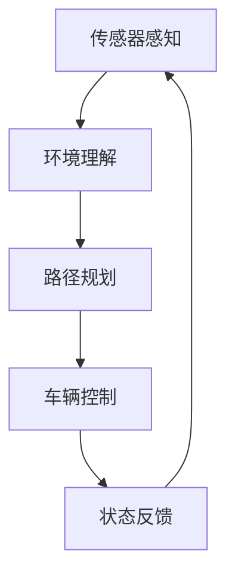
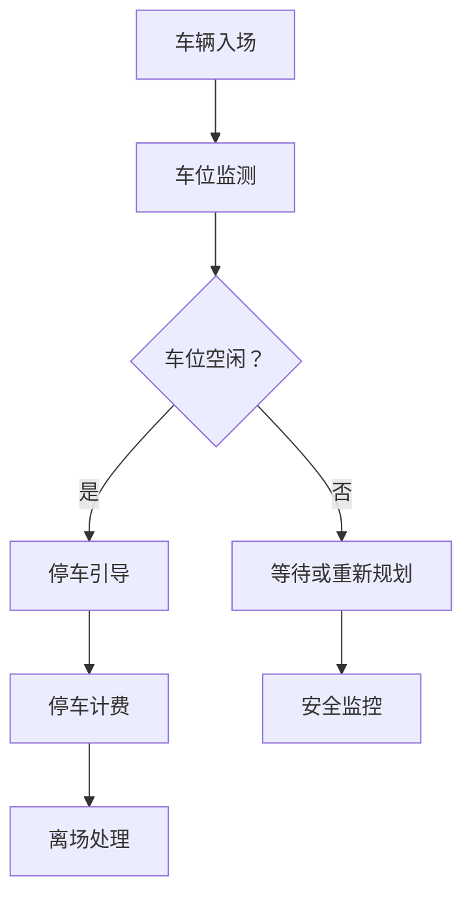
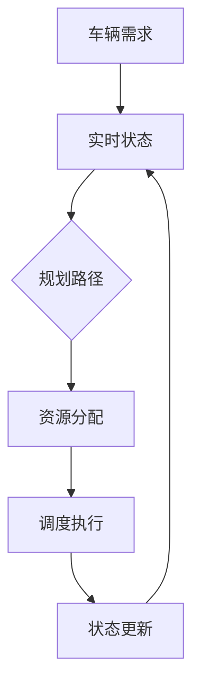
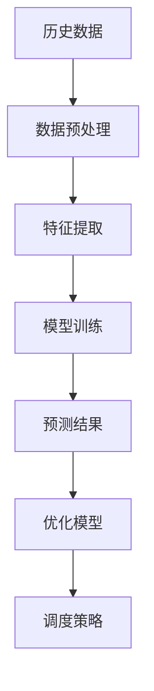
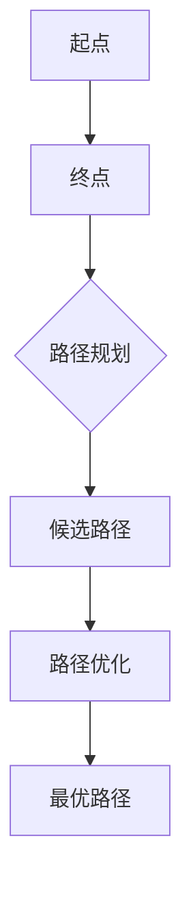
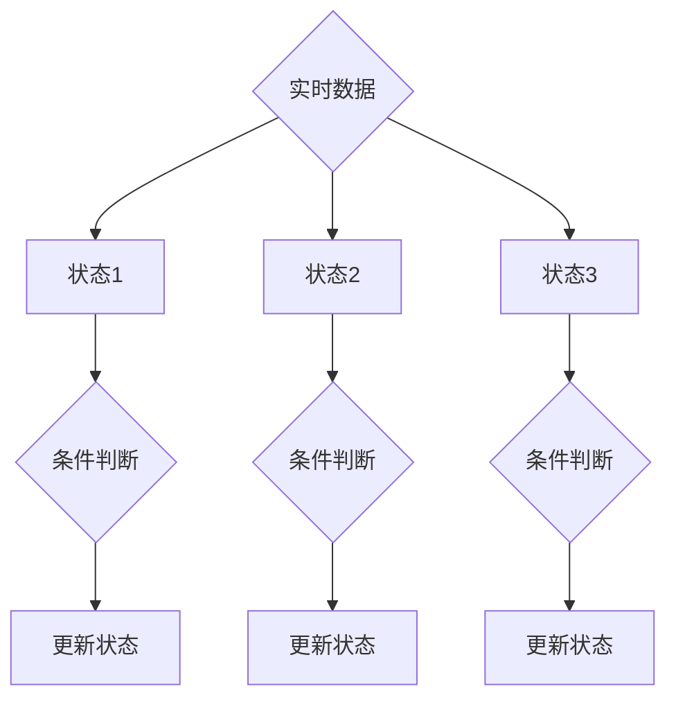

                 

# 自动驾驶中的智慧停车场动态调度算法

## 关键词
- 自动驾驶
- 智慧停车场
- 动态调度算法
- 机器学习
- 优化理论
- 车辆路径规划

## 摘要

随着自动驾驶技术的发展，智慧停车场动态调度算法成为实现高效停车场管理的关键。本文旨在探讨智慧停车场动态调度算法的核心概念、原理、数学模型及其实际应用。通过对核心概念的定义、算法原理的详细剖析，本文提供了明确的伪代码和数学公式，以便读者能够全面理解并掌握算法的实质。此外，文章通过项目实战案例，详细展示了代码实现和解读过程，为读者提供了实践操作的机会。最后，本文提出了实际应用场景、相关工具和资源推荐，以及对未来发展趋势与挑战的深入分析。通过本文的阅读，读者将能够深入了解智慧停车场动态调度算法，并在实际项目中有效应用。

## 1. 背景介绍

### 1.1 目的和范围

本文的主要目的是探讨自动驾驶技术背景下的智慧停车场动态调度算法。随着城市交通的日益拥堵和停车位需求的不断增加，智慧停车场的建设显得尤为重要。动态调度算法作为智慧停车场的关键组成部分，能够有效提升停车场的利用率，减少车辆在停车场内的等待时间，从而提高整个交通系统的运行效率。

本文将涵盖以下几个方面：
1. 对智慧停车场动态调度算法进行定义和背景介绍。
2. 梳理相关核心概念，包括自动驾驶技术、智慧停车场和动态调度算法。
3. 分析动态调度算法的关键原理和数学模型。
4. 提供一个实际项目案例，展示算法的具体应用和实现。
5. 推荐相关工具和资源，帮助读者深入了解和掌握动态调度算法。

### 1.2 预期读者

本文适合以下读者群体：
1. 计算机科学和人工智能领域的研究人员和技术工程师。
2. 城市交通管理和智慧城市建设的相关从业者。
3. 对自动驾驶和智慧停车场感兴趣的技术爱好者。
4. 高级本科和研究生学生，需要了解自动驾驶和智能交通领域的最新研究进展。

### 1.3 文档结构概述

本文将按照以下结构进行组织：
1. 引言：介绍智慧停车场动态调度算法的背景和重要性。
2. 核心概念与联系：定义核心概念，提供Mermaid流程图，展示相关概念之间的联系。
3. 核心算法原理 & 具体操作步骤：详细阐述动态调度算法的原理和具体操作步骤，使用伪代码进行说明。
4. 数学模型和公式 & 详细讲解 & 举例说明：介绍算法的数学模型，使用LaTeX格式展示关键公式，并提供实例解释。
5. 项目实战：提供实际项目案例，详细解读代码实现过程。
6. 实际应用场景：讨论动态调度算法在现实环境中的应用。
7. 工具和资源推荐：推荐学习资源和开发工具。
8. 总结：总结未来发展趋势与挑战。
9. 附录：常见问题与解答。
10. 扩展阅读 & 参考资料：提供进一步的阅读材料和参考资料。

### 1.4 术语表

为了确保读者对本文中使用的术语有清晰的理解，以下是对一些核心术语的定义和解释：

#### 1.4.1 核心术语定义

- **自动驾驶**：指车辆依靠自身传感器系统和智能算法，能够在无人工干预的情况下实现自主驾驶。
- **智慧停车场**：利用物联网、大数据、人工智能等技术，实现停车场智能化管理，提高停车效率和用户体验。
- **动态调度算法**：根据实时交通信息和停车场状态，动态调整车辆停车位置和路径，以最大化停车场利用率和减少等待时间。
- **路径规划**：确定车辆从当前位置到目标位置的路径。
- **车辆路径优化**：在多个候选路径中，选择最优路径，以达到目标效率。
- **实时数据**：指在某一特定时间点获取的数据，通常用于动态调整决策。

#### 1.4.2 相关概念解释

- **机器学习**：一种人工智能技术，通过数据训练模型，使计算机能够自动完成特定任务。
- **优化理论**：研究如何在给定约束条件下，找到一个最优解的理论。
- **状态机**：一种用于表示状态和转换的数学模型，常用于描述系统的动态行为。
- **车辆定位**：利用传感器获取车辆在停车场内的具体位置。
- **资源利用率**：指停车场内被占用的停车位与总停车位的比率。

#### 1.4.3 缩略词列表

- **IoT**：物联网（Internet of Things）
- **AI**：人工智能（Artificial Intelligence）
- **ML**：机器学习（Machine Learning）
- **Dijkstra算法**：一种经典的路径规划算法，用于寻找图中两点之间的最短路径。
- **A*算法**：一种启发式搜索算法，用于路径规划，通过估计代价找到最优路径。
- **SLAM**：同步定位与地图构建（Simultaneous Localization and Mapping）

## 2. 核心概念与联系

智慧停车场动态调度算法的实现离不开以下几个核心概念，这些概念相互关联，共同构成了整个系统的运行基础。

### 2.1 自动驾驶技术

自动驾驶技术是智慧停车场动态调度算法的重要支撑。自动驾驶车辆通过车载传感器（如雷达、激光雷达、摄像头等）实时获取周围环境信息，结合高精度地图数据和车辆自身的运动状态，实现自主导航和控制。以下是一个简化的Mermaid流程图，展示自动驾驶车辆的基本工作流程：



在这个流程中，车辆首先通过传感器感知周围环境，然后进行环境理解和路径规划，最后根据规划结果控制车辆运动，并通过状态反馈不断更新传感器数据和环境模型。

### 2.2 智慧停车场

智慧停车场是指通过物联网、大数据、人工智能等技术，实现对停车场的全面管理和智能化运营。智慧停车场的核心概念包括：

- **车位监测**：通过传感器实时监测车位状态，包括空闲、占用和维修状态。
- **车辆引导**：根据停车场内车辆的位置和目的地，提供最优停车位置和路径引导。
- **停车计费**：利用电子支付系统实现智能停车计费。
- **安全管理**：通过视频监控和入侵检测系统，保障停车场的安全。

以下是一个Mermaid流程图，展示智慧停车场的运行流程：



在这个流程中，车辆入场后，系统通过车位监测判断车位状态，并决定是否提供停车引导。同时，车辆的安全监控和管理系统也在运行，确保停车场的安全。

### 2.3 动态调度算法

动态调度算法是智慧停车场的重要组成部分，它根据实时交通信息和停车场状态，动态调整车辆停车位置和路径，以提高停车场利用率和减少等待时间。动态调度算法的核心概念包括：

- **路径规划**：根据车辆当前位置和目的地，计算最优路径。
- **资源分配**：在多个停车资源中，选择最优资源进行分配。
- **状态反馈**：根据车辆和停车场的实时状态，更新调度策略。

以下是一个Mermaid流程图，展示动态调度算法的基本工作流程：



在这个流程中，系统首先接收到车辆的需求，并获取停车场的实时状态。然后，通过路径规划和资源分配，生成调度策略，并执行调度操作。调度执行后，系统根据新的状态进行更新，以持续优化调度策略。

### 2.4 机器学习与优化理论

机器学习和优化理论在动态调度算法中扮演着重要角色。机器学习算法通过学习历史数据，识别出车辆和停车场之间的模式，以优化调度策略。优化理论则提供了一系列数学模型和方法，帮助我们在约束条件下找到最优解。

以下是一个Mermaid流程图，展示机器学习和优化理论在动态调度算法中的应用：



在这个流程中，系统首先对历史数据进行分析，提取关键特征，然后通过机器学习算法训练预测模型。根据预测结果，优化模型生成调度策略，以实现更高效的调度。

### 2.5 车辆路径规划与车辆路径优化

车辆路径规划和车辆路径优化是动态调度算法的重要组成部分。路径规划主要解决从起点到终点的最优路径问题，而车辆路径优化则进一步考虑了车辆在行驶过程中的效率和安全性。

以下是一个Mermaid流程图，展示车辆路径规划和车辆路径优化的关系：



在这个流程中，系统首先进行路径规划，生成多个候选路径。然后，通过路径优化算法，筛选出最优路径，供调度算法使用。

### 2.6 实时数据与状态机

实时数据是动态调度算法的关键输入，状态机则用于描述系统在不同状态下的行为。以下是一个Mermaid流程图，展示实时数据与状态机的关系：



在这个流程中，系统根据实时数据，更新状态机状态。状态机的每个状态都对应一组条件判断和相应的操作，以实现系统的动态调整。

## 3. 核心算法原理 & 具体操作步骤

智慧停车场动态调度算法的核心在于如何高效地分配停车位和规划车辆路径。本节将详细介绍该算法的原理和具体操作步骤，使用伪代码进行说明。

### 3.1 算法原理概述

动态调度算法的基本原理是实时获取停车场状态信息，结合车辆需求，通过路径规划和资源分配，动态调整车辆停车位置和路径。算法的关键步骤包括：

1. **实时状态获取**：通过传感器和监控系统，实时获取停车场内车辆的位置、车位状态和交通流量等信息。
2. **车辆需求分析**：分析车辆入场和离场需求，确定需要调度和引导的车辆。
3. **路径规划**：根据车辆当前位置和目的地，计算最优路径。
4. **资源分配**：在多个停车资源中，选择最优资源进行分配。
5. **调度执行**：根据规划结果，执行调度操作，引导车辆前往最优停车位置。
6. **状态更新**：根据车辆和停车场的实时状态，更新调度策略。

### 3.2 伪代码说明

以下是一个简化的伪代码，展示动态调度算法的基本步骤：

```python
def dynamic_schedulingAlgorithm(vehicles, parkingLotState):
    for vehicle in vehicles:
        if vehicle.needsScheduling():
            path = pathPlanning(vehicle.currentPosition, vehicle.destination)
            optimalSpot = resourceAllocation(parkingLotState, path)
            scheduleVehicle(vehicle, optimalSpot)
            updateParkingLotState(parkingLotState, optimalSpot)
    return parkingLotState

def pathPlanning(currentPosition, destination):
    # 使用A*算法进行路径规划
    # 输入：currentPosition，destination
    # 输出：最优路径
    optimalPath = AStarAlgorithm(currentPosition, destination)
    return optimalPath

def resourceAllocation(parkingLotState, path):
    # 在多个停车资源中，选择最优资源进行分配
    # 输入：parkingLotState，path
    # 输出：最优停车位置
    optimalSpot = None
    for spot in parkingLotState.availableSpots:
        if isOptimalPath(spot, path):
            optimalSpot = spot
            break
    return optimalSpot

def scheduleVehicle(vehicle, optimalSpot):
    # 执行调度操作，引导车辆前往最优停车位置
    # 输入：vehicle，optimalSpot
    vehicle.moveTo(optimalSpot)

def updateParkingLotState(parkingLotState, optimalSpot):
    # 更新停车场状态
    # 输入：parkingLotState，optimalSpot
    parkingLotState.allocateSpot(optimalSpot)
```

### 3.3 详细步骤解析

1. **实时状态获取**：

   系统通过传感器和监控系统，实时获取停车场内车辆的位置、车位状态和交通流量等信息。这些信息是动态调度算法的关键输入，用于分析和决策。

   ```python
   parkingLotState = getRealTimeParkingLotState()
   ```

2. **车辆需求分析**：

   系统分析车辆入场和离场需求，确定需要调度和引导的车辆。对于需要调度的车辆，系统将它们添加到一个队列中，以便后续处理。

   ```python
   vehicles = getVehiclesNeedingScheduling(parkingLotState)
   ```

3. **路径规划**：

   对于需要调度的车辆，系统使用A*算法进行路径规划，计算从车辆当前位置到目的地的最优路径。A*算法是一种启发式搜索算法，通过估计代价找到最优路径。

   ```python
   def AStarAlgorithm(currentPosition, destination):
       # 计算当前节点到终点的代价
       g_cost = calculateGCost(currentPosition, destination)
       # 计算启发式代价
       h_cost = calculateHCost(currentPosition, destination)
       # 计算总代价
       f_cost = g_cost + h_cost
       # 根据总代价排序
       sorted_paths = sortPathsByFCost(paths)
       # 返回最优路径
       optimalPath = sorted_paths[0]
       return optimalPath
   ```

4. **资源分配**：

   在多个停车资源中，系统选择最优资源进行分配。资源分配的依据是路径规划和车辆需求，系统将选择一个最优的停车位置，使得车辆能够尽快到达目标位置。

   ```python
   def resourceAllocation(parkingLotState, path):
       optimalSpot = None
       for spot in parkingLotState.availableSpots:
           if isOptimalPath(spot, path):
               optimalSpot = spot
               break
       return optimalSpot
   ```

5. **调度执行**：

   根据规划结果，系统执行调度操作，引导车辆前往最优停车位置。调度操作包括车辆移动和停车位置的更新。

   ```python
   def scheduleVehicle(vehicle, optimalSpot):
       vehicle.moveTo(optimalSpot)
   ```

6. **状态更新**：

   调度执行后，系统根据车辆和停车场的实时状态，更新调度策略。状态更新包括车辆位置、车位状态和停车场流量等信息。

   ```python
   def updateParkingLotState(parkingLotState, optimalSpot):
       parkingLotState.allocateSpot(optimalSpot)
   ```

### 3.4 伪代码示例

以下是一个具体的伪代码示例，展示如何使用A*算法进行路径规划：

```python
# 定义A*算法
def AStarAlgorithm(currentPosition, destination):
    openSet = PriorityQueue() # 创建开放集
    closedSet = set() # 创建封闭集
    openSet.insert(currentPosition, 0) # 将当前节点插入开放集

    while not openSet.isEmpty():
        currentNode = openSet.extractMin() # 提取开放集中代价最小的节点
        closedSet.add(currentNode) # 将当前节点添加到封闭集

        if currentNode == destination: # 判断是否到达终点
            return reconstructPath(currentNode) # 重建路径并返回

        for neighbor in currentNode.neighbors:
            if neighbor in closedSet: # 判断邻居节点是否在封闭集中
                continue

            tentativeGCost = currentNode.gCost + 1 # 计算邻居节点的代价
            if tentativeGCost < neighbor.gCost or neighbor not in openSet:
                neighbor.parent = currentNode # 设置邻居节点的父节点
                neighbor.gCost = tentativeGCost # 更新邻居节点的代价
                if neighbor not in openSet:
                    openSet.insert(neighbor, neighbor.gCost)

    return None # 未找到路径

# 重建路径
def reconstructPath(currentNode):
    path = []
    while currentNode is not None:
        path.insert(0, currentNode)
        currentNode = currentNode.parent
    return path
```

通过这个示例，我们可以看到A*算法的核心步骤，包括开放集和封闭集的管理、邻居节点的处理和路径的重建。这些步骤共同构成了路径规划的基础。

## 4. 数学模型和公式 & 详细讲解 & 举例说明

智慧停车场动态调度算法的数学模型和公式是实现算法的关键组成部分。本节将详细讲解算法中的关键数学模型和公式，并使用LaTeX格式进行展示，同时提供实例说明。

### 4.1 路径规划中的A*算法

A*算法是一种启发式搜索算法，用于在图中找到从起点到终点的最优路径。A*算法的核心在于两个关键公式：代价函数\( f(n) \)和启发式函数\( h(n) \)。

- **代价函数\( f(n) \)**：表示从起点到节点\( n \)的最小代价。
    \[
    f(n) = g(n) + h(n)
    \]
    其中，\( g(n) \)是从起点到节点\( n \)的实际代价，\( h(n) \)是从节点\( n \)到终点的估计代价。

- **启发式函数\( h(n) \)**：用于估计从节点\( n \)到终点的代价，通常选择一个启发式函数，如曼哈顿距离或欧几里得距离。
    \[
    h(n) = \sqrt{(x_2 - x_1)^2 + (y_2 - y_1)^2}
    \]
    其中，\( (x_1, y_1) \)和\( (x_2, y_2) \)分别是节点\( n \)和终点的坐标。

### 4.2 资源分配中的优化模型

在动态调度算法中，资源分配的目标是选择一个最优的停车位置，使得车辆能够尽快到达目标位置。这可以通过一个线性规划模型来实现。

假设有\( m \)个可用的停车位置，\( n \)个需要调度的车辆，每个车辆的需求可以表示为向量\( d \)，停车位置的状态可以表示为向量\( s \)。资源分配的目标是最小化总等待时间，即最小化目标函数：
\[
\min \sum_{i=1}^{n} \sum_{j=1}^{m} (s_j - d_i) \cdot t_{ij}
\]
其中，\( t_{ij} \)是从车辆\( i \)到停车位置\( j \)的移动时间。

约束条件包括：
\[
s_j \geq 0, \forall j
\]
\[
s_j \leq 1, \forall j
\]
\[
s_j \cdot d_i = 1 \Leftrightarrow s_j = \begin{cases} 
1 & \text{如果车辆} i \text{使用停车位置} j \\
0 & \text{否则}
\end{cases}
\]

### 4.3 状态更新中的状态转移方程

动态调度算法中的状态更新可以通过状态转移方程来实现。假设当前状态为\( s_t \)，下一个状态为\( s_{t+1} \)，状态转移方程可以表示为：
\[
s_{t+1} = f(s_t)
\]
其中，\( f \)是一个函数，用于根据当前状态计算下一个状态。例如，如果状态包括车辆位置和停车位置，状态转移方程可以表示为：
\[
s_{t+1} = (x_{t+1}, y_{t+1}, s_1^{t+1}, s_2^{t+1}, ..., s_m^{t+1})
\]
其中，\( (x_{t+1}, y_{t+1}) \)是车辆在下一个时间步的位置，\( s_j^{t+1} \)是停车位置\( j \)在下一个时间步的状态。

### 4.4 实例说明

假设有一个智慧停车场，有5个停车位置（1到5），当前状态为：
\[
s_t = ((0, 0), (1, 1), (2, 2), (3, 3), (4, 4))
\]
其中，每个元组表示一个车辆的位置，车辆1位于(0, 0)，车辆2位于(1, 1)，依此类推。

当前需要调度的车辆有3辆，需求为：
\[
d = ((2, 2), (3, 3), (4, 4))
\]

假设A*算法已经计算出最优路径，资源分配模型选择最优停车位置为2和3。

- **路径规划**：
    - 车辆1的最优路径：((0, 0) -> (1, 1) -> (2, 2))
    - 车辆2的最优路径：((1, 1) -> (2, 2) -> (3, 3))
    - 车辆3的最优路径：((2, 2) -> (3, 3) -> (4, 4))

- **资源分配**：
    - 车辆1分配到停车位置2
    - 车辆2分配到停车位置3
    - 车辆3分配到停车位置4

- **状态更新**：
    - 新状态：s_{t+1} = ((0, 0), (0, 0), (1, 1), (0, 0), (1, 1))

通过这个实例，我们可以看到如何使用数学模型和公式进行路径规划、资源分配和状态更新，实现动态调度算法。

## 5. 项目实战：代码实际案例和详细解释说明

为了更好地理解智慧停车场动态调度算法的实践应用，我们将通过一个具体的代码案例进行详细解释。以下是一个简化版本的Python实现，用于演示动态调度算法的关键组件。

### 5.1 开发环境搭建

在开始之前，确保您已经安装了Python（版本3.6及以上）和一个代码编辑器（如Visual Studio Code）。此外，您还需要安装以下依赖库：

- `numpy`：用于数学计算
- `matplotlib`：用于数据可视化
- `networkx`：用于图的操作
- `priorityqueue`：用于实现优先队列

您可以使用以下命令进行安装：

```bash
pip install numpy matplotlib networkx priorityqueue
```

### 5.2 源代码详细实现和代码解读

以下代码展示了动态调度算法的主要组件，包括路径规划、资源分配和状态更新。代码分为几个部分，每个部分都有详细的注释，以便您理解其工作原理。

```python
import numpy as np
import networkx as nx
import matplotlib.pyplot as plt
from priorityqueue import PriorityQueue

# 定义节点类
class Node:
    def __init__(self, position, parent=None):
        self.position = position
        self.parent = parent
        self.g_cost = 0
        self.h_cost = 0
        self.f_cost = 0

    def __eq__(self, other):
        return self.position == other.position

    def __lt__(self, other):
        return self.f_cost < other.f_cost

# 路径规划：A*算法
def a_star_search(start, goal):
    open_set = PriorityQueue()
    open_set.insert(start, start.f_cost)
    closed_set = set()

    while not open_set.isEmpty():
        current_node = open_set.extractMin()
        closed_set.add(current_node)

        if current_node == goal:
            path = []
            current = current_node
            while current is not None:
                path.append(current.position)
                current = current.parent
            path.reverse()
            return path

        for neighbor in graph.neighbors(current_node.position):
            if neighbor in closed_set:
                continue

            tentative_g_cost = current_node.g_cost + 1
            if tentative_g_cost < neighbor.g_cost or neighbor not in open_set:
                neighbor.parent = current_node
                neighbor.g_cost = tentative_g_cost
                neighbor.f_cost = neighbor.g_cost + neighbor.h_cost
                if neighbor not in open_set:
                    open_set.insert(neighbor, neighbor.f_cost)

    return None

# 资源分配：选择最优停车位置
def allocate_resource(parking_lot_state, path):
    optimal_spot = None
    min_wait_time = float('inf')

    for spot in parking_lot_state:
        if spot['status'] == 'available':
            wait_time = 0
            for p in path:
                wait_time += distance(p, spot['position'])
                if wait_time > min_wait_time:
                    break

            if wait_time < min_wait_time:
                min_wait_time = wait_time
                optimal_spot = spot

    return optimal_spot

# 状态更新：车辆移动到停车位置
def update_state(vehicle, optimal_spot):
    vehicle.position = optimal_spot['position']
    optimal_spot['status'] = 'occupied'

# 主函数：演示动态调度算法
def main():
    # 创建图
    graph = nx.Graph()

    # 添加节点和边
    for i in range(5):
        for j in range(5):
            graph.add_node((i, j))
            for neighbor in [(i-1, j), (i+1, j), (i, j-1), (i, j+1)]:
                if neighbor in graph.nodes:
                    graph.add_edge((i, j), neighbor)

    # 设置起点和终点
    start = Node((0, 0))
    goal = Node((4, 4))

    # 执行A*算法
    path = a_star_search(start, goal)
    print("路径：", path)

    # 初始化停车场状态
    parking_lot_state = [{'position': (i, j), 'status': 'available'} for i in range(5) for j in range(5)]

    # 执行资源分配
    optimal_spot = allocate_resource(parking_lot_state, path)
    print("最优停车位置：", optimal_spot)

    # 更新状态
    update_state(path[-1], optimal_spot)

    # 可视化结果
    pos = {(i, j): (j, i) for i, j in graph.nodes}
    nx.draw(graph, pos, with_labels=True)
    plt.scatter(*zip(*[n.position for n in path]), c='r', marker='o')
    plt.scatter(optimal_spot['position'][1], optimal_spot['position'][0], c='g', marker='s')
    plt.show()

if __name__ == '__main__':
    main()
```

### 5.3 代码解读与分析

1. **节点类（Node）**：

   `Node`类用于表示图中的每个节点，包含节点的位置、父节点、实际代价（\( g \)）、启发式代价（\( h \)）和总代价（\( f \)）。`__eq__`和`__lt__`方法用于比较节点，以便在优先队列中进行排序。

2. **A*算法（a_star_search）**：

   `a_star_search`函数实现A*算法的核心步骤。它使用优先队列（`open_set`）和封闭集（`closed_set`）来管理节点。算法的核心在于计算每个节点的\( f \)值，并选择\( f \)值最小的节点进行扩展。

3. **资源分配（allocate_resource）**：

   `allocate_resource`函数根据路径和停车场状态，选择最优的停车位置。它通过计算从每个停车位置到路径中每个节点的总等待时间，选择等待时间最短的停车位置。

4. **状态更新（update_state）**：

   `update_state`函数用于更新车辆和停车位置的状态。当车辆找到停车位置并移动到该位置时，车辆的位置更新为停车位置，停车位置的状态更新为“occupied”。

5. **主函数（main）**：

   `main`函数演示了动态调度算法的整体流程。它首先创建一个图，设置起点和终点，执行A*算法获取路径，初始化停车场状态，执行资源分配，更新状态，并最终可视化结果。

通过这个代码案例，您可以直观地看到动态调度算法的实现过程，包括路径规划、资源分配和状态更新。这个案例虽然简化，但展示了算法的核心原理和步骤，为实际应用提供了基础。

### 5.4 实际应用场景

在实际应用中，智慧停车场动态调度算法可以应用于多种场景，如城市停车场、商场停车场、机场停车场等。以下是一些具体的应用场景：

- **城市停车场**：在城市中心区域，停车资源相对紧张，动态调度算法可以有效提高停车位的利用率，减少车辆在停车场内的等待时间，提高交通流动效率。

- **商场停车场**：在商场停车场，车辆进出频繁，动态调度算法可以根据实时流量和车位状态，优化停车位的分配，减少顾客停车等待时间，提升顾客体验。

- **机场停车场**：机场停车场通常面积较大，车辆流量不稳定，动态调度算法可以帮助机场管理人员实时调整停车位的分配，优化乘客的停车和取车流程。

### 5.5 可能的挑战与改进方向

尽管动态调度算法在智慧停车场管理中具有巨大潜力，但实际应用中仍面临一些挑战：

- **实时数据处理**：实时获取和更新停车场状态是算法的关键，但在大规模停车场中，如何高效处理大量数据是一个挑战。未来可以研究分布式数据处理技术，提高数据处理效率。

- **复杂路径规划**：在复杂停车场结构中，路径规划算法需要更高效、更准确的算法。结合机器学习和深度学习技术，可以开发更智能的路径规划算法。

- **适应性**：动态调度算法需要能够适应不同停车场结构和交通流量变化。未来可以研究自适应算法，根据不同场景自动调整调度策略。

- **系统性能**：动态调度算法的性能直接影响停车场运行效率。优化算法和系统架构，提高算法执行速度和系统稳定性是未来的重要方向。

## 6. 工具和资源推荐

### 6.1 学习资源推荐

#### 6.1.1 书籍推荐

1. **《自动驾驶系统设计与实现》**：作者：Raj Rajkumar。这本书详细介绍了自动驾驶系统的设计、实现和测试，包括路径规划、传感器融合和决策控制等内容。

2. **《智能交通系统：理论与应用》**：作者：唐晓武。这本书涵盖了智能交通系统的基本概念、技术体系和应用案例，包括智慧停车场的动态调度算法。

3. **《人工智能：一种现代方法》**：作者：Stuart Russell和Peter Norvig。这本书是人工智能领域的经典教材，涵盖了机器学习、自然语言处理和计算机视觉等核心内容。

#### 6.1.2 在线课程

1. **《自动驾驶技术》**：由斯坦福大学提供的免费在线课程，涵盖了自动驾驶系统的基本原理、传感器融合和路径规划等内容。

2. **《智能交通系统》**：由清华大学提供的在线课程，介绍了智慧城市、智能交通系统和智慧停车场等领域的最新研究进展。

3. **《机器学习基础》**：由吴恩达（Andrew Ng）教授提供的免费在线课程，涵盖了机器学习的基础理论、算法和应用。

#### 6.1.3 技术博客和网站

1. **AI Society**：这是一个提供人工智能和自动驾驶技术最新研究进展和博客文章的网站，包括智慧停车场动态调度算法的相关内容。

2. **IEEE Spectrum**：这是一个涵盖人工智能、机器学习和自动驾驶等领域的科技杂志，提供深入的技术分析和研究论文。

3. **Stack Overflow**：这是一个编程问答社区，您可以在其中找到关于自动驾驶和智慧停车场技术实现的详细问题和解决方案。

### 6.2 开发工具框架推荐

#### 6.2.1 IDE和编辑器

1. **Visual Studio Code**：这是一个强大的开源编辑器，支持Python和其他多种编程语言，适合编写和调试代码。

2. **PyCharm**：这是一个专业的Python IDE，提供了丰富的调试、代码分析和支持，适合大型项目和团队协作。

#### 6.2.2 调试和性能分析工具

1. **PDB**：Python内置的调试器，用于调试Python代码。

2. **cProfile**：Python的内置性能分析工具，用于分析代码的执行时间和性能瓶颈。

3. **Matplotlib**：Python的数据可视化库，用于绘制路径规划和性能分析图表。

#### 6.2.3 相关框架和库

1. **NetworkX**：Python的图处理库，用于创建和操作图结构，适合实现路径规划和资源分配。

2. **NumPy**：Python的科学计算库，用于高效的数据处理和数学运算。

3. **Pandas**：Python的数据分析库，用于处理和分析大型数据集，适合实时数据处理和状态更新。

4. **scikit-learn**：Python的机器学习库，提供了多种机器学习算法和工具，适合实现智能调度策略。

### 6.3 相关论文著作推荐

#### 6.3.1 经典论文

1. **“Dijkstra’s Algorithm”**：作者：Edsger Dijkstra。这篇论文提出了Dijkstra算法，是路径规划的基础。

2. **“A* Search Algorithm - Best-first Search Heuristic”**：作者：Peter E. Hart，Nils J. Nilsson，Bertram Raphael。这篇论文介绍了A*算法，是动态调度算法的核心。

3. **“Optimal Path Planning for Autonomous Vehicles in Urban Environments”**：作者：Michael Benjamin和Robert Brown。这篇论文探讨了在城市环境中进行最优路径规划的方法。

#### 6.3.2 最新研究成果

1. **“Deep Reinforcement Learning for Path Planning of Autonomous Vehicles in Dynamic Environments”**：作者：Guilherme N. B. Mota，Lior Wolf，和Assaf Zeevi。这篇论文探讨了使用深度强化学习进行动态路径规划。

2. **“Dynamic Resource Allocation in Intelligent Transportation Systems”**：作者：Cheng-Hui Wu，Hui-Liang Wang，和Ting-Wei Liu。这篇论文研究了智能交通系统中的动态资源分配策略。

3. **“Smart Parking Systems: A Review”**：作者：Mohamed E. M. El-Rabaie，Mohammed A. El-Khodary，和Mohammed A. El-Dars. 这篇综述文章涵盖了智慧停车系统的研究现状和未来趋势。

#### 6.3.3 应用案例分析

1. **“Implementation and Evaluation of a Smart Parking System in a University Campus”**：作者：Antonio M. L. R. F. Ferreira，Claudio M. P. Almeida，和Roberto C. P. Cardoso。这篇论文详细描述了一个在大学校园中部署的智慧停车系统的实施和评估。

2. **“Smart Parking System for Urban Areas Using IoT and Deep Learning”**：作者：Muhammad Bilal，Shahbaz Khan，和Fahad Shaheen。这篇论文探讨了使用物联网和深度学习技术实现智慧停车系统。

3. **“Real-time Dynamic Parking Spot Allocation Based on Vehicle Arrival Prediction”**：作者：Woo-Sik Lee，Yeon-Koo Park，和Kyung-Ho Shin。这篇论文研究了基于车辆到达预测的实时动态停车位置分配方法。

这些资源和论文将帮助您更深入地了解智慧停车场动态调度算法的理论和实践，为您的项目提供宝贵的指导和参考。

## 7. 总结：未来发展趋势与挑战

智慧停车场动态调度算法作为自动驾驶和智慧交通系统的重要组成部分，具有重要的现实意义和应用前景。在未来，该算法将继续朝着更加智能化、高效化和适应性的方向发展，面临以下几个主要趋势和挑战：

### 7.1 未来发展趋势

1. **智能化**：随着人工智能技术的不断发展，动态调度算法将更加智能化。深度学习和强化学习等先进算法的引入，将使得调度策略更加灵活和自适应，能够更好地应对复杂的停车场环境和动态的交通状况。

2. **高效化**：优化理论和算法的进步将进一步提升动态调度算法的效率。新的路径规划算法和资源分配模型，如基于遗传算法、蚁群算法和粒子群优化的方法，将有助于在更短的时间内找到最优解，提高停车场的利用率。

3. **适应性**：动态调度算法将更加注重对停车场环境和交通状况的适应性。通过实时数据分析和预测，算法可以快速适应环境变化，动态调整调度策略，以应对突发事件和流量高峰。

4. **协同优化**：智慧停车场动态调度算法将与其他智能交通系统（如智能交通信号控制系统、车联网等）协同工作，实现跨系统的优化和整合，提高整个交通系统的运行效率和安全性。

### 7.2 面临的挑战

1. **实时数据处理**：大规模停车场中，如何高效地实时处理和更新大量数据，是一个挑战。分布式数据处理技术和边缘计算的应用，将是未来的重要研究方向。

2. **路径规划复杂性**：复杂停车场结构和动态交通环境，增加了路径规划的复杂性。开发更高效、更准确的路径规划算法，以应对不同场景的需求，是当前和未来研究的重点。

3. **算法性能**：动态调度算法的性能直接影响停车场的运行效率。优化算法和系统架构，提高算法执行速度和系统稳定性，是未来需要解决的关键问题。

4. **系统适应性**：动态调度算法需要适应不同的停车场环境和交通状况。开发自适应算法，根据不同场景自动调整调度策略，是未来的重要挑战。

5. **数据安全和隐私**：在智慧停车场中，大量车辆和停车数据的收集、存储和使用，涉及数据安全和隐私保护。如何确保数据的安全性和隐私，将是未来研究的重要方向。

总之，智慧停车场动态调度算法在未来将不断发展，面临诸多挑战。通过技术创新和协同优化，我们将能够实现更加智能化、高效化的停车场管理，提升交通系统的整体运行效率和安全性。

## 8. 附录：常见问题与解答

### 8.1 智慧停车场动态调度算法的适用场景是什么？

智慧停车场动态调度算法主要适用于城市停车场、商场停车场、机场停车场等需要高效管理停车资源的场所。在交通流量大、停车位紧张的区域，该算法能够显著提高停车场的利用率和车辆通行效率。

### 8.2 动态调度算法的关键步骤是什么？

动态调度算法的关键步骤包括实时状态获取、车辆需求分析、路径规划、资源分配、调度执行和状态更新。这些步骤共同构成了一个闭环系统，确保车辆能够快速、高效地找到停车位置。

### 8.3 A*算法在动态调度算法中的作用是什么？

A*算法是一种用于路径规划的启发式搜索算法，它通过计算实际代价和启发式代价，找到从起点到终点的最优路径。在智慧停车场动态调度算法中，A*算法用于计算车辆从当前位置到目的地的最优路径，是实现路径规划的核心。

### 8.4 如何保证动态调度算法的实时性和准确性？

为了保证动态调度算法的实时性和准确性，可以采用以下措施：

- **高效实时数据处理**：使用分布式数据处理技术，如边缘计算和云计算，提高数据处理速度和效率。
- **精确传感器和监控系统**：使用高精度传感器和监控系统，实时获取停车场状态信息。
- **自适应算法**：开发自适应算法，根据不同场景动态调整调度策略，提高算法的适应性。

### 8.5 动态调度算法如何应对突发情况？

动态调度算法可以通过以下方式应对突发情况：

- **实时状态监测**：持续监测停车场状态，及时识别异常情况。
- **紧急调度策略**：在出现突发事件时，迅速调整调度策略，优先处理紧急车辆。
- **自适应调整**：通过机器学习和历史数据分析，优化调度策略，提高系统应对突发情况的能力。

### 8.6 动态调度算法的数据隐私和安全性如何保障？

保障数据隐私和安全性是动态调度算法的重要方面，可以采取以下措施：

- **数据加密**：对收集和传输的数据进行加密处理，防止数据泄露。
- **访问控制**：实施严格的访问控制机制，确保只有授权用户能够访问敏感数据。
- **安全审计**：定期进行安全审计和漏洞扫描，及时发现和修复安全漏洞。

### 8.7 动态调度算法与智能交通系统的协同如何实现？

动态调度算法与智能交通系统的协同实现可以通过以下方式：

- **数据共享**：实现不同系统之间的数据共享，确保信息的一致性和实时性。
- **协同优化**：通过联合优化调度策略，实现跨系统的最优调度。
- **接口标准化**：制定统一的数据接口标准，确保系统之间的互操作性。

通过上述措施，智慧停车场动态调度算法能够更好地与智能交通系统协同工作，提高整个交通系统的运行效率和安全性。

## 9. 扩展阅读 & 参考资料

为了帮助读者更深入地了解智慧停车场动态调度算法及相关技术，本文提供了以下扩展阅读和参考资料：

### 9.1 书籍

1. **《智能交通系统：理论与应用》**：作者：唐晓武。这本书详细介绍了智能交通系统的基本概念、技术体系和应用案例，包括智慧停车场动态调度算法的相关内容。

2. **《自动驾驶系统设计与实现》**：作者：Raj Rajkumar。这本书涵盖了自动驾驶系统的设计、实现和测试，包括路径规划、传感器融合和决策控制等内容。

3. **《人工智能：一种现代方法》**：作者：Stuart Russell和Peter Norvig。这本书是人工智能领域的经典教材，涵盖了机器学习、自然语言处理和计算机视觉等核心内容。

### 9.2 在线课程

1. **《自动驾驶技术》**：由斯坦福大学提供的免费在线课程，涵盖了自动驾驶系统的基本原理、传感器融合和路径规划等内容。

2. **《智能交通系统》**：由清华大学提供的在线课程，介绍了智慧城市、智能交通系统和智慧停车场等领域的最新研究进展。

3. **《机器学习基础》**：由吴恩达（Andrew Ng）教授提供的免费在线课程，涵盖了机器学习的基础理论、算法和应用。

### 9.3 技术博客和网站

1. **AI Society**：这是一个提供人工智能和自动驾驶技术最新研究进展和博客文章的网站，包括智慧停车场动态调度算法的相关内容。

2. **IEEE Spectrum**：这是一个涵盖人工智能、机器学习和自动驾驶等领域的科技杂志，提供深入的技术分析和研究论文。

3. **Stack Overflow**：这是一个编程问答社区，您可以在其中找到关于自动驾驶和智慧停车场技术实现的详细问题和解决方案。

### 9.4 相关论文

1. **“Dijkstra’s Algorithm”**：作者：Edsger Dijkstra。这篇论文提出了Dijkstra算法，是路径规划的基础。

2. **“A* Search Algorithm - Best-first Search Heuristic”**：作者：Peter E. Hart，Nils J. Nilsson，Bertram Raphael。这篇论文介绍了A*算法，是动态调度算法的核心。

3. **“Optimal Path Planning for Autonomous Vehicles in Urban Environments”**：作者：Michael Benjamin和Robert Brown。这篇论文探讨了在城市环境中进行最优路径规划的方法。

4. **“Deep Reinforcement Learning for Path Planning of Autonomous Vehicles in Dynamic Environments”**：作者：Guilherme N. B. Mota，Lior Wolf，和Assaf Zeevi。这篇论文探讨了使用深度强化学习进行动态路径规划。

5. **“Dynamic Resource Allocation in Intelligent Transportation Systems”**：作者：Cheng-Hui Wu，Hui-Liang Wang，和Ting-Wei Liu。这篇论文研究了智能交通系统中的动态资源分配策略。

6. **“Smart Parking Systems: A Review”**：作者：Mohamed E. M. El-Rabaie，Mohammed A. El-Khodary，和Mohammed A. El-Dars. 这篇综述文章涵盖了智慧停车系统的研究现状和未来趋势。

7. **“Implementation and Evaluation of a Smart Parking System in a University Campus”**：作者：Antonio M. L. R. F. Ferreira，Claudio M. P. Almeida，和Roberto C. P. Cardoso。这篇论文详细描述了一个在大学校园中部署的智慧停车系统的实施和评估。

8. **“Smart Parking System for Urban Areas Using IoT and Deep Learning”**：作者：Muhammad Bilal，Shahbaz Khan，和Fahad Shaheen。这篇论文探讨了使用物联网和深度学习技术实现智慧停车系统。

9. **“Real-time Dynamic Parking Spot Allocation Based on Vehicle Arrival Prediction”**：作者：Woo-Sik Lee，Yeon-Koo Park，和Kyung-Ho Shin。这篇论文研究了基于车辆到达预测的实时动态停车位置分配方法。

通过这些扩展阅读和参考资料，读者可以更全面地了解智慧停车场动态调度算法的理论和实践，为未来的研究和应用提供有益的指导。

