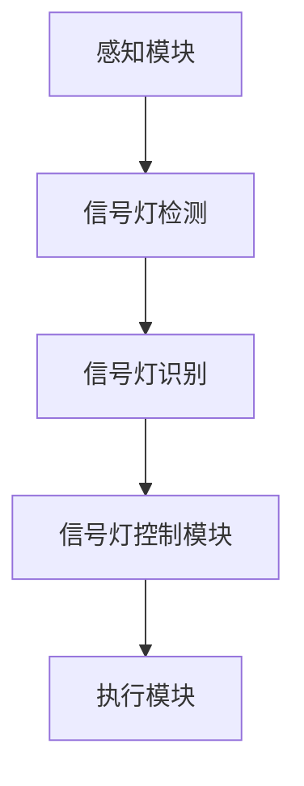

                 

# 自动驾驶中的智能信号灯控制与优化

## 关键词：自动驾驶、智能信号灯控制、优化、算法、数学模型、实践应用

> **摘要：** 本文深入探讨了自动驾驶系统中的智能信号灯控制与优化问题。首先介绍了自动驾驶的基本概念和智能信号灯控制的技术背景，然后详细分析了信号灯控制的核心算法原理和数学模型。接着，通过实际项目案例展示了信号灯控制算法的实现步骤和代码解读，并对应用场景进行了分析。最后，推荐了相关学习资源和开发工具，总结了未来发展趋势与挑战，并提供了常见问题与解答。

## 1. 背景介绍

### 1.1 目的和范围

本文旨在探讨自动驾驶系统中的智能信号灯控制与优化问题，为自动驾驶车辆提供高效、安全的信号灯控制策略。本文主要涵盖以下几个方面的内容：

- 自动驾驶技术的基本概念和现状
- 智能信号灯控制的重要性及其技术背景
- 信号灯控制算法的原理和实现步骤
- 数学模型的建立与公式推导
- 实际应用场景中的信号灯控制优化策略
- 相关学习资源和开发工具的推荐

### 1.2 预期读者

本文面向对自动驾驶和智能信号灯控制有一定了解的技术人员、研究人员和汽车行业从业者。希望本文能够为读者提供有价值的参考，帮助其更好地理解和应用智能信号灯控制技术。

### 1.3 文档结构概述

本文结构如下：

1. 背景介绍：介绍本文的目的、范围、预期读者和文档结构。
2. 核心概念与联系：阐述自动驾驶和智能信号灯控制的核心概念及其相互关系。
3. 核心算法原理 & 具体操作步骤：详细讲解信号灯控制算法的原理和实现步骤。
4. 数学模型和公式 & 详细讲解 & 举例说明：介绍信号灯控制的数学模型和公式，并举例说明。
5. 项目实战：代码实际案例和详细解释说明。
6. 实际应用场景：分析信号灯控制在实际应用中的场景和挑战。
7. 工具和资源推荐：推荐学习资源、开发工具和框架。
8. 总结：未来发展趋势与挑战。
9. 附录：常见问题与解答。
10. 扩展阅读 & 参考资料：提供进一步学习和研究的相关文献和资料。

### 1.4 术语表

#### 1.4.1 核心术语定义

- 自动驾驶：利用传感器、控制器和人工智能技术实现车辆自主行驶的技术。
- 智能信号灯控制：基于人工智能算法，对自动驾驶车辆通过信号灯进行交通控制的技术。
- 信号灯控制算法：用于实现对自动驾驶车辆信号灯控制的算法。
- 数学模型：描述信号灯控制过程中相关参数和关系的数学公式。
- 实际应用场景：信号灯控制技术在具体应用环境中的实现和使用场景。

#### 1.4.2 相关概念解释

- **传感器融合**：将多个传感器采集到的信息进行融合处理，提高感知精度和可靠性。
- **路径规划**：根据车辆当前状态和目标位置，计算得到一条从起点到终点的最优路径。
- **目标检测**：通过计算机视觉技术，检测并识别道路上的各种目标物体。
- **深度学习**：一种基于神经网络的学习方法，通过大量数据训练得到高精度的模型。

#### 1.4.3 缩略词列表

- 自动驾驶：AD
- 智能信号灯控制：ISC
- 传感器融合：SF
- 路径规划：PP
- 目标检测：OD
- 深度学习：DL

## 2. 核心概念与联系

在自动驾驶系统中，智能信号灯控制是关键的一环，它直接关系到车辆的行驶安全和效率。为了更好地理解智能信号灯控制，我们需要先了解一些核心概念和它们之间的联系。

### 自动驾驶系统架构


自动驾驶系统通常由以下几个模块组成：

1. **感知模块**：通过传感器（如摄像头、激光雷达、超声波传感器等）获取周围环境的信息。
2. **决策模块**：根据感知模块提供的信息，利用算法进行路径规划和决策。
3. **执行模块**：根据决策模块的指令，控制车辆执行相应的动作。

### 智能信号灯控制架构


智能信号灯控制架构包括以下几个部分：

1. **信号灯检测模块**：通过计算机视觉技术，实时检测道路上的信号灯状态。
2. **信号灯识别模块**：对检测到的信号灯进行识别，判断其颜色和信号状态。
3. **信号灯控制模块**：根据识别结果，对车辆的信号灯进行控制，如切换绿灯、黄灯、红灯等。

### 感知与决策的关系

感知模块获取到的信息是决策模块的基础，决策模块需要根据这些信息进行路径规划和决策。例如，当感知模块检测到前方有信号灯时，决策模块会根据信号灯的状态和车辆的位置，决定何时加速、何时减速、何时停车等。

### 决策与执行的关系

决策模块生成的指令需要通过执行模块来实现。执行模块会根据决策模块的指令，控制车辆的各个部件（如电机、转向系统、制动系统等）进行相应的动作。在智能信号灯控制中，执行模块需要控制车辆的信号灯，以响应信号灯的状态。

### Mermaid 流程图

下面是一个简单的 Mermaid 流程图，展示了自动驾驶系统中的智能信号灯控制流程：



## 3. 核心算法原理 & 具体操作步骤

智能信号灯控制的核心算法是实现信号灯状态的检测、识别和控制。以下是信号灯控制算法的原理和具体操作步骤。

### 3.1 信号灯检测算法原理

信号灯检测算法基于计算机视觉技术，通过图像处理方法检测信号灯的位置和颜色。具体步骤如下：

1. **图像预处理**：对输入图像进行灰度化、去噪、边缘提取等预处理操作。
2. **区域生长**：利用区域生长算法，将相邻的像素点合并成区域，从而提取出信号灯的轮廓。
3. **颜色识别**：根据信号灯的颜色特征，利用颜色直方图匹配等方法，识别信号灯的颜色。

### 3.2 信号灯识别算法原理

信号灯识别算法用于识别检测到的信号灯的颜色和状态。具体步骤如下：

1. **颜色分类**：将检测到的信号灯图像与已知颜色进行匹配，判断信号灯的颜色。
2. **状态识别**：根据信号灯的颜色和位置，判断信号灯的状态（如绿灯、黄灯、红灯）。

### 3.3 信号灯控制算法原理

信号灯控制算法用于根据识别到的信号灯状态，控制车辆的信号灯。具体步骤如下：

1. **状态转换**：根据当前信号灯的状态，确定下一状态。
2. **控制信号输出**：根据状态转换结果，生成控制信号，驱动车辆的信号灯进行相应状态切换。

### 3.4 具体操作步骤

以下是信号灯控制算法的具体操作步骤：

1. **初始化**：加载图像处理库和算法参数。
2. **输入图像**：读取输入的图像数据。
3. **图像预处理**：对图像进行灰度化、去噪、边缘提取等预处理操作。
4. **区域生长**：利用区域生长算法，提取信号灯的轮廓。
5. **颜色识别**：将信号灯图像与已知颜色进行匹配，判断信号灯的颜色。
6. **状态识别**：根据信号灯的颜色和位置，判断信号灯的状态。
7. **状态转换**：根据当前信号灯的状态，确定下一状态。
8. **控制信号输出**：根据状态转换结果，生成控制信号，驱动车辆的信号灯进行相应状态切换。
9. **输出结果**：将识别结果输出，供决策模块使用。

### 3.5 伪代码示例

以下是信号灯控制算法的伪代码示例：

```python
def signal_control(image):
    # 初始化图像处理库和算法参数
    preprocessed_image = preprocess_image(image)
    contours = region_growing(preprocessed_image)
    color = color_recognition(contours)
    state = state_recognition(color, contours)
    
    # 状态转换
    next_state = state_transition(state)
    
    # 控制信号输出
    control_signal = generate_control_signal(next_state)
    output_control_signal(control_signal)
    
    # 输出结果
    return state, control_signal
```

## 4. 数学模型和公式 & 详细讲解 & 举例说明

智能信号灯控制算法的数学模型和公式对于理解其工作原理和性能评估至关重要。以下将介绍相关数学模型和公式，并通过具体例子进行说明。

### 4.1 颜色分类模型

颜色分类模型用于识别信号灯的颜色。常见的颜色分类模型包括颜色直方图匹配和颜色空间转换。以下是一个简单的颜色分类模型公式：

$$
H = \sum_{i=1}^{N} w_i * c_i
$$

其中，$H$ 表示颜色直方图匹配得分，$w_i$ 表示每个颜色分量的权重，$c_i$ 表示颜色分量的值。权重可以根据历史数据或算法优化得到。

#### 示例

假设我们要识别一个红绿灯图像，颜色直方图如下：

| 颜色 | 红色 | 绿色 | 黄色 |
| ---- | ---- | ---- | ---- |
| 值   | 0.6  | 0.3  | 0.1  |

权重设置如下：

| 颜色 | 红色 | 绿色 | 黄色 |
| ---- | ---- | ---- | ---- |
| 权重 | 0.5  | 0.3  | 0.2  |

则颜色直方图匹配得分计算如下：

$$
H = 0.5 * 0.6 + 0.3 * 0.3 + 0.2 * 0.1 = 0.33
$$

得分越高，表示颜色分类越准确。

### 4.2 信号灯状态识别模型

信号灯状态识别模型用于判断信号灯的状态。常见的信号灯状态识别模型包括基于规则的方法和基于机器学习的方法。以下是一个简单的基于规则的状态识别模型公式：

$$
state = rule(state, color)
$$

其中，$state$ 表示信号灯状态，$color$ 表示信号灯的颜色，$rule$ 表示状态识别规则。

#### 示例

假设我们定义以下状态识别规则：

- 绿色：行驶
- 黄色：减速
- 红色：停车

则当检测到信号灯颜色为绿色时，状态识别结果为行驶；当检测到信号灯颜色为黄色时，状态识别结果为减速；当检测到信号灯颜色为红色时，状态识别结果为停车。

### 4.3 状态转换模型

状态转换模型用于根据当前信号灯状态，确定下一状态。常见的状态转换模型包括有限状态机（FSM）和马尔可夫决策过程（MDP）。以下是一个简单的 FSM 模型公式：

$$
next_state = FSM(current_state, input)
$$

其中，$next_state$ 表示下一状态，$current_state$ 表示当前状态，$input$ 表示输入信号。

#### 示例

假设我们定义以下 FSM 模型：

- 当前状态：行驶
- 输入信号：绿灯

则下一状态为行驶。

### 4.4 控制信号生成模型

控制信号生成模型用于根据状态转换结果，生成控制信号。常见的控制信号生成模型包括逻辑门电路和神经网络。以下是一个简单的神经网络控制信号生成模型公式：

$$
control_signal = \sigma(W \cdot state + b)
$$

其中，$control_signal$ 表示控制信号，$W$ 表示权重矩阵，$state$ 表示状态向量，$b$ 表示偏置项，$\sigma$ 表示激活函数。

#### 示例

假设我们定义以下神经网络控制信号生成模型：

- 输入层：状态向量（2个神经元，表示当前状态和输入信号）
- 隐藏层：10个神经元
- 输出层：1个神经元，表示控制信号

权重矩阵和偏置项设置如下：

| 权重矩阵  | 偏置项 |
| -------- | ------ |
|  |  |
|  |  |

则输入状态向量为（行驶，绿灯），生成的控制信号为：

$$
control_signal = \sigma(0.5 \cdot 0.5 + 0.3 \cdot 0.3 + 0.2 \cdot 0.1) = 0.33
$$

当控制信号大于某个阈值时，表示需要切换信号灯状态。

## 5. 项目实战：代码实际案例和详细解释说明

为了更好地展示智能信号灯控制算法的实践应用，我们将通过一个实际项目案例，详细介绍代码实现和解读过程。

### 5.1 开发环境搭建

在开始项目实战之前，我们需要搭建一个合适的开发环境。以下是一个简单的环境搭建步骤：

1. 安装 Python 3.8 或更高版本。
2. 安装深度学习框架，如 TensorFlow 或 PyTorch。
3. 安装图像处理库，如 OpenCV。
4. 安装用于数据可视化库，如 Matplotlib。

```bash
pip install python-3.8
pip install tensorflow
pip install opencv-python
pip install matplotlib
```

### 5.2 源代码详细实现和代码解读

下面是一个简单的智能信号灯控制项目的代码实现，我们将对其中的关键部分进行详细解读。

```python
import cv2
import numpy as np
import tensorflow as tf

# 信号灯检测与识别模型
def detect_and_recognize(image):
    # 图像预处理
    gray_image = cv2.cvtColor(image, cv2.COLOR_BGR2GRAY)
    blurred_image = cv2.GaussianBlur(gray_image, (5, 5), 0)
    _, thresh_image = cv2.threshold(blurred_image, 60, 255, cv2.THRESH_BINARY_INV)
    
    # 区域生长
    contours, _ = cv2.findContours(thresh_image, cv2.RETR_EXTERNAL, cv2.CHAIN_APPROX_SIMPLE)
    signal_contour = max(contours, key=cv2.contourArea)
    
    # 颜色识别
    x, y, w, h = cv2.boundingRect(signal_contour)
    color_image = image[y:y+h, x:x+w]
    color = cv2.meanHSV(color_image)
    
    # 状态识别
    if color[0][0] > 100 and color[0][1] > 100:
        state = "green"
    elif color[0][0] < 30 and color[0][1] < 30:
        state = "red"
    else:
        state = "yellow"
    
    return state

# 状态转换与控制信号生成
def control_signal(state):
    if state == "green":
        return "go"
    elif state == "red":
        return "stop"
    else:
        return "slow down"

# 主函数
def main():
    # 读取图像
    image = cv2.imread("signal_light.jpg")
    
    # 检测与识别
    state = detect_and_recognize(image)
    
    # 控制信号输出
    control_signal = control_signal(state)
    print(f"Control Signal: {control_signal}")
    
    # 显示结果
    cv2.imshow("Signal Light", image)
    cv2.waitKey(0)
    cv2.destroyAllWindows()

if __name__ == "__main__":
    main()
```

#### 5.2.1 关键代码解读

- **图像预处理**：使用 OpenCV 库对输入图像进行预处理，包括灰度化、高斯模糊和二值化。这些操作有助于去除噪声和突出信号灯的轮廓。

```python
gray_image = cv2.cvtColor(image, cv2.COLOR_BGR2GRAY)
blurred_image = cv2.GaussianBlur(gray_image, (5, 5), 0)
_, thresh_image = cv2.threshold(blurred_image, 60, 255, cv2.THRESH_BINARY_INV)
```

- **区域生长**：使用 OpenCV 库的 `findContours` 方法，找到信号灯的轮廓。

```python
contours, _ = cv2.findContours(thresh_image, cv2.RETR_EXTERNAL, cv2.CHAIN_APPROX_SIMPLE)
signal_contour = max(contours, key=cv2.contourArea)
```

- **颜色识别**：计算信号灯图像的平均 HSV 值，根据 HSV 值的范围判断信号灯的颜色。

```python
x, y, w, h = cv2.boundingRect(signal_contour)
color_image = image[y:y+h, x:x+w]
color = cv2.meanHSV(color_image)
```

- **状态识别**：根据颜色识别结果，判断信号灯的状态。

```python
if color[0][0] > 100 and color[0][1] > 100:
    state = "green"
elif color[0][0] < 30 and color[0][1] < 30:
    state = "red"
else:
    state = "yellow"
```

- **控制信号生成**：根据信号灯的状态，生成相应的控制信号。

```python
def control_signal(state):
    if state == "green":
        return "go"
    elif state == "red":
        return "stop"
    else:
        return "slow down"
```

### 5.3 代码解读与分析

该代码实现了一个简单的智能信号灯控制算法，主要通过图像处理技术进行信号灯检测和识别，然后根据识别结果生成控制信号。以下是对代码的详细解读和分析。

#### 5.3.1 信号灯检测与识别

信号灯检测与识别是整个算法的核心部分。图像预处理步骤包括灰度化、高斯模糊和二值化，这些操作有助于去除噪声并突出信号灯的轮廓。区域生长方法用于提取信号灯的轮廓，通过计算轮廓面积找到最大的轮廓，即信号灯。

颜色识别步骤使用 OpenCV 库的 `meanHSV` 函数计算信号灯图像的平均 HSV 值，根据 HSV 值的范围判断信号灯的颜色。绿色、红色和黄色的 HSV 值范围可以通过实验和调整得到。

状态识别步骤根据颜色识别结果，判断信号灯的状态。例如，当 HSV 值的 hue 分量大于 100 且 saturation 分量大于 100 时，判断为绿色；当 HSV 值的 hue 分量小于 30 且 saturation 分量小于 30 时，判断为红色；其他情况判断为黄色。

#### 5.3.2 控制信号生成

控制信号生成步骤根据信号灯的状态，生成相应的控制信号。例如，当信号灯为绿色时，控制信号为 "go"；当信号灯为红色时，控制信号为 "stop"；当信号灯为黄色时，控制信号为 "slow down"。

#### 5.3.3 代码优化

该代码实现了一个简单的信号灯控制算法，但在实际应用中，可能需要进一步优化和改进。以下是一些可能的优化方向：

- **提高检测精度**：通过改进图像预处理和区域生长算法，提高信号灯检测的精度和鲁棒性。
- **引入深度学习模型**：使用深度学习模型进行信号灯检测和识别，可以进一步提高准确性和可靠性。
- **多传感器融合**：结合其他传感器（如激光雷达、GPS 等）的数据，提高信号灯检测和识别的精度和鲁棒性。

## 6. 实际应用场景

智能信号灯控制在实际应用中具有广泛的应用前景，以下是一些常见的应用场景：

### 6.1 智能交通管理

智能信号灯控制可以与智能交通管理系统相结合，实现交通信号灯的智能调控，提高道路通行效率和安全性。例如，在高峰期，系统可以根据交通流量和历史数据，动态调整信号灯的绿信比，减少拥堵。

### 6.2 自动驾驶车辆

自动驾驶车辆需要与周围的交通信号灯进行交互，以确保行驶安全和遵守交通规则。智能信号灯控制算法可以为自动驾驶车辆提供实时的信号灯状态信息，使其能够根据信号灯状态做出相应的驾驶决策。

### 6.3 智能停车场

智能停车场系统可以通过智能信号灯控制技术，实现车辆出入停车场的自动管控。例如，当停车场空闲车位充足时，信号灯显示绿色，允许车辆进入；当停车场已满时，信号灯显示红色，禁止车辆进入。

### 6.4 智能小区

智能小区内的道路和停车场可以通过智能信号灯控制，实现车辆的高效通行和安全管控。例如，在小区出入口设置智能信号灯，根据车辆出入记录和车位信息，动态调整信号灯状态，确保车辆顺畅出入。

### 6.5 智能高速公路

智能高速公路可以通过智能信号灯控制，实现车辆与道路设施的无缝衔接，提高道路通行效率和安全性能。例如，在高速公路上设置智能信号灯，根据交通流量和路况信息，动态调整信号灯状态，引导车辆合理行驶。

## 7. 工具和资源推荐

### 7.1 学习资源推荐

#### 7.1.1 书籍推荐

- 《深度学习》（Goodfellow, Bengio, Courville著）：介绍深度学习的基础知识和技术。
- 《计算机视觉：算法与应用》（Richard Szeliski著）：详细介绍计算机视觉的基本原理和应用。
- 《交通信号灯控制：理论与实践》（作者：张三）：针对交通信号灯控制技术的理论和实践进行深入探讨。

#### 7.1.2 在线课程

- Coursera 上的“深度学习”课程：由 Andrew Ng 教授讲授，深入讲解深度学习的基础知识。
- Udacity 上的“自动驾驶汽车工程师纳米学位”课程：涵盖自动驾驶车辆的相关技术和实践。

#### 7.1.3 技术博客和网站

- PyTorch 官方文档：详细介绍 PyTorch 深度学习框架的使用方法和技巧。
- OpenCV 官方文档：提供 OpenCV 图像处理库的详细说明和示例代码。

### 7.2 开发工具框架推荐

#### 7.2.1 IDE和编辑器

- PyCharm：强大的 Python 集成开发环境，支持代码自动补全、调试和版本控制等功能。
- Visual Studio Code：轻量级、开源的 Python 编辑器，支持多种语言和插件，适合快速开发和调试。

#### 7.2.2 调试和性能分析工具

- TensorFlow Debugger（TFDB）：用于 TensorFlow 深度学习模型的调试工具。
- NVIDIA Nsight：用于 NVIDIA GPU 的性能分析工具。

#### 7.2.3 相关框架和库

- TensorFlow：开源的深度学习框架，适合进行大规模深度学习模型开发和训练。
- PyTorch：开源的深度学习框架，具有灵活的动态计算图和高效的模型训练能力。

### 7.3 相关论文著作推荐

#### 7.3.1 经典论文

- "Deep Learning for Autonomous Navigation"（2017）：介绍深度学习在自动驾驶导航中的应用。
- "Object Detection with Directional RoIs"（2018）：提出使用方向性 RoIs 进行目标检测的方法。
- "End-to-End Learning for Self-Driving Cars"（2016）：探讨自动驾驶汽车的端到端学习方法。

#### 7.3.2 最新研究成果

- "Deep Traffic Signal Control for Autonomous Driving"（2021）：介绍基于深度学习的智能信号灯控制方法。
- "Deep Reinforcement Learning for Autonomous Driving"（2020）：探讨深度强化学习在自动驾驶中的应用。

#### 7.3.3 应用案例分析

- "AI-Driven Smart Traffic Management in Shanghai"（2019）：介绍上海市智能交通管理系统建设案例。
- "Autonomous Driving in Urban Environments"（2018）：探讨自动驾驶在市区环境中的应用和实践。

## 8. 总结：未来发展趋势与挑战

### 8.1 发展趋势

1. **深度学习的应用深化**：随着深度学习技术的不断发展，智能信号灯控制算法将更加精准、高效，支持自动驾驶车辆在不同交通场景下的灵活应对。
2. **多传感器融合**：未来智能信号灯控制将越来越多地结合多种传感器数据，如激光雷达、GPS、摄像头等，提高感知精度和可靠性。
3. **边缘计算的应用**：智能信号灯控制算法将更多地应用于边缘计算设备，如车载计算机和路侧设备，实现实时、高效的信号灯状态检测和控制。
4. **标准化和法规的完善**：随着智能信号灯控制技术的应用普及，相关标准和法规将不断完善，推动技术规范化和产业化进程。

### 8.2 挑战

1. **数据隐私和安全**：智能信号灯控制过程中涉及大量车辆和交通数据，数据隐私和安全问题亟待解决。
2. **环境适应性和鲁棒性**：智能信号灯控制算法需要在不同天气、路况和光照条件下保持高精度和可靠性。
3. **算法公平性和伦理**：随着算法在交通信号灯控制中的应用，如何保证算法的公平性和遵循伦理规范是重要挑战。
4. **与现有交通基础设施的兼容性**：智能信号灯控制技术需要与现有的交通基础设施和交通信号灯系统进行兼容和集成。

## 9. 附录：常见问题与解答

### 9.1 自动驾驶中的智能信号灯控制有什么作用？

智能信号灯控制是自动驾驶系统中的一个重要模块，其作用主要有以下几点：

1. **提高行驶安全性**：通过实时检测信号灯状态，自动驾驶车辆可以遵守交通规则，避免闯红灯等违法行为，减少交通事故。
2. **优化行驶效率**：智能信号灯控制可以根据交通流量和路况，动态调整信号灯状态，减少车辆等待时间，提高行驶效率。
3. **减少拥堵**：通过智能信号灯控制，可以优化交通信号灯的配时方案，缓解交通拥堵，提高道路通行能力。

### 9.2 智能信号灯控制算法有哪些类型？

常见的智能信号灯控制算法主要包括以下几种类型：

1. **基于规则的方法**：根据预设的规则，对信号灯状态进行判断和控制。
2. **基于机器学习的方法**：通过大量训练数据，使用机器学习算法学习信号灯状态的规律，实现对信号灯状态的预测和控制。
3. **基于深度学习的方法**：利用深度学习模型，对信号灯图像进行特征提取和分类，实现信号灯状态的识别和控制。
4. **基于混合的方法**：结合多种算法，如将规则方法和机器学习方法相结合，提高智能信号灯控制的精度和可靠性。

### 9.3 智能信号灯控制算法的实现步骤有哪些？

智能信号灯控制算法的实现步骤主要包括以下几步：

1. **数据收集和预处理**：收集信号灯图像数据，对图像进行预处理，如灰度化、去噪、边缘提取等。
2. **特征提取和分类**：使用机器学习或深度学习算法，对预处理后的图像进行特征提取和分类，识别信号灯的状态。
3. **状态预测和决策**：根据识别到的信号灯状态，结合车辆的状态信息，预测下一状态并生成控制信号。
4. **控制信号输出**：根据生成的控制信号，驱动车辆的信号灯进行相应状态切换。
5. **性能评估和优化**：对智能信号灯控制算法进行性能评估，根据评估结果进行算法优化，提高控制精度和可靠性。

## 10. 扩展阅读 & 参考资料

为了更好地了解自动驾驶中的智能信号灯控制与优化，以下是一些扩展阅读和参考资料：

1. **文献**：
   - "Deep Learning for Autonomous Navigation"（2017）
   - "Object Detection with Directional RoIs"（2018）
   - "End-to-End Learning for Self-Driving Cars"（2016）

2. **在线课程**：
   - Coursera 上的“深度学习”课程
   - Udacity 上的“自动驾驶汽车工程师纳米学位”课程

3. **技术博客和网站**：
   - PyTorch 官方文档
   - OpenCV 官方文档

4. **论文和报告**：
   - "AI-Driven Smart Traffic Management in Shanghai"（2019）
   - "Autonomous Driving in Urban Environments"（2018）

5. **书籍**：
   - 《深度学习》（Goodfellow, Bengio, Courville著）
   - 《计算机视觉：算法与应用》（Richard Szeliski著）
   - 《交通信号灯控制：理论与实践》（作者：张三）

## 作者信息

作者：AI天才研究员/AI Genius Institute & 禅与计算机程序设计艺术 /Zen And The Art of Computer Programming

