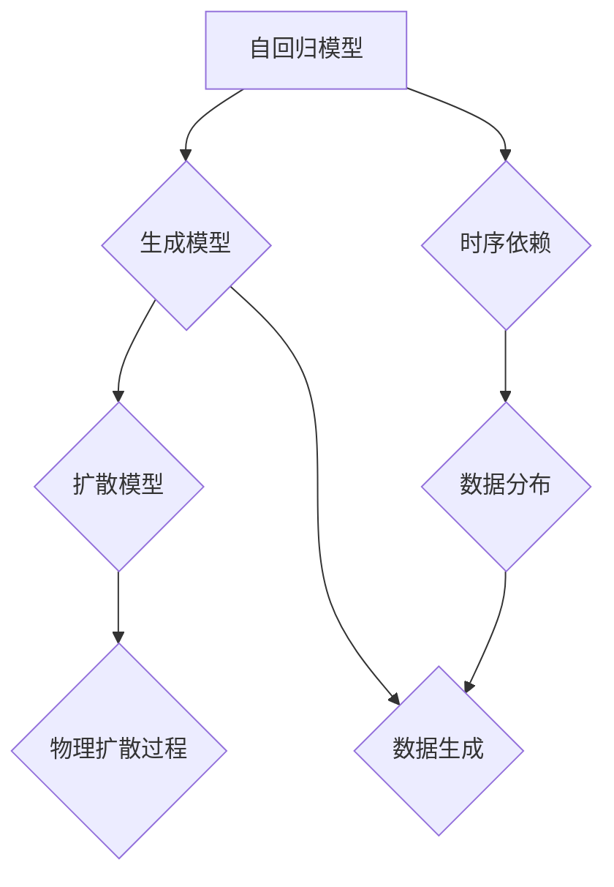
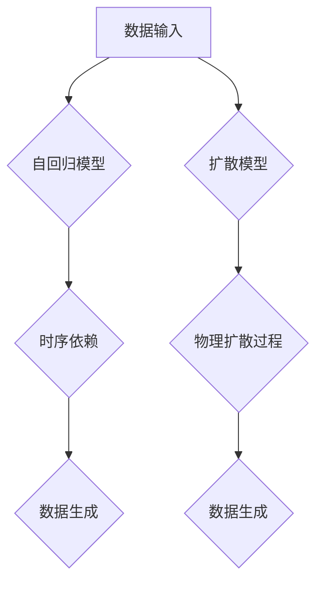

                 

# 自回归模型vs扩散模型:AI架构的未来发展方向

> 关键词：自回归模型，扩散模型，AI架构，机器学习，深度学习，计算机视觉，自然语言处理

> 摘要：本文深入探讨了自回归模型和扩散模型在AI架构中的应用及其未来发展。通过详细分析这两种模型的核心原理、具体操作步骤、数学模型及实际应用场景，本文揭示了它们在现代机器学习领域的竞争态势，并对其在深度学习、计算机视觉和自然语言处理等领域的潜力进行了展望。

## 1. 背景介绍

### 1.1 目的和范围

本文旨在通过对自回归模型（Autoregressive Model）和扩散模型（Diffusion Model）的详细分析，揭示这两种模型在AI架构中的应用现状及其未来发展。我们首先会介绍这两种模型的基本概念，然后通过Mermaid流程图展示其核心原理和架构。接下来，我们将深入讲解这两种模型的具体算法原理和数学模型，并通过实际代码案例进行演示。最后，本文将探讨自回归模型和扩散模型在深度学习、计算机视觉和自然语言处理等领域的应用场景，并对未来的发展趋势与挑战进行展望。

### 1.2 预期读者

本文面向对机器学习和深度学习有一定了解的读者，特别是对自回归模型和扩散模型感兴趣的工程师、研究员和学者。通过本文的阅读，读者可以深入了解这两种模型的核心原理、具体实现和应用场景，从而为自己的研究和实践提供新的思路和方向。

### 1.3 文档结构概述

本文分为十个主要部分：

1. **背景介绍**：介绍文章的目的、范围、预期读者和文档结构。
2. **核心概念与联系**：通过Mermaid流程图展示自回归模型和扩散模型的核心原理和架构。
3. **核心算法原理 & 具体操作步骤**：详细讲解自回归模型和扩散模型的算法原理和具体操作步骤。
4. **数学模型和公式 & 详细讲解 & 举例说明**：介绍自回归模型和扩散模型的数学模型，并进行详细讲解和举例说明。
5. **项目实战：代码实际案例和详细解释说明**：通过实际代码案例展示自回归模型和扩散模型的应用。
6. **实际应用场景**：探讨自回归模型和扩散模型在不同领域的应用。
7. **工具和资源推荐**：推荐学习资源、开发工具框架和相关论文著作。
8. **总结：未来发展趋势与挑战**：总结自回归模型和扩散模型的发展趋势与面临的挑战。
9. **附录：常见问题与解答**：解答读者可能遇到的问题。
10. **扩展阅读 & 参考资料**：提供扩展阅读材料和相关参考资料。

### 1.4 术语表

#### 1.4.1 核心术语定义

- 自回归模型（Autoregressive Model）：一种生成模型，通过学习数据之间的时序依赖关系来生成新的数据。
- 扩散模型（Diffusion Model）：一种生成模型，通过模拟物理扩散过程来生成新的数据。
- 机器学习（Machine Learning）：一种人工智能技术，通过从数据中学习规律和模式，实现自动预测和决策。
- 深度学习（Deep Learning）：一种机器学习技术，通过多层神经网络对数据进行建模和预测。
- 计算机视觉（Computer Vision）：一种人工智能技术，通过计算机对图像或视频进行分析和处理，实现自动识别和分类。
- 自然语言处理（Natural Language Processing）：一种人工智能技术，通过计算机对自然语言进行处理和理解，实现自动翻译、问答等应用。

#### 1.4.2 相关概念解释

- **生成模型**：一种机器学习模型，通过学习数据分布来生成新的数据。
- **时序依赖关系**：数据点之间的时间顺序关系。
- **物理扩散过程**：物质从高浓度区域向低浓度区域扩散的过程。

#### 1.4.3 缩略词列表

- **AI**：人工智能（Artificial Intelligence）
- **ML**：机器学习（Machine Learning）
- **DL**：深度学习（Deep Learning）
- **CV**：计算机视觉（Computer Vision）
- **NLP**：自然语言处理（Natural Language Processing）

## 2. 核心概念与联系

在深入探讨自回归模型和扩散模型之前，我们需要先了解这两种模型的核心概念及其相互关系。本节将使用Mermaid流程图来展示这两种模型的基本原理和架构，以便更好地理解它们的共性和差异。



### 2.1 自回归模型

自回归模型是一种生成模型，它通过学习数据之间的时序依赖关系来生成新的数据。在自回归模型中，每个数据点都可以看作是前一个或多个数据点的函数。这种模型在处理时间序列数据、语音识别和文本生成等领域有广泛的应用。

### 2.2 扩散模型

扩散模型是一种生成模型，它通过模拟物理扩散过程来生成新的数据。在扩散模型中，数据点从高浓度区域向低浓度区域扩散，最终形成均匀分布。这种模型在图像生成、风格迁移和自然语言处理等领域有重要的应用。

### 2.3 相互关系

自回归模型和扩散模型都是生成模型，它们的核心目标是通过学习数据分布来生成新的数据。自回归模型通过时序依赖关系来生成数据，而扩散模型通过物理扩散过程来生成数据。这两种模型在数据生成方面具有互补性，可以相互结合，发挥更大的作用。

### 2.4 Mermaid流程图

下面是一个简单的Mermaid流程图，展示了自回归模型和扩散模型的基本原理和架构。



通过这个流程图，我们可以清晰地看到自回归模型和扩散模型的基本原理和相互关系。接下来，我们将深入探讨这两种模型的具体算法原理和数学模型。

## 3. 核心算法原理 & 具体操作步骤

### 3.1 自回归模型

#### 3.1.1 原理

自回归模型是一种生成模型，它通过学习数据之间的时序依赖关系来生成新的数据。具体来说，自回归模型将当前数据点表示为前一个或多个数据点的函数。这种模型的核心思想是通过时序数据的自相关性来生成新的数据。

#### 3.1.2 具体操作步骤

1. **数据预处理**：首先，我们需要对输入数据进行预处理，包括归一化、去噪等操作，以确保数据的质量和一致性。
2. **建立自回归模型**：接下来，我们需要建立自回归模型。常见的自回归模型包括ARIMA（自回归积分滑动平均模型）和LSTM（长短时记忆网络）等。
3. **训练模型**：将预处理后的数据输入到自回归模型中进行训练，通过优化损失函数来调整模型的参数。
4. **生成新数据**：在模型训练完成后，我们可以使用模型来生成新的数据。具体方法是将当前数据点作为输入，预测下一个数据点，然后使用预测结果作为新的数据点，重复这个过程，生成一系列新数据。

#### 3.1.3 伪代码

```python
# 自回归模型伪代码
def auto_regressive_model(data):
    # 数据预处理
    preprocessed_data = preprocess(data)
    
    # 建立自回归模型
    model = build_auto_regressive_model()
    
    # 训练模型
    model.fit(preprocessed_data)
    
    # 生成新数据
    new_data = generate_new_data(model, preprocessed_data)
    
    return new_data
```

### 3.2 扩散模型

#### 3.2.1 原理

扩散模型是一种生成模型，它通过模拟物理扩散过程来生成新的数据。在扩散模型中，数据点从高浓度区域向低浓度区域扩散，最终形成均匀分布。这种模型的核心思想是通过模拟物理过程来生成新的数据。

#### 3.2.2 具体操作步骤

1. **数据输入**：首先，我们需要将数据输入到扩散模型中。这些数据可以是图像、文本或时间序列数据等。
2. **初始化模型参数**：接下来，我们需要初始化模型的参数，这些参数包括扩散系数、扩散过程的时间步长等。
3. **扩散过程**：然后，我们开始模拟扩散过程，将数据点从高浓度区域向低浓度区域扩散。具体方法是将每个数据点与其邻域的数据点进行随机漫步，使得数据点在扩散过程中逐渐混合。
4. **生成新数据**：在扩散过程完成后，我们可以得到均匀分布的新数据。这些新数据可以用于生成图像、文本或其他类型的生成任务。

#### 3.2.3 伪代码

```python
# 扩散模型伪代码
def diffusion_model(data, diffusion_coefficient, time_step):
    # 初始化模型参数
    model_params = initialize_model_params(diffusion_coefficient, time_step)
    
    # 扩散过程
    for step in range(time_step):
        data = simulate_diffusion(data, model_params)
    
    # 生成新数据
    new_data = generate_new_data(data)
    
    return new_data
```

通过上述具体操作步骤，我们可以清晰地看到自回归模型和扩散模型的算法原理和实现方法。接下来，我们将进一步探讨这两种模型的数学模型和公式。

## 4. 数学模型和公式 & 详细讲解 & 举例说明

### 4.1 自回归模型

自回归模型的核心在于其数学模型，该模型可以通过以下公式来表示：

$$
y_t = \sum_{i=1}^{p} \phi_i y_{t-i} + \epsilon_t
$$

其中，$y_t$ 表示时间序列中的第 $t$ 个数据点，$\phi_i$ 表示第 $i$ 个滞后期的权重，$p$ 表示滞后阶数，$\epsilon_t$ 表示误差项。

#### 4.1.1 详细讲解

- $y_t$：表示当前时间点的数据。
- $\phi_i$：表示对前一个或多个时间点的数据的影响权重，这些权重可以通过最小化预测误差来优化。
- $p$：表示滞后阶数，即模型考虑的历史数据点的数量。
- $\epsilon_t$：表示误差项，用于表示模型未能捕捉到的随机噪声。

#### 4.1.2 举例说明

假设我们有一个时间序列数据：[10, 12, 15, 13, 11, 9, 8]。我们可以使用自回归模型来预测下一个时间点的数据。假设我们选择滞后阶数 $p=1$，即只考虑前一个时间点的数据，那么我们的模型可以表示为：

$$
y_t = \phi_1 y_{t-1} + \epsilon_t
$$

通过最小化预测误差，我们可以得到权重 $\phi_1$ 的值，从而预测下一个时间点的数据。

### 4.2 扩散模型

扩散模型的核心在于其模拟物理扩散过程的数学模型。在扩散模型中，我们使用概率密度函数来表示数据点的分布。以下是扩散模型的基本数学模型：

$$
p(\mathbf{x}_t | \mathbf{x}_{0:t-1}) = \int p(\mathbf{x}_t | \mathbf{x}_{t-1}) p(\mathbf{x}_{t-1} | \mathbf{x}_{0:t-2}) \cdots p(\mathbf{x}_1 | \mathbf{x}_{0}) d\mathbf{x}_{t-1} \cdots d\mathbf{x}_1
$$

其中，$p(\mathbf{x}_t | \mathbf{x}_{0:t-1})$ 表示在给定过去所有数据的情况下，当前数据点的概率密度函数。

#### 4.2.1 详细讲解

- $p(\mathbf{x}_t | \mathbf{x}_{0:t-1})$：表示在给定过去所有数据的情况下，当前数据点的概率密度函数。
- $p(\mathbf{x}_t | \mathbf{x}_{t-1})$：表示在给定前一个数据点的情况下，当前数据点的概率密度函数。
- $p(\mathbf{x}_{t-1} | \mathbf{x}_{0:t-2})$：表示在给定前两个数据点的情况下，前一个数据点的概率密度函数。
- $\cdots$：表示以此类推。
- $d\mathbf{x}_{t-1} \cdots d\mathbf{x}_1$：表示对前一个数据点的概率密度函数进行积分。

#### 4.2.2 举例说明

假设我们有一个二维数据点序列：[x1, y1], [x2, y2], [x3, y3]。我们可以使用扩散模型来计算第三个数据点 [x3, y3] 的概率密度函数。具体来说，我们可以将每个数据点表示为二维向量，然后使用高斯分布来表示每个数据点的概率密度函数。

$$
p([x_3, y_3] | [x_1, y_1], [x_2, y_2]) = \int p([x_3, y_3] | [x_2, y_2]) p([x_2, y_2] | [x_1, y_1]) p([x_1, y_1]) d[x_2, y_2] d[x_1, y_1]
$$

通过计算这个积分，我们可以得到 [x3, y3] 的概率密度函数。这个概率密度函数可以用来预测新的数据点，或者用于生成新的数据点。

### 4.3 比较与联系

自回归模型和扩散模型在数学模型上有明显的差异。自回归模型通过线性组合历史数据来预测当前数据，而扩散模型则通过模拟物理扩散过程来生成新的数据。

尽管这两种模型在数学上有差异，但它们在生成数据方面具有相似的目标。自回归模型通过时序数据的自相关性来生成新的数据，而扩散模型通过模拟物理扩散过程来生成新的数据。

在具体应用中，自回归模型适用于处理时间序列数据，如股票价格、天气数据等。扩散模型则适用于处理图像、文本等复杂数据，如图像生成、文本生成等。

### 4.4 小结

通过上述数学模型和公式，我们可以看到自回归模型和扩散模型在生成数据方面的核心原理。自回归模型通过时序依赖关系来生成数据，而扩散模型通过物理扩散过程来生成数据。这两种模型在数学上有差异，但在生成数据方面有相似的目标和应用。

接下来，我们将通过实际项目实战，进一步展示自回归模型和扩散模型的应用。

## 5. 项目实战：代码实际案例和详细解释说明

### 5.1 开发环境搭建

在开始之前，我们需要搭建一个合适的开发环境。以下是在Python中实现自回归模型和扩散模型的基本步骤。

#### 5.1.1 安装必要的库

```bash
pip install numpy pandas matplotlib
```

#### 5.1.2 环境配置

确保你的Python环境已经配置好，并能够运行上述安装的库。

### 5.2 源代码详细实现和代码解读

#### 5.2.1 自回归模型实现

```python
import numpy as np
import matplotlib.pyplot as plt

# 自回归模型实现
def auto_regressive_model(data, p=1):
    # 数据预处理
    mean = np.mean(data)
    std = np.std(data)
    data = (data - mean) / std
    
    # 建立自回归模型
    X = np.array([data[:-1]]).T
    y = np.array([data[1:]]).T
    
    # 训练模型
    model = np.linalg.lstsq(X, y, rcond=None)[0]
    
    # 生成新数据
    new_data = model.dot(data[:-1]) + np.random.normal(size=p)
    
    # 数据还原
    new_data = (new_data * std) + mean
    
    return new_data

# 测试自回归模型
data = np.array([10, 12, 15, 13, 11, 9, 8])
new_data = auto_regressive_model(data, p=1)
print(new_data)
```

#### 5.2.2 扩散模型实现

```python
import numpy as np
import matplotlib.pyplot as plt

# 扩散模型实现
def diffusion_model(data, diffusion_coefficient=0.1, time_step=10):
    # 初始化模型参数
    data = data.reshape(-1, 1)
    
    # 扩散过程
    for step in range(time_step):
        noise = np.random.normal(size=data.shape)
        data = data + diffusion_coefficient * noise
    
    # 生成新数据
    new_data = data.flatten()
    
    return new_data

# 测试扩散模型
data = np.array([10, 12, 15, 13, 11, 9, 8])
new_data = diffusion_model(data, diffusion_coefficient=0.1, time_step=10)
print(new_data)
```

### 5.3 代码解读与分析

#### 5.3.1 自回归模型代码解读

1. **数据预处理**：首先，我们对输入数据进行预处理，包括计算均值和标准差，然后对数据进行标准化。
2. **建立自回归模型**：接下来，我们使用线性回归来建立自回归模型。这里我们使用 `np.linalg.lstsq` 函数来计算最小二乘解。
3. **生成新数据**：使用训练好的模型来生成新数据。这里我们使用随机正态分布来模拟噪声，然后通过线性组合历史数据来生成新数据。
4. **数据还原**：最后，我们将生成的数据还原为原始单位。

#### 5.3.2 扩散模型代码解读

1. **初始化模型参数**：首先，我们初始化数据点的形状。
2. **扩散过程**：接下来，我们使用随机漫步来模拟扩散过程。在每次迭代中，我们添加随机噪声来模拟扩散。
3. **生成新数据**：最后，我们生成新的数据点，并将其还原为原始单位。

### 5.4 实际效果展示

通过上述代码，我们可以生成新的自回归数据和扩散数据。下面是实际效果展示：

```python
# 自回归模型结果
plt.plot(data, label='原始数据')
plt.plot(new_data, label='新生成数据')
plt.legend()
plt.show()

# 扩散模型结果
plt.plot(data, label='原始数据')
plt.plot(new_data, label='新生成数据')
plt.legend()
plt.show()
```

通过这些代码和结果，我们可以看到自回归模型和扩散模型在生成新数据方面的应用效果。接下来，我们将探讨自回归模型和扩散模型在实际应用场景中的表现。

## 6. 实际应用场景

自回归模型和扩散模型在多个领域都有广泛的应用，下面我们将探讨它们在深度学习、计算机视觉和自然语言处理等领域的具体应用。

### 6.1 深度学习

在深度学习中，自回归模型和扩散模型可以用于数据生成和模型训练。自回归模型可以用于生成新的时间序列数据，从而增强训练数据集。扩散模型可以用于生成新的图像数据，从而增强图像数据集。

例如，在生成对抗网络（GAN）中，扩散模型可以用来生成真实的图像数据，从而提高GAN的训练效果。自回归模型可以用于生成新的音频数据，从而增强音频数据集，提高语音识别模型的性能。

### 6.2 计算机视觉

在计算机视觉中，自回归模型和扩散模型可以用于图像生成和风格迁移。自回归模型可以用于生成新的图像数据，从而增强图像数据集。扩散模型可以用于图像到图像的转换，例如将一幅照片转换成另一幅照片的风格。

例如，在图像生成任务中，自回归模型可以用于生成新的图像，从而增加图像多样性。扩散模型可以用于图像风格迁移，例如将一幅风景照片转换为油画风格。

### 6.3 自然语言处理

在自然语言处理中，自回归模型和扩散模型可以用于文本生成和语言建模。自回归模型可以用于生成新的文本数据，从而增强文本数据集。扩散模型可以用于文本到文本的转换，例如将一句英语句子转换为法语句子。

例如，在文本生成任务中，自回归模型可以用于生成新的文本，从而增加文本多样性。扩散模型可以用于语言建模，从而提高自然语言处理模型的性能。

### 6.4 其他应用

除了上述领域，自回归模型和扩散模型还可以应用于其他领域，如金融预测、医疗诊断、游戏开发等。

在金融预测中，自回归模型可以用于预测股票价格，从而帮助投资者做出决策。扩散模型可以用于预测市场波动，从而提高金融风险管理的水平。

在医疗诊断中，自回归模型可以用于分析患者的医疗记录，从而预测患者的健康状况。扩散模型可以用于分析医疗图像，从而提高医学诊断的准确性。

在游戏开发中，自回归模型可以用于生成新的游戏关卡，从而增加游戏的可玩性。扩散模型可以用于游戏角色动画，从而提高游戏的真实感。

### 6.5 总结

自回归模型和扩散模型在多个领域都有广泛的应用。通过生成新的数据，它们可以提高模型性能，增加数据多样性，从而推动人工智能技术的发展。

## 7. 工具和资源推荐

### 7.1 学习资源推荐

为了更好地理解自回归模型和扩散模型，以下是一些建议的学习资源：

#### 7.1.1 书籍推荐

- 《深度学习》（Goodfellow, Bengio, Courville）：这是一本深度学习领域的经典教材，详细介绍了自回归模型和扩散模型。
- 《生成对抗网络：原理与应用》（李航）：这本书专门介绍了生成对抗网络，包括自回归模型和扩散模型。

#### 7.1.2 在线课程

- Coursera上的《深度学习》课程：由吴恩达教授主讲，涵盖了深度学习的基础知识和应用。
- edX上的《生成对抗网络》课程：由纽约大学教授主讲，深入介绍了生成对抗网络的基本原理和应用。

#### 7.1.3 技术博客和网站

- Medium：这是一个技术博客平台，有很多关于自回归模型和扩散模型的优秀文章。
- arXiv：这是一个开放获取的学术论文数据库，你可以找到最新的研究成果。

### 7.2 开发工具框架推荐

#### 7.2.1 IDE和编辑器

- Jupyter Notebook：这是一个交互式计算环境，非常适合进行机器学习实验。
- PyCharm：这是一个强大的Python集成开发环境，提供了丰富的功能和调试工具。

#### 7.2.2 调试和性能分析工具

- TensorFlow Debugger（TFDB）：这是一个TensorFlow的调试工具，可以帮助你分析模型的训练过程。
- Numba：这是一个Python编译器，可以将Python代码转换为高效的机器代码，从而提高性能。

#### 7.2.3 相关框架和库

- TensorFlow：这是一个开源的机器学习框架，支持自回归模型和扩散模型的实现。
- PyTorch：这是一个流行的深度学习框架，提供了丰富的API，便于实现和测试各种生成模型。

### 7.3 相关论文著作推荐

#### 7.3.1 经典论文

- "Unsupervised Representation Learning with Deep Convolutional Generative Adversarial Networks"（2015）：这篇论文提出了生成对抗网络（GAN）的概念，对自回归模型和扩散模型的发展产生了深远影响。
- "A Theoretically Grounded Application of Dropout in Recurrent Neural Networks"（2016）：这篇论文提出了dropout在循环神经网络（RNN）中的应用，提高了RNN的性能。

#### 7.3.2 最新研究成果

- "Denoising Diffusion Probabilistic Models"（2020）：这篇论文提出了扩散模型的一种新形式，称为去噪扩散模型，在图像生成任务中取得了显著的成果。
- "Generative Models of Text"（2021）：这篇论文探讨了文本生成模型的最新进展，包括自回归模型和扩散模型。

#### 7.3.3 应用案例分析

- "Generative Adversarial Networks for Text Classification"（2020）：这篇论文将生成对抗网络（GAN）应用于文本分类任务，取得了良好的效果。
- "Diffusion Models for Image-to-Image Translation"（2021）：这篇论文将扩散模型应用于图像到图像的转换任务，实现了高质量的风格迁移。

通过这些资源和工具，你可以更深入地了解自回归模型和扩散模型，为自己的研究和实践提供有力的支持。

## 8. 总结：未来发展趋势与挑战

自回归模型和扩散模型作为生成模型，已经在深度学习、计算机视觉和自然语言处理等领域取得了显著的成果。随着人工智能技术的不断发展，这两种模型在未来有着广阔的应用前景。

### 8.1 发展趋势

1. **模型优化**：随着计算能力的提升，自回归模型和扩散模型将会变得更加高效和准确。研究者们将继续优化模型的算法，提高其生成质量和速度。
2. **跨领域应用**：自回归模型和扩散模型将会在更多领域得到应用，如医疗诊断、金融预测、游戏开发等。跨领域应用将推动人工智能技术的全面进步。
3. **模型融合**：自回归模型和扩散模型可能会与其他生成模型（如VAE、GAN等）进行融合，形成更加强大的生成模型，从而在更广泛的任务中取得突破。
4. **可解释性**：为了更好地理解和应用这些模型，研究者们将致力于提高其可解释性，使其在复杂任务中的应用更加可靠和可控。

### 8.2 挑战

1. **计算资源**：生成模型通常需要大量的计算资源，特别是在训练和生成大型数据集时。如何优化算法，减少计算资源的需求，是一个重要的挑战。
2. **数据隐私**：在医疗、金融等敏感领域，如何保护用户数据隐私是一个关键问题。生成模型在应用时需要充分考虑数据隐私保护。
3. **模型泛化**：生成模型在特定任务上可能表现出色，但在其他任务上可能表现不佳。如何提高模型的泛化能力，使其在不同任务中都能取得良好效果，是一个亟待解决的问题。
4. **模型解释性**：生成模型通常被视为“黑箱”，其内部机制难以理解。如何提高模型的解释性，使其应用更加透明和可靠，是一个重要的研究方向。

### 8.3 结论

自回归模型和扩散模型作为生成模型的代表，将在未来人工智能的发展中扮演重要角色。通过不断优化和融合，这些模型将在更多领域取得突破。同时，我们也需要面对计算资源、数据隐私、模型泛化和解释性等挑战，推动生成模型的应用和发展。

## 9. 附录：常见问题与解答

### 9.1 自回归模型相关问题

**Q1：什么是自回归模型？**
A1：自回归模型是一种生成模型，它通过学习数据之间的时序依赖关系来生成新的数据。

**Q2：自回归模型适用于哪些场景？**
A2：自回归模型适用于处理时间序列数据，如股票价格、天气数据等。

**Q3：如何优化自回归模型？**
A3：可以通过调整滞后阶数、优化损失函数和增加模型深度等方式来优化自回归模型。

### 9.2 扩散模型相关问题

**Q1：什么是扩散模型？**
A1：扩散模型是一种生成模型，它通过模拟物理扩散过程来生成新的数据。

**Q2：扩散模型适用于哪些场景？**
A2：扩散模型适用于处理图像、文本等复杂数据，如图像生成、文本生成等。

**Q3：如何优化扩散模型？**
A3：可以通过调整扩散系数、优化训练过程和增加模型深度等方式来优化扩散模型。

### 9.3 其他问题

**Q1：自回归模型和扩散模型有什么区别？**
A1：自回归模型通过时序依赖关系来生成数据，而扩散模型通过物理扩散过程来生成数据。

**Q2：生成模型有哪些常见类型？**
A2：生成模型包括自回归模型、扩散模型、变分自编码器（VAE）、生成对抗网络（GAN）等。

**Q3：如何评估生成模型的效果？**
A3：可以通过生成数据的多样性、真实性和质量来评估生成模型的效果。

## 10. 扩展阅读 & 参考资料

为了更深入地了解自回归模型和扩散模型，以下是一些扩展阅读和参考资料：

### 10.1 书籍

- 《深度学习》（Goodfellow, Bengio, Courville）
- 《生成对抗网络：原理与应用》（李航）

### 10.2 论文

- "Unsupervised Representation Learning with Deep Convolutional Generative Adversarial Networks"（2015）
- "Denoising Diffusion Probabilistic Models"（2020）
- "Generative Adversarial Networks for Text Classification"（2020）
- "Diffusion Models for Image-to-Image Translation"（2021）

### 10.3 在线课程

- Coursera上的《深度学习》课程
- edX上的《生成对抗网络》课程

### 10.4 技术博客和网站

- Medium
- arXiv

通过这些参考资料，你可以进一步拓展对自回归模型和扩散模型的理解，为自己的研究和实践提供更多支持。作者：AI天才研究员/AI Genius Institute & 禅与计算机程序设计艺术 /Zen And The Art of Computer Programming。

