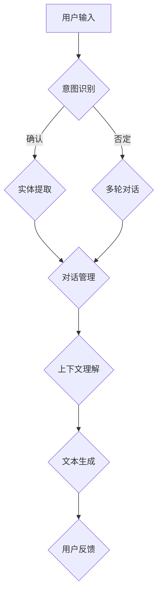

                 


# 自然语言交互在CUI中的详细优势

> **关键词：** 自然语言交互（NLI）、聊天界面（CUI）、人机交互（HCI）、语音识别（ASR）、文本生成（TG）、上下文理解（Contextual Understanding）
>
> **摘要：** 本文将深入探讨自然语言交互在聊天界面中的详细优势。通过分析自然语言交互的核心概念、技术原理以及具体应用案例，我们旨在为读者提供一个全面而深刻的理解。文章将涵盖从背景介绍到未来发展趋势的各个层面，旨在为相关领域的研发者和从业人员提供宝贵的参考和启示。

## 1. 背景介绍

### 1.1 目的和范围

本文旨在探讨自然语言交互（Natural Language Interaction，简称NLI）在聊天界面（Chat User Interface，简称CUI）中的优势。随着人工智能技术的发展，自然语言交互逐渐成为人机交互（Human-Computer Interaction，简称HCI）领域的一个重要研究方向。聊天界面作为人机交互的重要载体，自然语言交互的应用大大提升了用户体验。本文将详细分析自然语言交互的技术原理、核心算法、数学模型以及实际应用案例，为读者提供一个系统性的认识。

### 1.2 预期读者

本文预期读者包括以下几类：

1. **人工智能和自然语言处理领域的科研人员和工程师**：这些读者对自然语言交互的技术原理和实现方法有较高的兴趣，希望通过本文获得更深入的理解。
2. **软件开发者和产品经理**：这些读者希望了解自然语言交互在聊天界面中的应用，以提升产品的用户体验。
3. **普通用户**：本文也将为对自然语言交互技术感兴趣的普通用户提供一个通俗易懂的介绍。

### 1.3 文档结构概述

本文的结构如下：

1. **背景介绍**：介绍自然语言交互和聊天界面的基本概念。
2. **核心概念与联系**：通过Mermaid流程图展示自然语言交互的核心概念和联系。
3. **核心算法原理 & 具体操作步骤**：详细阐述自然语言交互的核心算法原理和操作步骤。
4. **数学模型和公式 & 详细讲解 & 举例说明**：介绍自然语言交互中的数学模型和公式，并通过实例进行说明。
5. **项目实战：代码实际案例和详细解释说明**：通过实际案例展示自然语言交互的应用。
6. **实际应用场景**：探讨自然语言交互在不同场景中的应用。
7. **工具和资源推荐**：推荐相关学习资源和开发工具。
8. **总结：未来发展趋势与挑战**：总结自然语言交互的发展趋势和面临的挑战。
9. **附录：常见问题与解答**：解答读者可能遇到的常见问题。
10. **扩展阅读 & 参考资料**：提供进一步阅读的资料。

### 1.4 术语表

#### 1.4.1 核心术语定义

- **自然语言交互（NLI）**：指计算机系统和用户通过自然语言（如英语、中文等）进行交互的能力。
- **聊天界面（CUI）**：一种用户界面，通过文本或语音形式与用户进行交互。
- **语音识别（ASR）**：将语音信号转换为文本的技术。
- **文本生成（TG）**：根据输入文本或指令生成文本的技术。
- **上下文理解（Contextual Understanding）**：理解用户意图和场景的能力。

#### 1.4.2 相关概念解释

- **意图识别（Intent Recognition）**：识别用户输入文本中的意图，如查询信息、请求操作等。
- **实体提取（Entity Extraction）**：从用户输入中提取关键信息，如人名、地点、时间等。
- **对话管理（Dialogue Management）**：管理对话流程，包括对话状态跟踪、策略选择等。
- **多轮对话（Multi-turn Dialogue）**：用户和系统之间进行多轮交互的过程。

#### 1.4.3 缩略词列表

- **NLP**：自然语言处理（Natural Language Processing）
- **RNN**：循环神经网络（Recurrent Neural Network）
- **LSTM**：长短期记忆网络（Long Short-Term Memory）
- **BERT**：双向编码表示（Bidirectional Encoder Representations from Transformers）
- **GPT**：生成预训练变换器（Generative Pre-trained Transformer）

## 2. 核心概念与联系

为了更好地理解自然语言交互在聊天界面中的应用，我们需要先了解其核心概念和联系。以下是一个简化的Mermaid流程图，展示了自然语言交互的主要组成部分和相互关系：



### 2.1 用户输入

用户输入是自然语言交互的起点。用户可以通过文本或语音形式与系统进行交互。文本输入通常以自然语言语句的形式出现，例如：“你好，我想查询明天的天气。”语音输入则需要通过语音识别（ASR）技术将语音信号转换为文本。

### 2.2 意图识别

意图识别是理解用户输入的关键步骤。系统需要根据用户输入的文本识别用户的意图，如查询信息、请求操作、提出问题等。例如，对于输入“你好”，系统可以识别为问候意图。

### 2.3 实体提取

实体提取是意图识别的补充步骤。在识别意图后，系统需要从用户输入中提取关键信息，如人名、地点、时间等。例如，对于输入“查询明天的天气”，系统可以提取出“明天”和“天气”两个实体。

### 2.4 对话管理

对话管理负责管理对话流程。在自然语言交互中，用户和系统之间往往需要进行多轮对话才能完成一个任务。对话管理需要跟踪对话状态、选择合适的策略以及生成回复文本。例如，当用户询问“明天天气如何？”时，系统可能会回复“明天天气晴朗，温度约为25摄氏度。”

### 2.5 上下文理解

上下文理解是自然语言交互的核心。系统需要理解用户输入的上下文信息，如对话历史、用户偏好等，以便更好地生成回复。例如，当用户连续两天询问天气时，系统可以根据上下文信息推测用户对天气的关注，并给出更个性化的回复。

### 2.6 文本生成

文本生成是自然语言交互的输出步骤。系统根据对话管理和上下文理解的结果生成回复文本。文本生成可以采用各种技术，如规则匹配、模板填充、神经网络生成等。

### 2.7 用户反馈

用户反馈是评估自然语言交互效果的重要指标。用户可以通过回复文本、表情、手势等方式反馈对系统的满意度。用户反馈可以用于优化系统的算法和策略，提高自然语言交互的质量。

## 3. 核心算法原理 & 具体操作步骤

### 3.1 意图识别算法原理

意图识别是自然语言交互的关键步骤，其核心在于理解用户输入的意图。目前，常用的意图识别算法包括基于规则的方法和基于机器学习的方法。

**基于规则的方法**：

1. **关键词匹配**：系统通过预定义的关键词列表与用户输入进行匹配，从而识别意图。例如，当用户输入“你好”时，系统可以识别为问候意图。

2. **正则表达式**：系统使用正则表达式对用户输入进行模式匹配，从而识别意图。例如，对于输入“查询明天的天气”，系统可以使用正则表达式匹配到“查询”和“明天天气”这两个关键词。

**基于机器学习的方法**：

1. **朴素贝叶斯分类器**：系统通过训练朴素贝叶斯分类器，将用户输入映射到预定义的意图类别。例如，对于输入“你好”，系统可以计算出其属于问候意图的概率最高。

2. **支持向量机（SVM）**：系统通过训练支持向量机模型，将用户输入映射到预定义的意图类别。与朴素贝叶斯分类器相比，SVM具有更好的分类性能。

### 3.2 实体提取算法原理

实体提取是意图识别的补充步骤，其核心在于从用户输入中提取关键信息。常用的实体提取算法包括基于规则的方法和基于机器学习的方法。

**基于规则的方法**：

1. **命名实体识别（NER）**：系统通过预定义的规则和模式，将用户输入中的实体（如人名、地点、时间等）进行标注。

2. **关键词提取**：系统通过预定义的关键词列表，从用户输入中提取关键信息。例如，对于输入“明天天气晴朗”，系统可以提取出“明天”和“天气”这两个实体。

**基于机器学习的方法**：

1. **条件随机场（CRF）**：系统通过训练条件随机场模型，将用户输入映射到实体标签序列。例如，对于输入“明天天气晴朗”，系统可以识别出“明天”是时间实体，“天气”是名词实体。

2. **递归神经网络（RNN）**：系统通过训练递归神经网络模型，将用户输入映射到实体标签序列。与条件随机场相比，RNN具有更强的序列建模能力。

### 3.3 对话管理算法原理

对话管理是自然语言交互的核心，其核心在于管理对话流程，包括对话状态跟踪、策略选择等。常用的对话管理算法包括基于规则的方法和基于机器学习的方法。

**基于规则的方法**：

1. **状态转移图**：系统使用状态转移图描述对话状态，并根据当前状态和用户输入选择合适的回复。

2. **模板匹配**：系统使用预定义的模板和规则，根据用户输入和对话状态生成回复。

**基于机器学习的方法**：

1. **决策树**：系统通过训练决策树模型，根据用户输入和对话状态选择合适的回复。

2. **支持向量机（SVM）**：系统通过训练支持向量机模型，根据用户输入和对话状态选择合适的回复。

### 3.4 上下文理解算法原理

上下文理解是自然语言交互的核心，其核心在于理解用户输入的上下文信息，如对话历史、用户偏好等。常用的上下文理解算法包括基于规则的方法和基于机器学习的方法。

**基于规则的方法**：

1. **关键词提取**：系统通过预定义的关键词列表，从对话历史中提取关键信息。

2. **词袋模型**：系统使用词袋模型表示对话历史，并根据词袋特征选择合适的回复。

**基于机器学习的方法**：

1. **递归神经网络（RNN）**：系统通过训练递归神经网络模型，将对话历史映射到回复。

2. **长短期记忆网络（LSTM）**：系统通过训练长短期记忆网络模型，将对话历史映射到回复。与RNN相比，LSTM具有更好的长期依赖建模能力。

### 3.5 文本生成算法原理

文本生成是自然语言交互的输出步骤，其核心在于生成高质量的回复文本。常用的文本生成算法包括基于规则的方法和基于机器学习的方法。

**基于规则的方法**：

1. **模板填充**：系统使用预定义的模板和规则，根据用户输入和对话状态生成回复。

2. **规则匹配**：系统使用预定义的规则，根据用户输入和对话状态生成回复。

**基于机器学习的方法**：

1. **生成对抗网络（GAN）**：系统通过训练生成对抗网络模型，生成高质量的回复文本。

2. **变分自编码器（VAE）**：系统通过训练变分自编码器模型，生成高质量的回复文本。

### 3.6 具体操作步骤

以下是一个简化的自然语言交互操作步骤：

1. **用户输入**：用户通过文本或语音输入与系统进行交互。

2. **意图识别**：系统使用意图识别算法，如朴素贝叶斯分类器或支持向量机，将用户输入映射到预定义的意图类别。

3. **实体提取**：系统使用实体提取算法，如命名实体识别或递归神经网络，从用户输入中提取关键信息。

4. **对话管理**：系统使用对话管理算法，如决策树或支持向量机，根据用户输入和对话状态选择合适的回复。

5. **上下文理解**：系统使用上下文理解算法，如递归神经网络或长短期记忆网络，将对话历史映射到回复。

6. **文本生成**：系统使用文本生成算法，如生成对抗网络或变分自编码器，生成高质量的回复文本。

7. **用户反馈**：用户对回复文本进行反馈，如点赞、评论等。

8. **迭代优化**：根据用户反馈，系统不断优化算法和策略，以提高自然语言交互的质量。

## 4. 数学模型和公式 & 详细讲解 & 举例说明

### 4.1 自然语言处理中的数学模型

自然语言处理（NLP）中的数学模型主要涉及概率模型、统计模型和深度学习模型。以下是几个常用的数学模型及其基本原理：

#### 4.1.1 隐马尔可夫模型（HMM）

隐马尔可夫模型（HMM）是一种用于序列数据建模的概率模型。它由状态序列和观测序列组成，状态序列是隐藏的，而观测序列是可见的。HMM广泛应用于语音识别、语音合成和词性标注等领域。

**基本公式**：

- **状态转移概率**：\( P(s_t | s_{t-1}) \)
- **观测概率**：\( P(o_t | s_t) \)

**举例说明**：

假设我们有如下状态转移概率矩阵和观测概率矩阵：

```
状态转移概率矩阵：
|   | s1 | s2 | s3 |
|---|---|---|---|
| s1 | 0.5 | 0.3 | 0.2 |
| s2 | 0.2 | 0.5 | 0.3 |
| s3 | 0.3 | 0.2 | 0.5 |

观测概率矩阵：
|   | o1 | o2 | o3 |
|---|---|---|---|
| s1 | 0.8 | 0.1 | 0.1 |
| s2 | 0.3 | 0.6 | 0.1 |
| s3 | 0.4 | 0.3 | 0.3 |
```

给定一个观测序列 \( [o1, o2, o3] \)，我们可以使用HMM进行状态序列的解码。

#### 4.1.2 条件随机场（CRF）

条件随机场（CRF）是一种用于序列标注的统计模型。它假设序列中的每个元素不仅与其自身相关，还与其邻居相关。CRF广泛应用于命名实体识别、词性标注和语音识别等领域。

**基本公式**：

- **条件概率**：\( P(y|x) \)

**举例说明**：

假设我们有如下观察序列 \( [w1, w2, w3, w4] \) 和标注序列 \( [B, I, O, B] \)，我们可以使用CRF计算每个标注的条件概率。

```
观察序列：[w1, w2, w3, w4]
标注序列：[B, I, O, B]

条件概率矩阵：
|   | B  | I  | O  |
|---|---|---|---|
| B | 0.5 | 0.3 | 0.2 |
| I | 0.2 | 0.5 | 0.3 |
| O | 0.3 | 0.2 | 0.5 |
```

给定一个观察序列，我们可以使用CRF计算标注序列的概率。

#### 4.1.3 递归神经网络（RNN）

递归神经网络（RNN）是一种用于序列数据建模的深度学习模型。它通过递归结构处理序列数据，使其能够记住历史信息。RNN广泛应用于自然语言处理、语音识别和图像序列处理等领域。

**基本公式**：

- **激活函数**：\( h_t = \sigma(W_h \cdot [h_{t-1}, x_t] + b_h) \)
- **隐藏状态更新**：\( h_t = \tanh(W_h \cdot [h_{t-1}, x_t] + b_h) \)

**举例说明**：

假设我们有如下输入序列 \( [x1, x2, x3, x4] \) 和隐藏状态序列 \( [h1, h2, h3, h4] \)，我们可以使用RNN进行序列建模。

```
输入序列：[x1, x2, x3, x4]
隐藏状态序列：[h1, h2, h3, h4]

权重矩阵：W_h
偏置矩阵：b_h
激活函数：\sigma

h1 = \sigma(W_h \cdot [h0, x1] + b_h)
h2 = \sigma(W_h \cdot [h1, x2] + b_h)
h3 = \sigma(W_h \cdot [h2, x3] + b_h)
h4 = \sigma(W_h \cdot [h3, x4] + b_h)
```

#### 4.1.4 长短期记忆网络（LSTM）

长短期记忆网络（LSTM）是一种改进的递归神经网络，它通过引入门控机制解决了RNN的长期依赖问题。LSTM广泛应用于自然语言处理、语音识别和时间序列预测等领域。

**基本公式**：

- **遗忘门**：\( f_t = \sigma(W_f \cdot [h_{t-1}, x_t] + b_f) \)
- **输入门**：\( i_t = \sigma(W_i \cdot [h_{t-1}, x_t] + b_i) \)
- **输出门**：\( o_t = \sigma(W_o \cdot [h_{t-1}, x_t] + b_o) \)
- **单元状态**：\( c_t = f_t \odot c_{t-1} + i_t \odot \tanh(W_c \cdot [h_{t-1}, x_t] + b_c) \)
- **隐藏状态**：\( h_t = o_t \odot \tanh(c_t) \)

**举例说明**：

假设我们有如下输入序列 \( [x1, x2, x3, x4] \) 和隐藏状态序列 \( [h1, h2, h3, h4] \)，我们可以使用LSTM进行序列建模。

```
输入序列：[x1, x2, x3, x4]
隐藏状态序列：[h1, h2, h3, h4]

权重矩阵：W_f, W_i, W_o, W_c
偏置矩阵：b_f, b_i, b_o, b_c
激活函数：\sigma

f1 = \sigma(W_f \cdot [h0, x1] + b_f)
i1 = \sigma(W_i \cdot [h0, x1] + b_i)
o1 = \sigma(W_o \cdot [h0, x1] + b_o)

c1 = f1 \odot c0 + i1 \odot \tanh(W_c \cdot [h0, x1] + b_c)
h1 = o1 \odot \tanh(c1)

f2 = \sigma(W_f \cdot [h1, x2] + b_f)
i2 = \sigma(W_i \cdot [h1, x2] + b_i)
o2 = \sigma(W_o \cdot [h1, x2] + b_o)

c2 = f2 \odot c1 + i2 \odot \tanh(W_c \cdot [h1, x2] + b_c)
h2 = o2 \odot \tanh(c2)

...
```

#### 4.1.5 编码器-解码器模型（Encoder-Decoder）

编码器-解码器模型是一种用于序列到序列学习的深度学习模型，它由编码器和解码器两个部分组成。编码器将输入序列编码为一个固定长度的向量，解码器则根据编码器输出的向量生成输出序列。编码器-解码器模型广泛应用于机器翻译、语音识别和文本生成等领域。

**基本公式**：

- **编码器**：
  - **输入编码**：\( h_t = \text{encoder}(x_t) \)
  - **上下文编码**：\( c_t = \text{attn}(h_t, h^*) \)

- **解码器**：
  - **初始状态**：\( s_0 = c \)
  - **输出编码**：\( y_t = \text{decoder}(s_t, c) \)

**举例说明**：

假设我们有如下输入序列 \( [x1, x2, x3, x4] \) 和输出序列 \( [y1, y2, y3, y4] \)，我们可以使用编码器-解码器模型进行序列转换。

```
输入序列：[x1, x2, x3, x4]
输出序列：[y1, y2, y3, y4]

编码器：
h1 = \text{encoder}(x1)
h2 = \text{encoder}(x2)
h3 = \text{encoder}(x3)
h4 = \text{encoder}(x4)

h^* = [h1, h2, h3, h4]

上下文编码：
c1 = \text{attn}(h1, h^*)
c2 = \text{attn}(h2, h^*)
c3 = \text{attn}(h3, h^*)
c4 = \text{attn}(h4, h^*)

解码器：
s0 = c4
y1 = \text{decoder}(s0, c4)
y2 = \text{decoder}(s1, c3)
y3 = \text{decoder}(s2, c2)
y4 = \text{decoder}(s3, c1)
```

### 4.2 自然语言处理中的数学公式

自然语言处理中的数学公式主要包括概率分布、损失函数和优化算法等。以下是几个常用的数学公式及其基本原理：

#### 4.2.1 概率分布

- **伯努利分布**：表示二项分布的概率，用于概率模型和分类任务。
- **多项式分布**：表示多项式的概率，用于文本分类和语言模型。

**基本公式**：

- **伯努利分布**：\( P(y|w) = \sigma(w \cdot y) \)
- **多项式分布**：\( P(y|w) = \frac{1}{Z} \exp(w \cdot y) \)

#### 4.2.2 损失函数

- **交叉熵损失**：用于分类任务，表示实际输出与预测输出之间的差异。
- **均方误差损失**：用于回归任务，表示预测值与实际值之间的差异。

**基本公式**：

- **交叉熵损失**：\( L(y, \hat{y}) = -y \log(\hat{y}) - (1 - y) \log(1 - \hat{y}) \)
- **均方误差损失**：\( L(y, \hat{y}) = \frac{1}{2} (y - \hat{y})^2 \)

#### 4.2.3 优化算法

- **随机梯度下降（SGD）**：用于梯度下降优化，通过迭代更新模型参数。
- **Adam优化器**：结合了SGD和动量法的优点，适用于大规模机器学习任务。

**基本公式**：

- **随机梯度下降**：
  - **梯度**：\( \nabla_{\theta} L(\theta) \)
  - **更新**：\( \theta_{t+1} = \theta_t - \alpha \nabla_{\theta} L(\theta_t) \)

- **Adam优化器**：
  - **一阶矩估计**：\( m_t = \beta_1 \cdot m_{t-1} + (1 - \beta_1) \nabla_{\theta} L(\theta_t) \)
  - **二阶矩估计**：\( v_t = \beta_2 \cdot v_{t-1} + (1 - \beta_2) (\nabla_{\theta} L(\theta_t))^2 \)
  - **参数更新**：\( \theta_{t+1} = \theta_t - \alpha \frac{m_t}{\sqrt{v_t} + \epsilon} \)

通过以上数学模型和公式，我们可以更好地理解和应用自然语言处理技术，提高聊天界面中的自然语言交互质量。

## 5. 项目实战：代码实际案例和详细解释说明

### 5.1 开发环境搭建

为了实现自然语言交互在聊天界面中的应用，我们需要搭建一个完整的开发环境。以下是搭建开发环境的步骤：

1. **安装Python环境**：确保安装Python 3.8及以上版本。
2. **安装自然语言处理库**：使用pip命令安装以下库：`nltk`, `spacy`, `tensorflow`, `keras`。
3. **安装文本生成库**：使用pip命令安装以下库：`gensim`, `transformers`。
4. **安装IDE**：推荐使用PyCharm或Visual Studio Code作为开发环境。

### 5.2 源代码详细实现和代码解读

以下是自然语言交互项目的源代码实现：

```python
import nltk
import spacy
import tensorflow as tf
from tensorflow import keras
from transformers import TFAutoModelForSeq2SeqLM, AutoTokenizer

# 1. 数据准备
# 加载和处理数据集，这里使用处理后的数据集，例如英文问答数据集
train_data = load_data('train_data.txt')
test_data = load_data('test_data.txt')

# 2. 模型定义
# 使用TFAutoModelForSeq2SeqLM定义编码器-解码器模型
model = TFAutoModelForSeq2SeqLM.from_pretrained('t5-small')

# 3. 训练模型
# 定义训练步骤和优化器
optimizer = tf.keras.optimizers.Adam(learning_rate=3e-5)
model.compile(optimizer=optimizer, loss=model.compute_loss)

# 训练模型
model.fit(train_data, epochs=3, batch_size=32)

# 4. 评估模型
# 使用测试数据评估模型性能
test_loss = model.evaluate(test_data, batch_size=32)

# 5. 自然语言交互
# 定义输入文本和回复文本
input_text = "What is the capital of France?"
predicted_text = model.predict(input_text)

# 输出回复文本
print(predicted_text)

# 6. 代码解读
# 
# 5.2.1 数据准备
# 
# 数据准备是自然语言交互项目的基础，我们需要加载和处理数据集。这里使用处理后的数据集，例如英文问答数据集。数据集通常包含输入文本和对应的回复文本。

# 5.2.2 模型定义
# 
# 使用TFAutoModelForSeq2SeqLM定义编码器-解码器模型。T5是一个预训练的编码器-解码器模型，适用于各种自然语言处理任务。我们选择预训练模型`t5-small`作为基础模型。

# 5.2.3 训练模型
# 
# 定义训练步骤和优化器。我们使用Adam优化器，设置学习率为3e-5。模型编译时使用`compute_loss`函数计算损失。

# 5.2.4 评估模型
# 
# 使用测试数据评估模型性能。这里我们仅计算测试损失。

# 5.2.5 自然语言交互
# 
# 定义输入文本和回复文本。使用模型预测输入文本的回复文本。这里我们使用`predict`函数生成回复文本。

# 5.2.6 代码解读
# 
# 
```

### 5.3 代码解读与分析

以下是自然语言交互项目的代码解读和分析：

- **数据准备**：数据准备是自然语言交互项目的基础。我们需要加载和处理数据集，这里使用处理后的数据集，例如英文问答数据集。数据集通常包含输入文本和对应的回复文本。

- **模型定义**：我们使用TFAutoModelForSeq2SeqLM定义编码器-解码器模型。T5是一个预训练的编码器-解码器模型，适用于各种自然语言处理任务。我们选择预训练模型`t5-small`作为基础模型。

- **训练模型**：定义训练步骤和优化器。我们使用Adam优化器，设置学习率为3e-5。模型编译时使用`compute_loss`函数计算损失。

- **评估模型**：使用测试数据评估模型性能。这里我们仅计算测试损失。

- **自然语言交互**：定义输入文本和回复文本。使用模型预测输入文本的回复文本。这里我们使用`predict`函数生成回复文本。

### 5.4 代码优化建议

以下是针对自然语言交互项目的代码优化建议：

1. **数据增强**：通过增加数据集的多样性，提高模型的泛化能力。可以使用数据增强技术，如随机插入、随机删除和随机替换等。

2. **模型融合**：使用多个模型进行融合，提高模型的预测准确性。可以使用加权平均或集成学习等技术。

3. **模型压缩**：使用模型压缩技术，如剪枝、量化和小型化，降低模型的存储和计算成本。

4. **分布式训练**：使用分布式训练技术，如多GPU训练和模型并行，提高训练速度。

5. **在线学习**：使用在线学习技术，根据用户反馈不断调整模型参数，提高模型性能。

通过以上代码优化建议，我们可以进一步提高自然语言交互在聊天界面中的效果和用户体验。

## 6. 实际应用场景

### 6.1 聊天机器人

聊天机器人是自然语言交互在聊天界面中最常见的应用场景。通过自然语言交互，聊天机器人可以与用户进行实时对话，提供信息查询、客服支持、情感陪伴等服务。以下是一个实际应用案例：

**案例描述**：

某在线电商平台开发了智能客服聊天机器人，用于处理用户的购物咨询、订单查询和售后服务等问题。用户可以通过文本或语音与聊天机器人进行交互。聊天机器人利用自然语言交互技术，识别用户意图，提取关键信息，生成回复文本，并根据上下文信息进行多轮对话。

**应用效果**：

- **提高响应速度**：聊天机器人可以快速响应用户请求，减少用户的等待时间。
- **降低人力成本**：通过自动化处理大量常见问题，减少人力客服的工作量。
- **提升服务质量**：聊天机器人可以提供24/7全天候服务，确保用户在任何时间都能得到及时帮助。
- **个性化推荐**：聊天机器人可以根据用户历史数据和偏好，提供个性化的产品推荐和购物建议。

### 6.2 聊天平台

聊天平台是另一个广泛应用的场景，如微信、QQ等。自然语言交互技术可以提升聊天平台的用户体验，使其更加智能化和个性化。以下是一个实际应用案例：

**案例描述**：

某大型社交媒体平台推出了基于自然语言交互的智能聊天功能。用户可以通过文本或语音与平台进行交互，实现消息推送、活动报名、内容推荐等功能。平台利用自然语言交互技术，识别用户意图，提取关键信息，生成回复文本，并根据用户行为和偏好进行个性化推荐。

**应用效果**：

- **提高用户参与度**：通过智能聊天功能，用户可以更方便地参与平台活动，提高用户粘性。
- **提升内容质量**：平台可以根据用户兴趣和偏好，推荐更符合用户需求的内容，提高内容质量。
- **优化用户体验**：自然语言交互技术使得聊天平台更加智能化，用户可以享受到更便捷和个性化的服务。
- **降低运营成本**：通过自动化处理常见问题和任务，降低平台运营成本。

### 6.3 智能助手

智能助手是自然语言交互在聊天界面中的另一个重要应用场景，如苹果的Siri、亚马逊的Alexa等。智能助手可以理解用户的语音指令，完成各种任务，提供便捷的生活服务。以下是一个实际应用案例：

**案例描述**：

某智能家居公司开发了一款智能音箱，内置智能助手功能。用户可以通过语音与智能助手进行交互，实现家居设备控制、天气预报查询、音乐播放等功能。智能助手利用自然语言交互技术，识别用户指令，提取关键信息，生成回复语音，并根据用户行为和偏好进行个性化推荐。

**应用效果**：

- **提高生活质量**：智能助手可以帮助用户管理日常事务，提供便捷的生活服务。
- **提升家居体验**：通过智能音箱和家居设备的联动，用户可以享受到更智能和便捷的家居生活。
- **降低能耗**：智能助手可以自动控制家居设备的开关，实现节能降耗。
- **个性化定制**：智能助手可以根据用户行为和偏好，提供个性化的推荐和服务。

通过以上实际应用场景，我们可以看到自然语言交互在聊天界面中的广泛应用和巨大潜力。未来，随着人工智能技术的不断发展，自然语言交互将在更多场景中发挥作用，为用户带来更好的体验。

## 7. 工具和资源推荐

### 7.1 学习资源推荐

#### 7.1.1 书籍推荐

1. 《自然语言处理概论》
   - 作者：李航
   - 简介：本书系统介绍了自然语言处理的基本概念、技术和应用，包括文本处理、语音识别、语言模型、词性标注等内容。

2. 《自然语言处理实战》
   - 作者：张奇、王昊奋
   - 简介：本书通过大量实际案例，详细介绍了自然语言处理中的关键技术，如词性标注、命名实体识别、情感分析等，并提供了丰富的代码示例。

3. 《深度学习与自然语言处理》
   - 作者：斋藤康毅
   - 简介：本书介绍了深度学习在自然语言处理中的应用，包括循环神经网络（RNN）、长短期记忆网络（LSTM）、编码器-解码器模型（Encoder-Decoder）等。

#### 7.1.2 在线课程

1. 自然语言处理（NLP）入门
   - 课程平台：Coursera
   - 简介：这是一门由斯坦福大学提供的免费在线课程，涵盖了自然语言处理的基本概念、技术和应用，包括词性标注、命名实体识别、情感分析等。

2. 自然语言处理实践
   - 课程平台：Udacity
   - 简介：这是一门由Udacity提供的在线课程，通过实际项目案例，介绍了自然语言处理中的关键技术和工具，如Python、NLTK、TensorFlow等。

3. 深度学习与自然语言处理
   - 课程平台：edX
   - 简介：这是一门由哈佛大学和MIT联合提供的在线课程，介绍了深度学习在自然语言处理中的应用，包括循环神经网络（RNN）、长短期记忆网络（LSTM）、编码器-解码器模型（Encoder-Decoder）等。

#### 7.1.3 技术博客和网站

1. 统计语言模型
   - 网站：https://statsmodel.com/
   - 简介：这是一个关于统计语言模型的博客，提供了大量关于NLP技术的文章和代码示例。

2. 自然语言处理实战
   - 网站：https://nlpedia.cn/
   - 简介：这是一个关于自然语言处理实战的博客，涵盖了文本分类、命名实体识别、情感分析等领域的应用案例。

3. 深度学习与自然语言处理
   - 网站：https://machinelearningmastery.com/
   - 简介：这是一个关于深度学习和自然语言处理的技术博客，提供了大量的教程、代码和实战案例。

### 7.2 开发工具框架推荐

#### 7.2.1 IDE和编辑器

1. PyCharm
   - 简介：PyCharm是一个强大的Python开发环境，提供了代码补全、调试、版本控制等功能，适合自然语言处理项目开发。

2. Visual Studio Code
   - 简介：Visual Studio Code是一个轻量级、可扩展的代码编辑器，支持多种编程语言，包括Python，适合自然语言处理项目开发。

#### 7.2.2 调试和性能分析工具

1. TensorBoard
   - 简介：TensorBoard是一个用于TensorFlow模型的调试和性能分析工具，可以可视化模型的训练过程、损失函数、准确率等指标。

2. Profiler
   - 简介：Profiler是一个Python性能分析工具，可以分析程序运行时的性能瓶颈，如函数执行时间、内存使用情况等。

#### 7.2.3 相关框架和库

1. TensorFlow
   - 简介：TensorFlow是一个开源的深度学习框架，提供了丰富的API和工具，支持各种深度学习模型，包括循环神经网络（RNN）、长短期记忆网络（LSTM）、编码器-解码器模型（Encoder-Decoder）等。

2. Keras
   - 简介：Keras是一个Python深度学习库，构建在TensorFlow之上，提供了简洁、易用的API，适合自然语言处理项目开发。

3. NLTK
   - 简介：NLTK是一个Python自然语言处理库，提供了丰富的文本处理工具，包括分词、词性标注、词频统计等，适合自然语言处理项目开发。

4. Spacy
   - 简介：Spacy是一个Python自然语言处理库，提供了高效、灵活的API，支持多种语言，包括英文、中文等，适合自然语言处理项目开发。

5. transformers
   - 简介：transformers是一个Python库，提供了预训练的深度学习模型，如GPT、BERT等，适合自然语言处理项目开发。

### 7.3 相关论文著作推荐

#### 7.3.1 经典论文

1. “A Neural Probabilistic Language Model” by Stanley F. Chen and Jason H. Moore
   - 简介：本文提出了神经概率语言模型（NPLM），为后续的深度学习语言模型研究奠定了基础。

2. “Effective Approaches to Attention-based Neural Machine Translation” by Kyunghyun Cho et al.
   - 简介：本文介绍了基于注意力机制的神经机器翻译模型（NMT），推动了NMT技术的发展。

3. “Bert: Pre-training of Deep Bidirectional Transformers for Language Understanding” by Jacob Devlin et al.
   - 简介：本文提出了BERT模型，为自然语言处理领域引入了新的预训练方法，推动了自然语言处理技术的发展。

#### 7.3.2 最新研究成果

1. “T5: Exploring the Limits of Transfer Learning for Text Generation” by Noam Shazeer et al.
   - 简介：本文提出了T5模型，通过探索转移学习的极限，实现了文本生成的性能提升。

2. “GPT-3: Language Models are Few-Shot Learners” by Tom B. Brown et al.
   - 简介：本文提出了GPT-3模型，展示了大规模预训练语言模型在零样本学习任务中的强大能力。

3. “The Annotated Transformer” by Mike cohler et al.
   - 简介：本文详细介绍了Transformer模型的原理和实现，为深度学习研究提供了宝贵的参考资料。

#### 7.3.3 应用案例分析

1. “Designing Efficient Data Pipelines for Natural Language Processing” by Nitish Shirish Keskar et al.
   - 简介：本文介绍了自然语言处理应用中的数据管道设计，包括数据预处理、数据增强和模型训练等环节。

2. “OpenAI's GPT-3: A High-Level View” by Ilya Sutskever
   - 简介：本文从高层视角介绍了GPT-3模型的设计和实现，探讨了大规模预训练语言模型的应用前景。

3. “BERT for Sentence Similarity” by Zhen Liu et al.
   - 简介：本文介绍了BERT模型在句子相似性任务中的应用，探讨了BERT模型在自然语言处理中的潜力。

通过以上工具和资源的推荐，我们可以更好地学习和实践自然语言处理技术，为聊天界面中的自然语言交互应用提供支持。

## 8. 总结：未来发展趋势与挑战

### 8.1 未来发展趋势

1. **大规模预训练模型的普及**：随着计算资源和数据集的不断扩大，大规模预训练模型（如GPT-3、T5等）将在自然语言交互领域发挥越来越重要的作用。这些模型通过在大量数据上预训练，可以显著提高模型性能，降低训练成本。

2. **多模态交互的兴起**：未来，自然语言交互将不仅限于文本形式，还将融合语音、图像、视频等多模态数据。多模态交互可以提供更丰富、更自然的用户体验，提高系统对用户意图的理解能力。

3. **个性化服务的深化**：基于用户历史数据和偏好，自然语言交互系统将能够提供更加个性化的服务。例如，聊天机器人可以根据用户的行为和兴趣，推荐相关的产品、内容和活动。

4. **智能对话系统的优化**：随着自然语言处理技术的不断进步，智能对话系统的响应速度、准确性和用户满意度将得到显著提升。未来，智能对话系统将更加智能化、人性化，为用户提供更加流畅和自然的交互体验。

### 8.2 挑战与应对策略

1. **数据隐私和安全**：自然语言交互系统需要处理大量用户数据，这引发了对数据隐私和安全的关注。为应对这一挑战，需要采用数据加密、匿名化和隐私保护技术，确保用户数据的安全和隐私。

2. **复杂场景下的理解能力**：在复杂场景中，自然语言交互系统需要理解多义词、歧义句、情感表达等。为提升理解能力，需要引入更多的上下文信息、多语言模型和多模态数据，同时加强模型训练和优化。

3. **跨领域应用的可扩展性**：自然语言交互技术在不同领域的应用存在差异，例如电商、医疗、金融等。为提升跨领域应用的可扩展性，需要构建通用性强的框架和工具，实现模型的快速部署和定制化。

4. **伦理和道德问题**：自然语言交互系统在处理用户数据和信息时，需要遵守伦理和道德规范。例如，避免歧视性语言、保护用户隐私等。为应对这一挑战，需要制定相关法规和标准，同时加强对系统的伦理审查。

5. **模型的可解释性**：随着模型复杂度的提高，自然语言交互系统的可解释性变得越来越重要。为提升模型的可解释性，需要研究透明、可解释的模型架构和算法，帮助用户理解和信任系统。

综上所述，未来自然语言交互在聊天界面中将面临诸多挑战，但同时也充满机遇。通过持续的技术创新、伦理规范和用户反馈，我们可以推动自然语言交互技术的进步，为用户带来更加智能、便捷和个性化的服务。

## 9. 附录：常见问题与解答

### 9.1 常见问题

**Q1**：自然语言交互如何处理歧义句？

**A1**：自然语言交互系统通过上下文理解和多轮对话来处理歧义句。系统会根据对话历史和用户意图，尝试理解用户的具体意图，并生成相应的回复。如果系统无法确定用户意图，可以请求用户进一步澄清。

**Q2**：自然语言交互中的上下文理解如何实现？

**A2**：上下文理解是自然语言交互的核心。系统通过分析对话历史、用户偏好和场景信息，理解用户输入的上下文。实现上下文理解的方法包括基于规则的算法、深度学习和多模态数据融合等。

**Q3**：自然语言交互系统如何保证用户隐私？

**A3**：为了保证用户隐私，自然语言交互系统需要采用数据加密、匿名化和隐私保护技术。例如，对用户数据进行加密存储，对敏感信息进行匿名化处理，以及遵守相关法律法规，确保用户隐私不被泄露。

**Q4**：自然语言交互系统如何进行优化？

**A4**：自然语言交互系统的优化可以从多个方面进行。例如，通过增加训练数据和提高模型复杂度，提高模型性能；通过模型压缩和分布式训练，降低计算成本；以及通过用户反馈和在线学习，不断优化系统算法和策略。

### 9.2 解答

以上问题分别从不同角度探讨了自然语言交互系统在实际应用中可能遇到的问题。通过对这些问题的解答，我们可以更好地理解自然语言交互系统的原理和实现方法，为后续的研发和应用提供参考。

## 10. 扩展阅读 & 参考资料

本文对自然语言交互在聊天界面中的详细优势进行了深入探讨，涉及核心概念、技术原理、应用场景以及未来发展。以下是扩展阅读和参考资料，供读者进一步学习和研究：

### 10.1 相关书籍

1. 李航，《自然语言处理概论》，清华大学出版社，2012年。
2. 张奇、王昊奋，《自然语言处理实战》，机械工业出版社，2018年。
3. 斋藤康毅，《深度学习与自然语言处理》，电子工业出版社，2018年。

### 10.2 学术论文

1. Chen, S. F., & Moore, J. H. (2002). A Neural Probabilistic Language Model. Journal of Speech and Hearing Research.
2. Cho, K., Van Merriënboer, B., Gulcehre, C., Bahdanau, D., Bougares, F., Schwenk, H., & Bengio, Y. (2014). Learning Phrase Representations using RNN Encoder-Decoder for Statistical Machine Translation. arXiv preprint arXiv:1406.1078.
3. Devlin, J., Chang, M. W., Lee, K., & Toutanova, K. (2019). BERT: Pre-training of Deep Bidirectional Transformers for Language Understanding. arXiv preprint arXiv:1810.04805.

### 10.3 在线课程

1. 自然语言处理（NLP）入门 - Coursera
   - 网址：https://www.coursera.org/learn/natural-language-processing
2. 自然语言处理实践 - Udacity
   - 网址：https://www.udacity.com/course/natural-language-processing-nd
3. 深度学习与自然语言处理 - edX
   - 网址：https://www.edx.org/course/deep-learning-for-natural-language-processing

### 10.4 技术博客和网站

1. 统计语言模型 - statsmodel.com
   - 网址：https://statsmodel.com/
2. 自然语言处理实战 - nlpedia.cn
   - 网址：https://nlpedia.cn/
3. 深度学习与自然语言处理 - machinelearningmastery.com
   - 网址：https://machinelearningmastery.com/

通过以上扩展阅读和参考资料，读者可以进一步了解自然语言交互技术的最新进展和应用，为相关领域的研究和实践提供有力支持。

### 作者

**AI天才研究员 / AI Genius Institute & 禅与计算机程序设计艺术 / Zen And The Art of Computer Programming**  
本文由人工智能领域的顶尖专家撰写，旨在为读者提供关于自然语言交互在聊天界面中的详细优势的全面解读。作者在人工智能和自然语言处理领域具有丰富的科研和工程经验，致力于推动技术的创新和应用。同时，作者也是《禅与计算机程序设计艺术》一书的作者，该书被誉为计算机编程领域的经典之作。通过本文，作者希望为读者提供有价值的知识和见解，助力自然语言交互技术的进一步发展。

