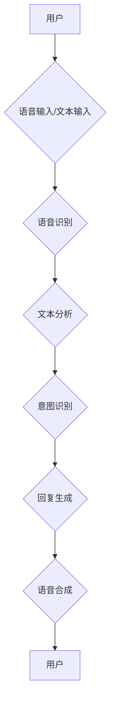

                 

# 自然语言交互（LUI）的潜力

## 关键词：
自然语言交互，语音识别，人工智能，语音助手，对话系统，人机交互

## 摘要：
本文将探讨自然语言交互（LUI）的潜力，从其背景、核心概念、算法原理、数学模型，到实际应用场景，我们将进行一步分析。LUI作为一种人机交互的新兴技术，正逐渐改变我们的生活方式和工作方式。通过详细的技术解读和案例分析，我们旨在揭示LUI在人工智能领域的深远影响及未来的发展方向与挑战。

## 1. 背景介绍

### 1.1 目的和范围
本文的目的是全面分析自然语言交互（LUI）的技术潜力，探究其在人工智能领域的应用。文章将涵盖LUI的历史、核心概念、算法原理、数学模型以及实际应用，旨在为读者提供一个全面、深入的技术视角。

### 1.2 预期读者
本文适用于对人工智能、自然语言处理、人机交互等领域感兴趣的读者，特别是那些希望了解LUI技术原理和应用前景的科研人员、工程师和开发者。

### 1.3 文档结构概述
本文分为十个部分，首先介绍LUI的背景，然后逐步深入到核心概念、算法原理、数学模型等具体技术细节，最后探讨LUI的实际应用场景和未来发展趋势。此外，还包括相关学习资源和工具推荐。

### 1.4 术语表

#### 1.4.1 核心术语定义
- 自然语言交互（LUI）：指通过自然语言（如英语、中文等）与计算机系统进行交互的过程。
- 语音识别：将人类语音转换为计算机可以理解和处理的文本或命令的技术。
- 对话系统：能够与人类进行自然语言对话的计算机系统。
- 人机交互：人与计算机系统之间的交互过程，包括语音、文字、手势等多种方式。

#### 1.4.2 相关概念解释
- 自然语言处理（NLP）：研究如何让计算机理解、生成和处理人类语言的技术。
- 语音合成：将文本转换为自然声音的技术。
- 语音助手：基于LUI技术，能够通过语音进行交互的智能系统，如Siri、Alexa等。

#### 1.4.3 缩略词列表
- LUI：自然语言交互
- NLP：自然语言处理
- ASR：自动语音识别
- TTS：文本到语音
- GUI：图形用户界面
- VR：虚拟现实

## 2. 核心概念与联系

在探讨LUI的核心概念和架构之前，我们需要先理解与之相关的几个关键概念：语音识别（ASR）、文本分析（NLP）、语音合成（TTS）以及对话系统。这些概念构成了LUI的核心组成部分，并且相互之间紧密联系。

### 2.1 语音识别（ASR）

语音识别是将人类的语音转换为计算机可以理解和处理的文本或命令的技术。ASR技术的发展使得计算机能够以自然的方式接收和处理人类语音。其核心原理包括声学模型、语言模型和声学-语言模型联合。

#### 声学模型：
声学模型是ASR系统的核心，它负责将语音信号转换为中间特征表示。常见的声学模型包括隐马尔可夫模型（HMM）、高斯混合模型（GMM）和深度神经网络（DNN）。

#### 语言模型：
语言模型负责预测语音序列对应的文本序列。它通常基于大量语料库训练，目的是使生成的文本序列在语法和语义上都是合理的。常见的语言模型包括n元语法模型和统计语言模型。

#### 声学-语言模型联合：
声学-语言模型联合是将声学模型和语言模型结合起来，以实现更准确的语音识别。这通常通过动态时间规整（DTW）算法、神经网络模型或贝叶斯推理等方法实现。

### 2.2 文本分析（NLP）

文本分析是自然语言处理（NLP）的核心，它涉及文本的理解、生成和处理。NLP的目标是使计算机能够像人类一样理解、处理和生成自然语言。文本分析通常包括分词、词性标注、句法分析、语义分析和信息抽取等任务。

#### 分词：
分词是将连续的文本序列划分为一系列有意义的单词或短语。常见的分词方法包括基于规则的分词、基于统计的分词和基于深度学习的分词。

#### 词性标注：
词性标注是为文本中的每个单词分配一个词性标签，如名词、动词、形容词等。词性标注对于句法分析和语义分析至关重要。

#### 句法分析：
句法分析是解析句子结构，识别句子中的主语、谓语、宾语等成分。常见的句法分析方法包括基于规则的方法、基于统计的方法和基于深度学习的方法。

#### 语义分析：
语义分析是理解文本的语义内容，包括实体识别、关系抽取、情感分析等。语义分析对于构建智能对话系统和理解用户意图至关重要。

#### 信息抽取：
信息抽取是从文本中提取出结构化信息的过程，如命名实体识别、关系抽取和事件抽取。信息抽取在智能问答、推荐系统和信息检索等领域有广泛应用。

### 2.3 语音合成（TTS）

语音合成是将文本转换为自然声音的技术。TTS系统的核心是文本到语音（Text-to-Speech）引擎，它包括语音合成引擎、文本处理模块和语音处理模块。

#### 文本处理模块：
文本处理模块负责将输入的文本转换成适合语音合成的格式。这通常涉及文本的语调、速度和音量的调整。

#### 语音合成引擎：
语音合成引擎是TTS系统的核心，它负责将文本转换为语音信号。常见的语音合成引擎包括基于规则的合成、基于参数的合成和基于数据的合成。

#### 语音处理模块：
语音处理模块负责将语音信号转换为自然的声音。这通常涉及语音的波形处理、共振峰处理和音调处理。

### 2.4 对话系统

对话系统是能够与人类进行自然语言对话的计算机系统。对话系统的核心是自然语言交互（LUI），它包括语音识别、文本分析、语音合成和对话管理等功能。

#### 对话管理：
对话管理是对话系统的核心，它负责控制对话流程，理解用户意图并生成合适的回复。对话管理通常涉及对话状态跟踪、意图识别和回复生成。

#### 用户意图识别：
用户意图识别是从用户的话语中提取出用户意图的过程。这通常涉及自然语言处理、机器学习和深度学习等技术。

#### 回复生成：
回复生成是根据用户意图生成合适的回复文本的过程。这通常涉及文本生成、模板匹配和自然语言生成等技术。

### 2.5  LUI 架构的 Mermaid 流程图

在上面的流程图中，用户通过语音或文本输入发起请求，系统通过语音识别将语音转换为文本，然后通过文本分析理解用户意图，生成合适的回复文本，并通过语音合成将文本转换为语音输出给用户。

## 3. 核心算法原理 & 具体操作步骤

在理解了LUI的核心概念和架构后，我们将进一步深入探讨其核心算法原理和具体操作步骤。这些算法原理和技术是实现高效、准确的LUI系统的基础。

### 3.1 语音识别（ASR）算法原理

语音识别（ASR）是LUI系统的第一步，它将用户的语音输入转换为计算机可以理解的文本。ASR算法原理主要包括声学模型、语言模型和声学-语言模型联合。

#### 3.1.1 声学模型

声学模型是ASR系统的核心，它负责将语音信号转换为中间特征表示。声学模型可以分为以下几种：

1. **隐马尔可夫模型（HMM）**：
   HMM是一种统计模型，用于表示语音信号的时间序列特性。在HMM中，每个状态都对应一个声学特征向量，状态转移概率和发射概率分别表示状态之间的转移和状态发出的声学特征。

2. **高斯混合模型（GMM）**：
   GMM用于生成语音信号的声学特征分布。每个高斯分布对应一个状态，通过最大化似然估计来选择最佳状态序列。

3. **深度神经网络（DNN）**：
   DNN是一种深度学习模型，用于生成语音信号的声学特征。DNN通常由多个隐藏层组成，通过前向传播和反向传播算法训练模型参数。

#### 3.1.2 语言模型

语言模型负责预测语音序列对应的文本序列。语言模型可以分为以下几种：

1. **n元语法模型**：
   n元语法模型基于前n个单词预测下一个单词。n越大，语言模型对文本的预测能力越强，但计算复杂度也越高。

2. **统计语言模型**：
   统计语言模型基于大量语料库训练，通过统计文本中的单词和短语出现频率来预测下一个单词或短语。

3. **神经网络语言模型**：
   神经网络语言模型是一种基于深度学习的语言模型，通过学习大量文本数据，生成高质量的文本序列。

#### 3.1.3 声学-语言模型联合

声学-语言模型联合是将声学模型和语言模型结合起来，以实现更准确的语音识别。声学-语言模型联合的方法可以分为以下几种：

1. **动态时间规整（DTW）算法**：
   DTW算法通过比较语音信号的时序差异，找到最佳的状态序列。DTW算法对时序变化敏感，但计算复杂度高。

2. **神经网络模型**：
   神经网络模型通过将声学特征和语言模型结合，实现高效的声学-语言模型联合。常见的神经网络模型包括卷积神经网络（CNN）、循环神经网络（RNN）和长短期记忆网络（LSTM）。

3. **贝叶斯推理**：
   贝叶斯推理通过计算声学特征和语言模型的后验概率，选择最佳的状态序列。贝叶斯推理在处理不确定性和噪声方面具有优势。

### 3.2 文本分析（NLP）算法原理

文本分析是NLP的核心，它包括分词、词性标注、句法分析、语义分析和信息抽取等任务。

#### 3.2.1 分词

分词是将连续的文本序列划分为一系列有意义的单词或短语。分词算法可以分为以下几种：

1. **基于规则的分词**：
   基于规则的分词通过预设的规则将文本划分为单词或短语。这种方法简单高效，但规则复杂度较高。

2. **基于统计的分词**：
   基于统计的分词通过统计文本中的单词和短语出现频率来划分文本。这种方法对大规模文本处理效果较好，但需要大量语料库支持。

3. **基于深度学习的分词**：
   基于深度学习的分词通过训练深度神经网络模型来自动划分文本。这种方法对复杂文本的处理能力较强，但需要大量训练数据和计算资源。

#### 3.2.2 词性标注

词性标注是为文本中的每个单词分配一个词性标签，如名词、动词、形容词等。词性标注算法可以分为以下几种：

1. **基于规则的方法**：
   基于规则的方法通过预设的规则为文本中的每个单词分配词性标签。这种方法简单快速，但规则复杂度较高。

2. **基于统计的方法**：
   基于统计的方法通过统计文本中单词的词性出现频率来为文本中的每个单词分配词性标签。这种方法对大规模文本处理效果较好，但需要大量语料库支持。

3. **基于深度学习的方法**：
   基于深度学习的方法通过训练深度神经网络模型来自动为文本中的每个单词分配词性标签。这种方法对复杂文本的处理能力较强，但需要大量训练数据和计算资源。

#### 3.2.3 句法分析

句法分析是解析句子结构，识别句子中的主语、谓语、宾语等成分。句法分析算法可以分为以下几种：

1. **基于规则的方法**：
   基于规则的方法通过预设的规则解析句子结构。这种方法简单快速，但规则复杂度较高。

2. **基于统计的方法**：
   基于统计的方法通过统计文本中的句子结构出现频率来解析句子结构。这种方法对大规模文本处理效果较好，但需要大量语料库支持。

3. **基于深度学习的方法**：
   基于深度学习的方法通过训练深度神经网络模型来自动解析句子结构。这种方法对复杂文本的处理能力较强，但需要大量训练数据和计算资源。

#### 3.2.4 语义分析

语义分析是理解文本的语义内容，包括实体识别、关系抽取、情感分析等。语义分析算法可以分为以下几种：

1. **基于规则的方法**：
   基于规则的方法通过预设的规则识别文本中的实体、关系和情感。这种方法简单快速，但规则复杂度较高。

2. **基于统计的方法**：
   基于统计的方法通过统计文本中实体、关系和情感的出现频率来识别文本中的实体、关系和情感。这种方法对大规模文本处理效果较好，但需要大量语料库支持。

3. **基于深度学习的方法**：
   基于深度学习的方法通过训练深度神经网络模型来自动识别文本中的实体、关系和情感。这种方法对复杂文本的处理能力较强，但需要大量训练数据和计算资源。

#### 3.2.5 信息抽取

信息抽取是从文本中提取出结构化信息的过程，如命名实体识别、关系抽取和事件抽取。信息抽取算法可以分为以下几种：

1. **基于规则的方法**：
   基于规则的方法通过预设的规则从文本中提取结构化信息。这种方法简单快速，但规则复杂度较高。

2. **基于统计的方法**：
   基于统计的方法通过统计文本中结构化信息出现频率来从文本中提取结构化信息。这种方法对大规模文本处理效果较好，但需要大量语料库支持。

3. **基于深度学习的方法**：
   基于深度学习的方法通过训练深度神经网络模型来自动从文本中提取结构化信息。这种方法对复杂文本的处理能力较强，但需要大量训练数据和计算资源。

### 3.3 语音合成（TTS）算法原理

语音合成是将文本转换为自然声音的技术。TTS系统的核心是文本到语音（Text-to-Speech）引擎，它包括语音合成引擎、文本处理模块和语音处理模块。

#### 3.3.1 文本处理模块

文本处理模块负责将输入的文本转换成适合语音合成的格式。这通常涉及文本的语调、速度和音量的调整。文本处理模块的算法原理包括：

1. **语调调整**：
   语调调整是通过改变文本的音高、音长和音强来模拟自然语音的音调变化。常见的语调调整算法包括基于规则的调整和基于统计的调整。

2. **速度调整**：
   速度调整是通过改变文本的朗读速度来适应不同场景和用户需求。常见的速度调整算法包括恒定速度调整和自适应速度调整。

3. **音量调整**：
   音量调整是通过改变文本的响度来适应不同场景和用户需求。常见的音量调整算法包括恒定音量调整和自适应音量调整。

#### 3.3.2 语音合成引擎

语音合成引擎是TTS系统的核心，它负责将文本转换为语音信号。常见的语音合成引擎包括：

1. **基于规则的合成**：
   基于规则的合成是通过预设的语音合成规则将文本转换为语音。这种方法简单高效，但规则复杂度较高。

2. **基于参数的合成**：
   基于参数的合成是通过调整语音参数（如音高、音长和音强）来合成语音。这种方法对语音质量有较高要求，但需要大量参数调整。

3. **基于数据的合成**：
   基于数据的合成是通过训练大量的语音数据来生成语音。这种方法对语音质量有较高要求，但需要大量训练数据和计算资源。

#### 3.3.3 语音处理模块

语音处理模块负责将语音信号转换为自然的声音。这通常涉及语音的波形处理、共振峰处理和音调处理。常见的语音处理模块算法原理包括：

1. **波形处理**：
   波形处理是通过调整语音信号的波形来改善语音质量。常见的波形处理算法包括波

