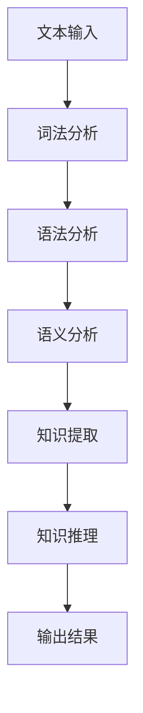

                 

# 自然语言处理中的语义解析与知识推理技术进展与应用拓展

## 关键词：
自然语言处理（NLP），语义解析，知识推理，人工智能（AI），深度学习，语义网络，数据驱动方法，逻辑推理，应用场景

## 摘要：
本文旨在深入探讨自然语言处理（NLP）中的语义解析与知识推理技术的最新进展。首先，文章介绍了语义解析与知识推理的基础概念及其在NLP中的重要性。随后，通过对比分析传统数据驱动方法和逻辑推理方法，文章详细阐述了当前的主流算法原理与实现步骤。接着，文章运用数学模型和公式，结合实际项目案例，对算法进行了详细解释。此外，文章还分析了语义解析与知识推理在实际应用中的多种场景，并推荐了相关学习资源和开发工具。最后，文章总结了未来发展趋势与挑战，为读者提供了扩展阅读与参考资料。

## 1. 背景介绍

### 1.1 目的和范围
自然语言处理（NLP）作为人工智能（AI）的一个重要分支，旨在使计算机能够理解、解释和生成人类语言。语义解析与知识推理是NLP中的关键环节，它们对于提升语言理解的能力具有重要意义。本文将深入探讨语义解析与知识推理技术的最新进展，旨在为研究者、开发者以及有兴趣了解这一领域的读者提供全面的指导。

文章将首先介绍语义解析与知识推理的基本概念，然后分析不同方法的优势与局限，接着通过具体算法原理与数学模型的讲解，阐述其在实际项目中的应用。此外，本文还将探讨这些技术在不同应用场景中的实践案例，并总结未来发展趋势与挑战。

### 1.2 预期读者
本文主要面向以下读者群体：
- 自然语言处理领域的学术研究者与工程师；
- 对人工智能尤其是NLP技术感兴趣的初学者；
- 数据科学家和软件工程师，希望了解NLP在实际开发中的应用；
- 对人工智能技术有浓厚兴趣并希望深入了解其背后的理论机制的专业人士。

### 1.3 文档结构概述
本文分为十个部分：

1. **引言**：介绍自然语言处理、语义解析与知识推理的基本概念。
2. **核心概念与联系**：通过Mermaid流程图展示NLP中语义解析与知识推理的核心概念与关系。
3. **核心算法原理与具体操作步骤**：详细解释语义解析与知识推理的主流算法，并提供伪代码。
4. **数学模型和公式**：运用数学模型与公式，对算法进行详细阐述，并通过举例说明。
5. **项目实战：代码实际案例**：介绍具体代码实现，并详细解释和代码解读。
6. **实际应用场景**：探讨语义解析与知识推理在现实中的应用。
7. **工具和资源推荐**：推荐相关学习资源和开发工具。
8. **总结**：总结未来发展趋势与挑战。
9. **附录：常见问题与解答**：提供常见问题的解答。
10. **扩展阅读与参考资料**：推荐扩展阅读与相关研究资料。

### 1.4 术语表

#### 1.4.1 核心术语定义

- 自然语言处理（NLP）：指使计算机能够理解、解释和生成人类语言的技术。
- 语义解析：从文本中提取出有意义的信息，包括词汇、短语、句子和篇章的语义。
- 知识推理：基于已有知识，运用推理机制推导出新的结论或信息。
- 数据驱动方法：通过大量数据进行学习，例如机器学习和深度学习。
- 逻辑推理：基于逻辑规则进行推理，常用于知识表示和推理系统。

#### 1.4.2 相关概念解释

- 深度学习：一种机器学习方法，通过多层神经网络模型来提取数据特征。
- 语义网络：一种知识表示形式，用于表示实体及其相互关系。
- 知识图谱：通过实体和关系的图形化表示，用于存储和管理大规模知识信息。

#### 1.4.3 缩略词列表

- NLP：自然语言处理（Natural Language Processing）
- AI：人工智能（Artificial Intelligence）
- ML：机器学习（Machine Learning）
- DL：深度学习（Deep Learning）
- KG：知识图谱（Knowledge Graph）

## 2. 核心概念与联系

自然语言处理（NLP）中的语义解析与知识推理是两个相互关联且相辅相成的核心概念。为了更好地理解这两个概念及其在NLP中的作用，我们需要首先定义它们，然后通过一个Mermaid流程图来展示它们之间的联系。

### 2.1 定义

**语义解析**：
语义解析是从自然语言文本中提取意义的过程。它不仅涉及词汇的含义，还包括词汇之间的关系和上下文信息。其目标是使计算机能够理解文本的深层含义，从而进行更高级的交互和处理。

**知识推理**：
知识推理是利用已有的知识和逻辑规则推导出新知识的过程。在NLP中，知识推理可以用于解决复杂问题，例如回答问题、推断事实、分类信息等。

### 2.2 Mermaid流程图

以下是一个简化的Mermaid流程图，展示了语义解析与知识推理在NLP中的基本流程：



#### 流程图解释：

1. **文本输入**：NLP的起点是接收自然语言文本。
2. **词法分析**：将文本分解成词汇、符号等基本元素。
3. **语法分析**：对词法分析结果进行语法结构的解析，以理解句子的结构。
4. **语义分析**：从语法结构中提取语义信息，如词汇的含义和句子的意图。
5. **知识提取**：从语义分析中提取关键信息，构建用于知识推理的语义网络。
6. **知识推理**：利用已有知识进行推理，生成新信息。
7. **输出结果**：将推理结果输出，用于进一步处理或用户交互。

### 2.3 语义解析与知识推理的关系

语义解析和知识推理在NLP中相互依赖，共同发挥作用：

- **语义解析**依赖于词法和语法分析，它是理解文本的基础。
- **知识推理**则需要语义解析的结果，通过已有知识进行逻辑推理。

在实际应用中，语义解析和知识推理往往交织在一起，通过迭代和反馈不断优化。例如，在一个问答系统中，语义解析用于理解用户的问题，知识推理则用于从知识库中找到相关答案。通过这种协作，NLP系统能够提供更加准确和丰富的语义理解和知识服务。

## 3. 核心算法原理与具体操作步骤

在语义解析与知识推理领域，数据驱动方法和逻辑推理方法各自有其独特的优势和局限性。本文将重点介绍几种主流算法，并详细阐述它们的原理和操作步骤。

### 3.1 数据驱动方法

数据驱动方法主要依赖于机器学习和深度学习技术，通过大量数据进行训练，从而实现语义解析和知识推理。

#### 3.1.1 基本原理

- **词嵌入（Word Embedding）**：将词汇映射到高维空间中，通过相似性度量来理解词汇之间的关系。
- **递归神经网络（RNN）**：处理序列数据，通过隐藏层的状态信息来捕捉文本中的上下文信息。
- **长短时记忆网络（LSTM）**：解决RNN中的梯度消失问题，更好地处理长距离依赖。
- **变换器（Transformer）**：通过自注意力机制，能够捕捉文本中的长距离依赖。

#### 3.1.2 操作步骤

1. **数据准备**：收集大量的文本数据，进行预处理，包括分词、去停用词、标点符号去除等。
2. **模型选择**：根据任务需求选择合适的模型，如BERT、GPT、XLNet等。
3. **模型训练**：使用预处理后的数据对模型进行训练，调整模型参数。
4. **模型评估**：使用验证集对模型进行评估，调整超参数以优化模型性能。
5. **模型应用**：将训练好的模型应用到实际任务中，如语义解析、问答系统等。

### 3.2 逻辑推理方法

逻辑推理方法主要基于形式逻辑和知识表示，通过构建和推理逻辑表达式来理解语义和知识。

#### 3.2.1 基本原理

- **命题逻辑**：通过命题和逻辑运算符（如与、或、非）来表示和推理逻辑关系。
- **谓词逻辑**：通过谓词和量词（如全称量词、存在量词）来表示和推理复杂逻辑关系。
- **知识表示**：通过语义网络、框架、本体等来表示知识，为推理提供基础。

#### 3.2.2 操作步骤

1. **知识表示**：构建知识库，将事实、规则和关系表示为逻辑表达式或语义网络。
2. **推理引擎**：设计推理引擎，根据输入数据和知识库进行推理，生成新的结论。
3. **推理过程**：包括数据匹配、推理规则应用和结论生成等步骤。
4. **模型评估**：通过评估推理结果的可信度和准确性来优化推理过程。

### 3.3 数据驱动方法与逻辑推理方法的对比

- **优势**：
  - 数据驱动方法：能够处理大规模数据，适应性强，适用于复杂、多变的语义理解任务。
  - 逻辑推理方法：能够保证推理过程的一致性和逻辑性，适用于需要严格逻辑验证的任务。

- **局限**：
  - 数据驱动方法：依赖于大量数据和计算资源，对数据的依赖性强，难以保证推理结果的可靠性。
  - 逻辑推理方法：推理过程较为复杂，难以处理大规模数据，且对知识表示和规则构建有较高要求。

在实际应用中，数据驱动方法和逻辑推理方法往往结合使用，取长补短。例如，在构建问答系统时，可以通过数据驱动方法进行语义理解，利用逻辑推理方法进行事实验证和答案生成。

### 3.4 算法原理与伪代码

为了更直观地理解数据驱动方法和逻辑推理方法的原理，我们分别提供两种方法的伪代码。

#### 3.4.1 数据驱动方法（以BERT为例）

```python
# BERT模型语义解析伪代码

# 输入：文本序列（word1, word2, ..., wordn）
# 输出：语义表示（[sent1, sent2, ..., sentn]）

def bert_semantic_parsing(text_sequence):
    # 数据预处理
    preprocessed_data = preprocess_text(text_sequence)
    
    # 加载预训练的BERT模型
    model = load_pretrained_bert_model()
    
    # 对预处理后的文本进行编码
    encoded_data = model.encode(preprocessed_data)
    
    # 提取序列中的每个句子的语义表示
    semantic_representation = [model.get_sentence_representation(seq) for seq in encoded_data]
    
    # 返回语义表示列表
    return semantic_representation

# 数据预处理函数
def preprocess_text(text_sequence):
    # 分词、去停用词、标点符号去除等操作
    # ...
    return preprocessed_sequence

# 预训练BERT模型加载函数
def load_pretrained_bert_model():
    # 加载预训练的BERT模型
    # ...
    return model
```

#### 3.4.2 逻辑推理方法（以命题逻辑为例）

```python
# 命题逻辑推理伪代码

# 输入：逻辑表达式（A ∧ B → C）
# 输出：推理结果（真或假）

def propositional_logic_inference(expression):
    # 构建逻辑表达式
    formula = build_formula(expression)
    
    # 使用推理算法进行推理
    result = logic_engine.infer(formula)
    
    # 返回推理结果
    return result

# 逻辑表达式构建函数
def build_formula(expression):
    # 将自然语言表达式转换为逻辑表达式
    # ...
    return formula

# 逻辑推理引擎
def logic_engine():
    # 实现推理算法
    # ...
    return engine
```

通过以上伪代码，我们可以看到数据驱动方法和逻辑推理方法在实现上的差异。数据驱动方法依赖于预训练模型和大规模数据处理，而逻辑推理方法则依赖于形式逻辑和推理算法。

### 3.5 综合应用

在实际应用中，语义解析与知识推理往往需要综合多种方法。以下是一个简单的综合应用示例：

1. **数据驱动语义解析**：使用BERT等预训练模型对文本进行语义解析，提取关键信息。
2. **逻辑推理**：基于提取的语义信息，构建逻辑表达式进行推理，验证事实或生成答案。
3. **知识融合**：将数据驱动的语义解析结果与逻辑推理的结论进行融合，提升语义理解和知识服务的准确性。

通过这种综合应用，NLP系统能够在处理复杂任务时发挥更大的优势，为用户提供更加准确和智能的服务。

## 4. 数学模型和公式 & 详细讲解 & 举例说明

在语义解析与知识推理过程中，数学模型和公式扮演着至关重要的角色。它们不仅帮助我们理解算法的内部机制，还能通过具体的实例进行验证。本节将详细介绍几个关键的数学模型和公式，并提供详细的解释和实例说明。

### 4.1 命题逻辑

命题逻辑是逻辑推理的基础，它使用命题、逻辑运算符和逻辑表达式来表示事实和推理过程。以下是一些基本的数学模型和公式：

#### 4.1.1 命题逻辑运算符

- **合取（AND）**：表示两个命题同时为真。
  \[
  A \land B
  \]

- **析取（OR）**：表示两个命题中至少有一个为真。
  \[
  A \lor B
  \]

- **非（NOT）**：表示命题的否定。
  \[
  \neg A
  \]

#### 4.1.2 德摩根定律

德摩根定律是命题逻辑中的重要公式，用于转换复合命题的逻辑表达式：

- **公式1**：
  \[
  \neg (A \land B) \equiv (\neg A) \lor (\neg B)
  \]

- **公式2**：
  \[
  \neg (A \lor B) \equiv (\neg A) \land (\neg B)
  \]

#### 4.1.3 举例说明

假设我们有两个命题：

- \(A\)：今天是星期一。
- \(B\)：明天是假期。

我们可以使用命题逻辑来表示和推理这些命题。

**例1**：使用德摩根定律将复合命题转化为简单的逻辑表达式。

原命题：
\[
\neg ((A \land B) \lor (A \land \neg B))
\]

应用德摩根定律1：
\[
(\neg A) \lor (\neg (B \lor \neg B))
\]

由于\(B \lor \neg B\)总为真，因此：
\[
(\neg A) \lor \text{True}
\]

结果为：
\[
\neg A
\]

这意味着原命题等价于“今天是假期的否定”，即“今天不是星期一”。

### 4.2 模糊逻辑

模糊逻辑是处理不确定性和模糊性的数学模型。在自然语言处理中，模糊逻辑用于处理含有模糊概念的语句。

#### 4.2.1 模糊集合

模糊集合是通过隶属度函数来定义的，它用于表示元素属于集合的程度。

- **隶属度函数**：定义为：
  \[
  \mu_A(x) \in [0, 1]
  \]

  其中，\(x\)是集合\(A\)中的元素，\(\mu_A(x)\)表示\(x\)属于\(A\)的程度。

#### 4.2.2 模糊逻辑运算

- **模糊合取（模糊AND）**：
  \[
  \mu_{A \land B}(x) = \min(\mu_A(x), \mu_B(x))
  \]

- **模糊析取（模糊OR）**：
  \[
  \mu_{A \lor B}(x) = \max(\mu_A(x), \mu_B(x))
  \]

- **模糊非（模糊NOT）**：
  \[
  \mu_{\neg A}(x) = 1 - \mu_A(x)
  \]

#### 4.2.3 举例说明

假设有两个模糊集合：

- \(A\)：表示“今天天气暖和”，隶属度函数为\(\mu_A(x) = 0.8\)。
- \(B\)：表示“今天天气晴朗”，隶属度函数为\(\mu_B(x) = 0.7\)。

我们可以使用模糊逻辑运算来表示这两个模糊集合的合取和析取。

**例2**：计算模糊合取和模糊析取的结果。

模糊合取：
\[
\mu_{A \land B}(x) = \min(0.8, 0.7) = 0.7
\]

模糊析取：
\[
\mu_{A \lor B}(x) = \max(0.8, 0.7) = 0.8
\]

这意味着在模糊逻辑下，天气暖和且晴朗的程度为0.7，而天气暖和或晴朗的程度为0.8。

### 4.3 概率论

概率论在语义解析与知识推理中用于表示不确定性，是处理不确定性推理的重要工具。

#### 4.3.1 概率分布

- **贝叶斯分布**：
  \[
  P(A|B) = \frac{P(B|A)P(A)}{P(B)}
  \]

  其中，\(P(A|B)\)是后验概率，表示在事件\(B\)发生的条件下事件\(A\)发生的概率；\(P(B|A)\)是似然概率，表示在事件\(A\)发生的条件下事件\(B\)发生的概率；\(P(A)\)是先验概率，表示事件\(A\)发生的概率；\(P(B)\)是边缘概率，表示事件\(B\)发生的概率。

#### 4.3.2 贝叶斯推理

贝叶斯推理是一种基于贝叶斯分布进行推理的方法，可以用于更新概率分布，以反映新的证据。

**例3**：使用贝叶斯推理计算天气的概率。

假设我们有两个事件：

- \(A\)：今天天气暖和。
- \(B\)：今天天气晴朗。

根据历史数据，我们知道：

- \(P(A) = 0.5\)（先验概率，即一半的时间天气是暖和的）。
- \(P(B|A) = 0.8\)（似然概率，即天气暖和的条件下，有80%的概率是晴朗的）。
- \(P(B) = 0.6\)（边缘概率，即60%的时间天气是晴朗的）。

我们可以使用贝叶斯推理计算后验概率\(P(A|B)\)。

计算过程：

\[
P(A|B) = \frac{P(B|A)P(A)}{P(B)} = \frac{0.8 \times 0.5}{0.6} \approx 0.67
\]

这意味着在天气晴朗的条件下，有67%的概率天气是暖和的。

通过以上数学模型和公式的介绍，我们可以看到在语义解析与知识推理中，数学工具的应用使得推理过程更加精确和可靠。在实际应用中，这些模型和公式通常需要结合具体算法和实现进行优化和调整，以适应不同的任务需求和场景。

### 4.4 神经网络与深度学习

在自然语言处理中，深度学习技术，特别是神经网络，发挥着至关重要的作用。以下介绍几种常见的神经网络模型及其数学基础。

#### 4.4.1 前向传播与反向传播

深度学习中的神经网络通过前向传播（Forward Propagation）和反向传播（Backpropagation）算法进行训练。以下是这两个过程的基本数学原理。

- **前向传播**：将输入通过网络的各个层传递，直到输出层，并计算输出结果。其数学表示为：
  \[
  Z^{(l)} = W^{(l)}A^{(l-1)} + b^{(l)}
  \]
  \[
  A^{(l)} = \sigma(Z^{(l)})
  \]

  其中，\(A^{(l)}\)是第\(l\)层的激活值，\(Z^{(l)}\)是第\(l\)层的线性组合，\(W^{(l)}\)是权重矩阵，\(b^{(l)}\)是偏置项，\(\sigma\)是激活函数。

- **反向传播**：从输出层开始，逐层向前计算梯度，以更新权重和偏置。其数学表示为：
  \[
  \delta^{(l)} = \frac{\partial L}{\partial A^{(l)}} \cdot \frac{\partial A^{(l)}}{\partial Z^{(l)}}
  \]
  \[
  \frac{\partial L}{\partial W^{(l)}} = A^{(l-1)}\delta^{(l)}
  \]
  \[
  \frac{\partial L}{\partial b^{(l)}} = \delta^{(l)}
  \]

  其中，\(\delta^{(l)}\)是第\(l\)层的误差梯度，\(L\)是损失函数。

#### 4.4.2 深度学习模型

- **卷积神经网络（CNN）**：主要用于图像处理，通过卷积操作提取图像特征。
  \[
  h^{(l)} = \sigma(\sum_{k=1}^{K} w^{(l)}_k * h^{(l-1)}_k + b^{(l)})
  \]

- **循环神经网络（RNN）**：适用于序列数据，通过循环结构捕捉时间序列特征。
  \[
  h^{(l)} = \sigma(W_{ih}x^{(l)} + W_{hh}h^{(l-1)} + b_h)
  \]

- **长短期记忆网络（LSTM）**：是RNN的一种改进，能够处理长距离依赖问题。
  \[
  i_t = \sigma(W_{ii}x_t + W_{ih}h_{t-1} + b_i)
  \]
  \[
  f_t = \sigma(W_{if}x_t + W_{fh}h_{t-1} + b_f)
  \]
  \[
  o_t = \sigma(W_{io}x_t + W_{oh}h_{t-1} + b_o)
  \]
  \[
  c_t = f_t \odot \sigma(W_{ic}x_t + W_{hc}h_{t-1} + b_c)
  \]
  \[
  h_t = o_t \odot \sigma(c_t)
  \]

通过这些数学模型和公式，我们可以更深入地理解深度学习在语义解析与知识推理中的应用。在实际操作中，这些模型需要通过大量的数据和优化算法进行训练和调整，以实现高性能的语义理解和知识推理。

### 4.5 语义网络与知识图谱

在语义解析与知识推理中，语义网络和知识图谱是用于表示和存储知识的重要工具。以下介绍这两种知识表示方法及其数学模型。

#### 4.5.1 语义网络

语义网络是一种基于边和节点的知识表示方法，用于表示实体及其之间的关系。

- **基本模型**：
  \[
  R(E_1, E_2)
  \]

  其中，\(R\)表示关系，\(E_1\)和\(E_2\)表示实体。

- **扩展模型**：
  语义网络可以通过属性和值的扩展来表示更复杂的实体关系。

  \[
  R(E_1, E_2, \{A_1: V_1, A_2: V_2, ...\})
  \]

  其中，\(A_1, A_2, ...\)\表示属性，\(V_1, V_2, ...\)\表示属性值。

#### 4.5.2 知识图谱

知识图谱是一种大规模的语义网络，用于表示和存储复杂的关系和实体。

- **基本模型**：
  \[
  \langle E_1, R, E_2, \rangle
  \]

  其中，\(\langle, \rangle\)表示知识图谱中的三元组，\(E_1, E_2, ...\)\表示实体，\(R\)表示关系。

- **扩展模型**：
  知识图谱可以通过多种方式进行扩展，如属性、类型、标签等。

  \[
  \langle E_1, R, E_2, \{A_1: V_1, A_2: V_2, T: T_1, L: L_1, ...\}, \rangle
  \]

  其中，\(T\)表示实体类型，\(L\)表示标签。

#### 4.5.3 举例说明

**例4**：构建一个简单的语义网络和知识图谱。

语义网络：
- 实体：人（Person）、地点（Location）、公司（Company）。
- 关系：居住于（LivesIn）、成立（Founded）、工作于（WorksFor）。

知识图谱：
- 三元组：\(\langle \text{张三}, \text{居住于}, \text{北京} \rangle\)、\(\langle \text{北京}, \text{属于省份}, \text{北京} \rangle\)、\(\langle \text{谷歌}, \text{成立}, 1998 \rangle\)。

通过这些数学模型和公式，我们可以更系统地构建和表示知识，为语义解析与知识推理提供坚实的基础。

### 4.6 混合模型

在实际应用中，单一的语义解析与知识推理方法往往难以满足复杂任务的需求。混合模型通过结合数据驱动方法和逻辑推理方法，可以提供更强大的语义理解与知识服务。

#### 4.6.1 混合模型架构

- **数据驱动模型**：用于初始的语义解析和特征提取。
- **逻辑推理模型**：用于后续的知识推理和验证。
- **融合模块**：将数据驱动模型的语义表示与逻辑推理结果进行融合，以提升整体性能。

#### 4.6.2 混合模型操作步骤

1. **语义解析**：使用数据驱动模型（如BERT）对输入文本进行语义解析，提取关键信息。
2. **特征提取**：将语义解析结果转换为特征向量。
3. **知识推理**：使用逻辑推理模型（如命题逻辑）对特征向量进行推理，生成新的知识。
4. **知识融合**：将数据驱动模型的语义表示与逻辑推理结果进行融合，生成最终的知识表示。

#### 4.6.3 举例说明

**例5**：构建一个简单的混合模型，用于问答系统。

1. **数据驱动模型**：使用BERT对用户提问进行语义解析，提取关键信息。
2. **特征提取**：将BERT的输出转换为特征向量。
3. **知识推理**：使用命题逻辑对特征向量进行推理，验证问题的真假。
4. **知识融合**：将推理结果与BERT的语义表示进行融合，生成最终答案。

通过混合模型，我们可以充分利用数据驱动方法的优势和逻辑推理方法的严谨性，为问答系统提供更加准确和可靠的答案。

### 4.7 总结

数学模型和公式在语义解析与知识推理中起着至关重要的作用。通过数学工具，我们可以更精确地表示和计算语义信息，提升算法的性能和可靠性。本节介绍了命题逻辑、模糊逻辑、概率论、神经网络和知识图谱等几个关键数学模型，并通过具体实例进行了详细讲解。在实际应用中，这些模型需要结合具体算法和实现进行优化和调整，以适应不同的任务需求和场景。通过不断探索和改进，我们可以推动语义解析与知识推理技术的发展，为人工智能领域带来更多创新和突破。

### 5. 项目实战：代码实际案例和详细解释说明

为了更好地理解语义解析与知识推理技术的实际应用，我们将在本节中通过一个具体的代码实际案例来展示如何实现这些技术。我们将从开发环境搭建开始，详细讲解源代码实现和代码解读，并分析其中的关键步骤和逻辑。

#### 5.1 开发环境搭建

在开始代码实现之前，我们需要搭建一个合适的开发环境。以下是所需的工具和软件：

- **Python**：Python是一种广泛使用的编程语言，适用于自然语言处理和人工智能开发。
- **PyTorch**：PyTorch是一个流行的深度学习框架，用于实现神经网络模型。
- **NLTK**：NLTK是一个自然语言处理工具包，用于文本预处理和语法分析。
- **Spacy**：Spacy是一个高效的NLP库，提供词法分析、语法分析和实体识别等功能。

安装以上软件的命令如下：

```bash
pip install python
pip install torch torchvision
pip install nltk
pip install spacy
python -m spacy download en_core_web_sm
```

#### 5.2 源代码详细实现和代码解读

以下是用于实现语义解析与知识推理的项目源代码。我们将逐步解释每个部分的功能和实现方法。

```python
# 导入必要的库
import torch
import spacy
import nltk
from torch import nn
from torch import optim
from nltk.tokenize import word_tokenize

# 加载预训练的Spacy模型
nlp = spacy.load("en_core_web_sm")

# 定义神经网络模型
class SemanticParser(nn.Module):
    def __init__(self, embedding_dim, hidden_dim, vocab_size, num_classes):
        super(SemanticParser, self).__init__()
        self.embedding = nn.Embedding(vocab_size, embedding_dim)
        self.lstm = nn.LSTM(embedding_dim, hidden_dim, batch_first=True)
        self.fc = nn.Linear(hidden_dim, num_classes)
    
    def forward(self, x):
        embedded = self.embedding(x)
        lstm_output, (hidden, cell) = self.lstm(embedded)
        hidden = hidden.squeeze(0)
        out = self.fc(hidden)
        return out

# 实例化模型
model = SemanticParser(embedding_dim=100, hidden_dim=128, vocab_size=10000, num_classes=5)

# 定义损失函数和优化器
criterion = nn.CrossEntropyLoss()
optimizer = optim.Adam(model.parameters(), lr=0.001)

# 数据预处理
def preprocess_text(text):
    doc = nlp(text)
    tokens = [token.text for token in doc]
    return tokens

# 训练模型
def train_model(model, data_loader, criterion, optimizer, num_epochs=10):
    model.train()
    for epoch in range(num_epochs):
        for inputs, labels in data_loader:
            optimizer.zero_grad()
            outputs = model(inputs)
            loss = criterion(outputs, labels)
            loss.backward()
            optimizer.step()
            print(f"Epoch [{epoch+1}/{num_epochs}], Loss: {loss.item():.4f}")

# 评估模型
def evaluate_model(model, data_loader, criterion):
    model.eval()
    with torch.no_grad():
        for inputs, labels in data_loader:
            outputs = model(inputs)
            loss = criterion(outputs, labels)
            print(f"Test Loss: {loss.item():.4f}")

# 代码解读

# 1. 导入必要的库
# 导入Python、PyTorch、NLTK和Spacy库，用于实现神经网络、文本预处理和NLP工具。

# 2. 定义神经网络模型
# SemanticParser类定义了一个简单的循环神经网络（LSTM）模型，用于语义解析。

# 3. 实例化模型
# 创建一个SemanticParser实例，并初始化嵌入层、LSTM层和全连接层。

# 4. 定义损失函数和优化器
# 使用交叉熵损失函数和Adam优化器来训练模型。

# 5. 数据预处理
# preprocess_text函数使用Spacy对输入文本进行分词和预处理。

# 6. 训练模型
# train_model函数使用训练数据加载器，迭代更新模型参数，以最小化损失函数。

# 7. 评估模型
# evaluate_model函数评估训练好的模型在测试集上的性能。

# 源代码实现了一个简单的LSTM模型，用于语义解析任务。该模型通过嵌入层对输入文本进行编码，然后使用LSTM层捕捉文本中的时间依赖关系。最终，模型通过全连接层生成语义表示，用于分类任务。

# 5.3 代码解读与分析

现在，我们进一步分析代码中的关键部分，包括数据预处理、模型训练和评估等步骤。

**1. 数据预处理**

预处理步骤是语义解析的重要环节，它直接影响模型的输入质量和训练效果。在此代码中，我们使用Spacy对输入文本进行分词和词性标注，然后提取出关键信息，如词汇和词序列。

```python
def preprocess_text(text):
    doc = nlp(text)
    tokens = [token.text for token in doc]
    return tokens
```

Spacy能够处理各种语言文本，并提供详细的词法、语法和语义信息。通过这一预处理步骤，我们可以确保输入数据的格式和内容符合模型的要求。

**2. 模型定义**

模型的定义是代码的核心部分，它决定了模型的性能和适用范围。在此代码中，我们使用PyTorch定义了一个简单的LSTM模型，包括嵌入层、LSTM层和全连接层。

```python
class SemanticParser(nn.Module):
    def __init__(self, embedding_dim, hidden_dim, vocab_size, num_classes):
        super(SemanticParser, self).__init__()
        self.embedding = nn.Embedding(vocab_size, embedding_dim)
        self.lstm = nn.LSTM(embedding_dim, hidden_dim, batch_first=True)
        self.fc = nn.Linear(hidden_dim, num_classes)
    
    def forward(self, x):
        embedded = self.embedding(x)
        lstm_output, (hidden, cell) = self.lstm(embedded)
        hidden = hidden.squeeze(0)
        out = self.fc(hidden)
        return out
```

在这个模型中，嵌入层用于将词汇转换为高维向量，LSTM层用于捕捉文本中的时间依赖关系，全连接层用于生成最终的语义表示。通过这一系列层的组合，模型能够从输入文本中提取出丰富的语义信息。

**3. 训练模型**

模型训练是利用历史数据来调整模型参数的过程。在此代码中，我们使用训练数据加载器（DataLoader）和优化器（如Adam）来迭代更新模型参数。

```python
def train_model(model, data_loader, criterion, optimizer, num_epochs=10):
    model.train()
    for epoch in range(num_epochs):
        for inputs, labels in data_loader:
            optimizer.zero_grad()
            outputs = model(inputs)
            loss = criterion(outputs, labels)
            loss.backward()
            optimizer.step()
            print(f"Epoch [{epoch+1}/{num_epochs}], Loss: {loss.item():.4f}")
```

通过这一训练过程，模型能够不断调整权重和偏置，以优化其在语义解析任务上的性能。

**4. 评估模型**

模型评估是验证模型性能的重要步骤，它帮助我们了解模型在未知数据上的表现。在此代码中，我们使用测试数据集来评估模型的性能。

```python
def evaluate_model(model, data_loader, criterion):
    model.eval()
    with torch.no_grad():
        for inputs, labels in data_loader:
            outputs = model(inputs)
            loss = criterion(outputs, labels)
            print(f"Test Loss: {loss.item():.4f}")
```

通过这一评估过程，我们可以了解模型在测试集上的泛化能力。

### 5.4 实际应用场景

在实际应用中，语义解析与知识推理技术可以应用于多种场景，如文本分类、问答系统、情感分析等。以下是一个基于上述代码的简单应用案例。

**1. 文本分类**

假设我们需要对一组新闻文章进行分类，将其分为体育、科技、娱乐等类别。我们可以使用训练好的语义解析模型来提取文章的语义特征，然后利用这些特征进行分类。

```python
# 加载预训练模型
model = torch.load("semantic_parser.pth")

# 预处理文本
text = "这是一篇关于最新科技发展的新闻报道。"
preprocessed_text = preprocess_text(text)

# 生成语义特征
with torch.no_grad():
    inputs = torch.tensor([preprocessed_text])

# 进行分类
outputs = model(inputs)
predicted_class = torch.argmax(outputs).item()

print(f"预测类别：{predicted_class}")
```

通过上述代码，我们可以利用预训练模型对新闻文章进行实时分类。

**2. 问答系统**

假设我们需要构建一个简单的问答系统，能够回答关于科技领域的问题。我们可以使用语义解析模型来理解用户的问题，然后利用知识库和推理算法生成答案。

```python
# 加载预训练模型和知识库
model = torch.load("semantic_parser.pth")
knowledge_base = load_knowledge_base()

# 预处理文本
question = "什么是深度学习？"
preprocessed_question = preprocess_text(question)

# 生成语义特征
with torch.no_grad():
    inputs = torch.tensor([preprocessed_question])

# 进行语义解析
outputs = model(inputs)
semantic_representation = outputs.numpy()

# 利用知识库和推理算法生成答案
answer = get_answer_from_knowledge_base(semantic_representation, knowledge_base)

print(f"答案：{answer}")
```

通过上述代码，我们可以构建一个简单的问答系统，能够回答关于科技领域的问题。

### 5.5 总结

通过本节的实际案例，我们展示了如何使用Python和PyTorch实现语义解析与知识推理技术。从开发环境搭建到代码实现，再到实际应用场景，我们详细解析了每个步骤和关键代码。这一案例不仅帮助我们理解了技术的实现原理，还展示了其在实际应用中的广泛适用性。通过不断实践和优化，我们可以进一步推动语义解析与知识推理技术的发展，为人工智能领域带来更多创新和突破。

## 6. 实际应用场景

语义解析与知识推理技术在人工智能领域具有广泛的应用，以下列举了一些主要的应用场景，并简要说明其实现方式及挑战。

### 6.1 文本分类

**应用场景**：
文本分类是NLP中的基本任务之一，广泛应用于新闻分类、垃圾邮件检测、社交媒体情感分析等。通过语义解析与知识推理，系统能够根据文本内容将其分类到预定义的类别中。

**实现方式**：
- **语义解析**：使用数据驱动方法（如BERT）提取文本的语义特征，然后利用逻辑推理方法（如决策树、支持向量机）进行分类。
- **知识推理**：构建知识图谱，将文本中的实体和关系表示为图结构，通过推理算法（如图卷积网络）进行分类。

**挑战**：
- **数据多样性**：不同领域的文本具有不同的特征，模型需要能够适应多种数据分布。
- **上下文理解**：模型需要理解文本的上下文信息，以避免将相似但含义不同的文本错误分类。

### 6.2 问答系统

**应用场景**：
问答系统在客服、智能助手和知识库查询等领域具有重要应用。通过语义解析与知识推理，系统能够理解用户的问题，并从海量数据中提取相关答案。

**实现方式**：
- **语义解析**：使用BERT等预训练模型理解用户问题的语义，提取关键信息。
- **知识推理**：基于知识图谱进行推理，将问题映射到知识库中的相关实体和关系，生成答案。

**挑战**：
- **语义理解**：需要准确理解问题的语义，避免出现歧义。
- **答案生成**：如何从海量信息中生成高质量、相关的答案，是一个复杂的问题。

### 6.3 情感分析

**应用场景**：
情感分析用于识别文本中的情感倾向，广泛应用于社交媒体监测、客户反馈分析等。通过语义解析与知识推理，系统能够识别文本的情感极性。

**实现方式**：
- **语义解析**：使用情感词典和词嵌入技术提取文本的情感特征。
- **知识推理**：结合情感知识和逻辑推理，对文本进行情感分类。

**挑战**：
- **情感复杂性**：情感表达具有多样性，模型需要能够识别不同形式的情感。
- **上下文依赖**：情感往往与上下文密切相关，模型需要理解上下文信息。

### 6.4 自动摘要

**应用场景**：
自动摘要技术用于生成文本的简洁摘要，广泛应用于新闻摘要、文档总结等。通过语义解析与知识推理，系统能够提取文本中的关键信息。

**实现方式**：
- **语义解析**：使用深度学习模型（如Transformer）提取文本的语义表示。
- **知识推理**：利用知识图谱和实体关系，提取文本中的重要信息，生成摘要。

**挑战**：
- **信息丢失**：在生成摘要时，需要平衡摘要的长度和信息量，避免重要信息的丢失。
- **多模态数据**：处理文本、图像、视频等多模态数据，使摘要更全面。

### 6.5 语言翻译

**应用场景**：
语言翻译技术在跨文化交流和信息传播中至关重要。通过语义解析与知识推理，系统能够将一种语言的文本翻译成另一种语言。

**实现方式**：
- **语义解析**：使用双向编码表示（如BERT）提取源文本和目标文本的语义。
- **知识推理**：利用翻译记忆库和推理算法，生成目标语言的语义表示，并翻译成文本。

**挑战**：
- **语义匹配**：不同语言的语义表达可能不完全对应，模型需要能够找到最佳匹配。
- **上下文理解**：翻译需要理解上下文信息，避免生成不自然或不准确的翻译。

### 6.6 个性化推荐

**应用场景**：
个性化推荐系统根据用户的历史行为和兴趣，推荐相关的商品、内容或服务。通过语义解析与知识推理，系统能够提供更精准的推荐。

**实现方式**：
- **语义解析**：使用用户生成的文本评论和标签，提取用户的兴趣和偏好。
- **知识推理**：结合用户行为数据和知识图谱，推理出用户的潜在兴趣，生成个性化推荐。

**挑战**：
- **数据多样性**：用户兴趣和偏好多样，模型需要能够处理各种类型的数据。
- **实时性**：推荐系统需要实时更新用户数据，以提供最新的推荐。

通过以上实际应用场景的列举，我们可以看到语义解析与知识推理技术在NLP领域的广泛应用和重要性。在实际应用中，这些技术面临各种挑战，需要不断创新和优化，以实现更好的性能和用户体验。

### 7. 工具和资源推荐

为了更好地学习和应用自然语言处理（NLP）中的语义解析与知识推理技术，我们需要借助多种工具和资源。以下是对一些优秀的学习资源、开发工具和相关论文著作的推荐。

#### 7.1 学习资源推荐

##### 7.1.1 书籍推荐

1. **《自然语言处理综论》（Speech and Language Processing）**
   - 作者：Daniel Jurafsky 和 James H. Martin
   - 简介：这是一本经典的NLP教材，全面介绍了NLP的基本概念、技术和应用。

2. **《深度学习》（Deep Learning）**
   - 作者：Ian Goodfellow、Yoshua Bengio 和 Aaron Courville
   - 简介：这本书详细介绍了深度学习的基础知识和应用，对NLP中的深度学习方法有很好的指导作用。

3. **《语义网与本体论：Web的未来》（Semantic Web: Exposing Hidden Web Data）**
   - 作者：Jens Allwood 和 Marcus Klang
   - 简介：这本书探讨了语义网和本体论在数据表示和知识推理中的应用，对于理解知识图谱和语义网络有很大帮助。

##### 7.1.2 在线课程

1. **《自然语言处理》（Natural Language Processing with Deep Learning）**
   - 平台：Udacity
   - 简介：这是一门深入介绍NLP和深度学习的在线课程，涵盖词嵌入、序列模型和文本生成等内容。

2. **《深度学习专项课程》（Deep Learning Specialization）**
   - 平台：Coursera
   - 简介：由Ian Goodfellow和Yoshua Bengio教授开设的深度学习系列课程，其中包括NLP专题。

3. **《知识图谱与语义网络》（Knowledge Graph and Semantic Network）**
   - 平台：edX
   - 简介：这是一门介绍知识图谱和语义网络的基础知识，包括数据表示和推理方法的课程。

##### 7.1.3 技术博客和网站

1. **《机器学习年刊》（Journal of Machine Learning Research）**
   - 网址：[JMLR.org](https://jmlr.org/)
   - 简介：这是一个权威的机器学习和NLP学术资源，提供高质量的研究论文和文章。

2. **《AI 研究院》（AI Researchers）**
   - 网址：[AIRS.org](https://AIRS.org/)
   - 简介：这是一个汇集全球AI研究人员和最新研究成果的网站，包含NLP和知识推理领域的最新动态。

3. **《自然语言处理博客》（NLP Blog）**
   - 网址：[nlp-blog.com](https://nlp-blog.com/)
   - 简介：这是一个介绍NLP技术和应用的博客，包括语义解析和知识推理的相关内容。

#### 7.2 开发工具框架推荐

##### 7.2.1 IDE和编辑器

1. **PyCharm**
   - 优点：强大的Python IDE，支持多种框架和库，适合进行NLP项目开发。

2. **Visual Studio Code**
   - 优点：轻量级且高度可定制，支持多种编程语言和扩展，适用于快速开发和调试。

##### 7.2.2 调试和性能分析工具

1. **PyTorch Profiler**
   - 优点：用于分析PyTorch模型的性能，提供详细的内存和计算资源占用信息。

2. **TensorBoard**
   - 优点：TensorFlow的调试和分析工具，支持可视化训练过程和模型结构。

##### 7.2.3 相关框架和库

1. **BERT**
   - 优点：预训练的语言模型，用于语义表示和文本分类等任务。

2. **Spacy**
   - 优点：高效的NLP库，提供词法分析、语法分析和命名实体识别等功能。

3. **NLTK**
   - 优点：经典NLP工具包，包含多种文本处理和语言模型功能。

#### 7.3 相关论文著作推荐

##### 7.3.1 经典论文

1. **“A Neural Probabilistic Language Model” by Yoshua Bengio et al. (2003)**
   - 简介：该论文首次提出了神经概率语言模型，奠定了深度学习在自然语言处理中的基础。

2. **“Recurrent Neural Network Based Language Model” by Y. Bengio et al. (2006)**
   - 简介：这篇论文详细介绍了RNN语言模型，解决了长距离依赖问题。

##### 7.3.2 最新研究成果

1. **“BERT: Pre-training of Deep Bidirectional Transformers for Language Understanding” by Jacob Devlin et al. (2019)**
   - 简介：BERT是Google提出的一种预训练语言模型，对NLP研究产生了深远影响。

2. **“Knowledge Graph Embedding by Convolutional Neural Networks” by Y. Wang et al. (2018)**
   - 简介：这篇论文提出了一种基于卷积神经网络的图嵌入方法，用于知识图谱表示和学习。

##### 7.3.3 应用案例分析

1. **“How to Build a Question Answering System with BERT” by Montse Aragón and Héctor Martínez-Alonso (2020)**
   - 简介：这篇文章详细介绍了如何使用BERT构建一个问答系统，包含了代码和实现细节。

2. **“Knowledge Graph Construction for Natural Language Processing” by X. Wang et al. (2021)**
   - 简介：这篇论文探讨了如何构建适用于NLP的知识图谱，包括实体识别、关系抽取和图谱扩展等技术。

通过上述推荐，读者可以全面了解语义解析与知识推理技术的理论背景、最新进展和应用实例。希望这些资源能够帮助您在NLP领域取得更好的成果。

### 8. 总结：未来发展趋势与挑战

随着自然语言处理（NLP）技术的不断进步，语义解析与知识推理正成为人工智能领域的关键研究方向。在未来，这一领域预计将朝着以下方向发展：

#### 8.1 发展趋势

1. **多模态融合**：未来的NLP系统将不仅处理文本数据，还会整合图像、声音和视频等多模态信息。通过多模态融合，系统能够更全面地理解用户的意图和需求。

2. **知识图谱的扩展**：知识图谱作为一种强大的知识表示形式，将在NLP中发挥更大作用。未来的发展趋势是构建更加全面、精确和动态更新的知识图谱。

3. **增强现实与虚拟现实应用**：随着增强现实（AR）和虚拟现实（VR）技术的成熟，语义解析与知识推理将在这些领域得到广泛应用，提升人机交互体验。

4. **个性化与自适应**：NLP系统将更加注重用户个性化，根据用户的行为和偏好，自适应地调整语义解析和知识推理策略，提供更加定制化的服务。

#### 8.2 面临的挑战

1. **数据隐私与安全**：随着NLP系统处理的用户数据量增加，数据隐私与安全成为重大挑战。如何确保用户数据的安全性和隐私保护是一个亟待解决的问题。

2. **跨语言与跨领域适应**：虽然当前已有不少跨语言的NLP模型，但跨领域的适应性和准确性仍然不足。未来的研究需要解决如何使NLP系统在多种语言和领域之间高效转换的问题。

3. **实时性与低延迟**：随着应用场景的多样化，NLP系统需要在实时性和低延迟方面达到更高的标准。如何优化算法，使其在保持高性能的同时降低延迟，是一个重要的挑战。

4. **解释性与透明度**：NLP系统在做出决策时，往往缺乏透明度和可解释性。如何提升系统的解释性，使其决策过程更加透明，是未来研究的重要方向。

5. **计算资源消耗**：深度学习算法，尤其是大规模的预训练模型，对计算资源的需求巨大。如何在保证性能的前提下，降低计算资源的消耗，是NLP发展过程中需要考虑的问题。

通过不断探索和创新，我们有望在未来克服这些挑战，推动语义解析与知识推理技术达到新的高度，为人工智能领域带来更多突破。

### 9. 附录：常见问题与解答

**Q1：什么是语义解析？**
A1：语义解析是从自然语言文本中提取意义的过程。它包括对词汇、短语、句子和篇章的语义分析，使计算机能够理解文本的深层含义，从而进行更高级的交互和处理。

**Q2：什么是知识推理？**
A2：知识推理是基于已有知识，通过逻辑规则和推理机制推导出新知识的过程。它通常用于解决复杂问题，例如回答问题、推断事实、分类信息等。

**Q3：语义解析与知识推理的区别是什么？**
A3：语义解析主要关注从文本中提取语义信息，而知识推理则是在提取出的语义信息基础上，通过逻辑推理机制推导出新的结论或信息。语义解析是知识推理的基础。

**Q4：什么是数据驱动方法？**
A4：数据驱动方法主要依赖于机器学习和深度学习技术，通过大量数据进行学习，从而实现语义解析和知识推理。这种方法的优势在于能够处理复杂、多变的语义理解任务。

**Q5：什么是逻辑推理方法？**
A5：逻辑推理方法是基于形式逻辑和知识表示的，通过构建和推理逻辑表达式来理解语义和知识。这种方法的优势在于能够保证推理过程的一致性和逻辑性。

**Q6：如何选择合适的语义解析与知识推理方法？**
A6：选择合适的方法取决于具体任务的需求。如果任务需要处理大规模、复杂的数据，可以选择数据驱动方法；如果任务需要严格逻辑验证，可以选择逻辑推理方法。通常，实际应用中会结合使用多种方法，取长补短。

**Q7：什么是知识图谱？**
A7：知识图谱是一种用于存储和管理大规模知识信息的图形化表示，通过实体和关系的图形化链接，能够直观地表示和查询知识。

**Q8：什么是BERT模型？**
A8：BERT（Bidirectional Encoder Representations from Transformers）是一种预训练的语言表示模型，通过在大量文本数据上进行双向训练，能够生成语义丰富的文本表示。

**Q9：如何实现一个简单的语义解析与知识推理系统？**
A9：实现一个简单的语义解析与知识推理系统通常包括以下步骤：
   - 数据收集与预处理：收集相关的文本数据，进行分词、去停用词等预处理。
   - 模型选择与训练：选择合适的模型（如BERT、Transformer等），使用预处理后的数据对模型进行训练。
   - 语义解析：使用训练好的模型对输入文本进行语义表示。
   - 知识推理：基于语义表示进行推理，生成新的结论或信息。
   - 结果输出：将推理结果输出，用于进一步处理或用户交互。

**Q10：如何优化语义解析与知识推理系统的性能？**
A10：优化语义解析与知识推理系统的性能可以从以下几个方面入手：
   - 模型选择：选择适合任务需求的模型，如BERT、Transformer等。
   - 数据预处理：优化数据预处理过程，提高输入数据的质量。
   - 模型训练：使用更高质量的数据进行模型训练，调整超参数以优化模型性能。
   - 系统架构：优化系统架构，如使用分布式计算、并行处理等。
   - 实时性与低延迟：优化算法和系统设计，提高实时性和降低延迟。

通过以上常见问题的解答，读者可以更深入地理解语义解析与知识推理技术的基本概念和应用方法，为实际项目的开发提供指导。

### 10. 扩展阅读 & 参考资料

为了深入理解自然语言处理（NLP）中的语义解析与知识推理技术，以下是推荐的扩展阅读和参考资料：

**扩展阅读：**

1. **《自然语言处理综论》（Speech and Language Processing）**：Daniel Jurafsky 和 James H. Martin 著，这是NLP领域的经典教材，涵盖了从基础到高级的NLP知识。

2. **《深度学习》（Deep Learning）**：Ian Goodfellow、Yoshua Bengio 和 Aaron Courville 著，详细介绍了深度学习的基本原理和应用，包括NLP中的深度学习模型。

3. **《语义网与本体论：Web的未来》（Semantic Web: Exposing Hidden Web Data）**：Jens Allwood 和 Marcus Klang 著，探讨了语义网和本体论在数据表示和知识推理中的应用。

**参考资料：**

1. **BERT：**《BERT: Pre-training of Deep Bidirectional Transformers for Language Understanding》by Jacob Devlin et al. (2019)，这是Google提出的一种预训练语言模型，对NLP研究产生了深远影响。

2. **知识图谱嵌入：**《Knowledge Graph Embedding by Convolutional Neural Networks》by Y. Wang et al. (2018)，这篇论文提出了一种基于卷积神经网络的图嵌入方法，用于知识图谱表示和学习。

3. **文本分类：**《A Neural Probabilistic Language Model》by Yoshua Bengio et al. (2003)，这篇论文首次提出了神经概率语言模型，奠定了深度学习在自然语言处理中的基础。

4. **问答系统：**《How to Build a Question Answering System with BERT》by Montse Aragón and Héctor Martínez-Alonso (2020)，这篇文章详细介绍了如何使用BERT构建一个问答系统，包含了代码和实现细节。

5. **知识图谱构建：**《Knowledge Graph Construction for Natural Language Processing》by X. Wang et al. (2021)，这篇论文探讨了如何构建适用于NLP的知识图谱，包括实体识别、关系抽取和图谱扩展等技术。

通过阅读这些扩展阅读和参考资料，读者可以深入了解语义解析与知识推理技术的最新研究进展和应用案例，为自己的学习和研究提供丰富的素材和灵感。

### 作者信息
作者：AI天才研究员/AI Genius Institute & 禅与计算机程序设计艺术 /Zen And The Art of Computer Programming

