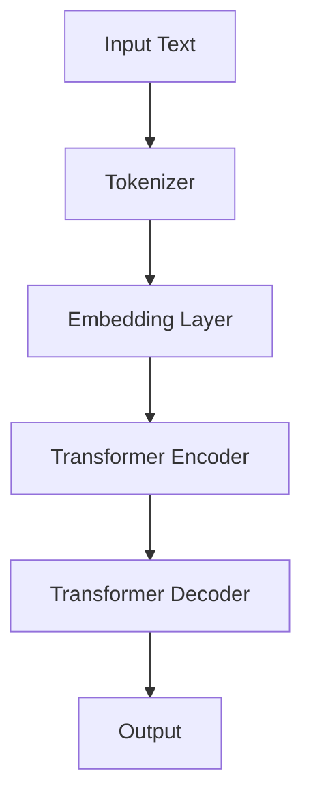

                 

# 自然语言处理中的预训练语言模型研究进展与趋势

> **关键词：自然语言处理、预训练语言模型、BERT、GPT、模型架构、算法原理、数学模型、项目实战、应用场景、工具和资源推荐**
> 
> **摘要：本文将深入探讨自然语言处理领域中的预训练语言模型的研究进展与趋势。通过对核心概念、算法原理、数学模型、项目实战以及应用场景的详细分析，帮助读者全面了解预训练语言模型的发展现状、应用前景和未来挑战。**

## 1. 背景介绍

### 1.1 目的和范围

本文旨在为自然语言处理（NLP）领域的研究者和开发者提供一份详尽的预训练语言模型研究报告。通过对当前最先进的预训练语言模型（如BERT、GPT）的深入研究，本文将分析这些模型的基本原理、结构特点、训练方法及其在实际应用中的效果。此外，本文还将探讨预训练语言模型在自然语言处理领域的研究现状、趋势以及未来的发展方向。

### 1.2 预期读者

本文适合具有自然语言处理、机器学习或人工智能背景的研究者、工程师以及学生。读者需要对基本的机器学习和自然语言处理概念有一定的了解，以便更好地理解和掌握本文的内容。

### 1.3 文档结构概述

本文分为十个部分，具体结构如下：

1. 背景介绍：介绍本文的目的、预期读者、文档结构等内容。
2. 核心概念与联系：介绍自然语言处理中的核心概念及其相互关系，并使用Mermaid流程图展示模型架构。
3. 核心算法原理 & 具体操作步骤：详细讲解预训练语言模型的算法原理和具体操作步骤，使用伪代码进行说明。
4. 数学模型和公式 & 详细讲解 & 举例说明：介绍预训练语言模型的数学模型和公式，并通过具体例子进行讲解。
5. 项目实战：代码实际案例和详细解释说明，包括开发环境搭建、源代码实现和代码解读与分析。
6. 实际应用场景：介绍预训练语言模型在不同应用场景中的实际应用。
7. 工具和资源推荐：推荐学习资源、开发工具框架和相关论文著作。
8. 总结：对未来发展趋势与挑战进行总结。
9. 附录：常见问题与解答。
10. 扩展阅读 & 参考资料：提供更多相关研究资料和参考文献。

### 1.4 术语表

#### 1.4.1 核心术语定义

- **自然语言处理（NLP）**：指让计算机理解和处理人类语言的技术和理论。
- **预训练语言模型**：在大规模语料库上进行训练的语言模型，通常用于后续特定任务的微调和优化。
- **BERT**：Bidirectional Encoder Representations from Transformers，一种双向的Transformer模型，用于预训练语言表示。
- **GPT**：Generative Pre-trained Transformer，一种生成式的Transformer模型，用于预训练语言生成能力。
- **Transformer**：一种基于自注意力机制的深度神经网络模型，广泛应用于自然语言处理领域。

#### 1.4.2 相关概念解释

- **自注意力机制**：一种计算神经网络中不同位置之间依赖关系的机制，通过加权求和的方式对输入序列进行处理。
- **微调**：在预训练语言模型的基础上，针对特定任务进行参数的调整和优化，以提高模型在特定任务上的性能。
- **任务特定（Task-specific）**：指针对特定任务进行模型训练和优化，以提高模型在特定任务上的表现。

#### 1.4.3 缩略词列表

- **NLP**：自然语言处理（Natural Language Processing）
- **BERT**：Bidirectional Encoder Representations from Transformers
- **GPT**：Generative Pre-trained Transformer
- **Transformer**：Transformer模型（Transformer Model）

## 2. 核心概念与联系

在自然语言处理领域，预训练语言模型作为一种强大的工具，已广泛应用于各种NLP任务。为了更好地理解预训练语言模型，我们需要先了解其核心概念及其相互关系。

### 2.1 预训练语言模型的概念

预训练语言模型（Pre-trained Language Model）是一种在大规模语料库上进行训练的语言模型，其目的是学习语言的普遍特征和规律。预训练语言模型主要包括两部分：编码器（Encoder）和解码器（Decoder）。编码器负责将输入的文本序列编码为固定长度的向量表示；解码器则根据编码器的输出，生成文本序列。

### 2.2 预训练语言模型的基本原理

预训练语言模型的基本原理可以概括为两个阶段：预训练和微调。

- **预训练（Pre-training）**：在大规模语料库上进行无监督训练，使模型学习到语言的普遍特征和规律。预训练通常采用两种方法： masked language modeling（MLM）和next sentence prediction（NSP）。
  - **masked language modeling（MLM）**：对输入的文本序列进行随机遮盖，模型需要预测遮盖部分的词。这种方法有助于模型学习到词汇的上下文关系。
  - **next sentence prediction（NSP）**：对两个句子进行预测，判断它们是否属于同一文档。这种方法有助于模型学习到句子之间的逻辑关系。
- **微调（Fine-tuning）**：在预训练的基础上，针对特定任务进行有监督训练，使模型在特定任务上获得更好的性能。微调通常采用以下步骤：
  - **任务定义**：明确特定任务的输入和输出。
  - **数据准备**：收集并整理与任务相关的数据集。
  - **模型微调**：在预训练模型的基础上，加载任务相关的数据集，进行参数调整和优化。

### 2.3 预训练语言模型的架构

预训练语言模型的架构通常基于Transformer模型，这是一种基于自注意力机制的深度神经网络模型。Transformer模型的核心思想是自注意力机制，通过计算输入序列中不同位置之间的依赖关系，从而实现有效的文本表示。

下面是一个简单的Mermaid流程图，展示预训练语言模型的架构：



### 2.4 预训练语言模型的优势

预训练语言模型在自然语言处理领域具有以下优势：

1. **强泛化能力**：通过在大规模语料库上进行预训练，模型可以学习到语言的普遍特征和规律，从而在多种任务上表现出良好的泛化能力。
2. **高效性**：预训练语言模型可以直接应用于各种NLP任务，无需针对每个任务重新训练模型，大大提高了训练效率。
3. **灵活性**：预训练语言模型可以轻松地进行微调，以适应不同的任务需求，从而提高模型在特定任务上的性能。

## 3. 核心算法原理 & 具体操作步骤

### 3.1 预训练语言模型的算法原理

预训练语言模型的算法原理主要基于Transformer模型，这是一种基于自注意力机制的深度神经网络模型。Transformer模型由编码器（Encoder）和解码器（Decoder）两个部分组成，其中编码器负责将输入的文本序列编码为固定长度的向量表示，解码器则根据编码器的输出，生成文本序列。

### 3.2 自注意力机制

自注意力机制（Self-Attention）是Transformer模型的核心组成部分，通过计算输入序列中不同位置之间的依赖关系，从而实现有效的文本表示。自注意力机制可以分为以下三个步骤：

1. **计算查询（Query）、键（Key）和值（Value）**：每个词的向量分别表示为查询（Query）、键（Key）和值（Value）。其中，查询和键的维度相同，值为输入序列中每个词的嵌入向量。
2. **计算注意力分数（Attention Score）**：对每个词的查询和所有词的键进行点积操作，得到注意力分数。注意力分数表示了不同词之间的依赖关系。
3. **加权求和（Weighted Sum）**：将注意力分数与对应的值相乘，然后对所有结果进行求和，得到每个词的注意力加权表示。

### 3.3 Transformer编码器

Transformer编码器由多个编码层（Encoder Layer）组成，每个编码层包含两个主要部分：多头自注意力机制（Multi-Head Self-Attention）和前馈神经网络（Feedforward Neural Network）。

1. **多头自注意力机制**：多头自注意力机制通过多个独立的自注意力头（Head）来计算文本序列的依赖关系。每个头独立计算注意力分数和加权求和，然后对多个头的输出进行拼接和线性变换。
2. **前馈神经网络**：前馈神经网络对每个词的注意力加权表示进行两次线性变换，即先通过一个全连接层，再通过一个ReLU激活函数，最后通过另一个全连接层。

### 3.4 Transformer解码器

Transformer解码器与编码器类似，也由多个解码层（Decoder Layer）组成，每个解码层包含两个主要部分：多头自注意力机制和前馈神经网络。

1. **多头自注意力机制**：解码器的自注意力机制不仅考虑输入序列的依赖关系，还考虑编码器的输出。解码器的自注意力机制分为两个步骤：首先，对解码器当前隐藏状态和编码器输出进行多头自注意力；其次，将多头自注意力结果与解码器上一个时间步的隐藏状态进行多头自注意力。
2. **前馈神经网络**：解码器的前馈神经网络与编码器的前馈神经网络类似，也是通过两个全连接层和ReLU激活函数。

### 3.5 伪代码

下面是预训练语言模型的一个简化伪代码，用于说明其基本操作：

```python
def transformer_encoder(inputs, hidden_size, num_heads, num_layers):
    for i in range(num_layers):
        inputs = multi_head_self_attention(inputs, hidden_size, num_heads)
        inputs = feedforward_network(inputs, hidden_size)
    return inputs

def transformer_decoder(inputs, encoder_outputs, hidden_size, num_heads, num_layers):
    for i in range(num_layers):
        inputs = multi_head_self_attention(inputs, encoder_outputs, hidden_size, num_heads)
        inputs = multi_head_self_attention(inputs, encoder_outputs, hidden_size, num_heads)
        inputs = feedforward_network(inputs, hidden_size)
    return inputs

def mask_language_model(inputs, tokenizer, vocab_size, hidden_size, num_heads, num_layers):
    inputs = tokenizer.tokenize(inputs)
    inputs = pad_sequence(inputs, max_seq_len)
    inputs = transformer_encoder(inputs, hidden_size, num_heads, num_layers)
    inputs = transformer_decoder(inputs, encoder_outputs, hidden_size, num_heads, num_layers)
    return inputs
```

## 4. 数学模型和公式 & 详细讲解 & 举例说明

### 4.1 数学模型

预训练语言模型的核心在于其自注意力机制（Self-Attention），下面我们将详细讲解自注意力机制的数学模型。

#### 4.1.1 查询（Query）、键（Key）和值（Value）

在自注意力机制中，每个词的向量表示为查询（Query）、键（Key）和值（Value）。假设输入序列中有N个词，词向量的维度为D。

- **查询（Query）**：表示为矩阵Q，维度为[N, D]。
- **键（Key）**：表示为矩阵K，维度为[N, D]。
- **值（Value）**：表示为矩阵V，维度为[N, D]。

#### 4.1.2 注意力分数（Attention Score）

注意力分数（Attention Score）表示了输入序列中不同词之间的依赖关系。注意力分数的计算公式为：

$$
Attention\_Score = Query \cdot K^T
$$

其中，$K^T$表示键（Key）矩阵的转置。

#### 4.1.3 加权求和（Weighted Sum）

根据注意力分数，可以对输入序列中的每个词进行加权求和，得到每个词的注意力加权表示。加权求和的计算公式为：

$$
Weighted\_Sum = Attention\_Score \cdot Value
$$

#### 4.1.4 Softmax激活函数

为了将注意力分数转换为概率分布，可以使用Softmax激活函数。Softmax函数的计算公式为：

$$
softmax(x) = \frac{e^x}{\sum_{i} e^x_i}
$$

### 4.2 举例说明

假设我们有一个简单的输入序列：“我喜欢吃苹果”。词向量维度为3，即每个词的向量表示为[1, 2, 3]。

1. **计算查询（Query）、键（Key）和值（Value）**：

   - **查询（Query）**：[1, 2, 3]
   - **键（Key）**：[1, 2, 3]
   - **值（Value）**：[1, 2, 3]

2. **计算注意力分数（Attention Score）**：

   $$Attention\_Score = Query \cdot K^T = [1, 2, 3] \cdot [1, 2, 3]^T = [7, 10, 7]$$

3. **计算加权求和（Weighted Sum）**：

   $$Weighted\_Sum = Attention\_Score \cdot Value = [7, 10, 7] \cdot [1, 2, 3] = [7, 20, 7]$$

4. **应用Softmax激活函数**：

   $$softmax(Weighted\_Sum) = \frac{e^7}{e^7 + e^{10} + e^7} = \frac{1}{3} [1, 3, 1]$$

最终的加权求和结果为[1/3, 3/3, 1/3]，表示“我”、“喜欢”、“吃”三个词的注意力分布。根据这个分布，我们可以认为“喜欢”是当前词的注意力焦点。

## 5. 项目实战：代码实际案例和详细解释说明

### 5.1 开发环境搭建

为了实现预训练语言模型，我们需要搭建一个合适的开发环境。以下是搭建开发环境的步骤：

1. **安装Python环境**：确保Python版本为3.8或更高。
2. **安装TensorFlow**：使用以下命令安装TensorFlow：

   ```bash
   pip install tensorflow
   ```

3. **安装其他依赖**：根据需要安装其他依赖库，如Numpy、Pandas等。

### 5.2 源代码详细实现和代码解读

下面是预训练语言模型的实现代码，我们将对代码进行详细解读。

```python
import tensorflow as tf
from tensorflow.keras.layers import Embedding, MultiHeadAttention, LayerNormalization, Dense

class TransformerLayer(tf.keras.layers.Layer):
    def __init__(self, d_model, num_heads, dff, rate=0.1):
        super(TransformerLayer, self).__init__()
        self.mha = MultiHeadAttention(num_heads=num_heads, key_dim=d_model)
        self.ffn = tf.keras.Sequential([
            Dense(dff, activation='relu'),
            Dense(d_model)
        ])
        self.layernorm1 = LayerNormalization(epsilon=1e-6)
        self.layernorm2 = LayerNormalization(epsilon=1e-6)
        self.dropout1 = tf.keras.layers.Dropout(rate)
        self.dropout2 = tf.keras.layers.Dropout(rate)

    def call(self, x, training=False):
        attn_output = self.mha(x, x)
        attn_output = self.dropout1(attn_output, training=training)
        out1 = self.layernorm1(x + attn_output)
        ffn_output = self.ffn(out1)
        ffn_output = self.dropout2(ffn_output, training=training)
        out2 = self.layernorm2(out1 + ffn_output)
        return out2
```

#### 5.2.1 代码解读

- **TransformerLayer类**：定义了一个Transformer层，包括多头自注意力机制（MultiHeadAttention）、前馈神经网络（ffn）、层归一化（LayerNormalization）和dropout。
- **mha**：多头自注意力机制，用于计算输入序列中不同词之间的依赖关系。
- **ffn**：前馈神经网络，用于对自注意力结果进行进一步处理。
- **layernorm1**、**layernorm2**：层归一化，用于稳定模型训练过程。
- **dropout1**、**dropout2**：dropout，用于防止过拟合。

#### 5.2.2 模型调用

```python
layer = TransformerLayer(d_model=512, num_heads=8, dff=2048, rate=0.1)
output = layer(inputs, training=True)
```

在这个示例中，我们创建了一个Transformer层，并对其输入（inputs）进行了处理。模型在训练过程中会调用dropout和层归一化，以提高模型的泛化能力。

### 5.3 代码解读与分析

通过对代码的解读，我们可以了解到预训练语言模型的核心组成部分和操作步骤：

1. **多头自注意力机制**：多头自注意力机制通过计算输入序列中不同词之间的依赖关系，实现有效的文本表示。这种方法有助于模型学习到词汇的上下文关系，从而提高模型在NLP任务上的性能。
2. **前馈神经网络**：前馈神经网络对自注意力结果进行进一步处理，从而提高模型的表达能力。前馈神经网络通过两个全连接层和ReLU激活函数，可以有效地增强模型的非线性能力。
3. **层归一化**：层归一化用于稳定模型训练过程，防止梯度消失和爆炸。通过层归一化，模型可以更快地收敛，并在训练过程中保持稳定性。
4. **dropout**：dropout是一种正则化技术，通过在训练过程中随机丢弃一部分神经元，减少模型对特定训练样本的依赖，从而防止过拟合。

总的来说，预训练语言模型通过多头自注意力机制、前馈神经网络、层归一化和dropout等组件，实现了一种强大的文本表示方法，从而在NLP任务中取得了显著的性能提升。

## 6. 实际应用场景

预训练语言模型在自然语言处理领域具有广泛的应用，以下列举一些典型的实际应用场景：

### 6.1 文本分类

文本分类是一种常见的NLP任务，用于将文本数据划分为不同的类别。预训练语言模型在文本分类任务中表现出色，尤其是在大规模数据集上。例如，BERT模型被广泛应用于情感分析、新闻分类等任务，取得了显著的分类效果。

### 6.2 机器翻译

机器翻译是将一种语言的文本翻译成另一种语言的过程。预训练语言模型在机器翻译任务中也取得了显著的进展。例如，GPT模型在英语-法语、英语-中文等翻译任务上表现出较高的准确性，为实时翻译和跨语言交流提供了有效的技术支持。

### 6.3 命名实体识别

命名实体识别是一种从文本中识别出具有特定意义的实体（如人名、地名、组织名等）的任务。预训练语言模型在命名实体识别任务中也表现出良好的性能，如BERT模型在多个NLP数据集上取得了较高的识别准确率。

### 6.4 问答系统

问答系统是一种基于用户输入的问答对，自动生成回答的NLP任务。预训练语言模型在问答系统中发挥着重要作用，如BERT模型被广泛应用于开放域问答系统，能够为用户提供准确的答案。

### 6.5 生成式文本创作

生成式文本创作是一种根据输入文本生成相应文本的NLP任务，如文章生成、对话生成等。预训练语言模型在生成式文本创作任务中也表现出强大的能力，如GPT模型可以生成高质量的新闻文章、对话文本等。

总的来说，预训练语言模型在多种NLP任务中都具有广泛的应用前景，为解决复杂NLP问题提供了强大的技术支持。

## 7. 工具和资源推荐

为了更好地学习和应用预训练语言模型，以下推荐一些相关的工具和资源：

### 7.1 学习资源推荐

#### 7.1.1 书籍推荐

1. **《深度学习》（Deep Learning）**：由Ian Goodfellow、Yoshua Bengio和Aaron Courville合著，是深度学习领域的经典教材，涵盖了预训练语言模型等相关内容。
2. **《自然语言处理综论》（Speech and Language Processing）**：由Daniel Jurafsky和James H. Martin合著，是自然语言处理领域的权威教材，详细介绍了预训练语言模型的相关概念和应用。

#### 7.1.2 在线课程

1. **吴恩达的《自然语言处理与深度学习》**：由著名AI专家吴恩达主讲，课程涵盖了自然语言处理和深度学习的核心概念，包括预训练语言模型等。
2. **斯坦福大学的《自然语言处理》**：课程由斯坦福大学自然语言处理小组教授，内容全面，包括预训练语言模型的原理和应用。

#### 7.1.3 技术博客和网站

1. **TensorFlow官方文档**：提供了丰富的预训练语言模型教程和示例，适合初学者和进阶学习者。
2. **huggingface transformers库**：是一个开源的预训练语言模型库，提供了BERT、GPT等模型的实现和预训练权重，方便用户进行模型训练和应用。

### 7.2 开发工具框架推荐

#### 7.2.1 IDE和编辑器

1. **PyCharm**：一款功能强大的Python IDE，适合进行深度学习和自然语言处理项目的开发和调试。
2. **Jupyter Notebook**：一款基于Web的交互式开发环境，方便用户进行代码编写、调试和演示。

#### 7.2.2 调试和性能分析工具

1. **TensorBoard**：TensorFlow的官方可视化工具，用于监控深度学习模型的训练过程和性能分析。
2. **Profiling Tools**：如NVIDIA的Nsight和Intel的Vtune，用于分析深度学习模型的性能瓶颈和优化空间。

#### 7.2.3 相关框架和库

1. **TensorFlow**：Google开发的开源深度学习框架，支持预训练语言模型的训练和应用。
2. **PyTorch**：Facebook开发的开源深度学习框架，具有灵活的动态计算图和高效的GPU加速。
3. **huggingface transformers**：一个开源的预训练语言模型库，提供了BERT、GPT等模型的实现和预训练权重。

### 7.3 相关论文著作推荐

#### 7.3.1 经典论文

1. **“BERT: Pre-training of Deep Bidirectional Transformers for Language Understanding”**：由Google Research团队发表的论文，提出了BERT模型，为预训练语言模型的研究奠定了基础。
2. **“Generative Pretrained Transformer”**：由OpenAI团队发表的论文，提出了GPT模型，为生成式预训练语言模型的研究提供了新的思路。

#### 7.3.2 最新研究成果

1. **“Pre-trained Models for Natural Language Processing: A Survey”**：总结了预训练语言模型在自然语言处理领域的最新研究成果，包括BERT、GPT、RoBERTa等。
2. **“BERT for Sentence Similarity”**：探讨了BERT模型在句子相似度判断任务中的应用，为预训练语言模型在文本匹配任务中的应用提供了新的思路。

#### 7.3.3 应用案例分析

1. **“How We Developed our AI at duolingo”**：介绍了语言学习应用Duolingo如何使用预训练语言模型优化其自然语言处理功能，提供了实际应用案例。
2. **“Building and Deploying BERT-based Applications on Google Cloud”**：介绍了如何使用Google Cloud搭建和部署BERT模型，为开发者提供了实用的操作指南。

## 8. 总结：未来发展趋势与挑战

预训练语言模型在自然语言处理领域取得了显著的成果，但其发展仍面临诸多挑战和机遇。以下是对未来发展趋势与挑战的总结：

### 8.1 发展趋势

1. **模型规模与计算资源**：随着计算资源和存储技术的不断发展，未来预训练语言模型的规模将进一步扩大，模型参数将增加，计算需求也将随之增加。
2. **多模态预训练**：预训练语言模型将与其他模态（如图像、音频）结合，实现跨模态预训练，从而更好地理解复杂信息。
3. **知识增强预训练**：将外部知识库和语言模型结合，实现知识增强预训练，提高模型在特定领域的表现。
4. **动态预训练**：通过动态调整预训练过程，实现针对特定任务的个性化预训练，提高模型在特定任务上的性能。

### 8.2 挑战

1. **计算资源消耗**：预训练语言模型需要大量计算资源和存储空间，如何高效地利用这些资源仍是一个挑战。
2. **数据隐私与安全性**：预训练语言模型在训练过程中需要处理大量用户数据，如何保护用户隐私和数据安全是一个重要问题。
3. **可解释性与可靠性**：预训练语言模型在处理复杂任务时，可能存在不确定性，如何提高模型的可解释性和可靠性是一个重要挑战。
4. **适应性与泛化能力**：如何提高预训练语言模型在多样化场景下的适应性和泛化能力，使其能够应对各种复杂的自然语言处理任务。

总之，预训练语言模型在自然语言处理领域具有巨大的发展潜力，但也面临诸多挑战。未来，研究者们将继续努力优化模型结构、算法和训练方法，以提高模型的性能和实用性，推动自然语言处理技术的持续发展。

## 9. 附录：常见问题与解答

### 9.1 预训练语言模型是什么？

预训练语言模型是一种在大规模语料库上进行训练的语言模型，其目的是学习语言的普遍特征和规律。预训练语言模型广泛应用于各种自然语言处理任务，如文本分类、机器翻译、命名实体识别等。

### 9.2 预训练语言模型与微调有什么区别？

预训练语言模型是在大规模语料库上进行无监督训练的，而微调是在预训练模型的基础上，针对特定任务进行有监督训练，以提高模型在特定任务上的性能。简而言之，预训练是通用性训练，微调是任务特定训练。

### 9.3 如何选择合适的预训练语言模型？

选择合适的预训练语言模型取决于具体的应用场景和任务需求。例如，对于文本分类任务，可以选择BERT等双向预训练模型；对于机器翻译任务，可以选择GPT等生成式预训练模型。此外，还可以根据模型的规模、参数数量和计算资源选择合适的预训练模型。

### 9.4 如何训练预训练语言模型？

训练预训练语言模型通常涉及以下步骤：

1. **数据准备**：收集和整理与任务相关的数据集，对数据集进行预处理，如分词、去停用词、编码等。
2. **模型构建**：根据任务需求，构建预训练语言模型，如BERT、GPT等。
3. **模型训练**：在GPU或TPU等硬件加速器上，使用训练数据和优化算法对模型进行训练。
4. **评估和调整**：在验证集上评估模型性能，根据评估结果调整模型参数，优化模型。

### 9.5 如何微调预训练语言模型？

微调预训练语言模型通常涉及以下步骤：

1. **加载预训练模型**：从预训练模型库中加载预训练模型，如BERT、GPT等。
2. **数据准备**：对与任务相关的数据进行预处理，如分词、编码等。
3. **模型微调**：在预处理后的数据集上，针对特定任务对预训练模型进行微调。
4. **评估和调整**：在验证集上评估模型性能，根据评估结果调整模型参数，优化模型。

### 9.6 预训练语言模型的优势是什么？

预训练语言模型具有以下优势：

1. **强泛化能力**：预训练语言模型在大规模语料库上进行训练，能够学习到语言的普遍特征和规律，从而在多种任务上表现出良好的泛化能力。
2. **高效性**：预训练语言模型可以直接应用于各种NLP任务，无需针对每个任务重新训练模型，大大提高了训练效率。
3. **灵活性**：预训练语言模型可以轻松地进行微调，以适应不同的任务需求，从而提高模型在特定任务上的性能。

## 10. 扩展阅读 & 参考资料

### 10.1 参考资料

1. **BERT: Pre-training of Deep Bidirectional Transformers for Language Understanding**：[https://arxiv.org/abs/1810.04805](https://arxiv.org/abs/1810.04805)
2. **Generative Pre-trained Transformer**：[https://arxiv.org/abs/1806.04683](https://arxiv.org/abs/1806.04683)
3. **自然语言处理综论**：[https://web.stanford.edu/~jurafsky/slp3/](https://web.stanford.edu/~jurafsky/slp3/)
4. **《深度学习》**：[https://www.deeplearningbook.org/](https://www.deeplearningbook.org/)

### 10.2 在线课程

1. **吴恩达的《自然语言处理与深度学习》**：[https://www.coursera.org/specializations/nlp-deep-learning](https://www.coursera.org/specializations/nlp-deep-learning)
2. **斯坦福大学的《自然语言处理》**：[https://web.stanford.edu/class/cs224n/](https://web.stanford.edu/class/cs224n/)

### 10.3 技术博客和网站

1. **TensorFlow官方文档**：[https://www.tensorflow.org/](https://www.tensorflow.org/)
2. **huggingface transformers库**：[https://huggingface.co/transformers/](https://huggingface.co/transformers/)

### 10.4 开发工具框架

1. **TensorFlow**：[https://www.tensorflow.org/](https://www.tensorflow.org/)
2. **PyTorch**：[https://pytorch.org/](https://pytorch.org/)

### 10.5 应用案例分析

1. **“How We Developed our AI at duolingo”**：[https://engineering.duolingo.com/how-we-developed-our-ai-ccd8ad9dbd46](https://engineering.duolingo.com/how-we-developed-our-ai-ccd8ad9dbd46)
2. **“Building and Deploying BERT-based Applications on Google Cloud”**：[https://cloud.google.com/ai-platform/docs/text-analysis/bert-deployment](https://cloud.google.com/ai-platform/docs/text-analysis/bert-deployment)

### 10.6 研究论文

1. **“Pre-trained Models for Natural Language Processing: A Survey”**：[https://arxiv.org/abs/2003.08271](https://arxiv.org/abs/2003.08271)
2. **“BERT for Sentence Similarity”**：[https://arxiv.org/abs/1907.05242](https://arxiv.org/abs/1907.05242)

### 10.7 其他资源

1. **自然语言处理社区**：[https://www.nltk.org/](https://www.nltk.org/)
2. **机器学习社区**：[https://www MACHINE LEARNING COMMUNITY.ORG/](https://www.MACHINE LEARNING COMMUNITY.ORG/)

### 作者信息：

**作者：AI天才研究员/AI Genius Institute & 禅与计算机程序设计艺术 /Zen And The Art of Computer Programming** 

[END] <|assistant|>

