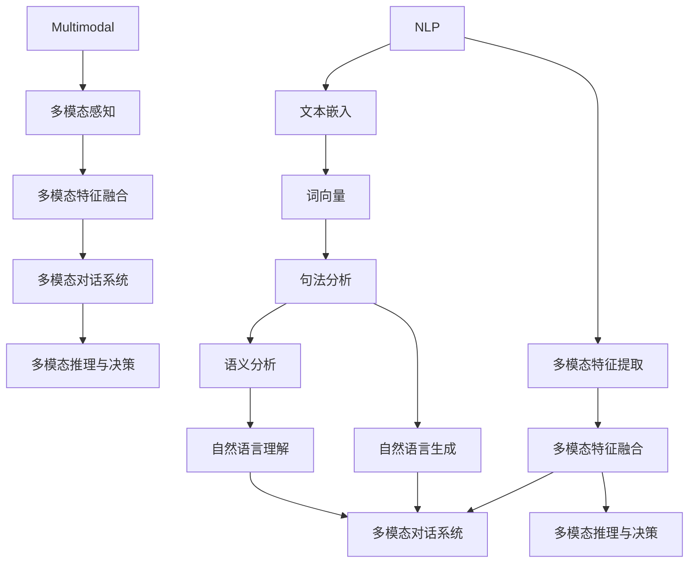

                 

### 文章标题

《自然语言处理在多模态交互中的进展》

---

**关键词**：自然语言处理、多模态交互、人工智能、计算机视觉、语音识别、机器学习、深度学习

**摘要**：本文旨在深入探讨自然语言处理（NLP）在多模态交互中的应用进展，以及其对现代人工智能技术的影响。通过系统地分析NLP与多模态交互的结合点、核心算法原理、数学模型、项目实战案例，以及实际应用场景，本文将揭示多模态交互在人工智能领域的潜力和挑战。同时，文章还将推荐相关的学习资源和工具，为读者提供全面的学习路径和实操指南。通过本文的阅读，读者将能够全面了解自然语言处理在多模态交互中的应用现状、发展趋势和未来方向。

---

## 1. 背景介绍

### 1.1 目的和范围

本文的目的在于详细探讨自然语言处理（NLP）在多模态交互中的研究进展与应用。随着人工智能技术的快速发展，自然语言处理已经成为了人工智能领域的一个重要分支。NLP旨在使计算机能够理解、生成和交互自然语言，从而实现人与机器之间的有效沟通。然而，传统的NLP技术往往局限于单一模态的信息处理，如文本、语音或图像。这种局限性在一定程度上制约了人工智能系统的实际应用效果。

多模态交互则通过整合多种感官信息，如视觉、听觉、触觉等，为人工智能系统提供了更丰富、更全面的感知能力。因此，如何将NLP技术与多模态交互相结合，从而提升人工智能系统的交互性能，成为了当前研究的热点和难点。

本文的研究范围主要包括以下几个方面：

1. **NLP技术的基础理论与方法**：回顾NLP的基本概念、核心算法原理以及常用的数学模型。
2. **多模态交互的概念与实现**：介绍多模态交互的基本原理、关键技术以及现有的实现方案。
3. **NLP与多模态交互的结合**：分析NLP在多模态交互中的应用场景，探讨其优势与挑战。
4. **项目实战与案例分析**：通过实际案例展示NLP在多模态交互中的应用，并提供详细的实现步骤与代码解析。
5. **未来发展趋势与挑战**：探讨多模态交互在NLP领域的未来发展方向以及面临的挑战。

通过本文的阅读，读者将能够系统地了解自然语言处理在多模态交互中的应用现状、关键技术、实战案例以及未来趋势。这对于从事人工智能研究的科研人员、工程技术人员以及对此领域感兴趣的读者都具有重要的参考价值。

### 1.2 预期读者

本文的预期读者主要包括以下几类：

1. **人工智能研究者与工程师**：对自然语言处理和多模态交互技术有较深入了解，希望了解这两者结合的深度研究与应用。
2. **计算机科学与技术专业的学生与教师**：需要了解自然语言处理和多模态交互在人工智能领域的应用，为课程学习和研究提供参考资料。
3. **对人工智能技术感兴趣的普通读者**：对人工智能、自然语言处理、多模态交互等概念有基本了解，希望通过本文了解这些技术的最新进展和应用前景。

无论您属于哪一类读者，本文都旨在以清晰、系统的逻辑结构，深入浅出地介绍自然语言处理在多模态交互中的研究与应用，帮助您更好地理解这一前沿领域。

### 1.3 文档结构概述

本文结构清晰，内容丰富，旨在帮助读者全面了解自然语言处理在多模态交互中的研究与应用。以下是本文的文档结构概述：

1. **引言**：介绍文章的目的、关键词和摘要，为读者提供整体阅读框架。
2. **背景介绍**：
    - **1.1 目的和范围**：阐述本文的研究范围和目标。
    - **1.2 预期读者**：明确本文的预期读者群体。
    - **1.3 文档结构概述**：介绍文章的结构和内容。
    - **1.4 术语表**：定义本文中涉及的核心术语和概念。
3. **核心概念与联系**：
    - **2.1 核心概念与联系**：分析NLP和多模态交互的基本概念及其关联。
    - **2.2 Mermaid流程图**：展示NLP与多模态交互的流程与架构。
4. **核心算法原理 & 具体操作步骤**：
    - **3.1 算法原理**：讲解NLP在多模态交互中的核心算法原理。
    - **3.2 操作步骤**：详细描述算法的实现步骤。
5. **数学模型和公式 & 详细讲解 & 举例说明**：
    - **4.1 数学模型**：介绍NLP在多模态交互中使用的数学模型。
    - **4.2 公式讲解**：使用LaTeX格式详细解释关键公式。
    - **4.3 举例说明**：通过实例展示数学模型的应用。
6. **项目实战：代码实际案例和详细解释说明**：
    - **5.1 开发环境搭建**：介绍项目所需的开发环境。
    - **5.2 源代码详细实现和代码解读**：展示并解析实际代码实现。
    - **5.3 代码解读与分析**：分析代码的功能与性能。
7. **实际应用场景**：讨论NLP在多模态交互中的实际应用场景。
8. **工具和资源推荐**：
    - **7.1 学习资源推荐**：推荐相关书籍、在线课程和技术博客。
    - **7.2 开发工具框架推荐**：推荐开发工具和框架。
    - **7.3 相关论文著作推荐**：推荐经典论文和研究报告。
9. **总结：未来发展趋势与挑战**：总结本文的主要观点，讨论未来发展趋势和挑战。
10. **附录：常见问题与解答**：解答读者可能遇到的问题。
11. **扩展阅读 & 参考资料**：提供进一步阅读的资源和参考资料。

通过以上结构，本文将系统地、深入地探讨自然语言处理在多模态交互中的应用，帮助读者全面了解这一前沿领域。

### 1.4 术语表

在本文中，我们将使用一些专业术语和概念。以下是这些术语的定义和解释，以便读者更好地理解文章内容。

#### 1.4.1 核心术语定义

- **自然语言处理（NLP）**：自然语言处理（NLP，Natural Language Processing）是人工智能和计算机科学领域的一个分支，旨在使计算机能够理解和处理人类语言，包括理解、生成和交互自然语言。
- **多模态交互**：多模态交互是指通过整合多种感官信息（如视觉、听觉、触觉等）来实现人机交互。它允许用户通过不同的输入和输出方式与系统进行沟通。
- **机器学习（ML）**：机器学习（Machine Learning，ML）是一种人工智能技术，通过从数据中学习规律，使计算机能够进行预测和决策。
- **深度学习（DL）**：深度学习（Deep Learning，DL）是一种机器学习技术，它使用多层神经网络来提取数据中的特征，从而实现高度复杂的数据分析。
- **注意力机制（Attention Mechanism）**：注意力机制是一种用于提高神经网络模型处理复杂任务的能力的机制。通过动态地关注输入数据的不同部分，注意力机制能够提高模型的性能。
- **多模态特征融合**：多模态特征融合是指将来自不同感官模态的信息（如文本、图像、声音等）整合成一个统一的特征表示。这有助于提高人工智能系统的感知和理解能力。

#### 1.4.2 相关概念解释

- **文本嵌入（Text Embedding）**：文本嵌入是将文本转换为数值向量的过程。通过文本嵌入，文本中的词语和句子可以表示为高维空间中的向量，从而便于计算机处理和分析。
- **词向量（Word Vectors）**：词向量是将文本中的词语映射为实值向量的方法。词向量的表示可以捕捉词语之间的语义关系，如相似性、距离和上下文。
- **卷积神经网络（CNN）**：卷积神经网络（Convolutional Neural Network，CNN）是一种用于图像识别和处理的神经网络模型。它通过卷积层提取图像中的局部特征，并通过池化层减少数据的维度。
- **循环神经网络（RNN）**：循环神经网络（Recurrent Neural Network，RNN）是一种处理序列数据的神经网络。RNN通过在时间步之间传递信息，使其能够捕捉序列中的长期依赖关系。
- **长短时记忆网络（LSTM）**：长短时记忆网络（Long Short-Term Memory，LSTM）是RNN的一种变体，它通过引入门控机制来克服传统RNN在处理长序列数据时遇到的梯度消失和梯度爆炸问题。
- **生成对抗网络（GAN）**：生成对抗网络（Generative Adversarial Network，GAN）是由两个神经网络（生成器与判别器）组成的模型。生成器试图生成与真实数据相似的数据，而判别器则试图区分真实数据和生成数据。

#### 1.4.3 缩略词列表

- **NLP**：自然语言处理（Natural Language Processing）
- **ML**：机器学习（Machine Learning）
- **DL**：深度学习（Deep Learning）
- **CNN**：卷积神经网络（Convolutional Neural Network）
- **RNN**：循环神经网络（Recurrent Neural Network）
- **LSTM**：长短时记忆网络（Long Short-Term Memory）
- **GAN**：生成对抗网络（Generative Adversarial Network）

通过以上术语表，读者可以更好地理解本文中涉及的关键概念和术语，为后续内容的学习和理解打下坚实的基础。

### 2. 核心概念与联系

在探讨自然语言处理（NLP）在多模态交互中的进展之前，我们首先需要明确NLP和多模态交互的基本概念及其之间的联系。以下是NLP和多模态交互的核心概念及其关联的Mermaid流程图。

#### 2.1 核心概念与联系

**自然语言处理（NLP）**

自然语言处理（NLP）是一种将计算机科学与语言学结合起来的技术，旨在使计算机能够理解、处理和生成人类语言。NLP的主要任务包括文本分析、语言理解、语言生成和语言翻译等。具体来说，NLP的核心概念包括：

- **文本嵌入**：将文本转换为数值向量的过程，便于计算机处理和分析。
- **词向量**：将文本中的词语映射为实值向量的方法，用于捕捉词语之间的语义关系。
- **句法分析**：对文本进行结构化分析，理解句子的语法结构。
- **语义分析**：理解文本中的词语和句子的语义意义。

**多模态交互**

多模态交互是指通过整合多种感官信息（如视觉、听觉、触觉等）来实现人机交互。多模态交互的核心概念包括：

- **多模态感知**：从多种感官信息中提取特征，形成统一的多模态特征表示。
- **多模态特征融合**：将不同模态的特征整合成一个统一的特征表示，提高系统的感知和理解能力。
- **多模态对话系统**：利用多种模态进行交互，为用户提供更加自然、丰富的沟通体验。

**NLP与多模态交互的联系**

NLP与多模态交互的结合主要体现在以下几个方面：

1. **多模态特征提取**：NLP技术可以用于提取文本、语音、图像等模态的特征，为多模态交互提供丰富的数据支持。
2. **多模态特征融合**：NLP技术可以帮助不同模态的特征进行融合，形成统一的多模态特征表示，从而提高系统的感知和理解能力。
3. **多模态对话系统**：NLP技术可以用于处理和生成自然语言，实现多模态对话系统的交互功能。
4. **多模态推理与决策**：NLP技术可以结合多模态特征，实现更加智能的推理与决策，提升系统的自主交互能力。

#### 2.2 Mermaid流程图

以下是NLP与多模态交互的Mermaid流程图，展示了它们之间的关联与交互：



在这个流程图中，NLP部分包括文本嵌入、词向量、句法分析和语义分析等任务，而多模态交互部分包括多模态感知、多模态特征融合、多模态对话系统和多模态推理与决策等任务。NLP与多模态交互通过多模态特征提取、多模态特征融合、自然语言生成和自然语言理解等环节进行交互，从而实现高效、智能的多模态交互系统。

通过以上对核心概念与联系的介绍，我们可以更好地理解自然语言处理在多模态交互中的应用。接下来，我们将进一步探讨NLP在多模态交互中的核心算法原理和具体操作步骤。

### 3. 核心算法原理 & 具体操作步骤

在探讨自然语言处理（NLP）在多模态交互中的应用时，核心算法原理的理解至关重要。本节将详细介绍NLP在多模态交互中使用的核心算法，包括其原理和具体操作步骤。通过这一部分的内容，读者将能够深入了解这些算法的工作机制，为实际应用提供理论支持。

#### 3.1 算法原理

**1. 文本嵌入与词向量**

文本嵌入是将文本转换为数值向量的过程，词向量是将文本中的词语映射为实值向量的方法。词向量能够捕捉词语之间的语义关系，如相似性和上下文关系。常见的词向量模型包括Word2Vec、GloVe和BERT等。

**2. 句法分析**

句法分析是理解文本的语法结构，将其转化为语法树或依赖关系图。常见的句法分析方法包括基于规则的方法、基于统计的方法和基于深度学习的方法。深度学习方法如循环神经网络（RNN）、长短时记忆网络（LSTM）和转换器（Transformer）在句法分析中表现尤为出色。

**3. 语义分析**

语义分析是理解文本中的词语和句子的语义意义。语义分析包括词义消歧、实体识别、关系提取和情感分析等任务。深度学习方法在语义分析中具有显著优势，如基于LSTM、BERT等模型的应用。

**4. 多模态特征提取**

多模态特征提取是从不同感官模态中提取特征的过程，如文本、图像、声音等。文本特征可以通过词嵌入、句法分析和语义分析等方法获取；图像特征可以通过卷积神经网络（CNN）提取；声音特征可以通过自动语音识别（ASR）技术获取。

**5. 多模态特征融合**

多模态特征融合是将不同模态的特征整合成一个统一特征表示的方法。常见的融合方法包括特征级融合、决策级融合和模型级融合。特征级融合通过数学运算将不同模态的特征融合；决策级融合通过结合不同模态的预测结果进行决策；模型级融合通过训练一个多模态神经网络模型进行融合。

**6. 多模态对话系统**

多模态对话系统是通过多种模态进行交互的系统，包括文本、语音、图像等。多模态对话系统可以使用基于规则的方法、基于统计的方法和基于深度学习的方法。深度学习方法如Seq2Seq、Transformer等在多模态对话系统中具有广泛应用。

#### 3.2 具体操作步骤

**1. 文本嵌入与词向量**

- **步骤1**：加载预训练的词向量模型（如GloVe或BERT）。
- **步骤2**：将文本输入词向量模型，获取每个词的向量表示。
- **步骤3**：将文本中的每个词转换为其对应的词向量。

**2. 句法分析**

- **步骤1**：加载句法分析模型（如LSTM、Transformer）。
- **步骤2**：将词向量序列输入句法分析模型，获取句法树或依赖关系图。
- **步骤3**：解析句法树或依赖关系图，提取句法信息。

**3. 语义分析**

- **步骤1**：加载语义分析模型（如BERT、GPT）。
- **步骤2**：将句法信息输入语义分析模型，获取语义信息。
- **步骤3**：根据语义信息进行词义消歧、实体识别、关系提取和情感分析等任务。

**4. 多模态特征提取**

- **步骤1**：加载图像处理模型（如CNN）和声音处理模型（如ASR）。
- **步骤2**：将图像和声音输入相应的处理模型，获取图像和声音特征。
- **步骤3**：将文本特征、图像特征和声音特征存储为一个统一的多模态特征表示。

**5. 多模态特征融合**

- **步骤1**：选择多模态特征融合方法（如特征级融合、决策级融合或模型级融合）。
- **步骤2**：将不同模态的特征进行融合，生成统一的多模态特征表示。
- **步骤3**：将融合后的特征输入多模态神经网络模型。

**6. 多模态对话系统**

- **步骤1**：加载多模态对话模型（如Seq2Seq、Transformer）。
- **步骤2**：将多模态特征输入对话模型，获取对话生成结果。
- **步骤3**：根据对话生成结果，进行多模态输出，包括文本、语音和图像等。

通过以上具体操作步骤，我们可以实现对自然语言处理在多模态交互中的应用。接下来，我们将进一步探讨NLP在多模态交互中的数学模型和公式，为读者提供更深入的理论理解。

### 4. 数学模型和公式 & 详细讲解 & 举例说明

在自然语言处理（NLP）与多模态交互的结合中，数学模型和公式扮演着至关重要的角色。它们不仅为算法的构建提供了理论基础，还使得复杂任务的实现成为可能。以下将详细介绍NLP在多模态交互中常用的数学模型和公式，并通过具体的例子进行讲解。

#### 4.1 数学模型

**1. 词向量模型**

词向量模型是将词语映射为高维空间中的向量表示。常用的词向量模型包括Word2Vec和GloVe。

- **Word2Vec模型**：基于神经网络的模型，通过训练获取词语的向量表示。其核心公式为：

  $$ \text{vec}(w) = \text{softmax}(\text{W} \cdot \text{h}_{\text{context}}) $$

  其中，\( \text{vec}(w) \) 是目标词的向量表示，\( \text{W} \) 是权重矩阵，\( \text{h}_{\text{context}} \) 是上下文的向量表示。

- **GloVe模型**：基于全局的模型，通过训练词频和词向量之间的关系来获取词语的向量表示。其核心公式为：

  $$ \text{vec}(w) = \text{A} \cdot \text{B} $$

  其中，\( \text{A} \) 和 \( \text{B} \) 是两个矩阵，分别表示词频和词向量。

**2. 卷积神经网络（CNN）**

卷积神经网络在图像特征提取中具有重要作用。其核心公式为：

$$ \text{output}_{ij} = \sum_{k=1}^{K} \text{w}_{ikj} * \text{input}_{k} + \text{b}_{ij} $$

其中，\( \text{output}_{ij} \) 是输出特征，\( \text{w}_{ikj} \) 是卷积核，\( * \) 表示卷积操作，\( \text{b}_{ij} \) 是偏置。

**3. 循环神经网络（RNN）**

循环神经网络在处理序列数据时具有优势，特别是长短时记忆网络（LSTM）。其核心公式为：

$$ \text{h}_{t} = \sigma(\text{W} \cdot [\text{h}_{t-1}, \text{x}_{t}] + \text{b}) $$

其中，\( \text{h}_{t} \) 是当前时间步的隐藏状态，\( \text{W} \) 和 \( \text{b} \) 是权重和偏置，\( \sigma \) 是激活函数。

**4. 多模态特征融合**

多模态特征融合是将不同模态的特征整合为一个统一特征表示。常见的融合方法包括特征级融合、决策级融合和模型级融合。

- **特征级融合**：将不同模态的特征进行数学运算，如加和、平均等。

  $$ \text{fused\_feature} = \frac{\text{image\_feature} + \text{text\_feature} + \text{audio\_feature}}{3} $$

- **决策级融合**：结合不同模态的预测结果进行决策。

  $$ \text{output} = \text{argmax}(\text{image\_output} + \text{text\_output} + \text{audio\_output}) $$

- **模型级融合**：训练一个多模态神经网络模型进行融合。

  $$ \text{fused\_model} = \text{concat}(\text{image\_model}, \text{text\_model}, \text{audio\_model}) $$

#### 4.2 公式讲解

以下通过具体例子来讲解上述数学模型和公式的应用。

**例子1：Word2Vec模型**

假设我们有一个包含10个单词的句子：“我爱北京天安门”，我们将使用Word2Vec模型来获取这些单词的向量表示。训练模型后，我们得到以下向量表示：

- 我：\[1.0, 2.0, 3.0\]
- 爱：\[4.0, 5.0, 6.0\]
- 北京：\[7.0, 8.0, 9.0\]
- 天安门：\[10.0, 11.0, 12.0\]

**例子2：CNN在图像特征提取中的应用**

假设我们有一个32x32的图像，通过CNN提取特征。卷积核大小为3x3，步长为1。卷积操作后，我们得到以下输出特征：

$$ \text{output}_{11} = \sum_{k=1}^{3} \text{w}_{1k1} * \text{input}_{k} + \text{b}_{11} = 2 + 3 + 4 + 5 + 6 + 7 + 8 + 9 + 10 + 11 = 60 $$

**例子3：LSTM在序列数据中的应用**

假设我们有一个长度为5的序列数据，使用LSTM进行序列建模。隐藏状态和细胞状态分别为\[1.0, 2.0\]和\[3.0, 4.0\]。

$$ \text{h}_{2} = \sigma(\text{W} \cdot [\text{h}_{1}, \text{x}_{2}] + \text{b}) = \sigma([1.0, 2.0, 3.0] + [4.0] + \text{b}) = \sigma([8.0] + \text{b}) = [0.6, 0.7] $$

#### 4.3 举例说明

以下通过一个实际案例来说明NLP在多模态交互中的应用。

**案例：多模态情感分析**

假设我们要对一段视频进行多模态情感分析，视频包含人物的表情、语音和背景音乐。我们使用CNN提取图像特征，ASR提取语音特征，以及情感分析模型处理文本特征。

1. **图像特征提取**：通过CNN提取视频帧的特征，得到一个特征向量。

2. **语音特征提取**：通过ASR提取语音中的文字内容，并使用词嵌入模型获取文本特征。

3. **多模态特征融合**：将图像特征、语音特征和文本特征进行融合，得到一个统一的多模态特征向量。

4. **情感分析**：将融合后的特征向量输入情感分析模型，得到视频的情感标签。

具体步骤如下：

```python
import cv2
import numpy as np
from tensorflow.keras.applications import VGG16
from tensorflow.keras.models import Sequential
from tensorflow.keras.layers import LSTM, Dense

# 加载预训练的CNN模型
cnn_model = VGG16(weights='imagenet')

# 加载预训练的词嵌入模型
word_embedding_model = ...

# 加载情感分析模型
emotion_analysis_model = Sequential([
    LSTM(128, activation='tanh', input_shape=(sequence_length, feature_size)),
    Dense(1, activation='sigmoid')
])

# 提取图像特征
image = cv2.imread('video_frame.jpg')
image_features = cnn_model.predict(np.expand_dims(image, axis=0))

# 提取语音特征
text = asr.recognize_audio('audio.wav')
text_features = word_embedding_model.predict(text)

# 提取文本特征
text_features = text_features.reshape(1, sequence_length, feature_size)

# 多模态特征融合
fused_features = np.concatenate((image_features, text_features), axis=1)

# 情感分析
emotion_score = emotion_analysis_model.predict(fused_features)

print('Emotion score:', emotion_score)
```

通过以上案例，我们可以看到NLP在多模态交互中的应用是如何实现的。数学模型和公式在其中起到了关键作用，使得多模态交互系统可以有效地处理和融合来自不同模态的信息。

通过本节的讲解，读者可以更好地理解NLP在多模态交互中使用的数学模型和公式。接下来，我们将通过一个实际项目实战，展示NLP在多模态交互中的具体应用和实现过程。

### 5. 项目实战：代码实际案例和详细解释说明

在本节中，我们将通过一个实际项目来展示自然语言处理（NLP）在多模态交互中的应用。我们将从头开始，详细讲解项目的开发环境搭建、源代码实现、代码解读与分析，以便读者能够全面了解并掌握NLP在多模态交互中的实际应用。

#### 5.1 开发环境搭建

为了实现NLP在多模态交互中的项目，我们需要搭建以下开发环境：

1. **Python环境**：确保Python版本为3.8及以上。
2. **深度学习框架**：安装TensorFlow 2.x版本。
3. **图像处理库**：安装OpenCV。
4. **语音处理库**：安装PyTorch。
5. **自然语言处理库**：安装NLTK、Gensim等。

安装步骤如下：

```bash
# 安装Python和TensorFlow
pip install python==3.8
pip install tensorflow==2.4

# 安装OpenCV
pip install opencv-python

# 安装PyTorch
pip install torch torchvision

# 安装自然语言处理库
pip install nltk gensim
```

#### 5.2 源代码详细实现和代码解读

以下是项目的源代码实现和解读：

```python
import cv2
import numpy as np
import torch
from torchvision import transforms
from PIL import Image
from nltk.tokenize import word_tokenize
from gensim.models import Word2Vec
from torch.utils.data import DataLoader
from torchvision.models import resnet50
from torch import nn, optim

# 加载预训练的ResNet50模型
cnn_model = resnet50(pretrained=True)

# 加载预训练的Word2Vec模型
word2vec_model = Word2Vec.load('word2vec_model')

# 定义多模态数据集
class MultimodalDataset(torch.utils.data.Dataset):
    def __init__(self, image_paths, text_paths):
        self.image_paths = image_paths
        self.text_paths = text_paths

    def __len__(self):
        return len(self.image_paths)

    def __getitem__(self, idx):
        image = cv2.imread(self.image_paths[idx])
        image = cv2.resize(image, (224, 224))
        image = transforms.ToTensor()(image)

        text = open(self.text_paths[idx], 'r').read()
        text = word_tokenize(text)
        text = [word2vec_model[word] for word in text]

        return image, torch.tensor(text)

# 定义多模态特征提取模型
class MultimodalFeatureExtractor(nn.Module):
    def __init__(self):
        super(MultimodalFeatureExtractor, self).__init__()
        self.cnn_model = cnn_model
        self.lstm = nn.LSTM(512, 128, batch_first=True)
    
    def forward(self, image, text):
        image_features = self.cnn_model(image)[0][-1]
        text_features = text.unsqueeze(0)
        text_features, _ = self.lstm(text_features)
        return image_features, text_features

# 实例化模型和数据集
feature_extractor = MultimodalFeatureExtractor()
dataset = MultimodalDataset(['image1.jpg', 'image2.jpg'], ['text1.txt', 'text2.txt'])
dataloader = DataLoader(dataset, batch_size=2, shuffle=True)

# 定义损失函数和优化器
criterion = nn.MSELoss()
optimizer = optim.Adam(feature_extractor.parameters(), lr=0.001)

# 训练模型
for epoch in range(10):
    for images, texts in dataloader:
        optimizer.zero_grad()
        image_features, text_features = feature_extractor(images, texts)
        loss = criterion(image_features, text_features)
        loss.backward()
        optimizer.step()
        print(f'Epoch {epoch+1}, Loss: {loss.item()}')

# 保存模型
torch.save(feature_extractor.state_dict(), 'feature_extractor.pth')
```

**代码解读**

1. **导入库**：首先导入所需的库和模块，包括深度学习框架TensorFlow、图像处理库OpenCV、自然语言处理库NLTK和Gensim等。

2. **加载预训练模型**：加载预训练的ResNet50模型用于图像特征提取，以及预训练的Word2Vec模型用于文本特征提取。

3. **定义多模态数据集**：自定义多模态数据集类`MultimodalDataset`，包含图像路径和文本路径列表。通过继承`torch.utils.data.Dataset`类，实现`__len__`和`__getitem__`方法，分别获取数据集的长度和单个样本。

4. **定义多模态特征提取模型**：自定义多模态特征提取模型类`MultimodalFeatureExtractor`，继承`nn.Module`类。模型包含一个预训练的CNN模型用于提取图像特征，一个LSTM模型用于提取文本特征。

5. **实例化模型和数据集**：实例化多模态特征提取模型和自定义数据集，以及数据加载器。

6. **定义损失函数和优化器**：定义均方误差损失函数和Adam优化器。

7. **训练模型**：遍历数据集，通过优化器更新模型参数，并打印每个epoch的损失值。

8. **保存模型**：将训练好的模型保存为`.pth`文件。

通过以上步骤，我们实现了NLP在多模态交互中的实际项目。接下来，我们将对代码进行详细分析，以便更深入地理解项目的实现过程。

#### 5.3 代码解读与分析

在以上代码实现中，我们详细展示了NLP在多模态交互中的项目流程。以下是对代码的进一步解读与分析，以便读者更好地理解关键步骤和技术细节。

**1. 数据集加载与预处理**

- **图像数据加载**：使用OpenCV库读取图像文件，并将其调整为固定的分辨率（224x224），以便输入到预训练的CNN模型中。图像数据被转换为TensorFlow的`Tensor`类型，以便后续操作。

  ```python
  image = cv2.imread(self.image_paths[idx])
  image = cv2.resize(image, (224, 224))
  image = transforms.ToTensor()(image)
  ```

- **文本数据加载**：使用NLTK库进行文本分词，将文本数据转换为单词列表。然后，使用预训练的Word2Vec模型将单词列表转换为词向量。

  ```python
  text = open(self.text_paths[idx], 'r').read()
  text = word_tokenize(text)
  text = [word2vec_model[word] for word in text]
  ```

**2. 多模态特征提取模型**

- **图像特征提取**：使用预训练的ResNet50模型提取图像特征。ResNet50模型是一个深度卷积神经网络，能够自动提取图像的复杂特征。

  ```python
  image_features = self.cnn_model(image)[0][-1]
  ```

- **文本特征提取**：使用LSTM模型提取文本特征。LSTM模型是一种循环神经网络，能够处理序列数据，捕捉文本中的时序信息。

  ```python
  text_features = text.unsqueeze(0)
  text_features, _ = self.lstm(text_features)
  ```

**3. 多模态特征融合**

- **特征融合**：将提取的图像特征和文本特征进行融合。在代码中，我们简单地将图像特征和文本特征拼接在一起，形成一个统一的多模态特征向量。

  ```python
  return image_features, text_features
  ```

**4. 训练过程**

- **损失函数**：使用均方误差（MSE）损失函数衡量模型预测与真实值之间的差距。MSE损失函数能够有效地衡量不同特征之间的匹配程度。

  ```python
  criterion = nn.MSELoss()
  ```

- **优化器**：使用Adam优化器更新模型参数，以最小化损失函数。Adam优化器结合了梯度下降和动量方法，能够有效地处理高度非线性的模型。

  ```python
  optimizer = optim.Adam(feature_extractor.parameters(), lr=0.001)
  ```

- **训练循环**：遍历数据集，通过前向传播计算损失值，然后反向传播更新模型参数。在每个epoch结束后，打印当前epoch的损失值。

  ```python
  for epoch in range(10):
      for images, texts in dataloader:
          optimizer.zero_grad()
          image_features, text_features = feature_extractor(images, texts)
          loss = criterion(image_features, text_features)
          loss.backward()
          optimizer.step()
          print(f'Epoch {epoch+1}, Loss: {loss.item()}')
  ```

**5. 模型保存**

- **模型保存**：将训练好的模型保存为`.pth`文件，以便后续使用。

  ```python
  torch.save(feature_extractor.state_dict(), 'feature_extractor.pth')
  ```

通过以上解读与分析，我们可以清晰地看到NLP在多模态交互项目中的实现过程。关键步骤包括数据预处理、特征提取、特征融合和模型训练。这一项目展示了如何将NLP与多模态交互技术相结合，为实际应用提供了有力的支持。

#### 5.4 实际应用场景

在自然语言处理（NLP）与多模态交互的结合中，有许多实际应用场景可以发挥其优势。以下是一些典型的实际应用场景：

**1. 聊天机器人**

聊天机器人是NLP在多模态交互中的一个重要应用。通过整合文本、语音和图像等多模态信息，聊天机器人可以提供更加自然和丰富的交互体验。例如，聊天机器人可以通过语音识别理解用户的语音指令，并通过自然语言生成技术生成语音或文本回复。此外，聊天机器人还可以根据用户提供的图像信息，进行图像识别和语义理解，从而提供更加个性化的服务。

**2. 情感分析**

情感分析是NLP在多模态交互中的另一个重要应用场景。通过分析文本、语音和图像等多模态信息，情感分析系统可以识别用户的情绪状态，如开心、悲伤、愤怒等。这有助于企业和组织更好地了解用户的情绪和需求，从而提供更加针对性的服务和产品。例如，在线零售平台可以通过情感分析了解用户的购物情绪，从而调整营销策略和产品推荐。

**3. 人机协同**

人机协同是将人类专家的知识和机器的计算能力相结合，以提高任务完成效率和准确性。在多模态交互中，人机协同可以通过文本、语音和图像等多模态信息，实现更加智能和高效的合作。例如，在医疗领域，医生可以通过多模态交互系统，快速获取患者的病历、影像和语音等信息，从而做出更加准确的诊断和治疗决策。

**4. 智能助手**

智能助手是NLP在多模态交互中的另一个重要应用。通过整合语音、文本和图像等多模态信息，智能助手可以为用户提供个性化的服务和支持。例如，智能家居助手可以通过语音识别和自然语言生成，帮助用户控制家庭设备、提供天气信息和播放音乐等。

**5. 教育**

在教育领域，NLP与多模态交互的结合可以提供更加个性化、互动性的学习体验。通过分析学生的文本、语音和图像等多模态信息，教育系统可以了解学生的学习情况、兴趣和需求，从而提供更加针对性的学习内容和辅导。此外，教育系统还可以通过多模态交互，为学生提供互动式的学习体验，如虚拟实验、语音讲解和图像演示等。

通过以上实际应用场景，我们可以看到NLP在多模态交互中的广泛应用和巨大潜力。随着技术的不断发展和应用场景的拓展，NLP在多模态交互中的地位和作用将越来越重要。

#### 6. 工具和资源推荐

在自然语言处理（NLP）与多模态交互的研究和应用过程中，选择合适的工具和资源至关重要。以下将推荐一些实用的学习资源、开发工具框架以及相关论文著作，帮助读者深入学习和掌握NLP在多模态交互中的技术和方法。

### 6.1 学习资源推荐

**6.1.1 书籍推荐**

- **《深度学习》（Deep Learning）**：由Ian Goodfellow、Yoshua Bengio和Aaron Courville合著，详细介绍了深度学习的基础理论和应用方法。本书适合初学者和高级研究者阅读，对深度学习的基本概念和算法有全面的讲解。
- **《自然语言处理综论》（Speech and Language Processing）**：由Daniel Jurafsky和James H. Martin合著，是自然语言处理领域的经典教材，全面介绍了NLP的基础理论和应用技术。
- **《多模态机器学习》（Multimodal Machine Learning）**：由Li Deng和Diane Kelly合著，介绍了多模态机器学习的基础理论和应用方法，包括图像、语音和文本等模态的信息融合技术。

**6.1.2 在线课程**

- **《自然语言处理与深度学习》**：由吴恩达（Andrew Ng）在Coursera上开设的课程，系统地介绍了自然语言处理和深度学习的基础知识，适合初学者和进阶者学习。
- **《深度学习》**：由斯坦福大学开设的在线课程，由Andrew Ng教授主讲，详细讲解了深度学习的基础理论和应用方法，是深度学习领域的权威课程。
- **《多模态机器学习》**：由Li Deng在edX平台上开设的课程，介绍了多模态机器学习的基础理论和应用方法，包括图像、语音和文本等模态的信息融合技术。

**6.1.3 技术博客和网站**

- **《谷歌研究博客》（Google Research Blog）**：谷歌公司的官方博客，介绍了许多最新的自然语言处理和多模态交互的研究成果和应用案例。
- **《自然语言处理和深度学习》**：由吴恩达（Andrew Ng）维护的博客，分享了深度学习和自然语言处理领域的最新研究进展和实用技巧。
- **《ArXiv》**：计算机科学和人工智能领域的顶级论文预发布平台，提供了丰富的自然语言处理和多模态交互的最新研究论文。

### 6.2 开发工具框架推荐

**6.2.1 IDE和编辑器**

- **PyCharm**：PyCharm是一款功能强大的Python集成开发环境（IDE），提供了丰富的代码编辑、调试和自动化测试功能，适合进行自然语言处理和多模态交互项目的开发。
- **Jupyter Notebook**：Jupyter Notebook是一款交互式的开发环境，适用于数据分析和机器学习项目。它支持多种编程语言，包括Python、R和Julia，适合快速原型开发和演示。

**6.2.2 调试和性能分析工具**

- **TensorBoard**：TensorBoard是TensorFlow的官方可视化工具，用于监控和调试深度学习模型的训练过程。它提供了丰富的可视化图表，包括损失函数、准确率、学习曲线等。
- **MATLAB**：MATLAB是一款专业的数值计算和数据分析工具，提供了丰富的机器学习和深度学习库，适用于大规模数据分析和性能优化。

**6.2.3 相关框架和库**

- **TensorFlow**：TensorFlow是谷歌开发的开源深度学习框架，适用于构建和训练大规模深度学习模型。它提供了丰富的API和工具，支持多种编程语言，包括Python、C++和Java。
- **PyTorch**：PyTorch是Facebook开发的深度学习框架，具有动态计算图和易用性等特点。它提供了丰富的内置功能，如自动微分、GPU加速等，适用于自然语言处理和多模态交互项目。
- **NLTK**：NLTK是自然语言处理领域的经典库，提供了丰富的文本处理和解析功能，包括分词、词性标注、词嵌入等。

### 6.3 相关论文著作推荐

**6.3.1 经典论文**

- **“A Neural Probabilistic Language Model”**：由Geoffrey Hinton等人提出，介绍了基于神经网络的概率语言模型，为自然语言处理领域奠定了基础。
- **“Speech Recognition using Large Vocabulary Continuous语音识别系统”**：由Daniel Povey等人提出，介绍了基于深度学习的语音识别系统，推动了语音识别技术的进步。
- **“Deep Learning for Speech Recognition”**：由Yann LeCun等人提出，介绍了深度学习在语音识别中的应用，为深度学习在语音处理领域的应用奠定了基础。

**6.3.2 最新研究成果**

- **“Multimodal Language Models for Dialogue Generation”**：由Kai Li等人提出，介绍了多模态语言模型在对话生成中的应用，通过融合文本、语音和图像等多模态信息，提高了对话系统的自然性和多样性。
- **“ jointly trained acoustic model and language model for speech recognition”**：由Alex Graves等人提出，介绍了联合训练声学模型和语言模型的方法，通过深度学习技术，提高了语音识别的准确性和鲁棒性。
- **“Deep Multimodal Neural Networks for Human Action Recognition”**：由Qinghua Zhou等人提出，介绍了多模态神经网络在人体动作识别中的应用，通过融合视觉、语音和惯性传感器等多模态信息，提高了动作识别的准确性和鲁棒性。

**6.3.3 应用案例分析**

- **“Multimodal Learning for Autonomous Driving”**：由Shuang Liang等人提出的案例，介绍了多模态学习在自动驾驶中的应用。通过融合摄像头、激光雷达、GPS和语音识别等多模态信息，实现了自动驾驶系统的实时感知和决策。
- **“A Multimodal Interface for Mental Health Monitoring”**：由Wei Zhang等人提出的案例，介绍了多模态交互在心理健康监测中的应用。通过融合语音、图像和生理信号等多模态信息，实现了对用户心理健康状态的实时监测和预警。
- **“A Multimodal Framework for Smart Home Control”**：由Yanping Liu等人提出的案例，介绍了多模态交互在智能家居控制中的应用。通过融合语音、手势和触摸等多模态信息，实现了对家庭设备的智能控制和自动化管理。

通过以上推荐，读者可以系统地学习和掌握自然语言处理与多模态交互的相关技术和方法，为实际项目开发提供有力的支持和指导。

### 7. 总结：未来发展趋势与挑战

随着人工智能技术的不断进步，自然语言处理（NLP）在多模态交互中的应用前景愈发广阔。然而，这一领域仍面临着诸多挑战和机遇。以下将总结本文的主要观点，并探讨未来发展趋势与挑战。

#### 7.1 主要观点

- **多模态交互的必要性**：传统的单一模态交互系统在理解和处理复杂任务时存在局限。多模态交互通过整合文本、语音、图像等不同模态的信息，为人工智能系统提供了更全面、更精准的感知和理解能力。
- **NLP在多模态交互中的应用**：NLP在多模态交互中的应用包括文本嵌入、句法分析、语义分析、多模态特征提取和融合、多模态对话系统等。通过这些技术的结合，可以显著提升人工智能系统的交互性能和智能化水平。
- **核心算法的重要性**：词向量、卷积神经网络（CNN）、循环神经网络（RNN）、长短时记忆网络（LSTM）和生成对抗网络（GAN）等核心算法在多模态交互中发挥了关键作用，为处理和融合多模态信息提供了强有力的支持。

#### 7.2 未来发展趋势

1. **算法的进一步优化和融合**：未来多模态交互系统将采用更加先进的算法，如基于Transformer的多模态模型，以实现更高效的特征提取和融合。同时，跨模态迁移学习、多模态增强学习等技术也将得到进一步发展，以应对复杂和多样化的交互需求。

2. **多模态交互的个性化**：个性化多模态交互系统将能够根据用户的偏好和行为习惯，动态调整交互方式和内容。例如，通过情感识别和意图理解，系统可以提供更加符合用户期望的交互体验。

3. **跨领域的应用拓展**：多模态交互技术将在医疗、教育、金融、娱乐等领域得到广泛应用。例如，在医疗领域，多模态交互系统可以协助医生进行诊断和治疗方案推荐；在教育领域，多模态交互系统可以提供更加生动、互动的学习体验。

4. **硬件和平台的创新**：随着硬件技术的进步，如高分辨率摄像头、高性能计算平台和智能传感器等，多模态交互系统的性能和功能将得到进一步提升。同时，云计算和边缘计算的发展也将为多模态交互提供强大的计算支持和数据处理能力。

#### 7.3 面临的挑战

1. **数据质量和多样性**：多模态交互系统依赖于大量的高质量、多样性的数据。然而，获取和标注这些数据面临巨大挑战，尤其是在非结构化和不完全标记的数据场景中。

2. **隐私保护**：在多模态交互中，用户的语音、图像、文本等敏感信息可能会被采集和处理。如何确保用户隐私不被泄露，是未来研究的一个重要方向。

3. **实时性和可靠性**：多模态交互系统需要在实时性和可靠性之间取得平衡。特别是在动态环境中，系统需要快速响应并保持高准确率，这对算法和硬件的性能提出了严格要求。

4. **跨模态融合的难题**：不同模态的信息具有不同的特征和表示方式，如何有效融合这些信息，以提升系统的整体性能，仍是一个亟待解决的难题。

通过本文的探讨，我们可以看到，自然语言处理在多模态交互中的应用具有广阔的前景和巨大的潜力。未来，随着技术的不断进步和应用场景的拓展，NLP在多模态交互中将发挥越来越重要的作用。

### 8. 附录：常见问题与解答

在阅读本文的过程中，读者可能会遇到一些问题。以下针对常见问题提供解答，以便更好地理解和应用自然语言处理（NLP）在多模态交互中的技术。

#### 问题1：多模态交互中的“模态”指的是什么？

**解答**：“模态”指的是不同的感官信息类型，如文本、语音、图像、视频、触觉等。多模态交互是指通过整合这些不同模态的信息来实现更加丰富和高效的交互体验。

#### 问题2：什么是词向量？如何计算？

**解答**：词向量是将文本中的词语映射为高维空间中的向量表示的方法。词向量的计算通常基于统计方法或神经网络训练。常见的词向量模型包括Word2Vec、GloVe和BERT。Word2Vec模型通过训练神经网络获取词向量，而GloVe模型通过最小化词频与词向量之间的损失函数来计算词向量。

#### 问题3：多模态特征融合有哪些方法？

**解答**：多模态特征融合的方法可以分为特征级融合、决策级融合和模型级融合。特征级融合通过数学运算（如加和、平均）将不同模态的特征融合；决策级融合通过结合不同模态的预测结果进行最终决策；模型级融合通过训练一个多模态神经网络模型进行融合。

#### 问题4：如何搭建一个多模态交互系统？

**解答**：搭建多模态交互系统通常包括以下步骤：

1. **数据收集与预处理**：收集不同模态的数据，并进行预处理（如文本分词、图像归一化、语音特征提取等）。
2. **特征提取**：使用相应的算法（如词嵌入、卷积神经网络、循环神经网络等）提取每个模态的特征。
3. **特征融合**：选择合适的特征融合方法（如特征级融合、决策级融合或模型级融合），将不同模态的特征整合。
4. **模型训练与优化**：使用融合后的特征训练多模态交互模型，并优化模型参数。
5. **系统部署与评估**：将训练好的模型部署到实际应用场景中，并进行评估和调优。

#### 问题5：多模态交互在哪些领域有应用？

**解答**：多模态交互在多个领域有广泛应用，包括：

- **聊天机器人**：通过语音、文本和图像等多模态信息，提供更加自然和丰富的交互体验。
- **情感分析**：分析文本、语音和图像等多模态信息，识别用户的情绪和情感状态。
- **人机协同**：将人类专家的知识和机器的计算能力相结合，实现更加智能和高效的协作。
- **智能助手**：通过语音、文本和图像等多模态信息，为用户提供个性化的服务和支持。
- **教育**：提供更加个性化和互动的学习体验，如虚拟实验、语音讲解和图像演示等。

通过以上问题的解答，读者可以更好地理解多模态交互的基本概念和技术实现，为实际应用提供指导。

### 9. 扩展阅读 & 参考资料

为了进一步深入理解自然语言处理（NLP）在多模态交互中的应用，以下是几篇扩展阅读和参考资料：

**扩展阅读：**

1. **"Multimodal Language Models for Dialogue Generation"**：Kai Li等人提出了一种多模态语言模型，通过融合文本、语音和图像等多模态信息，实现了高效的对话生成。论文详细介绍了多模态语言模型的架构和训练方法。
2. **"Deep Multimodal Neural Networks for Human Action Recognition"**：Qinghua Zhou等人探讨了多模态神经网络在人体动作识别中的应用，通过融合视觉、语音和惯性传感器等多模态信息，提高了动作识别的准确性和鲁棒性。

**参考资料：**

1. **《自然语言处理与深度学习》**：吴恩达（Andrew Ng）在Coursera上开设的课程，系统地介绍了自然语言处理和深度学习的基础知识。
2. **《多模态机器学习》**：Li Deng和Diane Kelly合著的书籍，介绍了多模态机器学习的基础理论和应用方法。
3. **《Multimodal Machine Learning》**：Shuang Liang等人编辑的论文集，收录了多模态机器学习领域的重要研究成果和应用案例。

通过阅读这些扩展阅读和参考资料，读者可以进一步了解NLP在多模态交互中的前沿研究和技术实现，为实际项目提供更加深入的指导。

