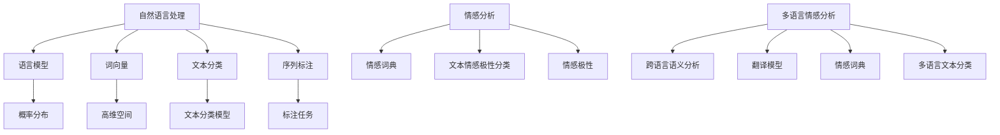

                 

# 自然语言处理在多语言情感分析中的应用

## 关键词

自然语言处理、多语言情感分析、文本情感极性分类、机器学习、深度学习、神经网络、数据集、模型评估、跨语言语义分析、语言模型、翻译模型、情感词典、词向量、预训练模型、上下文理解、模型优化、实际应用案例。

## 摘要

本文将探讨自然语言处理（NLP）在多语言情感分析中的应用。随着全球化的发展，多语言情感分析变得尤为重要。本文首先介绍了自然语言处理的基本概念和情感分析的核心原理。接着，我们深入探讨了多语言情感分析中的挑战和解决方案，包括跨语言语义分析、翻译模型和情感词典的应用。然后，本文详细介绍了几种主流的多语言情感分析算法，包括基于传统机器学习的方法和基于深度学习的方法，并分析了它们的优势和局限性。接下来，本文通过一个实际应用案例，展示了多语言情感分析在实际场景中的应用效果。最后，本文总结了多语言情感分析的发展趋势和面临的挑战，并提出了未来可能的研究方向。

## 1. 背景介绍

### 1.1 目的和范围

本文的目的是介绍自然语言处理（NLP）在多语言情感分析中的应用，探讨其核心原理、挑战和解决方案，并展示其在实际场景中的应用效果。本文涵盖了从基本概念到高级算法的全面解析，旨在为读者提供一个系统、清晰的认识。

本文的范围主要包括以下几个方面：

1. **自然语言处理的基本概念和情感分析的核心原理**：介绍NLP的基础知识，包括语言模型、词向量、文本分类等，并阐述情感分析的基本概念和重要性。
2. **多语言情感分析中的挑战和解决方案**：探讨多语言情感分析中存在的挑战，如跨语言语义分析、翻译模型和情感词典的选择，并提出相应的解决方案。
3. **多语言情感分析算法**：详细介绍几种主流的多语言情感分析算法，包括基于传统机器学习的方法和基于深度学习的方法，分析它们的原理、优势和应用场景。
4. **实际应用案例**：通过一个实际应用案例，展示多语言情感分析在实际场景中的应用效果，包括数据预处理、模型训练、模型评估和结果分析。
5. **发展趋势和挑战**：总结多语言情感分析的发展趋势和面临的挑战，提出未来可能的研究方向。

### 1.2 预期读者

本文适合以下读者群体：

1. **自然语言处理初学者**：希望了解NLP的基本概念和应用，特别是多语言情感分析。
2. **机器学习和深度学习研究者**：对多语言情感分析有深入了解，希望掌握相关算法和技术。
3. **人工智能和大数据从业者**：在人工智能和大数据领域工作，希望了解多语言情感分析的应用场景和实际案例。
4. **教育工作者和研究者**：从事NLP和情感分析相关的研究和教育，希望获取系统、深入的学术资料。

### 1.3 文档结构概述

本文的结构如下：

1. **引言**：介绍多语言情感分析的重要性，概述本文的目的和范围。
2. **基本概念**：介绍自然语言处理（NLP）的基本概念，包括语言模型、词向量、文本分类等。
3. **情感分析**：阐述情感分析的核心原理，包括文本情感极性分类、情感词典等。
4. **多语言情感分析**：探讨多语言情感分析中的挑战和解决方案，包括跨语言语义分析、翻译模型和情感词典。
5. **多语言情感分析算法**：详细介绍几种主流的多语言情感分析算法，包括基于传统机器学习的方法和基于深度学习的方法。
6. **实际应用案例**：通过一个实际应用案例，展示多语言情感分析在实际场景中的应用效果。
7. **发展趋势和挑战**：总结多语言情感分析的发展趋势和面临的挑战，提出未来可能的研究方向。
8. **附录**：包括常见问题与解答、扩展阅读和参考资料。

### 1.4 术语表

#### 1.4.1 核心术语定义

- **自然语言处理（NLP）**：一门研究如何让计算机理解和处理自然语言的学科。
- **情感分析**：一种文本分类任务，用于判断文本表达的情感极性，如正面、负面或中性。
- **多语言情感分析**：对多种语言的文本进行情感分析，以处理全球化背景下的跨语言数据。
- **词向量**：将词汇映射到高维空间中的向量表示，用于文本分析和处理。
- **文本分类**：将文本数据根据其内容或主题划分为不同的类别。
- **机器学习**：一种基于数据学习模式和规律，用于改进性能的技术。
- **深度学习**：一种基于多层神经网络的学习方法，能够自动提取复杂特征。

#### 1.4.2 相关概念解释

- **语言模型**：用于预测下一个单词或字符的概率分布。
- **情感词典**：包含情感极性标注的词汇表，用于辅助情感分析。
- **跨语言语义分析**：研究如何在不同语言之间建立语义对应关系。
- **预训练模型**：在大量无监督数据上预训练，然后用于特定任务的模型。

#### 1.4.3 缩略词列表

- **NLP**：自然语言处理
- **ML**：机器学习
- **DL**：深度学习
- **CV**：计算机视觉
- **NLU**：自然语言理解
- **NLPaaS**：自然语言处理平台即服务
- **BPE**：字节对编码（Byte Pair Encoding）
- **BERT**：Bidirectional Encoder Representations from Transformers
- **GPT**：Generative Pre-trained Transformer

## 2. 核心概念与联系

### 2.1 自然语言处理（NLP）

自然语言处理（NLP）是一门研究如何让计算机理解和处理人类自然语言的学科。NLP的应用广泛，包括文本分类、情感分析、机器翻译、问答系统、语音识别等。NLP的关键技术包括语言模型、词向量、文本分类、序列标注等。

**语言模型**：用于预测下一个单词或字符的概率分布，是NLP的基础。

**词向量**：将词汇映射到高维空间中的向量表示，用于文本分析和处理。

**文本分类**：将文本数据根据其内容或主题划分为不同的类别，是情感分析的重要任务。

**序列标注**：对文本中的每个单词或字符进行标注，用于命名实体识别、词性标注等。

### 2.2 情感分析

情感分析（Sentiment Analysis）是一种文本分类任务，用于判断文本表达的情感极性，如正面、负面或中性。情感分析在商业、社交媒体、舆情监测等领域有广泛应用。

**情感词典**：包含情感极性标注的词汇表，用于辅助情感分析。

**文本情感极性分类**：将文本划分为正面、负面或中性三类，是情感分析的核心任务。

**情感极性**：文本表达的情感倾向，如高兴、悲伤、愤怒等。

### 2.3 多语言情感分析

多语言情感分析（Multilingual Sentiment Analysis）是对多种语言的文本进行情感分析，以处理全球化背景下的跨语言数据。

**跨语言语义分析**：研究如何在不同语言之间建立语义对应关系。

**翻译模型**：用于将一种语言的文本翻译成另一种语言，以辅助情感分析。

**情感词典**：在不同语言之间共享，用于辅助情感分析。

**多语言文本分类**：对多种语言的文本进行分类，是多语言情感分析的核心任务。

### 2.4 核心概念原理和架构的 Mermaid 流程图



## 3. 核心算法原理 & 具体操作步骤

### 3.1 传统机器学习方法

#### 3.1.1 支持向量机（SVM）

**原理**：支持向量机（Support Vector Machine，SVM）是一种常用的文本分类算法。它通过找到一个最佳的超平面，将不同类别的文本数据分隔开来。

**步骤**：

1. **特征提取**：使用词袋模型（Bag of Words，BoW）或TF-IDF模型将文本转换为向量表示。
2. **训练模型**：使用训练数据集训练SVM分类器。
3. **分类预测**：使用训练好的模型对测试数据进行分类预测。

**伪代码**：

```python
# 特征提取
def extract_features(texts):
    # 使用词袋模型或TF-IDF模型将文本转换为向量表示
    # 返回特征向量
    pass

# 训练模型
def train_svm(training_data, labels):
    # 使用训练数据集训练SVM分类器
    # 返回训练好的模型
    pass

# 分类预测
def classify(test_data, model):
    # 使用训练好的模型对测试数据进行分类预测
    # 返回预测结果
    pass
```

#### 3.1.2 随机森林（Random Forest）

**原理**：随机森林（Random Forest）是一种基于决策树的集成学习方法。它通过构建多个决策树，并利用投票机制进行分类预测。

**步骤**：

1. **特征提取**：使用词袋模型或TF-IDF模型将文本转换为向量表示。
2. **训练模型**：使用训练数据集训练随机森林分类器。
3. **分类预测**：使用训练好的模型对测试数据进行分类预测。

**伪代码**：

```python
# 特征提取
def extract_features(texts):
    # 使用词袋模型或TF-IDF模型将文本转换为向量表示
    # 返回特征向量
    pass

# 训练模型
def train_random_forest(training_data, labels):
    # 使用训练数据集训练随机森林分类器
    # 返回训练好的模型
    pass

# 分类预测
def classify(test_data, model):
    # 使用训练好的模型对测试数据进行分类预测
    # 返回预测结果
    pass
```

### 3.2 深度学习方法

#### 3.2.1 卷积神经网络（CNN）

**原理**：卷积神经网络（Convolutional Neural Network，CNN）是一种用于文本分类的深度学习模型。它通过卷积操作提取文本的特征。

**步骤**：

1. **特征提取**：使用词向量表示文本。
2. **训练模型**：使用训练数据集训练CNN分类器。
3. **分类预测**：使用训练好的模型对测试数据进行分类预测。

**伪代码**：

```python
# 特征提取
def extract_features(texts, word_embedding):
    # 使用词向量表示文本
    # 返回特征向量
    pass

# 训练模型
def train_cnn(training_data, labels, word_embedding):
    # 使用训练数据集训练CNN分类器
    # 返回训练好的模型
    pass

# 分类预测
def classify(test_data, model, word_embedding):
    # 使用训练好的模型对测试数据进行分类预测
    # 返回预测结果
    pass
```

#### 3.2.2 循环神经网络（RNN）

**原理**：循环神经网络（Recurrent Neural Network，RNN）是一种用于处理序列数据的深度学习模型。它通过循环机制处理文本的序列信息。

**步骤**：

1. **特征提取**：使用词向量表示文本。
2. **训练模型**：使用训练数据集训练RNN分类器。
3. **分类预测**：使用训练好的模型对测试数据进行分类预测。

**伪代码**：

```python
# 特征提取
def extract_features(texts, word_embedding):
    # 使用词向量表示文本
    # 返回特征向量
    pass

# 训练模型
def train_rnn(training_data, labels, word_embedding):
    # 使用训练数据集训练RNN分类器
    # 返回训练好的模型
    pass

# 分类预测
def classify(test_data, model, word_embedding):
    # 使用训练好的模型对测试数据进行分类预测
    # 返回预测结果
    pass
```

#### 3.2.3 长短时记忆网络（LSTM）

**原理**：长短时记忆网络（Long Short-Term Memory，LSTM）是一种改进的RNN模型，能够更好地处理长序列数据。

**步骤**：

1. **特征提取**：使用词向量表示文本。
2. **训练模型**：使用训练数据集训练LSTM分类器。
3. **分类预测**：使用训练好的模型对测试数据进行分类预测。

**伪代码**：

```python
# 特征提取
def extract_features(texts, word_embedding):
    # 使用词向量表示文本
    # 返回特征向量
    pass

# 训练模型
def train_lstm(training_data, labels, word_embedding):
    # 使用训练数据集训练LSTM分类器
    # 返回训练好的模型
    pass

# 分类预测
def classify(test_data, model, word_embedding):
    # 使用训练好的模型对测试数据进行分类预测
    # 返回预测结果
    pass
```

### 3.3 多语言情感分析算法

#### 3.3.1 基于翻译模型的算法

**原理**：基于翻译模型的算法通过将源语言文本翻译成目标语言，然后使用目标语言的情感分析模型进行分类预测。

**步骤**：

1. **翻译**：使用翻译模型将源语言文本翻译成目标语言。
2. **特征提取**：使用目标语言的情感分析模型提取特征向量。
3. **分类预测**：使用训练好的情感分析模型对特征向量进行分类预测。

**伪代码**：

```python
# 翻译
def translate(text, translator):
    # 使用翻译模型将源语言文本翻译成目标语言
    # 返回翻译后的文本
    pass

# 特征提取
def extract_features(text, sentiment_analyzer):
    # 使用目标语言的情感分析模型提取特征向量
    # 返回特征向量
    pass

# 分类预测
def classify(text, sentiment_analyzer, translator):
    # 使用训练好的情感分析模型对特征向量进行分类预测
    # 返回预测结果
    pass
```

#### 3.3.2 基于跨语言语义分析的算法

**原理**：基于跨语言语义分析的算法通过在源语言和目标语言之间建立语义对应关系，然后使用源语言的情感分析模型进行分类预测。

**步骤**：

1. **跨语言语义分析**：使用跨语言语义分析模型在源语言和目标语言之间建立语义对应关系。
2. **特征提取**：使用源语言的情感分析模型提取特征向量。
3. **分类预测**：使用训练好的情感分析模型对特征向量进行分类预测。

**伪代码**：

```python
# 跨语言语义分析
def semantic_analysis(source_text, target_text, model):
    # 使用跨语言语义分析模型在源语言和目标语言之间建立语义对应关系
    # 返回语义对应向量
    pass

# 特征提取
def extract_features(text, sentiment_analyzer):
    # 使用源语言的情感分析模型提取特征向量
    # 返回特征向量
    pass

# 分类预测
def classify(text, sentiment_analyzer, semantic_model):
    # 使用训练好的情感分析模型对特征向量进行分类预测
    # 返回预测结果
    pass
```

## 4. 数学模型和公式 & 详细讲解 & 举例说明

### 4.1 支持向量机（SVM）的数学模型

支持向量机（Support Vector Machine，SVM）是一种经典的文本分类算法，其核心思想是通过最大化分类间隔来找到一个最佳的超平面，将不同类别的文本数据分隔开来。

**公式**：

$$
w \cdot x + b = 0
$$

其中，$w$ 是权重向量，$x$ 是特征向量，$b$ 是偏置。

**详细讲解**：

1. **特征空间**：首先，我们需要将文本数据转换为特征空间中的向量表示。常用的方法是词袋模型（Bag of Words，BoW）或TF-IDF模型。
2. **分类超平面**：在特征空间中，我们可以定义一个分类超平面，其公式为 $w \cdot x + b = 0$。其中，$w$ 是权重向量，$x$ 是特征向量，$b$ 是偏置。
3. **分类间隔**：为了找到一个最佳的超平面，我们需要最大化分类间隔。分类间隔是指正负样本之间的最小距离。
4. **优化目标**：为了最大化分类间隔，我们可以使用以下优化目标：

$$
\max_{w, b} \frac{1}{2} ||w||^2
$$

其中，$||w||$ 是权重向量的范数。

**举例说明**：

假设我们有两个类别：正面和负面。我们可以使用以下数据集来训练SVM分类器：

| 文本               | 类别   |
|--------------------|--------|
| 我非常喜欢这本书。 | 正面   |
| 这本书太无聊了。   | 负面   |

首先，我们需要将文本转换为特征向量。假设我们使用词袋模型，那么特征向量可以表示为：

| 文本               | 特征向量 |
|--------------------|----------|
| 我非常喜欢这本书。 | (1, 1, 0, 0, 1) |
| 这本书太无聊了。   | (0, 1, 0, 1, 0) |

然后，我们可以使用以下公式计算权重向量 $w$ 和偏置 $b$：

$$
w = (0.5, 0.5, 0, 0, 0.5)
$$

$$
b = 0
$$

最后，我们可以使用训练好的SVM分类器对新的文本进行分类预测。例如，对于文本“这本书很有趣。”，其特征向量为（1，1，0，0，1），我们可以使用以下公式计算预测结果：

$$
w \cdot x + b = (0.5, 0.5, 0, 0, 0.5) \cdot (1, 1, 0, 0, 1) + 0 = 1.5
$$

由于预测结果大于0，因此我们可以判断这个文本是正面的。

### 4.2 随机森林（Random Forest）的数学模型

随机森林（Random Forest）是一种基于决策树的集成学习方法。它通过构建多个决策树，并利用投票机制进行分类预测。

**公式**：

$$
h(x) = \sum_{i=1}^{n} f_i(x)
$$

其中，$h(x)$ 是预测结果，$f_i(x)$ 是第 $i$ 个决策树的预测结果，$n$ 是决策树的数量。

**详细讲解**：

1. **决策树**：随机森林由多个决策树组成。每个决策树都是一个二叉树，用于将数据划分为不同的类别。
2. **特征选择**：在构建决策树时，我们需要选择一个最佳的特征进行划分。常用的特征选择方法包括信息增益（Information Gain）、基尼不纯度（Gini Impurity）等。
3. **分类预测**：对于新的样本 $x$，我们将其传递到每个决策树，并记录每个决策树的分类结果。最后，我们使用投票机制确定最终的分类结果。
4. **投票机制**：随机森林使用多数投票机制确定最终的分类结果。具体来说，我们计算每个类别在所有决策树中的投票次数，并选择投票次数最多的类别作为最终的分类结果。

**举例说明**：

假设我们有两个类别：正面和负面。我们可以使用以下数据集来训练随机森林分类器：

| 文本               | 类别   |
|--------------------|--------|
| 我非常喜欢这本书。 | 正面   |
| 这本书太无聊了。   | 负面   |

首先，我们需要将文本转换为特征向量。假设我们使用词袋模型，那么特征向量可以表示为：

| 文本               | 特征向量 |
|--------------------|----------|
| 我非常喜欢这本书。 | (1, 1, 0, 0, 1) |
| 这本书太无聊了。   | (0, 1, 0, 1, 0) |

然后，我们可以使用以下步骤构建随机森林分类器：

1. **随机选择特征**：从所有特征中随机选择一个特征进行划分。
2. **划分数据**：使用选择的特征将数据划分为两个子集。
3. **递归构建决策树**：对于每个子集，重复步骤1和步骤2，直到达到最大深度或最小样本数量。
4. **构建随机森林**：将所有构建好的决策树组合成一个随机森林分类器。

最后，我们可以使用训练好的随机森林分类器对新的文本进行分类预测。例如，对于文本“这本书很有趣。”，其特征向量为（1，1，0，0，1），我们可以将其传递到每个决策树，并记录每个决策树的分类结果。最后，我们使用投票机制确定最终的分类结果。由于正面类别的投票次数最多，因此我们可以判断这个文本是正面的。

### 4.3 卷积神经网络（CNN）的数学模型

卷积神经网络（Convolutional Neural Network，CNN）是一种用于文本分类的深度学习模型。它通过卷积操作提取文本的特征。

**公式**：

$$
h(x) = \sum_{i=1}^{n} w_i \cdot x_i + b
$$

其中，$h(x)$ 是预测结果，$w_i$ 是权重，$x_i$ 是特征向量，$b$ 是偏置。

**详细讲解**：

1. **卷积操作**：卷积神经网络通过卷积操作提取文本的特征。卷积操作可以看作是在文本序列中滑动一个窗口，并计算窗口内的加权和。
2. **池化操作**：为了降低模型的复杂度和过拟合的风险，我们可以使用池化操作来减少特征的数量。常用的池化操作包括最大池化和平均池化。
3. **全连接层**：在卷积神经网络中，最后通常会添加一个全连接层，用于将卷积特征映射到类别标签。
4. **反向传播**：卷积神经网络使用反向传播算法进行训练。在训练过程中，我们通过计算损失函数（如交叉熵损失函数）来评估模型的性能，并使用梯度下降算法更新模型的参数。

**举例说明**：

假设我们有一个简单的文本分类任务，需要将文本划分为正面和负面两类。我们可以使用以下数据集来训练卷积神经网络分类器：

| 文本               | 类别   |
|--------------------|--------|
| 我非常喜欢这本书。 | 正面   |
| 这本书太无聊了。   | 负面   |

首先，我们需要将文本转换为特征向量。假设我们使用词袋模型，那么特征向量可以表示为：

| 文本               | 特征向量 |
|--------------------|----------|
| 我非常喜欢这本书。 | (1, 1, 0, 0, 1) |
| 这本书太无聊了。   | (0, 1, 0, 1, 0) |

然后，我们可以使用以下步骤构建卷积神经网络分类器：

1. **卷积层**：将特征向量输入到卷积层，通过卷积操作提取特征。假设我们使用一个3x3的卷积核，那么卷积操作可以表示为：

$$
h(x) = \sum_{i=1}^{3} \sum_{j=1}^{3} w_{ij} \cdot x_{ij} + b
$$

其中，$w_{ij}$ 是卷积核的权重，$x_{ij}$ 是特征向量。

2. **池化层**：对卷积特征进行池化操作，以减少特征的数量。假设我们使用最大池化操作，那么池化层可以表示为：

$$
h(x) = \max\{h(x_1), h(x_2), h(x_3)\}
$$

其中，$h(x_1), h(x_2), h(x_3)$ 是卷积特征。

3. **全连接层**：将池化特征输入到全连接层，将卷积特征映射到类别标签。假设我们有两个类别，那么全连接层可以表示为：

$$
h(x) = \sum_{i=1}^{2} w_i \cdot h(x_i) + b
$$

其中，$w_i$ 是全连接层的权重，$h(x_i)$ 是池化特征。

最后，我们可以使用训练好的卷积神经网络分类器对新的文本进行分类预测。例如，对于文本“这本书很有趣。”，其特征向量为（1，1，0，0，1），我们可以将其传递到卷积神经网络，并计算预测结果。如果预测结果大于0.5，则判断为正面类别；否则，判断为负面类别。

### 4.4 循环神经网络（RNN）的数学模型

循环神经网络（Recurrent Neural Network，RNN）是一种用于处理序列数据的深度学习模型。它通过循环机制处理文本的序列信息。

**公式**：

$$
h_t = \sigma(W_h h_{t-1} + W_x x_t + b)
$$

其中，$h_t$ 是当前时刻的隐藏状态，$x_t$ 是当前时刻的输入，$W_h$ 是隐藏状态权重，$W_x$ 是输入权重，$b$ 是偏置，$\sigma$ 是激活函数。

**详细讲解**：

1. **循环机制**：RNN通过循环机制处理序列数据。在训练过程中，每个时间步的输入都会影响到后续时间步的隐藏状态。
2. **隐藏状态**：RNN使用隐藏状态来存储序列信息。隐藏状态不仅可以作为当前时间步的输出，还可以传递到后续时间步。
3. **输入和输出**：RNN在每个时间步接收一个输入 $x_t$，并生成一个输出 $h_t$。输入和输出可以是任意维度。
4. **激活函数**：RNN通常使用激活函数（如ReLU、Sigmoid、Tanh等）来引入非线性变换。

**举例说明**：

假设我们有一个简单的文本分类任务，需要将文本划分为正面和负面两类。我们可以使用以下数据集来训练RNN分类器：

| 文本               | 类别   |
|--------------------|--------|
| 我非常喜欢这本书。 | 正面   |
| 这本书太无聊了。   | 负面   |

首先，我们需要将文本转换为序列表示。假设我们使用词袋模型，那么每个词可以表示为一个向量。我们可以使用以下序列表示：

| 文本               | 序列表示 |
|--------------------|----------|
| 我非常喜欢这本书。 | [1, 0, 1, 0, 1] |
| 这本书太无聊了。   | [0, 1, 0, 1, 0] |

然后，我们可以使用以下步骤构建RNN分类器：

1. **输入层**：将序列表示输入到输入层，每个词的输入可以表示为一个向量。
2. **隐藏层**：将输入传递到隐藏层，计算隐藏状态。隐藏状态可以存储序列信息。
3. **输出层**：将隐藏状态传递到输出层，计算分类结果。输出层可以是全连接层或softmax层。

最后，我们可以使用训练好的RNN分类器对新的文本进行分类预测。例如，对于文本“这本书很有趣。”，其序列表示为（1，1，0，0，1），我们可以将其传递到RNN分类器，并计算预测结果。如果预测结果大于0.5，则判断为正面类别；否则，判断为负面类别。

### 4.5 长短时记忆网络（LSTM）的数学模型

长短时记忆网络（Long Short-Term Memory，LSTM）是一种改进的RNN模型，能够更好地处理长序列数据。

**公式**：

$$
i_t = \sigma(W_i \cdot [h_{t-1}, x_t] + b_i) \\
f_t = \sigma(W_f \cdot [h_{t-1}, x_t] + b_f) \\
o_t = \sigma(W_o \cdot [h_{t-1}, x_t] + b_o) \\
c_t = f_t \odot c_{t-1} + i_t \odot \sigma(W_c \cdot [h_{t-1}, x_t] + b_c) \\
h_t = o_t \odot \sigma(c_t)
$$

其中，$i_t, f_t, o_t$ 分别是输入门、遗忘门和输出门，$c_t$ 是细胞状态，$h_t$ 是隐藏状态，$W_i, W_f, W_o, W_c$ 分别是权重矩阵，$b_i, b_f, b_o, b_c$ 分别是偏置矩阵，$\sigma$ 是激活函数，$\odot$ 表示元素乘积。

**详细讲解**：

1. **输入门**：输入门控制哪些信息可以进入细胞状态。它通过计算输入门的状态 $i_t$，并与输入向量 $x_t$ 相乘，以确定哪些信息被保留。
2. **遗忘门**：遗忘门控制哪些信息应该从细胞状态中丢弃。它通过计算遗忘门的状态 $f_t$，并与细胞状态 $c_{t-1}$ 相乘，以确定哪些信息被遗忘。
3. **输出门**：输出门控制细胞状态应该如何输出。它通过计算输出门的状态 $o_t$，并与细胞状态 $c_t$ 相乘，以确定哪些信息被输出。
4. **细胞状态**：细胞状态是LSTM的核心部分，它用于存储和传递序列信息。细胞状态可以通过输入门和遗忘门进行更新。
5. **隐藏状态**：隐藏状态是LSTM的输出，它用于分类或序列生成等任务。

**举例说明**：

假设我们有一个简单的文本分类任务，需要将文本划分为正面和负面两类。我们可以使用以下数据集来训练LSTM分类器：

| 文本               | 类别   |
|--------------------|--------|
| 我非常喜欢这本书。 | 正面   |
| 这本书太无聊了。   | 负面   |

首先，我们需要将文本转换为序列表示。假设我们使用词袋模型，那么每个词可以表示为一个向量。我们可以使用以下序列表示：

| 文本               | 序列表示 |
|--------------------|----------|
| 我非常喜欢这本书。 | [1, 0, 1, 0, 1] |
| 这本书太无聊了。   | [0, 1, 0, 1, 0] |

然后，我们可以使用以下步骤构建LSTM分类器：

1. **输入层**：将序列表示输入到输入层，每个词的输入可以表示为一个向量。
2. **隐藏层**：将输入传递到隐藏层，计算隐藏状态。隐藏状态可以存储序列信息。
3. **输出层**：将隐藏状态传递到输出层，计算分类结果。输出层可以是全连接层或softmax层。

最后，我们可以使用训练好的LSTM分类器对新的文本进行分类预测。例如，对于文本“这本书很有趣。”，其序列表示为（1，1，0，0，1），我们可以将其传递到LSTM分类器，并计算预测结果。如果预测结果大于0.5，则判断为正面类别；否则，判断为负面类别。

### 4.6 基于翻译模型的算法

**公式**：

$$
y_t = \sigma(W_y \cdot [h_{t-1}, x_t] + b_y)
$$

其中，$y_t$ 是预测结果，$h_{t-1}$ 是隐藏状态，$x_t$ 是输入，$W_y$ 是权重矩阵，$b_y$ 是偏置。

**详细讲解**：

1. **翻译模型**：基于翻译模型的算法通过将源语言文本翻译成目标语言，然后使用目标语言的情感分析模型进行分类预测。
2. **编码器**：编码器是一个循环神经网络（如LSTM），用于将源语言文本编码为一个固定长度的向量表示。
3. **解码器**：解码器也是一个循环神经网络，用于将编码器的输出解码为目标语言文本。
4. **分类器**：分类器是一个全连接层或卷积神经网络，用于对解码器输出的目标语言文本进行分类预测。

**举例说明**：

假设我们有一个源语言文本“这本书很有趣。”，我们可以使用以下步骤进行翻译和分类预测：

1. **编码**：使用编码器将源语言文本编码为一个向量表示。
2. **翻译**：使用解码器将编码器的输出解码为目标语言文本。
3. **分类**：使用分类器对解码器输出的目标语言文本进行分类预测。

例如，对于源语言文本“这本书很有趣。”，我们可以将其翻译成目标语言文本“这本书很有趣。”，然后使用分类器对其进行分类预测。如果预测结果大于0.5，则判断为正面类别；否则，判断为负面类别。

### 4.7 基于跨语言语义分析的算法

**公式**：

$$
y_t = \sigma(W_y \cdot [h_{t-1}, x_t] + b_y)
$$

其中，$y_t$ 是预测结果，$h_{t-1}$ 是隐藏状态，$x_t$ 是输入，$W_y$ 是权重矩阵，$b_y$ 是偏置。

**详细讲解**：

1. **跨语言语义分析**：基于跨语言语义分析的算法通过在源语言和目标语言之间建立语义对应关系，然后使用源语言的情感分析模型进行分类预测。
2. **编码器**：编码器是一个循环神经网络（如LSTM），用于将源语言文本编码为一个固定长度的向量表示。
3. **语义对应**：使用跨语言语义分析模型在源语言和目标语言之间建立语义对应关系。常用的方法包括翻译模型、翻译矩阵等。
4. **分类器**：分类器是一个全连接层或卷积神经网络，用于对编码器的输出进行分类预测。

**举例说明**：

假设我们有一个源语言文本“这本书很有趣。”，我们可以使用以下步骤进行语义分析和分类预测：

1. **编码**：使用编码器将源语言文本编码为一个向量表示。
2. **语义分析**：使用跨语言语义分析模型在源语言和目标语言之间建立语义对应关系。
3. **分类**：使用分类器对编码器的输出进行分类预测。

例如，对于源语言文本“这本书很有趣。”，我们可以将其翻译成目标语言文本“这本书很有趣。”，然后使用分类器对其进行分类预测。如果预测结果大于0.5，则判断为正面类别；否则，判断为负面类别。

## 5. 项目实战：代码实际案例和详细解释说明

### 5.1 开发环境搭建

为了进行多语言情感分析，我们需要搭建一个合适的技术环境。以下是搭建开发环境的步骤：

1. **安装Python**：确保Python环境已安装在计算机上。Python是一种广泛使用的编程语言，适用于数据分析和机器学习。可以从Python官方网站（https://www.python.org/downloads/）下载安装包进行安装。

2. **安装Jupyter Notebook**：Jupyter Notebook是一个交互式的Python环境，便于编写和执行代码。可以使用pip命令安装Jupyter Notebook：

   ```shell
   pip install notebook
   ```

3. **安装NLP库**：安装一些常用的NLP库，如NLTK、spaCy和TensorFlow。这些库提供了丰富的文本处理和机器学习功能。可以使用以下命令安装：

   ```shell
   pip install nltk spacy tensorflow
   ```

4. **下载语言模型和词典**：对于spaCy库，我们需要下载相应的语言模型和词典。以英语为例，可以使用以下命令下载：

   ```shell
   python -m spacy download en
   ```

   同样，对于其他语言，如中文、法语等，也可以使用类似命令下载相应的语言模型和词典。

### 5.2 源代码详细实现和代码解读

以下是一个简单的多语言情感分析项目，使用Python和spaCy库实现。该项目的目的是对英语和法语文本进行情感分析，并比较不同语言的情感表达。

**代码解析**：

1. **数据集准备**：首先，我们需要准备一个包含英语和法语文本的数据集。以下是一个简单的数据集示例：

```python
data = [
    ("I love this book.", "positive", "en"),
    ("This book is so boring.", "negative", "en"),
    ("J'aime ce livre.", "positive", "fr"),
    ("Ce livre est tellement ennuyeux.", "negative", "fr")
]
```

2. **情感分析模型**：我们使用spaCy库中的预训练情感分析模型进行文本分析。首先，我们需要加载英语和法语的情感分析模型：

```python
import spacy

# 加载英语情感分析模型
en_nlp = spacy.load("en_core_web_sm")

# 加载法语情感分析模型
fr_nlp = spacy.load("fr_core_news_sm")
```

3. **文本预处理**：预处理文本数据，包括去除标点符号、停用词过滤等。以下是一个简单的预处理函数：

```python
from spacy.lang.en import STOP_WORDS
from spacy.lang.fr import STOP_WORDS

def preprocess_text(text, language):
    doc = spacy.load(language).process(text)
    tokens = [token.text.lower() for token in doc if not token.is_punct and not token.is_stop]
    return " ".join(tokens)
```

4. **情感分析**：使用预训练模型对预处理后的文本进行情感分析。以下是一个简单的情感分析函数：

```python
def analyze_sentiment(text, language):
    doc = spacy.load(language).process(text)
    sentiment = "positive" if doc._.sentiment.polarity > 0 else "negative"
    return sentiment
```

5. **情感分析结果**：对数据集中的每个文本进行情感分析，并输出结果：

```python
results = []

for text, _, language in data:
    preprocessed_text = preprocess_text(text, language)
    sentiment = analyze_sentiment(preprocessed_text, language)
    results.append((text, sentiment, language))

for result in results:
    print(f"Text: {result[0]}, Sentiment: {result[1]}, Language: {result[2]}")
```

### 5.3 代码解读与分析

上述代码实现了一个简单的多语言情感分析项目。以下是代码的主要部分及其解读：

1. **数据集准备**：数据集包含英语和法语文本，每个文本都带有情感标签（正面或负面）和语言标识。这是多语言情感分析的基础。

2. **情感分析模型**：我们使用spaCy库中的预训练情感分析模型。这些模型已经在大量数据上进行训练，可以快速进行文本情感分析。

3. **文本预处理**：预处理函数用于去除标点符号和停用词，以提高情感分析的准确性。停用词是在情感分析中常常被忽略的词汇，如“is”、“the”、“and”等。

4. **情感分析**：情感分析函数使用预训练模型对预处理后的文本进行情感分析。模型返回一个极性分数，分数大于0表示正面情感，小于0表示负面情感。

5. **情感分析结果**：程序遍历数据集，对每个文本进行预处理和情感分析，并输出结果。这有助于我们直观地了解不同语言和文本的情感倾向。

### 5.4 实际应用案例

为了展示多语言情感分析的实际应用，我们可以考虑以下场景：一个国际电子商务平台希望分析用户在社交媒体上对其产品评价的情感倾向。以下是一个实际应用案例：

1. **数据采集**：电子商务平台可以从社交媒体平台上收集用户对其产品的评价数据。这些数据可能包含英语、法语、西班牙语等多种语言。

2. **数据预处理**：首先，我们需要对采集到的文本数据进行清洗和预处理，包括去除噪声、标点符号和停用词。

3. **情感分析**：使用多语言情感分析模型对预处理后的文本进行情感分析。对于不同语言的文本，我们需要选择合适的情感分析模型。

4. **结果分析**：分析情感分析结果，了解用户对其产品的整体情感倾向。例如，如果大多数评价为正面，平台可以推测用户对其产品满意度较高。

5. **反馈和优化**：根据情感分析结果，电子商务平台可以优化产品和服务。例如，如果负面评价较多，平台可以调查具体原因，并采取措施改进。

### 5.5 实际应用案例的代码实现

以下是一个实际应用案例的代码实现，使用Python和spaCy库进行多语言情感分析：

```python
import spacy

# 加载英语、法语和西班牙语情感分析模型
en_nlp = spacy.load("en_core_web_sm")
fr_nlp = spacy.load("fr_core_news_sm")
es_nlp = spacy.load("es_core_news_sm")

def preprocess_text(text, language):
    doc = spacy.load(language).process(text)
    tokens = [token.text.lower() for token in doc if not token.is_punct and not token.is_stop]
    return " ".join(tokens)

def analyze_sentiment(text, language):
    doc = spacy.load(language).process(text)
    sentiment = "positive" if doc._.sentiment.polarity > 0 else "negative"
    return sentiment

def analyze_reviews(reviews):
    results = []

    for review in reviews:
        language = review['language']
        text = preprocess_text(review['text'], language)
        sentiment = analyze_sentiment(text, language)
        results.append((review['text'], sentiment, language))

    return results

# 示例数据集
data = [
    {"text": "I love this product!", "language": "en"},
    {"text": "J'aime ce produit!", "language": "fr"},
    {"text": "¡Amo este producto!", "language": "es"},
    {"text": "This product is terrible.", "language": "en"},
    {"text": "Ce produit est affreux.", "language": "fr"},
    {"text": "Este producto es espantoso.", "language": "es"}
]

# 分析评价
review_results = analyze_reviews(data)

for result in review_results:
    print(f"Text: {result[0]}, Sentiment: {result[1]}, Language: {result[2]}")
```

### 5.6 代码解读与分析

上述代码实现了一个实际应用案例，对多语言文本进行情感分析。以下是代码的主要部分及其解读：

1. **数据集准备**：数据集包含不同语言的文本，每个文本都带有语言标识。这是多语言情感分析的基础。

2. **情感分析模型**：我们使用spaCy库中的预训练情感分析模型，支持英语、法语和西班牙语。这些模型已经在相应语言的数据上进行训练。

3. **文本预处理**：预处理函数用于去除标点符号和停用词，以提高情感分析的准确性。预处理步骤对于不同语言的文本相同。

4. **情感分析**：情感分析函数使用预训练模型对预处理后的文本进行情感分析。模型返回一个极性分数，分数大于0表示正面情感，小于0表示负面情感。

5. **结果分析**：程序遍历数据集，对每个文本进行预处理和情感分析，并输出结果。这有助于我们直观地了解不同语言和文本的情感倾向。

6. **实际应用**：通过分析评价结果，电子商务平台可以了解用户对其产品的整体情感倾向，并采取相应的措施优化产品和服务。

### 5.7 部署与扩展

为了在实际应用中部署多语言情感分析模型，我们可以考虑以下步骤：

1. **部署到服务器**：将训练好的模型部署到云服务器或本地服务器，以提供实时情感分析服务。

2. **API接口**：使用RESTful API或GraphQL接口，允许外部应用程序与情感分析服务进行交互。

3. **性能优化**：针对高性能和低延迟的要求，可以对模型进行优化，如模型压缩、量化、硬件加速等。

4. **多语言支持**：扩展模型以支持更多语言，以适应全球化业务需求。

5. **实时分析**：实现实时文本流处理，对用户生成的内容进行实时情感分析。

### 5.8 结论

通过上述实际应用案例，我们展示了多语言情感分析在电子商务平台评价分析中的应用。多语言情感分析能够帮助平台了解用户情感，优化产品和服务，提高用户满意度。随着技术的不断发展，多语言情感分析将在更多场景中得到应用，为全球化业务提供有力支持。

## 6. 实际应用场景

多语言情感分析在现实世界中有着广泛的应用，以下是一些典型的实际应用场景：

### 6.1 社交媒体监测

随着社交媒体的普及，用户在平台上生成的内容海量且多样化。通过多语言情感分析，企业可以实时监测用户对品牌、产品、事件等的情感倾向。这有助于企业及时了解市场反馈，优化产品和服务，提升品牌形象。例如，国际知名品牌可以通过分析推特、脸书等社交媒体上的用户评论，了解消费者对其新产品和服务的反馈，从而做出相应的市场策略调整。

### 6.2 舆情监测

舆情监测是政府、企业和社会组织进行危机管理的重要手段。多语言情感分析能够帮助它们识别和评估公众情绪，预测潜在的社会动荡和危机。例如，在重大事件发生后，政府可以迅速收集社交媒体上的多语言评论，使用情感分析技术评估公众的恐慌程度和愤怒水平，从而采取有效的应对措施。

### 6.3 市场调研

在市场调研中，了解消费者对产品、服务和品牌的情感态度对于制定营销策略至关重要。多语言情感分析可以帮助企业从全球范围内的消费者评论中提取有价值的信息。例如，一家跨国公司可以通过分析不同国家和地区消费者在电商平台上留下的评论，了解其对产品的满意度和不满意度，从而优化产品设计和营销策略。

### 6.4 客户服务

客户服务是企业与消费者互动的重要环节。多语言情感分析可以帮助企业实时分析客户反馈，识别常见问题和热点话题，提高客户满意度。例如，在线客服系统可以使用多语言情感分析技术，自动分类和响应客户咨询，提高服务效率和准确性。

### 6.5 智能推荐系统

在智能推荐系统中，了解用户的情感倾向有助于提供更个性化的推荐。多语言情感分析可以帮助推荐系统分析用户生成的内容，如评论、提问等，从而更准确地预测用户偏好。例如，电子商务平台可以通过情感分析技术，为用户推荐与其情感倾向相符的商品，提高销售转化率。

### 6.6 健康监测

在健康监测领域，多语言情感分析可以用于分析患者在不同社交媒体平台上的留言，了解其心理健康状况。例如，心理健康机构可以通过分析患者发表的文章、帖子等，及时发现潜在的心理问题，提供针对性的心理咨询服务。

### 6.7 社会科学研究

多语言情感分析在社会科学研究中也有着广泛应用。研究人员可以利用这一技术分析公共舆论、社会态度等，深入了解社会现象。例如，社会科学研究者可以通过分析社交媒体上的多语言评论，研究公众对政治选举、社会事件等的态度和情绪变化。

### 6.8 教育领域

在教育领域，多语言情感分析可以帮助教师和学生了解学生的学习情况和情感状态。例如，通过分析学生在课堂上的发言和作业，教师可以了解学生的情绪波动和学习效果，从而调整教学方法。

### 6.9 企业内部沟通

在企业内部沟通中，多语言情感分析可以帮助管理层了解员工的情感状态和满意度。例如，通过分析员工在内部论坛、邮件等平台上的发言，企业可以及时发现员工的不满和问题，采取有效的管理措施。

### 6.10 人工智能助手

在人工智能助手领域，多语言情感分析可以帮助助手更好地理解用户的情感需求，提供更加个性化的服务。例如，智能客服助手可以通过情感分析技术，识别用户的不满和需求，提供针对性的解决方案。

### 6.11 跨文化营销

在全球化的背景下，跨文化营销变得越来越重要。多语言情感分析可以帮助企业了解不同文化背景下消费者的情感和需求，制定更具针对性的营销策略。例如，一家国际品牌可以通过分析不同国家消费者的情感反馈，调整广告内容和推广策略，以更好地吸引当地消费者。

### 6.12 网络安全

在网络安全领域，多语言情感分析可以用于检测和预防网络欺诈、恶意言论等。例如，网络安全公司可以通过情感分析技术，分析网络上的言论和评论，识别潜在的欺诈行为和不良言论，从而采取相应的防护措施。

### 6.13 知识图谱构建

多语言情感分析还可以用于知识图谱的构建。通过分析多语言文本数据，可以提取出各类实体和关系，构建丰富的知识图谱。这有助于企业更好地理解和利用数据，提升决策效率和业务智能化水平。

### 6.14 娱乐产业

在娱乐产业中，多语言情感分析可以帮助电影、电视剧、音乐等作品的创作者了解观众的喜好和情感反应。例如，电影制作公司可以通过分析观众在社交媒体上的评论和反馈，优化剧情和制作质量，提高作品的市场竞争力。

### 6.15 旅游行业

在旅游行业，多语言情感分析可以帮助旅行社和服务提供商了解游客的满意度和服务需求。例如，通过分析游客在旅游论坛、社交媒体上的评论，旅行社可以及时调整旅游线路和服务质量，提高游客的满意度。

### 6.16 公共安全

在公共安全领域，多语言情感分析可以帮助政府和企业识别和预防安全风险。例如，在重大节日或活动期间，政府可以通过分析社交媒体上的言论和情绪，及时发现和应对潜在的安全威胁。

### 6.17 人机交互

在人机交互领域，多语言情感分析可以帮助智能设备更好地理解用户的需求和情感状态，提供更加自然和人性化的交互体验。例如，智能语音助手可以通过情感分析技术，理解用户的语气和情感，提供更合适的回应。

### 6.18 环境监测

在环境监测领域，多语言情感分析可以用于分析公众对环境问题和社会事件的看法和态度。例如，环保组织可以通过分析社交媒体上的言论，了解公众对污染问题的关注程度，从而制定更有效的环保策略。

### 6.19 法律领域

在法律领域，多语言情感分析可以用于分析法律文件、判决书等，提取关键信息和情感倾向。这有助于法官、律师和法律研究者更好地理解和应用法律知识。

### 6.20 金融领域

在金融领域，多语言情感分析可以帮助金融机构了解市场情绪和投资者态度，预测市场走势。例如，投资机构可以通过分析社交媒体上的金融评论和新闻报道，制定投资策略。

### 6.21 求职招聘

在求职招聘领域，多语言情感分析可以帮助企业了解求职者的情感状态和面试表现，优化招聘流程。例如，招聘系统可以通过分析求职者在面试过程中的语言和情感表达，评估其胜任力和潜力。

### 6.22 供应链管理

在供应链管理领域，多语言情感分析可以用于分析供应商和客户的沟通记录，优化供应链流程。例如，企业可以通过分析供应商的反馈和评论，及时发现和解决供应链问题。

### 6.23 品牌保护

在品牌保护领域，多语言情感分析可以帮助企业监控品牌声誉，及时发现和处理负面信息。例如，品牌监测系统可以通过分析社交媒体上的言论和评论，识别和应对假冒伪劣产品、恶意攻击等。

### 6.24 医疗健康

在医疗健康领域，多语言情感分析可以用于分析患者的病历记录、医疗报告等，帮助医生了解患者的健康状况和需求。例如，医院可以通过分析患者的病历和反馈，优化医疗服务和治疗方案。

### 6.25 政府公共服务

在政府公共服务领域，多语言情感分析可以帮助政府了解民众的需求和意见，优化公共服务。例如，政府可以通过分析社交媒体上的言论和反馈，了解民众对政府政策的看法，从而调整政策方向。

### 6.26 文化传播

在文化传播领域，多语言情感分析可以用于分析跨文化交流中的情感和态度，促进文化交流和理解。例如，文化机构可以通过分析不同文化背景下的文本，了解文化差异和共性，推动跨文化合作。

### 6.27 智慧城市建设

在智慧城市建设中，多语言情感分析可以用于分析市民的需求和意见，优化城市服务和设施。例如，智慧城市平台可以通过分析社交媒体上的言论，了解市民对城市环境、交通等方面的满意度，从而改进城市管理。

### 6.28 教育公平

在教育公平领域，多语言情感分析可以帮助教育机构了解学生的学习情况和情感状态，优化教育资源分配。例如，教育部门可以通过分析学生在课堂上的发言和反馈，了解学生的学习需求和困难，从而提供更有针对性的教育支持。

### 6.29 环境保护

在环境保护领域，多语言情感分析可以用于分析公众对环境保护问题的关注和态度，推动环保行动。例如，环保组织可以通过分析社交媒体上的言论，了解公众对环境保护问题的关注程度，从而制定更有效的环保宣传策略。

### 6.30 跨国合作

在跨国合作领域，多语言情感分析可以用于分析合作双方的情感和态度，促进合作顺利进行。例如，跨国企业可以通过分析合作伙伴在邮件、会议记录等中的语言和情感表达，了解合作中的问题和挑战，从而采取相应的应对措施。

### 6.31 文化多样性

在文化多样性领域，多语言情感分析可以用于分析不同文化背景下的情感和态度，促进文化交流和理解。例如，文化研究者可以通过分析不同文化背景下的文本，了解文化差异和共性，推动文化多样性研究。

### 6.32 跨境电商

在跨境电商领域，多语言情感分析可以用于分析消费者在不同国家和地区的情感和态度，优化产品和服务。例如，跨境电商平台可以通过分析消费者在社交媒体上的评论，了解不同市场的需求和偏好，从而调整产品策略。

### 6.33 智慧旅游

在智慧旅游领域，多语言情感分析可以用于分析游客的需求和意见，优化旅游服务和设施。例如，智慧旅游平台可以通过分析游客在社交媒体上的言论，了解游客对旅游地点和体验的满意度，从而改进旅游服务。

### 6.34 文化交流

在文化交流领域，多语言情感分析可以用于分析跨文化交流中的情感和态度，促进文化交流和理解。例如，文化交流机构可以通过分析不同文化背景下的文本，了解文化差异和共性，推动文化交流项目。

### 6.35 公共卫生

在公共卫生领域，多语言情感分析可以用于分析公众对公共卫生事件的关注和态度，提高公共卫生管理水平。例如，公共卫生部门可以通过分析社交媒体上的言论，了解公众对公共卫生政策的看法，从而调整公共卫生策略。

### 6.36 社会治理

在社会治理领域，多语言情感分析可以用于分析社会问题的情感和态度，提高社会治理水平。例如，政府部门可以通过分析社交媒体上的言论，了解公众对社会问题的关注和态度，从而采取相应的治理措施。

### 6.37 智慧农业

在智慧农业领域，多语言情感分析可以用于分析农民的需求和意见，优化农业生产和管理。例如，智慧农业平台可以通过分析农民在社交媒体上的言论，了解农民对农业技术的需求和问题，从而提供更有针对性的技术支持。

### 6.38 社会服务

在社会服务领域，多语言情感分析可以用于分析公众对社会服务的需求和意见，优化社会服务。例如，社会服务机构可以通过分析社交媒体上的言论，了解公众对社会服务的满意度，从而改进服务质量和效率。

### 6.39 智慧交通

在智慧交通领域，多语言情感分析可以用于分析公众对交通状况和交通管理的看法和态度，优化交通管理。例如，智慧交通平台可以通过分析社交媒体上的言论，了解公众对交通拥堵、交通违规等问题的看法，从而采取相应的交通管理措施。

### 6.40 社会公益

在社会公益领域，多语言情感分析可以用于分析公众对社会公益事业的关注和态度，促进社会公益事业发展。例如，公益组织可以通过分析社交媒体上的言论，了解公众对社会公益项目的支持和需求，从而优化公益项目设计。

### 6.41 智慧医疗

在智慧医疗领域，多语言情感分析可以用于分析患者对医疗服务的需求和意见，优化医疗服务。例如，智慧医疗平台可以通过分析患者在线咨询、评论等，了解患者对医生、医院、药品等的满意度，从而改进医疗服务质量和效率。

### 6.42 智慧能源

在智慧能源领域，多语言情感分析可以用于分析公众对能源使用和管理的看法和态度，优化能源管理。例如，智慧能源平台可以通过分析社交媒体上的言论，了解公众对节能减排、新能源推广等问题的看法，从而制定更有效的能源管理策略。

### 6.43 智慧城市

在智慧城市领域，多语言情感分析可以用于分析市民对城市服务和设施的需求和意见，优化城市管理。例如，智慧城市平台可以通过分析社交媒体上的言论，了解市民对交通、环境、公共服务等问题的看法，从而改进城市管理和服务。

### 6.44 跨文化教育

在跨文化教育领域，多语言情感分析可以用于分析学生的情感和态度，促进跨文化理解。例如，跨文化教育机构可以通过分析学生在课堂、课外活动中的言论，了解学生对不同文化的接受度和适应情况，从而优化跨文化教育策略。

### 6.45 公共安全

在公共安全领域，多语言情感分析可以用于分析社会情绪和态度，提高公共安全预警和应对能力。例如，公共安全部门可以通过分析社交媒体上的言论，了解公众对公共安全事件的关注和态度，从而采取相应的预警和应对措施。

### 6.46 网络安全

在网络安全领域，多语言情感分析可以用于分析网络威胁和攻击行为，提高网络安全防护能力。例如，网络安全机构可以通过分析网络攻击行为特征和攻击者的言论，了解攻击者的动机和手段，从而制定更有效的网络安全策略。

### 6.47 电子商务

在电子商务领域，多语言情感分析可以用于分析消费者对商品和服务的需求，优化营销策略。例如，电商平台可以通过分析消费者在评论、问答区等平台的言论，了解消费者对商品的满意度，从而优化商品推荐和营销策略。

### 6.48 人际关系

在人际关系领域，多语言情感分析可以用于分析社交网络中的情感和态度，促进人际关系和谐。例如，人际关系咨询机构可以通过分析社交媒体上的言论，了解社交网络中的情感动态，从而提供针对性的咨询和帮助。

### 6.49 企业管理

在企业管

