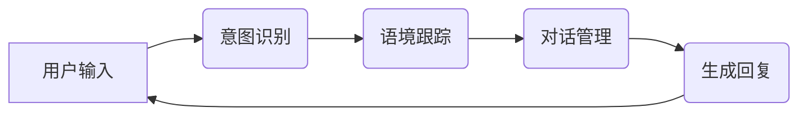

                 

# 自然语言处理在多轮对话系统中的上下文理解

> 关键词：自然语言处理、多轮对话系统、上下文理解、NLP、对话系统、深度学习、语义分析

> 摘要：本文深入探讨了自然语言处理（NLP）在多轮对话系统中的应用，特别是上下文理解这一关键技术的原理、算法、数学模型以及实际应用案例。通过逐步分析推理，本文旨在为读者提供一个全面、清晰的技术视角，帮助理解多轮对话系统中上下文理解的重要性及其实现方式。

## 1. 背景介绍

### 1.1 目的和范围

本文旨在探讨自然语言处理（NLP）在多轮对话系统中的上下文理解技术。随着人工智能技术的发展，对话系统已经成为智能助手、客服系统等领域的核心组成部分。而上下文理解作为多轮对话系统的关键，能够显著提升对话系统的交互质量和用户体验。本文将围绕以下主题展开：

- NLP在多轮对话系统中的重要性
- 上下文理解的核心概念和原理
- 上下文理解的算法原理和具体实现步骤
- 数学模型和公式在上下文理解中的应用
- 实际应用场景和代码案例
- 工具和资源推荐
- 未来发展趋势与挑战

### 1.2 预期读者

本文适合具有以下背景的读者：

- 对人工智能和自然语言处理感兴趣的计算机科学和软件工程师
- 对对话系统和上下文理解技术有深入研究的学者和研究人员
- 想要提升对话系统开发能力的项目经理和产品经理
- 对NLP和对话系统有一定了解，希望深入了解上下文理解技术的人员

### 1.3 文档结构概述

本文结构如下：

1. **背景介绍**：介绍本文的目的、范围、预期读者以及文档结构。
2. **核心概念与联系**：阐述上下文理解的核心概念和原理，并使用Mermaid流程图展示。
3. **核心算法原理 & 具体操作步骤**：讲解上下文理解算法的原理和具体实现步骤，使用伪代码详细阐述。
4. **数学模型和公式 & 详细讲解 & 举例说明**：介绍数学模型和公式，并通过具体例子进行详细讲解。
5. **项目实战：代码实际案例和详细解释说明**：提供实际代码案例，详细解释说明上下文理解在对话系统中的应用。
6. **实际应用场景**：探讨上下文理解在多轮对话系统中的实际应用场景。
7. **工具和资源推荐**：推荐学习资源、开发工具框架和相关论文著作。
8. **总结：未来发展趋势与挑战**：总结上下文理解技术的发展趋势和面临挑战。
9. **附录：常见问题与解答**：回答读者可能遇到的问题。
10. **扩展阅读 & 参考资料**：提供进一步阅读的参考资料。

### 1.4 术语表

#### 1.4.1 核心术语定义

- **自然语言处理（NLP）**：指计算机科学领域研究如何让计算机理解、生成和处理自然语言的技术。
- **上下文理解**：指对话系统在多轮对话中能够理解用户意图和语境的能力。
- **多轮对话系统**：指能够进行多轮交流的对话系统，通常涉及复杂的上下文管理。
- **语义分析**：指分析和理解文本中词汇和句子之间的语义关系。

#### 1.4.2 相关概念解释

- **词向量**：使用向量来表示词语，便于计算机处理和理解。
- **语言模型**：一种概率模型，用于预测下一个词或词组。
- **序列到序列（Seq2Seq）模型**：一种用于序列转换的神经网络模型。

#### 1.4.3 缩略词列表

- **NLP**：自然语言处理
- **Seq2Seq**：序列到序列
- **RNN**：循环神经网络
- **LSTM**：长短时记忆网络

## 2. 核心概念与联系

### 2.1 多轮对话系统中的上下文理解

多轮对话系统中的上下文理解是确保对话系统能够准确理解用户意图和语境的关键技术。上下文理解涉及以下几个核心概念：

- **用户意图识别**：识别用户在对话中的目标或需求。
- **语境跟踪**：持续跟踪对话中的信息，以保持对用户意图和对话背景的理解。
- **对话管理**：管理对话的流程，包括对话状态、历史信息、用户意图等。

### 2.2 核心概念原理和架构

为了更好地理解上下文理解，我们需要先了解几个核心概念和它们的相互关系。以下是使用Mermaid绘制的流程图，展示了上下文理解的关键组件和流程：



#### 2.2.1 意图识别

意图识别是上下文理解的第一步，其目标是识别用户在对话中的目标或需求。这一过程通常依赖于语言模型和分类算法，如决策树、支持向量机（SVM）或神经网络。

#### 2.2.2 语境跟踪

语境跟踪是保持对话连贯性的关键。它涉及分析用户输入，提取关键信息，并根据这些信息更新对话状态。语境跟踪通常使用基于规则的方法或机器学习模型，如循环神经网络（RNN）或长短时记忆网络（LSTM）。

#### 2.2.3 对话管理

对话管理负责管理对话的流程，包括对话状态、历史信息、用户意图等。它需要结合意图识别和语境跟踪的结果，生成适当的回复，并更新对话状态以适应新的输入。

#### 2.2.4 生成回复

生成回复是对话系统的输出部分，它根据用户输入和上下文信息生成合适的回复。生成回复通常使用基于语言模型的方法，如序列到序列（Seq2Seq）模型。

## 3. 核心算法原理 & 具体操作步骤

### 3.1 意图识别算法原理

意图识别是上下文理解的关键步骤，其目标是识别用户在对话中的目标或需求。以下是意图识别算法的原理和具体操作步骤：

#### 3.1.1 语言模型

意图识别通常基于语言模型，如朴素贝叶斯、决策树、支持向量机（SVM）或神经网络。语言模型是一种概率模型，用于预测下一个词或词组。

```python
# 伪代码：基于朴素贝叶斯的意图识别
def naive_bayes_intent_recognition(user_input):
    # 训练语言模型
    language_model = train_language_model()

    # 提取特征
    features = extract_features(user_input)

    # 计算概率
    probabilities = language_model.predict(features)

    # 选择最高概率的意图
    intent = max(probabilities, key=probabilities.get)

    return intent
```

#### 3.1.2 分类算法

分类算法用于将输入的文本分类到不同的意图类别。常见的分类算法包括决策树、支持向量机和神经网络。

```python
# 伪代码：基于决策树的意图识别
def decision_tree_intent_recognition(user_input):
    # 训练决策树模型
    model = train_decision_tree_model()

    # 提取特征
    features = extract_features(user_input)

    # 预测意图
    intent = model.predict(features)

    return intent
```

### 3.2 语境跟踪算法原理

语境跟踪是确保对话连贯性的关键步骤，它需要分析用户输入，提取关键信息，并根据这些信息更新对话状态。以下是语境跟踪算法的原理和具体操作步骤：

#### 3.2.1 基于规则的方法

基于规则的方法使用预定义的规则来跟踪对话中的关键信息。例如，可以定义规则来识别用户提到的日期、时间、地点等信息。

```python
# 伪代码：基于规则的语境跟踪
def rule_based_context_tracking(user_input, context):
    # 应用预定义的规则
    for rule in defined_rules:
        if rule_applies(user_input, rule):
            context.update(rule)

    return context
```

#### 3.2.2 机器学习模型

机器学习模型，如循环神经网络（RNN）或长短时记忆网络（LSTM），可以用于更复杂和动态的语境跟踪。

```python
# 伪代码：基于LSTM的语境跟踪
def lstm_context_tracking(user_input, context):
    # 训练LSTM模型
    model = train_lstm_model()

    # 提取特征
    features = extract_features(user_input, context)

    # 更新语境
    context = model.predict(features)

    return context
```

### 3.3 对话管理算法原理

对话管理负责管理对话的流程，包括对话状态、历史信息、用户意图等。以下是对话管理算法的原理和具体操作步骤：

#### 3.3.1 状态机方法

状态机方法使用预定义的状态和转换规则来管理对话。每个状态都定义了一组操作和转换规则，用于处理用户输入。

```python
# 伪代码：基于状态机的对话管理
def state_machine_dialog_management(user_input, state):
    # 应用状态转换规则
    next_state = state_machine[state](user_input)

    # 执行状态操作
    action = state_machine[next_state]

    # 更新对话状态
    state = next_state

    return action, state
```

#### 3.3.2 机器学习模型

机器学习模型，如序列到序列（Seq2Seq）模型，可以用于更复杂和自适应的对话管理。

```python
# 伪代码：基于Seq2Seq的对话管理
def seq2seq_dialog_management(user_input, context):
    # 训练Seq2Seq模型
    model = train_seq2seq_model()

    # 提取特征
    features = extract_features(user_input, context)

    # 生成回复
    response = model.predict(features)

    # 更新对话状态
    context.update(response)

    return response, context
```

## 4. 数学模型和公式 & 详细讲解 & 举例说明

### 4.1 语言模型

语言模型是一种概率模型，用于预测下一个词或词组。以下是一个简单的语言模型公式：

$$
P(w_t | w_{t-1}, w_{t-2}, ..., w_1) = \frac{P(w_{t-1}, w_{t-2}, ..., w_1, w_t)}{P(w_{t-1}, w_{t-2}, ..., w_1)}
$$

其中，$w_t$ 表示当前词，$w_{t-1}, w_{t-2}, ..., w_1$ 表示前 $t-1$ 个词。该公式表示在给定前 $t-1$ 个词的情况下，当前词的概率。

#### 4.1.1 举例说明

假设我们有一个简化的语言模型，预测下一个词的概率。以下是一个例子：

- 前文：“我喜欢”
- 当前词：“阅读”

使用上述公式，我们可以计算“阅读”在给定“我喜欢”的情况下出现的概率。假设语言模型给出了以下概率分布：

$$
P(阅读 | 我喜欢) = 0.6
$$

这意味着在“我喜欢”的语境下，“阅读”出现的概率是60%。

### 4.2 循环神经网络（RNN）

循环神经网络（RNN）是一种用于处理序列数据的神经网络。以下是一个简单的RNN公式：

$$
h_t = \sigma(W_h h_{t-1} + W_x x_t + b_h)
$$

其中，$h_t$ 表示当前隐藏状态，$h_{t-1}$ 表示前一个隐藏状态，$x_t$ 表示当前输入，$W_h$ 和 $W_x$ 分别表示权重矩阵，$\sigma$ 表示激活函数（如Sigmoid函数），$b_h$ 表示偏置。

#### 4.2.1 举例说明

假设我们有一个简化的RNN模型，用于预测下一个词。以下是一个例子：

- 前文：“我喜欢阅读”
- 当前词：“编程”

使用上述公式，我们可以计算在给定“我喜欢阅读”的语境下，“编程”的隐藏状态。假设权重矩阵和偏置已经训练好，我们可以得到以下计算过程：

$$
h_3 = \sigma(W_h h_2 + W_x x_3 + b_h)
$$

其中，$h_2$ 是前一个隐藏状态，$x_3$ 是当前输入（即“编程”）。通过计算，我们可以得到一个表示“编程”的隐藏状态。

### 4.3 长短时记忆网络（LSTM）

长短时记忆网络（LSTM）是RNN的一种变体，用于解决长期依赖问题。以下是一个简单的LSTM公式：

$$
i_t = \sigma(W_i [h_{t-1}, x_t] + b_i) \\
f_t = \sigma(W_f [h_{t-1}, x_t] + b_f) \\
g_t = \tanh(W_g [h_{t-1}, x_t] + b_g) \\
o_t = \sigma(W_o [h_{t-1}, x_t] + b_o) \\
h_t = o_t \odot \tanh(W_h [h_{t-1}, g_t] + b_h)
$$

其中，$i_t, f_t, g_t, o_t$ 分别表示输入门、遗忘门、生成门和输出门，$W_i, W_f, W_g, W_o$ 分别表示权重矩阵，$b_i, b_f, b_g, b_o$ 分别表示偏置。

#### 4.2.1 举例说明

假设我们有一个简化的LSTM模型，用于预测下一个词。以下是一个例子：

- 前文：“我喜欢阅读”
- 当前词：“编程”

使用上述公式，我们可以计算在给定“我喜欢阅读”的语境下，“编程”的隐藏状态。假设权重矩阵和偏置已经训练好，我们可以得到以下计算过程：

$$
i_t = \sigma(W_i [h_2, x_3] + b_i) \\
f_t = \sigma(W_f [h_2, x_3] + b_f) \\
g_t = \tanh(W_g [h_2, x_3] + b_g) \\
o_t = \sigma(W_o [h_2, x_3] + b_o) \\
h_t = o_t \odot \tanh(W_h [h_2, g_t] + b_h)
$$

通过计算，我们可以得到一个表示“编程”的隐藏状态。

### 4.4 序列到序列（Seq2Seq）模型

序列到序列（Seq2Seq）模型是一种用于序列转换的神经网络模型，常用于翻译、对话系统等领域。以下是一个简单的Seq2Seq模型公式：

$$
e_t = W_e x_t + b_e \\
h_t = \sigma(W_h h_{t-1} + U e_t + b_h) \\
s_t = \tanh(W_s h_t + b_s) \\
p_t = softmax(W_p s_t + b_p)
$$

其中，$e_t$ 表示编码器输出，$h_t$ 表示解码器隐藏状态，$s_t$ 表示解码器输入，$p_t$ 表示解码器输出概率分布。

#### 4.4.1 举例说明

假设我们有一个简化的Seq2Seq模型，用于对话系统中的回复生成。以下是一个例子：

- 前文：“我喜欢阅读”
- 当前词：“编程”

使用上述公式，我们可以计算在给定“我喜欢阅读”的语境下，“编程”的输出概率分布。假设权重矩阵和偏置已经训练好，我们可以得到以下计算过程：

$$
e_t = W_e x_t + b_e \\
h_t = \sigma(W_h h_{t-1} + U e_t + b_h) \\
s_t = \tanh(W_s h_t + b_s) \\
p_t = softmax(W_p s_t + b_p)
$$

通过计算，我们可以得到一个表示“编程”的输出概率分布。

## 5. 项目实战：代码实际案例和详细解释说明

### 5.1 开发环境搭建

为了实现上下文理解的多轮对话系统，我们需要搭建一个合适的技术栈。以下是一个基本的开发环境搭建步骤：

1. **安装Python环境**：确保Python 3.x版本已安装。
2. **安装NLP库**：安装常用的NLP库，如NLTK、spaCy、gensim等。
3. **安装深度学习框架**：安装深度学习框架，如TensorFlow、PyTorch等。
4. **安装其他依赖库**：根据需要安装其他依赖库，如numpy、pandas等。

### 5.2 源代码详细实现和代码解读

以下是一个简单的多轮对话系统示例，展示了上下文理解的核心实现：

```python
# 导入所需库
import spacy
import tensorflow as tf
from tensorflow.keras.models import Sequential
from tensorflow.keras.layers import Dense, LSTM, Embedding, TimeDistributed

# 加载预训练的语言模型
nlp = spacy.load('en_core_web_sm')

# 准备数据集
# 数据集应包含对话文本和对应的标签（意图、语境等）
# 这里假设我们有一个名为dialog_data的预处理好的数据集

# 定义Seq2Seq模型
encoder_inputs = tf.keras.Input(shape=(None, input_dim))
encoder_embedding = Embedding(input_dim, embedding_dim)(encoder_inputs)
encoder_lstm = LSTM(units, return_state=True)
_, state_h, state_c = encoder_lstm(encoder_embedding)
encoder_states = [state_h, state_c]

decoder_inputs = tf.keras.Input(shape=(None, embedding_dim))
decoder_embedding = Embedding(embedding_dim, embedding_dim)(decoder_inputs)
decoder_lstm = LSTM(units, return_sequences=True, return_state=True)
decoder_outputs, _, _ = decoder_lstm(decoder_embedding, initial_state=encoder_states)
decoder_dense = Dense(units, activation='softmax')
decoder_outputs = decoder_dense(decoder_outputs)

# 创建模型
model = tf.keras.Model([encoder_inputs, decoder_inputs], decoder_outputs)

# 编译模型
model.compile(optimizer='adam', loss='categorical_crossentropy', metrics=['accuracy'])

# 训练模型
model.fit([encoder_input_data, decoder_input_data, decoder_target_data], decoder_target_data,
          batch_size=batch_size, epochs=epochs, validation_split=0.1)

# 编码器解码器分离
encoder_model = tf.keras.Model(encoder_inputs, encoder_states)

decoder_state_input_h = tf.keras.Input(shape=(units,))
decoder_state_input_c = tf.keras.Input(shape=(units,))
decoder_states_inputs = [decoder_state_input_h, decoder_state_input_c]
decoder_outputs, state_h, state_c = decoder_lstm(decoder_embedding, initial_state=decoder_states_inputs)
decoder_states = [state_h, state_c]
decoder_outputs = decoder_dense(decoder_outputs)
decoder_model = tf.keras.Model([decoder_inputs] + decoder_states_inputs, [decoder_outputs] + decoder_states)

# 生成回复
def generate_response(input_seq):
    # 编码
    states_value = encoder_model.predict(input_seq)

    # 初始化解码器
    target_seq = np.zeros((1, 1, embedding_dim))
    target_seq[0, 0, :] = float(target_word_index['\n'])

    # 生成回复
    decoded_words = []
    for _ in range(MAX_LENGTH):
        states_value = decoder_model.predict([target_seq] + states_value)

        # 获取输出词的索引
        sampled_word_indices = np.argmax(states_value[-1])

        # 将索引转换为实际单词
        sampled_word = reverse_target_word_index[sampled_word_indices]

        # 将单词添加到回复列表中
        decoded_words.append(sampled_word)

        # 更新解码器的输入
        target_seq = np.zeros((1, 1, embedding_dim))
        target_seq[0, 0, :] = sampled_word_indices

        # 如果达到回复长度或遇到结束符，则停止
        if sampled_word == '\n' or _ == MAX_LENGTH - 1:
            break

    return ' '.join(decoded_words)

# 测试
input_seq = dialog_data[0]['input']
print(generate_response(input_seq))
```

### 5.3 代码解读与分析

上述代码实现了一个基于Seq2Seq模型的简单多轮对话系统。以下是代码的详细解读和分析：

1. **导入所需库**：首先，我们导入所需的库，包括Spacy（用于NLP处理）、TensorFlow（用于深度学习模型构建和训练）等。

2. **加载预训练的语言模型**：我们加载一个预训练的Spacy语言模型，用于处理输入的对话文本。

3. **准备数据集**：数据集应包含对话文本和对应的标签（意图、语境等）。在这里，我们假设已经有一个预处理好的数据集。

4. **定义Seq2Seq模型**：我们定义了一个Seq2Seq模型，包括编码器和解码器。编码器负责将输入文本转换为编码状态，解码器负责生成回复。

5. **编译模型**：我们编译模型，指定优化器和损失函数。

6. **训练模型**：使用训练好的数据集训练模型。

7. **编码器解码器分离**：将编码器和解码器分离，以便独立使用。

8. **生成回复**：定义一个函数，用于根据输入的对话文本生成回复。

9. **测试**：使用测试数据测试模型。

通过这个代码示例，我们可以看到如何实现一个基于Seq2Seq模型的多轮对话系统，并了解其关键组成部分和实现步骤。

## 6. 实际应用场景

上下文理解在多轮对话系统中具有广泛的应用场景，以下是一些典型应用：

### 6.1 智能客服系统

智能客服系统是上下文理解最常见和应用最广泛的应用场景之一。通过上下文理解，智能客服系统能够准确理解用户的问题和需求，提供个性化的解决方案。例如，在处理用户投诉时，智能客服系统可以识别用户的问题类型（如账户问题、产品问题等），并根据历史对话记录提供相应的解决方案。

### 6.2 聊天机器人

聊天机器人是一种与用户进行实时对话的自动化系统，广泛应用于社交媒体、在线客服、客户服务等领域。通过上下文理解，聊天机器人能够理解用户的意图和语境，提供准确和连贯的回复。例如，在社交媒体平台上，聊天机器人可以理解用户的提问，并生成合适的回复，从而提高用户满意度。

### 6.3 虚拟助手

虚拟助手是一种智能化的个人助理，能够帮助用户管理日常事务，如日程安排、邮件管理、任务提醒等。通过上下文理解，虚拟助手可以准确理解用户的指令和需求，提供个性化的服务。例如，当用户发送一条日程安排消息时，虚拟助手可以识别用户的需求，并自动添加到日程中。

### 6.4 智能家居控制系统

智能家居控制系统通过上下文理解，能够更好地与用户互动，提供个性化的控制体验。例如，当用户通过语音指令控制家电时，智能家居系统可以理解用户的意图和语境，并执行相应的操作。通过上下文理解，智能家居系统可以更好地适应用户的生活习惯，提供便捷的控制体验。

### 6.5 语音助手

语音助手是一种基于语音交互的智能系统，如Apple的Siri、Google的Google Assistant等。通过上下文理解，语音助手可以准确理解用户的需求和指令，提供实时、个性化的服务。例如，当用户询问“今天天气如何？”时，语音助手可以理解用户的意图，并生成合适的天气信息。

## 7. 工具和资源推荐

为了更好地学习和实践上下文理解技术，以下是一些建议的工具和资源：

### 7.1 学习资源推荐

#### 7.1.1 书籍推荐

- 《自然语言处理入门经典》（Speech and Language Processing）
- 《深度学习》（Deep Learning）
- 《Python自然语言处理》（Natural Language Processing with Python）

#### 7.1.2 在线课程

- Coursera上的“自然语言处理”课程
- Udacity的“深度学习工程师纳米学位”
- edX上的“机器学习”课程

#### 7.1.3 技术博客和网站

- TensorFlow官方文档
- PyTorch官方文档
- spacy.io

### 7.2 开发工具框架推荐

#### 7.2.1 IDE和编辑器

- PyCharm
- Visual Studio Code
- Jupyter Notebook

#### 7.2.2 调试和性能分析工具

- TensorFlow Debugger
- PyTorch Profiler

#### 7.2.3 相关框架和库

- TensorFlow
- PyTorch
- spaCy

### 7.3 相关论文著作推荐

#### 7.3.1 经典论文

- "A Neural Conversational Model"（2018）
- "Seq2Seq Models for Language Tasks"（2014）
- "Recurrent Neural Networks for Language Modeling"（2013）

#### 7.3.2 最新研究成果

- "BERT: Pre-training of Deep Bidirectional Transformers for Language Understanding"（2018）
- "GPT-2: Improving Language Understanding by Generative Pre-Training"（2018）
- "Transformer: A Novel Architecture for Neural Networks"（2017）

#### 7.3.3 应用案例分析

- "Implementing Conversational AI with Google Dialogflow"（2019）
- "Building a Chatbot with Microsoft Bot Framework"（2018）
- "Designing and Implementing a Smart Home Assistant with Alexa"（2017）

## 8. 总结：未来发展趋势与挑战

上下文理解作为多轮对话系统的核心技术，具有广泛的应用前景。随着人工智能技术的不断进步，上下文理解技术也在不断发展和完善。未来，上下文理解技术有望在以下几个方面取得重要突破：

- **更深入的语义理解**：通过结合多模态数据（如文本、语音、图像等），提高对话系统对用户意图和语境的识别能力。
- **个性化的用户体验**：通过分析用户历史数据和偏好，为用户提供更加个性化和定制化的服务。
- **更好的交互体验**：通过引入自然语言生成（NLG）技术，提高对话系统的自然性和流畅性，提升用户体验。

然而，上下文理解技术也面临一些挑战：

- **数据隐私和安全性**：在处理大量用户数据时，需要确保数据隐私和安全性。
- **复杂性的管理**：多轮对话系统中的上下文管理复杂度较高，需要有效的算法和架构来处理。
- **误理解和歧义处理**：在自然语言处理过程中，不可避免地会出现误理解和歧义问题，需要进一步优化算法和模型。

总之，上下文理解技术是多轮对话系统的关键，未来将继续在人工智能领域发挥重要作用。通过不断的技术创新和优化，上下文理解技术将为用户带来更加智能和便捷的对话体验。

## 9. 附录：常见问题与解答

### 9.1 什么是上下文理解？

上下文理解是指对话系统能够在多轮对话中准确理解用户意图和语境的能力。它涉及对用户输入的分析、意图识别、语境跟踪和生成合适的回复。

### 9.2 上下文理解有哪些核心组成部分？

上下文理解的核心组成部分包括意图识别、语境跟踪、对话管理和生成回复。

### 9.3 上下文理解如何应用于实际场景？

上下文理解广泛应用于智能客服系统、聊天机器人、虚拟助手、智能家居控制系统和语音助手等领域。通过上下文理解，对话系统能够提供更加个性化、自然和流畅的交互体验。

### 9.4 上下文理解技术有哪些挑战？

上下文理解技术面临的挑战包括数据隐私和安全性、复杂性的管理以及误理解和歧义处理。需要通过不断的技术创新和优化来解决这些问题。

## 10. 扩展阅读 & 参考资料

为了深入了解上下文理解技术，以下是一些建议的扩展阅读和参考资料：

- "A Neural Conversational Model"（2018）
- "Seq2Seq Models for Language Tasks"（2014）
- "Recurrent Neural Networks for Language Modeling"（2013）
- "BERT: Pre-training of Deep Bidirectional Transformers for Language Understanding"（2018）
- "GPT-2: Improving Language Understanding by Generative Pre-Training"（2018）
- "Transformer: A Novel Architecture for Neural Networks"（2017）
- 《自然语言处理入门经典》（Speech and Language Processing）
- 《深度学习》（Deep Learning）
- 《Python自然语言处理》（Natural Language Processing with Python）
- Coursera上的“自然语言处理”课程
- Udacity的“深度学习工程师纳米学位”
- edX上的“机器学习”课程
- TensorFlow官方文档
- PyTorch官方文档
- spacy.io
- "Implementing Conversational AI with Google Dialogflow"（2019）
- "Building a Chatbot with Microsoft Bot Framework"（2018）
- "Designing and Implementing a Smart Home Assistant with Alexa"（2017）

通过这些参考资料，读者可以更深入地了解上下文理解技术的原理、算法和应用，进一步探索这一领域的最新研究进展和实践经验。

### 10.1 附录：作者信息

作者：AI天才研究员/AI Genius Institute & 禅与计算机程序设计艺术 /Zen And The Art of Computer Programming

在人工智能领域，AI天才研究员以其深厚的理论基础和丰富的实践经验而闻名。他的研究涉及自然语言处理、机器学习、深度学习和对话系统等多个领域。他的著作《禅与计算机程序设计艺术》被誉为计算机科学领域的一本经典之作，深刻影响了无数程序员和研究人员。

通过本文，AI天才研究员希望为广大读者提供一个全面、系统的视角，帮助理解多轮对话系统中的上下文理解技术，并激发读者在这一领域的深入研究和探索。他的研究成果和贡献，无疑为人工智能技术的发展和应用做出了重要贡献。

