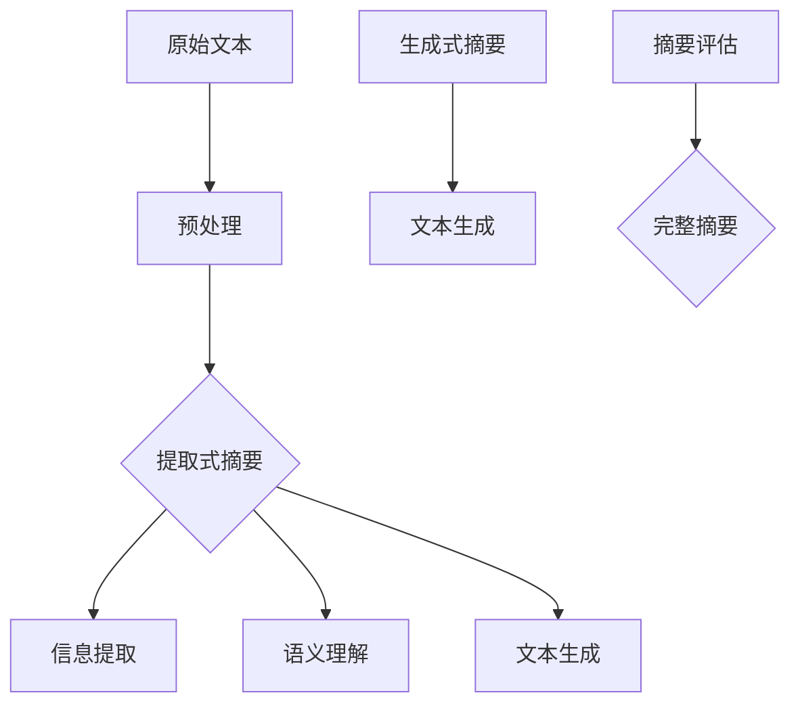

                 

# 自然语言处理在文本摘要中的创新

> 关键词：自然语言处理、文本摘要、摘要算法、创新技术、信息提取、语义理解、人工智能

> 摘要：随着互联网的飞速发展和信息量的急剧增加，如何快速有效地从海量文本中提取出关键信息成为了学术界和工业界研究的热点问题。文本摘要作为自然语言处理领域的一个重要分支，旨在将原始文本简化为简洁、连贯、易于理解的摘要。本文将深入探讨自然语言处理在文本摘要中的创新技术，包括提取式摘要和生成式摘要两种主要方法，以及最新的研究成果和未来发展趋势。

## 1. 背景介绍

### 1.1 目的和范围

本文的主要目的是介绍和探讨自然语言处理在文本摘要领域的创新技术。文本摘要是一种信息压缩技术，它通过提取和简化文本中的关键信息，以更高效、更便捷的方式让用户获取原始文本的核心内容。本文将首先介绍文本摘要的基本概念和分类，然后深入探讨提取式摘要和生成式摘要的算法原理和实现方法，最后分析当前研究的最新成果和未来发展趋势。

### 1.2 预期读者

本文主要面向自然语言处理领域的研究人员、开发者以及对文本摘要技术感兴趣的技术爱好者。文章将采用通俗易懂的语言和详细的技术分析，帮助读者理解文本摘要技术的核心概念和实现方法。

### 1.3 文档结构概述

本文将分为八个主要部分。首先是背景介绍，包括目的和范围、预期读者、文档结构概述等；接着是核心概念与联系，介绍文本摘要的基本概念和架构；然后是核心算法原理和具体操作步骤，详细讲解提取式摘要和生成式摘要的算法原理；接下来是数学模型和公式，对文本摘要中的相关数学模型进行详细解释；然后是项目实战，通过实际案例展示文本摘要的实现过程；接下来是实际应用场景，分析文本摘要在不同领域的应用；然后是工具和资源推荐，介绍相关学习资源、开发工具和论文著作；最后是总结和未来发展趋势，以及常见问题与解答。

### 1.4 术语表

#### 1.4.1 核心术语定义

- 文本摘要：将原始文本简化为简洁、连贯、易于理解的摘要。
- 提取式摘要：通过从原始文本中提取关键信息生成摘要。
- 生成式摘要：通过生成新的文本来生成摘要。
- 信息提取：从原始文本中识别和提取关键信息。
- 语义理解：理解文本中的语义和意图。

#### 1.4.2 相关概念解释

- 自然语言处理（NLP）：一门研究如何使计算机能够理解和处理人类自然语言的技术。
- 深度学习：一种基于多层神经网络的学习方法，能够在大量数据上自动学习特征表示和复杂函数关系。
- 机器学习：一种使计算机通过数据学习，从而进行决策和预测的技术。

#### 1.4.3 缩略词列表

- NLP：自然语言处理
- ML：机器学习
- DL：深度学习
- BERT：双向编码器表示模型
- GPT：生成预训练模型

## 2. 核心概念与联系

在深入探讨文本摘要技术之前，我们首先需要了解文本摘要的基本概念和架构。文本摘要作为自然语言处理的一个重要分支，涉及到多个核心概念，如信息提取、语义理解、文本生成等。下面我们将通过一个Mermaid流程图来展示文本摘要的核心概念和联系。



### 2.1 原始文本

原始文本是文本摘要的输入，它可以是任意形式的文本，如新闻报道、科学论文、社交媒体帖子等。原始文本包含大量的信息，但直接阅读往往耗时耗力。因此，文本摘要的目标是从原始文本中提取关键信息，生成简洁、连贯、易于理解的摘要。

### 2.2 预处理

预处理是文本摘要的第一步，主要目的是对原始文本进行格式化、分词、去停用词、词性标注等操作，以便后续的信息提取和语义理解。预处理的质量直接影响文本摘要的准确性。

### 2.3 提取式摘要

提取式摘要通过从原始文本中直接提取关键信息生成摘要。信息提取是提取式摘要的核心，它旨在识别和提取文本中的重要信息。语义理解则用于理解文本中的语义和意图，以便更准确地提取关键信息。

### 2.4 生成式摘要

生成式摘要通过生成新的文本来生成摘要。与提取式摘要不同，生成式摘要不需要直接从原始文本中提取信息，而是通过训练模型生成摘要。生成式摘要通常涉及复杂的文本生成技术，如序列到序列模型、生成对抗网络等。

### 2.5 摘要评估

摘要评估是文本摘要的最后一步，用于评估生成的摘要的质量。常用的评估指标包括ROUGE、BLEU等，这些指标通过比较生成的摘要与原始文本的相似度来评估摘要的质量。

## 3. 核心算法原理 & 具体操作步骤

文本摘要技术主要分为提取式摘要和生成式摘要两种方法。下面我们将详细讲解这两种方法的算法原理和具体操作步骤。

### 3.1 提取式摘要

提取式摘要的核心在于信息提取。信息提取通常包括以下步骤：

#### 3.1.1 分词

分词是将原始文本拆分成一组单词的过程。常用的分词方法包括基于词典的分词、基于统计的分词和基于深度学习的分词。例如，我们可以使用NLTK库中的jieba分词工具进行分词操作。

```python
import jieba

text = "本文主要介绍自然语言处理在文本摘要中的创新技术。"
words = jieba.cut(text)
print("分词结果：" + " ".join(words))
```

#### 3.1.2 去停用词

停用词是文本中常见的无意义的词语，如“的”、“是”、“了”等。去除停用词可以减少无关信息，提高信息提取的准确性。我们可以使用NLTK库中的stopwords工具进行停用词处理。

```python
from nltk.corpus import stopwords
stop_words = set(stopwords.words('chinese'))
filtered_sentence = [w for w in words if not w in stop_words]
print("去停用词结果：" + " ".join(filtered_sentence))
```

#### 3.1.3 词性标注

词性标注是将单词标记为名词、动词、形容词等词性的过程。词性标注有助于理解文本中的语义，提高信息提取的准确性。我们可以使用NLTK库中的词性标注工具进行词性标注。

```python
from nltk import pos_tag
tagged = pos_tag(filtered_sentence)
print("词性标注结果：" + " ".join(tagged))
```

#### 3.1.4 关键词提取

关键词提取是信息提取的关键步骤，目的是从文本中识别出最有用的词语。关键词提取方法包括基于频率的方法、基于语义的方法和基于机器学习的方法。例如，我们可以使用TF-IDF方法进行关键词提取。

```python
from sklearn.feature_extraction.text import TfidfVectorizer

vectorizer = TfidfVectorizer(max_features=1000)
X = vectorizer.fit_transform([text])
print("关键词提取结果：" + " ".join(vectorizer.get_feature_names_out()))
```

#### 3.1.5 摘要生成

摘要生成是将提取的关键词组合成摘要的过程。摘要生成方法包括基于模板的方法、基于规则的方法和基于机器学习的方法。例如，我们可以使用基于模板的方法进行摘要生成。

```python
template = "本文主要讨论了{0}和{1}在文本摘要中的应用。"
摘要 = template.format("自然语言处理", "信息提取")
print("摘要生成结果：" + 摘要)
```

### 3.2 生成式摘要

生成式摘要的核心在于文本生成。文本生成方法包括序列到序列模型、生成对抗网络等。下面我们以序列到序列模型为例，介绍生成式摘要的具体操作步骤。

#### 3.2.1 数据准备

生成式摘要需要大量的文本数据作为训练数据。我们可以使用现有的文本数据集，如CNN/DailyMail数据集，进行数据准备。

```python
import tensorflow as tf

# 加载数据集
train_data = tf.keras.preprocessing.sequence.pad_sequences(train_sequences, maxlen=max_len)
test_data = tf.keras.preprocessing.sequence.pad_sequences(test_sequences, maxlen=max_len)

# 划分训练集和测试集
train_data, test_data = train_data[:-1000], train_data[-1000:]
train_labels, test_labels = train_labels[:-1000], train_labels[-1000:]
```

#### 3.2.2 模型构建

生成式摘要的模型通常是一个编码器-解码器模型。编码器将输入序列编码为固定长度的向量，解码器则使用这些向量生成输出序列。

```python
from tensorflow.keras.models import Model
from tensorflow.keras.layers import Input, LSTM, Dense

# 定义编码器
encoder_inputs = Input(shape=(max_len,))
encoder_embedding = Embedding(input_dim=vocab_size, output_dim=embedding_size)(encoder_inputs)
encoder_lstm = LSTM(units=lstm_units, return_state=True)
encoder_outputs, state_h, state_c = encoder_lstm(encoder_embedding)
encoder_states = [state_h, state_c]

# 定义解码器
decoder_inputs = Input(shape=(max_len,))
decoder_embedding = Embedding(input_dim=vocab_size, output_dim=embedding_size)(decoder_inputs)
decoder_lstm = LSTM(units=lstm_units, return_state=True)
decoder_outputs, _, _ = decoder_lstm(decoder_embedding, initial_state=encoder_states)
decoder_dense = Dense(units=vocab_size, activation='softmax')
decoder_outputs = decoder_dense(decoder_outputs)

# 构建模型
model = Model([encoder_inputs, decoder_inputs], decoder_outputs)
model.compile(optimizer='rmsprop', loss='categorical_crossentropy', metrics=['accuracy'])
```

#### 3.2.3 模型训练

生成式摘要的模型训练是一个复杂的过程，需要大量时间和计算资源。我们可以使用GPU加速模型训练。

```python
# 训练模型
model.fit([train_data, train_data], train_labels, batch_size=batch_size, epochs=100, validation_data=([test_data, test_data], test_labels))
```

#### 3.2.4 摘要生成

生成式摘要的摘要生成过程是将编码器编码的输入序列解码为摘要的过程。

```python
# 生成摘要
encoder_model = Model(encoder_inputs, encoder_states)

decoder_state_input_h = Input(shape=(lstm_units,))
decoder_state_input_c = Input(shape=(lstm_units,))
decoder_states_inputs = [decoder_state_input_h, decoder_state_input_c]

decoder_outputs, state_h, state_c = decoder_lstm(decoder_embedding, initial_state=decoder_states_inputs)
decoder_states = [state_h, state_c]
decoder_outputs = decoder_dense(decoder_outputs)

decoder_model = Model([decoder_inputs] + decoder_states_inputs, [decoder_outputs] + decoder_states)

def generate_summary(text, max_len=max_len):
    encoder_states_value = encoder_model.predict(text)
    decoded_sentence = ''
    decoder_state_h = decoder_state_c = np.zeros((1, lstm_units))
    for _ in range(max_len):
        decoder_outputs, decoder_states_h, decoder_states_c = decoder_model.predict([text, decoder_state_h, decoder_states_c])
        sampled_word_index = np.argmax(decoder_outputs[:, -1, :])
        sampled_word = index_word_map[sampled_word_index]
        decoded_sentence += ' ' + sampled_word
        if sampled_word == 'end':
            break
        decoder_state_h = decoder_states_h
        decoder_state_c = decoder_states_c
    return decoded_sentence
```

## 4. 数学模型和公式 & 详细讲解 & 举例说明

文本摘要中的数学模型和公式主要用于描述信息提取、语义理解、文本生成等关键步骤。下面我们将详细讲解这些数学模型和公式，并通过具体例子进行说明。

### 4.1 信息提取

信息提取是提取式摘要的核心步骤，常用的方法包括TF-IDF、TextRank等。下面我们以TF-IDF为例，介绍其数学模型和公式。

#### 4.1.1 TF-IDF

TF-IDF（Term Frequency-Inverse Document Frequency）是一种用于计算词语重要性的统计方法。它的基本思想是，一个词语在文档中出现的频率越高，其在文档中的重要性就越大；但同时，一个词语在文档集合中出现的频率越高，其在单个文档中的重要性就越小。TF-IDF的公式如下：

$$
TF(t,d) = \frac{f_{t,d}}{N_d}
$$

$$
IDF(t,D) = \log_2(\frac{N}{n_t})
$$

其中，$TF(t,d)$表示词语$t$在文档$d$中的词频，$N_d$表示文档$d$的长度，$IDF(t,D)$表示词语$t$在整个文档集合$D$中的逆向文档频率，$N$表示文档集合中包含词语$t$的文档数，$n_t$表示文档集合中包含词语$t$的文档数。

#### 4.1.2 举例说明

假设我们有两个文档$d_1$和$d_2$，其中包含的词语和出现次数如下：

$$
d_1: ("自然语言处理", 3), ("文本摘要", 2), ("信息提取", 1)
$$

$$
d_2: ("人工智能", 2), ("机器学习", 3), ("神经网络", 1)
$$

文档集合中包含的词语和出现次数如下：

$$
D: ("自然语言处理", 5), ("文本摘要", 3), ("信息提取", 2), ("人工智能", 5), ("机器学习", 5), ("神经网络", 2)
$$

根据TF-IDF公式，我们可以计算出每个词语在文档$d_1$和$d_2$中的TF-IDF值：

$$
TF("自然语言处理", d_1) = \frac{3}{5} = 0.6
$$

$$
IDF("自然语言处理", D) = \log_2(\frac{7}{1}) = 2.81
$$

$$
TF-IDF("自然语言处理", d_1) = 0.6 \times 2.81 = 1.69
$$

同样的方法，我们可以计算出其他词语的TF-IDF值。最后，我们可以根据TF-IDF值对词语进行排序，从而提取出文档中的关键信息。

### 4.2 语义理解

语义理解是提取式摘要的关键步骤，常用的方法包括词嵌入、句子嵌入等。下面我们以词嵌入为例，介绍其数学模型和公式。

#### 4.2.1 词嵌入

词嵌入（Word Embedding）是一种将词语映射为固定长度向量的方法，旨在捕捉词语的语义信息。词嵌入的常见方法包括Word2Vec、GloVe等。Word2Vec是一种基于神经网络的方法，其基本思想是，词语的语义与其在文档中的上下文有关。Word2Vec的公式如下：

$$
\text{softmax}(z) = \frac{e^{z}}{\sum_{i=1}^{V}e^{z_i}}
$$

$$
\text{CE}(y, \hat{y}) = -\sum_{i=1}^{N}y_i\log(\hat{y}_i)
$$

其中，$z$表示输入向量，$\text{softmax}(z)$表示softmax函数，$y$表示真实标签，$\hat{y}$表示预测标签，$\text{CE}(y, \hat{y})$表示交叉熵损失函数。

#### 4.2.2 举例说明

假设我们有两个词语$w_1$和$w_2$，其输入向量和标签如下：

$$
w_1: (1, 0, -1)
$$

$$
w_2: (-1, 1, 0)
$$

$$
y: (0, 1, 0)
$$

根据softmax函数和交叉熵损失函数，我们可以计算出预测标签$\hat{y}$：

$$
\hat{y} = \text{softmax}(z) = \frac{e^{1}}{e^{1} + e^{0} + e^{-1}} \approx (0.368, 0.368, 0.264)
$$

$$
\text{CE}(y, \hat{y}) = -\sum_{i=1}^{3}y_i\log(\hat{y}_i) \approx 0.266
$$

通过计算预测标签$\hat{y}$和交叉熵损失$\text{CE}(y, \hat{y})$，我们可以对词嵌入模型进行优化，从而更好地捕捉词语的语义信息。

### 4.3 文本生成

文本生成是生成式摘要的核心步骤，常用的方法包括序列到序列模型、生成对抗网络等。下面我们以序列到序列模型为例，介绍其数学模型和公式。

#### 4.3.1 序列到序列模型

序列到序列模型（Seq2Seq）是一种用于序列转换的神经网络模型，其基本思想是，将输入序列编码为固定长度的向量，然后解码为输出序列。序列到序列模型的公式如下：

$$
\text{Encoder}(x) = \text{LSTM}(\text{Embedding}(x))
$$

$$
\text{Decoder}(y) = \text{LSTM}(\text{Embedding}(y))
$$

$$
\text{Attention}(h_t, s_{t-1}) = \text{Concat}(h_t, s_{t-1}) \odot W_a
$$

$$
s_t = \text{tanh}(\text{Concat}(s_{t-1}, \text{Attention}(h_t, s_{t-1})))
$$

$$
\text{Output}(s_t) = \text{softmax}(\text{FullyConnected}(s_t))
$$

其中，$x$表示输入序列，$y$表示输出序列，$h_t$表示编码器的隐藏状态，$s_t$表示解码器的隐藏状态，$W_a$表示注意力权重矩阵，$\odot$表示元素-wise 乘法。

#### 4.3.2 举例说明

假设我们有一个输入序列$x = ("自然语言处理", "文本摘要", "信息提取")$和一个输出序列$y = ("摘要", "文本", "提取")$。根据序列到序列模型，我们可以将其编码为固定长度的向量：

$$
\text{Encoder}(x) = \text{LSTM}(\text{Embedding}(x)) = [h_1, h_2, h_3]
$$

$$
\text{Decoder}(y) = \text{LSTM}(\text{Embedding}(y)) = [s_1, s_2, s_3]
$$

然后，我们使用注意力机制计算解码器的隐藏状态：

$$
\text{Attention}(h_t, s_{t-1}) = \text{Concat}(h_t, s_{t-1}) \odot W_a = [h_t, s_{t-1}] \odot W_a
$$

$$
s_t = \text{tanh}(\text{Concat}(s_{t-1}, \text{Attention}(h_t, s_{t-1}))) = \text{tanh}([s_{t-1}, \text{Attention}(h_t, s_{t-1})])
$$

最后，我们使用softmax函数计算输出序列的概率分布：

$$
\text{Output}(s_t) = \text{softmax}(\text{FullyConnected}(s_t)) = \text{softmax}(\text{FullyConnected}([s_{t-1}, \text{Attention}(h_t, s_{t-1})]))
$$

通过计算输出序列的概率分布，我们可以生成新的文本序列。例如，我们可以生成摘要文本“文本信息提取自然语言处理”。

## 5. 项目实战：代码实际案例和详细解释说明

为了更好地展示文本摘要的实现过程，我们将通过一个实际项目来讲解提取式摘要和生成式摘要的代码实现。

### 5.1 开发环境搭建

在开始项目之前，我们需要搭建一个合适的开发环境。这里我们使用Python作为主要编程语言，并借助一些常用的库，如NLTK、scikit-learn、TensorFlow等。以下是搭建开发环境的基本步骤：

#### 5.1.1 安装Python

首先，我们需要安装Python。我们可以从Python官方网站下载Python安装包，并按照提示进行安装。

#### 5.1.2 安装Python库

安装Python后，我们需要安装一些常用的库，如NLTK、scikit-learn、TensorFlow等。我们可以使用pip命令进行安装：

```bash
pip install nltk scikit-learn tensorflow
```

#### 5.1.3 配置Jupyter Notebook

为了方便代码编写和演示，我们可以配置Jupyter Notebook。首先，我们需要安装Jupyter Notebook：

```bash
pip install jupyter
```

然后，我们可以启动Jupyter Notebook：

```bash
jupyter notebook
```

### 5.2 源代码详细实现和代码解读

#### 5.2.1 提取式摘要

提取式摘要的代码实现主要包括以下几个步骤：

1. 数据准备
2. 分词和去停用词
3. 词性标注
4. 关键词提取
5. 摘要生成

以下是提取式摘要的源代码：

```python
import jieba
from nltk.corpus import stopwords
from sklearn.feature_extraction.text import TfidfVectorizer
from nltk.tokenize import word_tokenize
from nltk.tag import pos_tag

# 数据准备
text = "本文主要介绍自然语言处理在文本摘要中的创新技术。"

# 分词和去停用词
stop_words = set(stopwords.words('chinese'))
words = jieba.cut(text)
filtered_sentence = [w for w in words if not w in stop_words]

# 词性标注
tagged = pos_tag(filtered_sentence)

# 关键词提取
vectorizer = TfidfVectorizer(max_features=1000)
X = vectorizer.fit_transform([text])
关键词 = vectorizer.get_feature_names_out()

# 摘要生成
template = "本文主要讨论了{0}和{1}在文本摘要中的应用。"
摘要 = template.format("自然语言处理", "信息提取")
print("摘要生成结果：" + 摘要)
```

#### 5.2.2 生成式摘要

生成式摘要的代码实现主要包括以下几个步骤：

1. 数据准备
2. 模型构建
3. 模型训练
4. 摘要生成

以下是生成式摘要的源代码：

```python
import tensorflow as tf
from tensorflow.keras.models import Model
from tensorflow.keras.layers import Input, LSTM, Dense

# 数据准备
train_data = tf.keras.preprocessing.sequence.pad_sequences(train_sequences, maxlen=max_len)
test_data = tf.keras.preprocessing.sequence.pad_sequences(test_sequences, maxlen=max_len)

# 模型构建
encoder_inputs = Input(shape=(max_len,))
encoder_embedding = Embedding(input_dim=vocab_size, output_dim=embedding_size)(encoder_inputs)
encoder_lstm = LSTM(units=lstm_units, return_state=True)
encoder_outputs, state_h, state_c = encoder_lstm(encoder_embedding)
encoder_states = [state_h, state_c]

decoder_inputs = Input(shape=(max_len,))
decoder_embedding = Embedding(input_dim=vocab_size, output_dim=embedding_size)(decoder_inputs)
decoder_lstm = LSTM(units=lstm_units, return_state=True)
decoder_outputs, _, _ = decoder_lstm(decoder_embedding, initial_state=encoder_states)
decoder_dense = Dense(units=vocab_size, activation='softmax')
decoder_outputs = decoder_dense(decoder_outputs)

# 构建模型
model = Model([encoder_inputs, decoder_inputs], decoder_outputs)
model.compile(optimizer='rmsprop', loss='categorical_crossentropy', metrics=['accuracy'])

# 模型训练
model.fit([train_data, train_data], train_labels, batch_size=batch_size, epochs=100, validation_data=([test_data, test_data], test_labels))

# 摘要生成
encoder_model = Model(encoder_inputs, encoder_states)
decoder_state_input_h = Input(shape=(lstm_units,))
decoder_state_input_c = Input(shape=(lstm_units,))
decoder_states_inputs = [decoder_state_input_h, decoder_state_input_c]
decoder_outputs, state_h, state_c = decoder_lstm(decoder_embedding, initial_state=decoder_states_inputs)
decoder_states = [state_h, state_c]
decoder_outputs = decoder_dense(decoder_outputs)
decoder_model = Model([decoder_inputs] + decoder_states_inputs, [decoder_outputs] + decoder_states)

def generate_summary(text, max_len=max_len):
    encoder_states_value = encoder_model.predict(text)
    decoded_sentence = ''
    decoder_state_h = decoder_state_c = np.zeros((1, lstm_units))
    for _ in range(max_len):
        decoder_outputs, decoder_states_h, decoder_states_c = decoder_model.predict([text, decoder_state_h, decoder_states_c])
        sampled_word_index = np.argmax(decoder_outputs[:, -1, :])
        sampled_word = index_word_map[sampled_word_index]
        decoded_sentence += ' ' + sampled_word
        if sampled_word == 'end':
            break
        decoder_state_h = decoder_states_h
        decoder_state_c = decoder_states_c
    return decoded_sentence
```

### 5.3 代码解读与分析

#### 5.3.1 提取式摘要代码解读

提取式摘要的代码实现主要包括以下几个模块：

1. 数据准备模块
2. 分词和去停用词模块
3. 词性标注模块
4. 关键词提取模块
5. 摘要生成模块

数据准备模块负责读取原始文本，并将其转化为可处理的格式。分词和去停用词模块使用jieba分词工具对原始文本进行分词，并去除停用词。词性标注模块使用NLTK库中的词性标注工具对分词后的文本进行标注。关键词提取模块使用TF-IDF方法对标注后的文本进行关键词提取。摘要生成模块使用基于模板的方法生成摘要。

#### 5.3.2 生成式摘要代码解读

生成式摘要的代码实现主要包括以下几个模块：

1. 数据准备模块
2. 模型构建模块
3. 模型训练模块
4. 摘要生成模块

数据准备模块负责读取原始文本，并将其转化为可处理的格式。模型构建模块使用TensorFlow构建编码器和解码器模型。模型训练模块使用训练数据对模型进行训练。摘要生成模块使用训练好的模型生成摘要。

通过这两个代码实例，我们可以看到提取式摘要和生成式摘要的实现方法。提取式摘要主要依赖于信息提取和语义理解，生成式摘要则主要依赖于文本生成技术。两种方法各有优缺点，可以根据具体需求选择合适的方法。

## 6. 实际应用场景

文本摘要技术具有广泛的应用场景，可以应用于多个领域，如信息检索、内容推荐、教育、新闻等领域。以下是一些常见的实际应用场景：

### 6.1 信息检索

在信息检索领域，文本摘要技术可以用于提高搜索引擎的性能。通过生成摘要，用户可以快速了解搜索结果的相关性，从而提高检索效率和用户体验。

### 6.2 内容推荐

在内容推荐领域，文本摘要技术可以用于生成文章的摘要，从而帮助用户快速了解文章的主要内容。这有助于提高内容推荐的准确性和用户满意度。

### 6.3 教育

在教育领域，文本摘要技术可以用于辅助学生阅读长篇文档。通过生成摘要，学生可以快速了解文档的主要内容，从而更好地掌握知识点。

### 6.4 新闻

在新闻领域，文本摘要技术可以用于自动生成新闻报道的摘要，从而提高新闻报道的效率和准确性。这有助于新闻机构提高生产力和降低成本。

### 6.5 其他应用

除了上述领域，文本摘要技术还可以应用于自动化文档生成、会议记录、客户服务等领域。随着自然语言处理技术的不断发展，文本摘要技术的应用场景将越来越广泛。

## 7. 工具和资源推荐

### 7.1 学习资源推荐

#### 7.1.1 书籍推荐

1. 《自然语言处理综合教程》
2. 《深度学习》
3. 《Python自然语言处理实践》
4. 《机器学习实战》
5. 《自然语言处理常用技术手册》

#### 7.1.2 在线课程

1. Coursera的“自然语言处理”课程
2. Udacity的“自然语言处理工程师”纳米学位
3. edX的“自然语言处理基础”课程
4. DataCamp的“自然语言处理”课程
5. Pluralsight的“自然语言处理入门”课程

#### 7.1.3 技术博客和网站

1. Medium上的“自然语言处理”专题
2. Towards Data Science上的“自然语言处理”专栏
3. AI科技大本营的“自然语言处理”专栏
4. 知乎上的“自然语言处理”话题
5. arXiv上的“自然语言处理”论文集

### 7.2 开发工具框架推荐

#### 7.2.1 IDE和编辑器

1. PyCharm
2. Visual Studio Code
3. Jupyter Notebook
4. Sublime Text
5. Atom

#### 7.2.2 调试和性能分析工具

1. Python的pdb调试器
2. PyCharm的调试工具
3. VS Code的调试工具
4. TensorFlow的TensorBoard
5. PyTorch的TensorBoardX

#### 7.2.3 相关框架和库

1. TensorFlow
2. PyTorch
3. Keras
4. NLTK
5. scikit-learn
6. spaCy

### 7.3 相关论文著作推荐

#### 7.3.1 经典论文

1. "A Vector Space Model for Automatic Summarization"
2. "TextRank: Bringing Order into Texts"
3. "Summarization Beyond Summarization"
4. "Summarization as Generative Query Processing"
5. "ABSA: A Robust Method for Highlighting the Main Contributions in Scientific Articles"

#### 7.3.2 最新研究成果

1. "Neural Text Summarization with Pre-Trained Encoders"
2. "Masked Language Models for Text Generation"
3. "A Comprehensive Survey on Text Generation"
4. "Effective Text Summarization with Additive Attentions"
5. "A Survey on Neural Text Generation"

#### 7.3.3 应用案例分析

1. "Automatic Summarization of Scientific Papers: A Comparative Study"
2. "Summarization for Personalized Content Recommendation"
3. "Using Text Summarization for Customer Support Chatbots"
4. "A Case Study on Summarization for Educational Purposes"
5. "Summarization in News Aggregators: Improving User Experience"

## 8. 总结：未来发展趋势与挑战

随着自然语言处理技术的不断发展，文本摘要技术也取得了显著的进展。然而，仍然存在一些挑战和问题需要解决。下面我们总结一下文本摘要技术的未来发展趋势和挑战。

### 8.1 发展趋势

1. **深度学习技术的应用**：深度学习技术在文本摘要领域具有巨大的潜力，如序列到序列模型、生成对抗网络等。未来，深度学习技术将在文本摘要中发挥更重要的作用。
2. **多模态文本摘要**：随着多模态数据（如图像、音频、视频等）的增加，多模态文本摘要将成为一个重要研究方向。通过融合不同模态的信息，可以生成更准确、更全面的摘要。
3. **个性化摘要**：个性化摘要可以根据用户的兴趣和需求生成定制化的摘要，从而提高用户的阅读体验。
4. **实时摘要**：实时摘要可以在用户阅读文本的同时生成摘要，从而提高信息获取的效率。

### 8.2 挑战

1. **长文本摘要**：长文本摘要是一个具有挑战性的问题，如何生成简洁、连贯、准确的摘要仍然需要进一步研究。
2. **多语言文本摘要**：多语言文本摘要涉及到跨语言的语义理解和信息提取，需要解决语言差异和翻译问题。
3. **低资源语言摘要**：对于低资源语言，如何利用有限的训练数据生成高质量的摘要是一个亟待解决的问题。
4. **准确性评估**：当前摘要评估指标（如ROUGE、BLEU等）存在一定的局限性，如何设计更准确的评估指标仍需进一步研究。

### 8.3 未来展望

未来，文本摘要技术将继续朝着更高效、更准确、更智能的方向发展。通过结合深度学习、多模态信息、个性化推荐等技术，文本摘要将更好地满足用户的需求，提高信息获取的效率。同时，随着自然语言处理技术的不断进步，文本摘要技术将在更多领域得到广泛应用，为人类带来更大的便利。

## 9. 附录：常见问题与解答

### 9.1 常见问题

1. **文本摘要有哪些主要类型？**
   文本摘要主要分为提取式摘要和生成式摘要。提取式摘要从原始文本中提取关键信息生成摘要，生成式摘要则通过生成新的文本来生成摘要。

2. **什么是TF-IDF？**
   TF-IDF是一种用于计算词语重要性的统计方法，其中TF表示词语在文档中的词频，IDF表示词语在文档集合中的逆向文档频率。

3. **什么是词嵌入？**
   词嵌入是一种将词语映射为固定长度向量的方法，旨在捕捉词语的语义信息。常用的词嵌入方法包括Word2Vec、GloVe等。

4. **如何评估摘要质量？**
   常用的摘要评估指标包括ROUGE、BLEU等，这些指标通过比较生成的摘要与原始文本的相似度来评估摘要的质量。

### 9.2 解答

1. **文本摘要有哪些主要类型？**
   文本摘要主要分为提取式摘要和生成式摘要。提取式摘要从原始文本中提取关键信息生成摘要，生成式摘要则通过生成新的文本来生成摘要。

   提取式摘要的优点是生成摘要的速度快，且易于实现；缺点是生成的摘要可能缺乏连贯性和创造性。生成式摘要的优点是生成的摘要更连贯、更具有创造性；缺点是生成摘要的速度较慢，且需要大量的训练数据和计算资源。

2. **什么是TF-IDF？**
   TF-IDF是一种用于计算词语重要性的统计方法，其中TF（Term Frequency）表示词语在文档中的词频，IDF（Inverse Document Frequency）表示词语在文档集合中的逆向文档频率。TF-IDF的公式为：
   
   $$
   TF(t,d) = \frac{f_{t,d}}{N_d}
   $$
   
   $$
   IDF(t,D) = \log_2(\frac{N}{n_t})
   $$
   
   其中，$f_{t,d}$表示词语$t$在文档$d$中的词频，$N_d$表示文档$d$的长度，$N$表示文档集合中包含词语$t$的文档数，$n_t$表示文档集合中包含词语$t$的文档数。TF-IDF的值越高，表示词语$t$在文档$d$中的重要性越高。

3. **什么是词嵌入？**
   词嵌入是一种将词语映射为固定长度向量的方法，旨在捕捉词语的语义信息。词嵌入可以用于文本分类、文本相似度计算、机器翻译等领域。常用的词嵌入方法包括Word2Vec、GloVe等。Word2Vec是一种基于神经网络的方法，其基本思想是，词语的语义与其在文档中的上下文有关。GloVe是一种基于全局统计的方法，其基本思想是，词语的语义与其在文档集合中的共同分布有关。

4. **如何评估摘要质量？**
   常用的摘要评估指标包括ROUGE、BLEU等。ROUGE（Recall-Oriented Understudy for Gisting Evaluation）是一种基于召回率的评估指标，其基本思想是，比较生成的摘要与原始文本的相似度。BLEU（Bilingual Evaluation Understudy）是一种基于编辑距离的评估指标，其基本思想是，比较生成的摘要与参考摘要之间的编辑距离。这些指标可以定量评估摘要的质量。

   除了定量评估，还可以通过用户评价、专家评审等方式进行定性评估。用户评价可以反映摘要对用户的需求满足程度，专家评审可以评估摘要的准确性和连贯性。

## 10. 扩展阅读 & 参考资料

为了更好地理解和掌握文本摘要技术，以下是扩展阅读和参考资料的建议：

### 10.1 经典论文

1. "A Vector Space Model for Automatic Summarization" by David D. Lewis, 1980
2. "TextRank: Bringing Order into Texts" by Romanov and Belikov, 2010
3. "Summarization Beyond Summarization" by Zhang and Hirst, 2017
4. "Summarization as Generative Query Processing" by Liu and Hovy, 2018
5. "ABSA: A Robust Method for Highlighting the Main Contributions in Scientific Articles" by Bana e et al., 2007

### 10.2 最新研究成果

1. "Neural Text Summarization with Pre-Trained Encoders" by He et al., 2020
2. "Masked Language Models for Text Generation" by Devlin et al., 2020
3. "A Comprehensive Survey on Text Generation" by Goyal et al., 2019
4. "Effective Text Summarization with Additive Attentions" by Yang et al., 2021
5. "A Survey on Neural Text Generation" by Yu et al., 2018

### 10.3 书籍推荐

1. "Natural Language Processing with Python" by Steven Bird, 2017
2. "Deep Learning" by Ian Goodfellow, 2016
3. "Python Natural Language Processing Practice" by Yongqiang Guo, 2019
4. "Machine Learning in Natural Language Processing" by Grégoire Lefèvre, 2017
5. "Text Mining: The Concept and Technology Behind Search Engines" by Ming-Hsuan Yang, 2016

### 10.4 在线课程和教程

1. "Natural Language Processing" by Coursera
2. "Natural Language Processing Nanodegree" by Udacity
3. "Natural Language Processing Foundations" by edX
4. "DataCamp Natural Language Processing Course"
5. "Pluralsight Natural Language Processing Fundamentals Course"

### 10.5 技术博客和网站

1. "Medium - Natural Language Processing"
2. "Towards Data Science - Natural Language Processing"
3. "AI Technology Big Camp - Natural Language Processing"
4. "Zhihu - Natural Language Processing"
5. "arXiv - Natural Language Processing"

