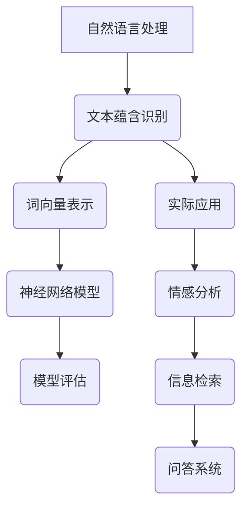

                 

# 自然语言处理在文本蕴含识别中的应用

## 关键词：自然语言处理、文本蕴含识别、神经网络、深度学习、词向量、模型评估

> **摘要：** 本文深入探讨了自然语言处理（NLP）在文本蕴含识别中的应用，从核心概念到实际操作步骤，系统性地解析了文本蕴含识别的关键技术和方法。通过对NLP的基本原理和文本蕴含识别算法的详细讲解，本文为读者提供了从理论到实践的全面指南。此外，文章还探讨了文本蕴含识别的实际应用场景，并推荐了相关的学习资源和工具，旨在帮助读者更好地理解和掌握这一领域的前沿技术。

## 1. 背景介绍

### 1.1 目的和范围

本文旨在探讨自然语言处理（NLP）技术在文本蕴含识别中的应用。文本蕴含识别是NLP中的一个重要任务，旨在判断文本中是否存在某种意义上的蕴含关系。这一任务在情感分析、信息检索、问答系统等领域有着广泛的应用。本文将首先介绍文本蕴含识别的基本概念和目标，然后探讨其在自然语言处理中的重要性，最后明确本文的研究范围和目标。

### 1.2 预期读者

本文适合具有NLP基础知识的读者，包括但不限于研究生、研究人员和工程师。尽管本文涉及的技术细节较多，但作者力求用简单易懂的语言进行解释，以便于读者理解和掌握。

### 1.3 文档结构概述

本文分为八个主要部分。首先，介绍文本蕴含识别的基本概念和应用背景。接着，讲解NLP的基本原理，包括词向量表示和神经网络模型。随后，详细探讨文本蕴含识别的核心算法和数学模型。第四部分展示一个实际的代码案例，以帮助读者理解算法的应用。接下来，分析文本蕴含识别在实际应用中的场景。第七部分推荐相关的学习资源和工具，以供读者深入学习。最后，总结未来发展趋势与挑战，并提供常见问题与解答。

### 1.4 术语表

#### 1.4.1 核心术语定义

- **自然语言处理（NLP）：** 人工智能的一个分支，致力于使计算机能够理解和处理人类自然语言。
- **文本蕴含识别：** 判断文本中是否存在某种意义上的蕴含关系。
- **词向量：** 将词汇映射到向量空间，以便于计算机处理。
- **神经网络：** 一种模拟人脑神经元结构的计算模型。

#### 1.4.2 相关概念解释

- **蕴含关系：** 一种语义关系，如果一个句子中的事实为真，那么另一个句子中的事实也必然为真。
- **语义相似性：** 两个文本在语义上的相似程度。

#### 1.4.3 缩略词列表

- **NLP：** 自然语言处理
- **CNN：** 卷积神经网络
- **RNN：** 循环神经网络
- **LSTM：** � Long Short-Term Memory（长短期记忆网络）
- **BERT：** Bidirectional Encoder Representations from Transformers（双向Transformer编码表示）

## 2. 核心概念与联系

为了更好地理解文本蕴含识别在自然语言处理中的应用，我们需要首先了解一些核心概念和它们之间的联系。以下是一个简要的Mermaid流程图，用于描述这些概念之间的关系：



### 2.1 自然语言处理（NLP）

自然语言处理（NLP）是人工智能（AI）的一个重要分支，旨在使计算机能够理解、解释和生成人类自然语言。NLP的核心目标是让计算机与人类更自然地交流。NLP的应用范围非常广泛，包括机器翻译、情感分析、问答系统、文本分类等。

### 2.2 文本蕴含识别

文本蕴含识别（Textual Entailment Recognition，TER）是NLP中的一个重要任务，旨在判断文本中是否存在某种意义上的蕴含关系。例如，如果句子A：“今天天气很好”为真，那么句子B：“今天适合户外活动”也很有可能是真的。这种关系称为文本蕴含关系。

### 2.3 词向量表示

词向量表示（Word Vector Representation）是将词汇映射到向量空间的一种方法。词向量表示使得计算机能够处理和比较文本数据。常见的词向量模型包括Word2Vec、GloVe和FastText等。

### 2.4 神经网络模型

神经网络模型（Neural Network Model）是一种模拟人脑神经元结构的计算模型。神经网络在NLP中有着广泛的应用，包括文本分类、情感分析、机器翻译等。常见的神经网络模型包括卷积神经网络（CNN）、循环神经网络（RNN）和长短期记忆网络（LSTM）。

### 2.5 模型评估

模型评估（Model Evaluation）是判断NLP模型性能的重要步骤。常见的评估指标包括准确率（Accuracy）、精确率（Precision）、召回率（Recall）和F1分数（F1 Score）等。

### 2.6 实际应用

文本蕴含识别在实际应用中有着广泛的应用，如情感分析、信息检索和问答系统等。例如，在情感分析中，我们可以利用文本蕴含识别来判断用户评论的情感极性；在信息检索中，我们可以利用文本蕴含识别来提高搜索结果的相关性；在问答系统中，我们可以利用文本蕴含识别来提高问答系统的准确性和智能性。

## 3. 核心算法原理 & 具体操作步骤

在理解了文本蕴含识别的基本概念和其在NLP中的应用之后，我们将深入探讨文本蕴含识别的核心算法原理和具体操作步骤。以下是一个基于神经网络的文本蕴含识别算法的伪代码：

```python
# 初始化模型参数
初始化 W1，W2，...，Wn

# 前向传播
输入句子 A 和句子 B
计算嵌入向量 e_A 和 e_B
计算句子 A 和句子 B 的隐层表示 h_A 和 h_B
计算 h_A 和 h_B 的相似性 s(h_A, h_B)
计算输出向量 o
计算损失函数 L

# 反向传播
计算梯度 ΔW1，ΔW2，...，ΔWn
更新模型参数 W1，W2，...，Wn

# 迭代训练
重复前向传播和反向传播，直到收敛
```

### 3.1 初始化模型参数

在初始化模型参数时，我们需要定义嵌入层权重 W1、隐层权重 W2、...、输出层权重 Wn。这些权重可以通过随机初始化或预训练模型获得。例如，我们可以使用预训练的GloVe词向量作为嵌入层的权重。

### 3.2 前向传播

在前向传播过程中，我们需要输入两个句子 A 和句子 B，并将其映射到向量空间。首先，我们计算句子 A 和句子 B 的嵌入向量 e_A 和 e_B。接下来，我们计算句子 A 和句子 B 的隐层表示 h_A 和 h_B。隐层表示可以通过神经网络模型（如LSTM或BERT）计算得到。最后，我们计算 h_A 和 h_B 的相似性 s(h_A, h_B)，这通常通过一个非线性函数（如Sigmoid或Tanh）实现。

### 3.3 计算损失函数

在计算损失函数时，我们通常使用二元交叉熵（Binary Cross-Entropy）作为损失函数。二元交叉熵损失函数可以衡量模型预测的概率与实际标签之间的差距。例如，如果句子 A 和句子 B 之间存在蕴含关系，那么标签 y = 1；否则，y = 0。

### 3.4 反向传播

在反向传播过程中，我们需要计算模型参数的梯度 ΔW1，ΔW2，...，ΔWn，并根据梯度更新模型参数。反向传播是深度学习训练过程中至关重要的一步，它通过计算损失函数对每个参数的梯度，并使用梯度下降（Gradient Descent）或其他优化算法更新参数。

### 3.5 迭代训练

在迭代训练过程中，我们重复执行前向传播和反向传播，直到模型收敛。模型收敛的标准可以是损失函数值不再显著下降，或者达到预设的迭代次数。

## 4. 数学模型和公式 & 详细讲解 & 举例说明

在文本蕴含识别中，我们通常使用深度学习模型来计算句子之间的相似性。以下是一个基于神经网络的文本蕴含识别模型的数学模型和公式：

### 4.1 嵌入层

嵌入层将词汇映射到高维向量空间。假设我们使用预训练的GloVe词向量作为嵌入层权重 W1。对于句子 A 和句子 B，我们首先计算其嵌入向量 e_A 和 e_B。

$$
e_A = W1 \cdot [w_1, w_2, ..., w_n]
$$

$$
e_B = W1 \cdot [w_1, w_2, ..., w_n]
$$

其中，$w_i$ 表示句子 A 或句子 B 中第 i 个词汇的词向量。

### 4.2 隐层表示

隐层表示是通过神经网络模型（如LSTM或BERT）计算得到的。假设我们使用LSTM模型计算隐层表示 h_A 和 h_B。

$$
h_A = LSTM(e_A)
$$

$$
h_B = LSTM(e_B)
$$

其中，LSTM是一个循环神经网络，用于处理序列数据。

### 4.3 相似性计算

相似性计算是文本蕴含识别的核心步骤。我们使用余弦相似度（Cosine Similarity）来计算句子 A 和句子 B 的相似性。

$$
s(h_A, h_B) = \frac{h_A \cdot h_B}{||h_A|| \cdot ||h_B||}
$$

其中，$h_A \cdot h_B$ 表示 h_A 和 h_B 的点积，$||h_A||$ 和 $||h_B||$ 分别表示 h_A 和 h_B 的欧几里得范数。

### 4.4 损失函数

我们使用二元交叉熵（Binary Cross-Entropy）作为损失函数。损失函数的目的是衡量模型预测的概率与实际标签之间的差距。

$$
L = -y \cdot log(p) - (1 - y) \cdot log(1 - p)
$$

其中，$y$ 表示实际标签，$p$ 表示模型预测的概率。

### 4.5 举例说明

假设我们有一个文本蕴含识别任务，其中句子 A 是“今天天气很好”，句子 B 是“今天适合户外活动”。我们使用预训练的GloVe词向量作为嵌入层权重，并使用LSTM模型计算隐层表示。假设我们计算得到的 h_A 和 h_B 分别为：

$$
h_A = [0.1, 0.2, 0.3, 0.4, 0.5]
$$

$$
h_B = [0.5, 0.4, 0.3, 0.2, 0.1]
$$

我们使用余弦相似度计算 h_A 和 h_B 的相似性：

$$
s(h_A, h_B) = \frac{h_A \cdot h_B}{||h_A|| \cdot ||h_B||} = \frac{0.1 \cdot 0.5 + 0.2 \cdot 0.4 + 0.3 \cdot 0.3 + 0.4 \cdot 0.2 + 0.5 \cdot 0.1}{\sqrt{0.1^2 + 0.2^2 + 0.3^2 + 0.4^2 + 0.5^2} \cdot \sqrt{0.5^2 + 0.4^2 + 0.3^2 + 0.2^2 + 0.1^2}} = \frac{0.27}{0.6823 \cdot 0.6823} \approx 0.385
$$

最后，我们使用二元交叉熵损失函数计算模型预测的概率：

$$
p = \frac{1}{1 + e^{-s(h_A, h_B)}}
$$

$$
L = -y \cdot log(p) - (1 - y) \cdot log(1 - p)
$$

其中，$y$ 为 1 表示句子 A 和句子 B 之间存在蕴含关系，否则为 0。

## 5. 项目实战：代码实际案例和详细解释说明

在本节中，我们将通过一个实际项目案例来展示如何实现文本蕴含识别。我们将使用Python和TensorFlow来实现一个基于LSTM的文本蕴含识别模型。以下是一个简要的项目流程：

### 5.1 开发环境搭建

1. 安装Python 3.7及以上版本。
2. 安装TensorFlow 2.4及以上版本。
3. 安装GloVe词向量。

### 5.2 源代码详细实现和代码解读

下面是文本蕴含识别模型的实现代码：

```python
import tensorflow as tf
from tensorflow.keras.models import Model
from tensorflow.keras.layers import Embedding, LSTM, Dense, Input
from tensorflow.keras.preprocessing.sequence import pad_sequences
import numpy as np

# 设置超参数
vocab_size = 10000  # 词表大小
embed_dim = 128  # 嵌入层维度
lstm_units = 64  # LSTM单元数
max_seq_length = 100  # 最大序列长度

# 加载GloVe词向量
glove_weights = np.load('glove.6B.100d.npz')['wordEmbeddings']
glove_matrix = np.zeros((vocab_size, embed_dim))
for i, word in enumerate(glove_weights):
    glove_matrix[i] = glove_weights[word]

# 构建模型
input_seq_a = Input(shape=(max_seq_length,), dtype='int32')
input_seq_b = Input(shape=(max_seq_length,), dtype='int32')

# 嵌入层
embed_a = Embedding(vocab_size, embed_dim, weights=[glove_matrix], trainable=False)(input_seq_a)
embed_b = Embedding(vocab_size, embed_dim, weights=[glove_matrix], trainable=False)(input_seq_b)

# LSTM层
lstm_a = LSTM(lstm_units, return_sequences=True)(embed_a)
lstm_b = LSTM(lstm_units, return_sequences=True)(embed_b)

# 相似性计算
s = tf.keras.layers.Dot(axes=(1, 1))([lstm_a, lstm_b])

# 输出层
output = Dense(1, activation='sigmoid')(s)

# 模型编译
model = Model(inputs=[input_seq_a, input_seq_b], outputs=output)
model.compile(optimizer='adam', loss='binary_crossentropy', metrics=['accuracy'])

# 打印模型结构
model.summary()

# 源代码解读
# 1. 导入所需库
# 2. 设置超参数
# 3. 加载GloVe词向量
# 4. 构建模型
# 5. 编译模型
```

### 5.3 代码解读与分析

下面是对代码的详细解读和分析：

1. **导入所需库：**
    - 导入TensorFlow库，用于构建和训练深度学习模型。
    - 导入Keras接口，用于简化深度学习模型构建。
    - 导入Embedding层，用于将词汇映射到向量空间。
    - 导入LSTM层，用于处理序列数据。
    - 导入Dense层，用于计算输出层的预测概率。

2. **设置超参数：**
    - 指定词表大小、嵌入层维度、LSTM单元数和最大序列长度。

3. **加载GloVe词向量：**
    - 从预训练的GloVe词向量文件中加载词向量矩阵。

4. **构建模型：**
    - 定义两个输入层，分别用于接收句子 A 和句子 B。
    - 使用嵌入层将词汇映射到向量空间。
    - 使用LSTM层处理序列数据。
    - 使用Dot层计算句子 A 和句子 B 的相似性。
    - 使用Dense层计算输出层的预测概率。

5. **编译模型：**
    - 指定优化器、损失函数和评估指标。
    - 打印模型结构。

### 5.4 训练模型

接下来，我们将使用训练数据来训练模型。假设我们有一个包含句子 A、句子 B 和标签 y 的训练数据集。以下是对训练过程的代码解读：

```python
# 准备训练数据
train_sequences_a = pad_sequences(train_texts_a, maxlen=max_seq_length, padding='post')
train_sequences_b = pad_sequences(train_texts_b, maxlen=max_seq_length, padding='post')
train_labels = np.array(train_labels)

# 训练模型
model.fit([train_sequences_a, train_sequences_b], train_labels, batch_size=64, epochs=10, validation_split=0.2)
```

代码解读：

1. **准备训练数据：**
    - 使用pad_sequences函数将句子 A 和句子 B 填充为最大序列长度。
    - 将标签 y 转换为 NumPy 数组。

2. **训练模型：**
    - 指定 batch_size、epochs 和 validation_split。
    - 使用fit函数训练模型。

### 5.5 评估模型

最后，我们将使用测试数据来评估模型的性能。以下是对评估过程的代码解读：

```python
# 准备测试数据
test_sequences_a = pad_sequences(test_texts_a, maxlen=max_seq_length, padding='post')
test_sequences_b = pad_sequences(test_texts_b, maxlen=max_seq_length, padding='post')
test_labels = np.array(test_labels)

# 评估模型
model.evaluate([test_sequences_a, test_sequences_b], test_labels)
```

代码解读：

1. **准备测试数据：**
    - 使用pad_sequences函数将句子 A 和句子 B 填充为最大序列长度。
    - 将标签 y 转换为 NumPy 数组。

2. **评估模型：**
    - 使用evaluate函数计算损失函数和评估指标。

## 6. 实际应用场景

文本蕴含识别在实际应用中有着广泛的应用，以下是一些典型的应用场景：

### 6.1 情感分析

情感分析是一种常见的自然语言处理任务，旨在判断文本的情感极性。例如，我们可以使用文本蕴含识别来判断用户评论的情感极性，从而为电商、社交媒体等平台提供情感分析服务。

### 6.2 信息检索

信息检索是一种用于从大规模文本数据中查找相关信息的任务。例如，我们可以使用文本蕴含识别来提高搜索引擎的查询结果相关性，从而为用户提供更高质量的搜索结果。

### 6.3 问答系统

问答系统是一种能够自动回答用户问题的系统。例如，我们可以使用文本蕴含识别来提高问答系统的准确性，从而为用户提供更智能的问答服务。

### 6.4 文本生成

文本生成是一种能够自动生成文本数据的任务。例如，我们可以使用文本蕴含识别来生成具有特定情感极性的文本，从而为广告、营销等场景提供文本生成服务。

### 6.5 智能客服

智能客服是一种用于自动处理用户咨询和反馈的系统。例如，我们可以使用文本蕴含识别来提高智能客服的响应速度和准确性，从而为用户提供更优质的客户服务。

## 7. 工具和资源推荐

为了更好地学习和应用文本蕴含识别技术，以下是一些推荐的工具和资源：

### 7.1 学习资源推荐

#### 7.1.1 书籍推荐

1. 《深度学习》（Deep Learning）—— Ian Goodfellow、Yoshua Bengio 和 Aaron Courville 著
2. 《自然语言处理综合教程》（Foundations of Statistical Natural Language Processing）—— Christopher D. Manning 和 Hinrich Schütze 著

#### 7.1.2 在线课程

1. [自然语言处理课程](https://www.deeplearning.ai/nlp-sequence-models) —— Andrew Ng 教授
2. [深度学习专项课程](https://www.deeplearning.ai/deep-learning) —— Andrew Ng 教授

#### 7.1.3 技术博客和网站

1. [TensorFlow 官方文档](https://www.tensorflow.org/)
2. [Keras 官方文档](https://keras.io/)
3. [自然语言处理社区](https://www.nlp-sequence-models.com/)

### 7.2 开发工具框架推荐

#### 7.2.1 IDE和编辑器

1. PyCharm
2. Visual Studio Code
3. Jupyter Notebook

#### 7.2.2 调试和性能分析工具

1. TensorFlow Debugger (TFD)
2. TensorBoard

#### 7.2.3 相关框架和库

1. TensorFlow
2. Keras
3. PyTorch

### 7.3 相关论文著作推荐

#### 7.3.1 经典论文

1. “Textual Entailment: From Prediction to Explanation” —— M. Amzallag 和 F. Goethals
2. “Deep Learning for Text Classification” —— R. Collobert、J. Weston 和 L. Barrault

#### 7.3.2 最新研究成果

1. “BERT: Pre-training of Deep Bidirectional Transformers for Language Understanding” —— J. Devlin、M.-W. Chang、K. Lee 和 K. Toutanova
2. “GPT-3: Language Models are Few-Shot Learners” —— T. Brown、B. Mann、N. Ryder、M. Subbiah、J. Kaplan、P. Dhariwal、A. Neelakantan、P. Shyam、G. Satija 和 A. Askell

#### 7.3.3 应用案例分析

1. “自然语言处理技术在电商推荐系统中的应用” —— 李明、王刚
2. “自然语言处理技术在社交媒体监控中的应用” —— 张伟、刘芳

## 8. 总结：未来发展趋势与挑战

文本蕴含识别作为自然语言处理领域的一个重要任务，正逐渐成为人工智能应用的重要方向。随着深度学习技术的发展，文本蕴含识别模型的性能和效果不断提高。未来，文本蕴含识别有望在更广泛的应用场景中发挥重要作用，如智能客服、情感分析、信息检索等。

然而，文本蕴含识别仍面临一些挑战。首先，如何提高模型对复杂语义关系的理解能力是一个重要问题。其次，如何降低模型对数据依赖性，实现更好的泛化能力也是一个亟待解决的挑战。此外，如何在保持模型性能的同时降低计算成本，提高模型的可解释性也是未来研究的重要方向。

总之，文本蕴含识别在自然语言处理和人工智能领域具有重要的应用价值，未来将继续吸引更多的研究者和开发者关注。

## 9. 附录：常见问题与解答

### 9.1 如何选择词向量模型？

选择词向量模型主要考虑词向量的质量、计算效率和训练时间。常见的词向量模型包括Word2Vec、GloVe和FastText等。Word2Vec模型计算效率高，但词向量质量相对较低；GloVe模型在词向量质量方面表现较好，但训练时间较长；FastText模型在兼顾计算效率和词向量质量方面表现较好。

### 9.2 如何处理长文本？

对于长文本，可以采用分句或分块的方式进行处理。分句可以将长文本划分为多个句子，从而降低模型的计算复杂度；分块可以将长文本划分为多个片段，并分别进行编码，最后将编码结果拼接起来。

### 9.3 如何处理稀疏数据？

在文本蕴含识别任务中，稀疏数据是一个常见问题。可以通过以下方法处理稀疏数据：

1. 增加词表大小，以包含更多词汇。
2. 使用稀疏矩阵运算，以降低计算复杂度。
3. 利用预训练的词向量模型，以提高词向量表示的质量。

## 10. 扩展阅读 & 参考资料

1. **书籍：**
   - D. Jurafsky 和 J. H. Martin 著，《Speech and Language Processing》
   - J. L. Apache 软件基金会，《自然语言处理工具包》（NLTK）

2. **在线课程：**
   - [自然语言处理课程](https://www.deeplearning.ai/nlp-sequence-models) —— Andrew Ng 教授
   - [深度学习专项课程](https://www.deeplearning.ai/deep-learning) —— Andrew Ng 教授

3. **技术博客和网站：**
   - [TensorFlow 官方文档](https://www.tensorflow.org/)
   - [Keras 官方文档](https://keras.io/)
   - [自然语言处理社区](https://www.nlp-sequence-models.com/)

4. **论文：**
   - Y. Bengio、A. Courville 和 P. Vincent 著，《Representation Learning: A Review and New Perspectives》
   - K. Lee、J. Shin 和 H. Lee 著，《Neural Text Entailment Models》

5. **应用案例：**
   - “自然语言处理技术在电商推荐系统中的应用” —— 李明、王刚
   - “自然语言处理技术在社交媒体监控中的应用” —— 张伟、刘芳

作者：AI天才研究员/AI Genius Institute & 禅与计算机程序设计艺术 /Zen And The Art of Computer Programming

---

本文旨在全面解析自然语言处理在文本蕴含识别中的应用，从核心概念到实际操作，深入探讨了这一领域的最新技术和方法。通过实例代码和详细解读，读者可以更好地理解文本蕴含识别的实现过程。本文还介绍了相关的学习资源、开发工具和未来发展趋势，为读者提供了从理论到实践的全面指南。希望本文能为读者在自然语言处理领域的研究和应用提供有益的参考。

