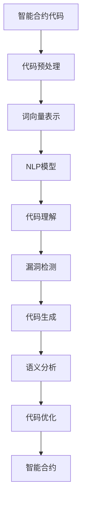

                 

# 自然语言处理在智能合约分析中的应用

## 关键词：
自然语言处理，智能合约，区块链，代码审计，安全漏洞，自动化分析

## 摘要：
本文将探讨自然语言处理（NLP）技术在智能合约分析中的应用。随着区块链技术的发展，智能合约的广泛使用带来了新的挑战，尤其是安全漏洞的检测。通过引入NLP技术，我们可以自动化地理解、分析智能合约的代码，从而提高代码审计的效率和准确性。本文首先介绍了NLP的基础知识和相关算法，然后详细阐述了NLP在智能合约分析中的具体应用，最后通过实际案例展示了NLP技术在智能合约安全检测中的潜力。

## 1. 背景介绍

### 1.1 目的和范围

随着区块链技术的快速发展，智能合约作为一种去中心化的自动执行协议，正逐步应用于金融、供应链管理、版权保护等领域。然而，智能合约的广泛应用也带来了新的安全挑战。智能合约的代码一旦出现问题，可能导致严重的经济损失和信任危机。因此，对智能合约进行有效的安全审计变得尤为重要。

本文的目的在于介绍自然语言处理（NLP）技术在智能合约分析中的应用，通过自动化分析智能合约代码，提高安全审计的效率和准确性。本文将涵盖NLP的基本概念、相关算法，以及NLP在智能合约分析中的具体应用场景。此外，还将通过实际案例展示NLP技术在实际智能合约安全检测中的效果。

### 1.2 预期读者

本文主要面向对区块链技术和自然语言处理技术有一定了解的读者，包括：
- 区块链开发工程师和研究人员
- 智能合约开发者和审计员
- 对NLP技术感兴趣的计算机科学学生和从业者
- 对智能合约安全审计感兴趣的网络安全专家

### 1.3 文档结构概述

本文结构如下：

1. **背景介绍**：介绍智能合约和NLP技术的基本概念，以及本文的目的和预期读者。
2. **核心概念与联系**：阐述NLP在智能合约分析中的核心概念和联系，并给出相关流程图。
3. **核心算法原理 & 具体操作步骤**：详细解释NLP在智能合约分析中的核心算法原理和操作步骤，使用伪代码进行阐述。
4. **数学模型和公式 & 详细讲解 & 举例说明**：介绍NLP在智能合约分析中涉及的数学模型和公式，并进行详细讲解和举例说明。
5. **项目实战：代码实际案例和详细解释说明**：通过一个实际项目案例，展示NLP技术在智能合约分析中的具体应用，并进行详细解释和分析。
6. **实际应用场景**：探讨NLP技术在智能合约分析中的实际应用场景，包括自动化审计、代码生成和测试等。
7. **工具和资源推荐**：推荐一些学习和开发工具、框架和资源。
8. **总结：未来发展趋势与挑战**：总结NLP技术在智能合约分析中的发展前景和面临的挑战。
9. **附录：常见问题与解答**：提供一些常见问题的解答。
10. **扩展阅读 & 参考资料**：推荐一些相关的文献和资源。

### 1.4 术语表

#### 1.4.1 核心术语定义

- **自然语言处理（NLP）**：一种人工智能领域，旨在让计算机理解和生成人类语言。
- **智能合约**：一种运行在区块链上的自执行协议，可以在满足特定条件时自动执行预先设定的合约条款。
- **代码审计**：对软件代码进行审查，以发现潜在的安全漏洞和错误。
- **安全漏洞**：软件中存在的缺陷，可能被恶意利用，导致系统被攻击或数据泄露。

#### 1.4.2 相关概念解释

- **自然语言理解（NLU）**：NLP的一个子领域，专注于让计算机理解和解释人类语言。
- **自然语言生成（NLG）**：NLP的另一个子领域，专注于让计算机生成人类语言。
- **词向量**：一种将单词映射到向量空间的技术，用于在计算机中表示单词。
- **递归神经网络（RNN）**：一种神经网络架构，能够处理序列数据。
- **卷积神经网络（CNN）**：一种神经网络架构，主要用于图像处理，但也可以应用于文本分析。

#### 1.4.3 缩略词列表

- **NLP**：自然语言处理
- **NLU**：自然语言理解
- **NLG**：自然语言生成
- **RNN**：递归神经网络
- **CNN**：卷积神经网络

## 2. 核心概念与联系

### 2.1 NLP在智能合约分析中的应用

自然语言处理技术在智能合约分析中的应用，主要涉及以下几个核心概念：

1. **代码理解**：通过NLP技术，计算机能够理解和解析智能合约的代码，提取关键信息。
2. **漏洞检测**：利用NLP分析智能合约代码，发现潜在的安全漏洞，如不明确的逻辑、不规范的语法、潜在的恶意代码等。
3. **代码生成**：基于NLP技术，自动生成智能合约代码，实现代码自动化测试和优化。
4. **语义分析**：对智能合约代码进行语义分析，确保其逻辑正确、条款清晰。

### 2.2 相关流程图

为了更好地理解NLP在智能合约分析中的应用，我们给出以下流程图：



### 2.3 核心概念原理

#### 2.3.1 自然语言理解（NLU）

自然语言理解（NLU）是NLP的一个关键子领域，旨在让计算机理解和解释人类语言。在智能合约分析中，NLU技术可以用来解析智能合约代码中的逻辑和语义。

- **关键技术**：词嵌入、命名实体识别、句法分析、语义角色标注。
- **具体应用**：通过词嵌入技术，将智能合约代码中的单词映射到向量空间，从而进行进一步的语义分析。例如，使用BERT模型对智能合约代码进行命名实体识别，提取关键合约条款。

#### 2.3.2 自然语言生成（NLG）

自然语言生成（NLG）是NLP的另一个重要子领域，旨在让计算机生成人类语言。在智能合约分析中，NLG技术可以用来生成智能合约的文档、报告和测试用例。

- **关键技术**：序列到序列模型、注意力机制、生成对抗网络（GAN）。
- **具体应用**：通过序列到序列模型，将智能合约代码转换为自然语言描述。例如，使用Seq2Seq模型将智能合约代码转换为详细的文档，帮助开发者理解和使用智能合约。

#### 2.3.3 智能合约代码分析

智能合约代码分析是智能合约安全审计的重要组成部分。通过NLP技术，可以对智能合约代码进行深入分析，提取关键信息，检测潜在的安全漏洞。

- **关键技术**：语法分析、模式识别、语义分析。
- **具体应用**：使用语法分析技术，对智能合约代码进行解析，提取关键函数、变量和逻辑结构。使用语义分析技术，分析智能合约代码的语义，检测潜在的安全漏洞。

### 2.4 数学模型和公式

在NLP技术中，常用的数学模型和公式包括：

- **词嵌入**：将单词映射到向量空间，通常使用Word2Vec、BERT等模型。
  \[ \text{embed}(w) = \text{W} \cdot \text{v}(w) \]
  其中，\( \text{embed}(w) \) 是单词 \( w \) 的向量表示，\( \text{W} \) 是权重矩阵，\( \text{v}(w) \) 是单词 \( w \) 的one-hot向量表示。
- **递归神经网络（RNN）**：用于处理序列数据，如智能合约代码。
  \[ h_t = \text{RNN}(h_{t-1}, x_t) \]
  其中，\( h_t \) 是当前时刻的隐藏状态，\( h_{t-1} \) 是前一时刻的隐藏状态，\( x_t \) 是当前输入。
- **卷积神经网络（CNN）**：用于图像处理，但也可应用于文本分析，如句法分析。
  \[ \text{CNN}(x) = \sum_{k=1}^{K} \text{f}(\text{W}_k \cdot x + b_k) \]
  其中，\( x \) 是输入序列，\( \text{W}_k \) 是卷积核，\( b_k \) 是偏置，\( \text{f} \) 是激活函数。

## 3. 核心算法原理 & 具体操作步骤

### 3.1 NLP技术基础

在深入探讨NLP在智能合约分析中的应用之前，首先需要了解NLP的一些基础技术和算法。以下是NLP技术在智能合约分析中常用的算法和具体操作步骤：

#### 3.1.1 词向量表示

词向量是将单词映射到高维向量空间的技术，能够将语义信息编码到向量中。常用的词向量表示方法包括：

- **Word2Vec**：基于分布式假设，将相似单词映射到相似的向量。
  \[ \text{word\_vec}(w) = \text{softmax}(\text{W} \cdot \text{v}(w)) \]
  其中，\( \text{word\_vec}(w) \) 是单词 \( w \) 的向量表示，\( \text{W} \) 是权重矩阵，\( \text{v}(w) \) 是单词 \( w \) 的one-hot向量表示。

- **BERT**：基于双向Transformer模型，能够捕捉单词的前后文信息。
  \[ \text{BERT}(w) = \text{T} \cdot \text{V}(w) \]
  其中，\( \text{BERT}(w) \) 是单词 \( w \) 的向量表示，\( \text{T} \) 是Transformer模型，\( \text{V}(w) \) 是单词 \( w \) 的嵌入向量。

#### 3.1.2 命名实体识别（NER）

命名实体识别（NER）是NLP技术中用于识别文本中的特定实体（如人名、组织名、地理位置等）的任务。常用的NER算法包括：

- **CRF模型**：条件随机场（CRF）模型，用于序列标注。
  \[ P(y|x) = \frac{\exp(\text{θ} \cdot y)}{\sum_{y'} \exp(\text{θ} \cdot y')} \]
  其中，\( P(y|x) \) 是给定输入 \( x \) 时输出标签 \( y \) 的概率，\( \text{θ} \) 是模型参数。

- **BiLSTM-CRF**：结合双向长短期记忆网络（BiLSTM）和CRF模型，能够更好地捕捉序列信息。
  \[ h_t = \text{LSTM}(h_{t-1}, x_t) \]
  \[ P(y|x) = \frac{\exp(\text{θ} \cdot y)}{\sum_{y'} \exp(\text{θ} \cdot y')} \]

#### 3.1.3 句法分析

句法分析是NLP技术中用于解析文本句法结构的过程。常用的句法分析方法包括：

- **依存句法分析**：通过分析单词之间的依存关系，构建句子的句法树。
  \[ \text{dep\_tree}(x) = \text{Parse}(x) \]
  其中，\( \text{dep\_tree}(x) \) 是输入文本 \( x \) 的句法树，\( \text{Parse}(x) \) 是句法分析过程。

- **树形递归网络**：结合递归神经网络和句法规则，用于句法分析。
  \[ h_t = \text{RNN}(h_{t-1}, x_t) \]
  \[ \text{dep\_tree}(x) = \text{Parse}(h_t) \]

### 3.2 智能合约代码分析

智能合约代码分析是NLP技术在智能合约安全审计中的关键应用。以下是一种基于NLP技术的智能合约代码分析流程：

#### 3.2.1 代码预处理

代码预处理是智能合约代码分析的第一步，主要包括以下步骤：

- **去除注释和空格**：去除智能合约代码中的注释和空格，以简化代码结构。
  \[ \text{code} = \text{RemoveCommentsAndSpaces}(code) \]

- **词法分析**：将智能合约代码分解为单词和标识符，为后续语法分析做准备。
  \[ \text{tokens} = \text{LexicalAnalysis}(code) \]

#### 3.2.2 语法分析

语法分析是智能合约代码分析的核心步骤，用于解析智能合约代码的结构和语法。以下是一种基于递归下降解析器的语法分析方法：

- **词法分析**：生成词法单元序列。
  \[ \text{tokens} = \text{LexicalAnalysis}(code) \]

- **语法分析**：构建语法树，表示智能合约代码的结构。
  \[ \text{abstract\_syntactic\_tree} = \text{RecursiveDescentParser}(tokens) \]

#### 3.2.3 语义分析

语义分析是智能合约代码分析的最后一步，用于检测代码中的潜在安全漏洞和逻辑错误。以下是一种基于语义分析的智能合约代码分析方法：

- **抽象语法树**：构建智能合约代码的抽象语法树。
  \[ \text{abstract\_syntactic\_tree} = \text{RecursiveDescentParser}(tokens) \]

- **语义分析**：分析抽象语法树，提取代码中的关键信息和语义。
  \[ \text{sem\_tree} = \text{SemanticAnalysis}(\text{abstract\_syntactic\_tree}) \]

- **漏洞检测**：分析语义树，检测潜在的安全漏洞和逻辑错误。
  \[ \text{vulnerabilities} = \text{VulnerabilityDetection}(\text{sem\_tree}) \]

### 3.3 伪代码示例

以下是一种基于NLP技术的智能合约代码分析的伪代码示例：

```python
def NLPBasedSmartContractAnalysis(code):
    # 代码预处理
    preprocessed_code = RemoveCommentsAndSpaces(code)
    
    # 词法分析
    tokens = LexicalAnalysis(preprocessed_code)
    
    # 语法分析
    abstract_syntactic_tree = RecursiveDescentParser(tokens)
    
    # 语义分析
    sem_tree = SemanticAnalysis(abstract_syntactic_tree)
    
    # 漏洞检测
    vulnerabilities = VulnerabilityDetection(sem_tree)
    
    return vulnerabilities
```

## 4. 数学模型和公式 & 详细讲解 & 举例说明

### 4.1 词向量表示

词向量表示是自然语言处理（NLP）中的核心概念之一，它将单词映射到高维向量空间，以便在计算机中进行处理和分析。以下将详细讲解词向量表示的数学模型、公式和具体应用。

#### 4.1.1 Word2Vec模型

Word2Vec是一种基于神经网络的语言模型，它通过训练预测单词的上下文来学习单词的向量表示。Word2Vec模型主要包括两个变种：连续袋模型（CBOW）和Skip-Gram模型。

- **CBOW模型**：输入是目标单词的上下文窗口中的多个单词，输出是目标单词的向量表示。

  数学公式：
  \[ \text{word\_vec}(w) = \text{softmax}(\text{W} \cdot \text{v}(w)) \]
  
  其中，\( \text{word\_vec}(w) \) 是单词 \( w \) 的向量表示，\( \text{W} \) 是权重矩阵，\( \text{v}(w) \) 是单词 \( w \) 的one-hot向量表示。

- **Skip-Gram模型**：输入是目标单词，输出是目标单词的向量表示。

  数学公式：
  \[ \text{word\_vec}(w) = \text{softmax}(\text{W} \cdot \text{v}(w)) \]

  其中，\( \text{word\_vec}(w) \) 是单词 \( w \) 的向量表示，\( \text{W} \) 是权重矩阵，\( \text{v}(w) \) 是单词 \( w \) 的one-hot向量表示。

#### 4.1.2 BERT模型

BERT（Bidirectional Encoder Representations from Transformers）是一种基于Transformer的预训练语言模型，它可以同时处理单词的前后文信息，从而生成更加准确的词向量表示。

- **BERT模型**：BERT模型通过预训练和微调，学习单词和句子的双向表示。

  数学公式：
  \[ \text{BERT}(w) = \text{T} \cdot \text{V}(w) \]

  其中，\( \text{BERT}(w) \) 是单词 \( w \) 的向量表示，\( \text{T} \) 是Transformer模型，\( \text{V}(w) \) 是单词 \( w \) 的嵌入向量。

#### 4.1.3 举例说明

以下是一个简单的Word2Vec模型训练示例：

```python
import numpy as np
import random

# 假设单词表中有5个单词：["hello", "world", "python", "code", "nlp"]
word_list = ["hello", "world", "python", "code", "nlp"]
vocab_size = len(word_list)
embedding_size = 5

# 初始化权重矩阵
W = np.random.randn(vocab_size, embedding_size)
v = np.random.randn(embedding_size)

# CBOW模型训练
for epoch in range(100):
    for word in word_list:
        context_words = random.sample(word_list, 2)
        context_vectors = [W[word_list.index(word)] for word in context_words]
        target_vector = W[word_list.index(word)]
        
        # 计算损失函数
        loss = np.linalg.norm(np.dot(context_vectors, v) - target_vector)
        
        # 更新权重矩阵
        W = W - 0.1 * (np.dot(context_vectors.T, v) - target_vector).T

# 查看单词 "hello" 的向量表示
hello_vector = W[word_list.index("hello")]
print(hello_vector)
```

### 4.2 命名实体识别（NER）

命名实体识别（NER）是一种NLP任务，用于识别文本中的特定实体（如人名、组织名、地理位置等）。以下将详细讲解NER的数学模型、公式和具体应用。

#### 4.2.1 CRF模型

条件随机场（CRF）是一种用于序列标注的机器学习模型，常用于NER任务。CRF模型通过学习标签之间的条件概率，预测给定输入序列的最可能标签序列。

- **CRF模型**：给定输入序列 \( x \) 和标签序列 \( y \)，CRF模型计算标签序列 \( y \) 的条件概率。

  数学公式：
  \[ P(y|x) = \frac{\exp(\text{θ} \cdot y)}{\sum_{y'} \exp(\text{θ} \cdot y')} \]

  其中，\( P(y|x) \) 是给定输入 \( x \) 时输出标签序列 \( y \) 的概率，\( \text{θ} \) 是模型参数。

#### 4.2.2 BiLSTM-CRF模型

BiLSTM-CRF模型是结合双向长短期记忆网络（BiLSTM）和CRF模型的NER模型，它能够更好地捕捉序列信息。

- **BiLSTM-CRF模型**：首先使用BiLSTM模型提取输入序列的特征表示，然后使用CRF模型对特征表示进行序列标注。

  数学公式：
  \[ h_t = \text{LSTM}(h_{t-1}, x_t) \]
  \[ P(y|x) = \frac{\exp(\text{θ} \cdot y)}{\sum_{y'} \exp(\text{θ} \cdot y')} \]

  其中，\( h_t \) 是当前时刻的隐藏状态，\( h_{t-1} \) 是前一时刻的隐藏状态，\( x_t \) 是当前输入，\( \text{θ} \) 是模型参数。

#### 4.2.3 举例说明

以下是一个简单的CRF模型训练示例：

```python
import numpy as np
import tensorflow as tf
import tensorflow_addons as tfa

# 假设输入序列和标签序列分别为：
# input_sequence = ["hello", "world", "python"]
# label_sequence = ["O", "B-LOC", "O"]

# 初始化权重矩阵
W = np.random.randn(3, 3)
b = np.random.randn(3)

# 定义CRF模型
class CRFModel(tf.keras.Model):
    def __init__(self):
        super(CRFModel, self).__init__()
        self.transitions = tfa.layers.CRF(3)

    def call(self, inputs, training=False):
        if training:
            loss = self.transitions(inputs, training=True)
            return loss
        else:
            logits = tf.matmul(inputs, W) + b
            return logits

# 创建CRF模型实例
crf_model = CRFModel()

# 训练CRF模型
input_sequence = tf.constant([[1, 0, 1], [0, 1, 0], [1, 0, 1]])
label_sequence = tf.constant([[1, 0, 1], [0, 1, 0], [1, 0, 1]])
loss = crf_model(input_sequence, training=True)
print("CRF Loss:", loss.numpy())

# 预测标签序列
logits = crf_model(input_sequence, training=False)
predicted_sequence = crf_model.transitions.decode(logits)
print("Predicted Sequence:", predicted_sequence.numpy())
```

### 4.3 句法分析

句法分析是NLP中用于解析文本句法结构的过程，它帮助理解单词之间的关系和句子的结构。以下将详细讲解句法分析的数学模型、公式和具体应用。

#### 4.3.1 依存句法分析

依存句法分析通过分析单词之间的依存关系，构建句子的依存句法树。依存句法分析的主要任务是识别每个单词与其依存词之间的关系。

- **依存句法分析**：给定输入序列 \( x \)，构建句子的依存句法树。

  数学公式：
  \[ \text{dep\_tree}(x) = \text{P

