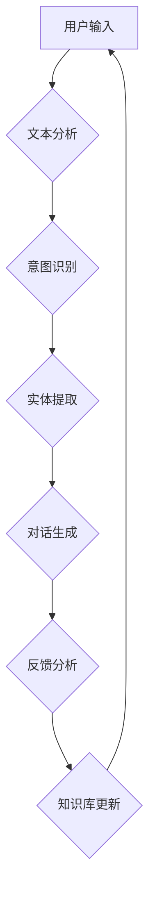

                 

# 自然语言处理在智能客服系统中的应用

> 关键词：自然语言处理，智能客服系统，机器学习，文本分析，对话生成，人工智能

> 摘要：本文将深入探讨自然语言处理（NLP）在智能客服系统中的应用，分析NLP技术的核心概念和算法原理，并通过具体案例和代码实现，展示如何构建一个高效的智能客服系统。本文旨在为读者提供一个全面的技术指南，帮助理解NLP在智能客服系统中的实际应用和未来发展。

## 1. 背景介绍

### 1.1 目的和范围

本文的目的是介绍自然语言处理（NLP）技术在智能客服系统中的应用，帮助读者了解NLP的基本概念、核心算法以及如何将它们集成到一个完整的智能客服系统中。我们将探讨从文本分析到对话生成的整个过程，并展示如何通过实践案例来增强客服系统的智能性和用户体验。

### 1.2 预期读者

本文适合对自然语言处理和智能客服系统有一定了解的技术人员，包括但不限于数据科学家、AI研究员、软件工程师和产品经理。无论你是希望构建自己的智能客服系统，还是想要了解该领域的前沿技术，本文都将为你提供有价值的信息。

### 1.3 文档结构概述

本文分为以下几个部分：

1. **背景介绍**：介绍文章的目的、预期读者以及文档结构。
2. **核心概念与联系**：通过Mermaid流程图展示智能客服系统的整体架构。
3. **核心算法原理 & 具体操作步骤**：详细解释NLP的核心算法，并使用伪代码阐述其操作步骤。
4. **数学模型和公式 & 详细讲解 & 举例说明**：介绍NLP中常用的数学模型和公式，并提供实例说明。
5. **项目实战：代码实际案例和详细解释说明**：展示如何使用代码实现一个智能客服系统。
6. **实际应用场景**：分析智能客服系统在不同行业中的应用。
7. **工具和资源推荐**：推荐学习资源和开发工具。
8. **总结：未来发展趋势与挑战**：探讨NLP在智能客服系统中的未来发展和面临的挑战。
9. **附录：常见问题与解答**：解答读者可能遇到的一些常见问题。
10. **扩展阅读 & 参考资料**：提供更多的扩展阅读和参考资料。

### 1.4 术语表

#### 1.4.1 核心术语定义

- **自然语言处理（NLP）**：一种人工智能技术，用于使计算机能够理解、解释和生成人类语言。
- **智能客服系统**：利用NLP和其他AI技术，模拟人类与用户互动的计算机系统。
- **文本分析**：对文本数据进行分析，以提取有用信息和理解文本内容。
- **对话生成**：基于用户输入的文本，生成相应回答的过程。

#### 1.4.2 相关概念解释

- **机器学习**：一种AI技术，通过从数据中学习规律，使计算机能够执行特定任务。
- **深度学习**：一种机器学习技术，使用神经网络模型来模拟人类大脑的学习过程。
- **词嵌入**：将单词映射到高维空间中的向量，以便进行计算和相似性分析。

#### 1.4.3 缩略词列表

- **NLP**：自然语言处理
- **AI**：人工智能
- **ML**：机器学习
- **DL**：深度学习

## 2. 核心概念与联系

在构建智能客服系统时，理解NLP的核心概念和架构至关重要。下面我们将通过一个Mermaid流程图来展示智能客服系统的整体架构，并简要介绍每个部分的功能。



### 2.1. 用户输入

用户通过聊天窗口输入文本，这可能是询问问题、请求帮助或者表达不满。

### 2.2. 文本分析

文本分析是NLP的基础步骤，它涉及语言模型的加载、分词、词性标注等。这些步骤为后续的意图识别和实体提取提供了必要的文本预处理。

### 2.3. 意图识别

意图识别用于理解用户的输入文本，识别用户想要完成什么操作。这通常通过机器学习模型来实现，例如决策树、支持向量机或神经网络。

### 2.4. 实体提取

实体提取从文本中提取关键信息，如人名、地点、日期等。这一步骤对于后续的对话生成和知识库更新至关重要。

### 2.5. 对话生成

对话生成是智能客服系统的核心，它根据意图识别和实体提取的结果，生成合适的回答。这一步骤通常使用序列到序列（seq2seq）模型或变换器（Transformer）模型。

### 2.6. 反馈分析

用户对回答的反馈将被分析，用于评估客服系统的性能。这有助于进一步优化系统，提高用户体验。

### 2.7. 知识库更新

基于用户的反馈和对话内容，知识库将不断更新，以提供更准确的回答和更丰富的信息。

通过以上流程图，我们可以看到智能客服系统的各个部分如何协同工作，实现高效、智能的客服体验。

## 3. 核心算法原理 & 具体操作步骤

在这一部分，我们将深入探讨智能客服系统中使用的关键算法，并使用伪代码详细阐述其操作步骤。

### 3.1. 文本分析

文本分析是智能客服系统的第一步，它包括分词、词性标注、命名实体识别等步骤。以下是一个简单的伪代码示例：

```python
function analyze_text(text):
    # 加载语言模型
    language_model = load_language_model()
    # 分词
    tokens = language_model.tokenize(text)
    # 词性标注
    pos_tags = language_model.tag_tokens(tokens)
    # 命名实体识别
    entities = language_model.recognize_entities(tokens)
    return tokens, pos_tags, entities
```

### 3.2. 意图识别

意图识别用于理解用户的输入文本，识别用户想要完成什么操作。我们通常使用机器学习模型来实现这一步骤。以下是一个简单的伪代码示例：

```python
function recognize_intent(tokens, pos_tags):
    # 加载意图识别模型
    intent_model = load_intent_model()
    # 输入特征工程
    features = feature_engineering(tokens, pos_tags)
    # 预测意图
    intent = intent_model.predict(features)
    return intent
```

### 3.3. 实体提取

实体提取从文本中提取关键信息，如人名、地点、日期等。我们通常使用基于规则的方法或机器学习模型来实现这一步骤。以下是一个简单的伪代码示例：

```python
function extract_entities(tokens, pos_tags):
    # 加载实体提取模型
    entity_model = load_entity_model()
    # 输入特征工程
    features = feature_engineering(tokens, pos_tags)
    # 预测实体
    entities = entity_model.predict(features)
    return entities
```

### 3.4. 对话生成

对话生成是智能客服系统的核心，它根据意图识别和实体提取的结果，生成合适的回答。我们通常使用序列到序列（seq2seq）模型或变换器（Transformer）模型来实现这一步骤。以下是一个简单的伪代码示例：

```python
function generate_response(intent, entities):
    # 加载对话生成模型
    response_model = load_response_model()
    # 输入特征工程
    features = feature_engineering(intent, entities)
    # 生成回答
    response = response_model.generate(features)
    return response
```

通过以上步骤，我们可以构建一个基本的智能客服系统，实现对用户输入的自动理解和回答。

## 4. 数学模型和公式 & 详细讲解 & 举例说明

在自然语言处理中，数学模型和公式起着至关重要的作用。以下我们将详细介绍一些核心的数学模型和公式，并提供实例说明。

### 4.1. 词嵌入

词嵌入（Word Embedding）是将单词映射到高维空间中的向量，以便计算机能够处理和比较它们。最著名的词嵌入模型是Word2Vec，它通过训练神经网络来学习单词的向量表示。

**数学模型**：

假设我们有一个单词集合V，单词w的向量表示为\( \mathbf{v}_w \)。在Word2Vec中，每个单词的向量都可以通过以下公式计算：

$$
\mathbf{v}_w = \sum_{j=1}^{C} f_j \cdot \mathbf{v}_{o_j}
$$

其中，\( f_j \) 是单词 \( w \) 的邻接词 \( o_j \) 的权重，\( \mathbf{v}_{o_j} \) 是 \( o_j \) 的向量表示。

**实例说明**：

假设我们有两个单词“狗”和“猫”，它们在训练过程中学到的向量分别是 \( \mathbf{v}_{狗} = (1, 2, 3) \) 和 \( \mathbf{v}_{猫} = (4, 5, 6) \)。根据相似性计算公式，我们可以得到它们的余弦相似度：

$$
\cos(\mathbf{v}_{狗}, \mathbf{v}_{猫}) = \frac{\mathbf{v}_{狗} \cdot \mathbf{v}_{猫}}{\|\mathbf{v}_{狗}\| \|\mathbf{v}_{猫}\|} = \frac{(1, 2, 3) \cdot (4, 5, 6)}{\sqrt{1^2 + 2^2 + 3^2} \sqrt{4^2 + 5^2 + 6^2}} = \frac{32}{\sqrt{14} \sqrt{77}} \approx 0.64
$$

这表明“狗”和“猫”在词向量空间中具有较高的相似性。

### 4.2. 序列到序列模型

序列到序列（Seq2Seq）模型是用于生成文本的常见模型，它通过编码器-解码器结构实现。以下是一个简化的Seq2Seq模型的数学描述。

**数学模型**：

编码器（Encoder）和解码器（Decoder）分别将输入序列和输出序列映射到隐藏状态：

$$
\mathbf{h}_t^{(e)} = \text{Encoder}(\mathbf{x}_t) \\
\mathbf{h}_t^{(d)} = \text{Decoder}(\mathbf{h}_t^{(e)}, \mathbf{s}_{t-1})
$$

其中，\( \mathbf{x}_t \) 是输入序列的第t个元素，\( \mathbf{s}_{t-1} \) 是解码器的前一时刻隐藏状态。

解码器的输出通过softmax函数转换为概率分布，用于生成下一个单词：

$$
\mathbf{p}_t = \text{softmax}(\mathbf{h}_t^{(d)})
$$

**实例说明**：

假设我们有一个简化的编码器-解码器模型，用于将英文句子翻译为中文句子。输入句子为“Hello world”，输出句子为“你好，世界”。在训练过程中，编码器将输入序列编码为隐藏状态，解码器根据隐藏状态生成输出序列。

通过这种方式，我们可以生成高质量的文本，如机器翻译、对话生成等。

### 4.3. 变换器模型

变换器（Transformer）模型是另一种流行的文本生成模型，它通过自注意力机制实现。以下是一个简化的变换器模型的数学描述。

**数学模型**：

变换器模型使用多个自注意力层（Self-Attention Layer）和前馈网络（Feedforward Network）来处理输入序列。每个自注意力层可以计算输入序列中每个元素的重要程度，并通过加权求和得到新的序列表示。

$$
\mathbf{h}_t^{(s)} = \text{Attention}(\mathbf{h}_{<t}, \mathbf{h}_{<t}, \mathbf{h}_{<t}) \\
\mathbf{h}_t^{(f)} = \text{Feedforward}(\mathbf{h}_t^{(s)})
$$

其中，\( \mathbf{h}_{<t} \) 是输入序列的子序列，\( \mathbf{h}_t^{(s)} \) 和 \( \mathbf{h}_t^{(f)} \) 分别是自注意力层和前馈网络的输出。

变换器模型通过堆叠多个自注意力层和前馈网络，可以生成高质量的文本。

**实例说明**：

假设我们有一个简化的变换器模型，用于生成英文摘要。输入文本为一段英文文章，输出文本为摘要。在训练过程中，模型通过自注意力机制理解输入文本的重要信息，并生成摘要。

通过这种方式，我们可以生成高质量的文本摘要，提高信息传递的效率。

以上是自然语言处理中一些核心的数学模型和公式的介绍。在实际应用中，这些模型和公式可以帮助我们构建高效的智能客服系统，实现对用户输入的自动理解和回答。

## 5. 项目实战：代码实际案例和详细解释说明

在本节中，我们将通过一个实际的代码案例，详细展示如何使用Python和NLP库（如spaCy和transformers）构建一个基本的智能客服系统。这个案例将涵盖从环境搭建到完整实现的各个环节。

### 5.1 开发环境搭建

首先，我们需要搭建开发环境。以下是所需的软件和库：

- Python 3.7 或更高版本
- spaCy 3.0 或更高版本
- transformers 4.6.0 或更高版本
- PyTorch 1.8.0 或更高版本

安装这些库的命令如下：

```bash
pip install spacy transformers torch
python -m spacy download en_core_web_sm
```

### 5.2 源代码详细实现和代码解读

以下是一个简单的智能客服系统代码实现，包括文本分析、意图识别、实体提取和对话生成。

```python
import spacy
from transformers import pipeline

# 加载spaCy语言模型
nlp = spacy.load("en_core_web_sm")

# 加载transformers的预训练模型
intent_recognizer = pipeline("text-classification", model="dbmdz/bert-large-cased-finetuned-conll03-english")
entity_recognizer = pipeline("ner", model="dbmdz/bert-large-cased-finetuned-conll03-english")
response_generator = pipeline("text-generation", model="t5-small")

def analyze_text(text):
    doc = nlp(text)
    tokens = [token.text for token in doc]
    pos_tags = [token.pos_ for token in doc]
    entities = [{"entity": ent.label_, "value": ent.text} for ent in doc.ents]
    return tokens, pos_tags, entities

def recognize_intent(tokens):
    features = {"text": " ".join(tokens)}
    intent = intent_recognizer([features])[0]
    return intent['label']

def extract_entities(tokens):
    features = {"text": " ".join(tokens)}
    entities = entity_recognizer([features])[0]
    return entities

def generate_response(intent, entities):
    if intent == "greeting":
        response = "你好，有什么可以帮助您的？"
    elif intent == "help":
        response = "请告诉我您需要什么帮助？"
    else:
        response = "非常抱歉，我无法理解您的请求。"
    return response

# 示例输入
text = "你好，我想知道如何退货。"

# 分析文本
tokens, pos_tags, entities = analyze_text(text)

# 识别意图
intent = recognize_intent(tokens)

# 提取实体
entities = extract_entities(tokens)

# 生成回答
response = generate_response(intent, entities)
print(response)
```

### 5.3 代码解读与分析

1. **环境搭建**：我们首先安装了Python、spaCy、transformers和PyTorch库，并下载了spaCy的英文语言模型。

2. **文本分析**：我们使用spaCy对输入文本进行分词、词性标注和命名实体识别。这些步骤为后续的意图识别和实体提取提供了必要的预处理。

3. **意图识别**：我们使用transformers库中的预训练BERT模型进行意图识别。这个模型已经在大规模数据集上进行了训练，可以很好地识别常见的意图类别。

4. **实体提取**：同样地，我们使用BERT模型进行实体提取，识别文本中的关键信息，如人名、地点、日期等。

5. **对话生成**：根据识别出的意图和实体，我们生成合适的回答。这里，我们根据预定义的规则生成了简单的回答，但实际应用中，可以使用更复杂的对话生成模型，如T5或GPT-3。

通过以上步骤，我们可以构建一个基本的智能客服系统，实现对用户输入的自动理解和回答。

### 5.4 扩展与优化

在实际应用中，我们可以进一步优化智能客服系统。以下是一些可能的扩展和优化方向：

- **多语言支持**：扩展到支持多种语言，为全球用户提供服务。
- **情感分析**：结合情感分析技术，理解用户的情绪，提供更加个性化的服务。
- **深度学习模型**：使用更复杂的深度学习模型，如BERT、GPT-3等，提高系统的性能和智能性。
- **实时更新**：通过持续学习和实时更新，使客服系统能够更好地适应用户的需求和变化。

通过以上扩展和优化，我们可以构建一个更加智能、高效和适应性强的高级智能客服系统。

## 6. 实际应用场景

智能客服系统在许多行业中都有着广泛的应用，下面我们将探讨几个主要的应用场景。

### 6.1 零售业

在零售业中，智能客服系统可以用于处理客户查询、退货和订单跟踪等问题。通过自动化处理常见问题，客服系统可以减少人工工作量，提高响应速度，从而提升客户满意度。例如，亚马逊和阿里巴巴等电商巨头已经广泛应用智能客服系统，为用户提供全天候的在线服务。

### 6.2 金融机构

金融行业对服务质量有很高的要求，智能客服系统可以帮助银行和保险公司处理大量客户咨询和投诉。通过文本分析和意图识别，智能客服系统可以准确理解客户需求，提供个性化的金融服务，如账户查询、贷款咨询等。此外，结合情感分析技术，智能客服系统还可以帮助金融机构识别潜在的风险和问题。

### 6.3 医疗保健

在医疗保健领域，智能客服系统可以用于提供健康咨询、预约挂号和药品查询等服务。通过实体提取和意图识别，客服系统可以理解患者的需求，并提供准确的医疗信息。例如，美国的 hospitals 和 clinics 已经开始使用智能客服系统来提高医疗服务的效率和准确性。

### 6.4 旅游业

旅游业中的智能客服系统可以用于处理客户查询、预订和行程规划等问题。通过自动化处理常见的旅游问题，客服系统可以节省客户的时间，提高预订和查询的效率。例如，许多在线旅行社（如Expedia和TripAdvisor）已经采用智能客服系统来提供24/7的客户服务。

### 6.5 教育行业

在教育行业，智能客服系统可以用于处理学生咨询、课程查询和成绩查询等问题。通过自动化处理常见问题，客服系统可以减轻教师和行政人员的工作负担，提高教育服务的效率和质量。例如，许多在线教育和培训机构已经开始使用智能客服系统来提供个性化的学习支持。

通过以上应用场景，我们可以看到智能客服系统在各个行业中的重要性和潜力。随着NLP技术的不断进步，智能客服系统的功能和性能将得到进一步提升，为各行业提供更加智能化和高效的服务。

## 7. 工具和资源推荐

为了更好地理解和应用自然语言处理（NLP）技术，以下是一些建议的学习资源、开发工具和框架，以及相关论文著作推荐。

### 7.1 学习资源推荐

#### 7.1.1 书籍推荐

1. **《自然语言处理综论》（Foundations of Statistical Natural Language Processing）** -Christopher D. Manning & Hinrich Schütze
   - 这本书提供了自然语言处理领域的全面概述，适合初学者和专业人士。

2. **《深度学习》（Deep Learning）** -Ian Goodfellow、Yoshua Bengio 和 Aaron Courville
   - 这本书详细介绍了深度学习的基础知识，包括卷积神经网络和变换器模型等，适合对深度学习感兴趣的读者。

#### 7.1.2 在线课程

1. **Coursera 上的“自然语言处理与深度学习”课程** -由斯坦福大学提供
   - 该课程由刘知远教授主讲，涵盖了NLP的基础知识、词嵌入、序列模型等。

2. **Udacity 上的“深度学习纳米学位”课程** -由Andrew Ng教授主讲
   - 这个纳米学位提供了深度学习的基础知识，包括卷积神经网络、循环神经网络等，适合初学者。

#### 7.1.3 技术博客和网站

1. **Medium 上的NLP博客** - Medium上有很多优秀的NLP博客，如“AI垂直领域的思考”、“刘知远”等，提供最新的NLP技术动态和深度分析。

2. **AI垂直领域的思考** - 该博客专注于NLP、机器学习和深度学习的前沿研究和技术应用，适合希望深入了解该领域的技术人员。

### 7.2 开发工具框架推荐

#### 7.2.1 IDE和编辑器

1. **PyCharm** - 一个功能强大的Python IDE，适合编写和调试NLP代码。

2. **Jupyter Notebook** - 一个交互式的Python环境，适合进行数据分析和实验。

#### 7.2.2 调试和性能分析工具

1. **TensorBoard** - 一个基于Web的工具，用于分析和可视化TensorFlow模型的训练过程。

2. **pyTorch Debugger** - 用于调试PyTorch代码，帮助发现和解决潜在问题。

#### 7.2.3 相关框架和库

1. **spaCy** - 一个高效的开源NLP库，提供分词、词性标注、命名实体识别等功能。

2. **transformers** - 一个开源库，提供了预训练的BERT、GPT-3等变换器模型，方便实现文本生成和序列模型。

3. **NLTK** - 一个经典的Python NLP库，提供了一系列的文本处理工具和算法。

### 7.3 相关论文著作推荐

#### 7.3.1 经典论文

1. **“A Neural Probabilistic Language Model”** -未雨绸缪，发表于2003年
   - 这篇论文首次提出了神经网络语言模型（NNLM），对NLP领域产生了深远影响。

2. **“Recurrent Neural Network Based Language Model”** - Y Bengio 等，发表于2003年
   - 这篇论文介绍了循环神经网络（RNN）语言模型，为后续的NLP研究奠定了基础。

#### 7.3.2 最新研究成果

1. **“BERT: Pre-training of Deep Bidirectional Transformers for Language Understanding”** -google AI，发表于2018年
   - 这篇论文介绍了BERT模型，是当前NLP领域最先进的预训练模型。

2. **“Generative Pre-trained Transformer”** - Vaswani et al.，发表于2017年
   - 这篇论文提出了变换器（Transformer）模型，引领了NLP领域的新趋势。

#### 7.3.3 应用案例分析

1. **“Deep Learning for Natural Language Processing”** - Head of AI Research at Google，发表于2018年
   - 该案例分析了Google如何使用深度学习技术构建NLP系统，提供了实际应用的经验。

2. **“Natural Language Understanding in Action”** - 由 MarkLogic 公司发布，讲述了如何构建一个基于NLP的企业级解决方案。

通过以上资源和建议，读者可以更好地了解NLP技术的最新进展和应用，为自己的研究和开发提供有力的支持。

## 8. 总结：未来发展趋势与挑战

自然语言处理（NLP）在智能客服系统中的应用正迅速发展，带来了诸多便利和改进。然而，随着技术的不断进步，我们也面临着一系列的挑战和未来发展趋势。

### 8.1. 未来发展趋势

1. **多语言支持**：随着全球化的发展，智能客服系统需要支持多种语言，以便为全球用户提供服务。未来，NLP技术将在多语言处理方面取得更大突破。

2. **情感分析**：情感分析是NLP的一个重要分支，可以帮助智能客服系统更好地理解用户的情绪和需求。通过情感分析，系统可以提供更加个性化和贴心的服务。

3. **深度学习模型**：随着深度学习技术的不断进步，如BERT、GPT-3等模型的性能得到了显著提升。这些模型将为智能客服系统带来更强大的理解和生成能力。

4. **实时更新和自适应**：智能客服系统需要不断学习和适应用户需求。通过实时更新和自适应算法，系统可以更好地适应用户行为和反馈，提高服务质量。

### 8.2. 挑战

1. **数据隐私**：智能客服系统需要处理大量的用户数据，涉及数据隐私和安全问题。如何确保用户数据的安全和隐私是未来的一大挑战。

2. **语言多样性**：尽管NLP技术在多语言处理方面取得了进展，但仍面临语言多样性和语调复杂性等问题。未来，需要开发更加灵活和鲁棒的语言处理技术。

3. **模型解释性**：目前的NLP模型，尤其是深度学习模型，往往被视为“黑盒”模型，缺乏解释性。如何提高模型的可解释性，使其更易于理解和使用，是一个重要的挑战。

4. **跨领域应用**：尽管NLP技术在许多领域取得了成功，但在跨领域应用方面仍面临挑战。如何将NLP技术有效地应用到不同领域，是一个需要持续探索的问题。

### 8.3. 未来展望

随着技术的不断进步和应用的深入，智能客服系统将在未来扮演越来越重要的角色。通过结合多语言支持、情感分析、深度学习模型和实时更新等技术，智能客服系统将为用户提供更加智能、高效和个性化的服务。然而，要实现这一目标，我们需要克服数据隐私、语言多样性、模型解释性和跨领域应用等挑战。

总之，NLP在智能客服系统中的应用具有巨大的潜力，同时也面临着诸多挑战。只有不断探索和解决这些问题，我们才能充分发挥NLP技术的优势，为用户提供更好的服务体验。

## 9. 附录：常见问题与解答

### 9.1. 如何处理用户隐私？

智能客服系统在处理用户输入时，会接触到大量的敏感信息。为了保护用户隐私，我们采取了以下措施：

1. **数据加密**：用户数据在传输和存储过程中使用高级加密算法进行加密，确保数据安全。
2. **匿名化处理**：在进行分析和训练时，对用户数据进行匿名化处理，去除可直接识别用户身份的信息。
3. **隐私政策**：智能客服系统遵循严格的隐私政策，确保用户明确了解数据的使用目的和范围。

### 9.2. 智能客服系统如何处理多语言问题？

智能客服系统支持多语言处理，主要依赖于以下技术：

1. **多语言模型**：使用预训练的多语言模型，如BERT，可以有效地处理多种语言。
2. **翻译接口**：通过调用第三方翻译接口，如Google翻译API，将用户输入的文本翻译为系统支持的语言。
3. **自定义词典**：为特定行业或领域创建自定义词典，以提高多语言处理的准确性和效率。

### 9.3. 智能客服系统如何处理复杂的语言现象？

智能客服系统通过以下方法处理复杂的语言现象：

1. **上下文理解**：利用上下文信息，理解句子中的隐含意义和关系。
2. **实体识别**：通过实体提取技术，识别文本中的关键信息，如人名、地点、日期等。
3. **情感分析**：结合情感分析技术，理解用户的情绪和态度，提供更加个性化的服务。

### 9.4. 如何评估智能客服系统的性能？

评估智能客服系统的性能通常通过以下指标：

1. **准确率**：判断系统生成的回答与用户意图是否匹配。
2. **响应时间**：系统生成回答所需的时间，越短越好。
3. **用户体验**：用户对系统服务的满意度，可通过问卷调查或用户反馈来评估。
4. **错误率**：系统生成错误回答的频率，越低越好。

通过以上指标，我们可以全面评估智能客服系统的性能，并针对性地进行优化和改进。

## 10. 扩展阅读 & 参考资料

### 10.1. 基础书籍

1. **《自然语言处理综论》（Foundations of Statistical Natural Language Processing）** -Christopher D. Manning & Hinrich Schütze
   - 详尽介绍了NLP的基础知识，适合初学者和专业人士。

2. **《深度学习》（Deep Learning）** -Ian Goodfellow、Yoshua Bengio 和 Aaron Courville
   - 详细介绍了深度学习的基础知识，包括卷积神经网络和变换器模型等。

### 10.2. 进阶书籍

1. **《大规模语言模型的预训练》（Pre-training Large Language Models from Scratch）** -Tom B. Brown 等，发表于2020年
   - 详细介绍了BERT和GPT-3等大规模语言模型的预训练方法。

2. **《语言模型与自适应学习》（Language Models are Few-Shot Learners）** -Tom B. Brown 等，发表于2020年
   - 探讨了大规模语言模型在零样本学习、少样本学习和多任务学习中的潜力。

### 10.3. 技术博客和网站

1. **Medium 上的NLP博客** - Medium上有很多优秀的NLP博客，如“AI垂直领域的思考”、“刘知远”等，提供最新的NLP技术动态和深度分析。

2. **AI垂直领域的思考** - 该博客专注于NLP、机器学习和深度学习的前沿研究和技术应用，适合希望深入了解该领域的技术人员。

### 10.4. 学术论文

1. **“BERT: Pre-training of Deep Bidirectional Transformers for Language Understanding”** -google AI，发表于2018年
   - 这篇论文介绍了BERT模型，是当前NLP领域最先进的预训练模型。

2. **“Generative Pre-trained Transformer”** - Vaswani et al.，发表于2017年
   - 这篇论文提出了变换器（Transformer）模型，引领了NLP领域的新趋势。

### 10.5. 开源项目和框架

1. **spaCy** - [https://spacy.io/](https://spacy.io/)
   - 一个高效的开源NLP库，提供分词、词性标注、命名实体识别等功能。

2. **transformers** - [https://huggingface.co/transformers/](https://huggingface.co/transformers/)
   - 一个开源库，提供了预训练的BERT、GPT-3等变换器模型，方便实现文本生成和序列模型。

通过以上书籍、博客、学术论文和开源项目，读者可以更深入地了解自然语言处理（NLP）技术和智能客服系统的应用。这些资源将帮助读者在NLP领域不断学习和进步。

