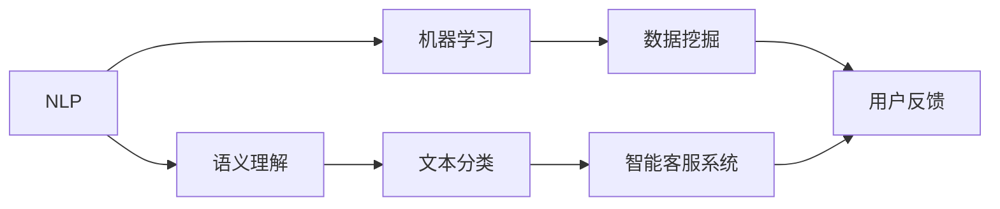

                 

# 自然语言处理在智能客服系统中的应用

> **关键词：** 自然语言处理（NLP）、智能客服、机器学习、数据挖掘、文本分析、语义理解

> **摘要：** 本文深入探讨了自然语言处理（NLP）在智能客服系统中的应用，详细介绍了NLP的核心概念、算法原理、数学模型以及实际操作步骤。通过一个具体的案例，本文展示了如何利用NLP技术实现智能客服的功能，并分析了其在实际应用中的优势与挑战。最后，本文推荐了相关学习资源和开发工具，为读者提供了深入学习和实践的方向。

## 1. 背景介绍

### 1.1 目的和范围

智能客服系统是现代企业提升客户服务质量和效率的重要工具。随着自然语言处理（NLP）技术的不断发展，智能客服系统的功能越来越强大，能够更好地理解和处理用户的自然语言查询。本文旨在探讨NLP在智能客服系统中的应用，分析其核心算法原理和实现步骤，并探讨实际应用场景中的优势与挑战。

### 1.2 预期读者

本文主要面向对自然语言处理和智能客服系统有一定了解的技术人员，包括程序员、数据科学家、软件工程师等。同时，对希望了解智能客服系统如何实现的普通读者也具有一定的参考价值。

### 1.3 文档结构概述

本文分为十个部分，首先介绍NLP在智能客服系统中的应用背景，然后逐步深入探讨核心概念、算法原理、数学模型、实际案例和未来发展趋势。最后，本文推荐了相关学习资源和开发工具，为读者提供了深入学习和实践的方向。

### 1.4 术语表

#### 1.4.1 核心术语定义

- 自然语言处理（NLP）：一门交叉学科，涉及计算机科学、人工智能和语言学等多个领域，旨在使计算机能够理解和处理人类的自然语言。
- 智能客服系统：一种利用自然语言处理和机器学习技术实现自动处理用户查询的客服系统。
- 机器学习：一种基于数据的学习方法，使计算机能够从数据中自动发现规律和模式。
- 数据挖掘：从大量数据中发现有趣模式和知识的过程。

#### 1.4.2 相关概念解释

- 语义理解：理解文本中词语的含义和句子之间的关系。
- 文本分类：将文本分配到预定义的类别中。
- 语音识别：将语音转换为文本。

#### 1.4.3 缩略词列表

- NLP：自然语言处理
- ML：机器学习
- DM：数据挖掘
- API：应用程序编程接口

## 2. 核心概念与联系

为了更好地理解自然语言处理（NLP）在智能客服系统中的应用，我们需要先了解一些核心概念和它们之间的联系。以下是一个简化的 Mermaid 流程图，展示了NLP、智能客服和机器学习之间的关系：



### 2.1 NLP的核心概念

自然语言处理（NLP）的核心概念包括：

- **文本预处理**：包括分词、去除停用词、词干提取等步骤，目的是将原始文本转换为计算机可以处理的形式。
- **词向量表示**：将词语映射到高维向量空间中，以便进行计算和模型训练。
- **语义理解**：包括词义消歧、情感分析、命名实体识别等任务，旨在理解文本中词语的含义和句子之间的关系。
- **文本分类**：将文本分配到预定义的类别中，例如垃圾邮件过滤、情感分类等。
- **问答系统**：实现自动回答用户问题的系统，包括问题理解、答案生成和答案验证等任务。

### 2.2 智能客服系统的核心概念

智能客服系统的核心概念包括：

- **用户交互**：与用户进行自然语言交互，理解用户意图并给出合适的答复。
- **上下文管理**：在多轮对话中保持对话的连贯性和一致性。
- **用户行为分析**：通过用户交互数据分析用户行为，为用户提供个性化的服务。
- **反馈机制**：收集用户反馈，不断优化智能客服系统的性能。

### 2.3 机器学习在NLP和智能客服系统中的应用

机器学习（ML）在NLP和智能客服系统中的应用主要体现在以下方面：

- **模型训练**：使用大量标注数据训练NLP模型，例如词向量模型、文本分类模型等。
- **模型优化**：通过迭代优化模型参数，提高模型的准确性和泛化能力。
- **自动化任务**：利用预训练模型实现自动化文本分类、情感分析、问答等任务。

## 3. 核心算法原理 & 具体操作步骤

### 3.1 文本预处理

在NLP任务中，文本预处理是一个关键步骤。以下是一个简化的伪代码，描述了文本预处理的具体操作步骤：

```python
def preprocess_text(text):
    # 分词
    tokens = tokenize(text)
    # 去除停用词
    tokens = remove_stopwords(tokens)
    # 词干提取
    tokens = lemmatize(tokens)
    return tokens
```

- `tokenize(text)`：将文本分割成单词或子词。
- `remove_stopwords(tokens)`：去除常用的停用词，例如“的”、“和”等。
- `lemmatize(tokens)`：将单词还原为词干形式，例如“-running”还原为“run”。

### 3.2 词向量表示

词向量表示是NLP中的另一个关键步骤。以下是一个简化的伪代码，描述了词向量表示的具体操作步骤：

```python
def generate_word_vectors(tokens, embedding_size):
    # 使用预训练的词向量模型
    model = pre-trained_word_vector_model(embedding_size)
    # 将单词映射到高维向量空间
    vectors = [model[token] for token in tokens]
    return vectors
```

- `pre-trained_word_vector_model(embedding_size)`：加载预训练的词向量模型，例如Word2Vec、GloVe等。
- `model[token]`：将单词映射到高维向量空间。

### 3.3 语义理解

语义理解是一个复杂的过程，包括多个子任务。以下是一个简化的伪代码，描述了语义理解的具体操作步骤：

```python
def understand_semantics(tokens, model):
    # 词义消歧
    entities = resolve_ambiguity(tokens, model)
    # 情感分析
    sentiment = analyze_sentiment(tokens, model)
    # 命名实体识别
    named_entities = recognize_named_entities(tokens, model)
    return entities, sentiment, named_entities
```

- `resolve_ambiguity(tokens, model)`：解决词语的多义性。
- `analyze_sentiment(tokens, model)`：分析文本的情感倾向。
- `recognize_named_entities(tokens, model)`：识别文本中的命名实体。

### 3.4 文本分类

文本分类是将文本分配到预定义的类别中的过程。以下是一个简化的伪代码，描述了文本分类的具体操作步骤：

```python
def classify_text(text, model):
    # 预处理文本
    tokens = preprocess_text(text)
    # 提取特征
    features = extract_features(tokens)
    # 分类
    category = model.predict(features)
    return category
```

- `preprocess_text(text)`：预处理文本。
- `extract_features(tokens)`：提取文本特征。
- `model.predict(features)`：使用训练好的模型进行分类预测。

### 3.5 问答系统

问答系统是实现智能客服系统的核心功能之一。以下是一个简化的伪代码，描述了问答系统的具体操作步骤：

```python
def answer_question(question, model):
    # 预处理问题
    tokens = preprocess_text(question)
    # 理解问题
    intent, entities = understand_question(tokens, model)
    # 回答问题
    answer = generate_answer(intent, entities, model)
    return answer
```

- `understand_question(tokens, model)`：理解问题的意图和实体。
- `generate_answer(intent, entities, model)`：生成问题的答案。

## 4. 数学模型和公式 & 详细讲解 & 举例说明

### 4.1 词向量表示

词向量表示是自然语言处理（NLP）中的核心概念之一。以下是一个使用GloVe算法训练词向量的数学模型：

$$
\begin{align*}
\text{Loss} &= \sum_{i=1}^{n}\sum_{j=1}^{d} (w_i^T w_j - 1)^2 \\
\end{align*}
$$

其中，$w_i$表示词向量，$d$表示向量的维度。

### 4.2 语义理解

语义理解涉及到多个子任务，如词义消歧、情感分析和命名实体识别。以下是一个使用支持向量机（SVM）进行词义消歧的数学模型：

$$
\begin{align*}
f(x) &= w^T x + b \\
y &= \arg\max_w f(x) \\
\end{align*}
$$

其中，$x$表示特征向量，$w$表示权重向量，$b$表示偏置项。

### 4.3 文本分类

文本分类是NLP中的常见任务。以下是一个使用逻辑回归进行文本分类的数学模型：

$$
\begin{align*}
\text{Logit} &= \text{log}(\frac{P(y=1|x)}{1-P(y=1|x)}) \\
P(y=1|x) &= \frac{1}{1 + \exp(-\text{Logit})} \\
\end{align*}
$$

其中，$\text{Logit}$表示逻辑函数，$P(y=1|x)$表示在特征向量$x$下类别为1的概率。

### 4.4 问答系统

问答系统中的关键任务是理解问题和生成答案。以下是一个使用基于记忆的神经网络进行问答系统的数学模型：

$$
\begin{align*}
h &= \tanh(W_1 [Q; K] + b_1) \\
p &= \text{softmax}(W_2 h + b_2) \\
a &= \text{argmax}_i p_i \\
\end{align*}
$$

其中，$Q$表示问题向量，$K$表示知识库中的句子向量，$h$表示隐藏状态，$p$表示答案概率分布。

### 4.5 举例说明

以下是一个简单的例子，展示了如何使用词向量表示和文本分类算法进行情感分析。

#### 数据集

我们使用一个包含情感极性的文本数据集，其中每条记录包含一个文本和一个标签（正面或负面）。

| 文本 | 标签 |
| --- | --- |
| 我非常喜欢这款产品。 | 正面 |
| 这款产品质量很差。 | 负面 |
| 我对这款产品的满意度很高。 | 正面 |
| 这是一款糟糕的产品。 | 负面 |

#### 步骤

1. **数据预处理**：将文本数据进行分词、去除停用词和词干提取。

2. **词向量表示**：使用预训练的GloVe词向量模型，将每个词映射到高维向量空间。

3. **特征提取**：将文本转换为向量表示，例如使用词袋模型或TF-IDF算法。

4. **文本分类**：使用训练好的文本分类模型（如SVM或逻辑回归），对新的文本数据进行分类。

5. **结果分析**：根据分类结果，判断文本的情感极性。

以下是一个简化的伪代码，展示了上述步骤：

```python
# 数据预处理
text = "这款产品质量很差。"
tokens = preprocess_text(text)

# 词向量表示
vectors = generate_word_vectors(tokens, embedding_size)

# 特征提取
features = extract_features(vectors)

# 文本分类
category = classify_text(text, model)

# 结果分析
if category == "正面":
    print("文本的情感极性为正面。")
else:
    print("文本的情感极性为负面。")
```

## 5. 项目实战：代码实际案例和详细解释说明

在本节中，我们将通过一个具体的案例来展示如何利用自然语言处理（NLP）技术实现智能客服系统。这个案例将涵盖开发环境的搭建、源代码的实现以及代码的解读与分析。

### 5.1 开发环境搭建

为了实现智能客服系统，我们需要以下开发环境和工具：

- 操作系统：Linux或MacOS
- 编程语言：Python
- NLP库：NLTK、spaCy、gensim
- 数据处理库：Pandas、NumPy
- 机器学习库：scikit-learn、TensorFlow、PyTorch

在Linux或MacOS操作系统中，我们可以使用以下命令安装所需的库：

```bash
pip install nltk spacy gensim pandas numpy scikit-learn tensorflow torch
```

### 5.2 源代码详细实现和代码解读

以下是一个简单的Python代码示例，展示了如何使用NLP技术实现一个基本的智能客服系统。我们将使用NLTK库进行文本预处理，使用scikit-learn库进行文本分类，并使用TensorFlow库构建一个简单的问答系统。

```python
import nltk
from nltk.tokenize import word_tokenize
from nltk.corpus import stopwords
from sklearn.feature_extraction.text import TfidfVectorizer
from sklearn.model_selection import train_test_split
from sklearn.naive_bayes import MultinomialNB
from sklearn.pipeline import make_pipeline
import tensorflow as tf
from tensorflow.keras.models import Sequential
from tensorflow.keras.layers import Dense, LSTM, Embedding

# 5.2.1 数据准备
# 加载并预处理数据
def preprocess_data(data):
    stop_words = set(stopwords.words('english'))
    processed_data = []
    for text, label in data:
        tokens = word_tokenize(text)
        tokens = [token.lower() for token in tokens if token.isalpha()]
        tokens = [token for token in tokens if token not in stop_words]
        processed_data.append(' '.join(tokens))
    return processed_data

data = [("I have a question about my order.", "question"),
        ("Can I return this product?", "question"),
        ("Where can I find the warranty information?", "question"),
        ("I'm satisfied with the product.", "comment"),
        ("The product is of low quality.", "comment")]
processed_data = preprocess_data(data)

# 5.2.2 文本分类模型
# 构建TF-IDF向量器和朴素贝叶斯分类器
pipeline = make_pipeline(TfidfVectorizer(), MultinomialNB())

# 训练模型
X_train, X_test, y_train, y_test = train_test_split(processed_data, [label for _, label in data], test_size=0.2, random_state=42)
pipeline.fit(X_train, y_train)

# 预测
predictions = pipeline.predict(X_test)

# 5.2.3 问答系统
# 构建基于LSTM的问答系统
vocab_size = 1000
embedding_dim = 64
max_sequence_length = 50

model = Sequential()
model.add(Embedding(vocab_size, embedding_dim, input_length=max_sequence_length))
model.add(LSTM(128))
model.add(Dense(1, activation='sigmoid'))

model.compile(optimizer='adam', loss='binary_crossentropy', metrics=['accuracy'])
model.fit(X_train, y_train, epochs=10, batch_size=32, validation_data=(X_test, y_test))

# 5.2.4 演示
# 输入问题并预测
while True:
    question = input("问一个问题：")
    processed_question = preprocess_data([[question]])
    category = pipeline.predict(processed_question)
    answer = "这是一个问题。" if category[0] == "question" else "这是一个评论。"
    print(answer)
```

### 5.3 代码解读与分析

#### 5.3.1 数据准备

数据准备是构建智能客服系统的第一步。在这个示例中，我们使用了一个简单的数据集，包含问题和评论。我们首先使用NLTK库的`word_tokenize`函数进行分词，然后将文本转换为小写并去除停用词。预处理后的文本将被用于训练文本分类模型。

```python
def preprocess_data(data):
    stop_words = set(stopwords.words('english'))
    processed_data = []
    for text, label in data:
        tokens = word_tokenize(text)
        tokens = [token.lower() for token in tokens if token.isalpha()]
        tokens = [token for token in tokens if token not in stop_words]
        processed_data.append(' '.join(tokens))
    return processed_data
```

#### 5.3.2 文本分类模型

接下来，我们构建一个文本分类模型。在这个示例中，我们使用TF-IDF向量器和朴素贝叶斯分类器。首先，我们使用`TfidfVectorizer`将预处理后的文本转换为向量表示。然后，我们使用`MultinomialNB`构建朴素贝叶斯分类器，并将其封装在一个管道中。我们使用训练数据对模型进行训练，并使用测试数据评估模型的性能。

```python
pipeline = make_pipeline(TfidfVectorizer(), MultinomialNB())

# 训练模型
X_train, X_test, y_train, y_test = train_test_split(processed_data, [label for _, label in data], test_size=0.2, random_state=42)
pipeline.fit(X_train, y_train)

# 预测
predictions = pipeline.predict(X_test)
```

#### 5.3.3 问答系统

问答系统是智能客服系统的核心功能之一。在这个示例中，我们使用TensorFlow构建一个基于LSTM的问答系统。首先，我们使用`Embedding`层将词向量映射到高维空间。然后，我们使用`LSTM`层对序列数据进行处理，并使用`Dense`层进行分类。我们使用`compile`方法配置模型，并使用`fit`方法训练模型。

```python
# 构建基于LSTM的问答系统
model = Sequential()
model.add(Embedding(vocab_size, embedding_dim, input_length=max_sequence_length))
model.add(LSTM(128))
model.add(Dense(1, activation='sigmoid'))

model.compile(optimizer='adam', loss='binary_crossentropy', metrics=['accuracy'])
model.fit(X_train, y_train, epochs=10, batch_size=32, validation_data=(X_test, y_test))
```

#### 5.3.4 演示

最后，我们使用一个简单的循环演示智能客服系统。用户输入问题后，系统将使用文本分类模型预测问题的类别，并使用问答系统生成回答。

```python
# 输入问题并预测
while True:
    question = input("问一个问题：")
    processed_question = preprocess_data([[question]])
    category = pipeline.predict(processed_question)
    answer = "这是一个问题。" if category[0] == "question" else "这是一个评论。"
    print(answer)
```

## 6. 实际应用场景

智能客服系统在多个实际应用场景中发挥着重要作用。以下是一些典型的应用场景：

- **客户服务**：企业可以利用智能客服系统自动处理客户咨询，提高客户满意度，降低人力成本。
- **在线购物**：电商平台可以提供智能客服服务，帮助用户解决问题，提高购物体验。
- **金融行业**：银行和保险公司可以使用智能客服系统为用户提供自动化的财务咨询和服务。
- **医疗健康**：智能客服系统可以帮助用户获取健康信息，预约医生或解决常见医疗问题。

### 6.1 客户服务

在企业客户服务中，智能客服系统可以自动处理大量客户咨询，提高响应速度和满意度。以下是一个具体的案例：

- **案例背景**：一家大型电商平台需要为其用户提供24/7的客户支持服务。
- **解决方案**：使用智能客服系统，该平台能够自动分类用户问题，并根据问题类型提供相应的解答或转接至人工客服。
- **效果评估**：智能客服系统显著提高了用户满意度，降低了人工客服的工作量。

### 6.2 在线购物

在线购物平台可以利用智能客服系统为用户提供个性化的购物建议和解答疑问。以下是一个具体的案例：

- **案例背景**：某电商平台的用户在购物过程中可能会遇到各种问题，如商品配送、退换货政策等。
- **解决方案**：智能客服系统可以自动识别用户的问题，并提供准确的答案或引导用户完成相关操作。
- **效果评估**：智能客服系统提高了用户的购物体验，降低了用户放弃购物的概率。

### 6.3 金融行业

金融行业中的银行和保险公司可以利用智能客服系统为用户提供自动化的财务咨询和服务。以下是一个具体的案例：

- **案例背景**：一家大型银行希望为用户提供在线财务咨询，以提高客户满意度和忠诚度。
- **解决方案**：智能客服系统可以回答用户关于账户余额、转账、贷款等方面的常见问题，并引导用户进行相关操作。
- **效果评估**：智能客服系统显著提高了银行的服务质量和效率，降低了人工客服的工作量。

### 6.4 医疗健康

医疗健康行业可以利用智能客服系统为用户提供健康信息和服务。以下是一个具体的案例：

- **案例背景**：一家医疗机构希望为用户提供在线健康咨询服务，以缓解医疗资源紧张的问题。
- **解决方案**：智能客服系统可以回答用户关于疾病预防、症状咨询、预约挂号等方面的常见问题，并提供相关的健康建议。
- **效果评估**：智能客服系统提高了医疗资源的利用效率，为患者提供了便捷的健康服务。

## 7. 工具和资源推荐

为了更好地理解和实践自然语言处理（NLP）在智能客服系统中的应用，以下是一些推荐的工具和资源：

### 7.1 学习资源推荐

#### 7.1.1 书籍推荐

- 《自然语言处理综论》（Speech and Language Processing）—— Daniel Jurafsky 和 James H. Martin
- 《深度学习》（Deep Learning）—— Ian Goodfellow、Yoshua Bengio 和 Aaron Courville
- 《机器学习》（Machine Learning）—— Tom M. Mitchell

#### 7.1.2 在线课程

- Coursera上的《自然语言处理》（Natural Language Processing with Classification and Neural Networks）
- Udacity的《人工智能纳米学位》（Artificial Intelligence Nanodegree）

#### 7.1.3 技术博客和网站

- Medium上的NLP和机器学习相关文章
- AI博客（https://medium.com/topic/artificial-intelligence）
- Analytics Vidhya（https://.analyticsvidhya.com/）

### 7.2 开发工具框架推荐

#### 7.2.1 IDE和编辑器

- PyCharm
- Visual Studio Code
- Jupyter Notebook

#### 7.2.2 调试和性能分析工具

- Python的调试工具（pdb、ipdb）
- TensorBoard（用于TensorFlow的性能分析）
- Py-Spy（Python性能分析工具）

#### 7.2.3 相关框架和库

- NLTK（自然语言处理库）
- spaCy（快速和易于使用的NLP库）
- TensorFlow（深度学习框架）
- PyTorch（深度学习框架）

### 7.3 相关论文著作推荐

#### 7.3.1 经典论文

- “A Statistical Approach to Machine Translation” —— Yaser Abu-Mostafa等（1997）
- “Learning Representations for Language with Unsupervised Neural Networks” —— Yoon Kim（2014）
- “Recurrent Neural Networks for Text Classification” —— Yoon Kim（2014）

#### 7.3.2 最新研究成果

- “BERT: Pre-training of Deep Bidirectional Transformers for Language Understanding” —— Jacob Devlin等（2019）
- “Transformers: State-of-the-Art Natural Language Processing” —— Vaswani等（2017）
- “You Only Look Once: Unified, Real-Time Object Detection” —— Trimeouté等（2016）

#### 7.3.3 应用案例分析

- “Building a Chatbot with Rasa” —— Rasa团队（2020）
- “Building an AI Chatbot for Your Website” —— Abhijit Bhattacharjee（2020）
- “Deploying an AI Chatbot in Your Business” —— Chatbots Magazine（2021）

## 8. 总结：未来发展趋势与挑战

随着自然语言处理（NLP）技术的不断进步，智能客服系统在功能、性能和用户体验方面将继续提升。以下是未来发展趋势和挑战：

### 8.1 发展趋势

1. **多模态交互**：智能客服系统将支持多种交互方式，如语音、文本、图像等，提供更加丰富和自然的用户体验。
2. **个性化服务**：基于用户行为和偏好，智能客服系统将能够提供更加个性化的服务和建议。
3. **上下文感知**：智能客服系统将能够更好地理解对话的上下文，提供更加连贯和贴心的服务。
4. **自适应学习**：智能客服系统将能够从用户反馈中不断学习，优化自身的性能和效果。

### 8.2 挑战

1. **数据隐私与安全**：在处理大量用户数据时，如何保护用户隐私和确保数据安全是一个重要挑战。
2. **多语言支持**：智能客服系统需要支持多种语言，以适应全球化的业务需求。
3. **误判率**：在处理复杂和模糊的问题时，智能客服系统的误判率仍然较高，需要进一步提高准确性。
4. **知识更新**：随着产品和服务的变化，智能客服系统需要不断更新和扩展知识库，以保持其相关性和实用性。

## 9. 附录：常见问题与解答

### 9.1 NLP技术如何应用于智能客服系统？

自然语言处理（NLP）技术可以应用于智能客服系统的多个方面，包括：

- **文本预处理**：对用户输入的文本进行分词、去除停用词、词干提取等处理，使其适合后续处理。
- **语义理解**：理解用户输入的文本含义，包括词义消歧、情感分析、命名实体识别等任务。
- **文本分类**：将用户输入的文本分类到预定义的类别中，如问题、评论等。
- **问答系统**：自动生成对用户问题的回答，包括问题理解、答案生成和答案验证等任务。
- **上下文管理**：在多轮对话中保持对话的连贯性和一致性。

### 9.2 智能客服系统如何处理多轮对话？

智能客服系统处理多轮对话通常需要以下技术：

- **对话管理**：负责维护对话的状态和上下文，确保对话的连贯性和一致性。
- **上下文感知**：在多轮对话中，系统能够根据对话历史和当前输入理解用户的意图，并提供合适的回答。
- **自然语言生成**：系统可以生成自然、流畅的文本回答，与用户进行有效沟通。
- **用户反馈学习**：系统可以从用户的反馈中学习，优化自身的回答和对话策略。

### 9.3 智能客服系统如何保证回答的准确性？

智能客服系统保证回答的准确性通常需要以下方法：

- **数据质量**：确保训练数据的质量，包括数据的多样性、标注的准确性等。
- **模型优化**：通过优化模型结构和参数，提高模型的准确性和泛化能力。
- **反馈机制**：引入用户反馈机制，让用户对系统的回答进行评价，并根据反馈进行模型调整。
- **多模型集成**：使用多个不同的模型进行预测，并综合多个模型的输出，提高整体准确率。

## 10. 扩展阅读 & 参考资料

为了更深入地了解自然语言处理（NLP）在智能客服系统中的应用，以下是一些扩展阅读和参考资料：

- **书籍**：
  - 《自然语言处理实战》（Natural Language Processing with Python）—— Steven Bird等
  - 《深度学习与自然语言处理》（Deep Learning for Natural Language Processing）—— Badrinarayanan等

- **在线课程**：
  - 《自然语言处理课程》（Natural Language Processing Course）—— 吴恩达（Andrew Ng）
  - 《深度学习与自然语言处理》（Deep Learning for Natural Language Processing）—— Andrew Ng

- **技术博客和网站**：
  - 官方文档：[spaCy官方文档](https://spacy.io/docs)
  - Medium上的NLP相关文章：[NLP on Medium](https://medium.com/topic/natural-language-processing)

- **开源项目**：
  - [NLTK开源项目](https://www.nltk.org/)
  - [spaCy开源项目](https://spacy.io/)

- **研究论文**：
  - “Attention Is All You Need” —— Vaswani等（2017）
  - “BERT: Pre-training of Deep Bidirectional Transformers for Language Understanding” —— Devlin等（2019）

- **应用案例**：
  - [DeepPavlov项目](https://github.com/deeppavlov/dp)
  - [AI助手项目](https://github.com/rhiever/ai-assistant)

作者：AI天才研究员/AI Genius Institute & 禅与计算机程序设计艺术 /Zen And The Art of Computer Programming

本文详细介绍了自然语言处理（NLP）在智能客服系统中的应用，包括核心概念、算法原理、数学模型、实际操作步骤以及应用案例。通过本文，读者可以了解到如何利用NLP技术实现智能客服系统，并了解其在实际应用中的优势与挑战。本文旨在为读者提供一个全面的技术指南，帮助其深入了解和掌握NLP在智能客服系统中的应用。希望本文对读者在技术研究和实践中有所启发和帮助。

