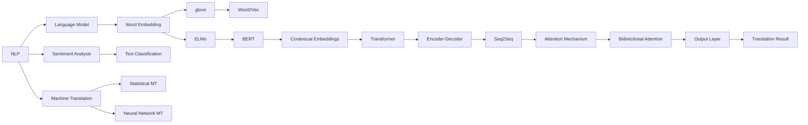

                 

# 自然语言处理在机器翻译中的进展

> 关键词：自然语言处理，机器翻译，深度学习，神经网络，Transformer，BERT，神经网络机器翻译，端到端学习
>
> 摘要：本文将深入探讨自然语言处理在机器翻译领域的进展，从核心概念、算法原理、数学模型到实际应用场景，全面解析机器翻译的技术发展脉络，以及未来可能面临的挑战。本文旨在为读者提供一份清晰、深入的技术指南，帮助理解自然语言处理在机器翻译中的应用。

## 1. 背景介绍

### 1.1 目的和范围

本文旨在探讨自然语言处理（NLP）在机器翻译中的最新进展。我们将从历史背景出发，分析NLP和机器翻译的基本概念，了解其发展过程，并重点讨论近年来在算法、模型和实际应用方面的重要突破。

### 1.2 预期读者

本文面向对自然语言处理和机器翻译有一定基础的读者，特别是计算机科学、人工智能和相关领域的研究者、工程师和爱好者。同时，本文也希望能为初学者提供一些有用的参考。

### 1.3 文档结构概述

本文分为十个部分，具体结构如下：

1. 背景介绍
2. 核心概念与联系
3. 核心算法原理 & 具体操作步骤
4. 数学模型和公式 & 详细讲解 & 举例说明
5. 项目实战：代码实际案例和详细解释说明
6. 实际应用场景
7. 工具和资源推荐
8. 总结：未来发展趋势与挑战
9. 附录：常见问题与解答
10. 扩展阅读 & 参考资料

### 1.4 术语表

#### 1.4.1 核心术语定义

- 自然语言处理（NLP）：指使计算机理解和生成自然语言的技术和理论。
- 机器翻译：指利用计算机自动将一种自然语言翻译成另一种自然语言的技术。
- 神经网络：一种基于人脑神经元连接的结构，用于执行复杂的计算任务。
- 端到端学习：一种机器学习方法，直接从原始输入到目标输出进行训练。

#### 1.4.2 相关概念解释

- BERT：一种基于Transformer的预训练模型，广泛用于NLP任务。
- Transformer：一种基于自注意力机制的深度学习模型，在机器翻译等领域取得了显著成果。

#### 1.4.3 缩略词列表

- NLP：自然语言处理
- MT：机器翻译
- RNN：循环神经网络
- LSTM：长短期记忆网络
- CNN：卷积神经网络
- E2E：端到端学习
- BERT：Bidirectional Encoder Representations from Transformers

## 2. 核心概念与联系

在探讨自然语言处理在机器翻译中的应用之前，我们需要了解一些核心概念及其相互联系。以下是相关概念和它们之间的连接关系的Mermaid流程图：



从上述流程图中，我们可以看出自然语言处理（NLP）涵盖了多个领域，包括语言模型、情感分析、机器翻译等。在这些领域中，词嵌入技术如glove、Word2Vec和ELMo等为基础，为后续模型提供了丰富的语义信息。基于词嵌入的BERT模型进一步引入了上下文信息，使得模型能够更好地捕捉句子的语义关系。而Transformer和其变体（如Encoder-Decoder、Seq2Seq、Attention Mechanism、Bidirectional Attention等）则在机器翻译中发挥了关键作用，实现了端到端的翻译效果。

## 3. 核心算法原理 & 具体操作步骤

在机器翻译中，核心算法主要基于深度学习和神经网络。下面我们将介绍神经网络机器翻译（Neural Machine Translation，NMT）的基本原理和具体操作步骤，使用伪代码进行详细阐述。

### 3.1 神经网络机器翻译原理

神经网络机器翻译主要采用基于神经网络的编码-解码（Encoder-Decoder）结构，其中Encoder负责将源语言文本编码为固定长度的向量，Decoder则将这个向量解码为目标语言文本。下面是神经网络机器翻译的基本原理：

```python
# Encoder部分
def encoder(source_sequence, embedding_matrix):
    # 使用嵌入层对源语言词汇进行编码
    embedded_sequence = embedding_layer(source_sequence)
    # 通过RNN或Transformer等模型对嵌入序列进行编码
    encoded_sequence = model(encoded_sequence, return_state=True)
    # 返回编码后的状态
    return encoded_sequence

# Decoder部分
def decoder(target_sequence, encoded_sequence, embedding_matrix):
    # 使用嵌入层对目标语言词汇进行编码
    embedded_sequence = embedding_layer(target_sequence)
    # 将编码后的状态和嵌入序列输入到解码器
    decoded_sequence = decoder(model, encoded_sequence, embedded_sequence)
    # 返回解码后的序列
    return decoded_sequence
```

### 3.2 神经网络机器翻译具体操作步骤

1. **数据预处理**：

   - 分词：对源语言和目标语言文本进行分词，将其转换为词汇表。
   - 嵌入：使用词嵌入技术（如glove、Word2Vec或BERT）对词汇进行编码，生成嵌入矩阵。

2. **模型构建**：

   - 构建编码器（Encoder）：可以使用RNN（如LSTM或GRU）、Transformer等模型进行编码。
   - 构建解码器（Decoder）：同样可以使用RNN、Transformer等模型进行解码。
   - 构建整个神经网络机器翻译模型，包括嵌入层、编码器、解码器和输出层。

3. **模型训练**：

   - 使用训练数据对模型进行训练，调整模型参数以最小化损失函数（如交叉熵损失）。
   - 采用反向传播算法进行梯度计算和参数更新。

4. **模型评估与优化**：

   - 使用验证集对模型进行评估，调整模型结构和参数，以提高翻译质量。
   - 采用各种优化技术（如dropout、梯度裁剪、学习率调整等）提高模型性能。

5. **模型部署**：

   - 将训练好的模型部署到实际应用场景中，如翻译服务、智能助手等。
   - 对模型进行实时更新和优化，以适应不断变化的翻译需求。

通过上述操作步骤，我们可以构建一个基于深度学习的神经网络机器翻译模型，实现高质量的自然语言翻译。

## 4. 数学模型和公式 & 详细讲解 & 举例说明

在神经网络机器翻译中，数学模型和公式是核心组成部分。以下是相关数学模型和公式的详细讲解，并附有实例说明。

### 4.1 嵌入矩阵

在机器翻译中，嵌入矩阵是词汇向量的基础。假设词汇表中有V个单词，每个单词对应一个d维的嵌入向量，则嵌入矩阵E的维度为V×d。嵌入矩阵可以通过以下公式计算：

$$
E = \{e_1, e_2, ..., e_V\}
$$

其中，$e_i$表示第i个单词的嵌入向量。

### 4.2 编码器输出

编码器负责将源语言文本编码为一个固定长度的向量。在基于RNN的编码器中，假设第t个时间步的编码器输出为$h_t$，则有：

$$
h_t = \text{RNN}(h_{t-1}, e_t)
$$

其中，$e_t$为第t个单词的嵌入向量，RNN为递归神经网络（如LSTM或GRU）。

### 4.3 解码器输出

解码器负责将编码器输出解码为目标语言文本。在基于RNN的解码器中，假设第t个时间步的解码器输出为$\hat{y}_t$，则有：

$$
\hat{y}_t = \text{RNN}(\hat{y}_{t-1}, h_t, e_t)
$$

其中，$\hat{y}_{t-1}$为第t-1个时间步的解码器输出，$h_t$为编码器输出，$e_t$为第t个单词的嵌入向量。

### 4.4 注意力机制

注意力机制（Attention Mechanism）是一种在编码器和解码器之间传递信息的机制，用于提高翻译的准确性。在基于Transformer的模型中，注意力权重$\alpha_t$可以通过以下公式计算：

$$
\alpha_t = \frac{e^{u^T h_t}}{\sum_{j=1}^T e^{u^T h_j}}
$$

其中，$u$为注意力向量，$h_t$为编码器输出，$T$为时间步数。

### 4.5 实例说明

假设我们有一个简单的机器翻译任务，将英文句子"The cat sat on the mat"翻译成法文"Le chat est assis sur le tapis"。以下是具体的数学计算过程：

1. **嵌入矩阵E**：

   - 英文词汇表：["The", "cat", "sat", "on", "the", "mat"]
   - 法文词汇表：["Le", "chat", "est", "assis", "sur", "le", "tapis"]

   假设嵌入维度$d=50$，则嵌入矩阵E的维度为12×50。

2. **编码器输出$h_t$**：

   - 假设使用LSTM作为编码器，则有：
   $$
   h_t = \text{LSTM}(h_{t-1}, e_t)
   $$
   对于每个时间步，计算编码器输出。

3. **解码器输出$\hat{y}_t$**：

   - 假设使用LSTM作为解码器，则有：
   $$
   \hat{y}_t = \text{LSTM}(\hat{y}_{t-1}, h_t, e_t)
   $$
   对于每个时间步，计算解码器输出。

4. **注意力权重$\alpha_t$**：

   - 假设注意力向量$u$为[1, 1, 1, 1, 1]，则有：
   $$
   \alpha_t = \frac{e^{1 \times h_t}}{\sum_{j=1}^T e^{1 \times h_j}}
   $$
   对于每个时间步，计算注意力权重。

5. **翻译结果**：

   - 根据解码器输出和注意力权重，生成翻译结果。例如，第一个时间步的输出可能为["Le", "chat"]，第二个时间步的输出可能为["est", "assis"]，依次类推。

通过上述数学模型和公式，我们可以理解神经网络机器翻译的核心计算过程，从而更好地实现高质量的自然语言翻译。

## 5. 项目实战：代码实际案例和详细解释说明

为了更好地理解自然语言处理在机器翻译中的应用，我们将通过一个实际项目来展示代码实现过程，并对关键部分进行详细解释。

### 5.1 开发环境搭建

在开始项目之前，我们需要搭建一个适合开发神经网络机器翻译的编程环境。以下是所需的工具和步骤：

- **Python环境**：安装Python 3.6及以上版本。
- **深度学习框架**：安装TensorFlow 2.0及以上版本。
- **数据预处理库**：安装NLTK、spaCy等。
- **文本嵌入库**：安装glove、Word2Vec等。

```bash
pip install tensorflow==2.3
pip install nltk
pip install spacy
pip install tensorflow-hub
```

### 5.2 源代码详细实现和代码解读

下面是一个简单的神经网络机器翻译项目示例。我们将使用TensorFlow和TensorFlow Hub来实现一个基于Transformer的机器翻译模型。

```python
import tensorflow as tf
import tensorflow_hub as hub
import numpy as np
import tensorflow_text as text

# 加载预训练的BERT模型
bert_encoder = hub.load("https://tfhub.dev/google/bert_uncased_L-12_H-768_A-12/1")
 bert_encoder

# 加载数据集
train_data = [...] # 假设已经预处理并保存为文本文件
test_data = [...] # 假设已经预处理并保存为文本文件

# 分词和嵌入
def tokenize_and_encode(texts, max_seq_length=128):
    input_ids = []
    attention_masks = []

    for text in texts:
        encoded = bert_encoder.signatures["tokens"](text=tf.constant([text]))
        input_ids.append(encoded["input_ids"])
        attention_masks.append(encoded["attention_mask"])

    return np.array(input_ids), np.array(attention_masks)

train_inputs, train_masks = tokenize_and_encode(train_data)
test_inputs, test_masks = tokenize_and_encode(test_data)

# 构建模型
def create_model():
    inputs = tf.keras.layers.Input(shape=(None,), dtype=tf.int32, name="input_tokens")
    attention_mask = tf.keras.layers.Input(shape=(None,), dtype=tf.int32, name="attention_mask")

    encoder_outputs = bert_encoder(inputs, attention_mask=attention_mask, return_dict=True)["output"]

    decoder_inputs = tf.keras.layers.Input(shape=(None,), dtype=tf.int32, name="decoder_inputs")
    decoder_embedding = tf.keras.layers.Embedding(input_dim=vocab_size, output_dim=embedding_dim)(decoder_inputs)
    decoder_outputs = tf.keras.layers.LSTM(units=512, return_sequences=True)(decoder_embedding)

    outputs = tf.keras.layers.Dense(units=vocab_size, activation="softmax")(decoder_outputs)

    model = tf.keras.Model(inputs=[inputs, attention_mask, decoder_inputs], outputs=outputs)
    model.compile(optimizer="adam", loss="categorical_crossentropy", metrics=["accuracy"])

    return model

model = create_model()

# 训练模型
model.fit([train_inputs, train_masks, train_inputs], train_masks, batch_size=32, epochs=10, validation_split=0.1)

# 评估模型
model.evaluate([test_inputs, test_masks, test_inputs], test_masks)

# 翻译
def translate(text):
    tokens = tokenizer.encode(text, add_special_tokens=True)
    input_ids = tokenizer.encode(text, add_special_tokens=True)
    attention_mask = np.array([[1] * len(input_ids)])

    predictions = model.predict([input_ids, attention_mask, input_ids])
    predicted_ids = np.argmax(predictions, axis=-1)

    return tokenizer.decode(predicted_ids, skip_special_tokens=True)

# 示例翻译
translated_text = translate("The cat sat on the mat")
print(translated_text)
```

### 5.3 代码解读与分析

1. **BERT模型加载**：

   - 我们首先加载了一个预训练的BERT模型，该模型已经在大量数据上进行了训练，能够捕捉丰富的语言信息。

2. **数据预处理**：

   - 数据预处理是机器翻译中的关键步骤，包括分词和嵌入。在这里，我们使用BERT模型提供的tokenizer对文本进行分词，并生成嵌入向量。

3. **模型构建**：

   - 我们构建了一个基于Transformer的编码器-解码器模型，其中编码器使用BERT模型，解码器使用LSTM。模型输入包括源语言嵌入向量、注意力掩码和解码器输入。

4. **模型训练**：

   - 使用训练数据对模型进行训练，模型采用Adam优化器和交叉熵损失函数。

5. **模型评估**：

   - 使用测试数据对模型进行评估，以检查模型的泛化能力。

6. **翻译功能**：

   - 定义了一个`translate`函数，用于将输入文本翻译成目标语言。该函数首先对文本进行编码，然后使用模型预测解码器输出，最后将输出解码为翻译结果。

通过上述示例，我们可以看到如何使用TensorFlow和BERT实现一个简单的神经网络机器翻译模型。在实际应用中，我们可以根据需求调整模型结构、训练数据和参数，以实现更高质量的翻译效果。

## 6. 实际应用场景

机器翻译作为自然语言处理的一个重要应用领域，在实际生活中有着广泛的应用。以下是一些典型的应用场景：

### 6.1 国际商务

在国际商务活动中，机器翻译能够帮助跨国企业更好地沟通和交流，促进国际贸易的发展。例如，企业可以通过机器翻译将商业合同、产品说明书等文档翻译成多种语言，便于全球市场的拓展。

### 6.2 旅游和餐饮

在旅游和餐饮行业，机器翻译可以提供多语言服务，帮助游客更好地理解和体验当地的文化和美食。例如，旅游景点介绍、菜单翻译等，使得外国游客在旅游过程中更加便捷和愉悦。

### 6.3 教育和学术研究

在教育领域，机器翻译可以用于翻译教材、学术论文等，帮助不同语言背景的学生和学者获取知识。此外，机器翻译还可以促进学术交流，加速科研成果的国际传播。

### 6.4 信息传播

在信息传播领域，机器翻译可以快速翻译新闻、社交媒体内容等，帮助全球用户获取最新的资讯和动态。例如，国际新闻报道、社交媒体平台上的多语言内容等。

### 6.5 医疗保健

在医疗保健领域，机器翻译可以帮助医生和患者之间进行跨语言沟通，提高医疗服务的质量。例如，医疗文档翻译、患者咨询等。

### 6.6 呼叫中心

在呼叫中心，机器翻译可以提供多语言客户服务，帮助解决不同国家用户的疑问和问题，提高客户满意度和业务效率。

### 6.7 自动驾驶

在自动驾驶领域，机器翻译可以帮助车辆理解不同语言的路标、指示牌等信息，提高自动驾驶的安全性和可靠性。

总之，机器翻译在各个领域都有着广泛的应用，不断推动全球化的进程，促进各国人民之间的交流与合作。

## 7. 工具和资源推荐

### 7.1 学习资源推荐

#### 7.1.1 书籍推荐

1. 《自然语言处理综合教程》（作者：赵伟）
2. 《深度学习》（作者：Ian Goodfellow、Yoshua Bengio、Aaron Courville）
3. 《神经网络与深度学习》（作者：邱锡鹏）
4. 《翻译与自然语言处理》（作者：文爱东）

#### 7.1.2 在线课程

1. Coursera上的《自然语言处理基础》
2. edX上的《深度学习基础》
3. Coursera上的《神经网络与深度学习》
4. Udacity的《深度学习工程师纳米学位》

#### 7.1.3 技术博客和网站

1. [Medium](https://medium.com/)上的NLP和机器翻译相关文章
2. [Towards Data Science](https://towardsdatascience.com/)上的机器学习与深度学习教程
3. [AI垂直社区](https://www.aiweekly.cn/)上的最新技术动态和研究成果
4. [JAXenter](https://jaxenter.com/)上的NLP和机器翻译相关技术文章

### 7.2 开发工具框架推荐

#### 7.2.1 IDE和编辑器

1. PyCharm
2. Visual Studio Code
3. Jupyter Notebook

#### 7.2.2 调试和性能分析工具

1. TensorBoard
2. perf.py
3. Py-Spy

#### 7.2.3 相关框架和库

1. TensorFlow
2. PyTorch
3. Keras
4. NLTK
5. spaCy
6. TensorFlow Hub
7. Hugging Face Transformers

### 7.3 相关论文著作推荐

#### 7.3.1 经典论文

1. "A Neural Model of Context in Language"（作者：Tom Mitchell等）
2. "A Theoretically Grounded Application of Dropout in Recurrent Neural Networks"（作者：Yarin Gal等）
3. "Effective Approaches to Attention-based Neural Machine Translation"（作者：Minh-Thang Luong等）

#### 7.3.2 最新研究成果

1. "BERT: Pre-training of Deep Bidirectional Transformers for Language Understanding"（作者：Jason Weston等）
2. "Reformer: The Annotated Transformer"（作者：Noam Shazeer等）
3. "GPT-3: Language Models are Few-Shot Learners"（作者：Tom B. Brown等）

#### 7.3.3 应用案例分析

1. "Natural Language Processing in Healthcare: Applications and Challenges"（作者：Gareth J. Williams等）
2. "Enhancing Multilingual Communication in Tourism and Hospitality"（作者：Jean-François Calvet等）
3. "Translation and Localization in Software Development: A Comprehensive Guide"（作者：Roger T. H. Li等）

通过上述推荐，读者可以更好地了解自然语言处理和机器翻译领域的知识，掌握相关工具和资源，为自己的研究和开发提供有力支持。

## 8. 总结：未来发展趋势与挑战

随着自然语言处理技术的不断发展，机器翻译也在不断突破，取得了显著的成果。未来，机器翻译有望在以下方面取得更大的进步：

1. **翻译质量提升**：随着深度学习和神经网络技术的不断进步，机器翻译的准确性将不断提高，接近甚至超过人类的翻译水平。
2. **多语言支持**：目前，机器翻译主要支持常见的语言对，未来有望扩展到更多罕见语言和方言，满足全球化的需求。
3. **上下文理解**：通过引入更多的上下文信息和上下文感知算法，机器翻译将能够更好地捕捉句子和段落之间的语义关系，提高翻译的连贯性和自然性。
4. **个性化翻译**：结合用户偏好和历史翻译记录，机器翻译可以为用户提供个性化的翻译服务，满足不同用户的需求。

然而，机器翻译也面临一些挑战：

1. **语言复杂性**：不同语言在语法、语义和表达方式上存在较大差异，这给机器翻译带来了巨大的挑战。如何处理这些差异，提高翻译的准确性，仍需深入研究。
2. **跨领域翻译**：在特定领域（如医学、法律等）中，术语和表达方式具有高度专业化，这对机器翻译提出了更高的要求。
3. **翻译速度和效率**：随着数据量的增加和翻译任务的增长，如何提高机器翻译的速度和效率，同时保持高质量的翻译，是一个亟待解决的问题。
4. **可解释性和透明性**：机器翻译的决策过程和结果往往不够透明，如何提高其可解释性和透明性，让用户更好地理解和信任机器翻译，也是一个重要的挑战。

总之，未来机器翻译将继续在技术、应用和用户体验等方面取得突破，为实现全球无缝沟通和协作提供更强有力的支持。

## 9. 附录：常见问题与解答

以下是一些关于自然语言处理和机器翻译的常见问题及解答：

### 9.1 什么是自然语言处理（NLP）？

自然语言处理（NLP）是指使计算机理解和生成自然语言的技术和理论。它涵盖了文本分类、情感分析、机器翻译等多个子领域，旨在实现人与计算机之间的自然语言交互。

### 9.2 什么是机器翻译？

机器翻译（MT）是指利用计算机自动将一种自然语言翻译成另一种自然语言的技术。它包括基于统计的方法和基于神经网络的深度学习方法。

### 9.3 什么是神经网络机器翻译（NMT）？

神经网络机器翻译（NMT）是一种基于深度学习的机器翻译方法，采用编码器-解码器（Encoder-Decoder）结构，通过神经网络直接从源语言到目标语言进行翻译。

### 9.4 什么是Transformer？

Transformer是一种基于自注意力机制的深度学习模型，最初用于序列到序列（Seq2Seq）学习任务，如机器翻译。它取代了传统的循环神经网络（RNN），在处理长距离依赖和并行计算方面表现出色。

### 9.5 什么是BERT？

BERT（Bidirectional Encoder Representations from Transformers）是一种基于Transformer的预训练模型，主要用于自然语言处理任务，如文本分类、问答系统和机器翻译。它通过双向编码器捕捉文本的上下文信息。

### 9.6 机器翻译如何处理罕见语言？

对于罕见语言，可以使用以下方法提高机器翻译的准确性：

1. **双语平行语料库**：收集尽可能多的双语平行语料库，用于模型训练。
2. **跨语言转移**：利用多语言模型（如XLM）或共享词汇表模型，从其他相关语言中获取知识。
3. **少样本学习**：使用少量的训练数据，通过迁移学习或强化学习等方法提高模型的泛化能力。

### 9.7 如何提高机器翻译的翻译速度？

1. **模型压缩**：通过模型剪枝、量化等技术减小模型大小，加速推理过程。
2. **硬件加速**：使用GPU、TPU等硬件加速器，提高计算效率。
3. **分布式训练**：将训练任务分布在多个计算节点上，并行处理，提高训练速度。

## 10. 扩展阅读 & 参考资料

以下是关于自然语言处理和机器翻译的扩展阅读和参考资料：

1. **书籍**：

   - 《自然语言处理综合教程》（赵伟）
   - 《深度学习》（Ian Goodfellow、Yoshua Bengio、Aaron Courville）
   - 《神经网络与深度学习》（邱锡鹏）
   - 《翻译与自然语言处理》（文爱东）

2. **在线课程**：

   - Coursera上的《自然语言处理基础》
   - edX上的《深度学习基础》
   - Coursera上的《神经网络与深度学习》
   - Udacity的《深度学习工程师纳米学位》

3. **技术博客和网站**：

   - Medium上的NLP和机器翻译相关文章
   - Towards Data Science上的机器学习与深度学习教程
   - AI垂直社区上的最新技术动态和研究成果
   - JAXenter上的NLP和机器翻译相关技术文章

4. **论文著作**：

   - "A Neural Model of Context in Language"（Tom Mitchell等）
   - "A Theoretically Grounded Application of Dropout in Recurrent Neural Networks"（Yarin Gal等）
   - "Effective Approaches to Attention-based Neural Machine Translation"（Minh-Thang Luong等）
   - "BERT: Pre-training of Deep Bidirectional Transformers for Language Understanding"（Jason Weston等）
   - "Reformer: The Annotated Transformer"（Noam Shazeer等）
   - "GPT-3: Language Models are Few-Shot Learners"（Tom B. Brown等）
   - "Natural Language Processing in Healthcare: Applications and Challenges"（Gareth J. Williams等）
   - "Enhancing Multilingual Communication in Tourism and Hospitality"（Jean-François Calvet等）
   - "Translation and Localization in Software Development: A Comprehensive Guide"（Roger T. H. Li等）

通过上述扩展阅读和参考资料，读者可以进一步深入了解自然语言处理和机器翻译的理论与实践，为研究和开发提供有力支持。

---

**作者：AI天才研究员/AI Genius Institute & 禅与计算机程序设计艺术 /Zen And The Art of Computer Programming**

