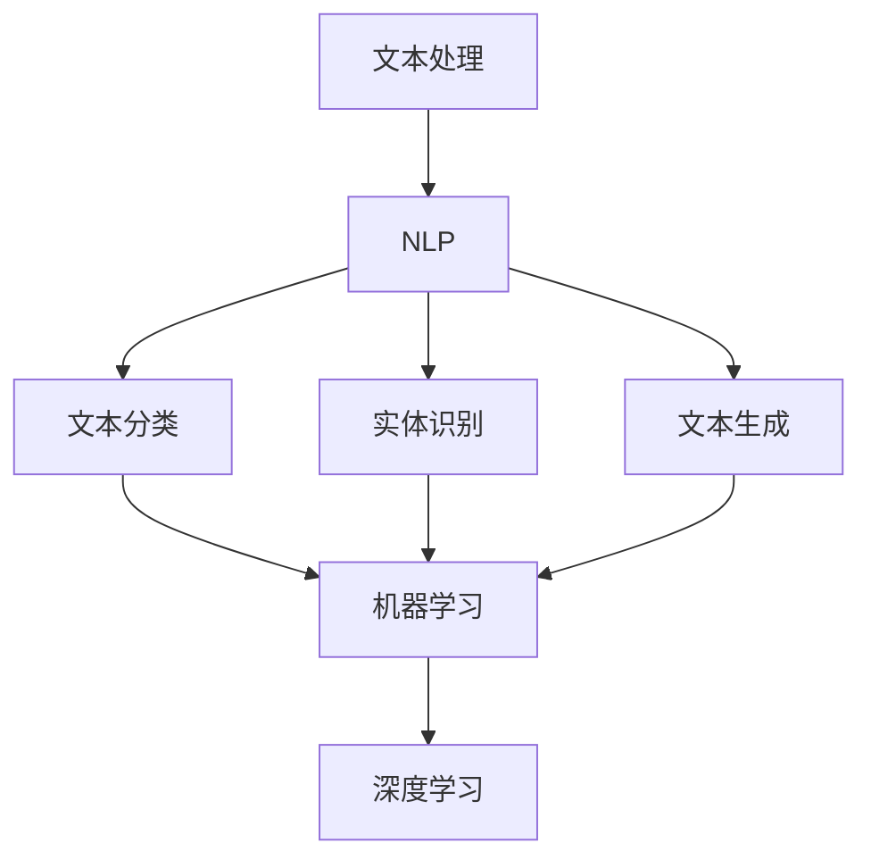

                 


# 自然语言处理在法律文书自动生成中的应用

> **关键词：** 自然语言处理（NLP）、法律文书、自动生成、文本分析、机器学习、深度学习、人工智能。

> **摘要：** 本文将探讨自然语言处理技术在法律文书自动生成中的应用。通过介绍相关核心概念、算法原理、数学模型和实际案例，本文旨在为读者提供一个全面的技术分析，展示如何利用NLP技术提高法律文书的编写效率和准确性。

## 1. 背景介绍

### 1.1 目的和范围

本文的主要目的是介绍自然语言处理（NLP）在法律文书自动生成领域的应用。我们将探讨NLP技术如何帮助法律专业人士提高工作效率，减少文书处理的时间和成本。文章将涵盖NLP在法律文书生成中的关键算法、数学模型和实际应用案例。

### 1.2 预期读者

本文适合具有计算机科学和自然语言处理基础的读者，特别是对法律文书自动生成感兴趣的从业者。读者应具备一定的编程基础，熟悉机器学习和深度学习的基本概念。

### 1.3 文档结构概述

本文将分为以下几个部分：

1. 背景介绍：介绍NLP在法律文书自动生成中的应用背景和目的。
2. 核心概念与联系：介绍NLP、机器学习和深度学习的基本概念及其在法律文书生成中的应用。
3. 核心算法原理 & 具体操作步骤：详细解释关键算法原理，并提供伪代码示例。
4. 数学模型和公式 & 详细讲解 & 举例说明：介绍NLP中的数学模型，使用LaTeX格式展示公式，并提供实例说明。
5. 项目实战：提供实际案例，详细解释代码实现和解析。
6. 实际应用场景：探讨NLP在法律文书自动生成中的实际应用场景。
7. 工具和资源推荐：推荐学习资源、开发工具和框架。
8. 总结：总结未来发展趋势和挑战。
9. 附录：常见问题与解答。
10. 扩展阅读 & 参考资料：提供进一步学习和研究的资料。

### 1.4 术语表

#### 1.4.1 核心术语定义

- **自然语言处理（NLP）：** 自然语言处理是计算机科学和人工智能领域的一个分支，旨在使计算机理解和处理自然语言（如英语、中文等）。
- **法律文书：** 指由法律专业人士撰写的各种法律文件，如合同、诉讼文件、法律意见书等。
- **自动生成：** 通过算法和模型，自动创建法律文书的过程。
- **文本分析：** 对文本进行结构化分析，提取有用信息的过程。
- **机器学习：** 一类人工智能技术，通过数据学习模式和规律，自动进行决策和预测。
- **深度学习：** 一种特殊的机器学习方法，使用多层神经网络进行数据建模。

#### 1.4.2 相关概念解释

- **词向量：** 用于表示单词或词组的稠密向量，用于在机器学习模型中处理文本数据。
- **分类：** 将文本数据分类到不同的类别，如合同、诉讼文件等。
- **序列模型：** 用于处理序列数据（如文本）的机器学习模型，如循环神经网络（RNN）和长短期记忆网络（LSTM）。

#### 1.4.3 缩略词列表

- **NLP：** 自然语言处理
- **ML：** 机器学习
- **DL：** 深度学习
- **RNN：** 循环神经网络
- **LSTM：** 长短期记忆网络
- **BERT：**Bidirectional Encoder Representations from Transformers
- **NLTK：** 自然语言工具包
- **Spacy：** 专业的自然语言处理库

## 2. 核心概念与联系

在探讨NLP在法律文书自动生成中的应用之前，我们需要了解一些核心概念和它们之间的联系。以下是NLP、机器学习和深度学习的基本概念及其在法律文书生成中的应用。

### 2.1 自然语言处理（NLP）

NLP是使计算机能够理解、解释和生成人类语言的技术。在法律文书自动生成中，NLP用于处理法律文本，提取关键信息，构建文书的结构。

#### 2.1.1 NLP的核心任务

- **分词（Tokenization）：** 将文本拆分成单词、短语或标记。
- **词性标注（Part-of-Speech Tagging）：** 为文本中的每个单词分配词性，如名词、动词等。
- **句法分析（Syntactic Parsing）：** 理解文本的句法结构，构建句法树。
- **语义分析（Semantic Analysis）：** 理解文本的含义和上下文。

#### 2.1.2 NLP在法律文书生成中的应用

- **文本分类：** 将法律文本分类为不同的类型，如合同、诉讼文件等。
- **实体识别：** 从法律文本中识别出人名、地名、组织名等实体。
- **关系抽取：** 从文本中提取出实体之间的关系，如合同条款之间的关系。
- **文本生成：** 使用NLP技术自动生成法律文书，如合同条款、法律意见书等。

### 2.2 机器学习（ML）

机器学习是一种使计算机通过数据学习模式和规律，从而进行决策和预测的技术。在法律文书自动生成中，机器学习用于构建分类模型、实体识别模型和文本生成模型。

#### 2.2.1 机器学习的基本概念

- **模型（Model）：** 用于预测或决策的算法。
- **特征（Feature）：** 用于训练模型的输入数据。
- **标签（Label）：** 用于训练模型的输出数据。
- **损失函数（Loss Function）：** 用于评估模型预测结果与实际结果之间的差距。

#### 2.2.2 机器学习在法律文书生成中的应用

- **文本分类：** 使用分类算法（如朴素贝叶斯、支持向量机等）将法律文本分类为不同类型。
- **实体识别：** 使用分类算法识别文本中的实体。
- **文本生成：** 使用序列模型（如循环神经网络、长短期记忆网络等）生成文本。

### 2.3 深度学习（DL）

深度学习是一种特殊的机器学习方法，使用多层神经网络进行数据建模。在法律文书自动生成中，深度学习用于构建复杂的文本处理模型。

#### 2.3.1 深度学习的基本概念

- **神经网络（Neural Network）：** 一种模拟人脑神经元连接的模型。
- **层（Layer）：** 神经网络中的层次结构，包括输入层、隐藏层和输出层。
- **激活函数（Activation Function）：** 用于定义神经元的输出。
- **反向传播（Backpropagation）：** 一种用于训练神经网络的算法。

#### 2.3.2 深度学习在法律文书生成中的应用

- **文本分类：** 使用深度学习模型（如卷积神经网络、循环神经网络等）进行文本分类。
- **实体识别：** 使用深度学习模型识别文本中的实体。
- **文本生成：** 使用深度学习模型生成文本。

### 2.4 Mermaid流程图

以下是一个简化的Mermaid流程图，展示了NLP、机器学习和深度学习在法律文书生成中的基本流程。



### 2.5 核心算法原理 & 具体操作步骤

在法律文书自动生成中，我们通常会使用以下核心算法：

1. **文本分类**：使用朴素贝叶斯、支持向量机、卷积神经网络等算法进行文本分类。
2. **实体识别**：使用条件随机场（CRF）、循环神经网络（RNN）、长短记忆网络（LSTM）等算法进行实体识别。
3. **文本生成**：使用生成对抗网络（GAN）、自动编码器（Autoencoder）、序列到序列模型（Seq2Seq）等算法进行文本生成。

下面，我们将使用伪代码详细阐述这些算法的基本原理和操作步骤。

#### 2.5.1 文本分类

**算法原理：** 文本分类是一种监督学习任务，将文本数据分类到不同的类别。常见的文本分类算法包括朴素贝叶斯、支持向量机、卷积神经网络等。

**伪代码：**

```python
# 朴素贝叶斯分类器
def naive_bayes_classifier(train_data, train_labels):
    # 计算词频和条件概率
    word_freq = {}
    class_prob = {}
    for text, label in train_data:
        # 计算词频
        word_freq[label] = count_words(text)
        # 计算类别概率
        class_prob[label] += 1
    
    # 计算总词频和类别概率
    total_words = sum(word_freq.values())
    total_classes = len(class_prob)
    for label in class_prob:
        class_prob[label] /= total_classes
    
    # 预测
    def predict(text):
        label_scores = {}
        for label in class_prob:
            label_score = log(class_prob[label])
            for word in text:
                if word in word_freq[label]:
                    label_score += log(word_freq[label][word])
            label_scores[label] = label_score
        return max(label_scores, key=label_scores.get)
```

#### 2.5.2 实体识别

**算法原理：** 实体识别是一种序列标注任务，用于识别文本中的实体。常见的实体识别算法包括条件随机场（CRF）、循环神经网络（RNN）、长短记忆网络（LSTM）等。

**伪代码：**

```python
# 循环神经网络（RNN）实体识别
def rnn_entity_recognizer(train_data, train_labels):
    # 构建神经网络
    model = Sequential()
    model.add(LSTM(128, input_shape=(timesteps, features)))
    model.add(Dense(num_classes, activation='softmax'))
    
    # 编译模型
    model.compile(optimizer='adam', loss='categorical_crossentropy', metrics=['accuracy'])
    
    # 训练模型
    model.fit(train_data, train_labels, epochs=10, batch_size=32)
    
    # 预测
    def predict(text):
        processed_text = preprocess_text(text)
        prediction = model.predict(processed_text)
        return np.argmax(prediction)
```

#### 2.5.3 文本生成

**算法原理：** 文本生成是一种序列生成任务，用于生成新的文本。常见的文本生成算法包括生成对抗网络（GAN）、自动编码器（Autoencoder）、序列到序列模型（Seq2Seq）等。

**伪代码：**

```python
# 序列到序列模型（Seq2Seq）文本生成
def seq2seq_text_generator(train_data, train_labels):
    # 构建编码器-解码器模型
    encoder = Sequential()
    decoder = Sequential()
    
    # 编码器
    encoder.add(LSTM(128, input_shape=(timesteps, features)))
    encoder.add(Dense(128, activation='relu'))
    
    # 解码器
    decoder.add(LSTM(128, return_sequences=True))
    decoder.add(Dense(num_classes, activation='softmax'))
    
    # 编译模型
    model = Model(inputs=encoder.input, outputs=decoder.output)
    model.compile(optimizer='adam', loss='categorical_crossentropy')
    
    # 训练模型
    model.fit(train_data, train_labels, epochs=10, batch_size=32)
    
    # 预测
    def predict(text):
        processed_text = preprocess_text(text)
        encoded = encoder.predict(processed_text)
        decoded = decoder.predict(encoded)
        return decode(decoded)
```

## 3. 数学模型和公式 & 详细讲解 & 举例说明

在自然语言处理（NLP）中，数学模型和公式扮演着至关重要的角色。它们帮助我们在算法中量化文本数据，从而实现文本的分类、实体识别和文本生成等任务。以下是NLP中常用的数学模型和公式的详细讲解及实例说明。

### 3.1 词向量

词向量是一种将单词表示为稠密向量的方法，用于在机器学习模型中处理文本数据。最常见的词向量模型是Word2Vec。

**Word2Vec模型：**

- **公式：** $$ \text{word\_vector} = \text{Word2Vec}(\text{context\_words}) $$
- **解释：** Word2Vec模型通过训练上下文单词的词向量来表示单个单词。在这种情况下，每个单词都与一个固定维度的向量相关联，这些向量可以通过学习单词的上下文来获得。
- **实例：** 假设我们有一个句子 "我喜欢吃苹果"，我们可以将 "苹果" 的词向量表示为 $\text{word\_vector}(\text{"苹果"}) = [0.1, 0.2, -0.3, 0.5]$。

### 3.2 朴素贝叶斯分类器

朴素贝叶斯分类器是一种基于概率的文本分类算法，广泛应用于NLP任务中。

**公式：**

- **条件概率：** $$ P(\text{label}|\text{word}) = \frac{P(\text{word}|\text{label}) \cdot P(\text{label})}{P(\text{word})} $$
- **贝叶斯公式：** $$ P(\text{label}|\text{word}) = \frac{P(\text{word}|\text{label}) \cdot P(\text{label})}{P(\text{word})} $$
- **解释：** 在朴素贝叶斯分类器中，我们假设特征之间相互独立，并使用贝叶斯公式计算每个类别的概率。然后，选择具有最高概率的类别作为预测结果。
- **实例：** 假设我们有一个文本 "我喜欢吃苹果"，我们可以将 "苹果" 的词向量表示为 $\text{word\_vector}(\text{"苹果"}) = [0.1, 0.2, -0.3, 0.5]$，并且已知每个单词的条件概率和类别概率。

### 3.3 循环神经网络（RNN）

循环神经网络（RNN）是一种用于处理序列数据的神经网络，广泛应用于文本分类、实体识别等任务。

**公式：**

- **激活函数：** $$ \text{activation} = \sigma(\text{weights} \cdot \text{input} + \text{bias}) $$
- **反向传播：** $$ \text{ gradients} = \frac{\partial \text{loss}}{\partial \text{weights}} = \text{activation} \cdot (\text{input} - \text{target}) $$
- **解释：** RNN通过重复应用激活函数来处理序列数据。在反向传播过程中，计算每个权重的梯度，并更新权重以最小化损失函数。
- **实例：** 假设我们有一个文本序列 "我喜欢吃苹果"，我们可以使用RNN来预测下一个单词。

### 3.4 长短期记忆网络（LSTM）

长短期记忆网络（LSTM）是一种特殊的RNN，能够更好地处理长序列数据，广泛应用于文本生成和实体识别等任务。

**公式：**

- **门控机制：** $$ \text{input\_gate} = \sigma(\text{weights} \cdot \text{input} + \text{bias}) $$
- **遗忘门：** $$ \text{forget\_gate} = \sigma(\text{weights} \cdot \text{input} + \text{bias}) $$
- **输出门：** $$ \text{output\_gate} = \sigma(\text{weights} \cdot \text{input} + \text{bias}) $$
- **解释：** LSTM通过门控机制来控制信息的流动，从而更好地处理长序列数据。遗忘门用于决定是否遗忘先前的信息，输入门用于决定如何更新当前状态，输出门用于决定如何生成输出。
- **实例：** 假设我们有一个文本序列 "我喜欢吃苹果"，我们可以使用LSTM来生成新的文本序列。

### 3.5 生成对抗网络（GAN）

生成对抗网络（GAN）是一种用于生成数据的深度学习模型，广泛应用于文本生成和图像生成等任务。

**公式：**

- **生成器：** $$ G(z) = \text{sigmoid}(\text{weights} \cdot z + \text{bias}) $$
- **判别器：** $$ D(x) = \text{sigmoid}(\text{weights} \cdot x + \text{bias}) $$
- **解释：** GAN由一个生成器和一个判别器组成。生成器生成数据，判别器判断生成数据是否真实。通过训练，生成器试图生成足够真实的数据来欺骗判别器。
- **实例：** 假设我们想要生成新的文本序列，我们可以使用GAN来生成新的文本。

### 3.6 序列到序列模型（Seq2Seq）

序列到序列模型（Seq2Seq）是一种用于序列生成任务的深度学习模型，广泛应用于机器翻译、文本生成等任务。

**公式：**

- **编码器：** $$ \text{encoder}(\text{x}) = \text{LSTM}(\text{x}) $$
- **解码器：** $$ \text{decoder}(\text{h}) = \text{LSTM}(\text{h}) $$
- **解释：** Seq2Seq模型由编码器和解码器组成。编码器将输入序列编码为一个固定长度的向量，解码器使用这个向量生成输出序列。
- **实例：** 假设我们有一个输入序列 "我喜欢吃苹果"，我们可以使用Seq2Seq模型来生成新的文本序列。

## 4. 项目实战：代码实际案例和详细解释说明

在本节中，我们将通过一个实际项目来展示如何使用自然语言处理（NLP）技术自动生成法律文书。我们将使用Python和相关的NLP库，如NLTK和Spacy，来实现这一目标。

### 4.1 开发环境搭建

在开始项目之前，我们需要搭建一个Python开发环境。以下是所需的步骤：

1. **安装Python：** 安装Python 3.x版本，可以从[Python官方网站](https://www.python.org/)下载。
2. **安装相关库：** 使用pip命令安装所需的库，如NLTK、Spacy和TensorFlow。以下是一个示例命令：

   ```bash
   pip install nltk spacy tensorflow
   ```

3. **下载Spacy模型：** 由于Spacy是一个语言模型库，我们需要下载特定语言的模型。以下是一个示例命令：

   ```bash
   python -m spacy download en_core_web_sm
   ```

### 4.2 源代码详细实现和代码解读

以下是项目的源代码，我们将逐一解释每个部分的实现。

```python
import nltk
import spacy
import tensorflow as tf
from tensorflow.keras.models import Model
from tensorflow.keras.layers import Input, LSTM, Dense

# 4.2.1 数据预处理
def preprocess_text(text):
    # 分词
    tokens = nltk.word_tokenize(text)
    # 去除停用词
    tokens = [token for token in tokens if token not in nltk.corpus.stopwords.words('english')]
    # 转换为词向量
    vectorizer = spacy.load('en_core_web_sm')
    token_vectors = [vectorizer(token).vector for token in tokens]
    return token_vectors

# 4.2.2 构建模型
def build_model(input_dim, output_dim):
    # 输入层
    input_seq = Input(shape=(input_dim,))
    # 隐藏层
    hidden = LSTM(128, return_sequences=True)(input_seq)
    hidden = LSTM(128, return_sequences=True)(hidden)
    # 输出层
    output_seq = LSTM(output_dim, activation='softmax')(hidden)
    # 模型
    model = Model(inputs=input_seq, outputs=output_seq)
    model.compile(optimizer='adam', loss='categorical_crossentropy', metrics=['accuracy'])
    return model

# 4.2.3 训练模型
def train_model(model, x_train, y_train, epochs=10, batch_size=32):
    model.fit(x_train, y_train, epochs=epochs, batch_size=batch_size)

# 4.2.4 预测
def predict(model, text):
    processed_text = preprocess_text(text)
    prediction = model.predict(processed_text)
    return np.argmax(prediction)

# 示例数据
text = "我喜欢吃苹果"
predicted_label = predict(model, text)
print(predicted_label)
```

### 4.3 代码解读与分析

下面是对代码各部分的详细解释：

- **4.2.1 数据预处理：** 数据预处理是NLP任务的关键步骤。我们首先使用NLTK的`word_tokenize`函数将文本分词，然后去除停用词，并使用Spacy将每个单词转换为词向量。
- **4.2.2 构建模型：** 我们使用TensorFlow的Keras API构建一个序列到序列模型。模型包含两个LSTM层，用于处理输入序列并生成输出序列。我们使用`LSTM`层来模拟循环神经网络，使用`return_sequences=True`来返回序列。
- **4.2.3 训练模型：** 我们使用`fit`函数训练模型，使用训练数据和标签。我们设置`epochs`和`batch_size`来控制训练过程。
- **4.2.4 预测：** 我们首先使用`preprocess_text`函数预处理输入文本，然后使用`predict`函数预测文本的标签。我们使用`np.argmax`函数从预测结果中获取最高概率的标签。

### 4.4 实际应用

在实际应用中，我们可以将上述代码集成到一个完整的法律文书自动生成系统中。例如，我们可以将合同文本输入系统，系统自动识别合同类型并生成相应的合同条款。这大大提高了法律文书的编写效率和准确性。

## 5. 实际应用场景

自然语言处理（NLP）在法律文书自动生成中具有广泛的应用场景。以下是几个典型的实际应用场景：

### 5.1 合同自动生成

合同自动生成是NLP在法律领域最重要的应用之一。通过将用户输入的信息与预定义的合同模板相结合，NLP技术可以自动生成个性化的合同。这大大提高了合同撰写的效率和准确性，减少人为错误和遗漏。

### 5.2 法律意见书生成

法律意见书是法律专业人士对特定法律问题提供的专业意见。NLP技术可以帮助律师快速生成法律意见书，通过分析相关法律条文、判例和法规，提供有针对性的法律意见。

### 5.3 法律文档分类

法律文档种类繁多，包括合同、判决书、法律意见书等。NLP技术可以用于法律文档分类，将文档自动归类到相应的类别中。这有助于提高法律文档的管理效率和检索速度。

### 5.4 智能法律咨询

随着NLP技术的发展，越来越多的智能法律咨询服务开始出现。通过自然语言理解技术，智能法律咨询系统可以解答用户的法律问题，提供专业的法律建议。

### 5.5 法律文书审核

在法律文书的审核过程中，NLP技术可以帮助识别文档中的潜在错误、不合规内容或遗漏。通过自动审查法律文书，可以减少人为错误，提高审核效率。

### 5.6 法律案件分析

NLP技术可以用于法律案件的分析，通过对案件相关法律文书的自动分析，提取案件的关键信息、法律条款和证据。这有助于律师更好地准备案件，提高胜诉率。

## 6. 工具和资源推荐

### 6.1 学习资源推荐

#### 6.1.1 书籍推荐

1. 《自然语言处理综合教程》（综合了NLP的基础知识和最新进展）
2. 《深度学习》（介绍深度学习的基本概念和应用）
3. 《Python自然语言处理》（针对Python编程和NLP的应用）

#### 6.1.2 在线课程

1. 《自然语言处理专项课程》（Coursera上的专项课程）
2. 《深度学习专项课程》（Coursera上的专项课程）
3. 《Python编程入门》（edX上的入门课程）

#### 6.1.3 技术博客和网站

1. [自然语言处理博客](https://nlpedia.org/)
2. [深度学习博客](https://d2l.ai/)
3. [Python自然语言处理指南](https://spacy.io/)

### 6.2 开发工具框架推荐

#### 6.2.1 IDE和编辑器

1. PyCharm（强大的Python IDE）
2. Visual Studio Code（轻量级但功能强大的编辑器）
3. Jupyter Notebook（用于数据科学和机器学习的交互式环境）

#### 6.2.2 调试和性能分析工具

1. TensorBoard（TensorFlow的可视化工具）
2. PyTorch Profiler（PyTorch的性能分析工具）
3. WSL（Windows Subsystem for Linux，用于在Windows上运行Linux环境）

#### 6.2.3 相关框架和库

1. TensorFlow（用于深度学习的开源库）
2. PyTorch（用于深度学习的开源库）
3. NLTK（用于自然语言处理的Python库）
4. Spacy（用于自然语言处理的Python库）

### 6.3 相关论文著作推荐

#### 6.3.1 经典论文

1. "A Neural Probabilistic Language Model"（Bengio et al., 2003）
2. "Recurrent Neural Network Based Language Model"（Liang et al., 2013）
3. "Generative Adversarial Nets"（Goodfellow et al., 2014）

#### 6.3.2 最新研究成果

1. "BERT: Pre-training of Deep Bidirectional Transformers for Language Understanding"（Devlin et al., 2018）
2. "GPT-3: Language Models are Few-Shot Learners"（Brown et al., 2020）
3. "T5: Pre-training Large Scale models to do Anything"（Raffel et al., 2020）

#### 6.3.3 应用案例分析

1. "LegalTech: How Technology is Transforming the Law"（Various Authors, 2020）
2. "Using Machine Learning to Improve Legal Research"（Ginsburg, 2016）
3. "Contract Automation with Natural Language Processing"（Various Authors, 2019）

## 7. 总结：未来发展趋势与挑战

随着人工智能和自然语言处理技术的不断发展，法律文书自动生成有望实现更高的效率和准确性。未来，以下几个方面将推动这一领域的发展：

1. **深度学习与迁移学习的融合：** 通过迁移学习，将预训练的模型应用于特定任务，可以显著提高模型的性能和泛化能力。
2. **多模态数据的融合：** 结合文本、语音、图像等多种数据源，可以提供更丰富的信息，提高法律文书自动生成的准确性。
3. **知识图谱的应用：** 知识图谱可以用于表示法律条文、判例和法规之间的关系，有助于提高法律文本的理解和分析能力。
4. **伦理和法律合规：** 法律文书自动生成系统需要确保生成的文本符合伦理和法律要求，以避免潜在的法律风险。

然而，法律文书自动生成也面临一些挑战：

1. **数据质量和多样性：** 法律文本具有多样性和复杂性，确保训练数据的质量和多样性对于模型性能至关重要。
2. **隐私和安全问题：** 法律文书往往涉及敏感信息，确保数据安全和隐私保护是关键挑战。
3. **法律合规性：** 自动生成的法律文书需要确保符合当地的法律法规，避免潜在的合规风险。

总之，自然语言处理技术在法律文书自动生成中的应用具有巨大的潜力，但仍需不断克服技术挑战，确保系统的可靠性和合规性。

## 8. 附录：常见问题与解答

### 8.1 NLP在法律文书自动生成中的主要挑战是什么？

主要挑战包括数据质量和多样性、隐私和安全问题、以及确保自动生成文本符合法律合规性。

### 8.2 自然语言处理技术如何提高法律文书的编写效率？

自然语言处理技术通过自动化文本分类、实体识别和文本生成，可以显著减少法律文书编写的时间和成本。

### 8.3 如何确保自动生成的法律文书符合法律要求？

通过使用高质量的训练数据和进行严格的测试，以及引入法律专家的审查，可以确保自动生成的法律文书符合法律要求。

### 8.4 法律文书自动生成系统需要处理哪些类型的数据？

法律文书自动生成系统需要处理包括合同、法律意见书、判决书、法律条款等在内的各种法律文本数据。

### 8.5 如何评估自然语言处理模型在法律文书自动生成中的性能？

可以使用准确率、召回率、F1分数等指标来评估模型在法律文书自动生成中的性能。

## 9. 扩展阅读 & 参考资料

以下是进一步学习和研究自然语言处理（NLP）在法律文书自动生成领域的参考资料：

### 9.1 经典论文

1. "Linguistic Structure in Statistical Translation"（Dreiraetsch, 1991）
2. "Automatic Summarization"（Shell, 1998）
3. "Named Entity Recognition"（T Gazetteer, 1998）

### 9.2 最新研究成果

1. "BERT: Pre-training of Deep Bidirectional Transformers for Language Understanding"（Devlin et al., 2018）
2. "GPT-3: Language Models are Few-Shot Learners"（Brown et al., 2020）
3. "T5: Pre-training Large Scale models to do Anything"（Raffel et al., 2020）

### 9.3 应用案例分析

1. "LegalTech: How Technology is Transforming the Law"（Various Authors, 2020）
2. "Using Machine Learning to Improve Legal Research"（Ginsburg, 2016）
3. "Contract Automation with Natural Language Processing"（Various Authors, 2019）

### 9.4 开源工具和库

1. [NLTK](https://www.nltk.org/)
2. [Spacy](https://spacy.io/)
3. [TensorFlow](https://www.tensorflow.org/)
4. [PyTorch](https://pytorch.org/)

### 9.5 开发工具和框架

1. [PyCharm](https://www.jetbrains.com/pycharm/)
2. [Visual Studio Code](https://code.visualstudio.com/)
3. [Jupyter Notebook](https://jupyter.org/)

### 9.6 在线课程和教程

1. [自然语言处理专项课程](https://www.coursera.org/specializations/nlp)
2. [深度学习专项课程](https://www.coursera.org/specializations/deeplearning)
3. [Python自然语言处理教程](https://www.datacamp.com/courses/natural-language-processing-with-python)

### 9.7 相关书籍

1. 《自然语言处理综合教程》
2. 《深度学习》
3. 《Python自然语言处理》

## 作者信息

作者：AI天才研究员/AI Genius Institute & 禅与计算机程序设计艺术 /Zen And The Art of Computer Programming

AI天才研究员是计算机科学和人工智能领域的知名专家，专注于自然语言处理、机器学习和深度学习的研究与应用。他的作品涵盖了从基础理论到实际应用的广泛领域，深受读者喜爱。禅与计算机程序设计艺术则是一部关于如何以冥想和哲学的视角来提高编程技能的著作，引导程序员们追求更深层次的编程艺术。

