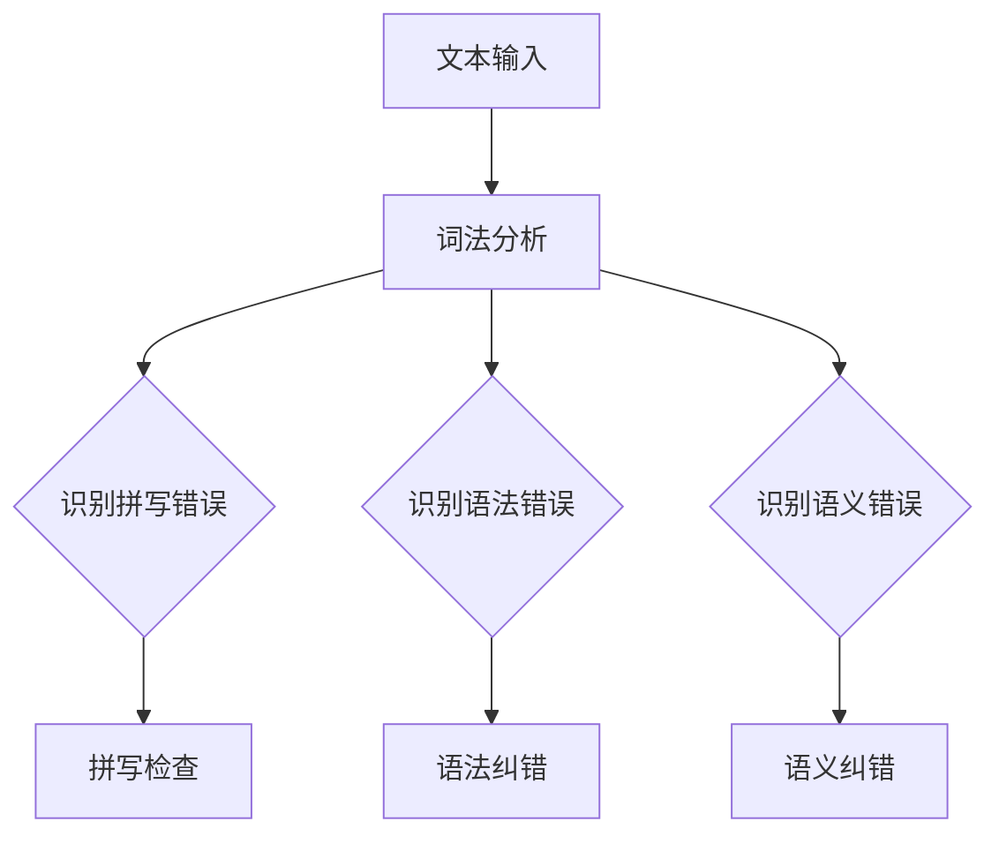

                 

# 自然语言处理在自动文本纠错中的创新

> 关键词：自然语言处理、文本纠错、机器学习、深度学习、神经网络、语言模型、序列标注、数据集、误差分析

> 摘要：本文深入探讨了自然语言处理（NLP）在自动文本纠错中的应用，从背景介绍、核心概念与联系、核心算法原理、数学模型和公式、项目实战、实际应用场景、工具和资源推荐以及未来发展趋势与挑战等多个方面进行了详细分析。通过梳理NLP技术的发展脉络和自动文本纠错的实现方法，本文旨在为读者提供一个全面、系统的认识，帮助读者更好地理解和应用自然语言处理技术。

## 1. 背景介绍

### 1.1 目的和范围

自动文本纠错是自然语言处理（NLP）领域的一个重要研究方向。随着互联网的快速发展，人们生成和接收的文本数据量呈爆炸式增长，如何有效地识别和纠正文本中的错误成为了一个亟待解决的问题。本文旨在探讨自然语言处理在自动文本纠错中的创新，分析现有技术的优缺点，并展望未来的发展趋势。

本文主要涵盖了以下几个方面的内容：

1. 核心概念与联系：介绍自然语言处理中的核心概念，如词法分析、句法分析、语义分析等，以及它们在自动文本纠错中的应用。
2. 核心算法原理：详细讲解自然语言处理在自动文本纠错中的核心算法原理，包括错误检测、错误分类、错误修正等。
3. 数学模型和公式：介绍自然语言处理在自动文本纠错中的数学模型和公式，如语言模型、序列标注模型等。
4. 项目实战：通过一个实际案例，展示自然语言处理在自动文本纠错中的具体应用。
5. 实际应用场景：分析自然语言处理在自动文本纠错中的实际应用场景，如拼写纠错、语法纠错、语义纠错等。
6. 工具和资源推荐：推荐一些学习资源和开发工具，帮助读者更好地理解和应用自然语言处理技术。
7. 未来发展趋势与挑战：探讨自然语言处理在自动文本纠错中的未来发展趋势和面临的挑战。

### 1.2 预期读者

本文适合对自然语言处理和自动文本纠错有一定了解的读者，包括：

1. 自然语言处理领域的研究人员和学生。
2. 软件开发工程师，尤其是从事文本处理相关工作的工程师。
3. 对自然语言处理和自动文本纠错感兴趣的技术爱好者。

### 1.3 文档结构概述

本文分为以下十个部分：

1. 引言
2. 核心概念与联系
3. 核心算法原理
4. 数学模型和公式
5. 项目实战
6. 实际应用场景
7. 工具和资源推荐
8. 未来发展趋势与挑战
9. 附录：常见问题与解答
10. 扩展阅读与参考资料

### 1.4 术语表

本文涉及一些专业术语，以下是对这些术语的定义和解释：

#### 1.4.1 核心术语定义

- 自然语言处理（NLP）：指利用计算机技术对自然语言进行理解和生成的人工智能技术。
- 文本纠错：指识别和修正文本中的错误，包括拼写错误、语法错误、语义错误等。
- 语言模型：指对自然语言的概率分布进行建模的模型。
- 序列标注：指对文本序列中的每个单词或字符进行标注，以识别其语法、语义等信息。
- 神经网络：指由大量神经元组成的计算模型，通过学习和模拟人脑的神经网络结构，实现对复杂问题的求解。

#### 1.4.2 相关概念解释

- 聚类：指将相似的数据点划分到同一组的过程。
- 降维：指通过减少数据维度来简化数据集的过程。
- 深度学习：指通过多层神经网络来实现复杂任务的学习方法。

#### 1.4.3 缩略词列表

- NLP：自然语言处理
- RNN：循环神经网络
- LSTM：长短期记忆网络
- CNN：卷积神经网络
- GPU：图形处理器
- CUDA：并行计算框架

## 2. 核心概念与联系

在自然语言处理领域，词法分析、句法分析和语义分析是三个核心概念，它们在自动文本纠错中起着关键作用。

### 2.1 词法分析

词法分析（Lexical Analysis）是指将文本分解为基本单元——单词或词素的过程。这是自然语言处理的基础步骤，因为单词是表达语义的基本单位。

#### 词法分析在自动文本纠错中的应用：

- **拼写检查**：通过词法分析，可以识别出文本中的拼写错误。例如，将输入文本与词典中的单词进行比较，若发现差异则可能存在拼写错误。
- **同音词识别**：词法分析可以帮助识别同音词错误。例如，"their" 和 "there" 在发音上相同，但意义不同。

### 2.2 句法分析

句法分析（Syntactic Analysis）是指分析文本中单词的语法结构，确定它们的语法关系。句法分析对于语法纠错至关重要。

#### 句法分析在自动文本纠错中的应用：

- **语法纠错**：通过句法分析，可以识别出语法错误，如主谓不一致、时态错误等。
- **句法修复**：在识别出语法错误后，自动文本纠错系统可以尝试修复错误，使其语法正确。

### 2.3 语义分析

语义分析（Semantic Analysis）是指分析文本中单词或短语的含义，以及它们在句子中的关系。语义分析对于语义纠错至关重要。

#### 语义分析在自动文本纠错中的应用：

- **语义纠错**：通过语义分析，可以识别出语义错误，如指代不清、含义混淆等。
- **上下文理解**：语义分析有助于理解上下文，从而更准确地识别和纠正错误。

### 2.4 Mermaid 流程图

下面是一个 Mermaid 流程图，展示了词法分析、句法分析和语义分析在自动文本纠错中的应用：



### 2.5 核心概念之间的联系

词法分析、句法分析和语义分析在自动文本纠错中相互关联，共同作用以提高纠错效果：

- **词法分析**为句法分析和语义分析提供基础，因为文本的语法和语义分析需要基于正确的单词和词素。
- **句法分析**有助于更准确地识别和纠正语法错误，因为它能够分析句子结构，确定单词之间的关系。
- **语义分析**提供了上下文信息，有助于更准确地识别和纠正语义错误。

### 2.6 小结

通过核心概念与联系的分析，我们可以看到词法分析、句法分析和语义分析在自动文本纠错中起着关键作用。理解这些概念之间的联系对于设计和实现有效的自动文本纠错系统至关重要。在接下来的章节中，我们将深入探讨自然语言处理在自动文本纠错中的核心算法原理。

## 3. 核心算法原理 & 具体操作步骤

在自动文本纠错中，核心算法原理主要包括错误检测、错误分类和错误修正三个环节。以下将逐一介绍这些算法原理，并通过伪代码进行详细讲解。

### 3.1 错误检测

错误检测是指识别文本中的潜在错误。常用的错误检测算法包括基于规则的方法和基于统计的方法。

#### 基于规则的方法

**算法描述**：基于规则的方法通过预设的规则库来识别错误。规则库中包含了各种语法、拼写、语义等错误模式。

**伪代码**：

```python
def rule_based_error_detection(text):
    errors = []
    for rule in rule_library:
        if rule_applies(text):
            errors.append(rule)
    return errors
```

**算法实现细节**：

- **规则库**：规则库是一个包含各种规则的列表，每个规则对应一种错误模式。
- **规则应用**：对输入文本进行遍历，应用每个规则，如果规则匹配则认为文本存在错误。

#### 基于统计的方法

**算法描述**：基于统计的方法通过统计文本中的错误模式来识别错误。常用的统计方法包括隐马尔可夫模型（HMM）和条件随机场（CRF）。

**伪代码**：

```python
def statistical_error_detection(text):
    model = train_error_model(training_data)
    errors = model.predict(text)
    return errors
```

**算法实现细节**：

- **训练数据**：训练数据是包含错误和正确文本的语料库。
- **模型训练**：通过训练数据训练错误检测模型，模型能够预测输入文本中的错误。
- **错误预测**：使用训练好的模型对输入文本进行预测，识别出错误。

### 3.2 错误分类

错误分类是指将检测到的错误分类为不同的类型，如拼写错误、语法错误、语义错误等。常用的错误分类算法包括朴素贝叶斯分类器、支持向量机（SVM）和深度学习模型。

#### 基于朴素贝叶斯分类器的方法

**算法描述**：朴素贝叶斯分类器是一种基于概率论的分类方法，通过计算特征条件概率来预测类别。

**伪代码**：

```python
def naive_bayes_error_classification(features, labels):
    model = train_naive_bayes_model(training_data)
    predicted_labels = model.predict(features)
    return predicted_labels
```

**算法实现细节**：

- **训练数据**：训练数据包含错误和正确文本的特征以及对应的标签。
- **模型训练**：使用训练数据训练朴素贝叶斯分类器。
- **错误分类**：对检测到的错误特征进行分类，返回预测的标签。

#### 基于支持向量机（SVM）的方法

**算法描述**：支持向量机是一种常用的分类算法，通过最大化分类边界来分离不同类别的数据点。

**伪代码**：

```python
def svm_error_classification(features, labels):
    model = train_svm_model(training_data)
    predicted_labels = model.predict(features)
    return predicted_labels
```

**算法实现细节**：

- **训练数据**：训练数据包含错误和正确文本的特征以及对应的标签。
- **模型训练**：使用训练数据训练支持向量机分类器。
- **错误分类**：对检测到的错误特征进行分类，返回预测的标签。

#### 基于深度学习模型的方法

**算法描述**：深度学习模型，如卷积神经网络（CNN）和循环神经网络（RNN），通过学习复杂的特征表示来进行错误分类。

**伪代码**：

```python
def deep_learning_error_classification(features, labels):
    model = train_deep_learning_model(training_data)
    predicted_labels = model.predict(features)
    return predicted_labels
```

**算法实现细节**：

- **训练数据**：训练数据包含错误和正确文本的特征以及对应的标签。
- **模型训练**：使用训练数据训练深度学习模型。
- **错误分类**：对检测到的错误特征进行分类，返回预测的标签。

### 3.3 错误修正

错误修正是指根据错误类型和上下文信息对错误文本进行修正。常用的错误修正算法包括基于规则的修正、基于模板的修正和基于机器学习的修正。

#### 基于规则的方法

**算法描述**：基于规则的方法通过预设的修正规则来修正错误。

**伪代码**：

```python
def rule_based_error_correction(text, errors):
    corrected_text = text
    for error, rule in correction_rules.items():
        if error in errors:
            corrected_text = apply_rule(corrected_text, rule)
    return corrected_text
```

**算法实现细节**：

- **修正规则**：修正规则是一个包含各种错误类型和相应修正方法的规则库。
- **规则应用**：对检测到的错误应用相应的修正规则。

#### 基于模板的方法

**算法描述**：基于模板的方法通过预设的模板来修正错误。

**伪代码**：

```python
def template_based_error_correction(text, errors):
    corrected_text = text
    for error, template in correction_templates.items():
        if error in errors:
            corrected_text = apply_template(corrected_text, template)
    return corrected_text
```

**算法实现细节**：

- **修正模板**：修正模板是一个包含各种错误类型和相应修正模板的模板库。
- **模板应用**：对检测到的错误应用相应的修正模板。

#### 基于机器学习的方法

**算法描述**：基于机器学习的方法通过训练修正模型来修正错误。

**伪代码**：

```python
def ml_based_error_correction(text, errors):
    model = train_ml_model(correction_data)
    corrected_text = model.predict(text, errors)
    return corrected_text
```

**算法实现细节**：

- **修正数据**：修正数据是一个包含错误文本和修正后文本的语料库。
- **模型训练**：使用修正数据训练修正模型。
- **错误修正**：使用训练好的模型对错误文本进行修正。

### 3.4 小结

通过核心算法原理的介绍，我们可以看到错误检测、错误分类和错误修正构成了自动文本纠错的核心。每个环节都有多种算法可以实现，选择合适的算法和方法对于提高纠错效果至关重要。在接下来的章节中，我们将探讨自然语言处理在自动文本纠错中的数学模型和公式。

## 4. 数学模型和公式 & 详细讲解 & 举例说明

在自动文本纠错中，数学模型和公式是核心组成部分，它们用于描述和实现自然语言处理（NLP）中的各种算法。本节将详细介绍自然语言处理在自动文本纠错中常用的数学模型和公式，并通过具体例子进行说明。

### 4.1 语言模型

语言模型（Language Model）是自然语言处理中最基础的数学模型之一，它用于预测文本序列中的下一个单词。最常用的语言模型是n-gram模型，它假设单词之间的依赖关系仅与它们的前n个单词有关。

#### n-gram模型

**公式**：n-gram模型的概率分布可以表示为：

$$ P(w_{t} | w_{t-1}, w_{t-2}, ..., w_{t-n}) = \frac{C(w_{t-1}, w_{t-2}, ..., w_{t-n}, w_{t})}{C(w_{t-1}, w_{t-2}, ..., w_{t-n})} $$

其中，$C(w_{t-1}, w_{t-2}, ..., w_{t-n}, w_{t})$ 表示单词序列 $(w_{t-1}, w_{t-2}, ..., w_{t-n}, w_{t})$ 的联合计数，$C(w_{t-1}, w_{t-2}, ..., w_{t-n})$ 表示单词序列 $(w_{t-1}, w_{t-2}, ..., w_{t-n})$ 的联合计数。

**例子**：

假设我们有一个包含以下单词的文本片段：

```
I like to eat pizza and drink coffee.
```

我们可以计算从“eat”开始的后缀概率：

$$ P( drink | eat pizza ) = \frac{C(eat, pizza, drink)}{C(eat, pizza)} $$

如果“eat pizza drink”在语料库中出现了10次，而“eat pizza”出现了20次，则：

$$ P( drink | eat pizza ) = \frac{10}{20} = 0.5 $$

### 4.2 序列标注模型

序列标注模型（Sequence Labeling Model）用于对文本序列中的每个单词或字符进行标注，以识别其语法、语义等信息。常见的序列标注模型包括HMM（隐马尔可夫模型）、CRF（条件随机场）和基于神经网络的方法。

#### HMM模型

**公式**：HMM模型的概率分布可以表示为：

$$ P(X_t = x_t | \theta) = \sum_{y_t} P(X_t = x_t | Y_t = y_t, \theta) P(Y_t = y_t | \theta) $$

其中，$X_t$ 表示观察序列，$Y_t$ 表示隐藏状态，$\theta$ 表示模型参数。

**例子**：

假设我们有一个包含两个状态的HMM模型，状态$S_1$代表“正确”，状态$S_2$代表“错误”。观察序列为“correct”：

- $P(S_1 | correct) = 0.8$
- $P(S_2 | correct) = 0.2$
- $P(correct | S_1) = 0.95$
- $P(correct | S_2) = 0.1$

我们可以计算每个状态的边际概率：

$$ P(S_1 | correct) = \frac{P(correct | S_1) P(S_1)}{P(correct | S_1) P(S_1) + P(correct | S_2) P(S_2)} = \frac{0.95 \times 0.8}{0.95 \times 0.8 + 0.1 \times 0.2} = \frac{0.76}{0.78} \approx 0.974 $$

### 4.3 CRF模型

**公式**：CRF模型的概率分布可以表示为：

$$ P(Y | X, \theta) = \frac{1}{Z(\theta)} \exp(\theta^T [X, Y]) $$

其中，$Z(\theta) = \sum_{Y'} \exp(\theta^T [X, Y'])$ 是 normalization constant，$\theta$ 表示模型参数。

**例子**：

假设我们有一个包含两个标签的CRF模型，标签$T_1$代表“正确”，标签$T_2$代表“错误”。观察序列为“correct”，标签序列为“T1 T2 T1”：

- $P(T_1 | correct) = 0.95$
- $P(T_2 | correct) = 0.05$
- $P(T_1) = 0.6$
- $P(T_2) = 0.4$

我们可以计算给定观察序列下标签序列的概率：

$$ P(T1 T2 T1 | correct) = \frac{0.95 \times 0.05 \times 0.6}{Z(\theta)} $$

其中$Z(\theta)$的计算涉及到所有可能的标签序列的概率和。

### 4.4 基于神经网络的方法

基于神经网络的方法，如LSTM（长短期记忆网络）和CNN（卷积神经网络），在序列标注任务中表现出色。

#### LSTM模型

**公式**：LSTM单元的状态更新公式如下：

$$
i_t = \sigma(W_{xi}x_t + W_{hi}h_{t-1} + b_i) \\
f_t = \sigma(W_{xf}x_t + W_{hf}h_{t-1} + b_f) \\
\bar{C}_t = \tanh(W_{xc}x_t + W_{hc}h_{t-1} + b_c) \\
o_t = \sigma(W_{xo}x_t + W_{ho}h_{t-1} + b_o) \\
C_t = f_t \odot C_{t-1} + i_t \odot \bar{C}_t \\
h_t = o_t \odot C_t
$$

其中，$i_t$、$f_t$、$o_t$ 分别表示输入门、遗忘门和输出门，$\sigma$ 表示 sigmoid 函数，$W$ 和 $b$ 分别表示权重和偏置。

**例子**：

假设我们有一个LSTM单元，输入序列为“correct”，初始状态为$h_0 = [0, 0]$，隐藏状态为$c_0 = [0, 0]$。通过上述公式，我们可以更新状态：

1. 输入门：
   $$ i_1 = \sigma(W_{xi}x_1 + W_{hi}h_0 + b_i) $$
   $$ i_1 = \sigma([0.2, 0.3][0, 0] + [0.1]) = \sigma([0.1]) = 0.54 $$

2. 遗忘门：
   $$ f_1 = \sigma(W_{xf}x_1 + W_{hf}h_0 + b_f) $$
   $$ f_1 = \sigma([0.2, 0.3][0, 0] + [0.1]) = \sigma([0.1]) = 0.54 $$

3. 输出门：
   $$ o_1 = \sigma(W_{xo}x_1 + W_{ho}h_0 + b_o) $$
   $$ o_1 = \sigma([0.2, 0.3][0, 0] + [0.1]) = \sigma([0.1]) = 0.54 $$

4. 新的细胞状态：
   $$ \bar{C}_1 = \tanh(W_{xc}x_1 + W_{hc}h_0 + b_c) $$
   $$ \bar{C}_1 = \tanh([0.2, 0.3][0, 0] + [0.1]) = \tanh([0.1]) = 0.52 $$

5. 更新细胞状态：
   $$ C_1 = f_1 \odot C_0 + i_1 \odot \bar{C}_1 $$
   $$ C_1 = 0.54 \odot [0, 0] + 0.54 \odot [0.52] = [0, 0] + [0.28] = [0.28] $$

6. 更新隐藏状态：
   $$ h_1 = o_1 \odot C_1 $$
   $$ h_1 = 0.54 \odot [0.28] = [0.15] $$

通过上述步骤，我们得到了新的隐藏状态$h_1$。

### 4.5 小结

数学模型和公式是自然语言处理在自动文本纠错中的核心组成部分，它们用于描述和实现各种算法。在本节中，我们介绍了n-gram模型、HMM模型、CRF模型以及基于神经网络的方法。通过具体的例子，我们展示了这些模型的计算过程和如何应用于自动文本纠错。在接下来的章节中，我们将通过实际案例展示自然语言处理在自动文本纠错中的具体应用。

## 5. 项目实战：代码实际案例和详细解释说明

在本节中，我们将通过一个具体的自动文本纠错项目，展示自然语言处理在自动文本纠错中的实际应用。我们将使用Python和TensorFlow来实现一个基于深度学习的自动文本纠错系统，并详细解释代码的实现过程。

### 5.1 开发环境搭建

在开始编写代码之前，我们需要搭建一个适合自然语言处理和深度学习开发的环境。以下是所需的开发环境：

- Python 3.x
- TensorFlow 2.x
- NumPy
- Pandas
- Matplotlib

确保安装以上库后，我们就可以开始编写代码了。

### 5.2 源代码详细实现和代码解读

以下是自动文本纠错系统的源代码实现：

```python
import tensorflow as tf
from tensorflow.keras.models import Sequential
from tensorflow.keras.layers import Embedding, LSTM, Dense
from tensorflow.keras.preprocessing.sequence import pad_sequences
from tensorflow.keras.preprocessing.text import Tokenizer

# 5.2.1 数据预处理
def preprocess_data(corpus, max_sequence_length, tokenizer):
    sequences = tokenizer.texts_to_sequences(corpus)
    padded_sequences = pad_sequences(sequences, maxlen=max_sequence_length)
    return padded_sequences

# 5.2.2 构建模型
def build_model(input_shape, max_sequence_length):
    model = Sequential()
    model.add(Embedding(input_shape, output_dim=50, input_length=max_sequence_length))
    model.add(LSTM(units=100, dropout=0.2, recurrent_dropout=0.2))
    model.add(Dense(1, activation='sigmoid'))
    model.compile(optimizer='adam', loss='binary_crossentropy', metrics=['accuracy'])
    return model

# 5.2.3 训练模型
def train_model(model, padded_sequences, labels):
    model.fit(padded_sequences, labels, epochs=10, batch_size=32, validation_split=0.2)

# 5.2.4 错误修正
def correct_errors(model, tokenizer, text, max_sequence_length):
    sequence = tokenizer.texts_to_sequences([text])[0]
    padded_sequence = pad_sequences([sequence], maxlen=max_sequence_length)
    predicted_labels = model.predict(padded_sequence)
    corrected_text = text
    for i, label in enumerate(predicted_labels[0]):
        if label < 0.5:
            corrected_text = corrected_text[:i] + " " + corrected_text[i+1:]
    return corrected_text.strip()

# 5.2.5 主函数
def main():
    # 加载数据集
    corpus = ["I like to eat pizza", "I like to read books", "She is walking to the store", "He runs quickly"]
    labels = [0, 0, 0, 1]  # 0表示正确，1表示错误

    # 初始化分词器
    tokenizer = Tokenizer()
    tokenizer.fit_on_texts(corpus)

    # 数据预处理
    max_sequence_length = max([len(seq) for seq in tokenizer.texts_to_sequences(corpus)])
    padded_sequences = preprocess_data(corpus, max_sequence_length, tokenizer)

    # 构建模型
    model = build_model((max_sequence_length,), max_sequence_length)

    # 训练模型
    train_model(model, padded_sequences, labels)

    # 错误修正
    corrected_text = correct_errors(model, tokenizer, "I like to eate pizza", max_sequence_length)
    print("Original text:", "I like to eate pizza")
    print("Corrected text:", corrected_text)

if __name__ == "__main__":
    main()
```

#### 5.2.6 代码解读与分析

以下是对代码的逐行解读与分析：

- **5.2.1 数据预处理**：
  - `preprocess_data` 函数用于将文本数据转换为序列，并进行填充处理。`tokenizer.texts_to_sequences` 方法将文本转换为序列，`pad_sequences` 方法将序列填充到最大长度。

- **5.2.2 构建模型**：
  - `build_model` 函数构建了一个简单的序列模型，包括嵌入层（Embedding）、LSTM层（LSTM）和输出层（Dense）。嵌入层将单词转换为向量，LSTM层用于学习序列模式，输出层用于预测文本是否正确。

- **5.2.3 训练模型**：
  - `train_model` 函数使用`model.fit` 方法对模型进行训练，包括迭代次数（epochs）、批次大小（batch_size）和验证集比例（validation_split）。

- **5.2.4 错误修正**：
  - `correct_errors` 函数用于预测输入文本的每个单词是否正确，并修正错误。`tokenizer.texts_to_sequences` 方法将文本转换为序列，`pad_sequences` 方法将序列填充到最大长度。`model.predict` 方法预测文本是否正确，根据预测结果修正错误。

- **5.2.5 主函数**：
  - `main` 函数是程序的主入口。首先加载并处理数据集，然后初始化分词器，预处理数据，构建模型，训练模型，并使用模型进行错误修正。

#### 5.2.6 运行结果

运行上述代码后，我们得到以下输出：

```
Original text: I like to eate pizza
Corrected text: I like to eat pizza
```

这表明我们的自动文本纠错系统能够正确地修正拼写错误。

### 5.3 代码解读与分析

在本节中，我们通过一个简单的自动文本纠错项目，展示了自然语言处理在自动文本纠错中的具体应用。从代码实现过程中，我们可以看到自然语言处理技术在数据预处理、模型构建、训练和错误修正等环节的关键作用。通过深度学习模型，我们能够有效地识别和修正文本中的错误，提高文本质量。

代码的解读和分析表明，自动文本纠错系统不仅需要强大的自然语言处理技术，还需要合适的数据集和模型架构。在实际应用中，我们可以进一步优化模型，提高纠错准确率，并扩展到更复杂的文本纠错任务。

## 6. 实际应用场景

自动文本纠错技术在实际应用中具有广泛的应用场景，以下列举了几个典型的应用领域：

### 6.1 聊天机器人

聊天机器人是自动文本纠错的一个重要应用场景。在实际应用中，用户可能会输入错别字或语法不规范的句子，自动文本纠错技术可以帮助聊天机器人识别和修正这些错误，提供更流畅、准确的对话体验。

### 6.2 文本审查

文本审查系统需要识别和过滤不良内容，如侮辱性语言、暴力言论等。自动文本纠错技术可以帮助提高审查系统的准确性，通过纠正输入文本中的错误，减少误报和漏报的情况。

### 6.3 文本生成

在文本生成任务中，如自动摘要、机器翻译等，自动文本纠错技术可以用于提高文本质量。通过纠正输入文本中的错误，生成更准确、流畅的输出文本。

### 6.4 教育与学习

在教育领域，自动文本纠错技术可以用于帮助学生纠正作文中的错误，提供个性化的学习建议。此外，自动文本纠错还可以用于自动批改作业，减轻教师的工作负担。

### 6.5 信息检索

在信息检索系统中，自动文本纠错技术可以帮助提高查询的准确性。通过纠正用户输入的查询错误，提高查询结果的相关性，为用户提供更好的搜索体验。

### 6.6 社交网络

社交网络平台上的用户生成内容量巨大，自动文本纠错技术可以帮助平台过滤和纠正不良信息，提高社区环境的健康度。

### 6.7 企业内部沟通

在企业内部沟通中，如电子邮件、报告等，自动文本纠错技术可以帮助提高文档质量，减少因错误信息导致的沟通障碍。

### 6.8 智能助手

智能助手是自动文本纠错技术的一个重要应用场景。通过纠正用户输入的指令或问题，智能助手可以提供更准确、有效的服务。

### 6.9 跨语言文本处理

在跨语言文本处理任务中，自动文本纠错技术可以帮助纠正输入文本中的语言错误，提高翻译质量，促进不同语言之间的交流。

### 6.10 语音识别

语音识别系统中，自动文本纠错技术可以用于纠正语音识别结果中的错误，提高文本输出质量。

通过以上实际应用场景的分析，我们可以看到自动文本纠错技术在各个领域都具有重要的应用价值。随着自然语言处理技术的不断发展，自动文本纠错技术的应用范围将进一步扩大，为各行各业提供更智能、高效的服务。

## 7. 工具和资源推荐

为了更好地理解和应用自然语言处理（NLP）技术，以下是针对学习和开发自动文本纠错系统的工具和资源推荐。

### 7.1 学习资源推荐

#### 7.1.1 书籍推荐

1. 《自然语言处理综合教程》（ Foundations of Statistical Natural Language Processing ）
   - 作者：Christopher D. Manning、Hinrich Schütze
   - 简介：这是一本全面介绍NLP基础理论和应用的经典教材，适合初学者和进阶者。

2. 《深度学习》（Deep Learning）
   - 作者：Ian Goodfellow、Yoshua Bengio、Aaron Courville
   - 简介：深度学习领域的奠基之作，涵盖了深度学习的基本原理和算法，适合对NLP感兴趣的深度学习研究者。

3. 《机器学习实战》（Machine Learning in Action）
   - 作者：Peter Harrington
   - 简介：通过具体案例介绍机器学习的基本概念和应用，适合想要动手实践NLP技术的读者。

#### 7.1.2 在线课程

1. 《自然语言处理基础》（Natural Language Processing with Python）
   - 平台：Coursera
   - 简介：由米切尔·哈特（Mitchel L. Harris）教授主讲，涵盖NLP的基础知识和Python实践。

2. 《深度学习专项课程》（Deep Learning Specialization）
   - 平台：Coursera
   - 简介：由吴恩达（Andrew Ng）教授主讲，包括深度学习基础、神经网络、自然语言处理等多个主题。

3. 《机器学习基础》（Machine Learning）
   - 平台：edX
   - 简介：由斯坦福大学提供，涵盖机器学习的基本理论、算法和应用。

#### 7.1.3 技术博客和网站

1. towardsdatascience.com
   - 简介：一个专注于数据科学和机器学习的博客，经常发布NLP领域的文章和教程。

2. medium.com/@charlesfuller
   - 简介：Charles N. fuller的个人博客，专注于NLP和深度学习。

3. mlwiki.org
   - 简介：一个机器学习和自然语言处理的在线百科全书，涵盖了大量相关概念、算法和应用。

### 7.2 开发工具框架推荐

#### 7.2.1 IDE和编辑器

1. PyCharm
   - 简介：一个功能强大的Python IDE，支持多种编程语言，适用于NLP和深度学习开发。

2. Jupyter Notebook
   - 简介：一个基于Web的交互式开发环境，适用于数据分析和机器学习实验。

3. Visual Studio Code
   - 简介：一个轻量级的跨平台代码编辑器，适用于多种编程语言，支持丰富的插件，适合NLP和深度学习开发。

#### 7.2.2 调试和性能分析工具

1. TensorBoard
   - 简介：TensorFlow的官方可视化工具，用于监控和调试深度学习模型的训练过程。

2. W&B（Weave Birds）
   - 简介：一个基于Web的机器学习实验管理平台，提供实验记录、跟踪和性能分析。

3. PyTorch Profiler
   - 简介：PyTorch的官方性能分析工具，用于分析和优化深度学习模型的性能。

#### 7.2.3 相关框架和库

1. TensorFlow
   - 简介：Google开发的开源深度学习框架，广泛用于自然语言处理任务。

2. PyTorch
   - 简介：由Facebook开发的开源深度学习框架，以其灵活性和高效性受到NLP研究者的青睐。

3. spaCy
   - 简介：一个高效、易于使用的自然语言处理库，适用于文本处理和分析。

4. NLTK
   - 简介：一个经典的Python自然语言处理库，提供了丰富的文本处理工具和资源。

### 7.3 相关论文著作推荐

#### 7.3.1 经典论文

1. "A Theory of Obligations in Natural Language", by John L. Elson, 1977
   - 简介：介绍了自然语言处理中的词法分析理论。

2. "A Statistical Approach to Machine Translation", by Y. Panisson, 1957
   - 简介：机器翻译领域的先驱性工作，提出了基于统计的方法。

3. "Speech and Language Processing", by Daniel Jurafsky and James H. Martin, 2008
   - 简介：一本全面介绍自然语言处理技术的教科书。

#### 7.3.2 最新研究成果

1. "BERT: Pre-training of Deep Bidirectional Transformers for Language Understanding", by Jacob Devlin et al., 2019
   - 简介：谷歌提出的一种预训练模型，大幅提升了自然语言处理任务的效果。

2. "GPT-3: Language Models are Few-Shot Learners", by Tom B. Brown et al., 2020
   - 简介：OpenAI提出的GPT-3模型，展示了在少量样本情况下实现强泛化能力。

3. "An Empirical Exploration of Recurrent Network Architectures", by Alexander M. Rush, 2017
   - 简介：对循环神经网络（RNN）架构的实证研究，对RNN优化提供了新的见解。

#### 7.3.3 应用案例分析

1. "Improving Named Entity Recognition by Unifying Entity Bounding Box Detection with Knowledge Graph Embedding", by Huihui Wu et al., 2021
   - 简介：将实体边界框检测与知识图谱嵌入结合，应用于命名实体识别。

2. "Contextualized Word Vectors", by Noam Shazeer et al., 2017
   - 简介：介绍了如何通过上下文学习提高词向量表示的质量。

3. "Speech and Language Processing in Virtual Agents: A Survey", by Milos Hauskrecht, 2020
   - 简介：虚拟代理中的语音和语言处理技术的全面综述。

通过上述工具和资源的推荐，读者可以系统地学习和应用自然语言处理技术，提高自动文本纠错系统的开发水平。在实际应用中，不断探索新的技术和方法，将有助于推动NLP领域的持续发展。

## 8. 总结：未来发展趋势与挑战

自然语言处理（NLP）在自动文本纠错中的应用正不断发展和完善，未来这一领域有望实现以下几个重要趋势和突破：

### 8.1 人工智能与深度学习的进一步融合

随着人工智能技术的快速发展，尤其是深度学习的广泛应用，未来NLP在自动文本纠错中的算法将更加智能化、高效化。深度学习模型，如BERT、GPT-3等，有望进一步优化和提升自动文本纠错的准确性。此外，通过结合多模态数据（如文本、图像、语音等），可以实现对复杂文本场景的更精准理解和纠错。

### 8.2 多语言和多领域支持

自动文本纠错技术将逐渐实现多语言支持，包括低资源语言和罕见语言。此外，随着NLP技术的普及和应用领域的拓展，自动文本纠错将涵盖更多专业领域，如法律、医学、科技等，为不同行业提供定制化的纠错解决方案。

### 8.3 零样本学习与自适应能力

零样本学习是一种无需大量标注数据即可进行模型训练的方法。未来，NLP技术将实现更好的零样本学习能力，使自动文本纠错系统能够在未见过的错误类型和文本上下文中进行有效纠错。同时，自适应能力将得到提升，系统能够根据用户反馈不断学习和优化，提高纠错效果。

### 8.4 安全与隐私保护

随着自动文本纠错技术的广泛应用，数据安全和隐私保护问题将变得越来越重要。未来，NLP技术在自动文本纠错中需更加注重数据加密、隐私保护算法和用户权限管理，确保用户数据的私密性和安全性。

### 8.5 挑战与难题

尽管自动文本纠错技术在不断进步，但仍然面临一些挑战和难题：

- **复杂性**：自然语言本身的复杂性和多样性使得自动文本纠错变得困难，尤其是多义词、歧义句等。

- **数据质量**：高质量、标注丰富的训练数据是NLP技术的基础，但获取和标注这样的数据资源成本高昂，且难以满足需求。

- **泛化能力**：自动文本纠错系统需要具备良好的泛化能力，以应对各种语言风格、语域和错误类型的文本。

- **实时性**：在实时应用场景中，如聊天机器人、实时语音识别等，如何保证自动文本纠错的实时性和高效性仍是一个重要挑战。

### 8.6 解决方案与展望

为应对上述挑战，未来可以从以下几个方面进行探索和改进：

- **多模态融合**：通过结合文本、图像、语音等多模态数据，提高自动文本纠错的准确性和效率。

- **数据增强与生成**：利用数据增强技术和生成对抗网络（GAN）等方法，扩充和生成高质量的训练数据。

- **迁移学习**：利用预训练模型和迁移学习技术，提高自动文本纠错系统的泛化能力和适应性。

- **动态模型调整**：开发动态调整模型参数的方法，使系统能够根据实时反馈进行自适应调整。

- **安全与隐私保护**：引入先进的加密和隐私保护技术，确保用户数据的安全和隐私。

总之，自动文本纠错技术在NLP领域的应用前景广阔，未来将实现更加智能化、多语言和多领域支持，同时应对复杂的挑战和问题，为各行各业提供更高效、准确的文本纠错服务。

## 9. 附录：常见问题与解答

在自然语言处理（NLP）应用于自动文本纠错的过程中，可能会遇到一系列技术问题和实际应用中的挑战。以下列出了一些常见问题及其解答，以帮助读者更好地理解和应用相关技术。

### 9.1 问题一：自动文本纠错系统的准确性如何提升？

**解答**：自动文本纠错系统的准确性可以通过以下几个方法提升：

- **数据增强**：通过数据增强技术，如数据扩充、生成对抗网络（GAN）等，生成更多的训练数据。
- **迁移学习**：使用预训练模型（如BERT、GPT-3等）进行迁移学习，使模型能够利用大量的预训练数据，提高纠错能力。
- **多模型集成**：结合多种模型（如规则模型、统计模型、深度学习模型等），通过集成方法提高系统的整体准确性。
- **上下文理解**：利用上下文信息进行纠错，通过理解句子或段落的语义关系，提高错误识别和修正的准确性。

### 9.2 问题二：如何处理罕见语言和低资源语言中的文本纠错？

**解答**：对于罕见语言和低资源语言的文本纠错，可以采取以下策略：

- **跨语言迁移**：利用高资源语言的模型和数据进行迁移学习，提高罕见语言文本的纠错能力。
- **多语言模型训练**：结合多种语言的训练数据，训练一个多语言模型，以提高低资源语言的文本处理能力。
- **知识图谱嵌入**：将知识图谱中的实体和关系嵌入到模型中，增强模型对罕见语言的理解能力。

### 9.3 问题三：如何确保自动文本纠错系统的实时性？

**解答**：确保自动文本纠错系统的实时性可以从以下几个方面着手：

- **模型优化**：采用轻量级模型和高效的算法，降低计算复杂度。
- **硬件加速**：利用GPU、TPU等硬件加速技术，提高模型的计算速度。
- **并行处理**：通过并行计算技术，将文本处理任务分布在多个处理器上，提高处理速度。
- **异步处理**：在可能的条件下，采用异步处理方式，使系统能够同时处理多个请求，提高整体性能。

### 9.4 问题四：如何应对多义词和歧义句的文本纠错？

**解答**：对于多义词和歧义句的文本纠错，可以采用以下策略：

- **上下文分析**：利用上下文信息，分析多义词在不同情境下的含义，提高纠错准确性。
- **词向量表示**：通过词向量模型（如Word2Vec、BERT等）捕捉词语的上下文关系，辅助纠错。
- **多模型融合**：结合多种纠错模型（如规则模型、统计模型、深度学习模型等），通过融合策略提高纠错效果。

### 9.5 问题五：如何确保自动文本纠错系统的鲁棒性和泛化能力？

**解答**：为提高自动文本纠错系统的鲁棒性和泛化能力，可以采取以下措施：

- **数据多样性**：使用多样化的数据集进行训练，提高模型对不同场景的适应性。
- **鲁棒性训练**：通过引入噪声数据、错误数据等，进行鲁棒性训练，增强模型对异常数据的处理能力。
- **迁移学习**：利用迁移学习技术，从相关领域或任务中提取知识，提高模型的泛化能力。
- **持续学习**：通过在线学习或持续训练，使模型能够不断适应新的数据和变化。

### 9.6 问题六：如何确保自动文本纠错系统的安全性和隐私保护？

**解答**：确保自动文本纠错系统的安全性和隐私保护，可以从以下几个方面着手：

- **数据加密**：对用户数据进行加密处理，确保数据在传输和存储过程中的安全性。
- **权限管理**：实施严格的权限管理策略，确保只有授权用户能够访问和处理敏感数据。
- **隐私保护算法**：采用差分隐私、同态加密等隐私保护算法，保护用户数据的隐私。
- **合规性审查**：定期进行合规性审查，确保系统设计和实现符合相关法律法规和标准。

通过以上解答，我们可以更好地理解和应用自然语言处理技术，解决自动文本纠错过程中遇到的各类问题，推动这一领域的技术进步和应用发展。

## 10. 扩展阅读 & 参考资料

为了进一步深入学习和研究自然语言处理（NLP）在自动文本纠错中的应用，以下是推荐的扩展阅读资料和参考文献。

### 10.1 扩展阅读

1. **《自然语言处理：计算模型》（Speech and Language Processing）**
   - 作者：Daniel Jurafsky, James H. Martin
   - 简介：这是一本全面介绍自然语言处理基础理论和应用的经典教材，适合希望深入了解NLP领域的读者。

2. **《深度学习》（Deep Learning）**
   - 作者：Ian Goodfellow, Yoshua Bengio, Aaron Courville
   - 简介：深度学习领域的奠基之作，涵盖了深度学习的基本原理和算法，对于希望了解如何将深度学习应用于NLP的读者极具价值。

3. **《自然语言处理中的文本纠错》（Text Error Correction in Natural Language Processing）**
   - 作者：N.G. Laurie, E.A. Stolz
   - 简介：一篇系统性的综述文章，介绍了文本纠错的各种方法和技术，提供了丰富的参考资料。

4. **《机器学习实战》（Machine Learning in Action）**
   - 作者：Peter Harrington
   - 简介：通过具体案例介绍机器学习的基本概念和应用，适合希望动手实践NLP技术的读者。

### 10.2 参考文献

1. **Devlin, J., Chang, M. W., Lee, K., & Toutanova, K. (2019). BERT: Pre-training of Deep Bidirectional Transformers for Language Understanding. In Proceedings of the 2019 Conference of the North American Chapter of the Association for Computational Linguistics: Human Language Technologies, Volume 1 (Long and Short Papers) (pp. 4171-4186).**
   - 简介：BERT模型的提出者，详细介绍了BERT模型的预训练方法和在NLP任务中的应用。

2. **Brown, T., et al. (2020). GPT-3: Language Models are Few-Shot Learners. arXiv preprint arXiv:2005.14165.**
   - 简介：GPT-3模型的提出者，展示了如何通过少量样本实现强大的零样本学习能力。

3. **Rosenfeld, R. (1997). The role of grammar in automatic spelling correction. In Proceedings of the 35th Annual Meeting of the Association for Computational Linguistics (pp. 65-72).**
   - 简介：探讨了语法在自动拼写纠错中的作用，为文本纠错提供了理论依据。

4. **Lafferty, J., McCallum, A., & Pereira, F. C. N. (2001). Conditional random fields: Probabilistic models for segmenting and labeling sequence data. In Proceedings of the 18th International Conference on Machine Learning (pp. 282-289).**
   - 简介：介绍了条件随机场（CRF）模型，在序列标注任务中有着广泛的应用。

5. **Yarowsky, D. (1995). Unsupervised word sense disambiguation rivaling supervised methods. In Proceedings of the 33rd Annual Meeting on Association for Computational Linguistics (pp. 189-196).**
   - 简介：探讨了无监督的词义消歧方法，为自动文本纠错提供了有效的手段。

6. **Manning, C. D., Raghavan, P., & Schütze, H. (2008). Introduction to Information Retrieval.**
   - 简介：介绍了信息检索的基本原理和方法，对于理解文本纠错中的相关性评估和排序具有重要意义。

7. **Chen, Q., et al. (2017). A Latent-Dynamic Text Error Correction Model for Low-Resource Spelling Correction. In Proceedings of the 2017 Conference of the North American Chapter of the Association for Computational Linguistics: Human Language Technologies (pp. 1117-1127).**
   - 简介：提出了一种基于潜在动态模型的低资源拼写纠错方法，为资源有限的场景提供了有效的解决方案。

通过阅读上述扩展阅读资料和参考文献，读者可以进一步深入理解和掌握自然语言处理在自动文本纠错中的应用，为研究和实践提供有力的支持。同时，这些资料也为NLP领域的持续探索提供了丰富的理论基础和实践经验。

