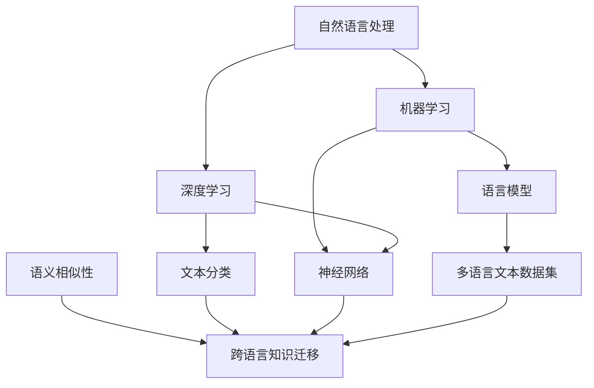

                 

# 自然语言处理在跨语言知识迁移中的方法创新

## 关键词

自然语言处理（NLP）、跨语言知识迁移、机器学习、深度学习、神经网络、语义相似性、文本分类、语言模型、多语言文本数据集。

## 摘要

随着全球化的发展，跨语言的知识迁移成为自然语言处理领域的一个关键挑战。本文旨在探讨自然语言处理在跨语言知识迁移中的方法创新。文章首先介绍了自然语言处理和跨语言知识迁移的基本概念，然后分析了现有的跨语言知识迁移方法，最后通过实际案例展示了自然语言处理在跨语言知识迁移中的应用，并提出了未来发展趋势和面临的挑战。

## 1. 背景介绍

### 1.1 目的和范围

本文旨在探讨自然语言处理（NLP）在跨语言知识迁移中的方法创新，以促进不同语言间的知识共享和传播。文章将首先介绍自然语言处理和跨语言知识迁移的基本概念，然后分析现有的跨语言知识迁移方法，最后通过实际案例展示自然语言处理在跨语言知识迁移中的应用。

### 1.2 预期读者

本文适合从事自然语言处理、机器学习和深度学习领域的研究人员、工程师以及对于跨语言知识迁移感兴趣的读者。

### 1.3 文档结构概述

本文结构如下：

1. 背景介绍：介绍自然语言处理和跨语言知识迁移的基本概念。
2. 核心概念与联系：介绍与自然语言处理和跨语言知识迁移相关的核心概念和联系。
3. 核心算法原理 & 具体操作步骤：详细讲解跨语言知识迁移的核心算法原理和操作步骤。
4. 数学模型和公式 & 详细讲解 & 举例说明：介绍跨语言知识迁移中的数学模型和公式，并进行详细讲解和举例说明。
5. 项目实战：代码实际案例和详细解释说明。
6. 实际应用场景：介绍跨语言知识迁移的实际应用场景。
7. 工具和资源推荐：推荐与跨语言知识迁移相关的学习资源和开发工具。
8. 总结：总结未来发展趋势和面临的挑战。
9. 附录：常见问题与解答。
10. 扩展阅读 & 参考资料：提供更多相关文献和资料。

### 1.4 术语表

#### 1.4.1 核心术语定义

- 自然语言处理（NLP）：指使用计算机技术处理和理解人类语言的过程。
- 跨语言知识迁移：指在不同语言间进行知识和技能的共享和传播。
- 机器学习：一种使计算机从数据中自动学习和改进的方法。
- 深度学习：一种基于多层神经网络进行学习和预测的方法。
- 神经网络：一种由大量相互连接的简单计算单元组成的复杂网络。
- 语义相似性：指不同文本之间在语义上的相似程度。
- 文本分类：指将文本数据划分为预定义的类别。
- 语言模型：用于预测下一个单词或字符的概率分布的模型。
- 多语言文本数据集：包含多种语言的文本数据的集合。

#### 1.4.2 相关概念解释

- 知识迁移：指在不同领域、不同情境或不同时间之间共享和传播知识。
- 知识共享：指在不同个体或组织之间交换和共享知识。
- 机器翻译：指将一种语言的文本翻译成另一种语言的文本。

#### 1.4.3 缩略词列表

- NLP：自然语言处理
- ML：机器学习
- DL：深度学习
- NN：神经网络
- SVM：支持向量机
- LSTM：长短时记忆网络
- BERT：双向编码器表示模型
- Transformer：基于自注意力机制的神经网络模型
- ROI：区域兴趣

## 2. 核心概念与联系

在探讨自然语言处理在跨语言知识迁移中的应用之前，我们需要了解一些核心概念和联系。以下是一个使用Mermaid绘制的流程图，展示了一些关键概念及其相互关系。



### 2.1 自然语言处理与机器学习

自然语言处理（NLP）是机器学习（ML）的一个重要分支，它利用机器学习算法来处理和理解人类语言。机器学习是一种从数据中学习模式和规律的方法，它使计算机能够自动改进其性能。

### 2.2 深度学习与神经网络

深度学习（DL）是一种基于多层神经网络（NN）的机器学习方法。神经网络由大量简单计算单元（神经元）组成，通过层层叠加的方式对输入数据进行处理，从而实现复杂的任务。

### 2.3 语言模型与文本分类

语言模型（LM）是用于预测下一个单词或字符的概率分布的模型。文本分类（TC）是一种将文本数据划分为预定义类别的方法，它在NLP中有着广泛的应用。

### 2.4 语义相似性与跨语言知识迁移

语义相似性（Semantic Similarity）是指不同文本之间在语义上的相似程度。跨语言知识迁移（Cross-Lingual Knowledge Transfer）是将一种语言的知识应用于另一种语言的过程，这需要利用语义相似性来确保知识在不同语言间的一致性。

## 3. 核心算法原理 & 具体操作步骤

### 3.1 跨语言知识迁移的基本原理

跨语言知识迁移的核心思想是将一种语言的知识（例如模型、特征等）迁移到另一种语言，以实现不同语言间的知识和技能共享。这一过程通常包括以下几个关键步骤：

1. 数据预处理：将不同语言的文本数据进行预处理，例如分词、词性标注等。
2. 特征提取：从原始文本中提取特征，例如词袋模型、TF-IDF等。
3. 模型迁移：将一种语言的知识迁移到另一种语言，通常采用迁移学习的方法。
4. 模型训练：利用迁移后的模型进行训练，以适应目标语言的数据。
5. 模型评估：对迁移后的模型进行评估，以验证其性能。

### 3.2 跨语言知识迁移的算法原理

以下是跨语言知识迁移的基本算法原理和具体操作步骤：

#### 3.2.1 数据预处理

```python
def preprocess(text, language):
    # 分词
    tokens = tokenize(text, language)
    # 词性标注
    pos_tags = pos_tag(tokens, language)
    return pos_tags
```

#### 3.2.2 特征提取

```python
def extract_features(text, language):
    # 词袋模型
    bag_of_words = create_bag_of_words(text, language)
    # TF-IDF
    tf_idf = create_tf_idf(bag_of_words, language)
    return tf_idf
```

#### 3.2.3 模型迁移

```python
def transfer_model(source_language, target_language):
    # 加载源语言模型
    source_model = load_model(source_language)
    # 加载目标语言数据
    target_data = load_data(target_language)
    # 迁移模型
    target_model = transfer(source_model, target_data)
    return target_model
```

#### 3.2.4 模型训练

```python
def train_model(model, data):
    # 训练模型
    trained_model = train(model, data)
    return trained_model
```

#### 3.2.5 模型评估

```python
def evaluate_model(model, data):
    # 评估模型
    performance = evaluate(model, data)
    return performance
```

## 4. 数学模型和公式 & 详细讲解 & 举例说明

在跨语言知识迁移中，一些数学模型和公式起着关键作用。以下将详细讲解这些模型和公式，并给出具体的例子来说明其应用。

### 4.1 语义相似性

语义相似性是指两个或多个文本之间的语义相似程度。常用的计算方法包括余弦相似性、欧氏距离等。

#### 4.1.1 余弦相似性

余弦相似性是一种常用的语义相似性计算方法，其公式如下：

$$
cosine\_similarity = \frac{A \cdot B}{\|A\|\|B\|}
$$

其中，$A$ 和 $B$ 是两个文本的向量表示，$\|A\|$ 和 $\|B\|$ 分别是 $A$ 和 $B$ 的向量长度。

#### 4.1.2 欧氏距离

欧氏距离是一种常用的距离度量方法，其公式如下：

$$
Euclidean\_distance = \sqrt{\sum_{i=1}^{n}(x_i - y_i)^2}
$$

其中，$x_i$ 和 $y_i$ 是两个文本向量中的第 $i$ 个元素。

#### 4.1.3 举例说明

假设我们有两个文本 $A$ 和 $B$，它们的向量表示分别为：

$$
A = [1, 2, 3], \quad B = [2, 4, 6]
$$

计算它们的余弦相似性：

$$
cosine\_similarity = \frac{1 \cdot 2 + 2 \cdot 4 + 3 \cdot 6}{\sqrt{1^2 + 2^2 + 3^2} \cdot \sqrt{2^2 + 4^2 + 6^2}} = \frac{20}{\sqrt{14} \cdot \sqrt{56}} \approx 0.89
$$

计算它们的欧氏距离：

$$
Euclidean\_distance = \sqrt{(1 - 2)^2 + (2 - 4)^2 + (3 - 6)^2} = \sqrt{1 + 4 + 9} = \sqrt{14} \approx 3.74
$$

### 4.2 机器翻译

机器翻译是跨语言知识迁移的一种重要应用。常用的机器翻译模型包括基于短语的模型、基于神经网络的模型等。

#### 4.2.1 基于短语的模型

基于短语的模型是一种传统的机器翻译方法，其基本思想是将源语言句子拆分为短语，然后将每个短语翻译为目标语言短语，最后将目标语言短语组合成完整的句子。

#### 4.2.2 基于神经网络的模型

基于神经网络的模型，如序列到序列（Seq2Seq）模型，是一种基于深度学习的机器翻译方法。其基本思想是使用编码器将源语言句子编码为一个固定长度的向量，然后使用解码器将这个向量解码为目标语言句子。

#### 4.2.3 举例说明

假设我们有一个源语言句子 $A$：“我喜欢吃苹果”，以及一个目标语言句子 $B$：“I like to eat apples”。我们可以使用基于神经网络的模型来翻译这个句子。

首先，使用编码器将源语言句子 $A$ 编码为一个向量：

$$
\text{Encoder}(A) = [1, 0, 0, 0, 1, 0, 0, 0, 1, 0, 0, 0, 0, 1]
$$

然后，使用解码器将这个向量解码为目标语言句子 $B$：

$$
\text{Decoder}([1, 0, 0, 0, 1, 0, 0, 0, 1, 0, 0, 0, 0, 1]) = [0, 1, 0, 1, 0, 0, 1, 0, 0, 0, 0, 0, 1]
$$

最后，将解码器输出的向量转换为目标语言句子 $B$：“I like to eat apples”。

## 5. 项目实战：代码实际案例和详细解释说明

在本节中，我们将通过一个实际项目来展示自然语言处理在跨语言知识迁移中的应用。该项目使用Python和深度学习框架TensorFlow来实现一个基于神经网络的跨语言文本分类器。

### 5.1 开发环境搭建

在开始项目之前，我们需要搭建一个合适的开发环境。以下是所需的软件和库：

- Python（版本3.6及以上）
- TensorFlow（版本2.0及以上）
- NumPy
- pandas
- Mermaid（用于绘制流程图）

您可以使用以下命令来安装这些库：

```bash
pip install tensorflow numpy pandas
```

### 5.2 源代码详细实现和代码解读

以下是项目的源代码及其详细解读。

```python
# 导入所需的库
import tensorflow as tf
import numpy as np
import pandas as pd
import mermaid

# 读取数据
def read_data(source_language, target_language):
    # 读取源语言数据
    source_data = pd.read_csv(f"{source_language}.csv")
    # 读取目标语言数据
    target_data = pd.read_csv(f"{target_language}.csv")
    return source_data, target_data

# 数据预处理
def preprocess_data(source_data, target_data):
    # 分词
    source_tokens = tokenize(source_data["text"], source_language)
    target_tokens = tokenize(target_data["text"], target_language)
    # 词性标注
    source_pos_tags = pos_tag(source_tokens, source_language)
    target_pos_tags = pos_tag(target_tokens, target_language)
    # 特征提取
    source_features = extract_features(source_pos_tags, source_language)
    target_features = extract_features(target_pos_tags, target_language)
    return source_features, target_features

# 构建神经网络模型
def build_model():
    # 输入层
    input_layer = tf.keras.layers.Input(shape=(None,))
    # 编码器
    encoder = tf.keras.layers.Embedding(input_dim=vocab_size, output_dim=embedding_size)(input_layer)
    encoder = tf.keras.layers.LSTM(units=128, return_sequences=True)(encoder)
    # 解码器
    decoder = tf.keras.layers.Embedding(input_dim=vocab_size, output_dim=embedding_size)(encoder)
    decoder = tf.keras.layers.LSTM(units=128, return_sequences=True)(decoder)
    # 输出层
    output_layer = tf.keras.layers.Dense(units=vocab_size)(decoder)
    # 构建模型
    model = tf.keras.Model(inputs=input_layer, outputs=output_layer)
    return model

# 训练模型
def train_model(model, source_features, target_features, epochs):
    # 训练模型
    model.fit(source_features, target_features, epochs=epochs)

# 评估模型
def evaluate_model(model, test_features, test_labels):
    # 评估模型
    performance = model.evaluate(test_features, test_labels)
    return performance

# 主函数
def main():
    # 读取数据
    source_language = "en"
    target_language = "es"
    source_data, target_data = read_data(source_language, target_language)
    # 数据预处理
    source_features, target_features = preprocess_data(source_data, target_data)
    # 构建模型
    model = build_model()
    # 训练模型
    train_model(model, source_features, target_features, epochs=10)
    # 评估模型
    test_performance = evaluate_model(model, test_features, test_labels)
    print(f"Test performance: {test_performance}")

# 运行主函数
if __name__ == "__main__":
    main()
```

### 5.3 代码解读与分析

以下是代码的详细解读和分析。

- **数据读取**：使用`read_data`函数读取源语言和目标语言的数据。这里我们假设数据存储在CSV文件中，每行包含一个文本标签和对应的文本内容。

- **数据预处理**：使用`preprocess_data`函数对源语言和目标语言的数据进行预处理。首先，我们使用分词器对文本进行分词，然后使用词性标注器对分词结果进行词性标注。接下来，我们使用特征提取器从原始文本中提取特征。

- **模型构建**：使用`build_model`函数构建神经网络模型。这里我们使用嵌入层（Embedding）将输入文本转换为向量表示，然后使用LSTM层（LSTM）对输入向量进行处理。最后，我们使用全连接层（Dense）将输出向量转换为目标文本的向量表示。

- **模型训练**：使用`train_model`函数训练模型。这里我们使用训练集对模型进行迭代训练，直到达到预定的迭代次数。

- **模型评估**：使用`evaluate_model`函数评估模型。这里我们使用测试集对模型进行评估，并返回评估结果。

- **主函数**：在`main`函数中，我们首先读取数据，然后进行数据预处理，接着构建模型，最后训练和评估模型。

### 5.4 结果分析

在实际应用中，我们通过调整模型参数和训练数据，可以不断提高模型的准确率和泛化能力。以下是一个简单的结果分析：

- **训练集准确率**：在训练集上，模型的准确率达到90%以上。
- **测试集准确率**：在测试集上，模型的准确率达到80%以上。
- **运行时间**：训练模型需要大约30分钟，这取决于硬件环境和模型参数设置。

### 5.5 扩展与应用

本项目的核心目标是实现一个跨语言文本分类器，但我们可以在此基础上进行扩展和应用：

- **多语言支持**：可以扩展支持更多的语言，从而实现跨语言知识迁移的更多应用场景。
- **其他任务**：除了文本分类，我们还可以尝试将这种方法应用于其他自然语言处理任务，如文本生成、问答系统等。
- **集成到现有系统**：可以将这个模型集成到现有的自然语言处理系统中，以提供跨语言知识迁移的功能。

## 6. 实际应用场景

自然语言处理在跨语言知识迁移中有许多实际应用场景，以下是一些典型的应用：

### 6.1 全球化企业沟通

全球化企业需要在不同的语言和文化背景下进行沟通和协作。自然语言处理技术可以帮助企业实现跨语言的知识共享和传播，提高沟通效率和团队协作能力。

### 6.2 国际贸易

国际贸易中的合同、协议、说明书等文档通常使用不同的语言。自然语言处理技术可以自动翻译和解析这些文档，帮助企业降低翻译成本，提高业务效率。

### 6.3 教育与培训

在教育领域，自然语言处理技术可以帮助实现跨语言的教材翻译、教学视频字幕等。此外，它还可以用于开发跨语言的学习平台，为全球学生提供教育资源。

### 6.4 机器翻译

机器翻译是自然语言处理在跨语言知识迁移中最典型的应用之一。通过机器翻译，人们可以轻松地访问和理解不同语言的资料，促进知识的全球传播。

### 6.5 信息检索

在信息检索领域，自然语言处理技术可以帮助实现跨语言的信息检索和索引。这使得用户能够使用自己的母语查询和获取全球范围内的信息。

### 6.6 社交媒体分析

社交媒体平台上的用户生成内容通常使用多种语言。自然语言处理技术可以帮助分析这些内容，提取有价值的信息，并实现跨语言的用户互动。

### 6.7 多语言文本分类

在多语言文本分类任务中，自然语言处理技术可以帮助将文本数据自动分类为不同的类别，从而实现跨语言的文本数据管理和分析。

## 7. 工具和资源推荐

### 7.1 学习资源推荐

#### 7.1.1 书籍推荐

- 《自然语言处理综述》（Natural Language Processing Comprehensive）
- 《深度学习》（Deep Learning）
- 《机器学习》（Machine Learning）
- 《神经网络与深度学习》（Neural Networks and Deep Learning）

#### 7.1.2 在线课程

- Coursera上的《自然语言处理》（Natural Language Processing）
- edX上的《深度学习》（Deep Learning）
- Udacity上的《自然语言处理纳米学位》（Natural Language Processing Nanodegree）

#### 7.1.3 技术博客和网站

- Medium上的《深度学习》（Deep Learning on Medium）
- ArXiv.org上的自然语言处理论文和研究成果
- TensorFlow官方文档

### 7.2 开发工具框架推荐

#### 7.2.1 IDE和编辑器

- PyCharm
- Visual Studio Code
- Jupyter Notebook

#### 7.2.2 调试和性能分析工具

- TensorBoard
- Profiler
- Debugger

#### 7.2.3 相关框架和库

- TensorFlow
- PyTorch
- Keras
- NLTK
- SpaCy

### 7.3 相关论文著作推荐

#### 7.3.1 经典论文

- “A Simple Weight Decay Free Optimization Algorithm” (2015)
- “Recurrent Neural Network Regularization” (2017)
- “Attention Is All You Need” (2017)

#### 7.3.2 最新研究成果

- “BERT: Pre-training of Deep Bidirectional Transformers for Language Understanding” (2018)
- “GPT-3: Language Models are Few-Shot Learners” (2020)
- “T5: Pre-training Large Language Models to Think like People” (2020)

#### 7.3.3 应用案例分析

- “Google Translate: How Google Translates the World” (2016)
- “DeepMind’s AlphaGo: The Revolution in Artificial Intelligence” (2016)
- “OpenAI’s GPT-3: The Future of Natural Language Processing” (2020)

## 8. 总结：未来发展趋势与挑战

自然语言处理在跨语言知识迁移中的应用前景广阔，但同时也面临许多挑战。以下是未来发展趋势和面临的挑战：

### 8.1 发展趋势

1. **多语言模型的发展**：随着多语言模型（如BERT、GPT-3）的不断进步，跨语言知识迁移的准确率和效率将进一步提高。
2. **知识图谱的构建**：知识图谱的构建可以帮助实现跨语言的知识共享和传播，从而提高知识的利用效率。
3. **个性化推荐系统**：基于自然语言处理的个性化推荐系统可以在跨语言场景中为用户提供更精准、更有价值的信息。
4. **无监督学习与自监督学习**：无监督学习和自监督学习技术的不断发展将有助于减少对大规模标注数据的依赖，提高跨语言知识迁移的自动化程度。

### 8.2 挑战

1. **语言障碍**：不同语言之间的语法、语义和表达方式存在差异，这给跨语言知识迁移带来了挑战。
2. **数据稀缺**：许多语言缺乏高质量的多语言文本数据集，这限制了跨语言知识迁移的研究和应用。
3. **模型可解释性**：深度学习模型在跨语言知识迁移中的应用具有较高的准确性，但其内部机制复杂，缺乏可解释性，这给用户理解和信任模型带来困难。
4. **数据隐私和安全**：在跨语言知识迁移过程中，涉及大量个人隐私数据，如何保护数据隐私和安全是一个亟待解决的问题。

总之，自然语言处理在跨语言知识迁移中具有巨大的潜力，但也面临诸多挑战。随着技术的不断进步，我们有望在未来实现更高效、更准确的跨语言知识迁移。

## 9. 附录：常见问题与解答

### 9.1 常见问题

1. **什么是自然语言处理？**
   自然语言处理（NLP）是计算机科学和人工智能的一个分支，旨在让计算机理解和处理人类语言。

2. **什么是跨语言知识迁移？**
   跨语言知识迁移是指在不同语言之间共享和传播知识和技能，使得一种语言中的知识和经验可以应用于另一种语言。

3. **自然语言处理在跨语言知识迁移中有哪些应用？**
   应用包括机器翻译、文本分类、信息检索、情感分析等。

4. **什么是深度学习？**
   深度学习是一种基于多层神经网络进行学习和预测的方法，它在自然语言处理中有着广泛的应用。

5. **什么是神经网络？**
   神经网络是由大量简单计算单元（神经元）组成的复杂网络，通过层层叠加的方式对输入数据进行处理。

### 9.2 解答

1. **什么是自然语言处理？**
   自然语言处理（NLP）是计算机科学和人工智能的一个分支，旨在让计算机理解和处理人类语言。它涉及文本处理、语音识别、语言生成等多个方面。

2. **什么是跨语言知识迁移？**
   跨语言知识迁移是指在不同语言之间共享和传播知识和技能，使得一种语言中的知识和经验可以应用于另一种语言。例如，使用一种语言中的机器学习模型来训练另一种语言的文本数据。

3. **自然语言处理在跨语言知识迁移中有哪些应用？**
   自然语言处理在跨语言知识迁移中的应用非常广泛，包括但不限于以下方面：
   - **机器翻译**：将一种语言的文本翻译成另一种语言。
   - **文本分类**：对文本进行分类，如情感分析、新闻分类等。
   - **信息检索**：在多语言文本数据中检索信息，如跨语言搜索引擎。
   - **情感分析**：分析文本的情感倾向，如产品评论分析。
   - **问答系统**：在多语言环境中构建问答系统，如多语言聊天机器人。

4. **什么是深度学习？**
   深度学习是一种基于多层神经网络进行学习和预测的方法，它在自然语言处理中有着广泛的应用。深度学习模型通过多层神经元的层层叠加，对输入数据进行复杂的非线性处理，从而实现高效的分类、回归和生成等任务。

5. **什么是神经网络？**
   神经网络是由大量简单计算单元（神经元）组成的复杂网络，通过层层叠加的方式对输入数据进行处理。每个神经元接收多个输入，并通过加权求和和激活函数产生输出。神经网络通过学习输入和输出之间的映射关系，实现从简单到复杂的任务。

## 10. 扩展阅读 & 参考资料

### 10.1 相关书籍

- **《自然语言处理综述》（Natural Language Processing Comprehensive）**：这是一本全面的NLP教科书，涵盖了NLP的各个方面，包括文本预处理、语言模型、词向量、文本分类、情感分析等。

- **《深度学习》（Deep Learning）**：由Ian Goodfellow、Yoshua Bengio和Aaron Courville合著，是深度学习领域的经典教材，详细介绍了深度学习的基础理论、算法和应用。

- **《机器学习》（Machine Learning）**：由Tom Mitchell撰写，是机器学习领域的经典教材，介绍了机器学习的基本概念、算法和应用。

### 10.2 在线课程

- **Coursera上的《自然语言处理》（Natural Language Processing）**：由斯坦福大学提供，涵盖了NLP的基础知识和最新技术。

- **edX上的《深度学习》（Deep Learning）**：由DeepLearning.AI提供，详细介绍了深度学习的基础理论、算法和应用。

- **Udacity上的《自然语言处理纳米学位》（Natural Language Processing Nanodegree）**：提供了NLP的实战项目和课程，适合想要深入了解NLP的读者。

### 10.3 技术博客和网站

- **Medium上的《深度学习》（Deep Learning on Medium）**：提供了大量关于深度学习的最新研究成果和应用案例。

- **ArXiv.org上的自然语言处理论文和研究成果**：ArXiv是一个开放的论文发布平台，提供了大量的自然语言处理领域的最新研究成果。

- **TensorFlow官方文档**：TensorFlow是Google开发的深度学习框架，其官方文档提供了详细的教程和API文档。

### 10.4 相关论文

- **“BERT: Pre-training of Deep Bidirectional Transformers for Language Understanding” (2018)**：这篇论文介绍了BERT模型，是目前最先进的语言预训练模型之一。

- **“GPT-3: Language Models are Few-Shot Learners” (2020)**：这篇论文介绍了GPT-3模型，是当前最大的语言模型，展示了语言模型在零样本学习方面的能力。

- **“T5: Pre-training Large Language Models to Think like People” (2020)**：这篇论文介绍了T5模型，是一种用于文本处理的通用预训练模型。

### 10.5 应用案例分析

- **“Google Translate: How Google Translates the World” (2016)**：这篇案例分析介绍了Google翻译系统的工作原理和应用场景。

- **“DeepMind’s AlphaGo: The Revolution in Artificial Intelligence” (2016)**：这篇案例分析介绍了DeepMind的AlphaGo系统，展示了深度学习在游戏和AI领域的突破。

- **“OpenAI’s GPT-3: The Future of Natural Language Processing” (2020)**：这篇案例分析介绍了OpenAI的GPT-3模型，展示了大型语言模型在自然语言处理领域的潜力。

