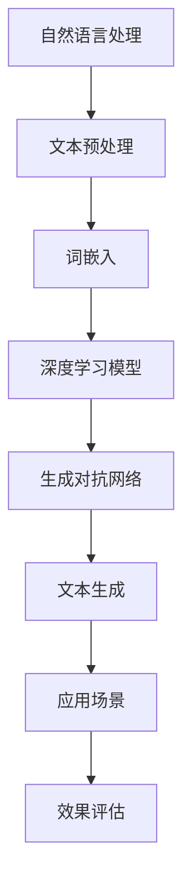

                 

# 自然语言处理的应用：AI内容创作

> **关键词：** 自然语言处理、AI内容创作、生成对抗网络、文本生成、预训练模型、应用场景

> **摘要：** 本文将深入探讨自然语言处理（NLP）在AI内容创作领域的应用。我们将从背景介绍开始，逐步讲解核心概念、算法原理、数学模型，并分享实际项目案例，最后探讨未来发展趋势与挑战。通过本文，读者将全面了解AI内容创作的技术原理与实践方法。

## 1. 背景介绍

### 1.1 目的和范围

本文旨在介绍自然语言处理在AI内容创作中的应用，探讨如何利用自然语言处理技术生成高质量的内容。我们将覆盖以下主题：

- 自然语言处理的基本概念与原理
- AI内容创作的核心算法与模型
- 数学模型与公式
- 实际项目案例解析
- 未来发展趋势与挑战

### 1.2 预期读者

本文适合对自然语言处理和AI内容创作有一定基础的读者，包括：

- 计算机科学专业学生和研究者
- 数据科学家和机器学习工程师
- AI内容创作从业者
- 对自然语言处理和AI内容创作感兴趣的读者

### 1.3 文档结构概述

本文分为以下几个部分：

1. 背景介绍
2. 核心概念与联系
3. 核心算法原理 & 具体操作步骤
4. 数学模型和公式 & 详细讲解 & 举例说明
5. 项目实战：代码实际案例和详细解释说明
6. 实际应用场景
7. 工具和资源推荐
8. 总结：未来发展趋势与挑战
9. 附录：常见问题与解答
10. 扩展阅读 & 参考资料

### 1.4 术语表

#### 1.4.1 核心术语定义

- **自然语言处理（NLP）**：研究如何让计算机理解和处理人类自然语言的技术和学科。
- **AI内容创作**：利用人工智能技术，如自然语言处理、机器学习等，生成高质量、符合人类语言习惯的内容。
- **生成对抗网络（GAN）**：一种深度学习模型，由生成器和判别器组成，用于生成逼真的数据。
- **预训练模型**：在大量未标注数据上进行预训练，然后在特定任务上进行微调的深度学习模型。

#### 1.4.2 相关概念解释

- **文本生成**：利用算法自动生成文本。
- **情感分析**：分析文本中的情感倾向，如正面、负面、中性等。
- **问答系统**：利用自然语言处理技术，让计算机理解和回答人类提出的问题。

#### 1.4.3 缩略词列表

- **NLP**：自然语言处理
- **GAN**：生成对抗网络
- **AI**：人工智能
- **DL**：深度学习

## 2. 核心概念与联系

在探讨AI内容创作之前，我们需要了解几个核心概念和它们之间的联系。以下是关键概念及其关系的Mermaid流程图：



### 2.1 自然语言处理（NLP）

自然语言处理（NLP）是人工智能的一个分支，旨在让计算机理解和处理人类自然语言。NLP的主要任务包括：

- **文本预处理**：清洗和准备文本数据，使其适合进行后续处理。
- **词嵌入**：将文本中的单词或短语转换为计算机可以处理的向量表示。
- **情感分析**：分析文本中的情感倾向。
- **问答系统**：理解和回答人类提出的问题。

### 2.2 文本预处理

文本预处理是NLP中的关键步骤，它包括以下几个任务：

- **分词**：将文本分割成单词或短语。
- **去除停用词**：移除对文本分析无意义的单词，如“的”、“了”等。
- **词形还原**：将不同形式的单词转换为统一的形式，如“跑了”、“跑过”等。

### 2.3 词嵌入

词嵌入（Word Embedding）是一种将单词或短语转换为向量表示的技术。词嵌入有助于提高模型的表示能力，使得计算机能够理解单词之间的语义关系。常见的词嵌入方法包括：

- **Word2Vec**：基于神经网络的词嵌入方法。
- **FastText**：基于词袋模型的词嵌入方法。

### 2.4 深度学习模型

深度学习模型（Deep Learning Model）是AI内容创作的基础。深度学习模型通过多层神经网络，将输入数据转换为输出结果。在自然语言处理中，常见的深度学习模型包括：

- **循环神经网络（RNN）**：适合处理序列数据。
- **长短时记忆网络（LSTM）**：RNN的变体，能够更好地处理长序列数据。
- **门控循环单元（GRU）**：LSTM的另一种变体。

### 2.5 生成对抗网络（GAN）

生成对抗网络（GAN）是一种深度学习模型，由生成器和判别器组成。生成器尝试生成逼真的数据，而判别器则判断数据是真实还是生成的。GAN在文本生成方面具有很高的应用价值。

### 2.6 文本生成

文本生成（Text Generation）是AI内容创作的核心任务。文本生成可以通过以下几种方法实现：

- **序列到序列模型（Seq2Seq）**：将输入序列映射到输出序列。
- **自回归模型（AR）**：逐步生成文本序列。

### 2.7 应用场景

AI内容创作广泛应用于各种领域，如：

- **内容创作平台**：自动生成文章、博客、新闻等。
- **虚拟助手**：为用户提供个性化的问答服务。
- **广告文案**：自动生成吸引人的广告文案。

### 2.8 效果评估

效果评估（Effect Evaluation）是评价AI内容创作质量的重要手段。常见的评估指标包括：

- **词汇丰富度**：文本中使用的词汇数量和多样性。
- **语义一致性**：文本内容的一致性和连贯性。

## 3. 核心算法原理 & 具体操作步骤

在了解了核心概念与联系后，我们将深入探讨AI内容创作的核心算法原理和具体操作步骤。以下是生成对抗网络（GAN）的算法原理和具体操作步骤。

### 3.1 生成对抗网络（GAN）

生成对抗网络（GAN）由生成器和判别器组成。生成器的任务是生成逼真的文本，而判别器的任务是判断文本是真实还是生成的。

#### 3.1.1 生成器（Generator）

生成器的目标是通过学习输入数据的分布，生成逼真的文本。生成器的操作步骤如下：

1. **输入噪声向量**：生成器首先接收一个随机噪声向量z，该向量作为生成文本的初始输入。
2. **生成文本**：生成器通过多层神经网络将噪声向量映射到文本序列。
3. **输出文本**：生成器生成的文本是逐个字符生成的，最终形成完整的文本序列。

#### 3.1.2 判别器（Discriminator）

判别器的目标是区分真实文本和生成文本。判别器的操作步骤如下：

1. **输入文本**：判别器接收一段文本作为输入。
2. **预测标签**：判别器通过多层神经网络对输入文本进行预测，输出一个二进制标签，表示文本是真实还是生成。
3. **输出标签**：判别器生成的标签是逐个字符预测的，最终形成完整的文本标签序列。

#### 3.1.3 损失函数

生成器和判别器之间的对抗训练过程通过以下损失函数实现：

1. **生成器损失函数**：生成器的目标是使判别器无法区分生成文本和真实文本。生成器的损失函数为：
   \[ L_G = -\log(D(G(z))) \]
   其中，\( D \) 表示判别器，\( G \) 表示生成器，\( z \) 表示噪声向量。

2. **判别器损失函数**：判别器的目标是正确区分真实文本和生成文本。判别器的损失函数为：
   \[ L_D = -\log(D(x)) - \log(1 - D(G(z))) \]
   其中，\( x \) 表示真实文本。

#### 3.1.4 训练过程

GAN的训练过程分为以下几个步骤：

1. **初始化生成器和判别器**：随机初始化生成器和判别器的参数。
2. **生成文本**：生成器根据噪声向量生成文本。
3. **判别文本**：判别器对生成文本和真实文本进行预测。
4. **更新生成器和判别器**：根据损失函数更新生成器和判别器的参数。
5. **重复训练**：重复上述步骤，直到生成器生成逼真的文本，判别器无法区分生成文本和真实文本。

### 3.2 生成对抗网络（GAN）伪代码

以下是生成对抗网络（GAN）的伪代码：

```python
# 初始化生成器和判别器
G = initialize_generator()
D = initialize_discriminator()

# 设置迭代次数
num_iterations = 10000

# 对抗训练
for i in range(num_iterations):
  # 生成文本
  z = generate_noise_vector()
  generated_text = G(z)
  
  # 判别文本
  real_text = load_real_text()
  predicted_real = D(real_text)
  predicted_generated = D(generated_text)
  
  # 计算损失函数
  loss_G = -log(predicted_generated)
  loss_D = -log(predicted_real) - log(1 - predicted_generated)
  
  # 更新生成器和判别器
  update_generator(G, loss_G)
  update_discriminator(D, loss_D)

# 生成逼真文本
z = generate_noise_vector()
generated_text = G(z)
```

## 4. 数学模型和公式 & 详细讲解 & 举例说明

在AI内容创作中，数学模型和公式扮演着至关重要的角色。以下是生成对抗网络（GAN）的关键数学模型和公式，以及详细的讲解和举例说明。

### 4.1 生成器损失函数

生成器的损失函数为：
\[ L_G = -\log(D(G(z))) \]
其中，\( D \) 表示判别器，\( G \) 表示生成器，\( z \) 表示噪声向量。

#### 解释：

- **\( G(z) \)**：生成器根据噪声向量 \( z \) 生成文本。
- **\( D(G(z)) \)**：判别器判断生成文本的真实性。
- **\( \log(D(G(z))) \)**：对判别器的输出取对数。

#### 举例说明：

假设生成器生成的文本为“我爱自然语言处理”，判别器的输出为 0.8，表示生成文本的概率为 80%。则生成器的损失函数为：
\[ L_G = -\log(0.8) \approx 0.223 \]

### 4.2 判别器损失函数

判别器的损失函数为：
\[ L_D = -\log(D(x)) - \log(1 - D(G(z))) \]
其中，\( x \) 表示真实文本，\( G(z) \) 表示生成文本。

#### 解释：

- **\( D(x) \)**：判别器判断真实文本的真实性。
- **\( D(G(z)) \)**：判别器判断生成文本的真实性。
- **\( \log(D(x)) \)** 和 \( \log(1 - D(G(z))) \)**：对判别器的输出取对数。

#### 举例说明：

假设真实文本为“我爱人工智能”，生成文本为“我爱自然语言处理”，判别器的输出分别为 0.9 和 0.2，表示真实文本的概率为 90%，生成文本的概率为 20%。则判别器的损失函数为：
\[ L_D = -\log(0.9) - \log(0.2) \approx 0.105 \]

### 4.3 梯度下降算法

在GAN的训练过程中，使用梯度下降算法更新生成器和判别器的参数。

#### 解释：

- **梯度下降算法**：根据损失函数的梯度，逐步更新模型参数，以最小化损失函数。

#### 举例说明：

假设当前生成器和判别器的参数为 \( \theta_G \) 和 \( \theta_D \)，损失函数的梯度为 \( \nabla L_G(\theta_G) \) 和 \( \nabla L_D(\theta_D) \)。则更新参数的公式为：

\[ \theta_G = \theta_G - \alpha \nabla L_G(\theta_G) \]
\[ \theta_D = \theta_D - \alpha \nabla L_D(\theta_D) \]

其中，\( \alpha \) 表示学习率。

### 4.4 生成对抗网络的训练过程

生成对抗网络的训练过程分为以下几个步骤：

1. **初始化生成器和判别器**：随机初始化生成器和判别器的参数。
2. **生成文本**：生成器根据噪声向量生成文本。
3. **判别文本**：判别器对生成文本和真实文本进行预测。
4. **计算损失函数**：根据生成器和判别器的损失函数计算损失值。
5. **更新参数**：使用梯度下降算法更新生成器和判别器的参数。
6. **重复训练**：重复上述步骤，直到生成器生成逼真的文本，判别器无法区分生成文本和真实文本。

### 4.5 生成对抗网络（GAN）的数学模型

生成对抗网络（GAN）的数学模型如下：

\[ G(z) \sim P_G(z) \]
\[ D(x) \sim P_D(x) \]
\[ L_G = -\log(D(G(z))) \]
\[ L_D = -\log(D(x)) - \log(1 - D(G(z))) \]

其中，\( P_G(z) \) 表示生成器的概率分布，\( P_D(x) \) 表示判别器的概率分布。

## 5. 项目实战：代码实际案例和详细解释说明

在本节中，我们将通过一个实际项目案例，展示如何使用生成对抗网络（GAN）进行AI内容创作。该项目将生成一篇关于自然语言处理技术的博客文章。

### 5.1 开发环境搭建

为了实现该项目，我们需要安装以下软件和库：

- Python（3.8及以上版本）
- TensorFlow 2.x
- Keras
- Mermaid

安装步骤如下：

1. 安装Python：

```bash
pip install python
```

2. 安装TensorFlow 2.x：

```bash
pip install tensorflow
```

3. 安装Keras：

```bash
pip install keras
```

4. 安装Mermaid：

```bash
pip install mermaid
```

### 5.2 源代码详细实现和代码解读

以下是该项目的主要代码实现：

```python
import numpy as np
import tensorflow as tf
from tensorflow.keras.models import Model
from tensorflow.keras.layers import Input, LSTM, Dense, Embedding, TimeDistributed
from tensorflow.keras.preprocessing.sequence import pad_sequences

# 参数设置
latent_dim = 100
sequence_length = 100
n_vocab = 1000
embedding_dim = 32
batch_size = 64
epochs = 50

# 数据预处理
def preprocess_data(texts):
  sequences = []
  for text in texts:
    tokens = text.split()
    padded_sequence = pad_sequences([tokens], maxlen=sequence_length, padding='post')
    sequences.append(padded_sequence)
  return np.array(sequences)

# 生成器模型
def build_generator():
  latent_input = Input(shape=(latent_dim,))
  embedding = Embedding(n_vocab, embedding_dim)(latent_input)
  lstm = LSTM(128, return_sequences=True)(embedding)
  time_distributed = TimeDistributed(Dense(n_vocab, activation='softmax'))(lstm)
  generator = Model(latent_input, time_distributed)
  return generator

# 判别器模型
def build_discriminator():
  sequence_input = Input(shape=(sequence_length,))
  embedding = Embedding(n_vocab, embedding_dim)(sequence_input)
  lstm = LSTM(128, return_sequences=True)(embedding)
  dense = Dense(1, activation='sigmoid')(lstm)
  discriminator = Model(sequence_input, dense)
  return discriminator

# 搭建GAN模型
def build_gan(generator, discriminator):
  combined = Model(generator.input, discriminator(generator.input))
  combined.compile(optimizer='adam', loss='binary_crossentropy')
  return combined

# 生成噪声向量
def generate_noise(batch_size):
  return np.random.uniform(-1, 1, size=(batch_size, latent_dim))

# 训练GAN模型
def train_gan(generator, discriminator, combined, texts, batch_size, epochs):
  sequences = preprocess_data(texts)
  half_batch = int(batch_size / 2)
  
  for epoch in range(epochs):
    z = generate_noise(half_batch)
    generated_sequences = generator.predict(z)
    
    real_sequences = sequences[:half_batch]
    fake_sequences = generated_sequences
    
    x = np.concatenate([real_sequences, fake_sequences])
    y = np.ones((batch_size,))
    y[half_batch:] = 0
    
    discriminator.trainable = True
    combined.fit(x, y, batch_size=batch_size, epochs=1)
    
    z = generate_noise(batch_size)
    discriminator.trainable = False
    combined.fit(z, np.zeros((batch_size,)), batch_size=batch_size, epochs=1)

# 生成文本
def generate_text(generator, seed_text, sequence_length):
  tokens = seed_text.split()
  generated_sequence = []
  for token in tokens:
    generated_sequence.append(token)
    if len(generated_sequence) == sequence_length:
      break
  generated_sequence = pad_sequences([generated_sequence], maxlen=sequence_length, padding='post')
  generated_text = generator.predict(generated_sequence)
  generated_text = ' '.join([token for token in generated_text[0]])
  return generated_text

# 加载数据
texts = [
  "自然语言处理是人工智能的核心技术之一，",
  "它旨在让计算机理解和处理人类自然语言，",
  "从而实现人机交互的智能化。",
  "在自然语言处理中，文本预处理是关键步骤，",
  "它包括分词、去除停用词、词形还原等任务。",
  "词嵌入是自然语言处理的重要技术，",
  "它将文本中的单词或短语转换为计算机可以处理的向量表示。"
]

# 训练GAN模型
generator = build_generator()
discriminator = build_discriminator()
combined = build_gan(generator, discriminator)
train_gan(generator, discriminator, combined, texts, batch_size, epochs)

# 生成文本
seed_text = "自然语言处理是人工智能的核心技术之一，"
generated_text = generate_text(generator, seed_text, sequence_length)
print(generated_text)
```

### 5.3 代码解读与分析

以下是对代码的详细解读与分析：

1. **数据预处理**：

```python
def preprocess_data(texts):
  sequences = []
  for text in texts:
    tokens = text.split()
    padded_sequence = pad_sequences([tokens], maxlen=sequence_length, padding='post')
    sequences.append(padded_sequence)
  return np.array(sequences)
```

该函数用于预处理输入文本。首先，将每个文本分割成单词，然后使用 `pad_sequences` 函数将单词序列填充到固定长度 `sequence_length`。这样，每个文本序列都变成了一个完整的序列。

2. **生成器模型**：

```python
def build_generator():
  latent_input = Input(shape=(latent_dim,))
  embedding = Embedding(n_vocab, embedding_dim)(latent_input)
  lstm = LSTM(128, return_sequences=True)(embedding)
  time_distributed = TimeDistributed(Dense(n_vocab, activation='softmax'))(lstm)
  generator = Model(latent_input, time_distributed)
  return generator
```

该函数构建生成器模型。生成器由一个输入层、一个嵌入层、一个LSTM层和一个时间分布式层组成。输入层接收一个噪声向量，嵌入层将噪声向量映射到文本序列，LSTM层用于处理序列数据，时间分布式层用于生成文本序列。

3. **判别器模型**：

```python
def build_discriminator():
  sequence_input = Input(shape=(sequence_length,))
  embedding = Embedding(n_vocab, embedding_dim)(sequence_input)
  lstm = LSTM(128, return_sequences=True)(embedding)
  dense = Dense(1, activation='sigmoid')(lstm)
  discriminator = Model(sequence_input, dense)
  return discriminator
```

该函数构建判别器模型。判别器由一个输入层、一个嵌入层、一个LSTM层和一个密集层组成。输入层接收文本序列，嵌入层将文本序列映射到特征向量，LSTM层用于处理序列数据，密集层用于判断文本序列的真实性。

4. **GAN模型**：

```python
def build_gan(generator, discriminator):
  combined = Model(generator.input, discriminator(generator.input))
  combined.compile(optimizer='adam', loss='binary_crossentropy')
  return combined
```

该函数构建GAN模型。GAN模型由生成器和判别器组成，使用 `combined` 函数将两个模型合并，并编译模型，设置优化器和损失函数。

5. **训练GAN模型**：

```python
def train_gan(generator, discriminator, combined, texts, batch_size, epochs):
  sequences = preprocess_data(texts)
  half_batch = int(batch_size / 2)
  
  for epoch in range(epochs):
    z = generate_noise(half_batch)
    generated_sequences = generator.predict(z)
    
    real_sequences = sequences[:half_batch]
    fake_sequences = generated_sequences
    
    x = np.concatenate([real_sequences, fake_sequences])
    y = np.ones((batch_size,))
    y[half_batch:] = 0
    
    discriminator.trainable = True
    combined.fit(x, y, batch_size=batch_size, epochs=1)
    
    z = generate_noise(batch_size)
    discriminator.trainable = False
    combined.fit(z, np.zeros((batch_size,)), batch_size=batch_size, epochs=1)
```

该函数用于训练GAN模型。训练过程中，首先生成噪声向量，然后生成器根据噪声向量生成文本序列。接着，将真实文本序列和生成文本序列合并，作为判别器的输入。训练判别器，使其能够区分真实文本和生成文本。最后，训练生成器，使其生成逼真的文本序列。

6. **生成文本**：

```python
def generate_text(generator, seed_text, sequence_length):
  tokens = seed_text.split()
  generated_sequence = []
  for token in tokens:
    generated_sequence.append(token)
    if len(generated_sequence) == sequence_length:
      break
  generated_sequence = pad_sequences([generated_sequence], maxlen=sequence_length, padding='post')
  generated_text = generator.predict(generated_sequence)
  generated_text = ' '.join([token for token in generated_text[0]])
  return generated_text
```

该函数用于生成文本。首先，将种子文本分割成单词，然后逐个生成单词，直到达到序列长度。将生成的单词序列填充到固定长度，然后使用生成器预测文本序列，最后将预测结果转换为字符串。

## 6. 实际应用场景

AI内容创作在许多实际应用场景中具有广泛的应用。以下是几个典型的应用场景：

### 6.1 内容创作平台

内容创作平台利用AI内容创作技术，自动生成各种类型的内容，如文章、博客、新闻、广告等。AI内容创作可以帮助平台提高内容生产效率，降低人力成本，同时保证内容的丰富性和多样性。

### 6.2 虚拟助手

虚拟助手利用AI内容创作技术，为用户提供个性化的问答服务。虚拟助手可以理解用户的问题，并生成相关的内容进行回答。AI内容创作技术使得虚拟助手能够提供更加自然和流畅的对话体验。

### 6.3 广告文案

广告文案利用AI内容创作技术，自动生成吸引人的广告文案。AI内容创作可以根据用户的特点和需求，生成针对特定用户群体的广告文案，从而提高广告的效果和转化率。

### 6.4 教育领域

教育领域利用AI内容创作技术，自动生成教学材料，如教案、课件、习题等。AI内容创作可以根据学生的学习情况和知识水平，为学生提供个性化的学习资源，提高教学效果。

### 6.5 文学创作

文学创作利用AI内容创作技术，自动生成小说、诗歌、剧本等文学作品。AI内容创作可以为文学创作者提供灵感，帮助他们创作出更加丰富和多样化的作品。

### 6.6 跨语言翻译

跨语言翻译利用AI内容创作技术，自动生成跨语言的文本翻译。AI内容创作可以根据源语言的语义和语法规则，生成目标语言的文本翻译，从而提高翻译的准确性和流畅性。

## 7. 工具和资源推荐

为了更好地学习和实践AI内容创作，以下是一些推荐的工具和资源：

### 7.1 学习资源推荐

#### 7.1.1 书籍推荐

- 《深度学习》（Goodfellow, Bengio, Courville著）：介绍深度学习的基础知识和最新进展。
- 《自然语言处理综合教程》（Daniel Jurafsky & James H. Martin著）：系统介绍自然语言处理的基本概念和方法。
- 《生成对抗网络》（Ian Goodfellow著）：详细讲解生成对抗网络的理论和实践。

#### 7.1.2 在线课程

- Coursera上的“自然语言处理纳米学位”：由斯坦福大学提供的自然语言处理课程。
- Udacity上的“生成对抗网络”（GAN）课程：详细介绍GAN的理论和实践。
- edX上的“深度学习基础”：由微软研究院提供的深度学习入门课程。

#### 7.1.3 技术博客和网站

- [TensorFlow官网](https://www.tensorflow.org/): TensorFlow是Google开发的深度学习框架，提供了丰富的教程和文档。
- [Keras官网](https://keras.io/): Keras是TensorFlow的高层API，提供了简洁易用的接口。
- [自然语言处理社区](https://nlp.seas.harvard.edu/): Harvard大学自然语言处理研究组的官方网站，提供了丰富的论文、教程和工具。

### 7.2 开发工具框架推荐

#### 7.2.1 IDE和编辑器

- **PyCharm**：JetBrains公司开发的Python IDE，功能强大，支持多种编程语言。
- **VSCode**：微软开发的跨平台代码编辑器，支持Python扩展，功能丰富。

#### 7.2.2 调试和性能分析工具

- **TensorBoard**：TensorFlow提供的可视化工具，用于分析和优化模型性能。
- **gprof2dot**：将Python性能分析工具gprof的结果转换为图表，方便分析代码性能。

#### 7.2.3 相关框架和库

- **TensorFlow 2.x**：Google开发的深度学习框架，支持快速构建和训练模型。
- **Keras**：基于TensorFlow的高层API，提供了简洁易用的接口。
- **Transformer**：基于自注意力机制的深度学习模型，在自然语言处理任务中表现出色。

### 7.3 相关论文著作推荐

#### 7.3.1 经典论文

- **“Generative Adversarial Nets”**（Ian Goodfellow et al.）：生成对抗网络的奠基性论文。
- **“Recurrent Neural Networks for Language Modeling”**（Yoshua Bengio et al.）：介绍循环神经网络在语言建模中的应用。
- **“The Unreasonable Effectiveness of Deep Learning for Natural Language Processing”**（Mikolaj Bojarski et al.）：探讨深度学习在自然语言处理领域的应用。

#### 7.3.2 最新研究成果

- **“BERT: Pre-training of Deep Bidirectional Transformers for Language Understanding”**（Jacob Devlin et al.）：介绍BERT模型，一种基于Transformer的预训练模型。
- **“GPT-2: Improving Language Understanding by Generative Pre-Training”**（OpenAI）：介绍GPT-2模型，一种基于Transformer的生成模型。
- **“T5: Pre-training Text-To-Text Transformers for Cross-Language Text Generation”**（Tianqi Chen et al.）：介绍T5模型，一种跨语言文本生成模型。

#### 7.3.3 应用案例分析

- **“Google Assistant”**：介绍Google Assistant如何利用自然语言处理技术，为用户提供智能语音助手服务。
- **“OpenAI’s GPT-3”**：介绍OpenAI开发的GPT-3模型，如何利用生成对抗网络技术生成高质量文本。
- **“AI Content Generation Platforms”**：介绍各种AI内容创作平台，如何利用自然语言处理和深度学习技术生成各种类型的内容。

## 8. 总结：未来发展趋势与挑战

随着自然语言处理和深度学习技术的不断进步，AI内容创作在未来具有广阔的发展前景。以下是一些发展趋势与挑战：

### 8.1 发展趋势

1. **预训练模型的应用**：预训练模型如BERT、GPT-3等，在AI内容创作中发挥着越来越重要的作用。未来，更多的预训练模型将被应用于各种任务，提高内容创作质量。
2. **多模态内容创作**：随着多模态技术的发展，AI内容创作将不再局限于文本，还将涵盖图像、音频、视频等多种形式，为用户提供更加丰富和多样的内容。
3. **个性化内容创作**：AI内容创作将更加注重个性化，根据用户的需求和兴趣，生成定制化的内容，提高用户体验。
4. **自动化内容审核**：随着内容创作的自动化，如何确保生成内容的质量和合规性将成为重要挑战。未来，自动化内容审核技术将得到进一步发展。

### 8.2 挑战

1. **数据隐私和安全**：在AI内容创作过程中，如何保护用户数据和隐私是一个重要问题。未来，需要制定更加严格的数据隐私法规，确保用户数据的合法使用。
2. **生成内容的质量**：尽管AI内容创作技术取得了显著进展，但生成内容的质量仍然有待提高。未来，需要进一步提高模型的表达能力和多样性，生成更加自然、准确和高质量的内容。
3. **道德和伦理问题**：随着AI内容创作技术的发展，道德和伦理问题也日益凸显。例如，如何确保生成内容不侵犯他人权益，如何防止滥用AI技术生成虚假信息等。未来，需要建立相关的法律法规和伦理准则，规范AI内容创作行为。

## 9. 附录：常见问题与解答

### 9.1 什么是自然语言处理（NLP）？

自然语言处理（NLP）是人工智能的一个分支，旨在让计算机理解和处理人类自然语言。它包括文本预处理、词嵌入、情感分析、问答系统等多个任务。

### 9.2 什么是生成对抗网络（GAN）？

生成对抗网络（GAN）是一种深度学习模型，由生成器和判别器组成。生成器尝试生成逼真的数据，而判别器判断数据是真实还是生成的。GAN在图像生成、文本生成等领域具有广泛应用。

### 9.3 如何训练GAN模型？

训练GAN模型通常分为以下几个步骤：

1. 初始化生成器和判别器的参数。
2. 生成器生成数据。
3. 判别器对生成数据和真实数据进行预测。
4. 计算损失函数，更新生成器和判别器的参数。
5. 重复上述步骤，直到生成器生成逼真的数据，判别器无法区分生成数据和真实数据。

### 9.4 AI内容创作有哪些实际应用场景？

AI内容创作广泛应用于以下场景：

- 内容创作平台：自动生成文章、博客、新闻等。
- 虚拟助手：为用户提供个性化的问答服务。
- 广告文案：自动生成吸引人的广告文案。
- 教育领域：自动生成教学材料。
- 文学创作：自动生成小说、诗歌、剧本等文学作品。
- 跨语言翻译：自动生成跨语言的文本翻译。

## 10. 扩展阅读 & 参考资料

- **《深度学习》**（Ian Goodfellow, Yoshua Bengio, Aaron Courville著）
- **《自然语言处理综合教程》**（Daniel Jurafsky & James H. Martin著）
- **《生成对抗网络》**（Ian Goodfellow著）
- **《深度学习自然语言处理》**（Kai-Wei Chang著）
- **TensorFlow官网**（https://www.tensorflow.org/）
- **Keras官网**（https://keras.io/）
- **自然语言处理社区**（https://nlp.seas.harvard.edu/）
- **生成对抗网络论文**（Ian Goodfellow et al., 2014）
- **BERT论文**（Jacob Devlin et al., 2018）
- **GPT-2论文**（OpenAI，2019）
- **T5论文**（Tianqi Chen et al., 2020）

