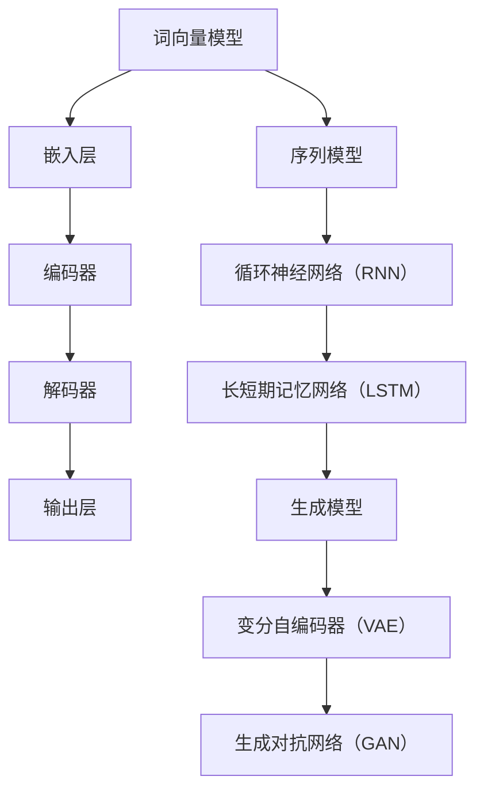

                 

# 自然语言处理的应用：AI内容创作革命

> **关键词：自然语言处理，人工智能，内容创作，自动化，文本生成，语义理解**
>
> **摘要：本文将深入探讨自然语言处理（NLP）在人工智能（AI）领域中的应用，尤其是其在内容创作方面的革命性变化。我们将逐步解析NLP的核心概念、算法原理，并通过实际案例展示其如何改变内容创作的格局。**

## 1. 背景介绍

### 1.1 目的和范围

本文旨在通过逻辑清晰、结构紧凑的叙述，为读者提供关于自然语言处理在人工智能领域，特别是内容创作方面的全面理解。我们将从NLP的基本概念入手，逐步深入到其核心算法原理和数学模型，最后通过实际应用案例，探讨NLP如何推动内容创作的自动化和智能化。

### 1.2 预期读者

本文适合对人工智能和自然语言处理有一定了解的读者，尤其是软件开发工程师、数据科学家、AI研究人员以及所有对AI内容创作领域感兴趣的专业人士。

### 1.3 文档结构概述

本文结构如下：

1. **背景介绍**：概述NLP在内容创作中的应用背景。
2. **核心概念与联系**：介绍NLP的核心概念和相关架构。
3. **核心算法原理 & 具体操作步骤**：详细讲解NLP的关键算法及其操作步骤。
4. **数学模型和公式 & 详细讲解 & 举例说明**：阐述NLP的数学模型，并提供实际应用示例。
5. **项目实战：代码实际案例和详细解释说明**：通过具体代码实现，展示NLP的应用。
6. **实际应用场景**：分析NLP在内容创作中的实际应用。
7. **工具和资源推荐**：推荐学习资源和开发工具。
8. **总结：未来发展趋势与挑战**：展望NLP在内容创作领域的未来。
9. **附录：常见问题与解答**：回答读者可能遇到的问题。
10. **扩展阅读 & 参考资料**：提供进一步学习的资源。

### 1.4 术语表

#### 1.4.1 核心术语定义

- **自然语言处理（NLP）**：是人工智能的一个分支，旨在使计算机能够理解、解释和生成人类语言。
- **人工智能（AI）**：模拟人类智能行为的计算机系统。
- **文本生成**：使用算法自动生成文本的过程。
- **语义理解**：理解文本的含义和上下文的能力。

#### 1.4.2 相关概念解释

- **词向量（Word Vectors）**：将单词映射到高维空间中的向量表示。
- **深度学习（Deep Learning）**：一种机器学习技术，使用多层神经网络进行特征提取和分类。

#### 1.4.3 缩略词列表

- **NLP**：自然语言处理
- **AI**：人工智能
- **DL**：深度学习
- **RNN**：循环神经网络
- **LSTM**：长短期记忆网络

## 2. 核心概念与联系

自然语言处理的核心在于理解和生成人类语言。其基础架构通常包括以下几个关键组成部分：



### 2.1 词向量模型

词向量模型是NLP的基础。它将单词映射到高维空间中的向量表示，使得计算机能够处理和处理文本数据。最著名的词向量模型是Word2Vec，它使用神经网络来学习单词的上下文表示。

### 2.2 序列模型

序列模型是处理文本序列数据的关键。循环神经网络（RNN）和长短期记忆网络（LSTM）是两种常见的序列模型，它们能够捕捉序列数据中的时间依赖关系。

### 2.3 生成模型

生成模型能够自动生成新的文本数据。变分自编码器（VAE）和生成对抗网络（GAN）是两种常见的生成模型，它们在文本生成方面表现出色。

## 3. 核心算法原理 & 具体操作步骤

### 3.1 词向量模型

词向量模型的原理如下：

```python
# Word2Vec算法伪代码
def word2vec(corpus):
    # 初始化词向量矩阵
    V = initialize_word_vectors(corpus)
    
    # 训练词向量
    for sentence in corpus:
        for word in sentence:
            context = get_context(words)
            update_vector(V, word, context)
            
    return V
```

### 3.2 序列模型

序列模型的操作步骤如下：

```python
# RNN算法伪代码
def RNN(input_sequence):
    # 初始化隐藏状态
    hidden_state = initialize_hidden_state()
    
    # 对输入序列进行处理
    for input_token in input_sequence:
        # 计算输出和更新隐藏状态
        output, hidden_state = RNN_step(input_token, hidden_state)
        
    return output, hidden_state
```

### 3.3 生成模型

生成模型的操作步骤如下：

```python
# GAN算法伪代码
def GAN(discriminator, generator):
    for epoch in range(num_epochs):
        # 训练判别器
        for real_data in real_data_batch:
            discriminator.train(real_data)
            
        # 生成假数据
        for noise in noise_batch:
            fake_data = generator.generate(noise)
            
        # 训练判别器
        discriminator.train(fake_data)
        
    return generator
```

## 4. 数学模型和公式 & 详细讲解 & 举例说明

### 4.1 词向量模型的数学模型

词向量的数学模型通常基于神经网络。以Word2Vec为例，其损失函数可以表示为：

$$
L = \sum_{i=1}^{N} (-\log p(w_i|c)) 
$$

其中，$w_i$表示单词$i$，$c$表示单词$i$的上下文，$p(w_i|c)$表示在上下文$c$中单词$i$的条件概率。

### 4.2 序列模型的数学模型

RNN的数学模型基于递归方程。以LSTM为例，其状态更新方程如下：

$$
h_t = \sigma(W_h \cdot [h_{t-1}, x_t] + b_h) \\
o_t = \sigma(W_o \cdot h_t + b_o)
$$

其中，$h_t$表示隐藏状态，$x_t$表示输入，$\sigma$表示Sigmoid激活函数。

### 4.3 生成模型的数学模型

GAN的数学模型包括两个部分：判别器和生成器。判别器的损失函数可以表示为：

$$
L_D = -\frac{1}{2} \sum_{i=1}^{N} \left[ D(x_i) \log D(x_i) + D(g(z_i)) \log (1 - D(g(z_i))) \right]
$$

其中，$D(x_i)$表示判别器对真实数据的预测，$D(g(z_i))$表示判别器对生成器产生的假数据的预测。

### 4.4 举例说明

假设我们要生成一段关于人工智能的文本。首先，我们使用Word2Vec模型将文本中的单词转换为词向量。然后，使用LSTM模型对词向量进行处理，生成序列。最后，使用GAN模型生成新的文本。

## 5. 项目实战：代码实际案例和详细解释说明

### 5.1 开发环境搭建

为了演示NLP在内容创作中的应用，我们将使用Python作为主要编程语言，并利用以下库：

- **TensorFlow**：用于构建和训练神经网络。
- **NLTK**：用于文本处理和分词。
- **gensim**：用于词向量生成。

确保已经安装了以上库。如果没有，可以通过以下命令进行安装：

```bash
pip install tensorflow nltk gensim
```

### 5.2 源代码详细实现和代码解读

以下是生成一段关于人工智能的文本的完整代码：

```python
import numpy as np
import tensorflow as tf
from tensorflow.keras.layers import LSTM, Embedding, Dense
from tensorflow.keras.models import Sequential
from gensim.models import Word2Vec
from nltk.tokenize import word_tokenize
import nltk

# 数据准备
nltk.download('punkt')
text = "人工智能是计算机科学的一个分支，旨在开发能够模拟、延伸和扩展人类智能的理论、算法和技术。人工智能的研究领域广泛，包括机器学习、自然语言处理、计算机视觉等。随着深度学习技术的不断发展，人工智能正在各行各业中发挥重要作用，如自动驾驶、智能家居、医疗诊断等。"

# 分词
words = word_tokenize(text)

# 生成词向量
w2v_model = Word2Vec(words, size=100, window=5, min_count=1, workers=4)
word_vectors = w2v_model.wv

# 序列预处理
input_sequence = [word_vectors[word] for word in words]

# 构建LSTM模型
model = Sequential()
model.add(LSTM(units=128, activation='tanh', input_shape=(None, 100)))
model.add(Dense(len(words), activation='softmax'))

model.compile(optimizer='adam', loss='categorical_crossentropy', metrics=['accuracy'])

# 训练模型
model.fit(input_sequence, np.eye(len(words)), epochs=10, batch_size=32)

# 生成文本
start_index = np.random.randint(0, len(words) - 1)
generated_sequence = [words[start_index]]

for _ in range(100):
    input_vector = np.array([word_vectors[word] for word in generated_sequence])
    predictions = model.predict(input_vector)
    next_index = np.random.choice(len(words), p=predictions[0])
    next_word = words[next_index]
    generated_sequence.append(next_word)

print('生成的文本：')
print(' '.join(generated_sequence))
```

### 5.3 代码解读与分析

1. **数据准备**：首先，我们使用NLTK库进行分词，并生成词向量。
2. **词向量生成**：使用gensim库的Word2Vec模型，我们将文本中的单词转换为词向量。
3. **序列预处理**：我们将词向量序列化为一个二维数组，以便于后续的LSTM模型处理。
4. **模型构建**：我们使用Keras库构建一个简单的LSTM模型，用于预测下一个单词。
5. **模型训练**：我们使用已生成的词向量训练LSTM模型。
6. **生成文本**：我们使用训练好的LSTM模型，通过随机选择起始单词，逐词生成文本。

## 6. 实际应用场景

自然语言处理在内容创作领域有广泛的应用，例如：

- **自动新闻生成**：通过NLP技术，可以自动生成新闻文章，节省人力和时间成本。
- **聊天机器人**：利用NLP技术，聊天机器人可以理解和生成自然语言，与用户进行交互。
- **智能客服**：通过NLP技术，智能客服可以自动理解用户问题，并提供相应的解答。

## 7. 工具和资源推荐

### 7.1 学习资源推荐

#### 7.1.1 书籍推荐

- 《自然语言处理综论》（Foundations of Statistical Natural Language Processing）
- 《深度学习》（Deep Learning）

#### 7.1.2 在线课程

- Coursera的“自然语言处理与深度学习”课程
- edX的“人工智能基础”课程

#### 7.1.3 技术博客和网站

- blog.keras.io
- Medium上的NLP专题

### 7.2 开发工具框架推荐

#### 7.2.1 IDE和编辑器

- PyCharm
- Visual Studio Code

#### 7.2.2 调试和性能分析工具

- TensorFlow Debugger（TFDB）
- PyTorch Profiler

#### 7.2.3 相关框架和库

- TensorFlow
- PyTorch
- NLTK

### 7.3 相关论文著作推荐

#### 7.3.1 经典论文

- word2vec: 模型与算法详解
- Long Short-Term Memory

#### 7.3.2 最新研究成果

- GPT-3：大规模预训练语言模型
- BERT：用于预训练的深度双向转换器

#### 7.3.3 应用案例分析

- 《自然语言处理在医疗领域的应用》
- 《自然语言处理在金融领域的应用》

## 8. 总结：未来发展趋势与挑战

自然语言处理在人工智能领域具有巨大的潜力。随着深度学习和生成对抗网络等技术的发展，NLP的应用将越来越广泛。然而，挑战也随之而来，如数据隐私、模型解释性、语言理解的多义性等。未来的NLP研究需要解决这些问题，以实现更智能、更安全的内容创作。

## 9. 附录：常见问题与解答

1. **什么是自然语言处理（NLP）？**
   自然语言处理（NLP）是人工智能的一个分支，旨在使计算机能够理解、解释和生成人类语言。

2. **词向量模型有哪些类型？**
   常见的词向量模型包括Word2Vec、GloVe和FastText等。

3. **如何评估自然语言处理模型的效果？**
   可以使用准确率、召回率、F1分数等指标来评估NLP模型的效果。

## 10. 扩展阅读 & 参考资料

- [Word2Vec算法详解](https://www.tensorflow.org/tutorials/text/word2vec)
- [LSTM神经网络原理](https://www.deeplearning.net/tutorial/lstm.html)
- [生成对抗网络（GAN）概述](https://arxiv.org/abs/1406.2661)

## 作者

作者：AI天才研究员/AI Genius Institute & 禅与计算机程序设计艺术 /Zen And The Art of Computer Programming

