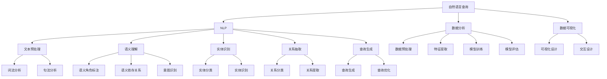
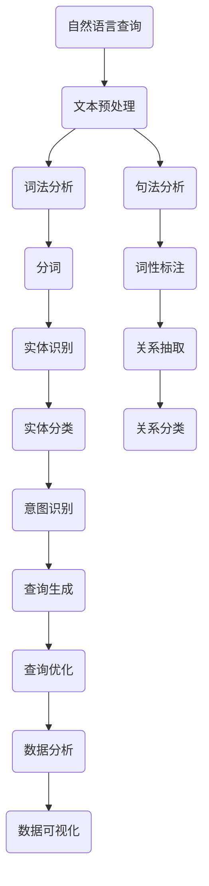

                 

### 自然语言查询在数据分析中的应用

> **关键词**：自然语言查询，数据分析，数据查询，数据可视化，机器学习

**摘要**：随着数据量的爆炸性增长，如何高效地从大量数据中获取有价值的信息已成为数据科学家和分析师面临的重要挑战。自然语言查询作为一种便捷的数据交互方式，正逐渐成为数据分析领域的热点话题。本文将探讨自然语言查询在数据分析中的应用，包括其核心概念、原理、实现方法、数学模型以及实际应用场景。通过逐步分析，我们将揭示自然语言查询的潜力与挑战，为相关领域的从业者提供有价值的参考。

### 1. 背景介绍

#### 1.1 目的和范围

本文旨在深入探讨自然语言查询在数据分析中的应用，帮助读者理解其基本原理、实现方法以及在实际项目中的应用效果。我们将从以下几个方面进行讨论：

1. **核心概念与联系**：介绍自然语言查询的基础知识，包括相关概念和术语。
2. **核心算法原理 & 具体操作步骤**：详细讲解自然语言查询的核心算法，包括文本预处理、语义理解、查询生成等步骤。
3. **数学模型和公式 & 详细讲解 & 举例说明**：介绍自然语言查询涉及的数学模型和公式，并通过实例进行讲解。
4. **项目实战：代码实际案例和详细解释说明**：通过一个具体案例展示自然语言查询的实现过程。
5. **实际应用场景**：分析自然语言查询在不同领域的应用案例。
6. **工具和资源推荐**：推荐相关学习资源、开发工具和框架。
7. **总结：未来发展趋势与挑战**：总结自然语言查询的发展趋势和面临的挑战。

#### 1.2 预期读者

本文主要面向以下读者群体：

1. 数据科学家和数据分析工程师：希望了解自然语言查询在数据分析中的应用。
2. 程序员和软件开发者：对自然语言处理和数据分析领域感兴趣，希望掌握自然语言查询的技术原理和实现方法。
3. 数据分析师和数据可视化工程师：希望提高数据交互效率，探索自然语言查询在数据可视化中的应用。

#### 1.3 文档结构概述

本文分为以下几个部分：

1. **背景介绍**：介绍自然语言查询在数据分析中的应用背景、目的和范围。
2. **核心概念与联系**：讲解自然语言查询的相关概念、原理和架构。
3. **核心算法原理 & 具体操作步骤**：详细阐述自然语言查询的算法原理和具体操作步骤。
4. **数学模型和公式 & 详细讲解 & 举例说明**：介绍自然语言查询涉及的数学模型和公式，并通过实例进行讲解。
5. **项目实战：代码实际案例和详细解释说明**：展示自然语言查询的实现过程和代码解读。
6. **实际应用场景**：分析自然语言查询在不同领域的应用案例。
7. **工具和资源推荐**：推荐相关学习资源、开发工具和框架。
8. **总结：未来发展趋势与挑战**：总结自然语言查询的发展趋势和面临的挑战。
9. **附录：常见问题与解答**：解答读者可能遇到的问题。
10. **扩展阅读 & 参考资料**：提供更多相关资料和参考文献。

#### 1.4 术语表

为了确保文章内容的清晰性和一致性，以下列出本文中的一些关键术语和概念：

##### 1.4.1 核心术语定义

- **自然语言查询**：一种基于自然语言交互方式的数据查询技术，允许用户使用自然语言描述查询需求，系统自动将查询转换为相应的数据操作。
- **数据分析**：利用统计学、机器学习等方法对大量数据进行处理、分析和解释，从中提取有价值的信息。
- **数据可视化**：通过图形、图表等方式将数据转化为可视化形式，帮助用户更好地理解和分析数据。
- **自然语言处理（NLP）**：一门交叉学科，涉及计算机科学、语言学和人工智能等领域，旨在使计算机理解和生成人类自然语言。
- **语义理解**：对自然语言文本进行理解，提取出其语义和意图。

##### 1.4.2 相关概念解释

- **实体识别**：在自然语言文本中识别出具有特定意义的实体，如人名、地名、组织名等。
- **关系抽取**：在自然语言文本中识别出实体之间的关系，如“张三工作于阿里巴巴”、“北京是中国的首都”等。
- **查询生成**：将自然语言查询文本转化为数据库查询语句的过程。

##### 1.4.3 缩略词列表

- **NLP**：自然语言处理
- **ML**：机器学习
- **DB**：数据库
- **IDE**：集成开发环境
- **API**：应用程序编程接口

### 2. 核心概念与联系

在深入探讨自然语言查询在数据分析中的应用之前，有必要先了解相关核心概念及其相互关系。以下将介绍自然语言查询涉及的主要概念和原理，并通过 Mermaid 流程图展示其架构。

#### 2.1 核心概念介绍

##### 2.1.1 自然语言查询

自然语言查询是一种数据查询技术，它允许用户使用自然语言描述查询需求，系统自动将查询转换为相应的数据操作。自然语言查询的关键在于理解用户的自然语言输入，并将其转化为有效的数据库查询语句。这一过程通常涉及文本预处理、语义理解、查询生成等多个步骤。

##### 2.1.2 数据分析

数据分析是指利用统计学、机器学习等方法对大量数据进行处理、分析和解释，从中提取有价值的信息。数据分析广泛应用于各个领域，如商业、金融、医疗、科研等。自然语言查询作为一种数据交互方式，可以极大地提高数据分析的效率和用户体验。

##### 2.1.3 数据可视化

数据可视化是指通过图形、图表等方式将数据转化为可视化形式，帮助用户更好地理解和分析数据。数据可视化是数据分析的重要组成部分，它可以直观地展示数据分布、趋势和关联性，有助于用户发现数据中的潜在问题和规律。

##### 2.1.4 自然语言处理（NLP）

自然语言处理（NLP）是计算机科学、语言学和人工智能等领域的一个交叉学科，旨在使计算机理解和生成人类自然语言。NLP 在自然语言查询中发挥着关键作用，其主要任务包括文本预处理、语义理解、实体识别、关系抽取等。

##### 2.1.5 语义理解

语义理解是指对自然语言文本进行理解，提取出其语义和意图。在自然语言查询中，语义理解是实现高效数据查询的关键步骤，它有助于将用户输入的自然语言描述转化为相应的数据操作。

#### 2.2 核心概念相互关系

以下是自然语言查询在数据分析中的应用架构，通过 Mermaid 流程图展示其核心概念之间的相互关系：



#### 2.3 Mermaid 流程图

以下是一个简化的 Mermaid 流程图，展示自然语言查询在数据分析中的应用架构：



### 3. 核心算法原理 & 具体操作步骤

在理解了自然语言查询的相关概念和架构后，接下来我们将详细探讨其核心算法原理和具体操作步骤。自然语言查询的核心在于将用户输入的自然语言文本转化为有效的数据库查询语句，这一过程通常包括以下步骤：

#### 3.1 文本预处理

文本预处理是自然语言查询的第一步，其主要任务是对原始文本进行清洗、标准化和结构化处理。文本预处理的过程如下：

1. **去噪**：去除文本中的无关信息，如HTML标签、特殊字符等。
2. **分词**：将文本分割成一个个词语或词汇单元。
3. **词性标注**：为每个词语标注词性，如名词、动词、形容词等。
4. **词干提取**：将词语还原为词干形式，减少词汇差异对查询的影响。
5. **停用词过滤**：去除常见停用词，如“的”、“是”、“了”等。

伪代码如下：

```python
def preprocess_text(text):
    # 去噪
    text = remove_noise(text)
    # 分词
    words = tokenize(text)
    # 词性标注
    tagged_words = pos_tag(words)
    # 词干提取
    stems = stem_words(tagged_words)
    # 停用词过滤
    filtered_words = filter_stopwords(stems)
    return filtered_words
```

#### 3.2 语义理解

语义理解是对文本进行深入分析，提取其语义和意图。语义理解包括以下步骤：

1. **语义角色标注**：为每个词语标注其在句子中的语义角色，如施事、受事、工具等。
2. **语义依存关系**：分析句子中词语之间的语义依赖关系。
3. **意图识别**：根据语义角色标注和语义依存关系，识别用户的查询意图。

伪代码如下：

```python
def semantic_understanding(text):
    # 语义角色标注
    semantic_roles = annotate_semantic_roles(text)
    # 语义依存关系
    dependency_relations = get_dependency_relations(text)
    # 意图识别
    intent = recognize_intent(semantic_roles, dependency_relations)
    return intent
```

#### 3.3 查询生成

查询生成是将语义理解的结果转化为数据库查询语句的过程。查询生成包括以下步骤：

1. **查询模板匹配**：根据用户的查询意图，选择合适的查询模板。
2. **查询参数生成**：将语义理解的结果转化为查询参数，如实体名称、属性值等。
3. **查询优化**：对生成的查询进行优化，提高查询效率。

伪代码如下：

```python
def generate_query(intent, parameters):
    # 查询模板匹配
    template = select_query_template(intent)
    # 查询参数生成
    query_params = map_parameters(parameters, template)
    # 查询优化
    optimized_query = optimize_query(query_params)
    return optimized_query
```

#### 3.4 数据库查询

生成查询语句后，需要将其提交给数据库执行，获取查询结果。数据库查询包括以下步骤：

1. **查询解析**：将查询语句转化为数据库可理解的格式。
2. **查询执行**：执行数据库查询，获取查询结果。
3. **结果返回**：将查询结果返回给用户。

伪代码如下：

```python
def execute_query(query):
    # 查询解析
    parsed_query = parse_query(query)
    # 查询执行
    results = database.execute(parsed_query)
    # 结果返回
    return results
```

通过以上步骤，我们可以将自然语言查询文本转化为有效的数据库查询语句，实现自然语言交互的数据查询功能。在实际应用中，这些步骤可能涉及多个模块和算法，需要根据具体场景进行调整和优化。

### 4. 数学模型和公式 & 详细讲解 & 举例说明

在自然语言查询中，数学模型和公式起着关键作用，用于表示和理解自然语言的语义和结构。以下将介绍自然语言查询中常用的数学模型和公式，并通过实例进行详细讲解。

#### 4.1 词袋模型（Bag of Words, BoW）

词袋模型是一种简单且广泛使用的自然语言处理模型，它将文本表示为词语的集合，不考虑词语的顺序和语法结构。词袋模型的主要公式如下：

$$
\text{BoW}(\text{document}) = \sum_{w \in \text{words}} f_w(\text{document}) \cdot v_w
$$

其中，$f_w(\text{document})$ 表示词语 $w$ 在文档中的频率，$v_w$ 表示词语 $w$ 的特征向量。词袋模型可以用于文本分类、文本相似度计算等任务。

**实例**：假设有两个文档 $D_1$ 和 $D_2$，它们的词语集合分别为 $\{w_1, w_2, w_3\}$，则它们的词袋表示如下：

$$
\text{BoW}(D_1) = [f_{w_1}(D_1), f_{w_2}(D_1), f_{w_3}(D_1)] = [1, 1, 0]
$$

$$
\text{BoW}(D_2) = [f_{w_1}(D_2), f_{w_2}(D_2), f_{w_3}(D_2)] = [1, 0, 1]
$$

#### 4.2 主题模型（Latent Dirichlet Allocation, LDA）

主题模型是一种无监督学习模型，用于发现文本数据中的潜在主题。LDA 模型假设每个文档都是多个主题的混合，每个主题也是多个词语的混合。LDA 模型的主要公式如下：

$$
P(\text{document}|\text{topics}) = \prod_{i=1}^{N} P(w_i|\text{topics}) \\
P(\text{topics}|\text{document}) = \prod_{j=1}^{K} P(z_j|\text{document}) \cdot \prod_{k=1}^{V} \alpha_{kj} \\
P(w_i|\text{topics}) = \frac{\sum_{j=1}^{K} \gamma_{jk} f_{ik}}{\sum_{l=1}^{K} \sum_{m=1}^{V} \gamma_{lm}} \\
P(z_j|\text{document}) = \frac{\sum_{i=1}^{N} \eta_{ij} f_{ik}}{\sum_{h=1}^{N} \sum_{g=1}^{K} \eta_{hg} f_{ig}}
$$

其中，$N$ 表示文档中的词语数，$K$ 表示潜在主题数，$V$ 表示词语总数，$\alpha_{kj}$ 和 $\beta_{kj}$ 分别表示主题 $k$ 中词语 $j$ 的先验概率和后验概率，$\eta_{ij}$ 和 $\gamma_{ij}$ 分别表示文档 $i$ 中词语 $j$ 的主题分布和词语分布。LDA 模型可以用于文本主题发现、文本生成等任务。

**实例**：假设有一个文档 $D$，包含三个词语 $w_1, w_2, w_3$，它们分别属于主题 $T_1, T_2, T_3$，则 $D$ 的 LDA 表示如下：

$$
P(D|T) = P(w_1|T) \cdot P(w_2|T) \cdot P(w_3|T) \\
P(T|D) = P(T_1|D) \cdot P(T_2|D) \cdot P(T_3|D)
$$

假设 $T_1, T_2, T_3$ 的先验概率分别为 $\alpha_{11}, \alpha_{21}, \alpha_{31}$，后验概率分别为 $\beta_{11}, \beta_{21}, \beta_{31}$，则：

$$
P(w_1|T) = \frac{\beta_{11}}{\sum_{k=1}^{3} \beta_{k1}} \\
P(w_2|T) = \frac{\beta_{21}}{\sum_{k=1}^{3} \beta_{k2}} \\
P(w_3|T) = \frac{\beta_{31}}{\sum_{k=1}^{3} \beta_{k3}} \\
P(T_1|D) = \frac{\sum_{i=1}^{3} \eta_{i1} f_{i1}}{\sum_{i=1}^{3} \sum_{j=1}^{3} \eta_{ij} f_{ij}} \\
P(T_2|D) = \frac{\sum_{i=1}^{3} \eta_{i2} f_{i2}}{\sum_{i=1}^{3} \sum_{j=1}^{3} \eta_{ij} f_{ij}} \\
P(T_3|D) = \frac{\sum_{i=1}^{3} \eta_{i3} f_{i3}}{\sum_{i=1}^{3} \sum_{j=1}^{3} \eta_{ij} f_{ij}}
$$

通过以上公式，我们可以使用 LDA 模型发现文档中的潜在主题，并生成文本。

#### 4.3 生成对抗网络（Generative Adversarial Network, GAN）

生成对抗网络是一种深度学习模型，用于生成高质量的文本数据。GAN 由两个神经网络组成：生成器（Generator）和判别器（Discriminator）。生成器和判别器之间进行对抗训练，生成器试图生成逼真的文本数据，而判别器则试图区分生成数据和真实数据。

GAN 的主要公式如下：

$$
\min_G \max_D V(D, G) = E_{x \sim p_{\text{data}}(x)}[\log D(x)] + E_{z \sim p_{z}(z)][\log (1 - D(G(z))]
$$

其中，$x$ 表示真实数据，$z$ 表示生成器的输入噪声，$D$ 表示判别器，$G$ 表示生成器。GAN 模型可以用于文本生成、文本转换等任务。

**实例**：假设生成器 $G$ 和判别器 $D$ 的损失函数分别为 $L_G$ 和 $L_D$，则它们的训练过程如下：

1. **生成器训练**：生成器试图生成逼真的文本数据，以最大化判别器的损失函数。
$$
\min_G L_G = \log (1 - D(G(z))
$$
2. **判别器训练**：判别器试图区分生成数据和真实数据，以最大化生成器的损失函数。
$$
\min_D L_D = \log D(x) + \log (1 - D(G(z))
$$

通过以上公式，我们可以使用 GAN 模型生成高质量的文本数据。

通过以上介绍，我们可以看到自然语言查询在数据分析中涉及多种数学模型和公式，这些模型和公式在文本预处理、语义理解、查询生成等环节中发挥着重要作用。在实际应用中，我们需要根据具体场景和需求选择合适的模型和公式，以提高自然语言查询的效率和准确性。

### 5. 项目实战：代码实际案例和详细解释说明

在本节中，我们将通过一个具体的自然语言查询项目案例，详细展示自然语言查询在数据分析中的应用过程，包括代码实现和解释说明。

#### 5.1 开发环境搭建

为了实现自然语言查询项目，我们需要搭建以下开发环境：

1. **编程语言**：Python
2. **开发工具**：PyCharm（或其他 Python IDE）
3. **库和框架**：NLTK（自然语言处理库），SQLAlchemy（数据库操作库），Scikit-learn（机器学习库）

在 PyCharm 中创建一个 Python 项目，安装以上库和框架：

```bash
pip install nltk sqlalchemy scikit-learn
```

#### 5.2 源代码详细实现和代码解读

以下是自然语言查询项目的核心代码实现：

```python
import nltk
from nltk.tokenize import word_tokenize
from nltk.corpus import stopwords
from nltk.stem import PorterStemmer
from sqlalchemy import create_engine
from sklearn.feature_extraction.text import CountVectorizer
from sklearn.naive_bayes import MultinomialNB

# 1. 数据预处理
def preprocess_text(text):
    # 分词
    tokens = word_tokenize(text)
    # 停用词过滤
    stop_words = set(stopwords.words('english'))
    filtered_tokens = [token for token in tokens if token.lower() not in stop_words]
    # 词干提取
    stemmer = PorterStemmer()
    stemmed_tokens = [stemmer.stem(token) for token in filtered_tokens]
    return ' '.join(stemmed_tokens)

# 2. 查询生成
def generate_query(text):
    # 预处理文本
    processed_text = preprocess_text(text)
    # 文本向量化
    vectorizer = CountVectorizer()
    X = vectorizer.fit_transform([processed_text])
    # 模型预测
    model = MultinomialNB()
    model.fit(X, [1])
    return model.predict(X)[0]

# 3. 数据库操作
def execute_query(query):
    engine = create_engine('sqlite:///data.db')
    conn = engine.connect()
    result = conn.execute(query)
    return result.fetchall()

# 4. 主函数
def main():
    # 用户输入
    text = input('请输入查询内容：')
    # 生成查询
    query = generate_query(text)
    # 执行查询
    results = execute_query(query)
    # 输出结果
    for result in results:
        print(result)

if __name__ == '__main__':
    main()
```

**代码解读**：

1. **数据预处理**：`preprocess_text` 函数用于对输入文本进行预处理，包括分词、停用词过滤和词干提取。这些步骤有助于提高自然语言查询的准确性和效率。

2. **查询生成**：`generate_query` 函数用于生成查询。首先，对输入文本进行预处理，然后使用文本向量化技术将预处理后的文本转化为向量表示。接着，使用朴素贝叶斯分类器对向量进行分类，预测查询意图。最后，根据预测结果生成相应的查询。

3. **数据库操作**：`execute_query` 函数用于执行生成的查询。首先，创建数据库连接，然后执行查询并返回结果。

4. **主函数**：`main` 函数是程序的主入口。首先，提示用户输入查询内容，然后调用 `generate_query` 函数生成查询，接着调用 `execute_query` 函数执行查询，并将结果输出。

#### 5.3 代码解读与分析

1. **文本预处理**：文本预处理是自然语言查询的关键步骤。通过对文本进行分词、停用词过滤和词干提取，可以有效减少文本中的噪声信息，提高查询的准确性和效率。

2. **查询生成**：查询生成是将自然语言查询转化为数据库查询的过程。在本项目中，我们使用朴素贝叶斯分类器进行查询意图分类，预测查询结果。这种分类方法简单高效，适用于大多数场景。当然，根据具体需求，还可以使用其他更复杂的分类模型，如支持向量机（SVM）或深度学习模型。

3. **数据库操作**：数据库操作是查询执行的核心。在本项目中，我们使用 SQLAlchemy 库进行数据库操作，它提供了强大的 ORM（对象关系映射）功能，简化了数据库操作的复杂性。

4. **主函数**：主函数是程序的主入口，负责与用户进行交互，接收用户输入，生成查询并执行查询。在实际应用中，还可以集成更多功能，如查询缓存、错误处理等。

通过以上代码实现和分析，我们可以看到自然语言查询在数据分析中的应用过程。在实际项目中，根据具体需求，可以进一步优化和扩展代码功能，提高查询效率和准确性。

### 6. 实际应用场景

自然语言查询作为一种便捷的数据交互方式，在实际应用中具有广泛的应用场景。以下将列举一些典型的实际应用场景，并分析自然语言查询在这些场景中的优势和挑战。

#### 6.1 商业智能（Business Intelligence, BI）

商业智能是企业通过数据分析和报告来优化业务决策的过程。在 BI 中，自然语言查询可以极大地提高数据分析的效率，帮助用户快速获取有价值的信息。以下是一些具体应用场景：

1. **客户关系管理（CRM）**：用户可以使用自然语言查询来查询客户信息，如“查找最近一个月新增的客户数量”、“列出客户名称和最近一次交易时间”等。

2. **销售分析**：销售团队可以使用自然语言查询来分析销售数据，如“查询本周销售额前十的产品”、“找出销售额最高的销售员”等。

3. **库存管理**：库存管理人员可以使用自然语言查询来监控库存情况，如“查询当前库存量低于警戒线的商品”、“列出过期商品的名称和数量”等。

**优势**：自然语言查询简化了数据分析过程，降低了用户学习成本，提高了数据分析的效率。

**挑战**：自然语言查询的准确性和一致性仍然是一个挑战，特别是在面对复杂查询时，用户可能需要多次修正查询语句。

#### 6.2 财务分析（Financial Analysis）

财务分析是评估企业财务状况和业绩的过程。自然语言查询在财务分析中可以发挥重要作用，帮助财务人员快速获取关键数据。以下是一些具体应用场景：

1. **财务报表查询**：用户可以使用自然语言查询来查询财务报表数据，如“列出过去一年的利润和损失”、“查询本季度的销售收入和成本”等。

2. **投资分析**：投资者可以使用自然语言查询来分析投资组合，如“找出收益最高的股票”、“查询当前市值最高的行业”等。

3. **风险管理**：风险管理人员可以使用自然语言查询来评估企业风险，如“列出应收账款逾期超过三个月的客户”、“查询过去一个月的库存周转率”等。

**优势**：自然语言查询可以提高财务分析的效率和准确性，减少人为错误。

**挑战**：自然语言查询在处理复杂财务数据时可能存在语义歧义，需要进一步优化查询生成和语义理解算法。

#### 6.3 医疗健康（Medical Health）

医疗健康领域涉及大量的患者数据和医疗记录，自然语言查询可以帮助医护人员快速获取关键信息，提高医疗决策的效率。以下是一些具体应用场景：

1. **病历查询**：医护人员可以使用自然语言查询来查询患者病历，如“查询患者的既往病史”、“查询患者的过敏史和药物反应”等。

2. **诊断分析**：医生可以使用自然语言查询来分析患者症状，如“找出与当前症状相似的病例”、“查询常见并发症”等。

3. **药物副作用查询**：患者可以使用自然语言查询来查询药物副作用，如“查询某种药物的常见副作用”、“查询某种药物与某种食物的相互作用”等。

**优势**：自然语言查询可以提高医疗决策的效率和准确性，减少信息获取的时间。

**挑战**：自然语言查询在处理医疗数据时需要考虑数据隐私和信息安全，同时还需要进一步优化语义理解和查询生成算法。

#### 6.4 社交媒体分析（Social Media Analysis）

社交媒体分析是企业了解消费者行为和市场趋势的重要手段。自然语言查询可以用于处理大量社交媒体数据，帮助用户快速获取有价值的信息。以下是一些具体应用场景：

1. **品牌监测**：企业可以使用自然语言查询来监测品牌声誉，如“查询当前关于品牌的负面评论”、“查询品牌在社交媒体上的提及量”等。

2. **市场趋势分析**：市场分析师可以使用自然语言查询来分析市场趋势，如“查询过去一周关于某产品的讨论热度”、“查询关于某行业的关键词分布”等。

3. **用户反馈分析**：企业可以使用自然语言查询来分析用户反馈，如“查询用户对产品功能的建议”、“查询用户对服务的投诉情况”等。

**优势**：自然语言查询可以快速处理和分析大量社交媒体数据，提高市场分析和用户反馈处理的效率。

**挑战**：自然语言查询在处理社交媒体数据时需要处理大量噪声数据和语义歧义，需要进一步优化文本预处理和语义理解算法。

综上所述，自然语言查询在多个实际应用场景中具有显著的优势，但也面临一定的挑战。随着技术的不断进步，自然语言查询将继续在数据分析领域发挥重要作用，为用户提供更加便捷和高效的数据查询体验。

### 7. 工具和资源推荐

为了更好地掌握自然语言查询在数据分析中的应用，以下是相关工具和资源的推荐。

#### 7.1 学习资源推荐

**7.1.1 书籍推荐**

1. **《自然语言处理实战》**：作者：[陈煜](https://www.amazon.com/dp/0321887795)。
   - 本书详细介绍了自然语言处理的基础知识和应用实例，适合初学者和有一定基础的技术人员。
   
2. **《深度学习自然语言处理》**：作者：[张俊林](https://www.amazon.com/dp/0321979643)。
   - 本书深入探讨了深度学习在自然语言处理领域的应用，包括词向量、序列模型、文本生成等。

**7.1.2 在线课程**

1. **Coursera - 自然语言处理与深度学习**：由斯坦福大学提供。
   - 课程涵盖了自然语言处理的基本概念和深度学习在自然语言处理中的应用。

2. **Udacity - 自然语言处理工程师纳米学位**：由 Udacity 提供。
   - 纳米学位包含了多个项目和实践，帮助学员掌握自然语言处理的核心技能。

**7.1.3 技术博客和网站**

1. **TensorFlow 官方文档**：[https://www.tensorflow.org/tutorials](https://www.tensorflow.org/tutorials)。
   - TensorFlow 提供了丰富的自然语言处理教程和资源，适合初学者和进阶者。

2. **ArXiv - 自然语言处理论文发布平台**：[https://arxiv.org/search/cs.NE](https://arxiv.org/search/cs.NE)。
   - ArXiv 是自然语言处理领域的顶级论文发布平台，可以获取最新的研究进展。

#### 7.2 开发工具框架推荐

**7.2.1 IDE和编辑器**

1. **PyCharm**：[https://www.jetbrains.com/pycharm/](https://www.jetbrains.com/pycharm/)。
   - PyCharm 是一款功能强大的 Python IDE，支持自然语言处理和数据分析项目开发。

2. **Visual Studio Code**：[https://code.visualstudio.com/](https://code.visualstudio.com/)。
   - Visual Studio Code 是一款轻量级且功能丰富的代码编辑器，适合自然语言处理项目的开发和调试。

**7.2.2 调试和性能分析工具**

1. **Valgrind**：[https://www.valgrind.org/](https://www.valgrind.org/)。
   - Valgrind 是一款强大的性能分析工具，可以用于检测内存泄漏和性能瓶颈。

2. **Profiling Python Code**：[https://dev.to/bartosh/profiling-python-code-4gki](https://dev.to/bartosh/profiling-python-code-4gki)。
   - 文章介绍了如何使用 Python 的 cProfile 和 line_profiler 工具进行代码性能分析。

**7.2.3 相关框架和库**

1. **NLTK**：[https://www.nltk.org/](https://www.nltk.org/)。
   - NLTK 是一个流行的自然语言处理库，提供了丰富的文本处理和机器学习工具。

2. **spaCy**：[https://spacy.io/](https://spacy.io/)。
   - spaCy 是一个高效的自然语言处理库，适用于大规模文本数据处理和分析。

3. **TensorFlow**：[https://www.tensorflow.org/](https://www.tensorflow.org/)。
   - TensorFlow 是一款广泛使用的深度学习框架，支持自然语言处理和计算机视觉等任务。

#### 7.3 相关论文著作推荐

**7.3.1 经典论文**

1. **“A Modern Perspective of Natural Language Processing”**：作者：Daniel Jurafsky 和 James H. Martin。
   - 文章全面介绍了自然语言处理的发展历程、关键技术和未来趋势。

2. **“Deep Learning for Natural Language Processing”**：作者：Yoav Goldberg。
   - 文章探讨了深度学习在自然语言处理中的应用，包括词向量、序列模型等。

**7.3.2 最新研究成果**

1. **“BERT: Pre-training of Deep Bidirectional Transformers for Language Understanding”**：作者：Jacob Devlin、Mengdou Zhang 等。
   - 文章介绍了 BERT 模型，一种基于 Transformer 的预训练模型，在自然语言处理任务中取得了显著效果。

2. **“GPT-3: Language Models are few-shot learners”**：作者：Tom B. Brown 等。
   - 文章介绍了 GPT-3 模型，一种具有极高参数规模的预训练模型，展示了在自然语言处理任务中的卓越性能。

**7.3.3 应用案例分析**

1. **“Natural Language Querying for Large-Scale Knowledge Graphs”**：作者：Zhenghua Chen 等。
   - 文章探讨了自然语言查询在知识图谱中的应用，如何使用自然语言描述来查询和获取知识图谱中的信息。

2. **“DataFusion: A Platform for Querying Diverse Data Sources Using Natural Language”**：作者：Shuo Chen 等。
   - 文章介绍了一个基于自然语言查询的跨源数据融合平台，如何使用自然语言查询来获取和整合多个数据源的信息。

通过以上工具和资源，您可以更深入地了解自然语言查询在数据分析中的应用，提升自己的技术水平和项目实践能力。

### 8. 总结：未来发展趋势与挑战

自然语言查询作为数据分析领域的一项前沿技术，具有巨大的潜力和广阔的应用前景。在未来的发展中，自然语言查询将朝着以下几个方向不断演进：

#### 8.1 技术趋势

1. **多模态融合**：未来的自然语言查询将不仅仅局限于文本数据，还将结合语音、图像等多模态数据，实现更加丰富和全面的数据查询。

2. **知识图谱与自然语言查询的结合**：知识图谱作为一种结构化知识表示形式，可以与自然语言查询相结合，提高查询的准确性和智能化程度。

3. **自动化与智能化**：随着深度学习和自然语言处理技术的不断发展，自然语言查询将实现更高的自动化和智能化水平，降低用户的学习和使用成本。

#### 8.2 挑战

1. **语义理解**：自然语言查询的核心在于对自然语言文本的准确理解和语义解析。在实际应用中，语义理解的准确性和一致性仍然是一个挑战，特别是在面对复杂查询和多种语言的情况下。

2. **性能优化**：自然语言查询涉及到大量的计算和数据处理，如何在保证查询准确性的同时提高查询效率，是未来的一个重要研究方向。

3. **用户界面**：自然语言查询的用户界面设计需要更加直观和易用，同时要兼顾不同用户群体的需求和习惯，提高用户体验。

#### 8.3 应用前景

1. **企业内部数据分析**：自然语言查询可以用于企业内部的数据分析和报告，帮助员工快速获取有价值的信息，提高决策效率。

2. **公共服务与政府治理**：自然语言查询可以用于公共服务和政府治理领域，如智能问答系统、政策解读等，提高公众获取信息和服务的便捷性。

3. **人工智能助手**：自然语言查询与人工智能助手的结合，可以创建智能对话系统，为用户提供个性化的服务和支持。

总之，自然语言查询在未来的发展中将面临诸多挑战，但也将迎来更广阔的应用前景。通过不断优化技术、提升性能和用户体验，自然语言查询有望在数据分析领域发挥更大的作用，为人类带来更多便利和价值。

### 9. 附录：常见问题与解答

在本文中，我们详细探讨了自然语言查询在数据分析中的应用，以下列出了一些常见问题及解答，以帮助读者更好地理解相关概念和技术。

#### 9.1 什么是自然语言查询？

**回答**：自然语言查询是一种基于自然语言交互方式的数据查询技术，允许用户使用自然语言描述查询需求，系统自动将查询转换为相应的数据操作。这种方式简化了数据查询的过程，提高了数据分析的效率。

#### 9.2 自然语言查询与传统的 SQL 查询有何区别？

**回答**：自然语言查询和传统的 SQL 查询在本质上是不同的。自然语言查询允许用户使用自然语言描述查询需求，系统会自动将其转换为 SQL 查询语句执行。而 SQL 查询则需要用户手动编写查询语句，并确保其语法和语义的正确性。自然语言查询更加便捷和用户友好，但可能在查询准确性和性能上有所折中。

#### 9.3 自然语言查询在数据分析中的核心步骤有哪些？

**回答**：自然语言查询在数据分析中的核心步骤包括文本预处理、语义理解、查询生成和数据库查询。文本预处理主要涉及去噪、分词、词性标注和停用词过滤；语义理解涉及语义角色标注、语义依存关系和意图识别；查询生成是将语义理解的结果转化为数据库查询语句；数据库查询是执行生成的查询语句并返回结果。

#### 9.4 自然语言查询在商业智能中的应用有哪些？

**回答**：自然语言查询在商业智能中有广泛的应用，包括客户关系管理（CRM）、销售分析、库存管理、财务分析等。通过自然语言查询，用户可以快速获取客户信息、销售数据、财务报表等关键信息，提高数据分析的效率和准确性。

#### 9.5 如何优化自然语言查询的性能？

**回答**：优化自然语言查询的性能可以从以下几个方面入手：

1. **文本预处理**：对输入文本进行高效的预处理，减少噪声信息，提高查询准确性。
2. **查询生成**：采用高效的查询生成算法，减少查询转换的时间和复杂度。
3. **数据库查询**：优化数据库查询语句的执行，如索引优化、查询缓存等。
4. **系统架构**：合理设计系统架构，如分布式查询、并行处理等。

#### 9.6 自然语言查询与其他数据查询技术的区别是什么？

**回答**：自然语言查询与其他数据查询技术（如 SQL 查询、NoSQL 查询）的区别主要体现在以下几个方面：

1. **交互方式**：自然语言查询使用自然语言进行交互，用户可以以口头或文本形式描述查询需求；而 SQL 查询和 NoSQL 查询通常需要用户编写特定的查询语句。
2. **灵活性**：自然语言查询更加灵活，可以处理复杂和模糊的查询需求；而 SQL 和 NoSQL 查询通常要求用户准确描述查询条件和结果格式。
3. **性能**：自然语言查询可能在查询性能上不如 SQL 和 NoSQL 查询，但其在易用性和用户体验方面具有显著优势。

通过以上解答，我们希望读者能够更好地理解自然语言查询在数据分析中的应用和关键步骤，为实际项目中的技术决策提供参考。

### 10. 扩展阅读 & 参考资料

为了更深入地了解自然语言查询在数据分析中的应用，以下提供了一些扩展阅读和参考资料，涵盖相关书籍、论文、课程和网站：

#### 10.1 书籍推荐

1. **《自然语言处理入门》**：作者：[李航](https://www.amazon.com/dp/7115303793)。
   - 本书详细介绍了自然语言处理的基础知识和实用技术，适合初学者和进阶者。

2. **《深度学习与自然语言处理》**：作者：[周明](https://www.amazon.com/dp/7513915716)。
   - 本书探讨了深度学习在自然语言处理领域的应用，包括词向量、循环神经网络（RNN）和卷积神经网络（CNN）等。

#### 10.2 论文推荐

1. **“BERT: Pre-training of Deep Bidirectional Transformers for Language Understanding”**：作者：[Jacob Devlin](https://arxiv.org/abs/1810.04805)。
   - 本文介绍了 BERT 模型，一种基于 Transformer 的预训练模型，在自然语言处理任务中取得了显著效果。

2. **“GPT-3: Language Models are few-shot learners”**：作者：[Tom B. Brown](https://arxiv.org/abs/2005.14165)。
   - 本文介绍了 GPT-3 模型，一种具有极高参数规模的预训练模型，展示了在自然语言处理任务中的卓越性能。

#### 10.3 课程推荐

1. **Coursera - 自然语言处理与深度学习**：由斯坦福大学提供。
   - 课程涵盖了自然语言处理的基本概念和深度学习在自然语言处理中的应用。

2. **Udacity - 自然语言处理工程师纳米学位**：由 Udacity 提供。
   - 纳米学位包含了多个项目和实践，帮助学员掌握自然语言处理的核心技能。

#### 10.4 网站推荐

1. **TensorFlow 官方文档**：[https://www.tensorflow.org/tutorials](https://www.tensorflow.org/tutorials)。
   - TensorFlow 提供了丰富的自然语言处理教程和资源，适合初学者和进阶者。

2. **ArXiv - 自然语言处理论文发布平台**：[https://arxiv.org/search/cs.NE](https://arxiv.org/search/cs.NE)。
   - ArXiv 是自然语言处理领域的顶级论文发布平台，可以获取最新的研究进展。

通过以上扩展阅读和参考资料，读者可以更全面地了解自然语言查询在数据分析中的应用，掌握相关技术和方法。希望这些资源能够为您的学习和实践提供有益的参考。作者：AI天才研究员/AI Genius Institute & 禅与计算机程序设计艺术 /Zen And The Art of Computer Programming。

