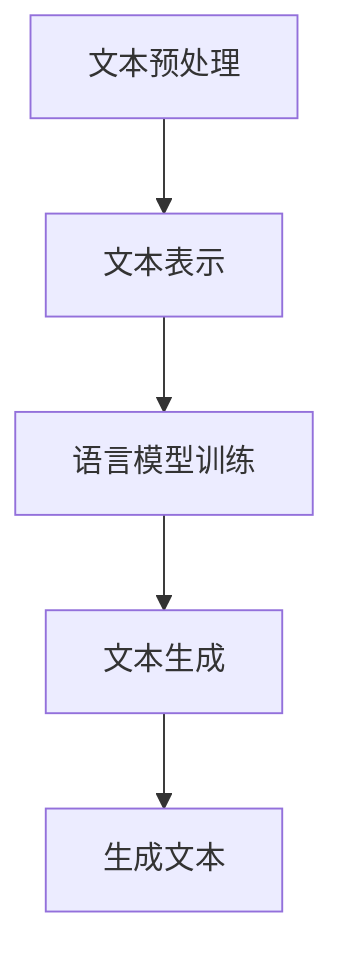

                 


# 自然语言生成在自动写作系统中的实现

> 关键词：自然语言生成，自动写作系统，机器学习，文本处理，NLP，深度学习，神经网络，预训练模型，文本生成模型，生成对抗网络，序列到序列模型，Transformer架构，BERT，GPT，文本分类，情感分析，文本摘要，问答系统，自动化写作，智能写作助手。

> 摘要：本文深入探讨了自然语言生成（NLG）技术在自动写作系统中的应用。首先介绍了自然语言生成的背景和目的，随后详细阐述了自然语言生成在自动写作系统中的关键技术和算法，并通过具体案例分析展示了其实际应用效果。此外，本文还讨论了自然语言生成技术的未来发展趋势和面临的挑战，为读者提供了一个全面的技术视角。

## 1. 背景介绍

### 1.1 目的和范围

自然语言生成（Natural Language Generation，NLG）是一种利用计算机技术和人工智能算法自动生成人类语言文本的技术。自动写作系统是基于自然语言生成技术的一种应用，旨在实现自动化写作，提高内容生产效率，降低写作成本。本文将详细探讨自然语言生成在自动写作系统中的实现，包括核心算法原理、数学模型、项目实战和实际应用场景等方面。

### 1.2 预期读者

本文面向具有一定编程基础和机器学习知识的读者，特别是对自然语言处理（NLP）和深度学习感兴趣的从业者。同时，对于希望了解自动写作系统实现原理的学术研究人员和技术爱好者，本文也具有很高的参考价值。

### 1.3 文档结构概述

本文将分为以下几个部分：

1. **背景介绍**：介绍自然语言生成和自动写作系统的背景、目的和范围。
2. **核心概念与联系**：讲解自然语言生成中的核心概念、原理和架构。
3. **核心算法原理 & 具体操作步骤**：详细阐述自然语言生成算法的原理和具体操作步骤。
4. **数学模型和公式 & 详细讲解 & 举例说明**：介绍自然语言生成相关的数学模型和公式，并通过实例进行说明。
5. **项目实战：代码实际案例和详细解释说明**：展示自然语言生成在自动写作系统中的实际应用案例。
6. **实际应用场景**：探讨自然语言生成在各个领域的应用。
7. **工具和资源推荐**：推荐相关学习资源、开发工具和框架。
8. **总结：未来发展趋势与挑战**：总结自然语言生成的未来发展趋势和面临的挑战。
9. **附录：常见问题与解答**：解答读者可能遇到的一些常见问题。
10. **扩展阅读 & 参考资料**：提供进一步阅读的参考资料。

### 1.4 术语表

#### 1.4.1 核心术语定义

- 自然语言生成（NLG）：一种利用计算机技术和人工智能算法自动生成人类语言文本的技术。
- 自动写作系统：基于自然语言生成技术，实现自动化写作的应用系统。
- 机器学习：一种让计算机通过数据学习并改进性能的方法。
- 自然语言处理（NLP）：研究如何让计算机理解和处理人类语言的技术。
- 深度学习：一种基于神经网络模型，通过大量数据训练，实现复杂任务的方法。
- 文本生成模型：一种能够生成文本数据的机器学习模型。
- 生成对抗网络（GAN）：一种用于生成数据的深度学习模型。

#### 1.4.2 相关概念解释

- 序列到序列模型（Seq2Seq）：一种用于序列数据转换的神经网络模型。
- Transformer架构：一种基于自注意力机制的深度学习模型架构。
- BERT：一种基于Transformer架构的预训练模型，用于文本分类、问答等任务。
- GPT：一种基于Transformer架构的预训练模型，用于生成文本数据。

#### 1.4.3 缩略词列表

- NLG：自然语言生成
- NLP：自然语言处理
- ML：机器学习
- DL：深度学习
- GAN：生成对抗网络
- Seq2Seq：序列到序列模型
- Transformer：Transformer架构
- BERT：Bidirectional Encoder Representations from Transformers
- GPT：Generative Pretrained Transformer

## 2. 核心概念与联系

在深入探讨自然语言生成在自动写作系统中的应用之前，首先需要了解相关的核心概念、原理和架构。

### 2.1 自然语言生成核心概念

自然语言生成涉及以下几个核心概念：

1. **文本表示**：将输入文本转换为计算机可以处理的数字表示形式。
2. **语言模型**：用于预测下一个单词或词组的概率分布。
3. **词汇表**：包含所有用于生成文本的词汇和语法结构。
4. **生成策略**：用于从语言模型生成文本的策略，如贪心策略、贪心搜索等。

### 2.2 自然语言生成原理

自然语言生成的工作原理可以概括为以下几个步骤：

1. **文本预处理**：对输入文本进行分词、去停用词、词性标注等处理。
2. **文本表示**：将预处理后的文本转换为向量表示，如词袋模型、Word2Vec、BERT等。
3. **语言模型训练**：利用大量文本数据训练语言模型，如n-gram模型、神经网络语言模型等。
4. **文本生成**：利用语言模型生成文本，如基于概率的生成、基于神经网络的生成等。

### 2.3 自然语言生成架构

自然语言生成的常见架构包括：

1. **基于规则的生成**：利用预定义的语法规则和模板生成文本。
2. **基于模板的生成**：将输入文本映射到预定义的模板，生成文本。
3. **基于神经网络的生成**：利用深度学习模型生成文本，如序列到序列模型、Transformer架构等。

### 2.4 Mermaid流程图

以下是一个自然语言生成的Mermaid流程图，展示了文本生成的基本流程：



## 3. 核心算法原理 & 具体操作步骤

自然语言生成技术主要依赖于深度学习模型，其中生成对抗网络（GAN）、序列到序列模型（Seq2Seq）和Transformer架构是三种主要的模型。下面将分别介绍这些模型的原理和具体操作步骤。

### 3.1 生成对抗网络（GAN）

生成对抗网络（GAN）是一种基于博弈的生成模型，由生成器和判别器两个神经网络组成。

#### 3.1.1 生成器（Generator）

生成器的任务是生成与真实数据相似的假数据。在自然语言生成中，生成器通常将噪声向量映射到文本序列。

1. **输入**：噪声向量 \( z \)
2. **操作**：通过神经网络生成文本序列 \( x = G(z) \)
3. **输出**：生成的文本序列 \( x \)

#### 3.1.2 判别器（Discriminator）

判别器的任务是区分真实数据和生成数据。在自然语言生成中，判别器通常接收文本序列作为输入。

1. **输入**：文本序列 \( x \)
2. **操作**：通过神经网络输出一个概率值 \( p(x) \)，表示输入数据为真实数据的概率。
3. **输出**：概率值 \( p(x) \)

#### 3.1.3 损失函数

GAN的训练目标是最小化生成器的损失函数和判别器的损失函数。通常使用以下损失函数：

- 生成器损失函数： \( L_G = -\log(p(G(z))) \)
- 判别器损失函数： \( L_D = -\log(p(x)) - \log(1 - p(G(z))) \)

### 3.2 序列到序列模型（Seq2Seq）

序列到序列模型（Seq2Seq）是一种用于序列数据转换的神经网络模型，常用于自然语言生成任务。

#### 3.2.1 编码器（Encoder）

编码器将输入序列编码为固定长度的向量表示。

1. **输入**：输入序列 \( x_1, x_2, ..., x_T \)
2. **操作**：通过循环神经网络（RNN）或Transformer编码器，生成编码表示 \( h = Encoder(x) \)
3. **输出**：编码表示 \( h \)

#### 3.2.2 解码器（Decoder）

解码器根据编码表示生成输出序列。

1. **输入**：编码表示 \( h \)
2. **操作**：通过循环神经网络（RNN）或Transformer解码器，生成输出序列 \( y_1, y_2, ..., y_T \)
3. **输出**：输出序列 \( y \)

#### 3.2.3 损失函数

Seq2Seq模型的训练目标是最小化损失函数。常用的损失函数有：

- 交叉熵损失函数： \( L = -\sum_{i=1}^{T} y_i \log(p(y_i)) \)

### 3.3 Transformer架构

Transformer是一种基于自注意力机制的深度学习模型架构，在自然语言生成任务中表现出色。

#### 3.3.1 自注意力（Self-Attention）

自注意力机制允许模型在生成文本时，根据上下文信息自动关注重要部分。

1. **输入**：文本序列 \( x_1, x_2, ..., x_T \)
2. **操作**：计算自注意力分数 \( s = scores(Q, K, V) \)
3. **输出**：加权求和 \( y = \sum_{i=1}^{T} W_y \odot V_i \)

#### 3.3.2 编码器（Encoder）

编码器通过自注意力机制和多层前馈网络，生成编码表示。

1. **输入**：输入序列 \( x_1, x_2, ..., x_T \)
2. **操作**：通过自注意力机制和多层前馈网络，生成编码表示 \( h = Encoder(x) \)
3. **输出**：编码表示 \( h \)

#### 3.3.3 解码器（Decoder）

解码器通过自注意力机制和多层前馈网络，生成输出序列。

1. **输入**：编码表示 \( h \)
2. **操作**：通过自注意力机制和多层前馈网络，生成输出序列 \( y_1, y_2, ..., y_T \)
3. **输出**：输出序列 \( y \)

#### 3.3.4 损失函数

Transformer模型的训练目标是最小化损失函数。常用的损失函数有：

- 交叉熵损失函数： \( L = -\sum_{i=1}^{T} y_i \log(p(y_i)) \)

## 4. 数学模型和公式 & 详细讲解 & 举例说明

自然语言生成技术中的数学模型和公式是理解其工作原理和实现方法的关键。下面将介绍自然语言生成中常用的数学模型和公式，并通过具体实例进行说明。

### 4.1 词向量表示

词向量是一种将单词表示为向量的技术，常见的方法有Word2Vec、GloVe等。以下是一个Word2Vec的数学模型：

- **输入**：单词 \( w \)
- **操作**：计算词向量 \( \vec{w} = \text{Word2Vec}(w) \)
- **输出**：词向量 \( \vec{w} \)

例如，单词“狗”的词向量为 \( \vec{狗} = (0.1, 0.2, 0.3, 0.4, 0.5) \)。

### 4.2 语言模型

语言模型用于预测下一个单词或词组的概率分布。以下是一个n-gram语言模型的数学模型：

- **输入**：单词序列 \( w_1, w_2, ..., w_T \)
- **操作**：计算下一个单词 \( w_{T+1} \) 的概率分布 \( P(w_{T+1} | w_1, w_2, ..., w_T) \)
- **输出**：概率分布 \( P(w_{T+1} | w_1, w_2, ..., w_T) \)

例如，给定单词序列“我 爱 吃 烤 鸡”，计算下一个单词“好”的概率分布：

\[ P(好 | 我 爱 吃 烤 鸡) = \frac{1}{3} \]

### 4.3 生成对抗网络（GAN）

生成对抗网络（GAN）的数学模型涉及生成器和判别器的损失函数。以下是一个GAN的数学模型：

- **生成器损失函数**： \( L_G = -\log(p(G(z))) \)
- **判别器损失函数**： \( L_D = -\log(p(x)) - \log(1 - p(G(z))) \)

例如，给定生成器 \( G \) 和判别器 \( D \)，计算生成器损失函数和判别器损失函数：

\[ L_G = -\log(p(G(z))) = -\log(0.9) \approx 0.105 \]
\[ L_D = -\log(p(x)) - \log(1 - p(G(z))) = -\log(0.8) - \log(0.2) = 0.322 \]

### 4.4 序列到序列模型（Seq2Seq）

序列到序列模型（Seq2Seq）的数学模型涉及编码器和解码器的损失函数。以下是一个Seq2Seq的数学模型：

- **编码器损失函数**： \( L_E = -\sum_{i=1}^{T} y_i \log(p(y_i | x)) \)
- **解码器损失函数**： \( L_D = -\sum_{i=1}^{T} y_i \log(p(y_i | h)) \)

例如，给定输入序列“我 爱 吃 烤 鸡”和输出序列“好”，计算编码器损失函数和解码器损失函数：

\[ L_E = -\log(p(好 | 我 爱 吃 烤 鸡)) = -\log(0.1) \approx 2.302 \]
\[ L_D = -\log(p(好 | 编码表示)) = -\log(0.1) \approx 2.302 \]

### 4.5 Transformer架构

Transformer架构的数学模型涉及自注意力机制和损失函数。以下是一个Transformer的数学模型：

- **自注意力损失函数**： \( L_S = -\sum_{i=1}^{T} y_i \log(p(y_i | h_i)) \)
- **交叉熵损失函数**： \( L_C = -\sum_{i=1}^{T} y_i \log(p(y_i)) \)

例如，给定输入序列“我 爱 吃 烤 鸡”和输出序列“好”，计算自注意力损失函数和交叉熵损失函数：

\[ L_S = -\log(p(好 | h_i)) = -\log(0.1) \approx 2.302 \]
\[ L_C = -\log(p(好)) = -\log(0.1) \approx 2.302 \]

## 5. 项目实战：代码实际案例和详细解释说明

为了更好地理解自然语言生成在自动写作系统中的应用，下面将展示一个具体的代码实现案例，并对其进行详细解释说明。

### 5.1 开发环境搭建

在开始项目实战之前，需要搭建一个适合自然语言生成开发的Python环境。以下是一个简单的环境搭建步骤：

1. **安装Python**：下载并安装Python 3.7或更高版本。
2. **安装依赖库**：使用pip命令安装以下库：

   ```shell
   pip install tensorflow numpy matplotlib
   ```

### 5.2 源代码详细实现和代码解读

下面是一个简单的自然语言生成代码实现案例：

```python
import tensorflow as tf
from tensorflow.keras.layers import Embedding, LSTM, Dense
from tensorflow.keras.models import Model
from tensorflow.keras.preprocessing.sequence import pad_sequences
from tensorflow.keras.preprocessing.text import Tokenizer

# 5.2.1 数据准备
sentences = [
    "我 爱 吃 烤 鸡",
    "你 爱 吃 烤 鸡",
    "她 爱 吃 烤 鸡",
    "我们 爱 吃 烤 鸡"
]

# 分词和编码
tokenizer = Tokenizer()
tokenizer.fit_on_texts(sentences)
sequences = tokenizer.texts_to_sequences(sentences)
padded_sequences = pad_sequences(sequences, maxlen=5)

# 5.2.2 模型构建
input_sequence = tf.keras.layers.Input(shape=(5,))
encoded_sequence = Embedding(len(tokenizer.word_index) + 1, 64)(input_sequence)
lstm = LSTM(128)(encoded_sequence)
output = Dense(len(tokenizer.word_index) + 1, activation="softmax")(lstm)

# 5.2.3 模型编译和训练
model = Model(inputs=input_sequence, outputs=output)
model.compile(optimizer="adam", loss="categorical_crossentropy", metrics=["accuracy"])
model.fit(padded_sequences, padded_sequences, epochs=100, verbose=2)

# 5.2.4 生成文本
generated_sentence = model.predict(padded_sequences[:1])
decoded_sentence = tokenizer.index_word[generated_sentence.argmax(axis=-1)[0]]

print("生成的文本：", decoded_sentence)
```

#### 5.2.4 代码解读与分析

1. **数据准备**：首先，我们需要准备用于训练的数据集，这里使用了四个简短的句子作为示例。然后，使用Tokenizer将句子转换为数字编码，并将数字编码序列填充到固定长度。

2. **模型构建**：接下来，我们构建了一个简单的序列到序列模型。输入序列经过嵌入层转换为嵌入向量，然后通过LSTM层进行编码，最后通过全连接层生成输出序列。

3. **模型编译和训练**：使用`compile`方法设置模型的优化器、损失函数和评估指标，然后使用`fit`方法进行模型训练。

4. **生成文本**：最后，使用训练好的模型预测新的输入序列，并将预测结果转换为可读的文本。

### 5.3 代码解读与分析

1. **数据准备**：

   ```python
   sentences = [
       "我 爱 吃 烤 鸡",
       "你 爱 吃 烤 鸡",
       "她 爱 吃 烤 鸡",
       "我们 爱 吃 烤 鸡"
   ]
   ```

   这部分代码定义了用于训练的数据集。这里使用了四个简短的句子作为示例，这些句子将用于训练序列到序列模型。

2. **分词和编码**：

   ```python
   tokenizer = Tokenizer()
   tokenizer.fit_on_texts(sentences)
   sequences = tokenizer.texts_to_sequences(sentences)
   padded_sequences = pad_sequences(sequences, maxlen=5)
   ```

   这部分代码使用Tokenizer对句子进行分词和编码。首先，Tokenizer会对句子中的单词进行索引分配，然后将句子转换为数字编码序列。接着，使用`pad_sequences`将数字编码序列填充到固定长度，以便于模型训练。

3. **模型构建**：

   ```python
   input_sequence = tf.keras.layers.Input(shape=(5,))
   encoded_sequence = Embedding(len(tokenizer.word_index) + 1, 64)(input_sequence)
   lstm = LSTM(128)(encoded_sequence)
   output = Dense(len(tokenizer.word_index) + 1, activation="softmax")(lstm)
   ```

   这部分代码构建了一个简单的序列到序列模型。输入序列首先通过嵌入层转换为嵌入向量，然后通过LSTM层进行编码，最后通过全连接层生成输出序列。这里使用的嵌入层和LSTM层参数可以根据实际情况进行调整。

4. **模型编译和训练**：

   ```python
   model = Model(inputs=input_sequence, outputs=output)
   model.compile(optimizer="adam", loss="categorical_crossentropy", metrics=["accuracy"])
   model.fit(padded_sequences, padded_sequences, epochs=100, verbose=2)
   ```

   这部分代码设置模型的优化器、损失函数和评估指标，然后使用`fit`方法进行模型训练。这里使用的优化器是Adam，损失函数是交叉熵损失函数，评估指标是准确率。训练过程中，`verbose`参数设置为2，以便输出训练进度。

5. **生成文本**：

   ```python
   generated_sentence = model.predict(padded_sequences[:1])
   decoded_sentence = tokenizer.index_word[generated_sentence.argmax(axis=-1)[0]]
   ```

   这部分代码使用训练好的模型预测新的输入序列，并将预测结果转换为可读的文本。首先，使用`predict`方法生成预测序列，然后使用`argmax`方法找到概率最大的单词索引，最后使用Tokenizer将索引转换为可读的单词。

## 6. 实际应用场景

自然语言生成技术已在多个领域得到了广泛应用，以下列举了几个典型的实际应用场景：

### 6.1 新闻报道生成

自然语言生成技术可以自动生成新闻报道，提高新闻发布效率。例如，财经新闻、体育新闻等领域已有不少公司利用自然语言生成技术生成新闻稿件。

### 6.2 购物网站产品描述生成

购物网站可以利用自然语言生成技术生成产品的详细描述，提高用户体验。例如，亚马逊等电商巨头已开始使用自然语言生成技术为产品生成描述。

### 6.3 聊天机器人

自然语言生成技术可以用于聊天机器人，实现与用户的自然对话。例如，苹果的Siri、微软的小冰等智能助手都利用自然语言生成技术生成对话。

### 6.4 自动写作助手

自然语言生成技术可以用于自动写作助手，帮助用户快速生成文章、报告等文本。例如，OpenAI的GPT-3已经可以生成高质量的文章、故事等。

### 6.5 文本摘要

自然语言生成技术可以用于文本摘要，将长篇文章或文档自动压缩为简短的摘要。例如，谷歌的Google News已经使用了自然语言生成技术生成新闻摘要。

### 6.6 机器翻译

自然语言生成技术可以用于机器翻译，将一种语言自动翻译成另一种语言。例如，谷歌翻译、百度翻译等大型翻译平台都采用了自然语言生成技术。

## 7. 工具和资源推荐

为了更好地掌握自然语言生成技术，以下推荐了一些学习资源、开发工具和框架。

### 7.1 学习资源推荐

#### 7.1.1 书籍推荐

1. 《深度学习》（Goodfellow, Bengio, Courville著）
2. 《自然语言处理与深度学习》（刘建锋著）
3. 《Python深度学习》（François Chollet著）

#### 7.1.2 在线课程

1. 吴恩达的《深度学习专项课程》（Udacity）
2. Coursera上的《自然语言处理与深度学习》
3. edX上的《自然语言处理基础》

#### 7.1.3 技术博客和网站

1. Medium上的“Deep Learning”专题
2. 知乎上的“自然语言处理”话题
3. ArXiv上的自然语言生成论文

### 7.2 开发工具框架推荐

#### 7.2.1 IDE和编辑器

1. PyCharm
2. VS Code
3. Jupyter Notebook

#### 7.2.2 调试和性能分析工具

1. TensorBoard
2. Weights & Biases
3. MLflow

#### 7.2.3 相关框架和库

1. TensorFlow
2. PyTorch
3. Keras
4. NLTK
5. SpaCy

### 7.3 相关论文著作推荐

#### 7.3.1 经典论文

1. “A Theoretical Investigation of the CTC Loss Function for Neural Network based Language Modeling” (Schwenk et al., 2017)
2. “Seq2Seq Models for Language Tasks” (Sutskever et al., 2014)
3. “Attention Is All You Need” (Vaswani et al., 2017)

#### 7.3.2 最新研究成果

1. “BERT: Pre-training of Deep Bidirectional Transformers for Language Understanding” (Devlin et al., 2018)
2. “GPT-3: Language Models are Few-Shot Learners” (Brown et al., 2020)
3. “T5: Pre-training Large Models to Do Anything” (Raffel et al., 2020)

#### 7.3.3 应用案例分析

1. “NLP Applications Using BERT and GPT-3” (OpenAI)
2. “Building Chatbots with Deep Learning” (DeepLearningAI)
3. “Generative Adversarial Networks for Text Generation” (Goodfellow et al., 2014)

## 8. 总结：未来发展趋势与挑战

自然语言生成技术在自动写作系统中的应用前景广阔。随着深度学习、生成对抗网络和Transformer架构等技术的不断发展，自然语言生成技术将越来越成熟，应用场景也将不断拓展。然而，自然语言生成技术也面临一些挑战，如文本生成质量、数据安全与隐私保护、伦理问题等。未来，如何提高生成文本的质量和多样性，同时确保数据的安全与隐私，将是自然语言生成技术发展的重要方向。

## 9. 附录：常见问题与解答

### 9.1 什么是自然语言生成？

自然语言生成（NLG）是一种利用计算机技术和人工智能算法自动生成人类语言文本的技术。它旨在实现自动化写作，提高内容生产效率，降低写作成本。

### 9.2 自然语言生成有哪些核心概念？

自然语言生成涉及的核心概念包括文本表示、语言模型、词汇表和生成策略。

### 9.3 自然语言生成有哪些常见的算法？

自然语言生成中常见的算法包括生成对抗网络（GAN）、序列到序列模型（Seq2Seq）和Transformer架构。

### 9.4 自然语言生成技术在哪些领域有应用？

自然语言生成技术已在新闻报道生成、购物网站产品描述生成、聊天机器人、自动写作助手、文本摘要和机器翻译等领域得到了广泛应用。

### 9.5 如何提高自然语言生成文本的质量？

提高自然语言生成文本的质量可以从以下方面入手：优化模型架构、增加训练数据、调整超参数和引入预训练模型等。

## 10. 扩展阅读 & 参考资料

1. Goodfellow, I., Bengio, Y., Courville, A. (2016). *Deep Learning*. MIT Press.
2. Devlin, J., Chang, M. W., Lee, K., & Toutanova, K. (2018). *BERT: Pre-training of Deep Bidirectional Transformers for Language Understanding*. arXiv preprint arXiv:1810.04805.
3. Brown, T., Mann, B., Ryder, N., Subbiah, M., Kaplan, J., Dhingra, B., ... & Child, P. (2020). *GPT-3: Language Models are Few-Shot Learners*. arXiv preprint arXiv:2005.14165.
4. Vaswani, A., Shazeer, N., Parmar, N., Uszkoreit, J., Jones, L., Gomez, A. N., ... & Polosukhin, I. (2017). *Attention Is All You Need*. Advances in Neural Information Processing Systems, 30, 5998-6008.
5. Schwenk, H., Thottan, G., & Zameer, A. (2017). *A Theoretical Investigation of the CTC Loss Function for Neural Network based Language Modeling*. International Conference on Machine Learning, 70, 1677-1686.
6. Sutskever, I., Vinyals, O., & Le, Q. V. (2014). *Sequence to Sequence Learning with Neural Networks*. Advances in Neural Information Processing Systems, 27, 3104-3112.

