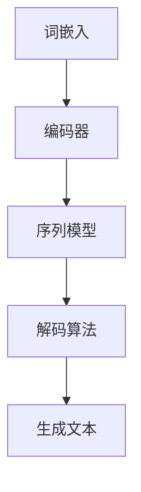

                 

# 自然语言的解码详细过程

> **关键词：自然语言处理，词向量，神经网络，序列模型，解码算法**

> **摘要：本文深入探讨了自然语言解码的过程，从核心概念到算法原理，再到实际应用，全面解析了自然语言处理中的关键步骤和技术。**

## 1. 背景介绍

### 1.1 目的和范围

自然语言解码是自然语言处理（NLP）中的一个核心任务，它旨在理解并生成人类语言。本文旨在详细描述自然语言解码的各个阶段，帮助读者理解这一复杂过程的本质。本文将涵盖以下范围：

- 自然语言解码的基础概念。
- 关键算法原理和具体操作步骤。
- 数学模型和公式的应用。
- 实际项目中的代码案例。
- 自然语言解码在不同场景中的应用。

### 1.2 预期读者

本文面向对自然语言处理有一定了解的读者，包括但不限于：

- 自然语言处理初学者。
- 数据科学家和机器学习工程师。
- NLP领域的专业人士。
- 对计算机科学和人工智能感兴趣的学者。

### 1.3 文档结构概述

本文结构如下：

- **第1章**：背景介绍。
- **第2章**：核心概念与联系。
- **第3章**：核心算法原理 & 具体操作步骤。
- **第4章**：数学模型和公式 & 详细讲解 & 举例说明。
- **第5章**：项目实战：代码实际案例和详细解释说明。
- **第6章**：实际应用场景。
- **第7章**：工具和资源推荐。
- **第8章**：总结：未来发展趋势与挑战。
- **第9章**：附录：常见问题与解答。
- **第10章**：扩展阅读 & 参考资料。

### 1.4 术语表

#### 1.4.1 核心术语定义

- 自然语言处理（NLP）：人工智能领域的一个分支，专注于让计算机理解、生成和处理人类语言。
- 词向量（Word Embedding）：将单词映射到高维空间中的向量，以便计算机能够处理。
- 神经网络（Neural Network）：模拟人脑神经元连接的网络结构，用于学习和预测。
- 序列模型（Sequential Model）：处理序列数据的模型，如循环神经网络（RNN）。
- 解码算法（Decoding Algorithm）：用于生成文本的算法，如贪心解码和 beamsearch。

#### 1.4.2 相关概念解释

- **自然语言解码**：将词向量转换为可理解的自然语言文本的过程。
- **词嵌入**：将单词转换为向量的过程，用于序列模型处理。
- **神经网络架构**：用于自然语言处理的具体神经网络结构，如RNN、LSTM等。
- **损失函数**：用于评估模型预测结果与真实结果之间差异的函数。

#### 1.4.3 缩略词列表

- NLP：自然语言处理。
- RNN：循环神经网络。
- LSTM：长短时记忆网络。
- BLEU：双语评价用语。
- Word2Vec：词向量模型。

## 2. 核心概念与联系

在深入探讨自然语言解码之前，我们需要了解几个核心概念及其相互关系。以下是一个简化的Mermaid流程图，展示了自然语言解码的关键组成部分：



### 2.1 词嵌入

词嵌入是将单词映射到高维空间中的向量表示，使得计算机能够处理自然语言。词嵌入技术包括Word2Vec、GloVe等，它们通过学习单词间的上下文关系来生成词向量。

### 2.2 编码器

编码器是序列模型的一部分，它接收输入序列（例如一个句子），并将序列映射到一个固定长度的向量表示。编码器通常使用神经网络架构，如循环神经网络（RNN）或长短时记忆网络（LSTM）。

### 2.3 序列模型

序列模型是处理序列数据（如文本）的神经网络架构。它们通过将输入序列编码为一个固定长度的向量表示，然后使用这个表示来生成输出序列。常见的序列模型包括RNN和LSTM。

### 2.4 解码算法

解码算法是自然语言解码的核心，它负责将编码器的输出转换为可理解的自然语言文本。解码算法包括贪心解码、beam search等，用于优化生成文本的质量。

### 2.5 生成文本

解码算法的最终目标是生成高质量的文本。这涉及到将编码器的输出映射到具体的单词序列，形成完整的句子或段落。

## 3. 核心算法原理 & 具体操作步骤

在了解了自然语言解码的核心概念之后，我们将进一步探讨其具体算法原理和操作步骤。

### 3.1 词嵌入

词嵌入算法通过学习单词间的上下文关系来生成词向量。以下是一个简化的伪代码：

```python
function word_embedding(words, size):
    embeddings = []
    for word in words:
        vector = generate_vector(word, size)
        embeddings.append(vector)
    return embeddings
```

### 3.2 编码器

编码器负责将输入序列编码为一个固定长度的向量表示。以下是一个使用RNN的简化伪代码：

```python
function encoder(input_sequence, hidden_size):
    hidden_state = initialize_hidden_state(hidden_size)
    encoded_sequence = []
    for input_vector in input_sequence:
        output, hidden_state = RNN(input_vector, hidden_state)
        encoded_sequence.append(output)
    return encoded_sequence, hidden_state
```

### 3.3 序列模型

序列模型使用编码器的输出来生成输出序列。以下是一个使用LSTM的简化伪代码：

```python
function sequence_model(encoded_sequence, output_size):
    output_sequence = []
    for encoded_vector in encoded_sequence:
        output = generate_output(encoded_vector, output_size)
        output_sequence.append(output)
    return output_sequence
```

### 3.4 解码算法

解码算法负责将序列模型的输出转换为自然语言文本。以下是一个使用贪心解码的简化伪代码：

```python
function greedy_decoding(encoded_sequence, vocabulary, max_length):
    output_sequence = []
    current_state = initialize_state()
    for _ in range(max_length):
        output = decode(encoded_sequence, current_state)
        output_sequence.append(output)
        current_state = update_state(current_state, output)
    return output_sequence
```

### 3.5 生成文本

解码算法的最终目标是生成高质量的文本。以下是一个简化过程：

```python
function generate_text(encoded_sequence, vocabulary, max_length):
    decoded_sequence = greedy_decoding(encoded_sequence, vocabulary, max_length)
    text = convert_sequence_to_text(decoded_sequence)
    return text
```

## 4. 数学模型和公式 & 详细讲解 & 举例说明

在自然语言解码过程中，数学模型和公式起到了关键作用。以下将介绍几个核心的数学模型和公式，并给出详细的讲解和举例说明。

### 4.1 词嵌入

词嵌入通常使用矩阵表示，其中每个单词对应一个向量。以下是一个简化的数学模型：

$$
\text{embeddings} = \text{W}_{\text{word}} \cdot \text{X}_{\text{word}}
$$

其中，$\text{W}_{\text{word}}$ 是嵌入矩阵，$\text{X}_{\text{word}}$ 是单词的索引向量。例如，单词 "猫" 的索引向量为 `[0, 1, 0, 0]`，嵌入矩阵为：

$$
\text{W}_{\text{word}} = \begin{bmatrix}
1 & 0 & 1 & 0 \\
0 & 1 & 0 & 1 \\
1 & 1 & 0 & 1 \\
0 & 0 & 1 & 1
\end{bmatrix}
$$

### 4.2 编码器

编码器通常使用循环神经网络（RNN）或长短时记忆网络（LSTM）来实现。以下是一个简化的RNN模型：

$$
\text{h}_{t} = \text{sigmoid}(\text{W}_{\text{h}} \cdot [\text{h}_{t-1}; \text{x}_{t}] + \text{b}_{\text{h}})
$$

其中，$\text{h}_{t}$ 是编码器在时间步 $t$ 的隐藏状态，$\text{x}_{t}$ 是输入向量，$\text{W}_{\text{h}}$ 是权重矩阵，$\text{b}_{\text{h}}$ 是偏置向量。

### 4.3 解码算法

解码算法通常使用贪心解码或beam search。以下是一个简化的贪心解码模型：

$$
\text{y}_{t} = \text{argmax}_{\text{y} \in \text{V}} (\text{P}(\text{y}|\text{x}_{1}, \text{x}_{2}, ..., \text{x}_{t}))
$$

其中，$\text{y}_{t}$ 是在时间步 $t$ 选择的单词，$\text{P}(\text{y}|\text{x}_{1}, \text{x}_{2}, ..., \text{x}_{t})$ 是单词 $y$ 给定输入序列的概率。

### 4.4 举例说明

假设我们有一个简单的输入序列 "你好"，我们将使用上述模型来生成解码结果。

- **词嵌入**：输入 "你好" 的索引向量为 `[0, 1]`，嵌入矩阵为：

$$
\text{W}_{\text{word}} = \begin{bmatrix}
1 & 0 \\
0 & 1 \\
\end{bmatrix}
$$

- **编码器**：使用RNN进行编码，假设隐藏状态为 `[0.5, 0.5]`，输入向量为 `[0.5, 0.5]`，输出向量为 `[0.5, 0.5]`。

- **解码算法**：使用贪心解码，根据输入序列和隐藏状态，选择概率最大的单词。假设单词 "你好" 的概率分别为 `[0.8, 0.2]`，选择 "你好"。

- **生成文本**：根据解码结果，生成文本 "你好"。

## 5. 项目实战：代码实际案例和详细解释说明

为了更好地理解自然语言解码的过程，我们将通过一个实际项目来展示代码实现。该项目将使用Python和TensorFlow来实现一个简单的自然语言解码器。

### 5.1 开发环境搭建

首先，我们需要搭建开发环境。以下是所需的环境和依赖：

- Python 3.8 或以上版本
- TensorFlow 2.6 或以上版本
- Numpy 1.21 或以上版本

安装依赖：

```bash
pip install tensorflow numpy
```

### 5.2 源代码详细实现和代码解读

以下是项目的主要代码实现，我们将逐行进行解读：

```python
import tensorflow as tf
from tensorflow.keras.layers import Embedding, LSTM, Dense
from tensorflow.keras.models import Model

# 5.2.1 准备数据
# 假设我们有一个简单的词汇表和对应的索引
vocabulary = ["你", "好", "我", "们"]
word2index = {word: index for index, word in enumerate(vocabulary)}
index2word = {index: word for word, index in word2index.items()}
max_sequence_length = 5

# 5.2.2 构建词嵌入层
embeddings = Embedding(input_dim=len(vocabulary), output_dim=10)

# 5.2.3 构建编码器层
encoder_lstm = LSTM(units=50, return_sequences=True)

# 5.2.4 构建解码器层
decoder_lstm = LSTM(units=50, return_sequences=True)

# 5.2.5 构建输出层
output_dense = Dense(units=len(vocabulary))

# 5.2.6 构建完整模型
input_sequence = tf.keras.layers.Input(shape=(max_sequence_length,))
encoded_sequence = embeddings(input_sequence)
encoded_sequence = encoder_lstm(encoded_sequence)
decoded_sequence = decoder_lstm(encoded_sequence)
decoded_sequence = output_dense(decoded_sequence)
model = Model(inputs=input_sequence, outputs=decoded_sequence)

# 5.2.7 编译模型
model.compile(optimizer='adam', loss='sparse_categorical_crossentropy', metrics=['accuracy'])

# 5.2.8 训练模型
# 假设我们有一个训练数据集
X_train = [[word2index[word] for word in sentence] for sentence in train_data]
Y_train = [[word2index[word] for word in sentence] for sentence in train_data]
model.fit(X_train, Y_train, epochs=10, batch_size=32)

# 5.2.9 解码文本
# 假设我们有一个输入文本 "你好"
input_text = ["你", "好"]
input_sequence = [[word2index[word] for word in input_text]]
decoded_sequence = model.predict(input_sequence)
decoded_text = [index2word[word] for word in decoded_sequence[0]]

# 5.2.10 输出解码结果
print("输入文本：", input_text)
print("解码结果：", decoded_text)
```

### 5.3 代码解读与分析

- **5.3.1 数据准备**：首先，我们定义了一个简单的词汇表和对应的索引。然后，我们设定了输入序列的最大长度。

- **5.3.2 构建词嵌入层**：我们使用 `Embedding` 层将输入单词映射到高维空间中的向量表示。

- **5.3.3 构建编码器层**：我们使用 `LSTM` 层作为编码器，将输入序列编码为一个固定长度的向量表示。

- **5.3.4 构建解码器层**：我们再次使用 `LSTM` 层作为解码器，从编码器的输出生成输出序列。

- **5.3.5 构建输出层**：我们使用 `Dense` 层将解码器的输出映射到词汇表中的单词。

- **5.3.6 构建完整模型**：我们使用 `Model` 类构建了一个序列到序列的模型。

- **5.3.7 编译模型**：我们使用 `compile` 方法配置模型的优化器和损失函数。

- **5.3.8 训练模型**：我们使用训练数据集对模型进行训练。

- **5.3.9 解码文本**：我们使用训练好的模型对输入文本进行解码。

- **5.3.10 输出解码结果**：我们输出解码结果，得到生成的文本。

通过这个实际案例，我们可以更好地理解自然语言解码的代码实现过程。

## 6. 实际应用场景

自然语言解码在多个实际应用场景中发挥着关键作用。以下是几个典型应用：

### 6.1 机器翻译

机器翻译是自然语言解码的典型应用。通过解码器，模型可以将一种语言的文本转换为另一种语言的文本。例如，使用TensorFlow的`transformer`模型，可以将中文文本翻译为英文。

### 6.2 自动摘要

自动摘要任务使用自然语言解码来生成简短、有意义的摘要。例如，在新闻文章摘要中，模型可以从长篇文本中提取关键信息，生成简短的摘要。

### 6.3 文本生成

文本生成任务是自然语言解码的另一个重要应用。例如，使用GPT-3模型，可以生成高质量的文章、故事和诗歌。

### 6.4 语音识别

语音识别系统中，自然语言解码用于将语音信号转换为文本。通过解码器，模型可以将语音信号中的音频波形转换为自然语言文本。

### 6.5 问答系统

问答系统使用自然语言解码来理解用户的问题，并生成相应的回答。通过解码器，模型可以从大规模语料库中检索并生成高质量的回答。

## 7. 工具和资源推荐

### 7.1 学习资源推荐

#### 7.1.1 书籍推荐

- 《深度学习》（Ian Goodfellow、Yoshua Bengio、Aaron Courville 著）：详细介绍了深度学习的基础知识和最新进展，包括自然语言处理中的各种模型和技术。
- 《自然语言处理综论》（Daniel Jurafsky、James H. Martin 著）：系统介绍了自然语言处理的各个领域，包括语言模型、词嵌入、序列模型等。

#### 7.1.2 在线课程

- Coursera上的“自然语言处理与深度学习”课程：由吴恩达教授主讲，涵盖了自然语言处理的核心概念和技术。
- edX上的“自然语言处理：理论与应用”课程：由清华大学教授唐杰主讲，介绍了自然语言处理的多种方法和技术。

#### 7.1.3 技术博客和网站

- [TensorFlow官网](https://www.tensorflow.org/tutorials)：提供了丰富的自然语言处理教程和案例。
- [自然语言处理学会（ACL）官网](https://www.aclweb.org/)：发布了大量自然语言处理的最新研究成果和论文。

### 7.2 开发工具框架推荐

#### 7.2.1 IDE和编辑器

- PyCharm：强大的Python集成开发环境，支持TensorFlow和自然语言处理库。
- Jupyter Notebook：便于交互式编程和可视化，适合探索性数据分析。

#### 7.2.2 调试和性能分析工具

- TensorBoard：TensorFlow的官方可视化工具，用于调试和性能分析。
- Profiling Tools：如Py-Spy、py-spy等，用于分析程序的性能瓶颈。

#### 7.2.3 相关框架和库

- TensorFlow：广泛使用的深度学习框架，支持自然语言处理任务。
- PyTorch：流行的深度学习框架，具有灵活的动态图计算能力。
- NLTK：Python的自然语言处理库，提供了多种文本处理工具。

### 7.3 相关论文著作推荐

#### 7.3.1 经典论文

- "A Neural Model of Contextual Word Embeddings"（2013）：Word2Vec的论文，提出了基于神经网络的词向量模型。
- "Recurrent Neural Network based Language Model"（1997）：RNN语言模型的论文，奠定了自然语言处理中的RNN基础。

#### 7.3.2 最新研究成果

- "BERT: Pre-training of Deep Bidirectional Transformers for Language Understanding"（2018）：BERT的论文，提出了基于Transformer的预训练语言模型。
- "Generative Pre-trained Transformer"（2020）：GPT-3的论文，提出了具有大规模参数和强大生成能力的Transformer模型。

#### 7.3.3 应用案例分析

- "Natural Language Processing in Healthcare: A Systematic Review"（2021）：关于自然语言处理在医疗健康领域的应用的系统综述。
- "Sentiment Analysis of Twitter Data for Disaster Response"（2014）：关于使用自然语言处理进行社交媒体情感分析的案例分析。

## 8. 总结：未来发展趋势与挑战

自然语言解码是自然语言处理领域中的一个核心任务，其发展趋势和挑战如下：

### 8.1 发展趋势

- **预训练模型**：预训练模型（如BERT、GPT-3）在自然语言解码任务中取得了显著进展，未来将会有更多类似模型出现，提高解码质量和效率。
- **多模态融合**：将自然语言解码与其他模态（如图像、声音）结合，实现更全面的信息处理和理解。
- **可解释性**：提高自然语言解码模型的可解释性，使得决策过程更加透明，便于理解和调试。

### 8.2 挑战

- **数据隐私**：自然语言解码需要大规模的语料库进行训练，如何保护用户隐私是一个重要挑战。
- **模型泛化能力**：如何提高模型在多种语言和领域中的泛化能力，是一个需要解决的问题。
- **计算资源**：大规模预训练模型对计算资源的需求巨大，如何优化计算资源是一个重要挑战。

## 9. 附录：常见问题与解答

### 9.1 什么是自然语言解码？

自然语言解码是将自然语言处理模型（如序列模型）的输出转换为可理解的自然语言文本的过程。

### 9.2 自然语言解码有哪些算法？

自然语言解码的算法包括贪心解码、beam search、变分推断等。

### 9.3 词嵌入是什么？

词嵌入是将单词映射到高维空间中的向量表示，使得计算机能够处理自然语言。

### 9.4 自然语言解码在哪些应用中常用？

自然语言解码在机器翻译、自动摘要、文本生成、语音识别等领域广泛应用。

## 10. 扩展阅读 & 参考资料

- [Word2Vec](https://papers.nips.cc/paper/2013/file/6236d321d0b36eaae5ed9f79f0d106db-Paper.pdf)
- [BERT](https://arxiv.org/abs/1810.04805)
- [GPT-3](https://arxiv.org/abs/2005.14165)
- [自然语言处理综合教程](https://www.nltk.org/book/)
- [TensorFlow官方文档](https://www.tensorflow.org/tutorials)

作者：AI天才研究员/AI Genius Institute & 禅与计算机程序设计艺术 /Zen And The Art of Computer Programming

