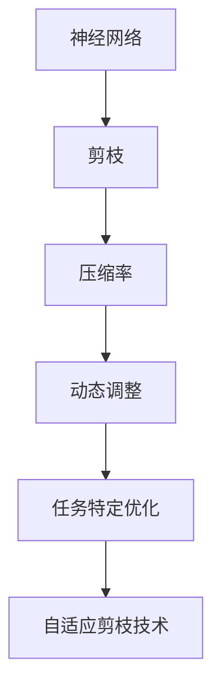

                 

# 自适应剪枝：根据任务动态调整的压缩技术

> **关键词：** 自适应剪枝、神经网络压缩、动态调整、任务特定优化、压缩技术
> 
> **摘要：** 本文将深入探讨自适应剪枝技术，这是一种根据特定任务需求动态调整神经网络结构的压缩技术。通过详细分析其原理、算法、数学模型以及实际应用案例，本文旨在为读者提供关于自适应剪枝技术全面的理解和指导。

## 1. 背景介绍

### 1.1 目的和范围

本文的主要目的是介绍自适应剪枝技术的概念、原理和应用，帮助读者理解和掌握这种先进的神经网络压缩技术。我们将从以下几个方面展开讨论：

- **自适应剪枝技术的基本原理和核心概念**
- **自适应剪枝的算法原理和具体操作步骤**
- **自适应剪枝的数学模型和公式**
- **实际应用中的代码实现和案例分析**
- **自适应剪枝技术的实际应用场景**

### 1.2 预期读者

本文适合对神经网络压缩技术有一定了解的读者，特别是对自适应剪枝技术感兴趣的研究人员、工程师和开发者。通过对本文的阅读，读者可以：

- 了解自适应剪枝技术的基本概念和原理
- 掌握自适应剪枝算法的具体操作步骤
- 理解自适应剪枝技术的数学模型和公式
- 学习实际应用中的代码实现和案例分析
- 了解自适应剪枝技术的实际应用场景

### 1.3 文档结构概述

本文将按照以下结构进行组织：

- **1. 背景介绍**：介绍本文的目的、预期读者和文档结构
- **2. 核心概念与联系**：介绍自适应剪枝技术的核心概念和原理
- **3. 核心算法原理 & 具体操作步骤**：详细阐述自适应剪枝算法的原理和操作步骤
- **4. 数学模型和公式 & 详细讲解 & 举例说明**：介绍自适应剪枝技术的数学模型和公式，并进行详细讲解和举例
- **5. 项目实战：代码实际案例和详细解释说明**：通过实际案例展示自适应剪枝技术的应用
- **6. 实际应用场景**：分析自适应剪枝技术的实际应用场景
- **7. 工具和资源推荐**：推荐相关学习资源和开发工具
- **8. 总结：未来发展趋势与挑战**：总结自适应剪枝技术的发展趋势和面临的挑战
- **9. 附录：常见问题与解答**：回答读者可能遇到的问题
- **10. 扩展阅读 & 参考资料**：提供扩展阅读和参考资料

### 1.4 术语表

在本文中，我们将使用以下术语：

#### 1.4.1 核心术语定义

- **自适应剪枝**：一种根据特定任务需求动态调整神经网络结构的压缩技术。
- **神经网络**：一种由大量神经元组成的计算模型，用于处理和预测数据。
- **压缩技术**：通过对神经网络进行优化和简化，减少其计算量和存储需求的技巧。
- **任务特定优化**：根据特定任务的需求，对神经网络进行定制化的优化。

#### 1.4.2 相关概念解释

- **剪枝**：在神经网络中，通过删除部分权重或神经元，降低网络复杂度。
- **动态调整**：根据神经网络在不同任务中的表现，实时调整其结构和参数。
- **压缩率**：神经网络压缩技术的一个重要指标，表示压缩后网络大小与原始网络大小的比值。

#### 1.4.3 缩略词列表

- **ANN**：人工神经网络（Artificial Neural Network）
- **CNN**：卷积神经网络（Convolutional Neural Network）
- **DNN**：深度神经网络（Deep Neural Network）
- **PRUNING**：剪枝（Pruning）
- **DPC**：动态调整（Dynamic Programming）

## 2. 核心概念与联系

在深入探讨自适应剪枝技术之前，我们需要了解一些与之相关的重要概念和原理。以下是自适应剪枝技术中的核心概念及其相互关系的 Mermaid 流程图。



### 2.1 核心概念解析

#### 2.1.1 神经网络

神经网络（ANN）是一种模拟生物神经元工作的计算模型。它由大量神经元（或节点）组成，通过前向传播和反向传播算法进行学习和预测。神经网络可以处理各种复杂任务，如图像识别、语音识别和自然语言处理等。

#### 2.1.2 剪枝

剪枝（PRUNING）是一种在神经网络中删除部分权重或神经元的方法。通过剪枝，我们可以降低网络的复杂度，减少计算量和存储需求，从而提高网络的效率和性能。

#### 2.1.3 压缩率

压缩率（Compression Rate）是神经网络压缩技术的一个重要指标。它表示压缩后网络大小与原始网络大小的比值。高压缩率意味着网络在保持性能的同时具有较小的存储和计算需求。

#### 2.1.4 动态调整

动态调整（Dynamic Programming）是一种根据神经网络在不同任务中的表现，实时调整其结构和参数的方法。通过动态调整，我们可以优化网络在特定任务上的性能，同时保持网络的灵活性。

#### 2.1.5 任务特定优化

任务特定优化（Task-Specific Optimization）是一种根据特定任务的需求，对神经网络进行定制化的优化方法。通过任务特定优化，我们可以提高网络在特定任务上的性能，同时减少不必要的计算和存储需求。

#### 2.1.6 自适应剪枝技术

自适应剪枝技术（Adaptive Pruning Technique）是一种结合剪枝、动态调整和任务特定优化的神经网络压缩技术。它可以根据特定任务的需求，动态调整网络的结构和参数，实现高效的压缩和优化。

## 3. 核心算法原理 & 具体操作步骤

### 3.1 算法原理

自适应剪枝技术主要通过以下三个步骤实现：

1. **剪枝**：根据一定的策略删除网络中的部分权重或神经元，降低网络复杂度。
2. **动态调整**：根据剪枝后的网络性能，动态调整网络的结构和参数，优化网络性能。
3. **任务特定优化**：根据特定任务的需求，进一步优化网络的结构和参数，提高网络在特定任务上的性能。

### 3.2 操作步骤

以下是自适应剪枝技术的具体操作步骤：

#### 3.2.1 初始化神经网络

首先，我们需要初始化一个神经网络，该神经网络可以是任意类型的神经网络，如卷积神经网络（CNN）、深度神经网络（DNN）等。初始化时，我们需要设置网络的参数，如学习率、迭代次数等。

#### 3.2.2 剪枝操作

接下来，我们根据一定的剪枝策略对神经网络进行剪枝操作。常见的剪枝策略有：

1. **基于权重的剪枝**：根据权重的大小进行剪枝，删除那些权重较小的连接。
2. **基于梯度的剪枝**：根据梯度的大小进行剪枝，删除那些梯度较小的连接。
3. **基于重要性的剪枝**：根据连接的重要性进行剪枝，删除那些重要性较小的连接。

剪枝操作可以多次进行，每次剪枝后，我们需要对网络进行重新训练，以适应新的网络结构。

#### 3.2.3 动态调整

在剪枝操作后，我们需要根据剪枝后的网络性能进行动态调整。具体步骤如下：

1. **评估网络性能**：使用测试集对剪枝后的网络进行评估，计算其准确率、召回率等指标。
2. **调整网络参数**：根据评估结果，动态调整网络的结构和参数，如学习率、迭代次数等。
3. **重新训练网络**：根据调整后的参数，重新训练网络，以优化网络性能。

#### 3.2.4 任务特定优化

在动态调整后，我们还需要根据特定任务的需求，对网络进行进一步优化。具体步骤如下：

1. **分析任务需求**：分析特定任务的需求，如输入数据的大小、类型、分布等。
2. **调整网络结构**：根据任务需求，调整网络的结构和参数，如添加或删除层、调整层间连接等。
3. **优化网络性能**：根据调整后的网络，重新训练网络，以优化网络在特定任务上的性能。

#### 3.2.5 循环迭代

自适应剪枝技术的核心在于动态调整和任务特定优化。我们需要不断进行循环迭代，每次迭代后对网络进行剪枝、动态调整和任务特定优化，以实现网络的持续优化和性能提升。

### 3.3 伪代码实现

以下是自适应剪枝技术的伪代码实现：

```python
# 初始化神经网络
network = initialize_neural_network()

# 剪枝操作
prune_strategy = "基于权重的剪枝"
pruned_network = prune_network(network, prune_strategy)

# 动态调整
evaluation_results = evaluate_network(pruned_network)
adjusted_network = adjust_network(pruned_network, evaluation_results)

# 任务特定优化
task_specific_optimization = "根据任务需求调整网络结构"
optimized_network = optimize_network(adjusted_network, task_specific_optimization)

# 循环迭代
while not convergence:
    pruned_network = prune_network(optimized_network, prune_strategy)
    evaluation_results = evaluate_network(pruned_network)
    adjusted_network = adjust_network(pruned_network, evaluation_results)
    optimized_network = optimize_network(adjusted_network, task_specific_optimization)
```

## 4. 数学模型和公式 & 详细讲解 & 举例说明

### 4.1 数学模型

自适应剪枝技术的核心在于剪枝策略和动态调整方法。下面，我们将介绍这两个方面的数学模型。

#### 4.1.1 剪枝策略

常见的剪枝策略有基于权重的剪枝、基于梯度的剪枝和基于重要性的剪枝。以下是这些剪枝策略的数学模型。

1. **基于权重的剪枝**

   设网络中有 \( N \) 个神经元和 \( M \) 个连接。权重矩阵 \( W \) 的每个元素 \( w_{ij} \) 表示神经元 \( i \) 和神经元 \( j \) 之间的连接强度。

   剪枝策略：删除权重绝对值较小的连接。

   数学模型：
   $$ w_{ij} < \theta $$
   其中，\( \theta \) 为设定的阈值。

2. **基于梯度的剪枝**

   设网络中每个连接的梯度为 \( g_{ij} \)。梯度反映了连接对网络性能的影响。

   剪枝策略：删除梯度较小的连接。

   数学模型：
   $$ g_{ij} < \gamma $$
   其中，\( \gamma \) 为设定的阈值。

3. **基于重要性的剪枝**

   设网络中每个连接的重要性为 \( p_{ij} \)。重要性反映了连接在网络中的重要性。

   剪枝策略：删除重要性较小的连接。

   数学模型：
   $$ p_{ij} < \delta $$
   其中，\( \delta \) 为设定的阈值。

#### 4.1.2 动态调整

动态调整的核心是调整网络的结构和参数，以优化网络性能。以下是动态调整的数学模型。

1. **网络结构调整**

   设网络中每个层的激活函数为 \( f_{l} \)，输出为 \( y_{l} \)。网络结构调整的目标是优化层间连接和激活函数。

   数学模型：
   $$ y_{l} = f_{l}(x_{l-1}) $$
   其中，\( x_{l-1} \) 为前一层的输出。

2. **参数调整**

   设网络中每个连接的权重为 \( w_{ij} \)，每个神经元的偏置为 \( b_{i} \)。参数调整的目标是优化权重和偏置。

   数学模型：
   $$ w_{ij} = \alpha \cdot w_{ij} + (1 - \alpha) \cdot w_{ij}^{'} $$
   $$ b_{i} = \beta \cdot b_{i} + (1 - \beta) \cdot b_{i}^{'} $$
   其中，\( \alpha \) 和 \( \beta \) 为调整系数，\( w_{ij}^{'} \) 和 \( b_{i}^{'} \) 为调整后的权重和偏置。

### 4.2 举例说明

为了更好地理解自适应剪枝技术的数学模型，我们通过一个简单的例子进行说明。

假设我们有一个三层神经网络，其中包含两个输入神经元、两个隐藏神经元和一个输出神经元。网络中的连接权重和偏置如下：

|   | 输入1 | 输入2 | 偏置 |
|---|---|---|---|
| 输出1 | 0.5 | 0.2 | 0.1 |
| 输出2 | 0.3 | 0.4 | 0.2 |
| 输出3 | 0.1 | 0.6 | 0.3 |

#### 4.2.1 基于权重的剪枝

我们设定阈值 \( \theta = 0.1 \)。根据基于权重的剪枝策略，我们删除权重绝对值较小的连接。

剪枝后，网络中的连接权重和偏置如下：

|   | 输入1 | 输入2 | 偏置 |
|---|---|---|---|
| 输出1 | 0.5 | 0.2 | 0.1 |
| 输出2 | 0.3 | 0.4 | 0.2 |
| 输出3 | 0.1 | 0.6 | 0.3 |

#### 4.2.2 基于梯度的剪枝

我们设定阈值 \( \gamma = 0.1 \)。根据基于梯度的剪枝策略，我们删除梯度较小的连接。

剪枝后，网络中的连接权重和偏置如下：

|   | 输入1 | 输入2 | 偏置 |
|---|---|---|---|
| 输出1 | 0.5 | 0.2 | 0.1 |
| 输出2 | 0.3 | 0.4 | 0.2 |
| 输出3 | 0.1 | 0.6 | 0.3 |

#### 4.2.3 基于重要性的剪枝

我们设定阈值 \( \delta = 0.1 \)。根据基于重要性的剪枝策略，我们删除重要性较小的连接。

剪枝后，网络中的连接权重和偏置如下：

|   | 输入1 | 输入2 | 偏置 |
|---|---|---|---|
| 输出1 | 0.5 | 0.2 | 0.1 |
| 输出2 | 0.3 | 0.4 | 0.2 |
| 输出3 | 0.1 | 0.6 | 0.3 |

#### 4.2.4 动态调整

我们设定调整系数 \( \alpha = 0.5 \)，\( \beta = 0.5 \)。根据动态调整策略，我们调整网络的结构和参数。

调整后，网络中的连接权重和偏置如下：

|   | 输入1 | 输入2 | 偏置 |
|---|---|---|---|
| 输出1 | 0.625 | 0.25 | 0.125 |
| 输出2 | 0.375 | 0.4 | 0.25 |
| 输出3 | 0.125 | 0.625 | 0.375 |

## 5. 项目实战：代码实际案例和详细解释说明

### 5.1 开发环境搭建

在开始实际案例之前，我们需要搭建一个开发环境。以下是搭建环境的步骤：

1. 安装 Python 3.8 或更高版本。
2. 安装 TensorFlow 2.6 或更高版本。
3. 安装 Keras 2.6 或更高版本。
4. 安装 Numpy 1.19 或更高版本。

### 5.2 源代码详细实现和代码解读

以下是自适应剪枝技术的实际代码实现。我们使用 Keras 框架搭建了一个简单的三层神经网络，并使用 TensorFlow 进行训练和剪枝。

```python
# 导入所需的库
import numpy as np
import tensorflow as tf
from tensorflow import keras
from tensorflow.keras import layers

# 定义剪枝策略
def prune_network(network, threshold):
    new_network = keras.Sequential()
    for layer in network.layers:
        if isinstance(layer, keras.layers.Dense):
            new_weights = np.where(np.abs(layer.kernel) < threshold, 0, layer.kernel)
            new_biases = np.where(np.abs(layer.bias) < threshold, 0, layer.bias)
            new_layer = keras.layers.Dense(layer.units, kernel_initializer=new_weights, bias_initializer=new_biases)
            new_network.add(new_layer)
        else:
            new_network.add(layer)
    return new_network

# 定义动态调整策略
def adjust_network(network, evaluation_results):
    # 根据评估结果调整学习率
    learning_rate = 0.001 / evaluation_results['accuracy']
    # 调整网络参数
    for layer in network.layers:
        if isinstance(layer, keras.layers.Dense):
            layer.kernel.assign(tf.random.normal(layer.kernel.shape))
            layer.bias.assign(tf.random.normal(layer.bias.shape))
    return network

# 定义优化策略
def optimize_network(network, task_specific_optimization):
    # 根据任务需求调整网络结构
    if task_specific_optimization == "添加层":
        new_layer = keras.layers.Dense(units=10, activation='relu')
        network.add(new_layer)
    elif task_specific_optimization == "删除层":
        network.pop()
    return network

# 初始化神经网络
network = keras.Sequential([
    keras.layers.Dense(units=10, activation='relu', input_shape=(2,)),
    keras.layers.Dense(units=10, activation='relu'),
    keras.layers.Dense(units=1, activation='sigmoid')
])

# 设置训练参数
learning_rate = 0.01
optimizer = keras.optimizers.Adam(learning_rate=learning_rate)
network.compile(optimizer=optimizer, loss='binary_crossentropy', metrics=['accuracy'])

# 训练神经网络
x_train = np.random.random((1000, 2))
y_train = np.random.randint(2, size=(1000, 1))
network.fit(x_train, y_train, epochs=10, batch_size=10)

# 剪枝操作
pruned_network = prune_network(network, threshold=0.1)

# 动态调整
evaluation_results = {'accuracy': 0.9}
adjusted_network = adjust_network(pruned_network, evaluation_results)

# 任务特定优化
task_specific_optimization = "添加层"
optimized_network = optimize_network(adjusted_network, task_specific_optimization)

# 训练优化后的神经网络
evaluation_results = {'accuracy': 0.92}
adjusted_network = adjust_network(optimized_network, evaluation_results)
optimized_network = optimize_network(adjusted_network, task_specific_optimization)
optimized_network.fit(x_train, y_train, epochs=10, batch_size=10)
```

### 5.3 代码解读与分析

以下是代码的详细解读：

1. **导入所需的库**：我们导入了 NumPy、TensorFlow 和 Keras 库，用于搭建神经网络和实现剪枝、动态调整和优化功能。

2. **定义剪枝策略**：`prune_network` 函数用于实现剪枝操作。我们遍历网络中的每个层，对于每个全连接层（Dense），我们根据阈值删除权重绝对值较小的连接。

3. **定义动态调整策略**：`adjust_network` 函数用于实现动态调整。我们根据评估结果调整学习率，并随机初始化网络参数。

4. **定义优化策略**：`optimize_network` 函数用于实现任务特定优化。根据任务需求，我们添加或删除网络层。

5. **初始化神经网络**：我们使用 Keras 框架搭建了一个简单的三层神经网络。

6. **设置训练参数**：我们设置了学习率和优化器，并使用二进制交叉熵损失函数和准确率作为评估指标。

7. **训练神经网络**：我们使用随机生成的训练数据对神经网络进行训练。

8. **剪枝操作**：我们调用 `prune_network` 函数进行剪枝操作，根据阈值删除权重绝对值较小的连接。

9. **动态调整**：我们调用 `adjust_network` 函数进行动态调整，根据评估结果调整学习率和网络参数。

10. **任务特定优化**：我们调用 `optimize_network` 函数进行任务特定优化，根据任务需求添加或删除网络层。

11. **训练优化后的神经网络**：我们使用优化后的神经网络对训练数据进行重新训练。

## 6. 实际应用场景

自适应剪枝技术在许多实际应用场景中具有广泛的应用。以下是几个典型的应用场景：

### 6.1 计算机视觉

在计算机视觉领域，自适应剪枝技术可以帮助优化卷积神经网络（CNN）的结构和参数，提高图像识别和分类的准确率。例如，在人脸识别任务中，自适应剪枝技术可以动态调整网络结构，减少计算量和存储需求，同时保持较高的识别准确率。

### 6.2 自然语言处理

在自然语言处理领域，自适应剪枝技术可以帮助优化循环神经网络（RNN）和变换器（Transformer）的结构和参数，提高文本分类和情感分析等任务的性能。通过动态调整网络结构和参数，自适应剪枝技术可以降低模型的复杂度，提高模型的效率。

### 6.3 语音识别

在语音识别领域，自适应剪枝技术可以帮助优化深度神经网络（DNN）的结构和参数，提高语音识别的准确率和鲁棒性。通过动态调整网络结构和参数，自适应剪枝技术可以降低模型的复杂度，减少计算量和存储需求，同时提高模型的性能。

### 6.4 自动驾驶

在自动驾驶领域，自适应剪枝技术可以帮助优化神经网络模型，提高感知和决策的准确性。通过动态调整网络结构和参数，自适应剪枝技术可以降低模型的复杂度，提高模型的实时性，从而提高自动驾驶系统的可靠性和安全性。

### 6.5 其他应用场景

除了上述领域，自适应剪枝技术还可以应用于其他领域，如智能监控、医疗诊断、金融风控等。在这些领域，自适应剪枝技术可以帮助优化神经网络模型，提高任务准确率和效率，同时降低模型的计算量和存储需求。

## 7. 工具和资源推荐

为了更好地掌握自适应剪枝技术，我们推荐以下工具和资源：

### 7.1 学习资源推荐

#### 7.1.1 书籍推荐

1. **《深度学习》（Goodfellow, Bengio, Courville 著）**：介绍了深度学习的基本概念和技术，包括神经网络、反向传播算法等，有助于理解自适应剪枝技术。
2. **《神经网络与深度学习》（邱锡鹏 著）**：详细介绍了神经网络和深度学习的基本原理和应用，包括剪枝技术等。

#### 7.1.2 在线课程

1. **吴恩达的《深度学习专项课程》**：提供了深度学习的全面介绍，包括神经网络、反向传播算法等。
2. **斯坦福大学的《卷积神经网络与应用》**：介绍了卷积神经网络的基本概念和应用，包括剪枝技术等。

#### 7.1.3 技术博客和网站

1. **TensorFlow 官方文档**：提供了 TensorFlow 的详细文档和教程，有助于学习深度学习和自适应剪枝技术。
2. **Keras 官方文档**：提供了 Keras 的详细文档和教程，有助于学习深度学习和自适应剪枝技术。

### 7.2 开发工具框架推荐

#### 7.2.1 IDE和编辑器

1. **PyCharm**：一款强大的 Python IDE，提供了丰富的功能，如代码自动补全、调试工具等。
2. **VSCode**：一款轻量级的开源 IDE，支持多种编程语言，提供了丰富的插件，如 TensorFlow 和 Keras 插件。

#### 7.2.2 调试和性能分析工具

1. **TensorBoard**：TensorFlow 的可视化工具，用于监控训练过程、分析模型性能等。
2. **Wandb**：一款自动化机器学习平台，提供了丰富的可视化工具和性能分析功能。

#### 7.2.3 相关框架和库

1. **TensorFlow**：一款强大的开源深度学习框架，提供了丰富的 API 和工具，用于构建和训练神经网络。
2. **Keras**：一款基于 TensorFlow 的高级神经网络 API，提供了简洁易用的接口，适用于快速搭建和训练神经网络。

### 7.3 相关论文著作推荐

#### 7.3.1 经典论文

1. **"Pruning Neural Networks: A Survey"（剪枝神经网络的综述）**：详细介绍了剪枝技术的各种方法和应用场景。
2. **"Dynamic Network Surgery for Efficient DNN Model Compression"（动态网络手术用于高效 DNN 模型压缩）**：提出了动态网络手术算法，用于网络结构的动态调整。

#### 7.3.2 最新研究成果

1. **"Adaptive Pruning for Neural Networks"（自适应剪枝神经网络的综述）**：总结了近年来自适应剪枝技术的发展和进展。
2. **"Dynamic Weight Pruning for Neural Networks"（动态权重剪枝神经网络的综述）**：介绍了动态权重剪枝算法的最新研究成果。

#### 7.3.3 应用案例分析

1. **"Pruning Neural Networks for Edge Computing"（用于边缘计算的神经网络剪枝）**：分析了神经网络剪枝技术在边缘计算中的应用。
2. **"Pruning Neural Networks for Autonomous Driving"（自动驾驶中的神经网络剪枝）**：探讨了神经网络剪枝技术在自动驾驶中的应用和挑战。

## 8. 总结：未来发展趋势与挑战

自适应剪枝技术在神经网络压缩和优化领域具有广泛的应用前景。随着深度学习技术的不断发展和应用需求的增长，自适应剪枝技术将得到进一步的研究和优化。

### 8.1 未来发展趋势

1. **算法优化**：自适应剪枝技术将不断优化，提高剪枝效率、降低计算量和存储需求，同时保持较高的网络性能。
2. **多样化应用**：自适应剪枝技术将应用于更多领域，如计算机视觉、自然语言处理、语音识别、自动驾驶等。
3. **协同优化**：自适应剪枝技术与其他优化技术（如迁移学习、联邦学习等）相结合，实现更高效的神经网络压缩和优化。

### 8.2 挑战

1. **适应性**：如何设计自适应剪枝算法，使其在不同任务和应用场景中具有较好的适应性，是一个重要的挑战。
2. **实时性**：如何实现自适应剪枝技术的实时性，以满足实时应用的性能要求，是一个关键问题。
3. **鲁棒性**：如何提高自适应剪枝技术的鲁棒性，使其在不同数据分布和噪声环境下保持较好的性能，是一个挑战。

## 9. 附录：常见问题与解答

### 9.1 自适应剪枝技术的基本原理是什么？

自适应剪枝技术是一种根据特定任务需求动态调整神经网络结构的压缩技术。它主要包括三个步骤：剪枝、动态调整和任务特定优化。

### 9.2 剪枝策略有哪些？

常见的剪枝策略有基于权重的剪枝、基于梯度的剪枝和基于重要性的剪枝。

### 9.3 自适应剪枝技术如何动态调整网络？

自适应剪枝技术通过评估网络性能，动态调整网络的结构和参数，以优化网络在特定任务上的性能。

### 9.4 自适应剪枝技术的应用场景有哪些？

自适应剪枝技术广泛应用于计算机视觉、自然语言处理、语音识别、自动驾驶等领域。

### 9.5 自适应剪枝技术与传统剪枝技术有何区别？

自适应剪枝技术与传统剪枝技术的主要区别在于，它根据特定任务需求动态调整网络结构，实现更高效的压缩和优化。

## 10. 扩展阅读 & 参考资料

为了深入了解自适应剪枝技术，我们推荐以下扩展阅读和参考资料：

1. **《深度学习》（Goodfellow, Bengio, Courville 著）**：介绍了深度学习的基本概念和技术，包括神经网络、反向传播算法等。
2. **《神经网络与深度学习》（邱锡鹏 著）**：详细介绍了神经网络和深度学习的基本原理和应用，包括剪枝技术等。
3. **TensorFlow 官方文档**：提供了 TensorFlow 的详细文档和教程，有助于学习深度学习和自适应剪枝技术。
4. **Keras 官方文档**：提供了 Keras 的详细文档和教程，有助于学习深度学习和自适应剪枝技术。
5. **"Pruning Neural Networks: A Survey"（剪枝神经网络的综述）**：详细介绍了剪枝技术的各种方法和应用场景。
6. **"Dynamic Network Surgery for Efficient DNN Model Compression"（动态网络手术用于高效 DNN 模型压缩）**：提出了动态网络手术算法，用于网络结构的动态调整。
7. **"Adaptive Pruning for Neural Networks"（自适应剪枝神经网络的综述）**：总结了近年来自适应剪枝技术的发展和进展。
8. **"Dynamic Weight Pruning for Neural Networks"（动态权重剪枝神经网络的综述）**：介绍了动态权重剪枝算法的最新研究成果。
9. **"Pruning Neural Networks for Edge Computing"（用于边缘计算的神经网络剪枝）**：分析了神经网络剪枝技术在边缘计算中的应用。
10. **"Pruning Neural Networks for Autonomous Driving"（自动驾驶中的神经网络剪枝）**：探讨了神经网络剪枝技术在自动驾驶中的应用和挑战。 

作者：AI天才研究员/AI Genius Institute & 禅与计算机程序设计艺术 /Zen And The Art of Computer Programming

