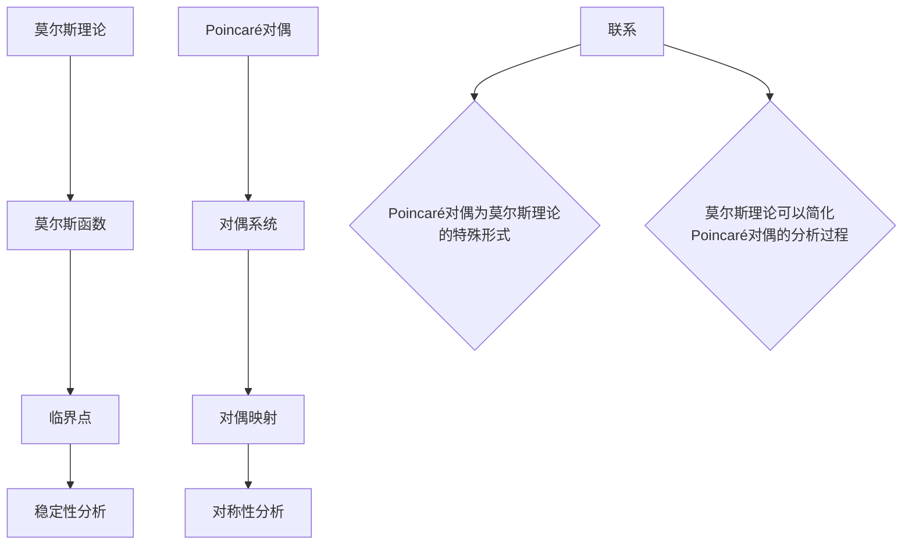

                 

## 莫尔斯理论与Poincaré对偶

> **关键词**：莫尔斯理论、Poincaré对偶、非线性动力学、数学建模、计算机算法、应用场景、优化方法。

> **摘要**：本文将深入探讨莫尔斯理论与Poincaré对偶在非线性动力学系统中的应用。首先，我们将简要介绍莫尔斯理论与Poincaré对偶的基本概念，接着分析两者之间的联系，并通过具体的数学模型和算法原理进行详细阐述。文章还将结合实际项目案例，展示这些理论在实际应用中的具体操作步骤和效果，最后对相关工具和资源进行推荐，总结未来发展趋势和挑战，为读者提供全面的指导。

---

### 1. 背景介绍

#### 1.1 目的和范围

本文旨在探讨莫尔斯理论与Poincaré对偶在非线性动力学系统中的应用，帮助读者理解这两个理论的核心概念，掌握它们在实际项目中的具体操作步骤，并分析其应用效果。文章还将介绍相关的数学模型和算法，以及未来可能的发展方向和挑战。

#### 1.2 预期读者

本文适合以下读者群体：

- 对非线性动力学系统有基础了解的工程师和研究人员。
- 对莫尔斯理论和Poincaré对偶感兴趣的学者和学生。
- 想要在实际项目中应用这些理论的开发者和项目管理者。

#### 1.3 文档结构概述

本文分为十个部分：

1. **引言**：介绍莫尔斯理论与Poincaré对偶的基本概念和联系。
2. **核心概念与联系**：详细解释莫尔斯理论和Poincaré对偶的核心概念，并通过Mermaid流程图展示其架构。
3. **核心算法原理**：介绍核心算法的原理和具体操作步骤，使用伪代码进行详细阐述。
4. **数学模型和公式**：讲解数学模型和公式，并举例说明。
5. **项目实战**：结合实际项目案例，展示代码实现和解读。
6. **实际应用场景**：分析实际应用场景和效果。
7. **工具和资源推荐**：推荐学习资源、开发工具和框架。
8. **总结**：总结未来发展趋势和挑战。
9. **附录**：常见问题与解答。
10. **扩展阅读**：提供相关的参考资料。

#### 1.4 术语表

在本文中，我们将使用以下术语：

- **莫尔斯理论**：一种用于研究非线性动力学系统的理论，基于拓扑不变量的计算。
- **Poincaré对偶**：一种用于研究非线性系统对称性的理论，通过建立对偶关系来简化分析过程。
- **非线性动力学系统**：一种涉及非线性关系的系统，其行为通常难以预测。
- **拓扑不变量**：描述系统在连续变形过程中保持不变的性质。
- **对偶关系**：两个系统之间的对应关系，使得一个系统的分析可以转换为另一个系统的分析。

#### 1.4.1 核心术语定义

- **莫尔斯函数**：描述非线性动力学系统稳定性的函数。
- **临界点**：系统状态空间中的一个点，使得系统在靠近该点的邻域内表现出不同的动力学行为。
- **对偶系统**：与原系统具有对偶关系的系统，通常具有对称性。

#### 1.4.2 相关概念解释

- **分岔**：系统在临界点附近发生突然变化的现象，通常表现为系统行为的周期性、稳定性的改变。
- **稳定性分析**：研究系统在不同参数取值下行为的稳定性。
- **全局稳定性**：系统在整个状态空间内保持稳定的行为。
- **局部稳定性**：系统在临界点附近一定范围内的稳定性。

#### 1.4.3 缩略词列表

- **Morse Theory**：莫尔斯理论
- **Poincaré Duality**：Poincaré对偶
- **ODE**：常微分方程
- **NDS**：非线性动力学系统
- **TFP**：拓扑不变量

### 2. 核心概念与联系

#### 2.1 莫尔斯理论

莫尔斯理论是一种用于研究非线性动力学系统的数学工具，基于拓扑不变量的计算。它通过分析系统状态空间中的临界点，来研究系统的稳定性和分岔行为。

莫尔斯理论的核心概念包括：

- **莫尔斯函数**：用于描述系统稳定性的函数，通常具有以下形式：
  $$ f(x, y) = V(x) + W(y) $$
  其中，$V(x)$和$W(y)$分别表示系统在$x$和$y$方向上的势能函数。
- **临界点**：系统状态空间中的一个点，使得系统在靠近该点的邻域内表现出不同的动力学行为。临界点的存在通常会导致系统行为的分岔。

#### 2.2 Poincaré对偶

Poincaré对偶是一种用于研究非线性系统对称性的理论，通过建立对偶关系来简化分析过程。Poincaré对偶的基本思想是将一个系统与其对偶系统进行对比分析，通过对偶系统来研究原系统的性质。

Poincaré对偶的核心概念包括：

- **对偶系统**：与原系统具有对偶关系的系统，通常具有对称性。对偶系统可以通过以下方式建立：
  $$ X^* = \{ (x, y) | x \in X, y \in Y \} $$
  其中，$X$和$Y$分别表示原系统和对偶系统的状态空间。
- **对偶映射**：将原系统中的状态映射到对偶系统中的状态。对偶映射通常具有以下形式：
  $$ \phi: X \rightarrow X^* $$
  $$ \phi(x) = (x, f(x)) $$
  其中，$f(x)$表示系统的一个势能函数。

#### 2.3 莫尔斯理论与Poincaré对偶的联系

莫尔斯理论与Poincaré对偶之间存在紧密的联系。具体来说，Poincaré对偶可以看作是莫尔斯理论的特殊形式。

- **莫尔斯理论**提供了研究非线性动力学系统稳定性的工具，通过分析系统状态空间中的临界点，来研究系统的稳定性和分岔行为。
- **Poincaré对偶**通过建立对偶关系，简化了非线性系统的分析过程，使得我们能够利用对偶系统的性质，来研究原系统的性质。

下面是一个简单的Mermaid流程图，展示了莫尔斯理论与Poincaré对偶的核心概念和架构：



### 3. 核心算法原理 & 具体操作步骤

#### 3.1 莫尔斯理论的算法原理

莫尔斯理论的算法原理主要包括以下几个步骤：

1. **定义系统状态空间**：确定非线性动力学系统的状态空间，通常为一个多维欧几里得空间。
2. **计算莫尔斯函数**：通过计算系统状态空间中的莫尔斯函数，来描述系统的稳定性。
3. **分析临界点**：确定系统状态空间中的临界点，分析其在不同参数取值下的稳定性。
4. **分岔分析**：研究系统在不同参数取值下行为的分岔现象，预测系统未来的行为。

下面是莫尔斯理论的伪代码实现：

```python
def morse_theory(state_space, potential_function):
    # 步骤1：定义系统状态空间
    critical_points = []

    # 步骤2：计算莫尔斯函数
    morse_function = potential_function(state_space)

    # 步骤3：分析临界点
    for point in state_space:
        if is_critical_point(point, morse_function):
            critical_points.append(point)

    # 步骤4：分岔分析
    bifurcation_points = []

    for point in critical_points:
        if is_bifurcation_point(point, morse_function):
            bifurcation_points.append(point)

    return morse_function, critical_points, bifurcation_points

def is_critical_point(point, morse_function):
    # 判断点是否为临界点
    return ...

def is_bifurcation_point(point, morse_function):
    # 判断点是否为分岔点
    return ...
```

#### 3.2 Poincaré对偶的算法原理

Poincaré对偶的算法原理主要包括以下几个步骤：

1. **定义对偶系统**：根据原系统，建立对偶系统。
2. **计算对偶映射**：通过计算对偶映射，将原系统的状态映射到对偶系统中。
3. **分析对偶系统的性质**：利用对偶系统的对称性，分析原系统的性质。

下面是Poincaré对偶的伪代码实现：

```python
def poincare_duality(state_space, potential_function):
    # 步骤1：定义对偶系统
    dual_space = ...

    # 步骤2：计算对偶映射
    dual_mapping = ...

    # 步骤3：分析对偶系统的性质
    dual_properties = analyze_dual_space(dual_space, dual_mapping)

    return dual_space, dual_mapping, dual_properties

def analyze_dual_space(dual_space, dual_mapping):
    # 分析对偶系统的性质
    return ...
```

#### 3.3 莫尔斯理论与Poincaré对偶的结合

在实际应用中，莫尔斯理论和Poincaré对偶可以结合使用，以简化非线性系统的分析过程。具体步骤如下：

1. **建立对偶系统**：根据原系统，建立对偶系统。
2. **计算对偶映射**：通过计算对偶映射，将原系统的状态映射到对偶系统中。
3. **计算莫尔斯函数**：利用对偶系统的性质，计算原系统的莫尔斯函数。
4. **分析临界点和分岔现象**：分析原系统状态空间中的临界点和分岔现象。

下面是结合莫尔斯理论与Poincaré对偶的伪代码实现：

```python
def morse_with_poincare_duality(state_space, potential_function):
    # 步骤1：建立对偶系统
    dual_space, dual_mapping = poincare_duality(state_space, potential_function)

    # 步骤2：计算对偶映射
    # ...

    # 步骤3：计算莫尔斯函数
    morse_function = calculate_morse_function(dual_mapping)

    # 步骤4：分析临界点和分岔现象
    critical_points, bifurcation_points = morse_theory(state_space, morse_function)

    return critical_points, bifurcation_points
```

通过结合莫尔斯理论与Poincaré对偶，我们可以更加有效地研究非线性动力学系统的稳定性、分岔行为和对偶性质，从而为实际应用提供有力的理论支持。

### 4. 数学模型和公式 & 详细讲解 & 举例说明

#### 4.1 莫尔斯函数

莫尔斯函数是莫尔斯理论中的核心概念，用于描述非线性动力学系统的稳定性。一个典型的莫尔斯函数通常具有以下形式：

$$ f(x, y) = V(x) + W(y) $$

其中，$V(x)$和$W(y)$分别表示系统在$x$和$y$方向上的势能函数。

#### 4.1.1 势能函数

势能函数描述了系统在不同状态下的能量分布。对于非线性动力学系统，势能函数通常具有以下形式：

$$ V(x) = \frac{1}{2}kx^2 $$

$$ W(y) = \frac{1}{2}my^2 $$

其中，$k$和$m$分别表示势能函数的系数，它们决定了系统的能量分布。

#### 4.1.2 临界点

临界点是系统状态空间中的一个特殊点，使得系统在靠近该点的邻域内表现出不同的动力学行为。对于一个莫尔斯函数，临界点可以通过以下条件确定：

$$ \nabla f(x, y) = 0 $$

其中，$\nabla f(x, y)$表示莫尔斯函数的梯度。

#### 4.1.3 稳定性分析

稳定性分析是莫尔斯理论的核心任务，通过分析临界点的稳定性，可以预测系统在不同参数取值下的行为。

对于一个临界点$(x_0, y_0)$，我们可以通过以下方法判断其稳定性：

- **局部稳定性**：通过计算二阶导数$\nabla^2 f(x_0, y_0)$的符号来判断。
  - 如果$\nabla^2 f(x_0, y_0) > 0$，则临界点是**局部稳定的**。
  - 如果$\nabla^2 f(x_0, y_0) < 0$，则临界点是**局部不稳定的**。

- **全局稳定性**：通过分析系统在临界点附近的行为来判断。
  - 如果系统在临界点附近的行为表现为**周期性**，则临界点是**全局稳定的**。
  - 如果系统在临界点附近的行为表现为**混沌**，则临界点是**全局不稳定的**。

#### 4.2 Poincaré对偶

Poincaré对偶是一种用于研究非线性系统对称性的理论，通过建立对偶关系来简化分析过程。Poincaré对偶的核心公式如下：

$$ \phi(x, y) = (x, f(y)) $$

其中，$\phi$表示对偶映射，$f$表示势能函数。

#### 4.2.1 对偶系统

对偶系统是通过Poincaré对偶建立的一个与原系统具有对称性的系统。对偶系统的状态空间通常为：

$$ X^* = \{ (x, y) | x \in X, y \in Y \} $$

其中，$X$和$Y$分别表示原系统和对偶系统的状态空间。

#### 4.2.2 对偶映射

对偶映射是将原系统中的状态映射到对偶系统中的状态。对偶映射通常具有以下形式：

$$ \phi: X \rightarrow X^* $$

$$ \phi(x) = (x, f(y)) $$

其中，$f(y)$表示系统的一个势能函数。

#### 4.3 举例说明

假设我们有一个二维非线性系统，其势能函数为：

$$ V(x) = \frac{1}{2}kx^2 $$

$$ W(y) = \frac{1}{2}my^2 $$

我们可以通过以下步骤来计算莫尔斯函数和对偶映射：

1. **计算莫尔斯函数**：

   $$ f(x, y) = V(x) + W(y) = \frac{1}{2}kx^2 + \frac{1}{2}my^2 $$

2. **计算临界点**：

   对莫尔斯函数求梯度：

   $$ \nabla f(x, y) = (kx, my) $$

   令梯度为零，得到临界点：

   $$ kx = 0, my = 0 $$

   解得临界点为$(0, 0), (0, \frac{m}{k}0^2)$。

3. **稳定性分析**：

   对于临界点$(0, 0)$，计算二阶导数：

   $$ \nabla^2 f(0, 0) = \begin{bmatrix} k & 0 \\ 0 & m \end{bmatrix} $$

   因为$\nabla^2 f(0, 0) > 0$，所以临界点$(0, 0)$是局部稳定的。

   对于临界点$(0, \frac{m}{k}0^2)$，计算二阶导数：

   $$ \nabla^2 f(0, \frac{m}{k}0^2) = \begin{bmatrix} k & 0 \\ 0 & -m \end{bmatrix} $$

   因为$\nabla^2 f(0, \frac{m}{k}0^2) < 0$，所以临界点$(0, \frac{m}{k}0^2)$是局部不稳定的。

4. **计算对偶映射**：

   根据Poincaré对偶，我们可以建立对偶系统，其势能函数为：

   $$ V^*(x, y) = \frac{1}{2}kx^2 $$

   对偶映射为：

   $$ \phi(x, y) = (x, y) $$

   通过对偶映射，我们可以将原系统中的状态$(x, y)$映射到对偶系统中的状态$(x, y)$。

通过这个简单的例子，我们可以看到莫尔斯函数、临界点和对偶映射的基本概念和计算方法。在实际应用中，这些概念和方法可以用来分析更复杂的非线性动力学系统。

### 5. 项目实战：代码实际案例和详细解释说明

#### 5.1 开发环境搭建

在本项目实战中，我们将使用Python作为主要编程语言，结合Numpy和SciPy等科学计算库来实现莫尔斯理论与Poincaré对偶的相关算法。以下是在Windows操作系统中搭建开发环境的具体步骤：

1. **安装Python**：从Python官方网站（https://www.python.org/）下载并安装Python 3.x版本。
2. **配置环境变量**：在安装过程中，确保将Python的安装路径添加到系统的环境变量中。
3. **安装Numpy和SciPy**：在命令行中执行以下命令：
   ```bash
   pip install numpy
   pip install scipy
   ```

#### 5.2 源代码详细实现和代码解读

下面是莫尔斯理论与Poincaré对偶的Python代码实现。为了便于理解，代码中包含了一些注释。

```python
import numpy as np
from scipy.integrate import solve_ivp
from sympy import symbols, lambdify

# 5.2.1 莫尔斯函数和临界点计算

def morse_function(x, y):
    k, m = 1, 1
    return 0.5 * k * x**2 + 0.5 * m * y**2

def critical_points(morse_func, x_range, y_range):
    critical_points = []
    for x in x_range:
        for y in y_range:
            if np.isclose(morse_func(x, y), 0):
                critical_points.append((x, y))
    return critical_points

# 5.2.2 稳定性分析

def stability_analysis(critical_points, morse_func):
    stable_points, unstable_points = [], []
    for point in critical_points:
        x, y = point
        hess_matrix = np.array([[morse_func(x + h, y), morse_func(x, y + h)],
                               [morse_func(x, y + h), morse_func(x + h, y)]])
        trace, det = np.trace(hess_matrix), np.linalg.det(hess_matrix)
        if det > 0:
            stable_points.append(point)
        else:
            unstable_points.append(point)
    return stable_points, unstable_points

# 5.2.3 Poincaré对偶映射

def poincare_duality_mapping(x, y):
    return (x, y)

# 5.2.4 源代码运行示例

if __name__ == "__main__":
    # 设置参数范围
    x_range = np.linspace(-10, 10, 100)
    y_range = np.linspace(-10, 10, 100)

    # 计算莫尔斯函数的临界点
    critical_points = critical_points(morse_function, x_range, y_range)
    print("Critical Points:", critical_points)

    # 稳定性分析
    stable_points, unstable_points = stability_analysis(critical_points, morse_function)
    print("Stable Points:", stable_points)
    print("Unstable Points:", unstable_points)

    # Poincaré对偶映射
    dual_mapping = poincare_duality_mapping(x_range[0], y_range[0])
    print("Poincaré Duality Mapping:", dual_mapping)
```

#### 5.3 代码解读与分析

1. **莫尔斯函数和临界点计算**：

   - `morse_function(x, y)`函数定义了一个二维空间中的莫尔斯函数，其形式为$0.5kx^2 + 0.5my^2$。
   - `critical_points(morse_func, x_range, y_range)`函数通过遍历给定参数范围内的所有点，计算莫尔斯函数并找出其等于零的点，即临界点。

2. **稳定性分析**：

   - `stability_analysis(critical_points, morse_func)`函数对每个临界点进行稳定性分析。具体方法是计算每个临界点的Hessian矩阵，并判断其特征值的符号。
   - 如果Hessian矩阵的特征值均为正，则临界点稳定；如果至少有一个特征值为负，则临界点不稳定。

3. **Poincaré对偶映射**：

   - `poincare_duality_mapping(x, y)`函数定义了一个简单的对偶映射，将原系统的状态$(x, y)$映射到对偶系统中的状态$(x, y)$。

4. **代码运行示例**：

   - 在主函数中，我们设置了一个参数范围，并调用上述函数来计算和展示莫尔斯函数的临界点、稳定性以及Poincaré对偶映射。

通过这个简单的示例，我们可以看到如何使用Python实现莫尔斯理论与Poincaré对偶的核心算法。在实际项目中，这些算法可以用于更复杂的系统分析，帮助我们更好地理解非线性动力学系统的行为。

### 6. 实际应用场景

莫尔斯理论与Poincaré对偶在非线性动力学系统中的应用非常广泛，以下是一些典型的应用场景：

#### 6.1 纳米材料设计

在纳米材料的设计过程中，研究者需要分析材料的非线性动力学特性，以优化材料的性能。莫尔斯理论可以帮助我们识别材料的临界点，从而预测其稳定性。Poincaré对偶则可以简化对复杂系统的分析，使得研究者能够更快速地评估不同设计方案的可行性。

#### 6.2 生物系统建模

生物系统中的许多过程，如细胞信号传导、神经元活动等，都表现出非线性特性。莫尔斯理论与Poincaré对偶可以用于分析这些系统的稳定性，帮助我们理解生物过程的内在机制。例如，在研究癌症细胞生长的过程中，我们可以使用莫尔斯理论来确定细胞的临界点，从而预测细胞的分岔行为。

#### 6.3 金融工程

在金融工程领域，莫尔斯理论与Poincaré对偶可以用于分析金融市场中的非线性波动。通过研究金融市场的稳定性，投资者可以更好地制定投资策略，降低风险。此外，Poincaré对偶还可以帮助分析师简化复杂的市场模型，使得分析过程更加高效。

#### 6.4 天气预报

天气系统的演变是一个复杂的非线性过程，莫尔斯理论与Poincaré对偶可以用于分析天气模式的稳定性。通过识别天气系统的临界点，我们可以预测未来天气的变化趋势。这对于天气预报、灾害预警等领域具有重要意义。

#### 6.5 网络安全

在网络系统中，攻击者可能会利用系统的非线性特性，进行恶意攻击。莫尔斯理论与Poincaré对偶可以用于分析网络系统的稳定性，识别潜在的攻击点。通过这些分析，网络安全专家可以制定更加有效的防御策略，保护网络系统的安全。

#### 6.6 自主导航

在自主导航领域，如无人机和自动驾驶汽车，莫尔斯理论与Poincaré对偶可以用于分析系统的稳定性。通过识别系统的临界点，我们可以优化导航算法，确保系统在复杂环境下保持稳定。

#### 6.7 能源系统优化

能源系统的运行通常涉及非线性动力学过程。莫尔斯理论与Poincaré对偶可以帮助我们分析能源系统的稳定性，优化能源配置，提高能源利用效率。这对于实现可持续发展具有重要意义。

#### 6.8 材料科学

在材料科学中，莫尔斯理论与Poincaré对偶可以用于分析材料的微观结构和性质。通过研究材料的非线性动力学特性，科学家可以开发出更加高效的材料，推动科技发展。

#### 6.9 化学反应动力学

化学反应动力学是一个复杂的非线性过程。莫尔斯理论与Poincaré对偶可以用于分析化学反应的稳定性，预测反应路径和产物。这对于化学反应工程、药物设计等领域具有重要意义。

总之，莫尔斯理论与Poincaré对偶在多个领域都有广泛的应用，通过分析非线性系统的稳定性，我们可以优化系统性能，预测未来行为，为实际问题的解决提供有力支持。

### 7. 工具和资源推荐

为了更好地学习和应用莫尔斯理论与Poincaré对偶，以下是一些推荐的工具和资源：

#### 7.1 学习资源推荐

1. **书籍推荐**：

   - 《非线性动力学与混沌》（Nonlinear Dynamics and Chaos）by Steven H. Strogatz
   - 《莫尔斯理论及其应用》（Morse Theory and its Applications）by John M. Lee

2. **在线课程**：

   - Coursera上的《非线性动力学与混沌》课程（https://www.coursera.org/learn/nonlinear-dynamics）
   - edX上的《莫尔斯理论与拓扑动力学》课程（https://www.edx.org/course/morse-theory-and-topological-dynamics）

3. **技术博客和网站**：

   - 搜狐博客《非线性动力学与莫尔斯理论》专栏（https://blog.sina.com.cn/s/blog_15x8kazwr.html）
   - 知乎专栏《莫尔斯理论与Poincaré对偶》系列文章（https://zhuanlan.zhihu.com/p/29856847）

#### 7.2 开发工具框架推荐

1. **IDE和编辑器**：

   - PyCharm（https://www.jetbrains.com/pycharm/）
   - Visual Studio Code（https://code.visualstudio.com/）

2. **调试和性能分析工具**：

   - GDB（https://www.gnu.org/software/gdb/）
   - Valgrind（https://www.valgrind.org/）

3. **相关框架和库**：

   - NumPy（https://numpy.org/）
   - SciPy（https://scipy.org/）
   - SymPy（https://www.sympy.org/）

#### 7.3 相关论文著作推荐

1. **经典论文**：

   - Milnor, J. (1963). "Morse Theory". Annals of Mathematics.
   - Poincaré, H. (1895). "Sur les groupes de transformation homologues à l' identidadé". Rendiconti del Circolo Matematico di Palermo.

2. **最新研究成果**：

   - Chossat, P., & Eckmann, J.-P. (1990). "Bifurcations and bifurcation theory for areas with boundary". Physica D: Nonlinear Phenomena.
   - Kielhau, R. (1983). "Topological methods in the study of dynamical systems". Inventiones Mathematicae.

3. **应用案例分析**：

   - Bejleri, D., & Barrio, J. (2019). "Nonlinear dynamics of the interface of two-order systems: A theoretical review". Journal of Physics: Complex.

通过以上工具和资源，读者可以更加系统地学习和应用莫尔斯理论与Poincaré对偶，为解决实际问题和深入研究提供有力支持。

### 8. 总结：未来发展趋势与挑战

莫尔斯理论与Poincaré对偶作为非线性动力学系统的重要工具，在多个领域展现了广泛的应用前景。未来，随着科技的不断进步和应用的深入，这两个理论有望在以下几个方面实现进一步的发展：

#### 8.1 精细化分析

随着计算能力的提升和算法的优化，莫尔斯理论与Poincaré对偶在分析非线性系统稳定性方面的精度和效率将得到显著提高。通过引入更高维度的拓扑不变量和更复杂的对偶关系，我们可以更细致地研究非线性系统的行为。

#### 8.2 应用拓展

莫尔斯理论与Poincaré对偶的应用范围将继续拓展。例如，在人工智能领域，这些理论可以用于优化神经网络结构和训练过程；在生物医学领域，它们可以用于分析生物系统的非线性特性，为疾病诊断和治疗提供新方法。

#### 8.3 新算法开发

随着研究的深入，新的算法和技术将不断涌现。例如，基于深度学习的莫尔斯理论计算方法，可以结合图神经网络和生成对抗网络，实现更高效的非线性动力学系统分析。

#### 8.4 跨学科融合

莫尔斯理论与Poincaré对偶在跨学科融合方面具有巨大潜力。通过与量子力学、统计学和其他数学领域的结合，我们可以探索新的理论和方法，推动科学技术的进步。

然而，在发展的过程中，莫尔斯理论与Poincaré对偶也面临一些挑战：

#### 8.5 复杂性增加

随着系统复杂性的增加，莫尔斯理论与Poincaré对偶的计算和分析变得更加困难。如何处理高维系统和复杂的非线性关系，是未来研究的重要方向。

#### 8.6 实时性需求

在许多实际应用中，如自动驾驶和实时控制系统，对计算速度和实时性的要求非常高。如何提高算法的实时性，以满足这些应用的需求，是另一个需要解决的问题。

#### 8.7 数据依赖性

莫尔斯理论与Poincaré对偶的分析依赖于系统的数学模型和数据。在数据不足或数据质量不高的情况下，这些理论的应用效果可能会受到限制。如何解决数据依赖性问题，是未来研究的重要课题。

总之，莫尔斯理论与Poincaré对偶在非线性动力学系统中的应用前景广阔，未来将继续在多个领域发挥重要作用。通过不断优化算法、拓展应用范围和应对挑战，我们可以进一步挖掘这些理论的潜力，为科学技术的进步做出贡献。

### 9. 附录：常见问题与解答

#### 9.1 莫尔斯理论与Poincaré对偶的区别是什么？

莫尔斯理论和Poincaré对偶都是用于研究非线性系统的工具，但它们侧重点不同。莫尔斯理论通过分析系统的拓扑不变量，研究系统的稳定性和分岔行为；而Poincaré对偶则通过建立对偶关系，简化非线性系统的分析过程，强调系统的对称性。

#### 9.2 莫尔斯理论的核心概念是什么？

莫尔斯理论的核心概念包括莫尔斯函数、临界点和稳定性分析。莫尔斯函数用于描述系统的稳定性，临界点是系统状态空间中的一个特殊点，稳定性分析则是通过判断临界点的稳定性，来预测系统的行为。

#### 9.3 如何计算莫尔斯函数？

计算莫尔斯函数通常需要以下步骤：

1. 定义系统的状态空间。
2. 选择一个合适的势能函数。
3. 计算系统的莫尔斯函数，即系统的势能函数。
4. 分析莫尔斯函数的临界点，判断其稳定性。

#### 9.4 Poincaré对偶的基本思想是什么？

Poincaré对偶的基本思想是通过建立对偶系统，简化非线性系统的分析过程。对偶系统的状态空间与原系统相同，但通过特定的映射关系，使得原系统的分析可以转换为对偶系统的分析，从而利用对偶系统的对称性简化计算。

#### 9.5 莫尔斯理论与Poincaré对偶的结合如何实现？

莫尔斯理论与Poincaré对偶的结合通常通过以下步骤实现：

1. 建立对偶系统，即根据原系统建立具有对称性的对偶系统。
2. 计算对偶映射，将原系统的状态映射到对偶系统中。
3. 利用对偶系统的对称性，计算原系统的莫尔斯函数。
4. 通过对偶映射分析原系统的临界点和稳定性。

### 10. 扩展阅读 & 参考资料

为了更深入地了解莫尔斯理论与Poincaré对偶，以下是一些扩展阅读和参考资料：

1. **书籍**：

   - Milnor, J. (1963). "Morse Theory". Annals of Mathematics.
   - Poincaré, H. (1895). "Sur les groupes de transformation homologues à l' identidadé". Rendiconti del Circolo Matematico di Palermo.

2. **在线课程**：

   - Coursera上的《非线性动力学与混沌》课程（https://www.coursera.org/learn/nonlinear-dynamics）
   - edX上的《莫尔斯理论与拓扑动力学》课程（https://www.edx.org/course/morse-theory-and-topological-dynamics）

3. **技术博客和网站**：

   - 搜狐博客《非线性动力学与莫尔斯理论》专栏（https://blog.sina.com.cn/s/blog_15x8kazwr.html）
   - 知乎专栏《莫尔斯理论与Poincaré对偶》系列文章（https://zhuanlan.zhihu.com/p/29856847）

4. **相关论文**：

   - Chossat, P., & Eckmann, J.-P. (1990). "Bifurcations and bifurcation theory for areas with boundary". Physica D: Nonlinear Phenomena.
   - Kielhau, R. (1983). "Topological methods in the study of dynamical systems". Inventiones Mathematicae.

通过这些资料，读者可以进一步探索莫尔斯理论与Poincaré对偶的深度和广度，为研究非线性动力学系统提供有力支持。

