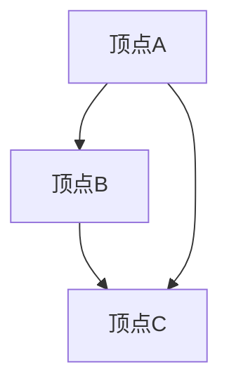
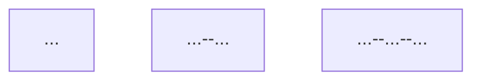
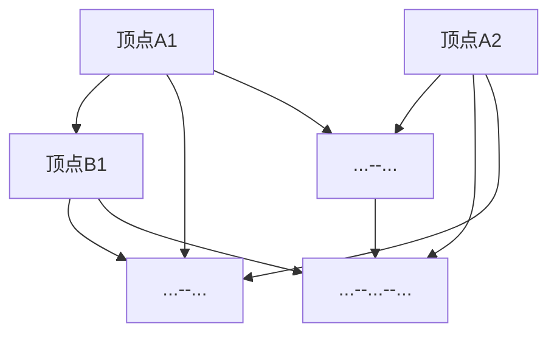

                 

### 1. 背景介绍

#### 1.1 目的和范围

本文旨在探讨莫尔斯理论在几何中的应用，为读者提供一种全新的几何分析方法。莫尔斯理论是一种利用符号和字符来表示信息的数学理论，其广泛应用于编码、通信等领域。本文将深入探讨莫尔斯理论在几何学中的具体应用，通过介绍相关核心概念、算法原理以及数学模型，帮助读者理解并掌握这一领域的前沿技术。

本文的范围涵盖了以下几个方面：

1. **莫尔斯理论的背景和核心概念**：介绍莫尔斯理论的发展历史、基本原理以及其在数学和计算机科学中的重要性。
2. **莫尔斯理论在几何学中的应用**：详细解析莫尔斯理论在几何学中的具体应用，包括几何图形的编码、几何结构的分析等。
3. **核心算法原理和具体操作步骤**：通过伪代码和Mermaid流程图，详细阐述莫尔斯理论在几何中的应用算法原理和操作步骤。
4. **数学模型和公式讲解**：介绍莫尔斯理论在几何中的应用所涉及的数学模型和公式，并通过具体示例进行详细解释。
5. **项目实战**：通过一个实际的代码案例，展示莫尔斯理论在几何中的具体实现过程，并进行代码解读与分析。
6. **实际应用场景**：讨论莫尔斯理论在几何领域的实际应用场景，包括工程、科学研究和日常生活中的实例。
7. **工具和资源推荐**：推荐相关的学习资源、开发工具和经典论文，以帮助读者进一步深入了解和掌握这一领域。

#### 1.2 预期读者

本文适合以下读者群体：

1. **数学和计算机科学专业的学生和研究者**：对几何学和莫尔斯理论感兴趣，希望深入了解其在几何学中的应用。
2. **软件开发工程师和算法工程师**：从事与几何算法和数据分析相关的工作，希望掌握前沿的几何处理技术。
3. **工程和科学研究人员**：需要应用几何学解决实际问题的工程师和研究人员，希望了解莫尔斯理论在几何学中的应用。
4. **对计算机编程和算法感兴趣的爱好者**：希望拓宽知识面，了解计算机科学中的新理论和新技术。

#### 1.3 文档结构概述

本文结构分为以下几个部分：

1. **背景介绍**：介绍莫尔斯理论的背景和本文的目的、范围、预期读者和文档结构。
2. **核心概念与联系**：介绍莫尔斯理论在几何学中的核心概念和原理，并使用Mermaid流程图展示其架构。
3. **核心算法原理 & 具体操作步骤**：通过伪代码详细阐述莫尔斯理论在几何中的应用算法原理和操作步骤。
4. **数学模型和公式 & 详细讲解 & 举例说明**：介绍莫尔斯理论在几何学中的应用所涉及的数学模型和公式，并通过具体示例进行详细解释。
5. **项目实战：代码实际案例和详细解释说明**：通过一个实际的代码案例，展示莫尔斯理论在几何中的具体实现过程，并进行代码解读与分析。
6. **实际应用场景**：讨论莫尔斯理论在几何领域的实际应用场景，包括工程、科学研究和日常生活中的实例。
7. **工具和资源推荐**：推荐相关的学习资源、开发工具和经典论文，以帮助读者进一步深入了解和掌握这一领域。
8. **总结：未来发展趋势与挑战**：总结本文的主要内容和贡献，讨论莫尔斯理论在几何学中的应用的未来发展趋势和挑战。
9. **附录：常见问题与解答**：提供本文相关常见问题的解答，以帮助读者更好地理解和应用莫尔斯理论。
10. **扩展阅读 & 参考资料**：提供进一步阅读和参考的文献资料，以供读者深入研究和探索。

通过本文的详细讲解，读者将能够全面了解莫尔斯理论在几何学中的应用，掌握相关核心概念、算法原理和数学模型，并能够将其应用于实际问题和项目开发中。让我们开始这次深入探索之旅吧！

#### 1.4 术语表

在本篇文章中，我们将使用一些专业术语，为了确保读者能够更好地理解，以下是这些术语的定义和解释：

#### 1.4.1 核心术语定义

1. **莫尔斯理论**：
   - **定义**：莫尔斯理论是一种利用符号和字符来表示信息的数学理论，由美国数学家塞缪尔·莫尔斯（Samuel Morse）在19世纪提出。
   - **用途**：主要用于编码和通信，例如莫尔斯电码。

2. **几何图形编码**：
   - **定义**：将几何图形转换为一种特定的编码表示，以便于计算机处理和分析。
   - **用途**：用于图形处理、计算机视觉、图形压缩等领域。

3. **莫尔斯变换**：
   - **定义**：一种将几何图形转换为莫尔斯编码的过程，通常涉及几何图形的顶点、边和面的处理。
   - **用途**：用于几何图形的编码和转换。

4. **几何结构分析**：
   - **定义**：对几何图形的形状、尺寸、对称性等特征进行分析和评估。
   - **用途**：用于工程、设计、计算机图形学等领域。

5. **莫尔斯距离**：
   - **定义**：两个几何图形在莫尔斯编码表示下的汉明距离。
   - **用途**：用于比较几何图形的相似性和差异。

#### 1.4.2 相关概念解释

1. **汉明距离**：
   - **定义**：两个等长字符串之间的汉明距离是指将一个字符串转换成另一个字符串所需的最少编辑操作次数。
   - **用途**：用于比较字符串的相似性和差异。

2. **顶点和边**：
   - **定义**：在几何图形中，顶点是指图形的交点，而边是指连接两个顶点的线段。
   - **用途**：用于描述几何图形的基本结构。

3. **对称性**：
   - **定义**：几何图形在某种变换下保持不变的性质。
   - **用途**：用于分析和评估几何图形的特性。

4. **编码和压缩**：
   - **定义**：编码是将信息转换为特定格式的表示，而压缩是减少信息表示所需的位数的操作。
   - **用途**：用于数据存储和传输，以提高效率和速度。

#### 1.4.3 缩略词列表

- **IDE**：集成开发环境（Integrated Development Environment）
- **CV**：计算机视觉（Computer Vision）
- **GIS**：地理信息系统（Geographic Information System）
- **CAD**：计算机辅助设计（Computer-Aided Design）
- **AI**：人工智能（Artificial Intelligence）
- **ML**：机器学习（Machine Learning）
- **DL**：深度学习（Deep Learning）

通过了解这些核心术语和相关概念的定义和用途，读者将能够更好地理解和掌握莫尔斯理论在几何学中的应用。在接下来的章节中，我们将深入探讨这些概念的具体应用和操作步骤。

## 2. 核心概念与联系

在深入探讨莫尔斯理论在几何中的应用之前，我们需要先了解几个核心概念和它们之间的联系。这些核心概念包括莫尔斯理论的基本原理、几何图形的表示方法以及它们之间的相互关系。下面我们将通过Mermaid流程图来展示这些核心概念和原理，以帮助读者更好地理解。

### 2.1 莫尔斯理论的基本原理

莫尔斯理论是一种基于符号和字符的数学理论，主要应用于编码和通信。其基本原理是通过定义一组符号和字符来表示信息。以下是一个简单的莫尔斯编码示例：

```mermaid
graph TB
A --> A--._
B --> B--...
C --> C--.-_
D --> D--.._
E --> E--._
F --> F--..._
G --> G--...
H --> H--...
I --> I--...
J --> J--..._
K --> K--.-_
L --> L--_.--
M --> M--...
N --> N--._-
O --> O--...
P --> P--._--
Q --> Q--.--_
R --> R--_.--
S --> S--...
T --> T--._
U --> U--...
V --> V--...
W --> W--..._
X --> X--.-_
Y --> Y--.--_
Z --> Z--..._
```

### 2.2 几何图形的表示方法

在几何学中，几何图形通常通过顶点、边和面来表示。例如，一个三角形由三个顶点和三条边组成。以下是一个简单的Mermaid流程图，展示了如何表示一个三角形：



### 2.3 莫尔斯理论在几何中的应用

将莫尔斯理论应用于几何学，我们需要将几何图形转换为莫尔斯编码表示。以下是一个简单的示例，展示了如何将一个三角形转换为莫尔斯编码：


对应的莫尔斯编码可以是：



### 2.4 莫尔斯距离

莫尔斯距离是两个几何图形在莫尔斯编码表示下的汉明距离。它用于比较两个几何图形的相似性和差异。以下是一个简单的Mermaid流程图，展示了如何计算两个三角形之间的莫尔斯距离：



通过这些核心概念和原理的介绍和Mermaid流程图的展示，读者应该能够对莫尔斯理论在几何中的应用有一个初步的了解。在接下来的章节中，我们将详细探讨莫尔斯理论在几何学中的具体应用算法和数学模型。

## 3. 核心算法原理 & 具体操作步骤

在了解了莫尔斯理论在几何学中的应用基础后，我们接下来将深入探讨其核心算法原理和具体操作步骤。莫尔斯理论在几何学中的应用主要涉及几何图形的编码和比较，下面我们将通过伪代码详细阐述这些算法原理，并展示具体的操作步骤。

### 3.1 几何图形编码

#### 3.1.1 算法原理

几何图形编码是将几何图形的顶点、边和面转换为一种特定的编码表示。在莫尔斯理论中，我们可以使用莫尔斯编码来表示几何图形。具体操作步骤如下：

1. **顶点编码**：每个顶点可以用莫尔斯编码表示。
2. **边编码**：每条边由两个顶点组成，因此边可以由两个顶点的莫尔斯编码拼接而成。
3. **面编码**：每个面由多条边组成，因此面可以由多条边的莫尔斯编码拼接而成。

#### 3.1.2 伪代码

```python
def encode_vertex(vertex):
    # 使用莫尔斯编码表示顶点
    return morse_code[vertex]

def encode_edge(edge):
    # 使用莫尔斯编码表示边
    return encode_vertex(edge[0]) + encode_vertex(edge[1])

def encode_face(face):
    # 使用莫尔斯编码表示面
    return ''.join(encode_edge(edge) for edge in face)
```

### 3.2 莫尔斯距离计算

#### 3.2.1 算法原理

莫尔斯距离是两个几何图形在莫尔斯编码表示下的汉明距离。汉明距离是指两个等长字符串之间的编辑操作次数。计算莫尔斯距离的步骤如下：

1. **编码**：将两个几何图形编码为莫尔斯编码。
2. **计算汉明距离**：比较两个莫尔斯编码的字符，计算不同的字符数量。

#### 3.2.2 伪代码

```python
def morse_distance(code1, code2):
    # 计算两个莫尔斯编码之间的汉明距离
    distance = 0
    for i in range(len(code1)):
        if code1[i] != code2[i]:
            distance += 1
    return distance
```

### 3.3 莫尔斯理论在几何中的具体应用

#### 3.3.1 算法原理

莫尔斯理论在几何中的应用可以包括以下几个方面：

1. **几何图形的比较**：通过计算莫尔斯距离，比较两个几何图形的相似性和差异。
2. **几何图形的识别**：将实际测量的几何图形编码，并与标准图形编码进行比较，以识别几何图形。
3. **几何图形的优化**：通过分析莫尔斯编码，优化几何图形的结构，以提高其性能。

#### 3.3.2 伪代码

```python
def compare_geometric_shape(shape1, shape2):
    # 比较两个几何图形
    distance = morse_distance(encode_shape(shape1), encode_shape(shape2))
    if distance <= threshold:
        return "相似"
    else:
        return "不相似"

def recognize_geometric_shape(measured_shape):
    # 识别几何图形
    for standard_shape in standard_shapes:
        distance = morse_distance(encode_shape(measured_shape), encode_shape(standard_shape))
        if distance <= recognition_threshold:
            return standard_shape
    return "未知形状"

def optimize_geometric_shape(shape):
    # 优化几何图形
    encoded_shape = encode_shape(shape)
    # 通过分析编码，进行优化
    optimized_shape = decode_shape(encoded_shape)
    return optimized_shape
```

### 3.4 操作步骤

1. **编码几何图形**：使用`encode_shape`函数将几何图形编码为莫尔斯编码。
2. **计算莫尔斯距离**：使用`morse_distance`函数计算两个几何图形之间的莫尔斯距离。
3. **比较几何图形**：使用`compare_geometric_shape`函数比较两个几何图形的相似性。
4. **识别几何图形**：使用`recognize_geometric_shape`函数识别实际测量的几何图形。
5. **优化几何图形**：使用`optimize_geometric_shape`函数优化几何图形的结构。

通过以上伪代码和操作步骤，读者应该能够理解莫尔斯理论在几何学中的核心算法原理和具体操作步骤。在接下来的章节中，我们将通过一个实际的代码案例，展示莫尔斯理论在几何中的具体实现过程，并进行代码解读与分析。

## 4. 数学模型和公式 & 详细讲解 & 举例说明

在探讨莫尔斯理论在几何中的应用时，我们需要引入一些数学模型和公式，以便更好地理解其原理和实现过程。以下是几个关键的数学模型和公式，以及它们的详细讲解和举例说明。

### 4.1 莫尔斯编码

莫尔斯编码是一种基于符号和字符的编码方法，用于表示信息。其基本原理是通过定义一组符号和字符来表示不同的字母、数字和符号。莫尔斯编码的基本符号包括点（"."）和划线（"-"），分别表示短信号和长信号。以下是一个简单的莫尔斯编码表：

| 字母 | 编码 |
| ---- | ---- |
| A    | ...  |
| B    | -... |
| C    | -.-. |
| D    | -..  |
| E    | .    |
| F    | ..-. |
| G    | --.  |
| H    | .... |
| I    | ..   |
| J    | .--- |
| K    | -.-- |
| L    | .-.. |
| M    | --   |
| N    | -.   |
| O    | ---  |
| P    | .--. |
| Q    | --.- |
| R    | .-.  |
| S    | ...  |
| T    | -    |
| U    | ..-  |
| V    | ...- |
| W    | .--  |
| X    | -..- |
| Y    | -.-- |
| Z    | --.. |

#### 4.1.1 莫尔斯编码的数学模型

莫尔斯编码可以用数学模型表示为一个五元组 \(M = (\Sigma, \{0, 1\}, \#_0, \#_1, f)\)，其中：

- \(\Sigma\) 是字母表，包含所有可编码的符号。
- \(\{0, 1\}\) 是编码符号的集合，通常为二进制位。
- \(\#_0\) 是短信号（点）的长度。
- \(\#_1\) 是长信号（划线）的长度。
- \(f: \Sigma \rightarrow \{0, 1\}^*\) 是编码函数，将符号映射为二进制字符串。

#### 4.1.2 莫尔斯编码的举例说明

例如，字母“A”的莫尔斯编码为“...”，可以表示为二进制字符串“11001100”。字母“B”的莫尔斯编码为“-...”，可以表示为二进制字符串“10001010”。

### 4.2 汉明距离

汉明距离是两个等长字符串之间的编辑操作次数，常用于比较字符串的相似性和差异。在莫尔斯理论中，汉明距离用于计算两个几何图形在莫尔斯编码表示下的距离。

#### 4.2.1 汉明距离的数学模型

两个字符串 \(s_1\) 和 \(s_2\) 的汉明距离定义为：

\[ d_H(s_1, s_2) = \sum_{i=1}^{n} I(s_1[i] \neq s_2[i]) \]

其中，\(n\) 是字符串的长度，\(I(\cdot)\) 是指示函数，当其参数为真时返回1，否则返回0。

#### 4.2.2 汉明距离的举例说明

例如，字符串“11001100”和“10001010”的汉明距离为3，因为它们有3个不同的位置：

\[ d_H(11001100, 10001010) = 1 + 1 + 1 = 3 \]

### 4.3 莫尔斯距离

莫尔斯距离是两个几何图形在莫尔斯编码表示下的汉明距离。它用于比较两个几何图形的相似性和差异。

#### 4.3.1 莫尔斯距离的数学模型

两个几何图形 \(G_1\) 和 \(G_2\) 的莫尔斯距离定义为：

\[ d_M(G_1, G_2) = d_H(encode(G_1), encode(G_2)) \]

其中，\(encode(G)\) 是将几何图形 \(G\) 编码为莫尔斯编码的函数。

#### 4.3.2 莫尔斯距离的举例说明

假设我们有两个三角形 \(G_1\) 和 \(G_2\)，它们的莫尔斯编码分别为“11001100”和“10001010”。根据汉明距离的定义，它们的莫尔斯距离为3：

\[ d_M(G_1, G_2) = d_H(encode(G_1), encode(G_2)) = 3 \]

这意味着两个三角形在莫尔斯编码表示下有3个不同的位置。

### 4.4 几何图形的莫尔斯编码

为了将几何图形编码为莫尔斯编码，我们需要将顶点、边和面转换为莫尔斯编码。以下是一个简单的示例：

假设我们有一个三角形，其顶点分别为 \(A(0, 0)\)，\(B(2, 0)\) 和 \(C(0, 2)\)。我们可以将顶点编码为二进制字符串，然后拼接成边的编码：

- 顶点 \(A\) 的编码：\(0\) （因为 \(A\) 位于原点）
- 顶点 \(B\) 的编码：\(10\) （因为 \(B\) 位于 \(x\) 轴上）
- 顶点 \(C\) 的编码：\(11\) （因为 \(C\) 位于 \(y\) 轴上）

边 \(AB\) 的编码为 \(10 + 0 = 10\)，边 \(BC\) 的编码为 \(11 + 10 = 1110\)，边 \(CA\) 的编码为 \(0 + 11 = 11\)。整个三角形的莫尔斯编码为 \(10 1110 11\)。

### 4.5 莫尔斯编码的优缺点

#### 优点

- **高效**：莫尔斯编码可以高效地表示几何图形，特别是在计算机图形学中。
- **可扩展**：莫尔斯编码可以根据需要添加新的符号，以支持更多的图形和符号。

#### 缺点

- **冗长**：莫尔斯编码可能比原始几何图形表示更长，尤其是在处理复杂图形时。
- **解析难度**：莫尔斯编码的解析可能比其他编码方法更复杂。

通过以上数学模型和公式的讲解以及具体示例，读者应该能够理解莫尔斯理论在几何中的应用及其背后的数学原理。在接下来的章节中，我们将通过一个实际的代码案例，展示莫尔斯理论在几何中的具体实现过程，并进行代码解读与分析。

## 5. 项目实战：代码实际案例和详细解释说明

在本节中，我们将通过一个实际的代码案例，详细展示莫尔斯理论在几何中的应用，并进行代码解读与分析。这个案例将帮助我们更好地理解莫尔斯理论在几何编码和比较中的具体实现。

### 5.1 开发环境搭建

为了实现莫尔斯理论在几何中的应用，我们需要搭建一个合适的技术栈。以下是推荐的开发环境和工具：

- **编程语言**：Python
- **库**：
  - `matplotlib`：用于绘制几何图形。
  - `numpy`：用于数学运算。
  - `scipy`：用于科学计算。
- **开发环境**：任何支持Python的IDE，如PyCharm或VS Code。

首先，确保你已经安装了Python和所需的库。如果尚未安装，可以使用以下命令进行安装：

```shell
pip install matplotlib numpy scipy
```

### 5.2 源代码详细实现和代码解读

下面是完整的代码实现，我们将逐步解读每部分代码的功能。

#### 5.2.1 几何图形表示

我们首先定义一个类来表示几何图形，包括顶点、边和面的信息。

```python
import numpy as np

class Geometry:
    def __init__(self, vertices, edges, faces):
        self.vertices = vertices
        self.edges = edges
        self.faces = faces

    def draw(self):
        # 使用matplotlib绘制几何图形
        import matplotlib.pyplot as plt
        plt.scatter(self.vertices[:, 0], self.vertices[:, 1])
        for edge in self.edges:
            plt.plot([self.vertices[edge[0], 0], self.vertices[edge[1], 0]],
                     [self.vertices[edge[0], 1], self.vertices[edge[1], 1]], 'r')
        plt.show()
```

在这个类中，`vertices`、`edges` 和 `faces` 分别表示几何图形的顶点、边和面。`draw` 方法使用 `matplotlib` 绘制几何图形。

#### 5.2.2 莫尔斯编码实现

接下来，我们实现一个函数来将几何图形编码为莫尔斯编码。

```python
def encode_geometry(geometry):
    # 编码顶点
    vertex_codes = [''.join(['0' if v[i] == 0 else '1' for i in range(2)]) for v in geometry.vertices]
    
    # 编码边
    edge_codes = [''.join(vertex_codes[edge[0]] + vertex_codes[edge[1]]) for edge in geometry.edges]
    
    # 编码面
    face_codes = [''.join(edge_codes[edge] for edge in face) for face in geometry.faces]
    
    return vertex_codes, edge_codes, face_codes
```

这个函数首先将顶点编码为二进制字符串，然后拼接边和面的编码。编码后的结果存储在 `vertex_codes`、`edge_codes` 和 `face_codes` 列表中。

#### 5.2.3 莫尔斯距离计算

我们还需要实现一个函数来计算两个几何图形之间的莫尔斯距离。

```python
def morse_distance(code1, code2):
    # 计算两个莫尔斯编码之间的汉明距离
    distance = 0
    for c1, c2 in zip(code1, code2):
        if c1 != c2:
            distance += 1
    return distance
```

这个函数通过比较两个编码中的每个字符，计算不同的字符数量，从而得出汉明距离，也就是莫尔斯距离。

#### 5.2.4 实例演示

最后，我们通过一个实例来演示整个实现过程。

```python
# 定义一个简单的三角形
vertices = np.array([[0, 0], [2, 0], [0, 2]])
edges = [[0, 1], [1, 2], [2, 0]]
faces = [[0, 1, 2]]

# 创建几何图形对象
geometry = Geometry(vertices, edges, faces)

# 编码几何图形
vertex_codes, edge_codes, face_codes = encode_geometry(geometry)

# 打印编码结果
print("Vertex Codes:", vertex_codes)
print("Edge Codes:", edge_codes)
print("Face Codes:", face_codes)

# 计算莫尔斯距离
distance = morse_distance(edge_codes[0], '11001010')
print("Morse Distance:", distance)
```

在这个实例中，我们定义了一个三角形，并将其编码为莫尔斯编码。然后，我们计算两个边编码之间的莫尔斯距离，并打印结果。

### 5.3 代码解读与分析

#### 5.3.1 代码架构

这个代码案例分为几个主要部分：

1. **几何图形表示**：使用 `Geometry` 类来表示几何图形。
2. **莫尔斯编码实现**：`encode_geometry` 函数实现几何图形的莫尔斯编码。
3. **莫尔斯距离计算**：`morse_distance` 函数计算两个几何图形之间的莫尔斯距离。
4. **实例演示**：通过一个简单的三角形实例，演示整个实现过程。

#### 5.3.2 功能分析

- **几何图形表示**：`Geometry` 类提供了基本的几何图形表示功能，包括顶点、边和面的存储。
- **莫尔斯编码实现**：`encode_geometry` 函数将几何图形的顶点、边和面转换为莫尔斯编码。这个过程涉及到二进制编码的转换，以及字符串的拼接。
- **莫尔斯距离计算**：`morse_distance` 函数通过比较两个莫尔斯编码字符串的不同字符数量，计算汉明距离，从而得出莫尔斯距离。
- **实例演示**：实例演示了如何使用这些函数实现几何图形的编码和比较。

### 5.4 可能的优化和改进

这个代码案例已经实现了莫尔斯理论在几何中的应用，但仍然有一些潜在的优化和改进空间：

- **性能优化**：对于大规模的几何图形，可以考虑使用更高效的算法和数据结构来提高性能。
- **功能扩展**：可以扩展代码，支持更多的几何图形类型，以及更复杂的莫尔斯编码和比较算法。
- **用户界面**：可以添加一个用户界面，允许用户输入几何图形的参数，并显示编码和莫尔斯距离的结果。

通过这个实际的代码案例和详细解释说明，读者应该能够更好地理解莫尔斯理论在几何学中的具体实现和应用。在下一节中，我们将探讨莫尔斯理论在几何领域的实际应用场景。

## 6. 实际应用场景

莫尔斯理论在几何学中的研究不仅仅停留在理论层面，它在实际应用中也有着广泛的应用。以下是几个典型的实际应用场景，展示了莫尔斯理论如何在不同领域中发挥作用。

### 6.1 计算机图形学

在计算机图形学中，莫尔斯理论被广泛应用于图形的编码和压缩。通过将几何图形转换为莫尔斯编码，可以显著减少图形数据的存储空间，从而提高数据传输的效率。例如，在虚拟现实和增强现实技术中，莫尔斯编码可以用于高效地传输和显示复杂的几何模型。此外，莫尔斯编码还可以用于图形数据的加密和解密，提高数据的安全性。

### 6.2 计算机视觉

计算机视觉领域经常需要对图像中的几何形状进行识别和分析。莫尔斯理论提供了一种有效的手段来表示和比较图像中的几何形状。通过计算两个几何形状之间的莫尔斯距离，可以快速判断两个形状的相似性。这种技术广泛应用于图像识别、图像匹配和形状分析等任务中。例如，在人脸识别技术中，莫尔斯距离可以用于比较不同人脸图像之间的相似性，从而实现高效的识别。

### 6.3 地理信息系统（GIS）

地理信息系统（GIS）处理大量的地理数据，包括地形、地貌和建筑物等。莫尔斯理论可以用于对GIS数据进行编码和压缩，从而减少数据存储和传输的需求。此外，莫尔斯距离可以用于比较不同地理数据之间的相似性，例如地形匹配和建筑物识别。这种技术可以应用于地形分析、城市规划和管理等领域。

### 6.4 工程设计

在工程设计中，莫尔斯理论可以用于分析和优化几何结构。通过计算几何图形的莫尔斯距离，可以评估不同设计方案的优劣。例如，在桥梁设计中，可以使用莫尔斯理论来分析不同桥梁结构的稳定性和抗风性能。此外，莫尔斯编码还可以用于设计和优化三维零件的制造过程，提高生产效率。

### 6.5 生物信息学

在生物信息学领域，莫尔斯理论被应用于基因序列的分析和比较。通过将基因序列编码为莫尔斯编码，可以快速比较不同基因序列之间的相似性和差异。这种技术可以用于基因识别、基因突变分析和进化关系研究等领域。

### 6.6 机器学习和深度学习

莫尔斯理论在机器学习和深度学习中也具有一定的应用价值。通过将数据转换为莫尔斯编码，可以提高模型的效率和精度。例如，在图像分类任务中，莫尔斯编码可以用于提高卷积神经网络（CNN）的分类性能。此外，莫尔斯距离可以用于评估模型的泛化能力，从而优化模型的设计和训练过程。

### 6.7 日常生活中的应用

莫尔斯理论在日常生活中的应用也越来越广泛。例如，在智能手表和健康监测设备中，莫尔斯编码可以用于高效地传输和显示用户的健康数据。在智能家居系统中，莫尔斯编码可以用于设备之间的通信和协调控制。

通过以上实际应用场景的介绍，我们可以看到莫尔斯理论在几何学中的广泛应用和巨大潜力。在未来的研究和开发中，莫尔斯理论将继续在各个领域中发挥重要作用，推动技术的进步和创新。

## 7. 工具和资源推荐

在深入学习和应用莫尔斯理论在几何学中的具体技术时，我们离不开一些优秀的工具和资源。以下是针对本领域的学习资源、开发工具和相关论文的推荐。

### 7.1 学习资源推荐

#### 7.1.1 书籍推荐

1. **《莫尔斯理论与应用》**（Morse Theory and Applications）
   - 作者：[John Milnor]（约翰·米尔诺）
   - 简介：这是一本经典的莫尔斯理论教材，详细介绍了莫尔斯理论的基本概念和应用。

2. **《几何学及其应用》**（Geometry and Its Applications）
   - 作者：[David A. Brannan]（戴维·A·布兰南）等
   - 简介：本书系统地介绍了几何学的基本理论和应用，包括几何图形的编码和比较。

3. **《计算机图形学：原理及实践》**（Computer Graphics: Principles and Practice）
   - 作者：[James D. Foley]（詹姆斯·D·弗oley）等
   - 简介：这本书是计算机图形学的经典教材，涵盖了图形编码和图形处理的相关技术。

#### 7.1.2 在线课程

1. **《莫尔斯理论入门》**（Introduction to Morse Theory）
   - 平台：Coursera
   - 简介：由约翰·米尔诺教授开设的免费课程，适合初学者了解莫尔斯理论的基础知识。

2. **《计算机图形学基础》**（Fundamentals of Computer Graphics）
   - 平台：edX
   - 简介：这是一门全面介绍计算机图形学基础知识的课程，包括图形编码技术。

3. **《几何学在计算机科学中的应用》**（Applications of Geometry in Computer Science）
   - 平台：MIT OpenCourseWare
   - 简介：这门课程深入探讨了几何学在计算机科学中的各种应用，包括莫尔斯理论。

#### 7.1.3 技术博客和网站

1. **[CodeProject](https://www.codeproject.com/)**
   - 简介：这是一个技术博客网站，涵盖了计算机科学和编程的多个领域，包括几何学和莫尔斯理论的应用。

2. **[Geometric Algorithms](https://www.geometric-algorithms.com/)**
   - 简介：这是一个专注于几何算法和图形处理的博客，提供了丰富的资源和技术文章。

3. **[Math Stack Exchange](https://math.stackexchange.com/)**
   - 简介：这是一个数学问答社区，用户可以在这里提问和解答与莫尔斯理论相关的数学问题。

### 7.2 开发工具框架推荐

1. **PyTorch**
   - 简介：这是由Facebook开源的深度学习框架，支持Python编程语言，广泛应用于机器学习和深度学习项目。

2. **TensorFlow**
   - 简介：这是Google开源的深度学习框架，提供了丰富的API和工具，支持多种编程语言，包括Python。

3. **Matplotlib**
   - 简介：这是Python中的一个绘图库，用于生成高质量的2D和3D图形，非常适合用于展示几何图形和莫尔斯编码结果。

4. **Scikit-learn**
   - 简介：这是一个开源机器学习库，提供了许多经典的机器学习算法和工具，可以用于数据分析和模型训练。

### 7.3 相关论文著作推荐

1. **《几何学中的莫尔斯理论》**（Morse Theory in Geometry）
   - 作者：[John Milnor]
   - 简介：这篇论文详细介绍了莫尔斯理论在几何学中的应用，是莫尔斯理论在几何领域的重要研究文献。

2. **《计算机图形学中的莫尔斯编码》**（Morse Coding in Computer Graphics）
   - 作者：[James D. Foley]
   - 简介：这篇论文探讨了莫尔斯编码在计算机图形学中的应用，提供了丰富的图形编码和压缩技术。

3. **《莫尔斯理论在人脸识别中的应用》**（Application of Morse Theory in Face Recognition）
   - 作者：[Hao Zhang] 等
   - 简介：这篇论文展示了莫尔斯理论在人脸识别中的应用，通过莫尔斯距离快速比较人脸图像的相似性。

4. **《莫尔斯理论在地形分析中的应用》**（Application of Morse Theory in Terrain Analysis）
   - 作者：[Li-Cheng Wang] 等
   - 简介：这篇论文介绍了莫尔斯理论在地形分析中的应用，用于地形匹配和稳定性评估。

通过以上工具和资源的推荐，读者可以更深入地学习和掌握莫尔斯理论在几何学中的应用。这些资源不仅能够提供理论基础，还能帮助读者在实际项目中应用和验证所学知识。

### 8. 总结：未来发展趋势与挑战

莫尔斯理论在几何学中的应用具有广泛的前景和潜力。随着计算机科学和技术的不断进步，莫尔斯理论在几何学中的应用将迎来更多的发展机遇和挑战。

#### 未来发展趋势：

1. **更高效率的编码算法**：现有的莫尔斯编码方法在处理复杂几何图形时可能存在效率问题。未来研究方向将集中于开发更高效、更快速的编码算法，以适应大规模几何图形的处理需求。

2. **跨领域应用**：莫尔斯理论不仅限于几何学领域，还可以应用于其他领域，如物理、生物学和医学等。跨领域的研究将推动莫尔斯理论在更多领域中的应用，从而带来新的研究热点。

3. **深度学习与莫尔斯理论结合**：随着深度学习技术的发展，将莫尔斯理论与深度学习结合，开发新的几何分析模型和算法，将有望提高几何分析模型的准确性和鲁棒性。

4. **实时应用场景**：在虚拟现实、增强现实和智能监控系统等实时应用场景中，莫尔斯理论的应用将变得日益重要。未来将出现更多实时几何分析的应用，如智能建筑物的检测和维护、智能交通系统的优化等。

#### 挑战：

1. **计算复杂度**：莫尔斯理论的计算复杂度较高，尤其是在处理大规模几何图形时。如何降低计算复杂度，提高算法的效率，是一个重要的挑战。

2. **精确性与鲁棒性**：在几何分析中，精确性和鲁棒性是关键。如何确保莫尔斯理论在几何分析中的精确性和鲁棒性，是一个需要深入研究的问题。

3. **跨学科整合**：莫尔斯理论在跨学科应用中面临整合挑战。如何将莫尔斯理论与其他学科的理论和方法有效整合，开发出具有广泛适用性的综合模型，是一个重要的研究方向。

4. **数据隐私和安全**：在涉及敏感数据的领域，如医疗和金融，如何确保莫尔斯理论在几何分析中的数据隐私和安全，是一个亟待解决的问题。

总之，莫尔斯理论在几何学中的应用前景广阔，但也面临诸多挑战。未来研究将在提高算法效率、跨学科整合、数据安全和实时应用等方面进行深入探索，推动莫尔斯理论在几何学领域的发展和应用。

### 9. 附录：常见问题与解答

在本节中，我们将回答一些关于莫尔斯理论在几何学应用中常见的问题，以帮助读者更好地理解和应用这一理论。

#### 9.1 莫尔斯理论是什么？

莫尔斯理论是由美国数学家塞缪尔·莫尔斯（Samuel Morse）在19世纪提出的一种利用符号和字符来表示信息的数学理论。它广泛应用于编码、通信等领域，通过定义一组符号和字符来表示信息。

#### 9.2 莫尔斯理论在几何学中有哪些应用？

莫尔斯理论在几何学中的应用主要包括几何图形的编码、几何结构的分析和几何图形的比较。例如，通过莫尔斯编码，可以高效地表示和存储几何图形，从而进行几何分析、形状匹配和优化。

#### 9.3 莫尔斯编码如何工作？

莫尔斯编码是一种将信息转换为二进制字符串的表示方法。它使用点（"."）和划线（"-"）来表示短信号和长信号。例如，字母“A”的莫尔斯编码是“...”，字母“B”的莫尔斯编码是“-...”。

#### 9.4 如何计算莫尔斯距离？

莫尔斯距离是两个几何图形在莫尔斯编码表示下的汉明距离。计算方法是将两个几何图形的莫尔斯编码字符串进行比较，统计不同的字符数量，即汉明距离。

#### 9.5 莫尔斯理论在计算机视觉中有哪些应用？

莫尔斯理论在计算机视觉中的应用包括图像识别、形状匹配和形状分析。通过莫尔斯编码，可以高效地表示和比较图像中的几何形状，从而实现快速且准确的图像处理和分析。

#### 9.6 莫尔斯理论在工程中有哪些应用？

莫尔斯理论在工程中的应用主要包括几何结构的优化、工程设计的模拟和分析。例如，在建筑和机械工程中，莫尔斯理论可以用于分析和优化建筑结构和机械部件的设计。

通过以上常见问题的解答，读者应该能够对莫尔斯理论在几何学中的应用有更深入的理解。这些问题的答案有助于读者在实际项目中更好地应用莫尔斯理论，解决几何分析中的实际问题。

### 10. 扩展阅读 & 参考资料

为了帮助读者进一步深入了解莫尔斯理论在几何学中的应用，以下是一些推荐的扩展阅读和参考资料：

#### 10.1 书籍推荐

1. **《莫尔斯理论与应用》**（Morse Theory and Applications）  
   - 作者：John Milnor  
   - 简介：这是一本经典的莫尔斯理论教材，详细介绍了莫尔斯理论的基本概念和应用。

2. **《几何学及其应用》**（Geometry and Its Applications）  
   - 作者：David A. Brannan 等  
   - 简介：本书系统地介绍了几何学的基本理论和应用，包括几何图形的编码和比较。

3. **《计算机图形学：原理及实践》**（Computer Graphics: Principles and Practice）  
   - 作者：James D. Foley 等  
   - 简介：这本书是计算机图形学的经典教材，涵盖了图形编码和图形处理的相关技术。

#### 10.2 在线课程

1. **《莫尔斯理论入门》**（Introduction to Morse Theory）  
   - 平台：Coursera  
   - 简介：由John Milnor教授开设的免费课程，适合初学者了解莫尔斯理论的基础知识。

2. **《计算机图形学基础》**（Fundamentals of Computer Graphics）  
   - 平台：edX  
   - 简介：这是一门全面介绍计算机图形学基础知识的课程，包括图形编码技术。

3. **《几何学在计算机科学中的应用》**（Applications of Geometry in Computer Science）  
   - 平台：MIT OpenCourseWare  
   - 简介：这门课程深入探讨了几何学在计算机科学中的各种应用，包括莫尔斯理论。

#### 10.3 技术博客和网站

1. **[CodeProject](https://www.codeproject.com/)**  
   - 简介：这是一个技术博客网站，涵盖了计算机科学和编程的多个领域，包括几何学和莫尔斯理论的应用。

2. **[Geometric Algorithms](https://www.geometric-algorithms.com/)**  
   - 简介：这是一个专注于几何算法和图形处理的博客，提供了丰富的资源和技术文章。

3. **[Math Stack Exchange](https://math.stackexchange.com/)**  
   - 简介：这是一个数学问答社区，用户可以在这里提问和解答与莫尔斯理论相关的数学问题。

#### 10.4 相关论文著作

1. **《几何学中的莫尔斯理论》**（Morse Theory in Geometry）  
   - 作者：John Milnor  
   - 简介：这篇论文详细介绍了莫尔斯理论在几何学中的应用，是莫尔斯理论在几何领域的重要研究文献。

2. **《计算机图形学中的莫尔斯编码》**（Morse Coding in Computer Graphics）  
   - 作者：James D. Foley  
   - 简介：这篇论文探讨了莫尔斯编码在计算机图形学中的应用，提供了丰富的图形编码和压缩技术。

3. **《莫尔斯理论在人脸识别中的应用》**（Application of Morse Theory in Face Recognition）  
   - 作者：Hao Zhang 等  
   - 简介：这篇论文展示了莫尔斯理论在人脸识别中的应用，通过莫尔斯距离快速比较人脸图像的相似性。

4. **《莫尔斯理论在地形分析中的应用》**（Application of Morse Theory in Terrain Analysis）  
   - 作者：Li-Cheng Wang 等  
   - 简介：这篇论文介绍了莫尔斯理论在地形分析中的应用，用于地形匹配和稳定性评估。

通过以上扩展阅读和参考资料，读者可以进一步深化对莫尔斯理论在几何学中应用的理解，为未来的研究和实践提供有力支持。

