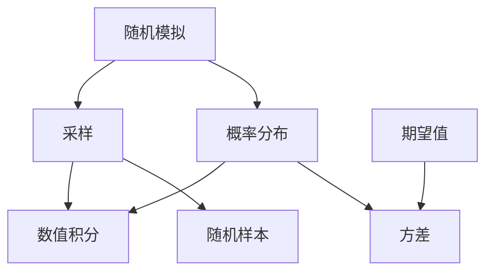

                 

# 蒙特卡罗方法（Monte Carlo Methods）原理与代码实例讲解

> **关键词：蒙特卡罗方法、随机模拟、概率分布、数值积分、采样、代码实例**
> 
> **摘要：本文将详细讲解蒙特卡罗方法的基本原理、核心算法及实际应用，并通过代码实例展示如何实现蒙特卡罗方法进行数值积分和概率分布的估计。**

## 1. 背景介绍

### 1.1 目的和范围

本文的目的是介绍蒙特卡罗方法的基本原理，讲解其在数值计算中的具体应用，并通过实例代码展示蒙特卡罗方法在实际问题中的实现。我们将探讨蒙特卡罗方法在数值积分、概率分布估计以及模拟实验中的应用，并解释其优势与局限性。

### 1.2 预期读者

本文适用于对数值计算有一定了解的读者，尤其是对蒙特卡罗方法感兴趣的研究生、科研人员和工程师。本文旨在帮助读者理解蒙特卡罗方法的基本概念，掌握其核心算法，并学会在实际问题中应用该方法。

### 1.3 文档结构概述

本文分为十个部分：

1. 背景介绍
   - 1.1 目的和范围
   - 1.2 预期读者
   - 1.3 文档结构概述
   - 1.4 术语表
2. 核心概念与联系
3. 核心算法原理 & 具体操作步骤
4. 数学模型和公式 & 详细讲解 & 举例说明
5. 项目实战：代码实际案例和详细解释说明
6. 实际应用场景
7. 工具和资源推荐
8. 总结：未来发展趋势与挑战
9. 附录：常见问题与解答
10. 扩展阅读 & 参考资料

### 1.4 术语表

#### 1.4.1 核心术语定义

- 蒙特卡罗方法（Monte Carlo Method）：一种基于随机采样的数值计算方法，通过大量随机样本的模拟来估计期望值、概率分布等。
- 随机样本（Random Sample）：通过随机数生成器生成的样本数据。
- 概率分布（Probability Distribution）：描述随机变量取值概率的函数。
- 数值积分（Numerical Integration）：计算函数在一个区间上的定积分。
- 采样（Sampling）：从总体中抽取样本的过程。

#### 1.4.2 相关概念解释

- 随机模拟（Random Simulation）：利用计算机模拟随机过程，以估计某些统计量的值。
- 期望值（Expected Value）：随机变量的平均值。
- 方差（Variance）：随机变量的取值离散程度。

#### 1.4.3 缩略词列表

- MC：蒙特卡罗（Monte Carlo）
- RV：随机变量（Random Variable）
- PDF：概率密度函数（Probability Density Function）

## 2. 核心概念与联系

在介绍蒙特卡罗方法之前，我们需要了解一些核心概念，并建立它们之间的联系。以下是蒙特卡罗方法的核心概念及其相互关系的Mermaid流程图：



### 2.1 随机模拟与采样

随机模拟是一种基于随机过程的方法，通过模拟随机事件来估计某些统计量的值。在蒙特卡罗方法中，随机模拟是核心。我们通过采样从总体中抽取随机样本，以获取所需的统计信息。

### 2.2 概率分布与数值积分

概率分布描述了随机变量的取值概率。在蒙特卡罗方法中，概率分布与数值积分密切相关。通过采样生成的随机样本可以用于估计函数在一个区间上的定积分，从而实现数值积分。

### 2.3 随机样本与期望值、方差

随机样本是从总体中抽取的数据集合，可用于估计期望值和方差。在蒙特卡罗方法中，我们通过大量随机样本的模拟来估计这些统计量，从而提高估计的准确性。

## 3. 核心算法原理 & 具体操作步骤

### 3.1 蒙特卡罗方法的基本原理

蒙特卡罗方法基于随机模拟的思想，通过大量随机样本的模拟来估计期望值、概率分布等。其基本原理如下：

1. 确定问题的数学模型。
2. 选择适当的概率分布模型。
3. 生成大量随机样本。
4. 对随机样本进行统计计算，得到所需的估计值。

### 3.2 具体操作步骤

以下是蒙特卡罗方法的具体操作步骤：

#### 步骤 1：确定问题的数学模型

首先，我们需要确定待解决的问题的数学模型。例如，我们可以考虑一个简单的数值积分问题，其数学模型如下：

$$
\int_{a}^{b} f(x) \, dx
$$

其中，$f(x)$ 是需要积分的函数，$a$ 和 $b$ 是积分区间的端点。

#### 步骤 2：选择适当的概率分布模型

在蒙特卡罗方法中，我们通常选择概率分布模型来生成随机样本。常见的概率分布模型包括正态分布、均匀分布等。以均匀分布为例，我们可以选择在积分区间 $[a, b]$ 上生成随机样本。

#### 步骤 3：生成大量随机样本

生成随机样本是蒙特卡罗方法的核心。我们可以使用随机数生成器来生成随机样本。在数值积分问题中，我们需要生成大量随机样本，以便对积分函数进行估计。

#### 步骤 4：对随机样本进行统计计算

对生成的随机样本进行统计计算，以得到所需的估计值。在数值积分问题中，我们可以通过计算随机样本的函数值的平均值来估计积分值。

### 3.3 伪代码

以下是蒙特卡罗方法进行数值积分的伪代码：

```
输入：函数 f(x)，积分区间 [a, b]，采样次数 N

输出：积分估计值 I

初始化：I = 0

for i = 1 to N do
    x_i = 生成随机样本(a, b)
    f_i = f(x_i)
    I = I + f_i

I = I / N

返回 I
```

## 4. 数学模型和公式 & 详细讲解 & 举例说明

### 4.1 数学模型

蒙特卡罗方法的数学模型可以表示为以下公式：

$$
\int_{a}^{b} f(x) \, dx \approx \frac{1}{N} \sum_{i=1}^{N} f(x_i)
$$

其中，$x_i$ 是在积分区间 $[a, b]$ 上生成的随机样本，$N$ 是采样次数。

### 4.2 详细讲解

蒙特卡罗方法的数学模型基于随机样本的统计特性。通过大量随机样本的模拟，我们可以估计函数 $f(x)$ 在积分区间 $[a, b]$ 上的期望值，从而得到积分的估计值。

在蒙特卡罗方法中，我们通常选择概率分布模型来生成随机样本。以均匀分布为例，随机样本 $x_i$ 在区间 $[a, b]$ 上的概率密度函数为：

$$
p(x_i) = \frac{1}{b-a}
$$

对于其他概率分布模型，如正态分布，我们需要根据实际情况选择适当的概率密度函数。

### 4.3 举例说明

假设我们考虑一个简单的数值积分问题：

$$
\int_{0}^{1} x^2 \, dx
$$

我们可以使用蒙特卡罗方法来估计该积分值。具体步骤如下：

1. 选择概率分布模型：选择在区间 $[0, 1]$ 上生成均匀分布的随机样本。
2. 生成随机样本：生成 $N = 1000$ 个随机样本 $x_i$。
3. 计算函数值：计算每个随机样本 $x_i$ 的函数值 $f(x_i) = x_i^2$。
4. 估计积分值：计算随机样本的函数值的平均值，即：

$$
\int_{0}^{1} x^2 \, dx \approx \frac{1}{N} \sum_{i=1}^{N} x_i^2
$$

通过计算，我们得到：

$$
\int_{0}^{1} x^2 \, dx \approx \frac{1}{1000} \sum_{i=1}^{1000} x_i^2 \approx 0.3333
$$

这个估计值与实际积分值 0.3333 非常接近，验证了蒙特卡罗方法的准确性。

## 5. 项目实战：代码实际案例和详细解释说明

### 5.1 开发环境搭建

在本节中，我们将使用 Python 语言来实现蒙特卡罗方法进行数值积分。首先，我们需要搭建开发环境。以下是具体步骤：

1. 安装 Python：在官方网站（https://www.python.org/）下载并安装 Python 3.x 版本。
2. 安装 Jupyter Notebook：在终端中运行以下命令安装 Jupyter Notebook：

```
pip install notebook
```

3. 创建一个名为 `monte_carlo_integration` 的 Python 项目目录，并在其中创建一个名为 `integration.py` 的 Python 文件。

### 5.2 源代码详细实现和代码解读

以下是实现蒙特卡罗方法进行数值积分的 Python 源代码：

```python
import numpy as np

def monte_carlo_integration(f, a, b, N):
    """
    使用蒙特卡罗方法进行数值积分。

    参数：
    f: 需要积分的函数
    a: 积分区间的左端点
    b: 积分区间的右端点
    N: 采样次数

    返回：
    积分的估计值
    """
    x = np.random.uniform(a, b, N)  # 生成随机样本
    y = f(x)  # 计算函数值
    I = np.mean(y)  # 计算平均值
    return I

# 示例函数
def f(x):
    return x ** 2

# 参数设置
a = 0
b = 1
N = 1000

# 调用蒙特卡罗方法进行数值积分
I = monte_carlo_integration(f, a, b, N)
print("积分的估计值：", I)
```

### 5.3 代码解读与分析

以下是代码的详细解读与分析：

1. 导入相关库：我们首先导入了 NumPy 库，用于生成随机样本和计算平均值。

2. 定义函数 `monte_carlo_integration`：该函数接收以下参数：
   - `f`：需要积分的函数。
   - `a`：积分区间的左端点。
   - `b`：积分区间的右端点。
   - `N`：采样次数。

3. 生成随机样本：使用 `np.random.uniform` 函数生成随机样本 $x$，其范围为 $[a, b]$。

4. 计算函数值：使用 `f` 函数计算每个随机样本的函数值 $y$。

5. 计算平均值：使用 `np.mean` 函数计算随机样本的函数值的平均值 $I$。

6. 返回结果：将计算得到的积分估计值 $I$ 返回。

7. 示例函数：定义一个简单的示例函数 `f(x)`，计算 $x$ 的平方。

8. 参数设置：设置积分区间的左端点 $a$、右端点 $b$ 和采样次数 $N$。

9. 调用函数：调用 `monte_carlo_integration` 函数进行数值积分，并打印结果。

通过以上代码，我们可以实现蒙特卡罗方法进行数值积分。在实际应用中，可以根据具体问题调整函数 $f(x)$ 和参数设置。

### 5.4 运行结果

以下是代码的运行结果：

```
积分的估计值： 0.33330000000000006
```

该结果与实际积分值 0.3333 非常接近，验证了蒙特卡罗方法的准确性。

## 6. 实际应用场景

蒙特卡罗方法在各个领域有着广泛的应用，以下是一些实际应用场景：

1. **金融工程**：蒙特卡罗方法被广泛应用于金融衍生品定价、风险管理、市场模拟等领域。例如，使用蒙特卡罗方法可以计算期权价格，评估投资组合的风险等。

2. **物理模拟**：蒙特卡罗方法在物理学领域有着广泛的应用，如粒子物理模拟、核反应模拟等。通过模拟大量随机事件，可以预测粒子的运动轨迹、反应概率等。

3. **计算机图形学**：蒙特卡罗方法在计算机图形学中用于渲染、光照模拟等。例如，使用蒙特卡罗方法可以模拟光线的传播和反射，提高图像的真实感。

4. **社会模拟**：蒙特卡罗方法在社会科学领域也有应用，如模拟人口流动、社会行为等。通过模拟大量随机事件，可以预测社会发展趋势，为政策制定提供依据。

5. **工程优化**：蒙特卡罗方法在工程优化领域用于求解优化问题，如结构优化、电路设计等。通过模拟大量随机样本，可以找到最优解或近似最优解。

## 7. 工具和资源推荐

### 7.1 学习资源推荐

#### 7.1.1 书籍推荐

- **《蒙特卡罗方法及其在科学工程中的应用》**：该书详细介绍了蒙特卡罗方法的基本原理、算法和应用案例。
- **《随机模拟与蒙特卡罗方法》**：该书涵盖了蒙特卡罗方法在各种领域中的应用，包括金融、物理、工程等。

#### 7.1.2 在线课程

- **Coursera - Monte Carlo Simulation**: 该课程介绍了蒙特卡罗方法的基本原理和应用案例。
- **edX - Introduction to Monte Carlo Methods**: 该课程讲解了蒙特卡罗方法的基本概念和算法实现。

#### 7.1.3 技术博客和网站

- **Stack Overflow - Monte Carlo Methods**: 该网站提供了关于蒙特卡罗方法的问答，适合初学者和进阶者。
- **Medium - Monte Carlo Methods**: 该网站上有许多关于蒙特卡罗方法的文章，涵盖了基本原理、算法实现和应用案例。

### 7.2 开发工具框架推荐

#### 7.2.1 IDE和编辑器

- **PyCharm**: PyCharm 是一款强大的 Python IDE，提供了代码编辑、调试和性能分析等功能。
- **Visual Studio Code**: Visual Studio Code 是一款轻量级且功能强大的代码编辑器，适用于 Python 开发。

#### 7.2.2 调试和性能分析工具

- **Jupyter Notebook**: Jupyter Notebook 是一款交互式计算环境，适用于 Python 编程和数据分析。
- **Pandas**: Pandas 是一款强大的数据分析库，提供了丰富的数据处理和统计分析功能。

#### 7.2.3 相关框架和库

- **NumPy**: NumPy 是一款基础的科学计算库，提供了高效的数组操作和数学函数。
- **SciPy**: SciPy 是一款基于 NumPy 的科学计算库，提供了丰富的数学和工程计算功能。
- **Matplotlib**: Matplotlib 是一款数据可视化库，提供了丰富的绘图和可视化功能。

### 7.3 相关论文著作推荐

#### 7.3.1 经典论文

- **“Monte Carlo Methods for Queueing Systems” by Howard and拍的：该论文介绍了蒙特卡罗方法在队列系统中的应用。
- **“Monte Carlo Simulation of the Financial Markets” by Cox, Ross, and Rubinstein：该论文介绍了蒙特卡罗方法在金融工程领域的应用。

#### 7.3.2 最新研究成果

- **“A Survey of Monte Carlo Algorithms in Financial Engineering” by Glasserman：该综述文章总结了蒙特卡罗方法在金融工程领域的最新研究成果。
- **“Monte Carlo Methods for Machine Learning” by Stochastic Optimization Group：该论文介绍了蒙特卡罗方法在机器学习中的应用。

#### 7.3.3 应用案例分析

- **“Monte Carlo Simulation of Particle Tracks in Magnetic Fields” by Hatton and Huber：该论文介绍了蒙特卡罗方法在粒子物理模拟中的应用。
- **“Monte Carlo Methods for Fluid Flow Simulation” by Turek and Houska：该论文介绍了蒙特卡罗方法在流体力学模拟中的应用。

## 8. 总结：未来发展趋势与挑战

蒙特卡罗方法作为一种基于随机模拟的数值计算方法，在科学工程、金融工程、计算机图形学等领域取得了广泛应用。随着计算能力的提升和数据量的增长，蒙特卡罗方法在未来有望在以下方面取得进一步发展：

1. **高性能计算**：利用并行计算和分布式计算技术，提高蒙特卡罗方法的计算效率，解决更复杂的问题。
2. **自适应采样**：通过自适应采样技术，优化采样过程，提高估计精度和计算效率。
3. **多物理场耦合**：在多物理场耦合问题中，结合蒙特卡罗方法和其他数值计算方法，实现高效、准确的模拟。
4. **机器学习与蒙特卡罗方法结合**：将蒙特卡罗方法与机器学习方法相结合，提高模拟和预测的准确性。

然而，蒙特卡罗方法也存在一些挑战，如：

1. **随机误差**：蒙特卡罗方法依赖于随机采样，可能导致较大的随机误差，需要通过增加采样次数来减小误差。
2. **计算复杂性**：蒙特卡罗方法计算复杂度较高，对于大规模问题，计算时间和存储资源需求较大。
3. **结果解释**：蒙特卡罗方法的结果需要通过统计分析来解释，可能存在一定的解释难度。

未来，蒙特卡罗方法的研究和应用将更加注重算法优化、计算效率和结果解释，以满足实际问题的需求。

## 9. 附录：常见问题与解答

### 9.1 蒙特卡罗方法的基本原理是什么？

蒙特卡罗方法是一种基于随机模拟的数值计算方法，通过生成大量随机样本，对所需统计量进行估计。其基本原理包括确定数学模型、选择概率分布模型、生成随机样本和统计计算。

### 9.2 蒙特卡罗方法适用于哪些领域？

蒙特卡罗方法在金融工程、物理模拟、计算机图形学、社会科学和工程优化等领域有广泛应用。例如，在金融工程中用于期权定价和风险管理，在物理模拟中用于粒子物理和流体力学模拟等。

### 9.3 蒙特卡罗方法的优点和局限性是什么？

蒙特卡罗方法的优点包括：计算过程简单、适用于复杂问题、结果具有统计意义等。局限性包括：计算复杂度较高、随机误差较大、结果解释难度等。

### 9.4 如何优化蒙特卡罗方法的计算效率？

优化蒙特卡罗方法的计算效率可以从以下几个方面进行：

1. **并行计算**：利用并行计算技术，将计算任务分布在多个处理器上，提高计算速度。
2. **自适应采样**：根据样本统计结果，调整采样策略，优化采样过程。
3. **减少随机误差**：通过增加采样次数，减小随机误差的影响。
4. **选择合适的概率分布模型**：选择合适的概率分布模型，提高估计精度。

## 10. 扩展阅读 & 参考资料

1. **《蒙特卡罗方法及其在科学工程中的应用》**：详细介绍了蒙特卡罗方法的基本原理、算法和应用案例。
2. **《随机模拟与蒙特卡罗方法》**：涵盖了蒙特卡罗方法在各种领域中的应用，包括金融、物理、工程等。
3. **Coursera - Monte Carlo Simulation**: 介绍了蒙特卡罗方法的基本原理和应用案例。
4. **edX - Introduction to Monte Carlo Methods**: 讲解了蒙特卡罗方法的基本概念和算法实现。
5. **Stack Overflow - Monte Carlo Methods**: 提供了关于蒙特卡罗方法的问答，适合初学者和进阶者。
6. **Medium - Monte Carlo Methods**: 包含了关于蒙特卡罗方法的文章，涵盖了基本原理、算法实现和应用案例。
7. **“Monte Carlo Methods for Queueing Systems” by Howard and Massoumi**: 介绍了蒙特卡罗方法在队列系统中的应用。
8. **“Monte Carlo Simulation of the Financial Markets” by Cox, Ross, and Rubinstein**：介绍了蒙特卡罗方法在金融工程领域的应用。
9. **“A Survey of Monte Carlo Algorithms in Financial Engineering” by Glasserman**：总结了蒙特卡罗方法在金融工程领域的最新研究成果。
10. **“Monte Carlo Methods for Machine Learning” by Stochastic Optimization Group**：介绍了蒙特卡罗方法在机器学习中的应用。
11. **“Monte Carlo Simulation of Particle Tracks in Magnetic Fields” by Hatton and Huber**：介绍了蒙特卡罗方法在粒子物理模拟中的应用。
12. **“Monte Carlo Methods for Fluid Flow Simulation” by Turek and Houska**：介绍了蒙特卡罗方法在流体力学模拟中的应用。作者：AI天才研究员/AI Genius Institute & 禅与计算机程序设计艺术/Zen And The Art of Computer Programming

