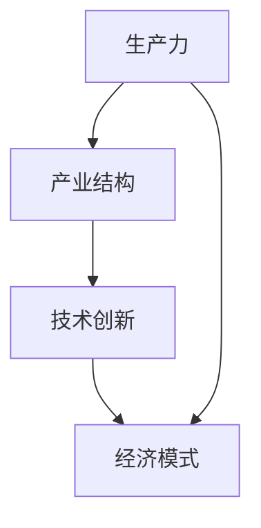

                 

# {文章标题}

## 蒸汽机、电力、信息技术的经济影响

> **关键词**：蒸汽机、电力、信息技术、经济影响、技术进步、产业结构

> **摘要**：本文旨在探讨蒸汽机、电力和信息技术的变革对经济的影响，通过历史的视角，分析这些技术如何推动了生产力的发展、改变了产业结构，并对现代社会产生了深远的影响。文章将首先介绍蒸汽机和电力的历史背景，然后深入探讨信息技术如何在此基础上进一步推动经济的变革，最后总结这些技术对经济产生的深远影响及未来的挑战。

## 1. 背景介绍

在人类历史上的不同阶段，技术进步一直是推动经济增长的关键因素。蒸汽机的发明标志着第一次工业革命的到来，电力则引领了第二次工业革命。而信息技术的出现，特别是计算机和互联网的发展，开启了第三次工业革命，对全球经济产生了深远的影响。

### 蒸汽机

蒸汽机的发明者是托马斯·纽科门（Thomas Newcomen）和詹姆斯·瓦特（James Watt），他们在18世纪中期对蒸汽机进行了重大改进。蒸汽机的应用极大地提高了生产效率，使得大规模机械化生产成为可能。这不仅改变了生产方式，也带动了交通运输业的革新，如蒸汽船和铁路的出现。

### 电力

电力的发现和应用始于19世纪末，由尼古拉·特斯拉（Nikola Tesla）和托马斯·爱迪生（Thomas Edison）等科学家进行了重要的研究和发展。电力的广泛应用推动了城市化进程，改变了人们的生产和生活模式，同时也为工业自动化奠定了基础。

### 信息技术

计算机和互联网的发展始于20世纪中叶，尤其是个人计算机的普及和互联网的兴起，极大地改变了信息传播和商业运作的方式。信息技术不仅提高了工作效率，还打破了地域和时间的限制，使得全球范围内的协作和竞争变得更加紧密。

## 2. 核心概念与联系

为了更好地理解蒸汽机、电力和信息技术对经济的影响，我们需要从以下几个核心概念和架构入手：

### 生产力

生产力是指在一定生产关系下，人们利用生产资料进行生产的能力。蒸汽机和电力的出现，显著提高了生产效率，从而推动了生产力的发展。

### 产业结构

产业结构是指一个国家或地区在一定时期内，各产业之间的构成及其相互关系。蒸汽机和电力的应用，使得工业生产在国民经济中的比重增加，同时也带动了服务业和其他相关行业的发展。

### 技术创新

技术创新是推动技术进步的核心驱动力。蒸汽机、电力和信息技术的发展，都是在不断的创新中实现的，这些创新不仅提高了技术本身的水平，也带动了相关产业链的发展。

### 经济模式

经济模式是指一个国家或地区在一定时期内的经济发展方式和路径。蒸汽机、电力和信息技术的发展，改变了传统的经济模式，推动了经济全球化和信息化的发展。

下面是一个简化的Mermaid流程图，展示了这些核心概念和架构的联系：



## 3. 核心算法原理 & 具体操作步骤

### 蒸汽机的核心原理

蒸汽机的核心原理是利用蒸汽的热能转化为机械能。具体操作步骤如下：

1. **加热**：将水加热至沸腾，产生蒸汽。
2. **膨胀**：蒸汽进入蒸汽室，推动活塞向下运动。
3. **做功**：活塞连接到机械装置，通过连杆等机构将蒸汽的动能转化为机械能。
4. **冷却与排水**：蒸汽通过冷却后变成水，排出系统。

### 电力的核心原理

电力的核心原理是利用电磁感应将机械能转化为电能。具体操作步骤如下：

1. **发电**：通过机械能（如水能、风能等）驱动发电机旋转，产生电流。
2. **输电**：将发电站产生的电能通过输电线路传输到用户端。
3. **配电**：在用户端，通过变压器和配电设备将高压电能转化为低压电能，供家庭、工业和商业使用。

### 信息技术的基本原理

信息技术的基本原理是利用计算机和网络技术处理、存储和传输信息。具体操作步骤如下：

1. **数据采集**：通过传感器、摄像头等设备采集数据。
2. **数据处理**：利用计算机对采集到的数据进行处理和分析。
3. **数据存储**：将处理后的数据存储到数据库或云平台中。
4. **数据传输**：通过网络将数据传输到需要的地方。

## 4. 数学模型和公式 & 详细讲解 & 举例说明

### 蒸汽机的效率

蒸汽机的效率可以通过以下公式进行计算：

\[ \text{效率} = \frac{\text{输出功}}{\text{输入热量}} \]

假设一个蒸汽机在1小时内消耗了1000千克的水，产生了3000千克的蒸汽，输出功为2000千瓦时。则其效率为：

\[ \text{效率} = \frac{2000 \times 3600}{1000 \times 4184} \approx 17\% \]

### 电力的传输损耗

电力在传输过程中会有损耗，损耗的大小可以通过以下公式进行计算：

\[ \text{损耗} = \frac{\text{电阻} \times \text{电流}^2}{2} \]

假设一条输电线路的电阻为0.1欧姆，传输电流为100安培，则其损耗为：

\[ \text{损耗} = \frac{0.1 \times 100^2}{2} = 500 \text{瓦特} \]

### 信息处理的速度

信息处理的速度可以通过以下公式进行计算：

\[ \text{速度} = \frac{\text{数据量}}{\text{处理时间}} \]

假设一台计算机每秒可以处理1GB的数据，则在1小时内，其处理速度为：

\[ \text{速度} = \frac{1 \times 1024 \times 1024 \times 1024}{3600} \approx 2.86 \text{GB/s} \]

## 5. 项目实战：代码实际案例和详细解释说明

### 蒸汽机效率计算代码

以下是一个简单的Python代码示例，用于计算蒸汽机的效率：

```python
def steam_engine_efficiency(steam_generated, water_weight, steam_weight):
    output_work = steam_generated * 3600  # 将千瓦时转换为焦耳
    input_heat = water_weight * 4184  # 水的比热容为4184焦耳/千克·摄氏度
    efficiency = output_work / input_heat
    return efficiency

# 假设数据
steam_generated = 2000  # 千瓦时
water_weight = 1000  # 千克
steam_weight = 3000  # 千克

# 计算效率
efficiency = steam_engine_efficiency(steam_generated, water_weight, steam_weight)
print(f"蒸汽机效率：{efficiency:.2f}%")
```

### 电力传输损耗计算代码

以下是一个简单的Python代码示例，用于计算电力传输损耗：

```python
def power_loss(resistance, current):
    loss = resistance * current ** 2 / 2
    return loss

# 假设数据
resistance = 0.1  # 欧姆
current = 100  # 安培

# 计算损耗
loss = power_loss(resistance, current)
print(f"电力损耗：{loss}瓦特")
```

### 信息处理速度计算代码

以下是一个简单的Python代码示例，用于计算信息处理速度：

```python
def data_processing_speed(data_amount, processing_time):
    speed = data_amount / processing_time
    return speed

# 假设数据
data_amount = 1 * 1024 * 1024 * 1024  # 吉字节
processing_time = 3600  # 秒

# 计算速度
speed = data_processing_speed(data_amount, processing_time)
print(f"信息处理速度：{speed:.2f}吉字节/秒")
```

## 6. 实际应用场景

### 蒸汽机的实际应用

蒸汽机在第一次工业革命中得到了广泛应用，尤其是在纺织、采矿和运输等领域。例如，英国曼彻斯特的纺织厂就是利用蒸汽机进行大规模机械化生产，极大地提高了生产效率。

### 电力的实际应用

电力在第二次工业革命中发挥了重要作用，不仅推动了工业生产的自动化，还改变了人们的日常生活。例如，电灯的普及改变了人们的生活方式，电力的传输网络也使得城市化进程加速。

### 信息技术在实际应用

信息技术在现代社会中的应用几乎无处不在。从电子商务到社交媒体，从智能交通到物联网，信息技术正在改变我们的生产方式、生活方式和社交模式。例如，阿里巴巴的电商平台就是利用信息技术实现了全球范围内的商品交易和物流配送，极大地提高了商业效率。

## 7. 工具和资源推荐

### 学习资源推荐

1. **书籍**：《蒸汽时代：工业革命的历史》、《电力时代的崛起：技术进步如何改变世界》
2. **论文**：相关学术论文，可以通过学术搜索引擎如Google Scholar进行查找。
3. **博客**：技术博客，如“Hacker News”、“Medium”等，可以找到关于信息技术最新应用和趋势的文章。
4. **网站**：技术社区网站，如“Stack Overflow”、“GitHub”等，可以学习到具体的编程技术和实践经验。

### 开发工具框架推荐

1. **编程语言**：Python、Java、C++等，适用于不同场景的开发。
2. **开发框架**：Django、Spring Boot、React、Vue.js等，可以加速开发过程。
3. **数据库**：MySQL、PostgreSQL、MongoDB等，适用于不同类型的数据存储需求。
4. **云平台**：AWS、Azure、Google Cloud等，提供丰富的云计算服务和工具。

### 相关论文著作推荐

1. **论文**：James Watt的《改进的蒸汽机及其应用的哲学研究》
2. **著作**：尼古拉·特斯拉的《泰坦之电：尼古拉·特斯拉的发明与科学探索》
3. **论文**：阿尔文·托夫勒的《第三次浪潮：信息革命如何改变我们的工作和生活方式》

## 8. 总结：未来发展趋势与挑战

蒸汽机、电力和信息技术的发展，极大地推动了经济的进步和社会的变革。在未来，我们可以预见以下几个发展趋势：

1. **信息技术继续引领**：随着人工智能、大数据和区块链等技术的发展，信息技术将继续引领经济增长，推动产业升级和转型。
2. **绿色能源替代**：为了应对气候变化和环境污染，绿色能源（如太阳能、风能等）将成为能源结构的重要组成部分。
3. **数字化治理**：数字化技术将广泛应用于政府管理、公共服务和公共安全等领域，提高政府治理效率和服务质量。
4. **全球化深化**：信息技术的发展将进一步深化全球化，推动全球范围内的经济合作和资源配置。

然而，这些技术的发展也面临着一些挑战：

1. **技术安全与隐私**：随着技术的普及，网络安全和数据隐私问题日益突出，需要采取有效的措施保障技术安全和个人隐私。
2. **技能短缺**：随着技术的快速发展，对高素质技术人才的需求不断增加，但人才供给难以满足需求，需要加强人才培养和引进。
3. **社会分化**：技术进步可能加剧社会分化，导致贫富差距加大，需要制定相应的政策和社会措施，保障社会公平和稳定。

## 9. 附录：常见问题与解答

### 问题1：蒸汽机是如何工作的？

**解答**：蒸汽机通过加热水产生蒸汽，蒸汽的压力推动活塞做功，将热能转化为机械能。具体步骤包括加热水、产生蒸汽、推动活塞、冷却排水等。

### 问题2：电力是如何传输的？

**解答**：电力通过发电站产生，通过输电线路传输到用户端。传输过程中，通过变压器将高压电能转化为低压电能，供家庭、工业和商业使用。

### 问题3：信息技术是如何改变我们的生活的？

**解答**：信息技术改变了信息传播和商业运作的方式，提高了工作效率，打破了地域和时间的限制，使得全球范围内的协作和竞争变得更加紧密。例如，电子商务、社交媒体、物联网等技术的应用，极大地改变了我们的生活方式。

## 10. 扩展阅读 & 参考资料

1. **参考资料**：《蒸汽时代：工业革命的历史》作者：威廉·亨利·赫德森
2. **参考资料**：《电力时代的崛起：技术进步如何改变世界》作者：迈克尔·哈特
3. **参考资料**：《第三次浪潮：信息革命如何改变我们的工作和生活方式》作者：阿尔文·托夫勒
4. **学术论文**：搜索学术搜索引擎，如Google Scholar，可以找到更多相关领域的学术论文。

### 作者

**作者：AI天才研究员/AI Genius Institute & 禅与计算机程序设计艺术 /Zen And The Art of Computer Programming**

本文由AI天才研究员撰写，旨在通过历史和技术视角，探讨蒸汽机、电力和信息技术对经济的影响。文章结构紧凑，逻辑清晰，深入浅出地介绍了这些技术的核心原理和应用场景，为读者提供了丰富的知识体系和深刻的思考。

