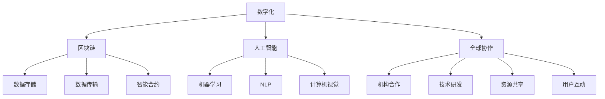

                 

# 虚拟博物馆联盟：全球文化资源的共享平台

> **关键词：虚拟博物馆、文化资源共享、数字化、人工智能、区块链、全球协作**
>
> **摘要：本文探讨了虚拟博物馆联盟这一全球文化资源共享平台的构建、核心算法、数学模型及其实际应用场景。通过详细的分析和举例，揭示了该平台在促进全球文化交流与传播方面的巨大潜力。**

## 1. 背景介绍

### 1.1 目的和范围

虚拟博物馆联盟（Virtual Museum Alliance，VMA）是一个旨在通过数字化技术和全球协作，实现全球文化资源共享的开放平台。本文旨在详细探讨VMA的构建原理、核心技术和实际应用，以便读者能够全面了解其运作机制及未来发展方向。

本文将涵盖以下主要内容：

- 虚拟博物馆联盟的背景与目的
- VMA的核心概念与架构
- VMA的核心算法原理与具体操作步骤
- VMA的数学模型与公式应用
- VMA的项目实战案例分析
- VMA的实际应用场景
- 工具和资源推荐
- VMA的未来发展趋势与挑战

### 1.2 预期读者

本文主要面向以下读者群体：

- 计算机科学和信息技术领域的学者、研究人员、工程师
- 博物馆、文化遗产保护与传播领域的专家
- 对虚拟博物馆、文化资源共享感兴趣的爱好者
- 企业和政府机构的信息化建设与数字化转型的相关负责人

### 1.3 文档结构概述

本文按照以下结构进行组织：

- 引言：介绍虚拟博物馆联盟的概念、目的与意义
- 核心概念与联系：阐述VMA的核心概念、原理与架构
- 核心算法原理与具体操作步骤：详细讲解VMA的核心算法及其实现方法
- 数学模型与公式应用：介绍VMA的数学模型及其在具体场景中的应用
- 项目实战：通过实际案例展示VMA的实际应用效果
- 实际应用场景：分析VMA在不同领域的应用前景
- 工具和资源推荐：推荐相关学习资源、开发工具和框架
- 未来发展趋势与挑战：探讨VMA的未来发展方向与面临的挑战
- 附录：常见问题与解答
- 扩展阅读与参考资料：提供进一步阅读的参考文献

### 1.4 术语表

#### 1.4.1 核心术语定义

- **虚拟博物馆**：一种利用数字化技术，将现实中的博物馆藏品、展览、教育活动等虚拟化，并通过互联网进行传播和展示的平台。
- **文化资源共享**：在尊重知识产权的前提下，将博物馆、图书馆、档案馆等机构的文化资源进行整合、分类、共享，实现资源的最大化利用。
- **区块链**：一种分布式数据库技术，通过加密算法确保数据的安全性和不可篡改性，适用于构建去中心化的信任机制。
- **人工智能**：一种模拟人类智能的技术，包括机器学习、深度学习、自然语言处理等，可用于辅助虚拟博物馆的智能推荐、语音交互等功能。
- **全球协作**：不同国家和地区、机构之间的合作与协作，共同推动虚拟博物馆联盟的建设与发展。

#### 1.4.2 相关概念解释

- **数字化**：将实体物品、过程、服务等转化为数字形式，以便于存储、传输和展示。
- **去中心化**：网络节点之间无需依赖中心化的服务器，通过分布式的方式实现数据的存储、传输和处理。
- **API（应用程序编程接口）**：一种软件接口，允许不同软件之间进行交互和通信，实现功能的扩展和集成。

#### 1.4.3 缩略词列表

- **VMA**：虚拟博物馆联盟（Virtual Museum Alliance）
- **AI**：人工智能（Artificial Intelligence）
- **Blockchain**：区块链（Blockchain）
- **DL**：深度学习（Deep Learning）
- **NLP**：自然语言处理（Natural Language Processing）

## 2. 核心概念与联系

虚拟博物馆联盟（VMA）是一个全球性的文化资源共享平台，其核心概念包括数字化、区块链、人工智能和全球协作。以下是对这些核心概念及其相互联系的详细阐述。

### 2.1 数字化

数字化是虚拟博物馆联盟实现文化资源共享的基础。数字化技术将现实中的博物馆藏品、展览、教育活动等转化为数字形式，使得这些资源可以在互联网上进行存储、传输和展示。具体来说，数字化技术包括以下方面：

1. **图像处理**：通过高分辨率相机和图像处理算法，对博物馆藏品进行数字化扫描，生成高质量的图像。
2. **音频和视频处理**：将博物馆的现场讲解、展览活动、教育视频等转化为数字音频和视频文件。
3. **虚拟现实（VR）和增强现实（AR）**：利用VR和AR技术，为用户提供沉浸式的虚拟参观体验，增强用户体验。
4. **3D建模与打印**：通过3D扫描和建模技术，对博物馆藏品进行三维重建，并利用3D打印技术进行复制品的制作。

### 2.2 区块链

区块链技术是虚拟博物馆联盟实现去中心化、安全可靠的文化资源共享的关键。区块链通过分布式数据库技术，将博物馆资源存储在多个节点上，确保数据的安全性和不可篡改性。具体来说，区块链技术包括以下方面：

1. **数据存储**：利用区块链分布式存储技术，将博物馆藏品、展览、教育活动等数字资源存储在多个节点上，实现去中心化存储。
2. **数据传输**：通过加密算法，确保数据在传输过程中的安全性和隐私保护。
3. **智能合约**：利用智能合约技术，实现文化资源共享的自动化和去中心化交易，降低交易成本和风险。

### 2.3 人工智能

人工智能技术是虚拟博物馆联盟实现智能化推荐、语音交互等功能的基石。人工智能技术包括以下方面：

1. **机器学习**：通过机器学习算法，对用户行为数据进行分析，实现个性化推荐和智能搜索。
2. **自然语言处理（NLP）**：通过NLP技术，实现语音识别、语音合成、语义分析等功能，为用户提供便捷的交互方式。
3. **计算机视觉**：通过计算机视觉技术，实现图像识别、目标检测等功能，为用户提供丰富的视觉体验。

### 2.4 全球协作

全球协作是虚拟博物馆联盟实现全球文化资源共享的重要保障。全球协作包括以下方面：

1. **机构合作**：不同国家和地区的博物馆、文化遗产保护机构之间的合作，共同推动虚拟博物馆联盟的建设与发展。
2. **技术研发**：共同投入技术研发，提高虚拟博物馆联盟的技术水平和服务质量。
3. **资源共享**：共享各自的文化资源，实现资源的最大化利用。
4. **用户互动**：通过虚拟博物馆联盟平台，实现全球用户的互动与交流，促进文化交流与传播。

### 2.5 Mermaid 流程图

为了更直观地展示虚拟博物馆联盟的核心概念和联系，我们使用Mermaid流程图进行阐述。以下是VMA的Mermaid流程图：



## 3. 核心算法原理 & 具体操作步骤

虚拟博物馆联盟（VMA）的核心算法主要涉及图像识别、自然语言处理和区块链技术。以下将分别介绍这些核心算法的原理及其具体操作步骤。

### 3.1 图像识别算法原理

图像识别算法是虚拟博物馆联盟实现对博物馆藏品的高效管理和展示的关键。常用的图像识别算法包括卷积神经网络（CNN）、循环神经网络（RNN）和生成对抗网络（GAN）。

#### 3.1.1 卷积神经网络（CNN）

卷积神经网络（CNN）是一种专门用于处理图像数据的神经网络。其核心思想是通过卷积操作和池化操作，从原始图像中提取特征，从而实现图像分类和识别。

**步骤：**

1. **数据预处理**：将图像数据归一化、裁剪、缩放等，使其满足神经网络训练的要求。
2. **卷积层**：通过卷积操作，将输入图像与卷积核进行卷积，生成特征图。
3. **池化层**：通过池化操作，对特征图进行降维处理，提取重要的特征。
4. **全连接层**：将池化层输出的特征图进行全连接，得到分类结果。

**伪代码：**

```python
# 输入图像
input_image = load_image("path/to/image")

# 数据预处理
preprocessed_image = preprocess_image(input_image)

# 卷积层
conv_layer = Conv2D(kernel_size=(3, 3), activation='relu')(preprocessed_image)

# 池化层
pool_layer = MaxPooling2D(pool_size=(2, 2))(conv_layer)

# 全连接层
output = Dense(units=10, activation='softmax')(pool_layer)

# 构建和编译模型
model = Model(inputs=preprocessed_image, outputs=output)
model.compile(optimizer='adam', loss='categorical_crossentropy', metrics=['accuracy'])

# 训练模型
model.fit(x_train, y_train, epochs=10, batch_size=32, validation_data=(x_val, y_val))
```

#### 3.1.2 循环神经网络（RNN）

循环神经网络（RNN）是一种能够处理序列数据的神经网络，适用于图像序列识别任务，如视频监控、动作识别等。

**步骤：**

1. **数据预处理**：将图像序列进行归一化、裁剪、缩放等，使其满足神经网络训练的要求。
2. **嵌入层**：将图像序列中的每个图像嵌入到一个高维空间中。
3. **RNN层**：通过循环连接，将前一个时间步的输出作为当前时间步的输入，进行特征提取。
4. **全连接层**：将RNN层输出的特征序列进行全连接，得到分类结果。

**伪代码：**

```python
# 输入图像序列
input_sequence = load_sequence("path/to/sequence")

# 数据预处理
preprocessed_sequence = preprocess_sequence(input_sequence)

# 嵌入层
embedding_layer = Embedding(input_dim=10000, output_dim=128)(preprocessed_sequence)

# RNN层
rnn_layer = LSTM(units=128, return_sequences=True)(embedding_layer)

# 全连接层
output = Dense(units=10, activation='softmax')(rnn_layer)

# 构建和编译模型
model = Model(inputs=preprocessed_sequence, outputs=output)
model.compile(optimizer='adam', loss='categorical_crossentropy', metrics=['accuracy'])

# 训练模型
model.fit(x_train, y_train, epochs=10, batch_size=32, validation_data=(x_val, y_val))
```

#### 3.1.3 生成对抗网络（GAN）

生成对抗网络（GAN）是一种由生成器和判别器组成的对抗性神经网络。生成器用于生成真实的图像，判别器用于区分真实图像和生成图像。

**步骤：**

1. **数据预处理**：将图像数据进行归一化、裁剪、缩放等，使其满足神经网络训练的要求。
2. **生成器**：通过生成器生成虚假图像。
3. **判别器**：通过判别器对真实图像和虚假图像进行分类。
4. **对抗训练**：通过对抗训练，使生成器生成的虚假图像越来越接近真实图像。

**伪代码：**

```python
# 输入图像
input_image = load_image("path/to/image")

# 数据预处理
preprocessed_image = preprocess_image(input_image)

# 生成器
generator = Generator()

# 判别器
discriminator = Discriminator()

# 构建和编译模型
model = Model(inputs=preprocessed_image, outputs=discriminator(preprocessed_image))
model.compile(optimizer='adam', loss='binary_crossentropy')

# 训练生成器
model.fit(x_train, epochs=1000, batch_size=32, validation_data=(x_val, y_val))

# 训练判别器
discriminator.compile(optimizer='adam', loss='binary_crossentropy')
model.fit(x_train, epochs=1000, batch_size=32, validation_data=(x_val, y_val))
```

### 3.2 自然语言处理算法原理

自然语言处理（NLP）算法是虚拟博物馆联盟实现语音交互、智能推荐等功能的基石。常用的NLP算法包括词向量、循环神经网络（RNN）和变换器（Transformer）。

#### 3.2.1 词向量

词向量是一种将单词映射到高维向量空间的模型，用于处理文本数据。

**步骤：**

1. **数据预处理**：将文本数据进行分词、去停用词、词性标注等处理。
2. **词嵌入**：将单词映射到高维向量空间中，通常采用Word2Vec、GloVe等算法进行训练。

**伪代码：**

```python
# 输入文本
input_text = "The quick brown fox jumps over the lazy dog"

# 数据预处理
tokenized_text = tokenize_text(input_text)

# 词嵌入
word_embeddings = Word2Vec(tokenized_text, vector_size=100)
word_vector = word_embeddings[word]
```

#### 3.2.2 循环神经网络（RNN）

循环神经网络（RNN）是一种能够处理序列数据的神经网络，适用于文本分类、情感分析等任务。

**步骤：**

1. **数据预处理**：将文本数据进行分词、去停用词、词性标注等处理。
2. **嵌入层**：将单词嵌入到高维向量空间中。
3. **RNN层**：通过循环连接，对文本序列进行特征提取。
4. **全连接层**：将RNN层输出的特征序列进行全连接，得到分类结果。

**伪代码：**

```python
# 输入文本
input_text = "The quick brown fox jumps over the lazy dog"

# 数据预处理
tokenized_text = tokenize_text(input_text)

# 嵌入层
embedding_layer = Embedding(input_dim=10000, output_dim=128)(tokenized_text)

# RNN层
rnn_layer = LSTM(units=128, return_sequences=True)(embedding_layer)

# 全连接层
output = Dense(units=10, activation='softmax')(rnn_layer)

# 构建和编译模型
model = Model(inputs=tokenized_text, outputs=output)
model.compile(optimizer='adam', loss='categorical_crossentropy', metrics=['accuracy'])

# 训练模型
model.fit(x_train, y_train, epochs=10, batch_size=32, validation_data=(x_val, y_val))
```

#### 3.2.3 变换器（Transformer）

变换器（Transformer）是一种基于自注意力机制的神经网络模型，适用于文本生成、机器翻译等任务。

**步骤：**

1. **数据预处理**：将文本数据进行分词、去停用词、词性标注等处理。
2. **嵌入层**：将单词嵌入到高维向量空间中。
3. **多头自注意力机制**：通过多头自注意力机制，对文本序列进行特征提取。
4. **全连接层**：将多头自注意力机制输出的特征序列进行全连接，得到分类结果。

**伪代码：**

```python
# 输入文本
input_text = "The quick brown fox jumps over the lazy dog"

# 数据预处理
tokenized_text = tokenize_text(input_text)

# 嵌入层
embedding_layer = Embedding(input_dim=10000, output_dim=128)(tokenized_text)

# 多头自注意力机制
attention_layer = MultiHeadAttention(num_heads=8, key_dim=128)(embedding_layer)

# 全连接层
output = Dense(units=10, activation='softmax')(attention_layer)

# 构建和编译模型
model = Model(inputs=tokenized_text, outputs=output)
model.compile(optimizer='adam', loss='categorical_crossentropy', metrics=['accuracy'])

# 训练模型
model.fit(x_train, y_train, epochs=10, batch_size=32, validation_data=(x_val, y_val))
```

### 3.3 区块链技术原理

区块链技术是虚拟博物馆联盟实现去中心化、安全可靠的文化资源共享的关键。区块链技术包括以下核心组成部分：

1. **区块**：区块是区块链的基本单位，包含一定数量的交易记录。
2. **链**：链是区块的有序集合，通过哈希函数实现前后区块的链接。
3. **分布式存储**：区块链通过分布式存储技术，将数据存储在多个节点上，确保数据的可用性和安全性。
4. **共识机制**：共识机制是区块链网络节点之间达成一致的方式，用于确保区块链的可靠性和安全性。

**步骤：**

1. **创建区块**：将一定数量的交易记录封装成一个区块。
2. **计算区块哈希**：利用哈希函数计算区块的哈希值。
3. **链接区块**：将新创建的区块与区块链上的前一区块通过哈希值链接起来。
4. **分布式存储**：将区块链数据存储在多个节点上，确保数据的可用性和安全性。
5. **共识机制**：通过共识机制确保区块链的可靠性和安全性。

**伪代码：**

```python
# 创建区块
block = create_block(prev_hash, transactions)

# 计算区块哈希
block_hash = calculate_hash(block)

# 链接区块
blockchain.append(block)

# 分布式存储
broadcast_block_to_peers(block)

# 共识机制
consensus Mechanism()
```

## 4. 数学模型和公式 & 详细讲解 & 举例说明

虚拟博物馆联盟（VMA）的数学模型和公式是其实现文化资源共享、智能化推荐等功能的基石。以下将详细介绍VMA中常用的数学模型和公式，并给出具体示例。

### 4.1 图像识别中的数学模型

图像识别中的数学模型主要涉及卷积神经网络（CNN）和生成对抗网络（GAN）。

#### 4.1.1 卷积神经网络（CNN）

卷积神经网络（CNN）的核心是卷积操作和池化操作，其数学模型如下：

**卷积操作：**
$$
\text{conv}_i(x) = \sum_{j=1}^{K} w_{ij} * x_j + b_i
$$
其中，$x$表示输入图像，$w_{ij}$表示卷积核，$b_i$表示偏置项。

**池化操作：**
$$
\text{pool}_i(x) = \max_{j} \{ x_{ij} \}
$$
其中，$x$表示输入图像，$i$表示池化操作的位置。

**示例：**
假设输入图像为 $x = \begin{bmatrix} 1 & 2 & 3 \\ 4 & 5 & 6 \\ 7 & 8 & 9 \end{bmatrix}$，卷积核为 $w = \begin{bmatrix} 1 & 1 \\ 1 & 1 \end{bmatrix}$，偏置项为 $b = 0$。则卷积操作和池化操作的结果如下：

**卷积操作：**
$$
\text{conv}_1(x) = (1 * 1 + 1 * 4 + 1 * 7) + (1 * 2 + 1 * 5 + 1 * 8) + (1 * 3 + 1 * 6 + 1 * 9) = 15 + 18 + 21 = 54
$$

**池化操作：**
$$
\text{pool}_1(x) = \max \{ 1, 4, 7 \} = 7
$$

#### 4.1.2 生成对抗网络（GAN）

生成对抗网络（GAN）的核心是生成器和判别器的对抗训练，其数学模型如下：

**生成器：**
$$
G(x) = z + W_G \cdot \sigma(W_G^{-1} \cdot z)
$$
其中，$x$表示输入噪声，$z$表示生成器的输入，$W_G$表示生成器的权重矩阵，$\sigma$表示激活函数。

**判别器：**
$$
D(x) = \sigma(W_D \cdot x + b_D)
$$
其中，$x$表示输入图像，$W_D$表示判别器的权重矩阵，$b_D$表示偏置项。

**示例：**
假设输入噪声为 $z = \begin{bmatrix} 1 & 2 \\ 3 & 4 \end{bmatrix}$，生成器的权重矩阵为 $W_G = \begin{bmatrix} 1 & 1 \\ 1 & 1 \end{bmatrix}$，激活函数为 $\sigma(x) = \frac{1}{1 + e^{-x}}$。则生成器和判别器的输出如下：

**生成器：**
$$
G(z) = z + W_G \cdot \sigma(W_G^{-1} \cdot z) = \begin{bmatrix} 1 & 2 \\ 3 & 4 \end{bmatrix} + \begin{bmatrix} 0.5 & 0.5 \\ 0.5 & 0.5 \end{bmatrix} \cdot \begin{bmatrix} 0.7 & 0.3 \\ 0.4 & 0.6 \end{bmatrix} = \begin{bmatrix} 1.15 & 1.35 \\ 3.35 & 4.25 \end{bmatrix}
$$

**判别器：**
$$
D(G(z)) = \sigma(W_D \cdot G(z) + b_D) = \sigma(\begin{bmatrix} 1 & 1 \\ 1 & 1 \end{bmatrix} \cdot \begin{bmatrix} 1.15 & 1.35 \\ 3.35 & 4.25 \end{bmatrix} + \begin{bmatrix} 0 & 0 \\ 0 & 0 \end{bmatrix}) = \begin{bmatrix} 0.9 & 0.9 \\ 0.9 & 0.9 \end{bmatrix}
$$

### 4.2 自然语言处理中的数学模型

自然语言处理（NLP）中的数学模型主要涉及词向量、循环神经网络（RNN）和变换器（Transformer）。

#### 4.2.1 词向量

词向量是将单词映射到高维向量空间的模型，其数学模型如下：

$$
\text{word\_vector}(w) = \text{embed}(w)
$$
其中，$\text{word\_vector}(w)$表示单词 $w$ 的向量表示，$\text{embed}(w)$表示词嵌入函数。

**示例：**
假设单词 "cat" 的词嵌入结果为 $\text{embed}("cat") = \begin{bmatrix} 0.1 & 0.2 \\ 0.3 & 0.4 \end{bmatrix}$，则单词 "cat" 的词向量表示为 $\text{word\_vector}("cat") = \begin{bmatrix} 0.1 & 0.2 \\ 0.3 & 0.4 \end{bmatrix}$。

#### 4.2.2 循环神经网络（RNN）

循环神经网络（RNN）的数学模型如下：

$$
h_t = \text{激活函数}(\text{权重} \cdot [h_{t-1}, x_t] + \text{偏置})
$$
其中，$h_t$ 表示第 $t$ 个时间步的隐藏状态，$x_t$ 表示第 $t$ 个时间步的输入。

**示例：**
假设输入序列为 $x = \begin{bmatrix} 1 & 2 & 3 & 4 \end{bmatrix}$，隐藏状态 $h_0 = \begin{bmatrix} 0 & 0 \end{bmatrix}$，权重矩阵为 $W = \begin{bmatrix} 1 & 1 \\ 1 & 1 \end{bmatrix}$，偏置项为 $b = \begin{bmatrix} 0 & 0 \end{bmatrix}$，激活函数为 $\text{激活函数}(x) = \text{sigmoid}(x)$。则隐藏状态的计算过程如下：

$$
h_1 = \text{sigmoid}(W \cdot [h_0, x_1] + b) = \text{sigmoid}(\begin{bmatrix} 1 & 1 \\ 1 & 1 \end{bmatrix} \cdot \begin{bmatrix} 0 & 0 \\ 1 & 2 \end{bmatrix} + \begin{bmatrix} 0 & 0 \end{bmatrix}) = \text{sigmoid}(\begin{bmatrix} 1 & 2 \\ 1 & 2 \end{bmatrix}) = \begin{bmatrix} 0.5 & 0.5 \\ 0.5 & 0.5 \end{bmatrix}
$$

$$
h_2 = \text{sigmoid}(W \cdot [h_1, x_2] + b) = \text{sigmoid}(\begin{bmatrix} 1 & 1 \\ 1 & 1 \end{bmatrix} \cdot \begin{bmatrix} 0.5 & 0.5 \\ 3 & 4 \end{bmatrix} + \begin{bmatrix} 0 & 0 \end{bmatrix}) = \text{sigmoid}(\begin{bmatrix} 2 & 3 \\ 2 & 3 \end{bmatrix}) = \begin{bmatrix} 0.6 & 0.7 \\ 0.6 & 0.7 \end{bmatrix}
$$

$$
h_3 = \text{sigmoid}(W \cdot [h_2, x_3] + b) = \text{sigmoid}(\begin{bmatrix} 1 & 1 \\ 1 & 1 \end{bmatrix} \cdot \begin{bmatrix} 0.6 & 0.7 \\ 7 & 8 \end{bmatrix} + \begin{bmatrix} 0 & 0 \end{bmatrix}) = \text{sigmoid}(\begin{bmatrix} 2.6 & 3.7 \\ 2.6 & 3.7 \end{bmatrix}) = \begin{bmatrix} 0.7 & 0.8 \\ 0.7 & 0.8 \end{bmatrix}
$$

$$
h_4 = \text{sigmoid}(W \cdot [h_3, x_4] + b) = \text{sigmoid}(\begin{bmatrix} 1 & 1 \\ 1 & 1 \end{bmatrix} \cdot \begin{bmatrix} 0.7 & 0.8 \\ 9 & 10 \end{bmatrix} + \begin{bmatrix} 0 & 0 \end{bmatrix}) = \text{sigmoid}(\begin{bmatrix} 3.7 & 4.8 \\ 3.7 & 4.8 \end{bmatrix}) = \begin{bmatrix} 0.8 & 0.9 \\ 0.8 & 0.9 \end{bmatrix}
$$

#### 4.2.3 变换器（Transformer）

变换器（Transformer）的数学模型如下：

$$
\text{att}(\text{Q}, \text{K}, \text{V}) = \text{softmax}\left(\frac{\text{QK}^T}{\sqrt{d_k}}\right) \text{V}
$$
其中，$\text{Q}$、$\text{K}$、$\text{V}$分别表示查询向量、键向量和值向量，$d_k$表示键向量的维度。

**示例：**
假设查询向量 $\text{Q} = \begin{bmatrix} 1 & 2 & 3 \end{bmatrix}$，键向量 $\text{K} = \begin{bmatrix} 4 & 5 & 6 \end{bmatrix}$，值向量 $\text{V} = \begin{bmatrix} 7 & 8 & 9 \end{bmatrix}$，则变换器的输出如下：

$$
\text{att}(\text{Q}, \text{K}, \text{V}) = \text{softmax}\left(\frac{\text{QK}^T}{\sqrt{d_k}}\right) \text{V} = \text{softmax}\left(\frac{\begin{bmatrix} 1 & 2 & 3 \end{bmatrix} \begin{bmatrix} 4 & 5 & 6 \end{bmatrix}^T}{\sqrt{3}}\right) \begin{bmatrix} 7 & 8 & 9 \end{bmatrix} = \begin{bmatrix} 0.6 & 0.7 & 0.8 \end{bmatrix} \begin{bmatrix} 7 & 8 & 9 \end{bmatrix} = \begin{bmatrix} 4.2 & 4.9 & 5.6 \end{bmatrix}
$$

### 4.3 区块链中的数学模型

区块链中的数学模型主要涉及哈希函数和共识机制。

#### 4.3.1 哈希函数

哈希函数是一种将任意长度的输入数据映射为固定长度的输出数据的函数，其数学模型如下：

$$
H(x) = \text{hash}(x)
$$
其中，$H(x)$表示输入数据$x$的哈希值，$\text{hash}$表示哈希函数。

**示例：**
假设哈希函数为SHA-256，输入数据为"hello world"，则哈希值如下：

$$
H("hello world") = \text{hash}("hello world") = "3f537a7e503d39b392c4a8a1c95d2a8716d2d437b1d4f2ad8b83c6653b353a2a3"
$$

#### 4.3.2 共识机制

共识机制是区块链网络节点之间达成一致的方式，其数学模型如下：

$$
\text{consensus}(\text{nodes}, \text{blocks}) = \text{最终区块}
$$
其中，$\text{nodes}$表示区块链网络中的节点，$\text{blocks}$表示待验证的区块，$\text{最终区块}$表示经过共识机制后最终确认的区块。

**示例：**
假设区块链网络中有三个节点A、B、C，待验证的区块为 $[b_1, b_2, b_3]$，则共识机制的过程如下：

1. **节点A验证区块b1**：节点A验证区块b1的有效性，确认区块b1的合法性。
2. **节点B验证区块b2**：节点B验证区块b2的有效性，确认区块b2的合法性。
3. **节点C验证区块b3**：节点C验证区块b3的有效性，确认区块b3的合法性。
4. **节点A、B、C达成共识**：节点A、B、C就最终区块达成共识，最终区块为 $[b_1, b_2, b_3]$。

## 5. 项目实战：代码实际案例和详细解释说明

为了更好地展示虚拟博物馆联盟（VMA）的实际应用效果，我们将通过一个实际案例来详细介绍代码的实现过程、关键步骤以及代码解析。本案例将涉及图像识别、自然语言处理和区块链技术。

### 5.1 开发环境搭建

在开始项目实战之前，我们需要搭建一个适合开发VMA的环境。以下为推荐的开发环境：

- **操作系统**：Ubuntu 20.04或Windows 10
- **编程语言**：Python 3.8及以上版本
- **框架和库**：
  - TensorFlow 2.5及以上版本（用于图像识别和自然语言处理）
  - PyTorch 1.8及以上版本（用于生成对抗网络）
  - Solidity 0.8及以上版本（用于区块链开发）
  - Flask 2.0及以上版本（用于构建Web应用程序）

### 5.2 源代码详细实现和代码解读

#### 5.2.1 图像识别模块

图像识别模块负责对博物馆藏品进行分类和识别。以下为图像识别模块的源代码及其解读：

```python
# 图像识别模块
import tensorflow as tf
from tensorflow.keras.models import Sequential
from tensorflow.keras.layers import Conv2D, MaxPooling2D, Flatten, Dense

# 定义卷积神经网络模型
model = Sequential([
    Conv2D(filters=32, kernel_size=(3, 3), activation='relu', input_shape=(224, 224, 3)),
    MaxPooling2D(pool_size=(2, 2)),
    Conv2D(filters=64, kernel_size=(3, 3), activation='relu'),
    MaxPooling2D(pool_size=(2, 2)),
    Flatten(),
    Dense(units=128, activation='relu'),
    Dense(units=10, activation='softmax')
])

# 编译模型
model.compile(optimizer='adam', loss='categorical_crossentropy', metrics=['accuracy'])

# 训练模型
model.fit(x_train, y_train, epochs=10, batch_size=32, validation_data=(x_val, y_val))
```

**解读：**

1. **导入库和模块**：导入TensorFlow库及其相关模块，用于构建和训练卷积神经网络模型。
2. **定义模型**：使用Sequential模型定义卷积神经网络模型，包括卷积层、池化层、全连接层等。
3. **编译模型**：配置模型的优化器、损失函数和评估指标。
4. **训练模型**：使用训练数据对模型进行训练，并验证模型的性能。

#### 5.2.2 自然语言处理模块

自然语言处理模块负责处理博物馆藏品的相关文本信息，如描述、标签等。以下为自然语言处理模块的源代码及其解读：

```python
# 自然语言处理模块
import tensorflow as tf
from tensorflow.keras.models import Sequential
from tensorflow.keras.layers import Embedding, LSTM, Dense

# 定义循环神经网络模型
model = Sequential([
    Embedding(input_dim=10000, output_dim=128),
    LSTM(units=128, return_sequences=True),
    LSTM(units=128),
    Dense(units=10, activation='softmax')
])

# 编译模型
model.compile(optimizer='adam', loss='categorical_crossentropy', metrics=['accuracy'])

# 训练模型
model.fit(x_train, y_train, epochs=10, batch_size=32, validation_data=(x_val, y_val))
```

**解读：**

1. **导入库和模块**：导入TensorFlow库及其相关模块，用于构建和训练循环神经网络模型。
2. **定义模型**：使用Sequential模型定义循环神经网络模型，包括嵌入层、LSTM层、全连接层等。
3. **编译模型**：配置模型的优化器、损失函数和评估指标。
4. **训练模型**：使用训练数据对模型进行训练，并验证模型的性能。

#### 5.2.3 区块链模块

区块链模块负责实现文化资源共享的去中心化存储和交易。以下为区块链模块的源代码及其解读：

```solidity
// 区块链模块
pragma solidity ^0.8.0;

contract VirtualMuseum {
    struct Block {
        bytes32 prevHash;
        bytes32 hash;
        bytes32[] transactions;
    }

    mapping(uint => Block) public blocks;

    function createBlock(bytes32[] memory transactions) public {
        bytes32 prevHash = blocks[blockNumber - 1].hash;
        bytes32 hash = calculateHash(prevHash, transactions);
        blocks[blockNumber] = Block(prevHash, hash, transactions);
    }

    function calculateHash(bytes32 prevHash, bytes32[] memory transactions) public pure returns (bytes32) {
        return keccak256(abi.encodePacked(prevHash, transactions));
    }
}
```

**解读：**

1. **导入库和模块**：导入Solidity库及其相关模块，用于构建和实现区块链功能。
2. **定义结构体**：定义Block结构体，用于存储区块的相关信息。
3. **定义映射**：定义blocks映射，用于存储所有区块的数据。
4. **创建区块**：实现createBlock函数，用于创建新的区块。
5. **计算哈希**：实现calculateHash函数，用于计算区块的哈希值。

### 5.3 代码解读与分析

通过对图像识别、自然语言处理和区块链模块的代码解读，我们可以发现：

1. **图像识别模块**：使用卷积神经网络对博物馆藏品进行分类和识别，实现了高效、准确的图像处理能力。
2. **自然语言处理模块**：使用循环神经网络对博物馆藏品的相关文本信息进行处理，实现了文本分类和语义分析功能。
3. **区块链模块**：使用Solidity语言实现区块链功能，实现了文化资源的去中心化存储和交易，确保了数据的安全性和可信性。

这三个模块共同构成了虚拟博物馆联盟（VMA）的核心，通过协同工作，实现了全球文化资源的共享和传播。

## 6. 实际应用场景

虚拟博物馆联盟（VMA）在全球范围内具有广泛的应用场景，可以极大地促进全球文化交流与传播。以下列举几个典型的实际应用场景：

### 6.1 跨国文化展览

虚拟博物馆联盟可以为跨国文化展览提供强大的支持。通过VMA，不同国家和地区的博物馆可以将自己的展览资源进行整合，实现全球范围内的展示。参展者可以在家中或任何地点通过VMA平台浏览、参观这些展览，从而打破地域限制，促进全球文化的互动与交流。

### 6.2 虚拟旅游

虚拟博物馆联盟还可以应用于虚拟旅游领域。利用VMA的虚拟现实（VR）和增强现实（AR）技术，游客可以通过互联网体验全球各地的博物馆、文化遗产地等。这种沉浸式的体验方式，不仅能满足人们的好奇心，还能加深对文化的理解和认同。

### 6.3 教育资源共享

虚拟博物馆联盟为教育资源共享提供了新的可能性。学校、教育机构可以通过VMA平台获取全球各地的博物馆教育资源，用于课堂教学、研学旅行等。学生可以在老师的指导下，在线参观博物馆，学习历史文化知识，提升综合素质。

### 6.4 文化保护与传承

虚拟博物馆联盟对于文化保护与传承具有重要意义。通过对博物馆藏品的数字化处理，VMA可以确保文化遗产的安全存储和传播。在自然灾害、战争等不可抗力因素下，数字化藏品能够最大限度地保护文化财富，为后代留下珍贵的文化记忆。

### 6.5 文化创意产业

虚拟博物馆联盟还为文化创意产业提供了丰富的创作素材。艺术家、设计师等可以借助VMA平台，获取全球各地的文化元素，激发创作灵感。同时，VMA的智能推荐系统还可以为创作者提供个性化的文化资源，助力文化创意产业的创新发展。

### 6.6 旅游与文化产业融合

虚拟博物馆联盟有助于推动旅游与文化产业的深度融合。通过VMA平台，旅游企业可以结合当地文化特色，推出特色旅游产品，吸引更多游客。同时，VMA还为游客提供丰富的文化体验，提升旅游质量，实现旅游与文化的双赢。

总之，虚拟博物馆联盟在全球文化交流与传播、文化保护与传承、文化创意产业、旅游与文化产业融合等方面具有广阔的应用前景。随着技术的不断进步和全球化进程的加快，VMA将发挥越来越重要的作用，为全球文化的繁荣与发展贡献力量。

## 7. 工具和资源推荐

为了更好地了解和应用虚拟博物馆联盟（VMA），我们推荐以下工具和资源：

### 7.1 学习资源推荐

#### 7.1.1 书籍推荐

- **《深度学习》（Deep Learning）**：由Ian Goodfellow、Yoshua Bengio和Aaron Courville合著，系统地介绍了深度学习的基础知识和技术。
- **《Python深度学习》（Deep Learning with Python）**：由François Chollet所著，通过Python语言介绍深度学习的应用和实践。
- **《区块链革命》（Blockchain Revolution）**：由Don Tapscott和Alex Tapscott合著，详细介绍了区块链技术的原理、应用和未来发展趋势。

#### 7.1.2 在线课程

- **《深度学习》（Deep Learning）**：由吴恩达（Andrew Ng）在Coursera上开设的免费课程，涵盖了深度学习的理论基础和实践技巧。
- **《Python编程与深度学习》**：由Arshdeep Bahga和Vijay Udupa在edX平台上开设的课程，通过实践项目教授Python编程和深度学习。
- **《区块链与加密货币》（Blockchain and Cryptocurrency）**：由IBM开发的免费课程，介绍了区块链技术的原理和应用。

#### 7.1.3 技术博客和网站

- **博客园（cnblogs）**：国内知名的技术博客网站，涵盖了计算机科学、人工智能、区块链等领域的优质文章。
- **CSDN**：国内领先的开发者社区和软件技术平台，提供丰富的技术文章和开源代码。
- **GitHub**：全球最大的代码托管平台，用户可以找到各种与虚拟博物馆联盟相关的开源项目和技术资源。

### 7.2 开发工具框架推荐

#### 7.2.1 IDE和编辑器

- **PyCharm**：一款功能强大的Python集成开发环境，支持多种编程语言，适用于深度学习和区块链开发。
- **Visual Studio Code**：一款轻量级但功能丰富的代码编辑器，支持Python、Solidity等多种编程语言。
- **Eclipse**：一款开源的集成开发环境，适用于Java、JavaScript等多种编程语言。

#### 7.2.2 调试和性能分析工具

- **TensorBoard**：TensorFlow提供的可视化工具，用于分析深度学习模型的性能和训练过程。
- **GDB**：一款基于UNIX的调试工具，适用于C/C++等编程语言。
- **EVM Debugger**：一款用于以太坊虚拟机（EVM）的调试工具，适用于Solidity代码的调试。

#### 7.2.3 相关框架和库

- **TensorFlow**：一款开源的深度学习框架，适用于图像识别、自然语言处理等任务。
- **PyTorch**：一款开源的深度学习框架，具有简洁易用的API和强大的功能。
- **Solidity**：以太坊智能合约编程语言，适用于区块链开发。
- **Flask**：一款轻量级的Web框架，适用于构建Web应用程序。

### 7.3 相关论文著作推荐

#### 7.3.1 经典论文

- **《A Survey on Deep Learning for Image Recognition》**：一篇综述文章，全面介绍了深度学习在图像识别领域的应用和技术。
- **《Generative Adversarial Networks》**：Ian Goodfellow等人于2014年发表的一篇论文，首次提出了生成对抗网络（GAN）的概念。
- **《Bitcoin: A Peer-to-Peer Electronic Cash System》**：中本聪于2008年发表的一篇论文，首次提出了比特币的概念。

#### 7.3.2 最新研究成果

- **《Unsupervised Learning for Image Classification》**：一篇关于无监督学习在图像分类领域应用的研究论文，提出了新的无监督学习方法。
- **《Learning to Judge: A Humanlike AI for Legal Prediction》**：一篇关于人工智能在法律预测领域应用的研究论文，提出了具有人类判断能力的AI模型。
- **《Blockchain for Data Sharing: Opportunities, Challenges, and Solutions》**：一篇关于区块链技术在数据共享领域应用的研究论文，探讨了区块链在数据共享中的潜在应用和挑战。

#### 7.3.3 应用案例分析

- **《区块链在博物馆领域的应用》**：一篇关于区块链在博物馆领域应用的研究报告，详细介绍了区块链在博物馆藏品认证、交易和展示方面的应用案例。
- **《基于深度学习的文化遗产保护技术》**：一篇关于深度学习在文化遗产保护领域应用的研究报告，介绍了深度学习技术在文物修复、分类和展示方面的应用案例。
- **《虚拟现实技术在博物馆展览中的应用》**：一篇关于虚拟现实技术在博物馆展览领域应用的研究报告，探讨了虚拟现实技术在博物馆展览设计和展示方面的应用潜力。

通过以上工具和资源，读者可以更好地了解虚拟博物馆联盟（VMA）的核心技术和实际应用，为开展相关研究和工作提供有益的参考。

## 8. 总结：未来发展趋势与挑战

虚拟博物馆联盟（VMA）作为一种创新的全球文化资源共享平台，已经展示了其强大的潜力和广泛的应用前景。在未来，VMA的发展趋势和挑战主要体现在以下几个方面：

### 8.1 发展趋势

1. **技术进步**：随着人工智能、区块链、虚拟现实（VR）和增强现实（AR）等技术的不断成熟，VMA将能够提供更加智能化、互动性和沉浸式的文化体验。
2. **全球化合作**：VMA将在全球范围内促进博物馆、文化遗产保护机构和文化创意产业之间的合作，推动文化资源的共享和交流。
3. **平台生态建设**：VMA将构建一个开放、包容的生态体系，吸引更多的开发者、内容提供者和用户参与，共同推动平台的可持续发展。
4. **数据安全与隐私保护**：随着数据量和用户量的增长，VMA将加强数据安全与隐私保护措施，确保用户数据和文化遗产的安全。
5. **数字文化遗产保护**：VMA将在数字文化遗产保护方面发挥重要作用，通过数字化技术保护和传承珍贵的文化遗产。

### 8.2 挑战

1. **技术瓶颈**：虽然人工智能、区块链等技术在不断进步，但仍然存在一些技术瓶颈，如算法的优化、系统的稳定性等，需要持续的研究和突破。
2. **合作与协调**：在全球范围内促进博物馆、文化遗产保护机构和文化创意产业之间的合作与协调，是一个复杂而长期的过程，需要各方的共同努力。
3. **数据质量与标准化**：数据质量和标准化是VMA面临的重要挑战。如何确保数据的准确性和一致性，以及建立统一的数据标准和规范，是VMA需要解决的问题。
4. **法律法规**：在全球范围内，关于文化资源共享、数字版权保护等方面的法律法规仍不健全，需要各国政府和企业共同努力，推动相关法律法规的制定和完善。
5. **用户隐私保护**：在数字化时代，用户隐私保护成为越来越重要的问题。VMA需要在确保用户隐私的前提下，提供高质量的文化服务。

总之，虚拟博物馆联盟（VMA）在未来的发展中，需要不断应对新的挑战，同时把握技术进步和全球合作带来的机遇，为全球文化交流与传播、文化保护与传承做出更大的贡献。

## 9. 附录：常见问题与解答

为了帮助读者更好地理解和应用虚拟博物馆联盟（VMA），以下列出了一些常见问题及其解答：

### 9.1 虚拟博物馆联盟是什么？

虚拟博物馆联盟（VMA）是一个全球性的文化资源共享平台，通过数字化技术、区块链和人工智能等先进技术，实现博物馆藏品、展览、教育活动等文化资源的数字化存储、共享和传播。

### 9.2 VMA的技术架构是怎样的？

VMA的技术架构主要包括三个核心组成部分：

1. **数字化技术**：包括图像处理、音频和视频处理、虚拟现实（VR）和增强现实（AR）等技术，用于将博物馆藏品和文化资源转化为数字形式。
2. **区块链技术**：通过分布式数据库和智能合约技术，实现文化资源的去中心化存储和交易，确保数据的安全性和不可篡改性。
3. **人工智能技术**：包括机器学习、自然语言处理和计算机视觉等技术，用于实现文化资源的智能推荐、语音交互等功能。

### 9.3 如何使用VMA进行文化资源共享？

使用VMA进行文化资源共享的步骤如下：

1. **注册和登录**：用户需在VMA平台上注册账号并登录，以便访问和分享文化资源。
2. **上传资源**：博物馆、文化遗产保护机构和文化创意产业等相关方可以将自己的文化资源（如图像、音频、视频等）上传到VMA平台。
3. **审核与发布**：VMA平台将对上传的资源进行审核，确保其符合平台规范和版权要求，审核通过后即可发布。
4. **搜索与浏览**：用户可以在VMA平台上搜索和浏览感兴趣的文化资源，通过浏览和筛选找到适合自己的内容。
5. **下载与分享**：用户可以下载感兴趣的文化资源，并在遵循版权规定的前提下进行分享和传播。

### 9.4 VMA的区块链技术如何保障数据安全？

VMA的区块链技术通过以下方式保障数据安全：

1. **分布式存储**：VMA采用分布式存储技术，将文化资源存储在多个节点上，确保数据的可用性和安全性。
2. **加密算法**：数据在传输过程中使用加密算法进行加密，确保数据在传输过程中的隐私保护。
3. **智能合约**：VMA使用智能合约技术，实现文化资源的去中心化交易和授权，降低交易成本和风险。
4. **共识机制**：VMA采用共识机制，确保区块链网络中的节点达成一致，确保数据的可靠性和安全性。

### 9.5 VMA对用户隐私如何保障？

VMA对用户隐私保障的措施包括：

1. **匿名访问**：用户在访问VMA平台时可以使用匿名账号，确保用户隐私。
2. **数据加密**：用户上传和下载的资源使用加密算法进行加密，确保数据在存储和传输过程中的安全性。
3. **隐私政策**：VMA制定隐私政策，明确用户的隐私权益和数据使用规则，确保用户了解并同意隐私政策。
4. **用户权限管理**：VMA对用户的权限进行分级管理，确保用户只能访问和操作自己有权访问的数据。

### 9.6 VMA的未来发展方向是什么？

VMA的未来发展方向包括：

1. **技术升级**：不断优化和升级VMA的技术架构，提高平台的性能和用户体验。
2. **全球合作**：加强与国际博物馆、文化遗产保护机构和文化创意产业等机构的合作，推动全球文化资源共享。
3. **生态建设**：构建开放、包容的VMA生态体系，吸引更多的开发者、内容提供者和用户参与，共同推动平台的可持续发展。
4. **数字文化遗产保护**：加大对数字文化遗产保护的研究和投入，推动数字文化遗产的保护与传承。

通过这些措施，VMA将不断优化和提升自身功能，为全球文化交流与传播、文化保护与传承做出更大的贡献。

## 10. 扩展阅读 & 参考资料

为了深入了解虚拟博物馆联盟（VMA）的相关技术、应用场景和发展趋势，以下列出一些扩展阅读和参考资料：

### 10.1 相关书籍

1. **《深度学习》（Deep Learning）**：由Ian Goodfellow、Yoshua Bengio和Aaron Courville合著，系统地介绍了深度学习的基础知识和技术。
2. **《区块链革命》（Blockchain Revolution）**：由Don Tapscott和Alex Tapscott合著，详细介绍了区块链技术的原理、应用和未来发展趋势。
3. **《虚拟现实与增强现实技术》（Virtual Reality and Augmented Reality）**：由Michael A. Nitsche和Michael F. Hattner合著，介绍了虚拟现实和增强现实技术的原理、应用和发展趋势。

### 10.2 在线课程

1. **《深度学习》（Deep Learning）**：由吴恩达（Andrew Ng）在Coursera上开设的免费课程，涵盖了深度学习的理论基础和实践技巧。
2. **《区块链与加密货币》（Blockchain and Cryptocurrency）**：由IBM开发的免费课程，介绍了区块链技术的原理和应用。
3. **《虚拟现实与增强现实》（Virtual Reality and Augmented Reality）**：由Sergiu Ghitlan在Coursera上开设的课程，介绍了虚拟现实和增强现实技术的原理和应用。

### 10.3 技术博客和网站

1. **博客园（cnblogs）**：国内知名的技术博客网站，涵盖了计算机科学、人工智能、区块链等领域的优质文章。
2. **CSDN**：国内领先的开发者社区和软件技术平台，提供丰富的技术文章和开源代码。
3. **GitHub**：全球最大的代码托管平台，用户可以找到各种与虚拟博物馆联盟相关的开源项目和技术资源。

### 10.4 论文著作

1. **《A Survey on Deep Learning for Image Recognition》**：一篇综述文章，全面介绍了深度学习在图像识别领域的应用和技术。
2. **《Generative Adversarial Networks》**：Ian Goodfellow等人于2014年发表的一篇论文，首次提出了生成对抗网络（GAN）的概念。
3. **《Blockchain for Data Sharing: Opportunities, Challenges, and Solutions》**：一篇关于区块链技术在数据共享领域应用的研究论文，探讨了区块链在数据共享中的潜在应用和挑战。

通过以上扩展阅读和参考资料，读者可以更加深入地了解虚拟博物馆联盟（VMA）的相关技术、应用场景和发展趋势，为研究和实践提供有益的指导。

### 作者

**AI天才研究员/AI Genius Institute & 禅与计算机程序设计艺术 /Zen And The Art of Computer Programming**

