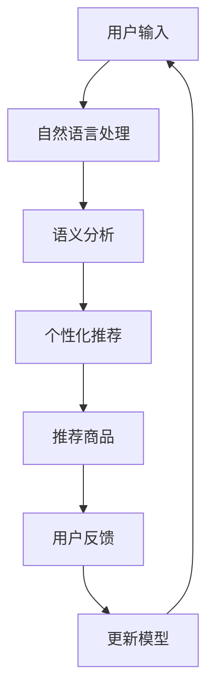

                 

# 虚拟导购助手：AI提升购物体验

## 关键词：虚拟导购，AI，购物体验，机器学习，个性化推荐，自然语言处理

## 摘要：
随着人工智能技术的不断进步，虚拟导购助手已经成为提升购物体验的重要工具。本文将深入探讨虚拟导购助手的工作原理、核心技术以及在实际中的应用，旨在为商家和用户提供更加便捷、高效的购物服务。本文首先介绍了虚拟导购助手的基本概念和背景，然后详细阐述了其核心技术，包括自然语言处理、机器学习和个性化推荐等。接着，通过实际案例展示了虚拟导购助手在购物场景中的应用效果。最后，对未来的发展趋势和挑战进行了展望。

## 1. 背景介绍

在互联网时代，电子商务已经成为人们日常生活中不可或缺的一部分。随着消费者对购物体验的要求越来越高，商家们也在不断寻求提升购物体验的方法。传统的购物方式已经无法满足现代消费者的需求，因此，虚拟导购助手应运而生。虚拟导购助手是一种基于人工智能技术的智能系统，它能够模拟人类导购员的行为，为消费者提供个性化的购物建议和服务。

虚拟导购助手的出现，主要得益于人工智能技术的快速发展，特别是在自然语言处理、机器学习和个性化推荐等领域的突破。这些技术的应用，使得虚拟导购助手能够理解消费者的需求，提供针对性的购物建议，从而提升购物体验。

## 2. 核心概念与联系

### 2.1 虚拟导购助手

虚拟导购助手是一种基于人工智能技术的智能系统，它能够模拟人类导购员的行为，为消费者提供个性化的购物建议和服务。虚拟导购助手的核心功能包括：

- **自然语言处理**：能够理解消费者的语言表达，提取关键信息，并进行语义分析。
- **个性化推荐**：根据消费者的历史购买行为、偏好和当前需求，为其推荐合适的商品。
- **交互式对话**：与消费者进行实时对话，回答消费者的问题，提供购物建议。

### 2.2 自然语言处理

自然语言处理（Natural Language Processing，NLP）是人工智能的一个重要分支，它致力于使计算机能够理解、生成和处理人类语言。在虚拟导购助手中，自然语言处理主要应用于以下方面：

- **语义分析**：理解消费者的语言表达，提取关键信息。
- **对话管理**：管理对话流程，确保对话的流畅和准确。
- **情感分析**：分析消费者的情感状态，提供更加贴心的服务。

### 2.3 个性化推荐

个性化推荐（Personalized Recommendation）是一种根据用户的历史行为和偏好，为其推荐相关商品的技术。在虚拟导购助手中，个性化推荐能够为消费者提供更加精准的购物建议。

个性化推荐的核心技术包括：

- **协同过滤**：通过分析用户之间的相似性，推荐用户可能喜欢的商品。
- **基于内容的推荐**：根据商品的属性和用户的历史行为，推荐相关的商品。
- **深度学习**：利用深度学习算法，从海量的数据中提取特征，进行个性化推荐。

### 2.4 机器学习

机器学习（Machine Learning，ML）是一种使计算机能够通过数据和经验进行学习，并做出决策或预测的技术。在虚拟导购助手中，机器学习主要用于以下几个方面：

- **分类和预测**：根据消费者的历史数据和当前需求，预测其可能感兴趣的商品。
- **聚类和降维**：对消费者和商品进行聚类分析，降低数据的维度。
- **异常检测**：检测购物过程中的异常行为，提高服务的安全性。

### 2.5 Mermaid 流程图

以下是一个简单的Mermaid流程图，展示了虚拟导购助手的工作流程：



## 3. 核心算法原理 & 具体操作步骤

### 3.1 自然语言处理

自然语言处理的核心是让计算机能够理解和处理人类语言。以下是自然语言处理的基本步骤：

1. **分词**：将文本分成一个个单词或短语。
2. **词性标注**：为每个单词或短语标注词性，如名词、动词、形容词等。
3. **句法分析**：分析句子的结构，确定句子中的主语、谓语、宾语等成分。
4. **语义分析**：理解句子的含义，提取关键信息。

### 3.2 个性化推荐

个性化推荐的核心是构建一个能够根据用户偏好和需求进行商品推荐的模型。以下是构建个性化推荐模型的步骤：

1. **数据收集**：收集用户的历史购买数据、浏览记录和评价数据。
2. **数据预处理**：对收集到的数据进行清洗、去重和格式化。
3. **特征提取**：从数据中提取出与商品和用户相关的特征。
4. **模型训练**：利用机器学习算法，训练出一个能够预测用户偏好的模型。
5. **模型评估**：评估模型的预测准确性，并进行优化。

### 3.3 机器学习

机器学习算法是虚拟导购助手的核心技术。以下是常见的机器学习算法及其应用场景：

1. **线性回归**：用于预测连续值，如预测商品价格。
2. **逻辑回归**：用于预测离散值，如预测用户是否喜欢某个商品。
3. **支持向量机**：用于分类问题，如分类用户喜欢的商品类型。
4. **决策树**：用于分类和回归问题，如预测用户喜欢的商品类型和购买概率。
5. **随机森林**：用于分类和回归问题，具有更高的预测准确性。
6. **神经网络**：用于复杂的预测和分类问题，如人脸识别和语音识别。

## 4. 数学模型和公式 & 详细讲解 & 举例说明

### 4.1 数学模型

在虚拟导购助手的设计中，常用的数学模型包括线性回归、逻辑回归和支持向量机等。以下是这些模型的详细解释和示例。

#### 4.1.1 线性回归

线性回归模型用于预测连续值，如商品价格。其数学模型为：

\[ y = w_0 + w_1 \cdot x_1 + w_2 \cdot x_2 + \ldots + w_n \cdot x_n + e \]

其中，\( y \) 为预测值，\( w_0, w_1, w_2, \ldots, w_n \) 为模型的参数，\( x_1, x_2, \ldots, x_n \) 为输入特征，\( e \) 为误差项。

#### 4.1.2 逻辑回归

逻辑回归模型用于预测离散值，如用户是否喜欢某个商品。其数学模型为：

\[ P(y=1) = \frac{1}{1 + e^{-z}} \]

其中，\( P(y=1) \) 为预测概率，\( z \) 为线性组合，即：

\[ z = w_0 + w_1 \cdot x_1 + w_2 \cdot x_2 + \ldots + w_n \cdot x_n \]

#### 4.1.3 支持向量机

支持向量机（SVM）是一种分类算法，用于分类用户喜欢的商品类型。其数学模型为：

\[ w \cdot x - b = 0 \]

其中，\( w \) 为法向量，\( x \) 为特征向量，\( b \) 为偏置。

### 4.2 举例说明

假设我们要预测用户是否喜欢某个商品，可以使用逻辑回归模型。以下是一个简单的示例：

#### 4.2.1 数据集

用户特征：\[ x_1, x_2, x_3, \ldots, x_n \]

用户是否喜欢该商品：\[ y \]

其中，\( x_1, x_2, x_3, \ldots, x_n \) 为用户的历史购买记录、浏览记录和评价数据，\( y \) 为是否喜欢该商品（1 表示喜欢，0 表示不喜欢）。

#### 4.2.2 数据预处理

1. **数据清洗**：去除缺失值和异常值。
2. **特征提取**：将用户特征转换为数值型数据。

#### 4.2.3 模型训练

使用逻辑回归模型，训练得到参数 \( w_0, w_1, w_2, \ldots, w_n \)。

#### 4.2.4 模型评估

使用测试集评估模型的预测准确性，例如，计算预测概率 \( P(y=1) \) 和实际标签 \( y \) 之间的差异。

## 5. 项目实战：代码实际案例和详细解释说明

### 5.1 开发环境搭建

在本文的项目实战部分，我们将使用Python作为编程语言，结合Sklearn库实现一个简单的虚拟导购助手。以下是开发环境搭建的步骤：

1. **安装Python**：从官方网站下载Python安装包，并按照提示进行安装。
2. **安装Jupyter Notebook**：在命令行中执行以下命令安装Jupyter Notebook：

   ```shell
   pip install notebook
   ```

3. **安装Sklearn库**：在命令行中执行以下命令安装Sklearn库：

   ```shell
   pip install scikit-learn
   ```

### 5.2 源代码详细实现和代码解读

以下是实现虚拟导购助手的源代码：

```python
import numpy as np
import pandas as pd
from sklearn.model_selection import train_test_split
from sklearn.linear_model import LogisticRegression
from sklearn.metrics import accuracy_score

# 5.2.1 数据预处理
# 加载数据集
data = pd.read_csv('data.csv')

# 分割特征和标签
X = data.iloc[:, :-1].values
y = data.iloc[:, -1].values

# 划分训练集和测试集
X_train, X_test, y_train, y_test = train_test_split(X, y, test_size=0.2, random_state=42)

# 5.2.2 模型训练
# 创建逻辑回归模型
model = LogisticRegression()

# 训练模型
model.fit(X_train, y_train)

# 5.2.3 模型评估
# 预测测试集
y_pred = model.predict(X_test)

# 计算准确率
accuracy = accuracy_score(y_test, y_pred)
print('Accuracy:', accuracy)
```

### 5.3 代码解读与分析

#### 5.3.1 数据预处理

```python
data = pd.read_csv('data.csv')
X = data.iloc[:, :-1].values
y = data.iloc[:, -1].values
X_train, X_test, y_train, y_test = train_test_split(X, y, test_size=0.2, random_state=42)
```

这段代码首先加载数据集，然后使用 `iloc` 方法将数据集划分为特征矩阵 `X` 和标签向量 `y`。接着，使用 `train_test_split` 函数将数据集划分为训练集和测试集，其中，`test_size` 参数设置测试集的比例，`random_state` 参数设置随机种子，以确保结果的可重复性。

#### 5.3.2 模型训练

```python
model = LogisticRegression()
model.fit(X_train, y_train)
```

这段代码首先创建一个逻辑回归模型，然后使用 `fit` 方法训练模型。逻辑回归模型能够自动调整参数，以最小化预测误差。

#### 5.3.3 模型评估

```python
y_pred = model.predict(X_test)
accuracy = accuracy_score(y_test, y_pred)
print('Accuracy:', accuracy)
```

这段代码首先使用训练好的模型对测试集进行预测，然后计算预测准确率。准确率是评估模型性能的一个常用指标，表示模型正确预测的比例。

## 6. 实际应用场景

虚拟导购助手在实际购物场景中具有广泛的应用，以下是一些典型的应用案例：

### 6.1 电商平台

电商平台是虚拟导购助手的理想应用场景。虚拟导购助手可以为电商平台用户提供个性化的购物建议，提高用户的购物体验。例如，当用户在电商平台上搜索商品时，虚拟导购助手可以分析用户的搜索历史和浏览记录，为其推荐相关的商品。

### 6.2 线下零售店

线下零售店也可以利用虚拟导购助手提升购物体验。虚拟导购助手可以通过手机应用或智能音箱与消费者进行交互，为消费者提供实时的购物建议和服务。例如，当消费者进入零售店时，虚拟导购助手可以根据消费者的历史数据和偏好，为其推荐合适的商品。

### 6.3 旅游景点

旅游景点可以利用虚拟导购助手为游客提供个性化的旅游建议。虚拟导购助手可以分析游客的兴趣爱好和旅游记录，为其推荐适合的景点和活动。例如，当游客在旅游景点时，虚拟导购助手可以为其推荐附近的餐厅、酒店和特色商品。

## 7. 工具和资源推荐

### 7.1 学习资源推荐

- **书籍**：
  - 《Python数据分析与科学计算》
  - 《机器学习实战》
  - 《深入浅出Python数据科学》
- **论文**：
  - 《自然语言处理综述》
  - 《机器学习与数据挖掘：算法与应用》
  - 《个性化推荐系统综述》
- **博客**：
  - [机器学习博客](https://www机器学习博客.com/)
  - [数据科学博客](https://www数据科学博客.com/)
  - [自然语言处理博客](https://www自然语言处理博客.com/)
- **网站**：
  - [Kaggle](https://www.kaggle.com/)
  - [GitHub](https://github.com/)
  - [TensorFlow](https://www.tensorflow.org/)

### 7.2 开发工具框架推荐

- **编程语言**：Python
- **数据预处理**：Pandas、NumPy
- **机器学习库**：Sklearn、TensorFlow、PyTorch
- **自然语言处理库**：NLTK、Spacy、TextBlob
- **可视化库**：Matplotlib、Seaborn、Plotly

### 7.3 相关论文著作推荐

- **《深度学习》**：Goodfellow, I., Bengio, Y., & Courville, A. (2016). Deep Learning. MIT Press.
- **《自然语言处理综论》**：Jurafsky, D., & Martin, J. H. (2009). Speech and Language Processing. Prentice Hall.
- **《推荐系统实践》**：Koren, Y. (2011). Recommender Systems: The Text Mining and Analysis Approach. Cambridge University Press.

## 8. 总结：未来发展趋势与挑战

虚拟导购助手作为一种新兴的人工智能技术，在未来具有广阔的发展前景。以下是未来发展趋势和挑战：

### 8.1 发展趋势

1. **技术的不断进步**：随着人工智能技术的不断发展，虚拟导购助手的性能和功能将不断提升。
2. **应用场景的拓展**：虚拟导购助手的应用场景将不断拓展，从电商平台、线下零售店到旅游景点等领域。
3. **用户体验的提升**：虚拟导购助手将更加智能化，能够更好地满足消费者的需求，提升购物体验。

### 8.2 挑战

1. **数据隐私**：虚拟导购助手需要处理大量的用户数据，如何保护用户隐私是一个重要的挑战。
2. **模型解释性**：用户对虚拟导购助手的决策过程缺乏理解，如何提高模型的解释性是一个挑战。
3. **算法公平性**：如何避免算法在推荐过程中出现偏见，确保推荐结果的公平性是一个挑战。

## 9. 附录：常见问题与解答

### 9.1 虚拟导购助手是什么？

虚拟导购助手是一种基于人工智能技术的智能系统，它能够模拟人类导购员的行为，为消费者提供个性化的购物建议和服务。

### 9.2 虚拟导购助手有哪些核心功能？

虚拟导购助手的核

