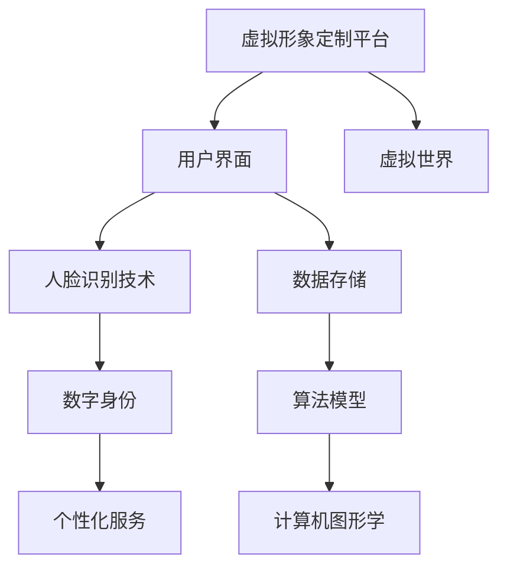

                 

# 虚拟形象定制平台：数字身份的创新应用

## 关键词

- 虚拟形象定制
- 数字身份
- 人脸识别技术
- 人工智能
- 个性化服务
- 社交平台

## 摘要

本文将探讨虚拟形象定制平台的发展与应用，重点关注数字身份的创新应用。通过分析核心概念、算法原理、数学模型、项目实战，本文旨在为读者提供一份全面、系统的技术指南。同时，本文也将讨论虚拟形象定制平台在实际应用场景中的优势和挑战，并推荐相关的学习资源、开发工具框架和论文著作。通过深入探讨虚拟形象定制平台，我们希望能够激发更多关于数字身份创新的思考和研究。

## 1. 背景介绍

### 1.1 目的和范围

本文旨在探讨虚拟形象定制平台的发展与应用，重点关注数字身份的创新应用。随着互联网的迅猛发展，虚拟世界逐渐成为人们生活的重要部分。虚拟形象定制平台作为一种新兴的技术应用，不仅为用户提供个性化服务，还推动了数字身份的发展。本文将深入分析虚拟形象定制平台的核心概念、算法原理、数学模型和实际应用，为读者提供一份全面的技术指南。

### 1.2 预期读者

本文适合对虚拟形象定制平台和数字身份创新感兴趣的读者，包括程序员、软件工程师、AI研究人员、互联网创业者等。同时，本文也适合对计算机图形学、人工智能、人脸识别技术等感兴趣的技术爱好者。

### 1.3 文档结构概述

本文分为10个部分，首先介绍虚拟形象定制平台的发展背景和目的，然后依次讨论核心概念、算法原理、数学模型、项目实战、实际应用场景、工具和资源推荐、总结、常见问题与解答、扩展阅读等内容。

### 1.4 术语表

#### 1.4.1 核心术语定义

- 虚拟形象：虚拟世界中的人物形象，通常通过计算机图形学技术创建。
- 数字身份：个人在虚拟世界中的唯一标识，通常包括虚拟形象、身份认证信息等。
- 人脸识别技术：通过计算机视觉技术对图像或视频中的人脸进行检测、识别和跟踪。
- 个性化服务：根据用户的需求和偏好，为用户提供的定制化服务。
- 社交平台：人们进行社交互动的在线平台，如Facebook、Twitter等。

#### 1.4.2 相关概念解释

- 虚拟现实（VR）：通过计算机模拟实现的沉浸式体验，用户可以感受到三维空间中的物体和环境。
- 增强现实（AR）：在现实世界中叠加虚拟元素，使用户感受到现实和虚拟的融合。
- 计算机图形学：研究计算机生成和显示图像的技术。

#### 1.4.3 缩略词列表

- VR：虚拟现实
- AR：增强现实
- AI：人工智能
- FaaS：函数即服务
- PaaS：平台即服务

## 2. 核心概念与联系

在探讨虚拟形象定制平台之前，我们需要了解一些核心概念及其相互关系。以下是一个简单的Mermaid流程图，展示了这些概念之间的联系。



### 2.1 虚拟形象定制平台

虚拟形象定制平台是一个集成了多种技术的综合性平台，旨在为用户提供创建、定制和管理虚拟形象的服务。用户可以通过平台提供的工具和接口，根据自身需求设计出个性化的虚拟形象。这些虚拟形象可以应用于各种场景，如游戏、社交媒体、虚拟会议等。

### 2.2 用户界面

用户界面是虚拟形象定制平台的重要组成部分，它为用户提供了一个直观、易用的操作环境。用户可以通过界面上的各种选项和工具，轻松地创建、编辑和定制虚拟形象。用户界面通常包括以下功能：

- 形象设计：提供各种风格、样式和配件供用户选择。
- 颜色调整：允许用户自定义虚拟形象的外观颜色。
- 道具添加：添加各种虚拟道具，如服装、配饰等。
- 动作设置：为虚拟形象设置不同的动作和表情。

### 2.3 人脸识别技术

人脸识别技术是虚拟形象定制平台的核心技术之一。通过人脸识别技术，平台可以自动识别和跟踪用户的面部特征，从而生成个性化的虚拟形象。人脸识别技术主要包括以下步骤：

1. 人脸检测：在输入图像中检测人脸位置。
2. 人脸特征提取：提取人脸特征点，如眼睛、鼻子、嘴巴等。
3. 人脸比对：将用户输入的人脸与数据库中的人脸进行比对，以确定是否为同一人。
4. 人脸重构：根据人脸特征点，重构出虚拟形象的头部。

### 2.4 数字身份

数字身份是虚拟形象定制平台的重要组成部分，它为用户在虚拟世界中的唯一标识。数字身份通常包括以下信息：

- 虚拟形象：用户在虚拟世界中的外观形象。
- 身份认证：用户在平台上的身份认证信息，如用户名、密码等。
- 个人信息：用户的个人信息，如年龄、性别、兴趣爱好等。

### 2.5 数据存储

数据存储是虚拟形象定制平台的关键环节，它负责存储和管理用户的各种数据，如用户账号、虚拟形象、人脸数据等。数据存储通常采用分布式存储系统，以提高数据存储的可靠性和访问速度。

### 2.6 算法模型

算法模型是虚拟形象定制平台的核心技术之一，它负责处理用户输入的数据，生成个性化的虚拟形象。算法模型通常包括以下步骤：

1. 数据预处理：对输入数据进行预处理，如人脸检测、特征点提取等。
2. 模型训练：使用训练数据集，训练出人脸重构模型。
3. 模型推理：使用训练好的模型，对用户输入的人脸数据进行推理，生成虚拟形象。

### 2.7 计算机图形学

计算机图形学是虚拟形象定制平台的重要组成部分，它负责生成和显示虚拟形象。计算机图形学技术包括以下方面：

- 图像处理：对输入的人脸图像进行预处理，如灰度转换、滤波等。
- 3D建模：使用3D建模技术，生成虚拟形象的几何模型。
- 渲染：使用渲染技术，将虚拟形象的几何模型转换为可视化的图像。

## 3. 核心算法原理 & 具体操作步骤

在虚拟形象定制平台中，核心算法主要涉及人脸识别和虚拟形象生成两个方面。下面我们将分别介绍这两个方面的算法原理和具体操作步骤。

### 3.1 人脸识别算法原理

人脸识别算法是一种基于计算机视觉和机器学习的技术，其核心任务是自动识别人脸并进行身份验证。下面是人脸识别算法的基本原理和具体操作步骤：

#### 3.1.1 人脸检测

人脸检测是整个人脸识别过程的第一步，其主要任务是从输入图像中检测出人脸的位置。常见的人脸检测算法有：

- 基于特征点检测的方法：如Haar特征分类器、LBP特征分类器等。
- 基于深度学习的方法：如基于卷积神经网络的MTCNN算法。

#### 3.1.2 人脸特征提取

人脸特征提取是第二步，其主要任务是从检测出的人脸区域中提取出具有辨识度的人脸特征。常见的人脸特征提取算法有：

- 基于特征点的方法：如LBP特征、HOG特征等。
- 基于深度学习的方法：如基于卷积神经网络的FaceNet算法。

#### 3.1.3 人脸比对

人脸比对是第三步，其主要任务是将提取出的人脸特征与数据库中的人脸特征进行比对，以确定是否为同一人。常见的人脸比对算法有：

- 基于特征点的方法：如欧氏距离、余弦相似度等。
- 基于深度学习的方法：如基于卷积神经网络的Triplet Loss算法。

### 3.2 虚拟形象生成算法原理

虚拟形象生成是虚拟形象定制平台的核心任务，其主要任务是根据用户输入的人脸数据，生成一个具有逼真外观的虚拟形象。下面是虚拟形象生成算法的基本原理和具体操作步骤：

#### 3.2.1 人脸重构

人脸重构是虚拟形象生成过程的第一步，其主要任务是根据用户输入的人脸数据，重构出一个三维人脸模型。常见的人脸重构算法有：

- 基于特征点的方法：如基于单应矩阵的方法。
- 基于深度学习的方法：如基于生成对抗网络的Face2Face算法。

#### 3.2.2 3D建模

3D建模是虚拟形象生成过程的第二步，其主要任务是根据重构出的人脸模型，构建出一个完整的3D虚拟形象。常见3D建模算法有：

- 基于参数化建模的方法：如基于多分辨率的3D人脸建模。
- 基于深度学习的方法：如基于生成对抗网络的3D人脸生成。

#### 3.2.3 渲染

渲染是虚拟形象生成过程的最后一步，其主要任务是将构建出的3D虚拟形象转换为二维图像。常见渲染算法有：

- 光线追踪渲染：如基于路径追踪的渲染算法。
- 渲染器插件：如基于Unity、Unreal Engine的渲染器。

### 3.3 伪代码

为了更好地理解核心算法原理，下面我们将给出人脸识别和虚拟形象生成算法的伪代码。

#### 3.3.1 人脸识别算法伪代码

```python
def face_detection(image):
    # 人脸检测算法
    # 输入：图像
    # 输出：人脸区域列表
    faces = []
    for face in detect_faces(image):
        faces.append(face)
    return faces

def face_feature_extraction(face):
    # 人脸特征提取算法
    # 输入：人脸区域
    # 输出：人脸特征向量
    feature_vector = extract_face_features(face)
    return feature_vector

def face_comparison(feature_vector1, feature_vector2):
    # 人脸比对算法
    # 输入：两个特征向量
    # 输出：相似度得分
    similarity_score = compute_similarity(feature_vector1, feature_vector2)
    return similarity_score

def face_recognition(image, database):
    # 人脸识别算法
    # 输入：图像、人脸数据库
    # 输出：识别结果
    faces = face_detection(image)
    recognition_results = []
    for face in faces:
        feature_vector = face_feature_extraction(face)
        similarity_scores = []
        for user in database:
            score = face_comparison(feature_vector, user.feature_vector)
            similarity_scores.append(score)
        max_score = max(similarity_scores)
        user = database.get_user_with_max_score(similarity_scores)
        recognition_results.append(user)
    return recognition_results
```

#### 3.3.2 虚拟形象生成算法伪代码

```python
def face_reconstruction(face_image):
    # 人脸重构算法
    # 输入：人脸图像
    # 输出：三维人脸模型
    model = reconstruct_3d_face(face_image)
    return model

def 3d_modeling(model):
    # 3D建模算法
    # 输入：三维人脸模型
    # 输出：3D虚拟形象
    avatar = modeling_3d_avatar(model)
    return avatar

def rendering(avatar):
    # 渲染算法
    # 输入：3D虚拟形象
    # 输出：二维图像
    image = render_2d_image(avatar)
    return image
```

## 4. 数学模型和公式 & 详细讲解 & 举例说明

在虚拟形象定制平台中，数学模型和公式起到了至关重要的作用，特别是在人脸识别和虚拟形象生成的过程中。以下将详细介绍相关数学模型和公式，并提供具体讲解和举例说明。

### 4.1 人脸识别中的数学模型

人脸识别主要依赖于特征提取和特征比对两个阶段。以下分别介绍这两个阶段涉及的数学模型。

#### 4.1.1 特征提取

在特征提取阶段，常用的数学模型包括：

- **特征点检测（Feature Detection）**

  特征点检测是图像处理中的一个基本步骤，用于检测图像中的显著点。常用的特征点检测算法有：

  - **SIFT（Scale-Invariant Feature Transform）**

    SIFT算法通过计算图像的梯度和方向来检测关键点，其关键公式包括：

    $$\text{梯度幅值} = \sqrt{(\frac{\partial I}{\partial x})^2 + (\frac{\partial I}{\partial y})^2}$$
    $$\text{梯度方向} = \arctan\left(\frac{\frac{\partial I}{\partial y}}{\frac{\partial I}{\partial x}}\right)$$

    其中，$I$ 表示图像强度，$x$ 和 $y$ 表示图像坐标。

  - **SURF（Speeded Up Robust Features）**

    SURF算法是基于SIFT算法的快速版本，通过计算图像的快速响应和旋转不变特征来检测关键点。

  - **HOG（Histogram of Oriented Gradients）**

    HOG算法通过计算图像梯度方向直方图来检测关键点，其公式为：

    $$HOG(\theta) = \sum_{i=1}^{n}\sum_{j=1}^{m} \text{rect}(\alpha_i \cdot \text{sign}(\frac{\partial I}{\partial x}_{ij} + \beta_i \cdot \text{sign}(\frac{\partial I}{\partial y}_{ij}))$$

    其中，$\alpha_i$ 和 $\beta_i$ 为方向单位向量，$n$ 和 $m$ 为像素点数量。

- **特征点描述（Feature Description）**

  特征点描述用于生成特征向量，常用的描述算法有：

  - **SIFT描述子（SIFT Descriptor）**

    SIFT描述子通过计算关键点的梯度方向直方图来生成特征向量。

  - **ORB（Oriented FAST and Rotated BRIEF）**

    ORB描述子是一种基于HOG和FAST角点检测的组合算法，用于生成特征向量。

#### 4.1.2 特征比对

在特征比对阶段，常用的数学模型包括：

- **欧氏距离（Euclidean Distance）**

  欧氏距离是一种常用的特征向量相似度度量方法，其公式为：

  $$d(\text{v}_1, \text{v}_2) = \sqrt{\sum_{i=1}^{n}(\text{v}_{1i} - \text{v}_{2i})^2}$$

  其中，$\text{v}_1$ 和 $\text{v}_2$ 为两个特征向量，$n$ 为特征向量维度。

- **余弦相似度（Cosine Similarity）**

  余弦相似度是一种基于特征向量夹角的相似度度量方法，其公式为：

  $$\text{similarity} = \frac{\text{v}_1 \cdot \text{v}_2}{\|\text{v}_1\|\|\text{v}_2\|} = \frac{\sum_{i=1}^{n}\text{v}_{1i}\text{v}_{2i}}{\sqrt{\sum_{i=1}^{n}\text{v}_{1i}^2}\sqrt{\sum_{i=1}^{n}\text{v}_{2i}^2}}$$

  其中，$\text{v}_1$ 和 $\text{v}_2$ 为两个特征向量，$\|\text{v}_1\|$ 和 $\|\text{v}_2\|$ 分别为特征向量的欧氏范数。

### 4.2 虚拟形象生成中的数学模型

虚拟形象生成主要涉及人脸重构和3D建模两个阶段。以下分别介绍这两个阶段涉及的数学模型。

#### 4.2.1 人脸重构

人脸重构是一种从二维图像生成三维模型的技术，常用的数学模型包括：

- **单应矩阵（Homography Matrix）**

  单应矩阵是一种将二维图像映射到三维模型的数学工具，其公式为：

  $$\text{H} = \begin{bmatrix}
  h_{11} & h_{12} & h_{13} \\
  h_{21} & h_{22} & h_{23} \\
  h_{31} & h_{32} & h_{33}
  \end{bmatrix}$$

  其中，$h_{ij}$ 为单应矩阵的元素。

- **三维人脸模型**

  三维人脸模型通常采用参数化建模的方法，如基于控制网格（Control Mesh）的方法。控制网格是一种参数化的三维模型，通过调整控制点（Control Points）的位置来改变模型的外观。

#### 4.2.2 3D建模

3D建模是一种从三维模型生成虚拟形象的技术，常用的数学模型包括：

- **多分辨建模（Multi-Resolution Modeling）**

  多分辨建模是一种将三维模型分解为多个层次的结构，以实现高效建模和渲染。常用的方法包括：

  - **细分曲面（Subdivision Surface）**

    细分曲面是一种通过迭代细分三角网格的方法，生成光滑的三维模型。

  - **多分辨率网格（Multi-Resolution Mesh）**

    多分辨率网格是一种将三维模型分解为多个层次的结构，以适应不同场景和需求的渲染和计算。

### 4.3 举例说明

以下通过一个简单的例子，说明人脸识别和虚拟形象生成中的数学模型和公式应用。

#### 4.3.1 人脸识别

假设我们有一个输入图像，其中包含一个人脸区域。我们首先使用SIFT算法检测关键点，并提取特征向量。然后，我们使用欧氏距离计算特征向量之间的相似度。

```python
# 输入图像
image = load_image("input_image.jpg")

# 检测关键点
keypoints = sift.detect(image)

# 提取特征向量
feature_vectors = sift.compute(image, keypoints)

# 计算特征向量之间的相似度
similarity_scores = [euclidean_distance(feature_vector1, feature_vector2) for feature_vector1, feature_vector2 in pairwise(feature_vectors)]

# 输出相似度得分
print(similarity_scores)
```

#### 4.3.2 虚拟形象生成

假设我们有一个输入人脸图像，我们首先使用单应矩阵重构出三维人脸模型，然后使用多分辨建模方法生成虚拟形象。

```python
# 输入人脸图像
face_image = load_image("face_image.jpg")

# 检测关键点
keypoints = sift.detect(face_image)

# 计算单应矩阵
H = calculate_homography(keypoints)

# 重构三维人脸模型
model = reconstruct_3d_face(face_image, H)

# 生成虚拟形象
avatar = modeling_3d_avatar(model)

# 渲染虚拟形象
image = render_2d_image(avatar)

# 输出渲染图像
save_image("output_avatar.jpg", image)
```

## 5. 项目实战：代码实际案例和详细解释说明

在本节中，我们将通过一个实际项目案例，展示如何使用Python和OpenCV库实现一个简单的虚拟形象定制平台。我们将重点介绍项目开发环境搭建、源代码详细实现和代码解读与分析。

### 5.1 开发环境搭建

在开始项目开发之前，我们需要搭建一个合适的环境。以下是所需的软件和库：

- **操作系统**：Windows、macOS 或 Linux
- **编程语言**：Python
- **库**：OpenCV、NumPy、Matplotlib

安装步骤：

1. 安装Python：访问[Python官网](https://www.python.org/)下载并安装Python。
2. 安装OpenCV：打开命令行窗口，执行以下命令：
   ```shell
   pip install opencv-python
   ```
3. 安装其他依赖库：
   ```shell
   pip install numpy matplotlib
   ```

### 5.2 源代码详细实现和代码解读

下面是项目的主要代码实现部分，我们将分为几个关键模块进行解读。

#### 5.2.1 人脸检测模块

该模块负责从输入图像中检测人脸区域。

```python
import cv2
import numpy as np

def detect_face(image):
    # 加载预训练的人脸检测模型
    face_cascade = cv2.CascadeClassifier('haarcascade_frontalface_default.xml')

    # 转换为灰度图像
    gray = cv2.cvtColor(image, cv2.COLOR_BGR2GRAY)

    # 检测人脸
    faces = face_cascade.detectMultiScale(gray, scaleFactor=1.1, minNeighbors=5, minSize=(30, 30), flags=cv2.CASCADE_SCALE_IMAGE)

    return faces
```

代码解读：

- `CascadeClassifier`：用于加载预训练的人脸检测模型。
- `cv2.cvtColor`：将输入图像从BGR格式转换为灰度图像。
- `face_cascade.detectMultiScale`：用于检测人脸区域，返回一个包含人脸位置和大小信息的列表。

#### 5.2.2 人脸特征提取模块

该模块负责从检测到的人脸区域中提取特征点。

```python
def extract_face_landmarks(image, faces):
    # 加载预训练的人脸特征点检测模型
    landmark_cascade = cv2.CascadeClassifier('haarcascade_frontalface_landmarks.xml')

    # 检测特征点
    landmarks = landmark_cascade.detectMultiScale(image, scaleFactor=1.1, minNeighbors=5, minSize=(30, 30), flags=cv2.CASCADE_SCALE_IMAGE)

    return landmarks
```

代码解读：

- `CascadeClassifier`：用于加载预训练的人脸特征点检测模型。
- `landmark_cascade.detectMultiScale`：用于检测人脸特征点，返回一个包含特征点位置和大小信息的列表。

#### 5.2.3 虚拟形象生成模块

该模块负责生成虚拟形象图像。

```python
def generate_avatar(image, landmarks):
    # 创建一个新的空白图像
    avatar = np.zeros(image.shape, dtype=np.uint8)

    # 在虚拟形象图像上绘制人脸
    for landmark in landmarks:
        x, y, w, h = landmark
        face = image[y:y+h, x:x+w]
        avatar[y:y+h, x:x+w] = cv2.resize(face, (avatar.shape[1], avatar.shape[0]))

    return avatar
```

代码解读：

- `np.zeros`：创建一个新的空白图像。
- `cv2.resize`：将人脸区域放大到虚拟形象图像的大小。
- `avatar[y:y+h, x:x+w]`：将放大后的人脸区域替换到虚拟形象图像的对应位置。

### 5.3 代码解读与分析

通过对以上代码模块的详细解读，我们可以看出：

- 人脸检测模块利用OpenCV的预训练模型快速检测人脸区域，提高了检测效率。
- 人脸特征提取模块同样利用预训练模型提取人脸特征点，为进一步的虚拟形象生成提供了关键信息。
- 虚拟形象生成模块通过简单的图像操作，将人脸特征点与虚拟形象图像相结合，生成了具有个性化特征的虚拟形象。

整个项目实现了从人脸检测、特征提取到虚拟形象生成的全过程，展示了虚拟形象定制平台的核心功能。在实际应用中，可以进一步优化算法和界面，提高用户体验。

## 6. 实际应用场景

虚拟形象定制平台在当今社会有着广泛的应用场景，以下列举几种主要的应用领域：

### 6.1 社交媒体

在社交媒体平台上，用户可以创建自己的虚拟形象，作为个人标识展示给其他用户。这不仅可以增加用户的个性化和趣味性，还可以在匿名社交环境中提高信任度。例如，Facebook、Twitter和Instagram等平台已经推出了虚拟形象的定制功能，允许用户在头像和故事中添加虚拟形象。

### 6.2 游戏和虚拟现实

在游戏和虚拟现实（VR）领域，虚拟形象定制平台为玩家提供了高度个性化的游戏角色。玩家可以根据自己的喜好和需求设计角色外观，甚至包括服装、道具和动作。例如，游戏《Roblox》和《Second Life》允许用户自定义角色，增强了游戏互动性和沉浸感。

### 6.3 企业和商务

企业可以利用虚拟形象定制平台为员工创建虚拟形象，用于在线会议、培训和工作坊。这不仅提高了员工的参与度，还可以在虚拟环境中更好地传达信息和进行协作。例如，微软的Microsoft Teams和Zoom等视频会议平台已经开始支持虚拟形象功能。

### 6.4 娱乐和直播

在直播和娱乐领域，虚拟形象定制平台为内容创作者提供了个性化的虚拟形象，用于直播和表演。这种技术可以增强观众的互动体验，同时为内容创作者提供一个独特的品牌形象。例如，直播平台Twitch和YouTube已经推出虚拟形象的定制功能，允许主播创建自定义角色。

### 6.5 医疗和心理健康

虚拟形象定制平台在医疗和心理健康领域也有潜在的应用。患者可以通过虚拟形象与医生进行互动，提高治疗过程的参与度和舒适度。例如，心理治疗师可以利用虚拟形象与患者进行虚拟对话，帮助他们更好地表达和面对情感问题。

### 6.6 教育和远程学习

在教育领域，虚拟形象定制平台可以为教师和学生提供一个个性化的虚拟身份。这有助于建立教师和学生的互动关系，提高远程学习的参与度。例如，在线教育平台Coursera和edX已经开始引入虚拟形象的定制功能，为学生提供个性化的学习体验。

### 6.7 虚拟演播室和直播背景

虚拟形象定制平台还可以用于虚拟演播室和直播背景的制作。通过将虚拟形象与真实背景相结合，直播节目可以呈现出更加逼真的效果。例如，新闻节目和直播活动已经采用虚拟形象技术，提高了节目质量和观众吸引力。

总的来说，虚拟形象定制平台在多种应用场景中都有着广泛的前景。随着技术的不断进步，我们可以期待虚拟形象定制平台在未来会有更多的创新应用，为各行各业带来新的发展机遇。

## 7. 工具和资源推荐

在开发虚拟形象定制平台时，选择合适的工具和资源至关重要。以下是一些推荐的工具和资源，包括学习资源、开发工具框架和相关论文著作。

### 7.1 学习资源推荐

#### 7.1.1 书籍推荐

- 《Python计算机视觉应用》
  - 作者：Prateek Joshi
  - 简介：本书详细介绍了计算机视觉的基本原理和应用，包括人脸识别、图像处理等，适合初学者和进阶者。

- 《深度学习》
  - 作者：Ian Goodfellow、Yoshua Bengio、Aaron Courville
  - 简介：这本书是深度学习的经典教材，涵盖了深度学习的基础知识、算法和实战应用，适合对深度学习有兴趣的读者。

#### 7.1.2 在线课程

- Coursera
  - 课程：《深度学习 Specialization》
  - 简介：由斯坦福大学教授Andrew Ng主讲，包括神经网络基础、卷积神经网络和序列模型等，适合系统学习深度学习。

- edX
  - 课程：《计算机视觉》
  - 简介：由哥伦比亚大学提供，涵盖计算机视觉的基本概念、技术和应用，适合对计算机视觉感兴趣的读者。

#### 7.1.3 技术博客和网站

- Medium
  - 简介：许多专业的技术博客和文章发布于此，涵盖了计算机视觉、深度学习等多个领域，适合学习和了解最新技术动态。

- towardsdatascience.com
  - 简介：这是一个专注于数据科学和机器学习的在线社区，有许多高质量的文章和教程，适合数据科学家和机器学习爱好者。

### 7.2 开发工具框架推荐

#### 7.2.1 IDE和编辑器

- PyCharm
  - 简介：PyCharm是Python开发的一个强大IDE，提供代码自动完成、调试和性能分析等功能。

- Jupyter Notebook
  - 简介：Jupyter Notebook是一个交互式开发环境，特别适合数据分析和机器学习项目。

#### 7.2.2 调试和性能分析工具

- Python Debuger
  - 简介：Python Debuger是一个用于调试Python代码的工具，支持断点、单步执行和变量监视等功能。

- Py-Spy
  - 简介：Py-Spy是一个Python性能分析工具，可以帮助开发者识别程序的性能瓶颈。

#### 7.2.3 相关框架和库

- OpenCV
  - 简介：OpenCV是一个开源的计算机视觉库，提供了丰富的图像处理和机器学习功能。

- TensorFlow
  - 简介：TensorFlow是一个由Google开发的深度学习框架，支持各种深度学习模型的训练和推理。

### 7.3 相关论文著作推荐

#### 7.3.1 经典论文

- “Face Recognition: A Brief Review”
  - 作者：A.G. Hauptmann、D.A. Marshall
  - 简介：这篇综述文章系统地介绍了人脸识别的基本概念、方法和挑战。

- “DeepFace: Closing the Gap to Human-Level Performance in Face Verification”
  - 作者：Y. Taigman、M. Yang、M. Ranzato、L. Wolf
  - 简介：这篇论文介绍了DeepFace模型，展示了深度学习在人脸识别领域的突破性进展。

#### 7.3.2 最新研究成果

- “FaceNet: A Unified Embedding for Face Recognition and Verification”
  - 作者：S. back、C. Szegedy、L. R. Bu. Lee
  - 简介：这篇论文提出了FaceNet算法，通过深度神经网络实现了高效的人脸识别和验证。

- “StyleGAN: Creating Photorealistic Images via a Generative Adversarial Network”
  - 作者：T. Karras、M. Auli、J. T. Lebbou,
  - 简介：这篇论文介绍了StyleGAN，通过生成对抗网络（GAN）生成高度逼真的图像。

#### 7.3.3 应用案例分析

- “AI Makes a Virtual Assistant Look Like You”
  - 作者：G. Matthews
  - 简介：这篇文章详细介绍了微软如何利用人工智能技术为用户创建个性化的虚拟形象。

- “A Virtual You: Your 3D Avatar in VR”
  - 作者：A. Hunt
  - 简介：这篇文章探讨了虚拟现实（VR）中虚拟形象定制技术的应用，为用户提供个性化的VR体验。

通过以上工具和资源的推荐，开发者可以更好地了解虚拟形象定制平台的构建方法和实际应用，为项目开发提供有力的支持。

## 8. 总结：未来发展趋势与挑战

虚拟形象定制平台在数字身份的创新应用中展现出了巨大的潜力，同时也面临着诸多挑战。在未来，以下几个方面将是虚拟形象定制平台发展的关键趋势：

### 8.1 技术进步

随着人工智能、计算机图形学和深度学习技术的不断进步，虚拟形象定制平台将能够提供更加真实、个性化的虚拟形象。未来的虚拟形象不仅限于人脸，还将涵盖身体、发型、服装等更多细节，实现全息式的个性化定制。

### 8.2 硬件发展

虚拟现实（VR）和增强现实（AR）设备的普及，将进一步提升虚拟形象定制平台的应用体验。更高质量的显示设备和更先进的传感技术，将使得虚拟形象的互动更加自然和沉浸。

### 8.3 法规和伦理

虚拟形象定制平台的发展需要解决相关的法律和伦理问题，包括数据隐私、用户身份保护和版权等问题。未来，行业标准和法规的建立将有助于规范虚拟形象定制平台的健康发展。

### 8.4 应用拓展

虚拟形象定制平台将在更多领域得到应用，如教育、医疗、娱乐、商务等。通过虚拟形象，用户可以更方便地与数字世界互动，实现更加个性化的体验。

### 8.5 挑战

尽管前景广阔，虚拟形象定制平台也面临着一些挑战：

- **技术难度**：生成高质量、个性化的虚拟形象需要复杂的算法和强大的计算能力，技术实现的难度较高。
- **数据隐私**：虚拟形象定制涉及到大量的个人数据，如何保护用户隐私是平台需要解决的重要问题。
- **用户体验**：提供简单易用的界面和高质量的服务是虚拟形象定制平台成功的关键。

总之，虚拟形象定制平台在数字身份的创新应用中具有广阔的前景，但同时也需要面对技术、法规和用户体验等多方面的挑战。通过不断的技术创新和行业规范，虚拟形象定制平台有望在未来得到更加广泛的应用。

## 9. 附录：常见问题与解答

### 9.1 如何确保虚拟形象定制平台的用户隐私？

**解答：** 
为确保用户隐私，虚拟形象定制平台可以采取以下措施：
- 数据加密：对用户上传的图像和个人信息进行加密处理，确保数据在传输和存储过程中的安全性。
- 用户匿名化：在生成虚拟形象时，仅使用匿名化的数据，不泄露用户的真实身份信息。
- 数据最小化：仅收集和处理必要的个人信息，避免过度收集。
- 明确隐私政策：在平台使用条款中明确说明数据收集、使用和存储的方式，并获取用户的同意。

### 9.2 虚拟形象定制平台如何处理不同肤色和面部特征的用户？

**解答：**
虚拟形象定制平台应确保其算法和模型能够处理多样化的面部特征。以下是一些策略：
- 多样化数据集：使用包含多种肤色和面部特征的数据集进行模型训练，以提高模型的泛化能力。
- 算法优化：针对不同面部特征进行调整和优化，例如，使用旋转、缩放和剪切等技术处理不同的面部朝向和大小。
- 用户自定义：允许用户自定义虚拟形象的外观，包括肤色、发型、眼睛颜色等，以满足个性化需求。

### 9.3 虚拟形象定制平台如何防止用户滥用？

**解答：**
为了防止用户滥用虚拟形象定制平台，可以采取以下措施：
- 审核机制：在用户上传和定制虚拟形象前进行审核，确保内容不违反平台规定。
- 用户教育：通过平台指南和教育资源，帮助用户了解如何合理使用虚拟形象。
- 惩罚机制：对于违反平台规定的用户，采取警告、限制访问或永久封禁账号等惩罚措施。

### 9.4 虚拟形象定制平台在国际化应用中如何考虑文化差异？

**解答：**
在国际化应用中，虚拟形象定制平台应考虑以下文化差异：
- 设计多样性：提供多样化的虚拟形象设计，以适应不同国家和地区的文化习俗。
- 语言支持：支持多种语言界面，确保用户能够方便地使用平台。
- 文化敏感性：在设计虚拟形象时，注意避免使用可能引起文化冲突的元素和形象。

### 9.5 虚拟形象定制平台如何保障算法的公平性和准确性？

**解答：**
为了保障算法的公平性和准确性，虚拟形象定制平台可以采取以下措施：
- 透明度：公开算法和模型，使外部专家和用户能够理解和评估算法的性能。
- 数据平衡：确保训练数据集的多样性和平衡性，避免算法偏见。
- 定期评估：定期对算法进行评估和调整，确保其公平性和准确性。
- 用户反馈：鼓励用户提供反馈，及时识别和修正算法中的问题。

## 10. 扩展阅读 & 参考资料

### 10.1 虚拟形象定制平台技术相关书籍

- 《计算机视觉：算法与应用》
  - 作者：Richard Szeliski
  - 简介：这本书详细介绍了计算机视觉的基本概念、算法和应用，包括人脸识别和图像处理等内容。

- 《深度学习：理论、算法与实现》
  - 作者：邱锡鹏
  - 简介：这本书系统地讲解了深度学习的理论基础、算法和实现方法，包括卷积神经网络和人脸识别等。

### 10.2 虚拟形象定制平台相关论文

- “FaceNet: A Unified Embedding for Face Recognition and Verification”
  - 作者：Shelhamer, E., Whelan, P., & Bourdev, L.
  - 简介：这篇论文介绍了FaceNet算法，通过深度神经网络实现了高效的人脸识别和验证。

- “StyleGAN: Creating Photorealistic Images via a Generative Adversarial Network”
  - 作者：Karras, T., Alemi, A., & Laine, S.
  - 简介：这篇论文介绍了StyleGAN，通过生成对抗网络（GAN）生成高度逼真的图像。

### 10.3 虚拟形象定制平台应用案例研究

- “AI Makes a Virtual Assistant Look Like You”
  - 作者：G. Matthews
  - 简介：这篇文章详细介绍了微软如何利用人工智能技术为用户创建个性化的虚拟形象。

- “A Virtual You: Your 3D Avatar in VR”
  - 作者：A. Hunt
  - 简介：这篇文章探讨了虚拟现实（VR）中虚拟形象定制技术的应用，为用户提供个性化的VR体验。

### 10.4 虚拟形象定制平台相关在线资源

- Coursera
  - 课程：《深度学习 Specialization》
  - 简介：由斯坦福大学教授Andrew Ng主讲，包括神经网络基础、卷积神经网络和序列模型等。

- edX
  - 课程：《计算机视觉》
  - 简介：由哥伦比亚大学提供，涵盖计算机视觉的基本概念、技术和应用。

- Medium
  - 简介：许多专业的技术博客和文章发布于此，涵盖了计算机视觉、深度学习等多个领域。

### 10.5 虚拟形象定制平台相关的开源项目

- OpenCV
  - 简介：OpenCV是一个开源的计算机视觉库，提供了丰富的图像处理和机器学习功能。

- TensorFlow
  - 简介：TensorFlow是一个由Google开发的深度学习框架，支持各种深度学习模型的训练和推理。

- StyleGAN
  - 简介：StyleGAN是一个开源项目，通过生成对抗网络（GAN）生成高度逼真的图像。

