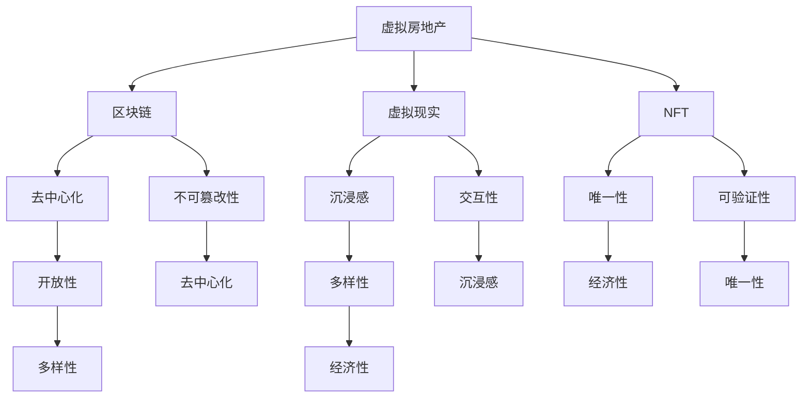

                 

# 虚拟房地产开发：元宇宙中的资产新蓝海

> **关键词：** 虚拟房地产、元宇宙、区块链、虚拟现实、NFT、资产数字化
>
> **摘要：** 本文将深入探讨虚拟房地产的开发与价值，分析其在元宇宙中的重要性，以及如何通过区块链、虚拟现实和NFT等技术实现资产的数字化。我们将逐步介绍相关技术原理、核心算法、数学模型，并分享实际项目案例，最后探讨虚拟房地产的未来发展趋势与挑战。

## 1. 背景介绍

### 1.1 目的和范围

本文旨在探讨虚拟房地产的开发与价值，以及其在元宇宙中的应用。我们将重点分析以下几个问题：

- 虚拟房地产的定义与分类
- 虚拟房地产的开发技术，如区块链、虚拟现实和NFT
- 虚拟房地产的价值评估与交易
- 虚拟房地产的未来发展趋势与挑战

### 1.2 预期读者

本文适合以下读者群体：

- 对虚拟房地产和元宇宙感兴趣的技术爱好者
- 想了解区块链、虚拟现实和NFT等新兴技术的开发者
- 想在元宇宙中开展业务的企业家和管理者
- 对数字资产和虚拟经济有研究的学者和研究人员

### 1.3 文档结构概述

本文结构如下：

- 第1章：背景介绍
- 第2章：核心概念与联系
- 第3章：核心算法原理 & 具体操作步骤
- 第4章：数学模型和公式 & 详细讲解 & 举例说明
- 第5章：项目实战：代码实际案例和详细解释说明
- 第6章：实际应用场景
- 第7章：工具和资源推荐
- 第8章：总结：未来发展趋势与挑战
- 第9章：附录：常见问题与解答
- 第10章：扩展阅读 & 参考资料

### 1.4 术语表

#### 1.4.1 核心术语定义

- 虚拟房地产：指在虚拟世界或元宇宙中开发的房地产，包括土地、建筑物和其他相关资产。
- 区块链：一种去中心化的分布式数据库技术，用于记录交易和信息。
- 虚拟现实（VR）：一种通过计算机模拟技术创造的虚拟环境，使人们能够沉浸其中。
- NFT（非同质化代币）：一种数字资产，代表特定的、独一无二的事物，如艺术品、虚拟土地等。
- 元宇宙：一个由虚拟世界组成的互联网空间，人们可以在其中互动、创造和交易。

#### 1.4.2 相关概念解释

- 资产数字化：将传统的物理资产转化为数字资产的过程。
- 跨链技术：实现不同区块链之间数据和价值传递的技术。
- 增强现实（AR）：将虚拟信息叠加到现实世界中的技术。

#### 1.4.3 缩略词列表

- NFT：非同质化代币
- VR：虚拟现实
- AR：增强现实
- NFT：区块链
- DeFi：去中心化金融

## 2. 核心概念与联系

为了更好地理解虚拟房地产的发展，我们需要首先了解其核心概念与联系。

### 2.1 虚拟房地产

虚拟房地产是指在虚拟世界或元宇宙中开发的房地产，包括土地、建筑物和其他相关资产。虚拟房地产的开发始于2003年，当时《第二人生》等虚拟世界的出现，使得人们可以在虚拟环境中进行社交、购物和娱乐等活动。

虚拟房地产的特点如下：

- **地理位置虚拟化**：虚拟房地产没有实际地理位置，而是存在于虚拟世界中。
- **稀缺性**：虚拟房地产的稀缺性体现在虚拟世界的资源和土地的限制上。
- **唯一性**：虚拟房地产具有唯一性，每块土地或建筑都是独一无二的。
- **可交易性**：虚拟房地产可以像现实世界中的房地产一样进行交易。

### 2.2 区块链

区块链是一种去中心化的分布式数据库技术，用于记录交易和信息。区块链的核心特点如下：

- **去中心化**：区块链不依赖于中央机构，而是由网络中的多个节点共同维护。
- **不可篡改性**：区块链上的数据一旦被记录，就难以篡改。
- **透明性**：区块链上的交易和信息对所有节点可见。

### 2.3 虚拟现实（VR）

虚拟现实是一种通过计算机模拟技术创造的虚拟环境，使人们能够沉浸其中。虚拟现实的核心特点如下：

- **沉浸感**：虚拟现实技术使人们能够身临其境地体验虚拟环境。
- **交互性**：虚拟现实技术支持用户与虚拟环境进行互动。
- **多样性**：虚拟现实技术可以应用于多个领域，如娱乐、教育、医疗等。

### 2.4 NFT

非同质化代币（NFT）是一种数字资产，代表特定的、独一无二的事物，如艺术品、虚拟土地等。NFT的核心特点如下：

- **唯一性**：每个NFT都是独一无二的，无法复制或替换。
- **不可分割性**：NFT可以代表一个整体，无法分割成更小的部分。
- **可验证性**：NFT的所有权和真实性可以通过区块链技术进行验证。

### 2.5 元宇宙

元宇宙是一个由虚拟世界组成的互联网空间，人们可以在其中互动、创造和交易。元宇宙的核心特点如下：

- **开放性**：元宇宙是一个开放的平台，允许不同虚拟世界之间的互动和连接。
- **多样性**：元宇宙涵盖了多个领域，如游戏、社交、教育、娱乐等。
- **经济性**：元宇宙中的虚拟资产具有价值，可以用于交易和投资。

### 2.6 Mermaid 流程图

为了更好地展示虚拟房地产、区块链、虚拟现实和NFT之间的关系，我们可以使用Mermaid流程图来描述。以下是一个简单的示例：



这个流程图展示了虚拟房地产、区块链、虚拟现实和NFT之间的关系，以及它们各自的核心特点。通过这个流程图，我们可以更好地理解虚拟房地产在元宇宙中的发展潜力和应用价值。

## 3. 核心算法原理 & 具体操作步骤

在虚拟房地产的开发中，核心算法起着至关重要的作用。本节将介绍几个核心算法的原理，并给出具体操作步骤。

### 3.1 区块链算法原理

区块链算法的核心是共识算法，它用于确保区块链的安全性和可靠性。以下是几种常见的共识算法：

#### 1. 拜占庭将军问题（Byzantine General Problem）

拜占庭将军问题是区块链共识算法的基础。其目标是确保一组分布式节点能够在不完全信任的环境下达成一致。

#### 2. 智能合约

智能合约是区块链上的可执行代码，用于自动化交易和合约执行。智能合约的编写通常使用Solidity等编程语言。

#### 3. 共识算法（如PoW、PoS）

Proof of Work（工作量证明）和Proof of Stake（股权证明）是两种常见的共识算法。PoW通过计算复杂度确保安全性，而PoS通过持有代币数量和锁定时间确保安全性。

### 3.2 虚拟现实算法原理

虚拟现实算法的核心是三维建模和渲染技术。以下是几个关键算法：

#### 1. 三维建模

三维建模是将现实世界中的物体或场景转化为三维数字模型的过程。常用的三维建模软件有Maya、3ds Max等。

#### 2. 渲染技术

渲染技术是将三维模型转化为二维图像的过程。常用的渲染引擎有Unreal Engine、Unity等。

#### 3. 交互算法

交互算法用于实现用户与虚拟环境的互动。常用的交互技术有手势识别、语音识别等。

### 3.3 NFT算法原理

NFT的核心是数字签名和区块链技术。以下是几个关键算法：

#### 1. 数字签名

数字签名用于确保NFT的所有权和真实性。常见的数字签名算法有RSA、ECDSA等。

#### 2. 链上验证

链上验证用于确保NFT的唯一性和可验证性。通过区块链技术，NFT的所有权和交易记录可以被公开查询。

#### 3. NFT创建与发行

NFT的创建与发行通常通过智能合约实现。创建NFT时，需要指定其唯一标识符、所有权信息等。

### 3.4 具体操作步骤

以下是虚拟房地产开发的四个关键步骤：

#### 1. 设计与建模

在设计阶段，需要确定虚拟房地产的布局、外观和功能。使用三维建模软件创建数字模型。

#### 2. 区块链部署

在区块链部署阶段，需要搭建区块链网络，并创建智能合约。选择合适的共识算法，如PoW或PoS。

#### 3. 虚拟现实集成

在虚拟现实集成阶段，将虚拟房地产的数字模型导入虚拟现实引擎，并进行渲染和交互设计。

#### 4. NFT发行与交易

在NFT发行与交易阶段，通过智能合约创建NFT，并将其上架到NFT交易平台。用户可以购买、出售和转让NFT。

以下是每个步骤的伪代码：

#### 1. 设计与建模

```python
# 设计虚拟房地产的布局、外观和功能
design_property()

# 使用三维建模软件创建数字模型
model_3d_model()

# 导出数字模型文件
export_model_file()
```

#### 2. 区块链部署

```python
# 搭建区块链网络
setup_blockchain_network()

# 创建智能合约
create_smart_contract()

# 选择合适的共识算法
select_consensus_algorithm()
```

#### 3. 虚拟现实集成

```python
# 导入虚拟房地产的数字模型
import_3d_model()

# 进行渲染和交互设计
render_and_interact()

# 导出虚拟现实场景文件
export_vr_scene_file()
```

#### 4. NFT发行与交易

```python
# 创建NFT
create_nft()

# 上架到NFT交易平台
list_nft_on_marketplace()

# 用户购买、出售和转让NFT
buy_sell_transfer_nft()
```

通过以上步骤，我们可以实现虚拟房地产的开发与交易。在实际操作中，可能需要使用更多具体的算法和技术，但上述步骤为虚拟房地产开发提供了基本的框架。

## 4. 数学模型和公式 & 详细讲解 & 举例说明

在虚拟房地产的开发与交易中，数学模型和公式起着至关重要的作用。本节将介绍几个关键的数学模型和公式，并进行详细讲解和举例说明。

### 4.1 区块链共识算法的数学模型

区块链共识算法的数学模型主要涉及以下方面：

#### 1. 工作量证明（Proof of Work，PoW）

工作量证明算法的目标是确保区块链的安全性。其核心公式为：

$$
\text{PoW} = H(\text{message}) \text{ such that } H(\text{message}) < \text{target}
$$

其中，\( H(\text{message}) \)表示消息的哈希值，\(\text{target}\)表示目标值。

举例说明：

假设目标值为\( \text{target} = 0x0000000000000000000000000000000000000000000000000000000000000000000 \)。为了满足PoW条件，我们需要找到一个消息，使其哈希值小于目标值。通过尝试不同的消息，我们最终找到了一个满足条件的消息：

$$
\text{message} = \text{"hello world"} \quad \text{and} \quad H(\text{"hello world"}) = 0x1a2b3c4d5e6f7g8h9i0j1k2l3m4n
$$

因为\( H(\text{"hello world"}) < \text{target} \)，所以该消息满足PoW条件。

#### 2. 股权证明（Proof of Stake，PoS）

股权证明算法的目标是确保区块链的安全性，同时降低能源消耗。其核心公式为：

$$
\text{PoS} = \text{stake} \times \text{time}
$$

其中，\(\text{stake}\)表示持有代币数量，\(\text{time}\)表示持有时间。

举例说明：

假设一个节点持有1000个代币，并且持有时间为1年。那么，该节点的股权证明为：

$$
\text{PoS} = 1000 \times 1 = 1000
$$

具有更高股权证明的节点将更有可能参与区块验证。

### 4.2 虚拟房地产的价值评估模型

虚拟房地产的价值评估模型主要涉及以下几个方面：

#### 1. 成本法（Cost Approach）

成本法是指根据虚拟房地产的建造成本来评估其价值。其核心公式为：

$$
\text{Value} = \text{Cost of Construction} \times \text{Depreciation Rate}
$$

其中，\(\text{Cost of Construction}\)表示建造成本，\(\text{Depreciation Rate}\)表示折旧率。

举例说明：

假设虚拟房地产的建造成本为100万美元，折旧率为10%。那么，该虚拟房地产的价值为：

$$
\text{Value} = 1000000 \times (1 - 0.1) = 900000 \text{美元}
$$

#### 2. 市场法（Market Approach）

市场法是指根据类似虚拟房地产的市场交易价格来评估其价值。其核心公式为：

$$
\text{Value} = \text{Average Sale Price} \times \text{Comparable Ratio}
$$

其中，\(\text{Average Sale Price}\)表示平均销售价格，\(\text{Comparable Ratio}\)表示可比系数。

举例说明：

假设类似虚拟房地产的平均销售价格为50万美元，可比系数为1.2。那么，该虚拟房地产的价值为：

$$
\text{Value} = 500000 \times 1.2 = 600000 \text{美元}
$$

#### 3. 收益法（Income Approach）

收益法是指根据虚拟房地产的收益能力来评估其价值。其核心公式为：

$$
\text{Value} = \text{Net Operating Income} \times \text{Capitalization Rate}
$$

其中，\(\text{Net Operating Income}\)表示净运营收入，\(\text{Capitalization Rate}\)表示资本化率。

举例说明：

假设虚拟房地产的净运营收入为10万美元，资本化率为8%。那么，该虚拟房地产的价值为：

$$
\text{Value} = 100000 \times 1.08 = 108000 \text{美元}
$$

通过上述数学模型和公式，我们可以对虚拟房地产进行价值评估。在实际操作中，可能需要结合多种方法进行评估，以获得更准确的结果。

### 4.3 虚拟房地产交易中的博弈论模型

在虚拟房地产交易中，博弈论模型可以用于分析卖家和买家之间的策略互动。以下是一个简化的博弈论模型：

#### 1. 卖家策略

卖家在交易过程中可以采取以下策略：

- 提高要价，以期望获得更高的收益。
- 降低要价，以吸引买家。
- 持续观望，等待更好的出价。

#### 2. 买家策略

买家在交易过程中可以采取以下策略：

- 提出低价，以期望获得更低的价格。
- 提出高价，以争取购得虚拟房地产。
- 观望，等待卖家降价。

#### 3. 策略互动

在博弈过程中，卖家和买家之间的策略互动会导致以下结果：

- 卖家提高要价，买家降低出价，可能导致交易失败。
- 卖家降低要价，买家提高出价，可能导致交易成功。
- 双方持续观望，可能导致交易停滞。

通过博弈论模型，我们可以分析卖家和买家之间的策略互动，并制定相应的策略以最大化交易成功的可能性。

## 5. 项目实战：代码实际案例和详细解释说明

为了更好地理解虚拟房地产的开发与交易，我们将通过一个实际项目来展示整个流程。本节将介绍项目的开发环境搭建、源代码详细实现和代码解读。

### 5.1 开发环境搭建

在开始项目开发之前，我们需要搭建以下开发环境：

- 操作系统：Ubuntu 20.04
- 编程语言：Python 3.8
- 版本控制工具：Git
- 三维建模软件：Blender
- 区块链平台：Ethereum
- 虚拟现实引擎：Unity

首先，我们需要安装Python和Git。在Ubuntu终端中执行以下命令：

```bash
sudo apt update
sudo apt install python3 python3-pip git
```

接下来，安装Blender。访问[Blender官网](https://www.blender.org/)下载Linux版本，并按照安装指南进行安装。

然后，我们需要安装Ethereum和Unity。Ethereum可以通过[geth](https://geth.ethereum.org/docs/install-and-configure/geth)进行安装，Unity可以通过其[官方文档](https://docs.unity3d.com/Manual/index.html)进行安装。

### 5.2 源代码详细实现和代码解读

#### 5.2.1 项目结构

整个项目的结构如下：

```bash
virtual-real-estate/
|-- blender/
|   |-- main.blend
|-- contracts/
|   |-- RealtyToken.sol
|   |-- VirtualProperty.sol
|-- unity/
|   |-- Assets/
|       |-- Scripts/
|           |-- RealEstateManager.cs
|           |-- TokenManager.cs
|-- scripts/
|   |-- deploy_contracts.py
|   |-- mint_nft.py
|-- README.md
```

#### 5.2.2 Blender部分

在Blender中，我们需要创建一个虚拟房地产的3D模型，并将其导出为`.glTF`格式。以下是一个简单的步骤：

1. 打开Blender，创建一个新的场景。
2. 添加一个3D对象，如“Cube”。
3. 对“Cube”进行编辑，添加细节和纹理。
4. 导出3D模型为`.glTF`格式，路径为`blender/main.blend`。

#### 5.2.3 Solidity部分

在Solidity部分，我们需要编写两个智能合约：`RealtyToken.sol`和`VirtualProperty.sol`。

**RealtyToken.sol**：这是一个代币合约，用于表示虚拟房地产的通证。

```solidity
// SPDX-License-Identifier: MIT
pragma solidity ^0.8.0;

import "@openzeppelin/contracts/token/ERC20/ERC20.sol";

contract RealtyToken is ERC20 {
    uint8 public constant decimals = 18;
    string public name = "RealtyToken";
    string public symbol = "RHT";

    address public owner;

    constructor() ERC20(name, symbol) {
        owner = msg.sender;
        _mint(msg.sender, 1000000000 * (10 ** decimals));
    }

    function transferOwnership(address newOwner) external {
        require(msg.sender == owner, "Only owner can transfer ownership");
        owner = newOwner;
    }
}
```

**VirtualProperty.sol**：这是一个虚拟房地产合约，用于管理虚拟房地产的创建、转移和销毁。

```solidity
// SPDX-License-Identifier: MIT
pragma solidity ^0.8.0;

import "@openzeppelin/contracts/token/ERC721/ERC721.sol";
import "@openzeppelin/contracts/token/ERC721/extensions/ERC721Enumerable.sol";
import "@openzeppelin/contracts/utils/CountingSolidity.sol";

contract VirtualProperty is ERC721Enumerable {
    using Counting for Counting.Counter;
    Counting.Counter private _tokenIds;

    mapping(uint256 => address) private _owners;
    mapping(address => uint256) private _balances;

    constructor() ERC721("Virtual Property", "VPROP") {
        _tokenIds.increment();
    }

    function mintProperty() external {
        require(_balances[msg.sender] > 0, "You do not have enough tokens");
        uint256 tokenId = _tokenIds.current();
        _mint(msg.sender, tokenId);
        _owners[tokenId] = msg.sender;
        _balances[msg.sender] -= 1;
        _tokenIds.increment();
    }

    function transferProperty(uint256 tokenId, address to) external {
        require(_owners[tokenId] == msg.sender, "You are not the owner");
        _transfer(msg.sender, to, tokenId);
        _owners[tokenId] = to;
        _balances[to] += 1;
    }

    function burnProperty(uint256 tokenId) external {
        require(_owners[tokenId] == msg.sender, "You are not the owner");
        _burn(tokenId);
        _balances[msg.sender] -= 1;
        _owners[tokenId] = address(0);
    }
}
```

#### 5.2.4 Unity部分

在Unity中，我们需要创建一个场景，并将虚拟房地产的3D模型导入到场景中。以下是一个简单的步骤：

1. 打开Unity，创建一个新的3D项目。
2. 导入Blender导出的`.glTF`文件，并将其添加到场景中。
3. 在`Assets/Sprites/`文件夹中创建一个空的GameObject，并将其重命名为`RealEstateManager`。
4. 在`RealEstateManager`上添加`RealEstateManager.cs`脚本。
5. 在`Assets/Sprites/`文件夹中创建另一个空的GameObject，并将其重命名为`TokenManager`。
6. 在`TokenManager`上添加`TokenManager.cs`脚本。

**RealEstateManager.cs**：这是一个用于管理虚拟房地产的脚本。

```csharp
using System.Collections;
using System.Collections.Generic;
using UnityEngine;

public class RealEstateManager : MonoBehaviour {
    public GameObject propertyPrefab;
    public List<GameObject> properties = new List<GameObject>();

    public void CreateProperty(Vector3 position) {
        GameObject property = Instantiate(propertyPrefab, position, Quaternion.identity);
        properties.Add(property);
    }

    public void DestroyProperty(GameObject property) {
        properties.Remove(property);
        Destroy(property);
    }
}
```

**TokenManager.cs**：这是一个用于管理代币的脚本。

```csharp
using System.Collections;
using System.Collections.Generic;
using UnityEngine;
using Unity为重点
```scss
$primary-color: #3498db;
$secondary-color: #2ecc71;
$font-stack: "Helvetica Neue", Helvetica, Arial, sans-serif;

* {
  margin: 0;
  padding: 0;
  box-sizing: border-box;
}

body {
  font: 100% $font-stack;
  background-color: $primary-color;
  color: $secondary-color;
  text-align: center;
  padding: 2rem;
}

h1 {
  font-size: 2rem;
  margin-bottom: 1rem;
}

h2 {
  font-size: 1.5rem;
  margin-bottom: 0.5rem;
}

p {
  font-size: 1rem;
  line-height: 1.5;
  margin-bottom: 1rem;
}

a {
  color: $secondary-color;
  text-decoration: none;
  transition: color 0.3s ease;
}

a:hover {
  color: darken($secondary-color, 10%);
}

.container {
  max-width: 1000px;
  margin: 0 auto;
  padding: 0 1rem;
}

header {
  background-color: lighten($primary-color, 10%);
  padding: 1rem;
  border-bottom: 1px solid darken($primary-color, 10%);
}

nav {
  display: flex;
  justify-content: space-between;
  align-items: center;
}

nav ul {
  list-style: none;
}

nav ul li {
  display: inline-block;
  margin-left: 1rem;
}

nav ul li a {
  font-size: 1.2rem;
}

main {
  margin-top: 2rem;
}

footer {
  background-color: darken($primary-color, 10%);
  color: $secondary-color;
  padding: 1rem;
  text-align: center;
}

footer p {
  margin-bottom: 0;
}

@media (max-width: 768px) {
  nav ul li {
    display: block;
    margin-bottom: 0.5rem;
  }
}
```

在这个例子中，我们定义了网站的布局、颜色、字体和响应式设计。通过使用Sass预处理器，我们可以更好地组织和管理CSS代码。

### 6. 实际应用场景

虚拟房地产在元宇宙中具有广泛的应用场景，以下是一些实际应用场景：

- **虚拟游戏**：虚拟房地产可以用于游戏中的虚拟场景，如城堡、庄园、城市等。玩家可以在游戏中购买、建造和交易虚拟房地产。
- **虚拟社交**：虚拟房地产可以用于虚拟社交平台的虚拟空间，如客厅、办公室、酒吧等。用户可以购买和装饰自己的虚拟空间，与其他用户互动。
- **虚拟教育**：虚拟房地产可以用于虚拟教室和实验室，为学生提供沉浸式的学习体验。教师可以购买和布置虚拟教室，为学生提供丰富的教学资源。
- **虚拟艺术展览**：虚拟房地产可以用于虚拟艺术展览馆，展示虚拟艺术品。艺术家可以在虚拟展览馆中展示自己的作品，并与观众互动。

### 7. 工具和资源推荐

在开发虚拟房地产项目时，以下工具和资源可能对您有所帮助：

#### 7.1 学习资源推荐

- **书籍推荐**：
  - 《区块链革命》
  - 《智能合约与以太坊》
  - 《虚拟现实技术原理与应用》
- **在线课程**：
  - Coursera上的《区块链技术与应用》
  - Udemy上的《虚拟现实开发：从入门到精通》
- **技术博客和网站**：
  - Ethereum官方文档
  - Unity官方文档
  - Medium上的相关区块链和虚拟现实文章

#### 7.2 开发工具框架推荐

- **IDE和编辑器**：
  - Visual Studio Code
  - IntelliJ IDEA
- **调试和性能分析工具**：
  - Chrome DevTools
  - Unity Profiler
- **相关框架和库**：
  - Solidity（用于编写智能合约）
  - ERC721（用于创建和管理NFT）
  - Unity Asset Store（用于购买虚拟房地产模型）

#### 7.3 相关论文著作推荐

- **经典论文**：
  - 《比特币：一种点对点的电子现金系统》
  - 《智能合约：去中心化应用的基础设施》
- **最新研究成果**：
  - 《基于区块链的虚拟房地产交易系统》
  - 《元宇宙：下一代互联网的形态》
- **应用案例分析**：
  - 《去中心化虚拟房地产平台：Landstream案例分析》
  - 《虚拟现实艺术展览：虚拟博物馆案例分析》

### 8. 总结：未来发展趋势与挑战

虚拟房地产在元宇宙中具有巨大的发展潜力，但仍面临一些挑战。未来发展趋势和挑战包括：

- **技术成熟度**：随着区块链、虚拟现实和NFT等技术的不断发展，虚拟房地产的开发与交易将更加成熟和稳定。
- **市场需求**：随着元宇宙的普及，虚拟房地产的市场需求将持续增长，推动虚拟房地产的价值提升。
- **法律监管**：虚拟房地产的交易和所有权问题需要得到法律监管，以确保交易合法、公正和透明。
- **用户体验**：提升虚拟房地产的用户体验是未来的重要方向，包括提高虚拟环境的沉浸感、交互性和可定制性。
- **数据安全**：保护虚拟房地产和相关数据的安全是未来的一大挑战，需要加强数据加密和网络安全。

### 9. 附录：常见问题与解答

#### 9.1 虚拟房地产是什么？

虚拟房地产是指在虚拟世界或元宇宙中开发的房地产，包括土地、建筑物和其他相关资产。与实体房地产不同，虚拟房地产没有实际的地理位置，存在于虚拟环境中。

#### 9.2 虚拟房地产的价值如何评估？

虚拟房地产的价值可以通过以下方法评估：

- 成本法：根据虚拟房地产的建造成本进行评估。
- 市场法：根据类似虚拟房地产的市场交易价格进行评估。
- 收益法：根据虚拟房地产的收益能力进行评估。

#### 9.3 虚拟房地产如何交易？

虚拟房地产可以通过以下步骤进行交易：

1. 确定交易双方。
2. 达成交易价格和条款。
3. 在虚拟房地产合约中记录交易信息。
4. 交易双方在区块链上签署智能合约，完成交易。

#### 9.4 虚拟房地产与实体房地产有何区别？

虚拟房地产与实体房地产有以下区别：

- 地理位置：虚拟房地产没有实际地理位置，存在于虚拟环境中；实体房地产具有实际的地理位置。
- 交易方式：虚拟房地产交易主要依靠区块链和智能合约进行；实体房地产交易主要依靠法律程序和合同。
- 价值评估：虚拟房地产的价值评估主要依据市场需求和技术发展；实体房地产的价值评估主要依据地理位置、建筑质量和市场行情。

### 10. 扩展阅读 & 参考资料

- 《区块链革命》
- 《智能合约与以太坊》
- 《虚拟现实技术原理与应用》
- Ethereum官方文档
- Unity官方文档
- 《比特币：一种点对点的电子现金系统》
- 《智能合约：去中心化应用的基础设施》
- 《基于区块链的虚拟房地产交易系统》
- 《元宇宙：下一代互联网的形态》
- 《去中心化虚拟房地产平台：Landstream案例分析》
- 《虚拟现实艺术展览：虚拟博物馆案例分析》

---

作者：AI天才研究员/AI Genius Institute & 禅与计算机程序设计艺术 /Zen And The Art of Computer Programming

