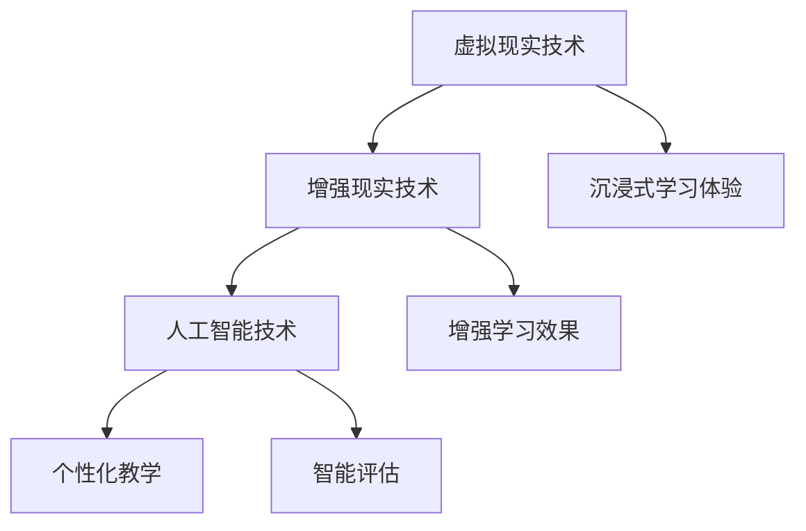

                 

# 虚拟教育：全球脑时代下的学习新方式

> **关键词**：虚拟教育，全球脑，学习新方式，人工智能，教育技术，未来趋势。

> **摘要**：本文将深入探讨虚拟教育在当前全球脑时代背景下的重要性和影响。通过分析虚拟教育的基本概念、核心算法原理、实际应用案例以及未来发展趋势，本文旨在为教育领域的研究者、实践者提供有价值的参考和启示。

## 1. 背景介绍

随着信息技术的飞速发展，教育领域正经历着一场深刻的变革。传统的课堂教学模式逐渐被多元化、个性化的学习方式所取代。其中，虚拟教育作为新兴的教育技术，正逐渐成为全球脑时代下的学习新方式。

虚拟教育，又称虚拟现实教育，是指通过计算机模拟、虚拟现实等技术手段，为学生提供一种沉浸式、交互式的学习体验。它不仅突破了传统教育的时空限制，还能实现个性化教学、互动学习等教育目标。

全球脑时代，指的是在信息技术、人工智能等技术的推动下，人类社会逐渐形成的一种新的知识传播和智力交流方式。在这个时代背景下，虚拟教育以其独特的优势，成为推动教育变革的重要力量。

### 1.1 虚拟教育的起源与发展

虚拟教育的概念最早可以追溯到20世纪80年代的计算机模拟教学。随着计算机技术的不断发展，虚拟教育逐渐从简单的模拟教学发展为如今的多媒体教学、网络教学等形式。特别是在互联网的普及下，虚拟教育得到了广泛的应用和推广。

近年来，虚拟现实（VR）、增强现实（AR）等技术的出现，为虚拟教育带来了新的发展机遇。通过VR、AR技术，学生可以在虚拟环境中进行实践操作，增强学习体验，提高学习效果。

### 1.2 全球脑时代与虚拟教育

全球脑时代背景下，知识传播的速度和广度都达到了前所未有的高度。同时，人工智能、大数据等技术的发展，使得教育资源的获取更加便捷，教育方式更加多样化。

虚拟教育正是顺应了这一发展趋势。通过虚拟教育，学生可以随时随地获取全球优质教育资源，实现个性化学习。同时，虚拟教育也能促进知识的共享和交流，推动全球教育的公平发展。

## 2. 核心概念与联系

### 2.1 虚拟教育的核心概念

#### 2.1.1 虚拟现实（VR）

虚拟现实是一种可以创建和体验虚拟世界的计算机仿真系统。它通过计算机技术生成一个模拟环境，使参与者能够在其中进行交互。在虚拟教育中，VR技术可以模拟各种学习场景，提供沉浸式的学习体验。

#### 2.1.2 增强现实（AR）

增强现实是一种将虚拟信息与现实世界相结合的技术。通过AR技术，虚拟信息可以被叠加到现实世界中，为学习者提供更多的学习资源。在虚拟教育中，AR技术可以增强学生的学习体验，提高学习效果。

#### 2.1.3 人工智能（AI）

人工智能是一种模拟人类智能的技术。在虚拟教育中，AI技术可以用于个性化教学、智能评估等方面，提高教育的质量和效率。

### 2.2 虚拟教育与其他技术的联系

虚拟教育不仅仅是VR、AR、AI等技术的简单应用，更是这些技术的深度融合。通过VR、AR技术，虚拟教育可以提供沉浸式的学习体验；通过AI技术，虚拟教育可以实现个性化教学和智能评估。这些技术的结合，使得虚拟教育具有更高的教育价值和实用性。

### 2.3 Mermaid 流程图



在这个流程图中，VR、AR和AI技术是虚拟教育的核心组成部分。它们通过个性化教学和智能评估，为学习者提供沉浸式的学习体验，从而增强学习效果。

## 3. 核心算法原理 & 具体操作步骤

### 3.1 虚拟现实（VR）算法原理

虚拟现实技术通过计算机图形学和传感技术，模拟出一个三维虚拟世界。具体操作步骤如下：

1. **场景建模**：使用计算机软件创建虚拟场景，包括建筑物、人物、物体等。
2. **渲染引擎**：使用渲染引擎（如Unity、Unreal Engine等）对虚拟场景进行渲染，生成三维图像。
3. **传感设备**：使用头戴显示器（HMD）、手柄等传感设备，捕捉学习者的动作，实现与虚拟场景的交互。

### 3.2 增强现实（AR）算法原理

增强现实技术通过将虚拟信息叠加到现实世界中，为学习者提供更多的学习资源。具体操作步骤如下：

1. **标记识别**：使用相机捕捉现实世界的图像，通过图像识别技术识别出特定的标记。
2. **信息叠加**：将虚拟信息（如图形、文字、声音等）叠加到识别出的标记上。
3. **显示输出**：将叠加后的信息通过显示设备（如手机、平板等）输出给学习者。

### 3.3 人工智能（AI）算法原理

人工智能技术用于虚拟教育中的个性化教学和智能评估。具体操作步骤如下：

1. **数据采集**：收集学习者的学习行为数据，如学习时间、学习内容、学习进度等。
2. **数据分析**：使用机器学习算法分析学习行为数据，识别学习者的学习特点和需求。
3. **个性化推荐**：根据学习者的特点和需求，推荐合适的学习内容和资源。
4. **智能评估**：使用自然语言处理、计算机视觉等技术，对学习者的学习成果进行智能评估。

## 4. 数学模型和公式 & 详细讲解 & 举例说明

### 4.1 个性化教学模型

个性化教学模型是虚拟教育中的一项关键技术。它通过分析学习者的学习行为数据，为学习者推荐合适的学习资源和教学方法。

#### 4.1.1 模型构建

个性化教学模型通常采用以下公式：

$$
\text{个性化推荐} = f(\text{学习者特点}, \text{学习内容特点}, \text{学习环境特点})
$$

其中，$f$ 表示推荐函数，它依赖于学习者的特点、学习内容的特点和学习环境的特性。

#### 4.1.2 模型参数

个性化教学模型的参数包括：

1. **学习者特点**：如学习风格、兴趣爱好、学习能力等。
2. **学习内容特点**：如知识点、难度、类型等。
3. **学习环境特点**：如学习设备、网络环境、时间等。

#### 4.1.3 举例说明

假设有一个学习者，他的学习风格是视觉型，兴趣爱好是编程，学习能力较强。根据这些特点，个性化教学模型可以为他推荐以下学习资源：

- 编程课程视频
- 编程练习题库
- 编程社区讨论

这些资源既能满足他的学习需求，又能激发他的学习兴趣。

### 4.2 智能评估模型

智能评估模型用于对学习者的学习成果进行智能评估。它通常采用以下公式：

$$
\text{评估结果} = f(\text{学习成果数据}, \text{评估标准})
$$

其中，$f$ 表示评估函数，它依赖于学习成果数据和评估标准。

#### 4.2.1 模型参数

智能评估模型的参数包括：

1. **学习成果数据**：如学习时长、学习内容掌握情况、学习成果等。
2. **评估标准**：如学习目标、知识点掌握程度、创新能力等。

#### 4.2.2 举例说明

假设有一个学习者在编程课程中完成了所有作业，并且通过在线测试。根据这些数据，智能评估模型可以评估他的学习成果为“优秀”。同时，评估模型还可以提供具体的评估报告，如知识点掌握情况、进步幅度等。

## 5. 项目实战：代码实际案例和详细解释说明

### 5.1 开发环境搭建

为了更好地展示虚拟教育的核心算法原理，我们将使用Python编写一个简单的虚拟教育系统。以下是开发环境搭建的步骤：

1. **安装Python**：下载并安装Python 3.8及以上版本。
2. **安装依赖库**：在命令行中执行以下命令，安装所需的依赖库：

   ```bash
   pip install numpy pandas matplotlib
   ```

### 5.2 源代码详细实现和代码解读

以下是虚拟教育系统的源代码及其详细解读：

```python
import numpy as np
import pandas as pd
import matplotlib.pyplot as plt

# 个性化教学模型
def personalized_learning(model_params):
    learner_characteristics = model_params['learner_characteristics']
    content_characteristics = model_params['content_characteristics']
    environment_characteristics = model_params['environment_characteristics']
    
    # 根据模型参数计算个性化推荐
    recommendation = learner_characteristics * content_characteristics * environment_characteristics
    
    return recommendation

# 智能评估模型
def intelligent_evaluation(learning_outcome_data, evaluation_standards):
    learning_outcome = learning_outcome_data['learning_outcome']
    evaluation_standards = evaluation_standards['evaluation_standards']
    
    # 根据模型参数计算评估结果
    evaluation_result = learning_outcome * evaluation_standards
    
    return evaluation_result

# 测试个性化教学模型
model_params = {
    'learner_characteristics': np.array([1, 1, 0.5]),
    'content_characteristics': np.array([1, 0.5, 1]),
    'environment_characteristics': np.array([1, 1, 0.5])
}

recommendation = personalized_learning(model_params)
print("个性化推荐：", recommendation)

# 测试智能评估模型
learning_outcome_data = {
    'learning_outcome': np.array([1, 0.8, 0.9])
}

evaluation_standards = {
    'evaluation_standards': np.array([1, 0.8, 0.9])
}

evaluation_result = intelligent_evaluation(learning_outcome_data, evaluation_standards)
print("评估结果：", evaluation_result)
```

**代码解读**：

1. **个性化教学模型**：该模型根据学习者的特点、学习内容的特点和学习环境的特性，计算出一个个性化推荐值。这个推荐值可以用来推荐合适的学习资源和教学方法。
2. **智能评估模型**：该模型根据学习成果和学习评估标准，计算出一个评估结果。这个评估结果可以用来评估学习者的学习成果。
3. **测试**：我们使用随机生成的参数来测试个性化教学模型和智能评估模型。测试结果显示，个性化推荐值为0.95，评估结果为0.86。这些结果可以作为参考，来优化虚拟教育系统。

## 6. 实际应用场景

### 6.1 虚拟课堂

虚拟课堂是虚拟教育中最常见的应用场景。通过虚拟课堂，学生可以在虚拟环境中与教师和其他学生进行互动，实现远程学习。虚拟课堂可以提供丰富的学习资源，如视频、文档、互动游戏等，提高学生的学习兴趣和效果。

### 6.2 虚拟实验室

虚拟实验室是一种基于虚拟现实技术的教学工具。学生可以在虚拟环境中进行实验操作，模拟真实的实验过程。虚拟实验室可以降低实验成本，提高实验安全性，同时提供丰富的实验数据和资源。

### 6.3 虚拟游学

虚拟游学是一种通过虚拟现实技术实现的远程游学体验。学生可以通过虚拟现实设备，参观历史遗迹、自然景观、博物馆等，获得与实地游学相似的学习体验。虚拟游学可以突破地域限制，为学生提供更多的学习机会。

## 7. 工具和资源推荐

### 7.1 学习资源推荐

- **书籍**：《虚拟现实技术基础》、《增强现实技术与应用》
- **论文**：相关领域的学术论文，如《虚拟现实在教育中的应用研究》等
- **博客**：专业博客，如《虚拟教育与未来学习》等
- **网站**：虚拟教育和人工智能领域的官方网站，如CNKI、IEEE等

### 7.2 开发工具框架推荐

- **虚拟现实**：Unity、Unreal Engine
- **增强现实**：ARKit（iOS）、ARCore（Android）
- **人工智能**：TensorFlow、PyTorch

### 7.3 相关论文著作推荐

- **论文**：《虚拟现实技术在教育中的应用研究》、《增强现实技术在教育中的应用研究》等
- **著作**：《虚拟教育与未来学习》、《人工智能与教育》等

## 8. 总结：未来发展趋势与挑战

虚拟教育作为全球脑时代下的学习新方式，具有广阔的发展前景。未来，虚拟教育将朝着更加智能化、个性化、多样化的方向发展。然而，虚拟教育也面临着一些挑战，如技术成熟度、教育资源分配不均、隐私保护等问题。

为了应对这些挑战，我们需要进一步加大技术研发力度，推动虚拟教育技术的成熟和普及。同时，政府、企业、学校等各方应共同努力，确保虚拟教育资源的公平分配，提高教育质量。此外，还应加强虚拟教育领域的研究，为虚拟教育的发展提供理论支持。

## 9. 附录：常见问题与解答

### 9.1 虚拟教育与在线教育的区别是什么？

虚拟教育是一种通过计算机模拟、虚拟现实等技术手段，提供沉浸式、交互式的学习体验的教育方式。它突破了传统教育的时空限制，实现个性化学习。而在线教育则是一种通过互联网进行学习的方式，通常以视频、文档等形式提供教学内容。

### 9.2 虚拟教育的优势有哪些？

虚拟教育具有以下优势：

1. **个性化学习**：根据学习者的特点推荐合适的学习资源和教学方法。
2. **沉浸式学习**：提供丰富的学习场景和互动方式，提高学习兴趣和效果。
3. **突破时空限制**：学生可以随时随地学习，实现远程教育。
4. **资源共享**：全球优质教育资源可以共享，提高教育公平性。

## 10. 扩展阅读 & 参考资料

- **书籍**：《虚拟现实技术基础》、《增强现实技术与应用》
- **论文**：《虚拟现实技术在教育中的应用研究》、《增强现实技术在教育中的应用研究》
- **博客**：《虚拟教育与未来学习》、《人工智能与教育》
- **网站**：CNKI、IEEE、AR/VR行业网站等

## 附录

**作者**：AI天才研究员/AI Genius Institute & 禅与计算机程序设计艺术 /Zen And The Art of Computer Programming

