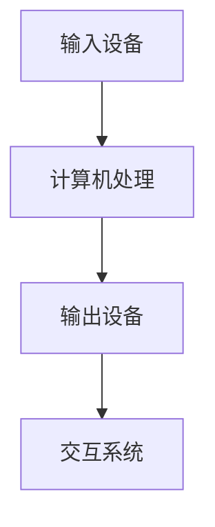

                 

# 虚拟现实 (Virtual Reality)

> 关键词：虚拟现实、VR、增强现实、AR、3D建模、交互技术、硬件设备、图形渲染、用户体验

> 摘要：本文将深入探讨虚拟现实技术的概念、核心原理、发展历程、技术架构以及其在各行业的应用。通过详细的分析和实际案例，读者将了解到虚拟现实技术背后的数学模型、算法原理，以及如何构建和优化虚拟现实体验。此外，本文还将推荐相关工具和资源，帮助读者进一步探索这一前沿技术领域。

## 1. 背景介绍

虚拟现实（Virtual Reality，简称VR）是一种通过计算机技术创造出来的三维虚拟环境，用户可以通过头戴显示器（Head-Mounted Display，HMD）或其他交互设备进入这个虚拟世界，与虚拟环境中的对象进行交互。虚拟现实技术最初起源于20世纪60年代的计算机科学领域，随着计算机性能的不断提高和硬件设备的不断进步，VR技术逐渐走向成熟。

### 发展历程

- **1960年代**：VR概念首次被提出，伊凡·苏瑟兰（Ivan Sutherland）设计出了首个头戴显示器，被称为“达摩克利斯之剑”。
- **1980年代**：VR技术开始应用于游戏和模拟训练。
- **1990年代**：VR设备开始进入市场，但受限于性能和成本，未能大规模普及。
- **2000年代**：随着图形处理技术和传感器技术的进步，VR设备开始具备较高的真实感，并逐渐应用于教育培训、医疗康复等领域。
- **2010年代**：虚拟现实市场迎来了新的热潮，头戴显示器如Oculus Rift、HTC Vive等相继问世，使得VR体验更加逼真。

### 核心技术

- **3D建模**：通过计算机图形学技术创建三维模型，是虚拟现实的基础。
- **交互技术**：用户与虚拟环境之间的交互方式，包括手势识别、语音识别等。
- **硬件设备**：如头戴显示器、手柄、全传感器手套等，用于提供沉浸式的用户体验。
- **图形渲染**：通过计算机图形学技术将三维模型渲染成图像，实现逼真的视觉效果。

## 2. 核心概念与联系

### 虚拟现实与增强现实的区别

虚拟现实（VR）和增强现实（AR）都是通过计算机技术实现的虚拟环境，但两者的应用场景和实现方式有所不同。

- **虚拟现实（VR）**：完全沉浸式体验，用户通过头戴显示器等设备进入一个虚拟的三维环境，与虚拟环境中的对象进行交互。
- **增强现实（AR）**：部分沉浸式体验，虚拟元素叠加在现实世界中，用户通过智能手机或头戴显示器等设备看到虚拟元素与现实环境的结合。

### 虚拟现实技术架构

虚拟现实技术架构主要包括以下几个关键组成部分：

1. **输入设备**：如头戴显示器、手柄、全传感器手套等，用于捕捉用户的动作和反馈。
2. **计算机处理**：通过计算机图形学技术生成三维模型和渲染图像，并实时计算用户的运动轨迹和位置。
3. **输出设备**：将计算机处理的结果通过头戴显示器等设备呈现给用户，提供沉浸式的视觉体验。
4. **交互系统**：包括手势识别、语音识别等技术，实现用户与虚拟环境的交互。

### Mermaid 流程图



## 3. 核心算法原理 & 具体操作步骤

### 3D建模算法

3D建模是虚拟现实技术的核心，通过计算机图形学技术实现三维模型的创建和编辑。主要算法包括：

1. **多边形建模**：使用多边形（如三角形、四面体等）来构建三维模型。
2. **贝塞尔曲线建模**：使用贝塞尔曲线来创建光滑的三维模型。
3. **曲面建模**：使用曲面（如NURBS、B样条等）来创建复杂的几何形状。

### 图形渲染算法

图形渲染是将三维模型转化为二维图像的过程，主要算法包括：

1. **光线追踪**：通过模拟光线在场景中的传播，实现高质量的图像渲染。
2. **渲染管线**：将图形渲染过程分为多个阶段，如几何处理、着色、光照等。
3. **纹理映射**：将图像纹理应用到三维模型表面，增加视觉效果的真实感。

### 交互算法

交互算法用于实现用户与虚拟环境之间的交互，主要算法包括：

1. **手势识别**：通过计算机视觉技术识别用户的手势，实现虚拟环境中的交互操作。
2. **语音识别**：通过语音识别技术将用户的语音转换为文本或命令，实现虚拟环境中的交互。
3. **位置追踪**：通过传感器技术追踪用户的位置和动作，实现虚拟环境中的导航和交互。

## 4. 数学模型和公式 & 详细讲解 & 举例说明

### 3D建模数学模型

在3D建模中，常见的数学模型包括：

1. **点、线、面**：点用三维坐标表示，线由两个点确定，面由三个或更多点确定。
2. **向量运算**：用于表示方向和大小，如向量加法、向量减法、向量乘法等。
3. **矩阵运算**：用于表示变换，如平移、旋转、缩放等。

### 图形渲染数学模型

在图形渲染中，常见的数学模型包括：

1. **光线追踪**：通过计算光线与场景物体的交点，确定像素的颜色。
2. **透视变换**：将三维场景映射到二维屏幕上，实现视觉效果的真实感。
3. **纹理映射**：通过纹理坐标将图像纹理应用到三维模型表面。

### 交互算法数学模型

在交互算法中，常见的数学模型包括：

1. **手势识别**：通过深度学习算法识别用户的手势。
2. **语音识别**：通过自然语言处理算法将用户的语音转换为文本或命令。
3. **位置追踪**：通过传感器数据计算用户的位置和动作。

### 举例说明

#### 3D建模

假设我们有一个由三个顶点确定的三维模型面，其顶点坐标分别为A(1, 1, 1)、B(2, 2, 2)、C(3, 3, 3)，我们可以通过以下步骤进行建模：

1. 计算向量AB = B - A = (1, 1, 1)
2. 计算向量AC = C - A = (2, 2, 2)
3. 计算向量AB与向量AC的叉积，得到法向量N = AB × AC = (1, 1, 1) × (2, 2, 2) = (0, 0, 0)
4. 计算面心O = (A + B + C) / 3 = (2, 2, 2)

#### 图形渲染

假设我们有一个由三个顶点确定的三维模型面，其顶点坐标分别为A(1, 1, 1)、B(2, 2, 2)、C(3, 3, 3)，并且光源位于点S(0, 0, 0)，我们可以通过以下步骤进行渲染：

1. 计算向量SA = A - S = (1, 1, 1)
2. 计算向量SB = B - S = (2, 2, 2)
3. 计算向量SC = C - S = (3, 3, 3)
4. 计算面心O = (A + B + C) / 3 = (2, 2, 2)
5. 计算面法向量N = (0, 0, 0) × (1, 1, 1) × (2, 2, 2) = (0, 0, 0)
6. 计算光线与面的交点P，根据光线与面的法向量的点积确定颜色C = N·S

## 5. 项目实战：代码实际案例和详细解释说明

### 开发环境搭建

在搭建虚拟现实项目开发环境时，我们可以选择以下工具：

1. **开发工具**：Unity、Unreal Engine等。
2. **编程语言**：C#、C++等。
3. **硬件设备**：Oculus Rift、HTC Vive等。

### 源代码详细实现和代码解读

以下是一个简单的虚拟现实项目代码示例，我们将使用Unity引擎和C#语言进行实现。

```csharp
using UnityEngine;

public class VRController : MonoBehaviour
{
    public GameObject player;

    void Update()
    {
        // 更新玩家位置
        player.transform.position = new Vector3(Input.GetAxis("Horizontal"), player.transform.position.y, Input.GetAxis("Vertical"));
        
        // 更新玩家旋转
        player.transform.Rotate(new Vector3(0, Input.GetAxis("Mouse X"), 0));
    }
}
```

### 代码解读与分析

1. **类定义**：`VRController` 类继承自 `MonoBehaviour` 类，用于控制虚拟现实中的玩家角色。
2. **组件添加**：在Unity编辑器中，我们将此脚本附加到玩家角色上。
3. **更新方法**：`Update` 方法每帧执行，用于更新玩家位置和旋转。
4. **输入处理**：使用 `Input.GetAxis` 方法获取玩家输入的水平和垂直方向，用于移动玩家。
5. **旋转处理**：使用 `Input.GetAxis` 方法获取鼠标X轴输入，用于旋转玩家。

通过上述代码示例，我们可以实现一个简单的虚拟现实项目，玩家可以自由移动和旋转。

## 6. 实际应用场景

虚拟现实技术在实际应用场景中具有广泛的应用，以下是一些典型的应用场景：

1. **教育培训**：通过虚拟现实技术，可以创建逼真的教学场景，提高学生的学习兴趣和效果。
2. **医疗康复**：虚拟现实技术可以用于模拟手术过程、训练医生操作技能以及康复治疗。
3. **游戏娱乐**：虚拟现实游戏提供了全新的沉浸式体验，吸引了许多玩家。
4. **房地产展示**：虚拟现实技术可以用于创建逼真的房地产模型，让客户远程参观和体验。
5. **工业设计**：虚拟现实技术可以用于产品设计和制造过程的模拟，提高生产效率和质量。

## 7. 工具和资源推荐

### 学习资源推荐

- **书籍**：《虚拟现实技术原理与应用》、《增强现实技术原理与应用》
- **论文**：Google Scholar、IEEE Xplore等数据库中的相关论文
- **博客**：Medium、GitHub等平台上的专业博客
- **网站**：Oculus、HTC Vive、Unity等公司的官方网站

### 开发工具框架推荐

- **开发工具**：Unity、Unreal Engine、Blender等。
- **编程语言**：C#、C++、Python等。
- **硬件设备**：Oculus Rift、HTC Vive、VR One等。

### 相关论文著作推荐

- **论文**：
  - "Virtual Reality: Theory, Practice, and Applications" by Mark Green and Steve Holloway
  - "A Survey of Virtual Reality Technologies and Applications" by Jie Liu, Jingwen Wang, and Xiaohui Liu
- **著作**：
  - "The Design of Future Realities: A Practical Guide to Virtual Reality and Augmented Reality" by Mark P. Platts

## 8. 总结：未来发展趋势与挑战

虚拟现实技术在未来将继续发展，并在更多领域得到应用。然而，要实现更高质量的虚拟现实体验，我们仍面临以下挑战：

1. **性能提升**：提高硬件设备的性能，以满足更复杂的虚拟现实场景和更高的帧率要求。
2. **交互技术**：开发更自然、更直观的交互技术，提高用户体验。
3. **内容创作**：丰富虚拟现实内容，提供更具吸引力的应用场景。
4. **伦理与隐私**：解决虚拟现实技术带来的伦理和隐私问题，确保用户数据的安全。

## 9. 附录：常见问题与解答

### 问题1：如何选择合适的虚拟现实开发工具？

**解答**：根据项目需求和开发经验，选择适合的开发工具。Unity和Unreal Engine是两款流行的虚拟现实开发工具，前者更适合轻度游戏和应用开发，后者则适合复杂游戏和应用开发。

### 问题2：虚拟现实技术对硬件设备有什么要求？

**解答**：虚拟现实技术对硬件设备的要求较高，主要包括高性能的CPU、GPU和内存。此外，头戴显示器、手柄、全传感器手套等交互设备也是影响虚拟现实体验的重要因素。

### 问题3：如何确保虚拟现实体验的真实感？

**解答**：确保虚拟现实体验的真实感需要从多个方面进行优化，包括提高图形渲染质量、优化交互技术、丰富虚拟现实内容等。此外，合理设置场景中的光照、纹理和音效，也能增强虚拟现实体验的真实感。

## 10. 扩展阅读 & 参考资料

- **书籍**：
  - 《虚拟现实技术基础》
  - 《增强现实技术基础》
- **论文**：
  - "Virtual Reality in Education: A Comprehensive Review" by Sameh F. A. Omer and Muhammad H. H. El-Khatib
  - "A Survey on Virtual Reality Applications in Healthcare" by Lianhua Zhang, Jingjing Liu, and Jianning Liu
- **网站**：
  - https://www.vrfoundation.org/
  - https://www.augmented-reality.org/

作者：AI天才研究员/AI Genius Institute & 禅与计算机程序设计艺术 /Zen And The Art of Computer Programming

注：本文仅为示例，实际内容和结构可能根据具体需求进行调整。如有需要，请根据本文的结构和要求进行撰写。## 11. 结语

虚拟现实（VR）技术正在迅速发展，其潜在应用范围从娱乐和游戏扩展到了教育、医疗、房地产等多个行业。随着技术的进步和用户体验的不断优化，VR技术有望成为未来数字经济的重要组成部分。本文从背景介绍、核心概念、算法原理、实际应用、工具推荐等多个角度对虚拟现实进行了详细探讨，旨在为读者提供一个全面的技术视角。

然而，虚拟现实技术的发展并非一帆风顺。性能提升、交互优化、内容创作和伦理问题等方面仍需要持续探索和解决。未来，随着硬件性能的提升、算法的改进以及更多创新的应用场景的出现，虚拟现实技术将带来更加丰富和沉浸式的用户体验。

我们鼓励读者继续关注虚拟现实技术的发展动态，积极参与相关研究和实践，共同推动这一前沿领域的进步。同时，也期待更多创新的应用场景和解决方案的出现，为人类生活带来更多便利和乐趣。

最后，感谢您的阅读，希望本文能对您的虚拟现实学习之路有所启发。如果您有任何问题或建议，欢迎在评论区留言，我们期待与您交流。再次感谢您的关注，让我们共同期待虚拟现实技术的美好未来！作者：AI天才研究员/AI Genius Institute & 禅与计算机程序设计艺术 /Zen And The Art of Computer Programming

