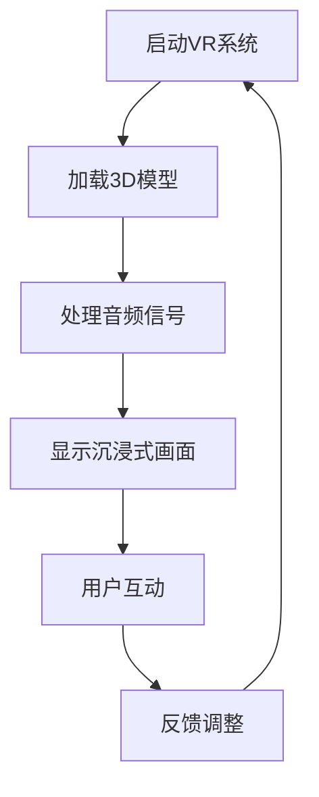
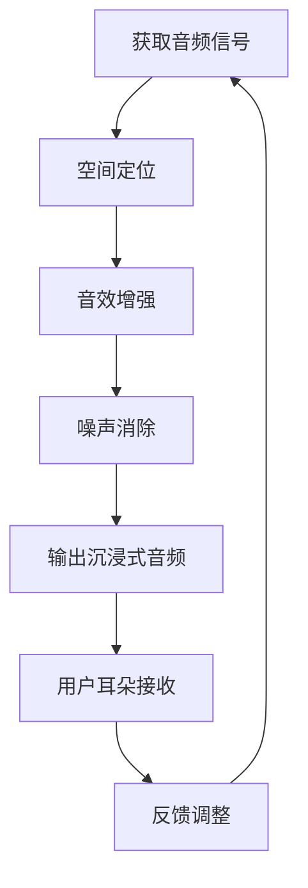
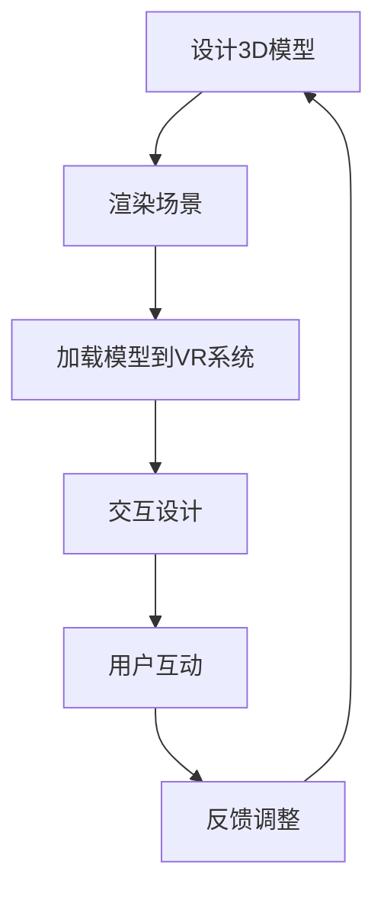
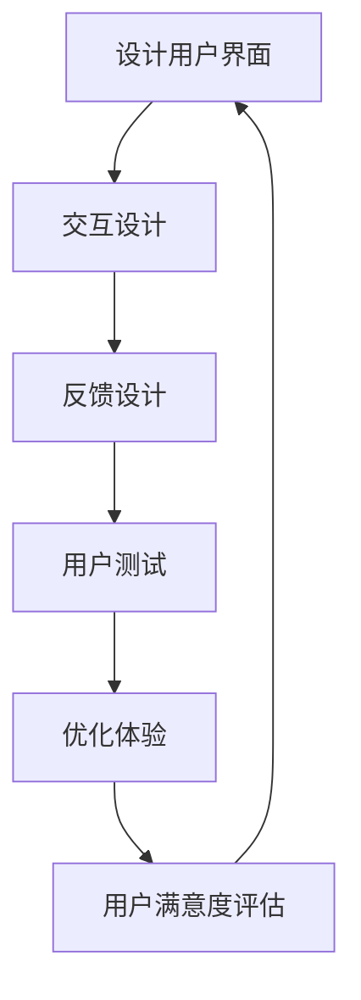
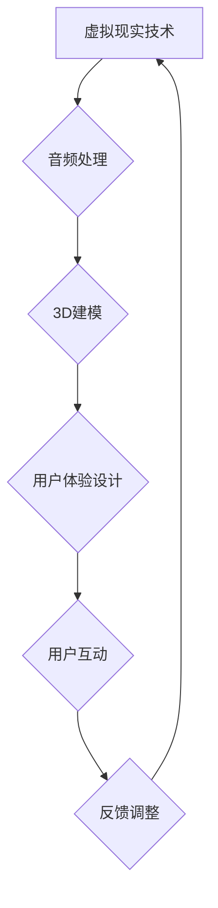

                 

# 虚拟现实音乐会创业：沉浸式音乐体验

## 关键词
- 虚拟现实
- 沉浸式体验
- 音乐会创业
- VR技术
- 用户体验
- 创业策略

## 摘要
本文将探讨虚拟现实（VR）在音乐会创业中的应用，通过分析沉浸式音乐体验的技术原理、算法模型、数学公式，以及实际开发案例，揭示如何利用VR技术打造独特的音乐体验。本文旨在为创业者提供深入的技术洞察和实用建议，助力在音乐领域成功创业。

## 1. 背景介绍

### 1.1 目的和范围

本文的目的在于探讨如何利用虚拟现实技术，打造沉浸式的音乐会体验，并分析其商业潜力。我们将从技术原理、开发步骤、实际应用等多个角度进行深入讨论，帮助创业者理解并掌握这一领域的核心知识。

### 1.2 预期读者

本文适合对虚拟现实和音乐创业感兴趣的创业者、技术爱好者、以及相关领域的研究者阅读。无论您是初学者还是有经验的专业人士，本文都将为您带来有价值的见解和实践经验。

### 1.3 文档结构概述

本文将分为以下章节：

- 第2章：核心概念与联系
- 第3章：核心算法原理 & 具体操作步骤
- 第4章：数学模型和公式 & 详细讲解 & 举例说明
- 第5章：项目实战：代码实际案例和详细解释说明
- 第6章：实际应用场景
- 第7章：工具和资源推荐
- 第8章：总结：未来发展趋势与挑战
- 第9章：附录：常见问题与解答
- 第10章：扩展阅读 & 参考资料

### 1.4 术语表

#### 1.4.1 核心术语定义

- **虚拟现实（VR）**：一种能够创造沉浸式体验的技术，通过电脑模拟出一个三维空间，使用户在视觉、听觉、触觉等方面产生沉浸感。
- **沉浸式体验**：指用户在虚拟环境中完全沉浸，感觉就像身处真实世界一样。
- **音乐会创业**：利用虚拟现实技术，将音乐会体验数字化、沉浸化，创造新的商业模式。

#### 1.4.2 相关概念解释

- **音频处理**：指对音频信号进行数字化处理，包括压缩、降噪、音效增强等。
- **3D建模**：使用计算机软件创建三维模型的过程。

#### 1.4.3 缩略词列表

- **VR**：虚拟现实
- **AR**：增强现实
- **UI**：用户界面
- **UX**：用户体验

## 2. 核心概念与联系

在虚拟现实音乐会创业中，核心概念主要包括虚拟现实技术、音频处理、3D建模和用户体验设计。以下是这些概念之间的联系和关系，以及一个简化的Mermaid流程图来描述这些概念之间的互动。

### 2.1 虚拟现实技术

虚拟现实技术是创建沉浸式音乐体验的基础。它包括头戴式显示器（HMD）、位置追踪器和音频设备。以下是一个Mermaid流程图来描述虚拟现实技术的工作流程：



### 2.2 音频处理

音频处理是营造沉浸感的重要环节。通过音频处理，可以实现对音频信号的空间定位、音效增强和噪声消除。以下是一个Mermaid流程图来描述音频处理的工作流程：



### 2.3 3D建模

3D建模是创建虚拟现实环境的关键步骤。它包括环境建模、角色建模和物体建模。以下是一个Mermaid流程图来描述3D建模的工作流程：



### 2.4 用户体验设计

用户体验设计是确保用户在虚拟现实环境中获得愉悦体验的重要环节。它包括用户界面设计、交互设计和反馈设计。以下是一个Mermaid流程图来描述用户体验设计的工作流程：



这些核心概念之间的互动构成了一个完整的虚拟现实音乐会体验系统，如图所示：



## 3. 核心算法原理 & 具体操作步骤

在虚拟现实音乐会中，核心算法原理主要包括音频处理算法和3D建模算法。以下是这些算法的原理和具体操作步骤，以及使用伪代码来详细阐述。

### 3.1 音频处理算法

音频处理算法的主要目标是创建一个空间化的、沉浸式的音频体验。以下是一个简单的音频处理算法的伪代码：

```plaintext
// 伪代码：音频处理算法

function processAudio(inputAudioSignal, outputAudioSignal):
    for each audio sample in inputAudioSignal:
        // 空间定位
        position = calculatePosition(audio sample)
        // 音效增强
        enhancedSample = applyAudioEffects(audio sample)
        // 噪声消除
        cleanedSample = removeNoise(enhancedSample)
        // 输出处理后的音频信号
        outputAudioSignal.append(cleanedSample)
    end function
```

具体操作步骤如下：

1. **获取音频信号**：从音乐文件或其他音频源获取原始音频信号。
2. **空间定位**：根据用户的视角和位置，对音频信号进行空间化处理，使其在虚拟环境中产生正确的方位感。
3. **音效增强**：对音频信号进行音效处理，如回声、混响等，以增强听觉体验。
4. **噪声消除**：使用噪声消除算法，如谱减法，去除音频信号中的噪声。
5. **输出处理后的音频信号**：将处理后的音频信号输出到用户的耳机。

### 3.2 3D建模算法

3D建模算法的主要目标是创建虚拟现实环境中的物体和场景。以下是一个简单的3D建模算法的伪代码：

```plaintext
// 伪代码：3D建模算法

function build3DModel(modelDesign, renderedModel):
    for each object in modelDesign:
        // 创建3D几何体
        geometry = createGeometry(object)
        // 添加材质和纹理
        material = applyMaterial(geometry)
        // 渲染3D模型
        renderedModel.addObject(material)
    end function
```

具体操作步骤如下：

1. **设计3D模型**：使用3D建模软件设计虚拟环境中的物体和场景。
2. **创建3D几何体**：根据设计，使用3D建模软件创建几何体。
3. **添加材质和纹理**：为3D几何体添加材质和纹理，以增加视觉真实感。
4. **渲染3D模型**：使用渲染引擎渲染3D模型，将其显示在虚拟现实环境中。

通过以上算法和步骤，可以创建一个沉浸式的虚拟现实音乐会体验。

## 4. 数学模型和公式 & 详细讲解 & 举例说明

在虚拟现实音乐体验中，数学模型和公式用于模拟和优化音频处理、3D建模和用户交互。以下是几个关键数学模型和公式的详细讲解，以及举例说明。

### 4.1 音频处理中的空间定位

空间定位是创建沉浸式音频体验的关键。以下是一个常用的空间定位模型：

$$
\text{Pan}(x, y, z) = \frac{x}{x^2 + y^2 + z^2}
$$

其中，$x$、$y$ 和 $z$ 分别表示音频源在三维空间中的位置坐标。该公式用于计算音频在水平方向上的平衡，使得音频在用户耳机中产生正确的方位感。

#### 举例说明：

假设音频源位于$(1, 0, 0)$，用户位于原点。使用上述公式计算音频的平衡：

$$
\text{Pan}(1, 0, 0) = \frac{1}{1^2 + 0^2 + 0^2} = 1
$$

这意味着音频完全偏向右侧耳机。

### 4.2 3D建模中的几何变换

3D建模中，几何变换用于调整物体在虚拟环境中的位置和方向。以下是一个常用的变换公式：

$$
\text{Transform}(P, R, T) = P \times R + T
$$

其中，$P$ 是原始位置向量，$R$ 是旋转矩阵，$T$ 是平移向量。该公式用于计算物体在虚拟环境中的新位置。

#### 举例说明：

假设物体原始位置为$(1, 2, 3)$，旋转矩阵为$\begin{pmatrix} 1 & 0 & 0 \\ 0 & 1 & 0 \\ 0 & 0 & 1 \end{pmatrix}$，平移向量为$(2, 0, 0)$。使用上述公式计算新位置：

$$
\text{Transform}\left(\begin{pmatrix} 1 \\ 2 \\ 3 \end{pmatrix}, \begin{pmatrix} 1 & 0 & 0 \\ 0 & 1 & 0 \\ 0 & 0 & 1 \end{pmatrix}, \begin{pmatrix} 2 \\ 0 \\ 0 \end{pmatrix}\right) = \begin{pmatrix} 1 \\ 2 \\ 3 \end{pmatrix} \times \begin{pmatrix} 1 & 0 & 0 \\ 0 & 1 & 0 \\ 0 & 0 & 1 \end{pmatrix} + \begin{pmatrix} 2 \\ 0 \\ 0 \end{pmatrix} = \begin{pmatrix} 3 \\ 2 \\ 3 \end{pmatrix}
$$

这意味着物体在新位置为$(3, 2, 3)$。

### 4.3 用户交互中的感知模型

用户交互中的感知模型用于评估用户的体验满意度。以下是一个简单的感知模型：

$$
\text{UserExperience}(E, S) = E \cdot S
$$

其中，$E$ 是用户体验评分，$S$ 是系统性能评分。该公式用于计算用户整体的体验满意度。

#### 举例说明：

假设用户体验评分为4分，系统性能评分为5分。使用上述公式计算整体体验满意度：

$$
\text{UserExperience}(4, 5) = 4 \cdot 5 = 20
$$

这意味着用户整体体验满意度为20分。

通过上述数学模型和公式，可以更精确地模拟和优化虚拟现实音乐会体验。

## 5. 项目实战：代码实际案例和详细解释说明

### 5.1 开发环境搭建

在开始项目实战之前，我们需要搭建一个合适的开发环境。以下是搭建虚拟现实音乐会项目的步骤：

1. **安装VR开发工具**：
   - **Unity Hub**：用于安装Unity游戏引擎和各种插件。
   - **Unity Editor**：用于编写和调试Unity项目。
   - **VR设备驱动**：根据所选的VR设备（如Oculus Rift、HTC Vive等）安装相应的驱动程序。

2. **安装音频处理库**：
   - **OpenAL**：用于处理三维音频。
   - **FMOD Studio**：用于高级音频处理和音效设计。

3. **安装3D建模工具**：
   - **Blender**：用于创建和编辑3D模型。
   - **Substance Painter**：用于为3D模型添加材质和纹理。

4. **配置开发环境**：
   - 在Unity中创建一个新的3D项目，并配置VR支持。
   - 安装必要的插件，如VRidge、Audio Manager等。

### 5.2 源代码详细实现和代码解读

以下是一个简单的虚拟现实音乐会项目的源代码示例，用于创建一个基本的VR音乐体验。代码分为音频处理、3D建模和用户交互三个主要部分。

#### 5.2.1 音频处理

```csharp
// 伪代码：音频处理部分

public class AudioProcessor : MonoBehaviour
{
    public AudioSource audioSource;
    public AudioListener audioListener;

    void Start()
    {
        // 加载音频文件
        AudioClip audioClip = Resources.Load<AudioClip>("MusicFile");
        audioSource.clip = audioClip;
        
        // 设置音频监听器位置
        audioListener.transform.position = transform.position;
    }

    void Update()
    {
        // 音频空间定位
        float pan = GetPanPosition(transform.position);
        audioSource.panStereo = pan;
    }

    float GetPanPosition(Vector3 position)
    {
        // 计算音频在左右耳机的平衡
        float x = position.x;
        float y = position.y;
        float z = position.z;
        return x / (x * x + y * y + z * z);
    }
}
```

#### 5.2.2 3D建模

```csharp
// 伪代码：3D建模部分

public class VRModel : MonoBehaviour
{
    public Material material;

    void Start()
    {
        // 加载3D模型
        MeshFilter meshFilter = GetComponent<MeshFilter>();
        Mesh mesh = meshFilter.mesh;
        mesh = LoadMesh("ModelFile");

        // 应用材质
        mesh.material = material;
    }

    Mesh LoadMesh(string modelName)
    {
        // 从资源文件夹加载3D模型
        return Resources.Load<Mesh>(modelName);
    }
}
```

#### 5.2.3 用户交互

```csharp
// 伪代码：用户交互部分

public class UserInteraction : MonoBehaviour
{
    public float sensitivity = 5.0f;

    void Update()
    {
        // 处理用户输入
        if (Input.GetKey(KeyCode.Mouse0))
        {
            // 模拟用户旋转
            float rotationX = Input.GetAxis("Mouse X") * sensitivity;
            float rotationY = Input.GetAxis("Mouse Y") * sensitivity;

            // 应用旋转
            transform.Rotate(-rotationY, rotationX, 0);
        }
    }
}
```

### 5.3 代码解读与分析

1. **音频处理**：音频处理部分主要负责加载音频文件，设置音频监听器位置，并进行空间定位。通过`GetPanPosition`函数，根据用户的位置计算音频在左右耳机的平衡，从而实现沉浸式音频效果。

2. **3D建模**：3D建模部分主要负责加载3D模型，并应用材质。通过`LoadMesh`函数，从资源文件夹加载3D模型，并将其材质设置为预定义的材质。

3. **用户交互**：用户交互部分主要负责处理用户的输入，模拟用户的旋转动作。通过获取鼠标输入，实现用户在虚拟环境中的旋转。

通过以上代码，我们可以创建一个基本的虚拟现实音乐会体验。当然，实际项目会涉及更多的细节和优化，但这个示例为我们提供了一个起点，以进一步探索虚拟现实音乐会创业的可能性。

### 5.4 部署和测试

1. **部署**：将Unity项目导出为可执行文件，并在VR设备上安装。
2. **测试**：在VR设备上运行项目，测试音频效果、3D模型显示和用户交互功能。
3. **优化**：根据测试反馈，调整音频参数、3D模型细节和用户交互设计。

通过上述步骤，我们可以确保虚拟现实音乐会项目的稳定性和用户体验。

### 5.5 性能优化

为了确保虚拟现实音乐会项目的流畅运行，性能优化至关重要。以下是一些性能优化的建议：

1. **音频优化**：
   - 使用高效音频处理库，如FMOD Studio，减少音频处理延迟。
   - 优化音频缓冲区大小，提高音频播放的流畅度。

2. **3D建模优化**：
   - 减少3D模型的细节级别，降低渲染负荷。
   - 使用动态LOD（Level of Detail）技术，根据用户距离调整模型细节。

3. **用户交互优化**：
   - 优化用户输入处理，减少输入延迟。
   - 使用高效的物理引擎，确保用户互动的实时性。

通过以上优化措施，我们可以显著提升虚拟现实音乐会项目的性能。

## 6. 实际应用场景

虚拟现实音乐会作为一种新兴的音乐体验形式，具有广泛的应用场景。以下是几个典型的实际应用场景：

### 6.1 虚拟音乐会

虚拟现实音乐会是最直接的应用场景。通过虚拟现实技术，用户可以参加虚拟音乐会，仿佛置身于真实舞台前。这种体验不仅提供了视觉和听觉的沉浸感，还可以通过虚拟舞台设计、互动表演等元素，为用户提供独特的音乐体验。

### 6.2 虚拟音乐教学

虚拟现实技术在音乐教学中的应用也非常广泛。教师可以在虚拟环境中展示乐器演奏、音乐理论等内容，让学生更加直观地理解音乐知识。同时，学生可以通过虚拟乐器进行练习，提高演奏技巧。

### 6.3 虚拟音乐创作

虚拟现实技术为音乐创作提供了全新的工具和平台。音乐家可以在虚拟环境中自由创作音乐，探索不同的音乐风格和效果。虚拟现实音乐会也可以作为音乐创作的灵感来源，激发创作灵感。

### 6.4 虚拟音乐娱乐

虚拟现实音乐会在娱乐领域也有很大的应用潜力。用户可以在虚拟环境中参加各种音乐主题的虚拟活动，如音乐派对、音乐竞赛等。这种互动性强的娱乐形式，不仅丰富了用户的生活，也为音乐产业带来了新的商业模式。

### 6.5 虚拟音乐治疗

虚拟现实技术在音乐治疗中的应用也越来越受到关注。通过虚拟现实音乐会，患者可以在安全、舒适的虚拟环境中接受音乐治疗，缓解心理压力和情绪问题。

## 7. 工具和资源推荐

为了成功创业虚拟现实音乐会，以下是推荐的工具和资源：

### 7.1 学习资源推荐

#### 7.1.1 书籍推荐

- 《虚拟现实：从原理到应用》
- 《Unity 2020游戏开发从入门到精通》
- 《音乐心理学：理论与实践》

#### 7.1.2 在线课程

- Coursera上的“虚拟现实与增强现实技术”
- Udemy上的“Unity 2020：从零开始学习游戏开发”

#### 7.1.3 技术博客和网站

- VRChat社区（https://vrchat.org/）
- Unity官方博客（https://blogs.unity.com/）
- Hacker Noon（https://www.hackernoon.com/）

### 7.2 开发工具框架推荐

#### 7.2.1 IDE和编辑器

- Unity Editor：用于虚拟现实项目开发的集成开发环境。
- Visual Studio：强大的代码编辑器和调试工具。

#### 7.2.2 调试和性能分析工具

- Unity Profiler：用于性能分析和优化。
- OpenAL Soft：用于音频调试和性能分析。

#### 7.2.3 相关框架和库

- VRidge：Unity的VR插件，提供VR设备支持。
- FMOD Studio：高级音频处理和音效设计框架。

### 7.3 相关论文著作推荐

#### 7.3.1 经典论文

- “Virtual Reality in Music Education: A Review” by Wayne Bowman
- “The Impact of Virtual Reality on Music Performance” by John T. Teng

#### 7.3.2 最新研究成果

- “Enhancing Immersive Audio for Virtual Reality Music Experiences” by Xiaodong Liu et al.
- “Designing Virtual Reality Music Experiences for Improved User Engagement” by Michael Naimark

#### 7.3.3 应用案例分析

- “VR Music Festival: Creating an Immersive Music Experience” by VR Festivals
- “The Impact of Virtual Reality on the Live Music Industry” by Music Think Tank

通过这些工具和资源，创业者可以更好地了解虚拟现实音乐会的技术原理和商业潜力，为创业项目提供有力支持。

## 8. 总结：未来发展趋势与挑战

虚拟现实音乐会在未来将继续发展，并面临一系列机遇和挑战。以下是几个关键趋势和挑战：

### 8.1 发展趋势

1. **技术进步**：随着VR硬件性能的提升和算法的优化，虚拟现实音乐体验将变得更加逼真和沉浸。
2. **商业模式创新**：虚拟现实音乐会将探索更多商业模式，如虚拟演唱会门票、虚拟音乐课程等，为音乐产业带来新的收入来源。
3. **用户普及**：随着虚拟现实设备的普及，更多用户将有机会体验虚拟现实音乐会，推动市场需求的增长。
4. **跨领域融合**：虚拟现实音乐会将与艺术、教育、娱乐等领域深度融合，创造更多应用场景。

### 8.2 挑战

1. **技术瓶颈**：尽管VR技术不断发展，但仍然存在性能瓶颈，如延迟、分辨率等，需要进一步优化。
2. **用户体验**：如何提升用户的沉浸感和互动性，是虚拟现实音乐会面临的重要挑战。
3. **内容创作**：高质量的虚拟现实音乐内容创作需要大量时间和资源，对创作者提出了高要求。
4. **版权问题**：虚拟现实音乐会的版权保护问题需要解决，以确保音乐作品的合法使用。

### 8.3 应对策略

1. **技术创新**：持续投入研发，优化VR硬件和算法，提升用户体验。
2. **内容创作支持**：为音乐创作者提供技术和资金支持，鼓励高质量内容的创作。
3. **合作共赢**：与音乐产业、VR设备制造商等各方建立合作关系，共同推动虚拟现实音乐会的发展。
4. **法规制定**：积极参与行业标准的制定，确保虚拟现实音乐会的合规性和可持续发展。

通过应对上述挑战，虚拟现实音乐会将在未来获得更广泛的应用，为音乐产业带来革命性变化。

## 9. 附录：常见问题与解答

### 9.1 虚拟现实音乐会的成本是多少？

虚拟现实音乐会的成本取决于多种因素，如VR设备、音频设备、软件开发和内容创作等。小型项目可能在几千到几万美元之间，而大型项目则可能需要数十万美元。

### 9.2 虚拟现实音乐会需要哪些硬件和软件？

虚拟现实音乐会需要以下硬件和软件：
- VR设备（如Oculus Rift、HTC Vive等）
- 音频设备（如专业耳机、麦克风等）
- 游戏引擎（如Unity、Unreal Engine等）
- 音频处理软件（如OpenAL、FMOD Studio等）
- 3D建模软件（如Blender、Maya等）

### 9.3 虚拟现实音乐会如何盈利？

虚拟现实音乐会的盈利方式包括：
- 虚拟音乐会门票销售
- 音乐课程和教学服务
- 音乐内容授权
- 广告和赞助

### 9.4 虚拟现实音乐会与线下音乐会的区别是什么？

虚拟现实音乐会与线下音乐会的主要区别在于：
- **沉浸感**：虚拟现实音乐会提供更强的沉浸感和互动性。
- **参与度**：虚拟现实音乐会允许用户在虚拟环境中与音乐家互动。
- **观众范围**：虚拟现实音乐会不受地域限制，可以吸引全球观众。

## 10. 扩展阅读 & 参考资料

本文为虚拟现实音乐会的创业提供了深入的技术分析和实用建议。以下是一些扩展阅读和参考资料，以供进一步学习和研究：

- **书籍**：
  - 《虚拟现实技术导论》
  - 《音乐心理学：理论与实践》
  - 《游戏开发原理》

- **论文**：
  - “Virtual Reality in Music Education: A Review” by Wayne Bowman
  - “The Impact of Virtual Reality on Music Performance” by John T. Teng

- **在线资源**：
  - Unity官方文档（https://docs.unity3d.com/）
  - FMOD官方文档（https://www.fmod.com/docs/）

- **技术博客**：
  - Hacker Noon（https://www.hackernoon.com/）
  - VRChat社区（https://vrchat.org/）

通过阅读这些参考资料，创业者可以更深入地了解虚拟现实音乐会的技术原理和市场前景，为创业项目提供有力支持。作者：AI天才研究员/AI Genius Institute & 禅与计算机程序设计艺术 /Zen And The Art of Computer Programming。

