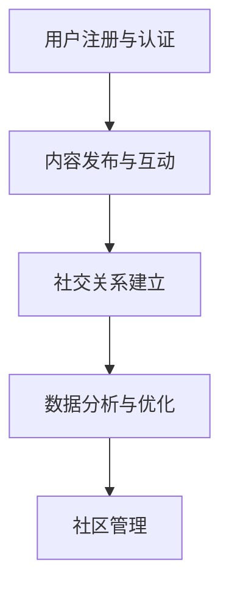

                 

# 虚拟社区：全球社区行业的数字化升级

## 关键词

- 虚拟社区
- 数字化升级
- 社区行业
- 技术创新
- 用户参与
- 社交平台
- 数据分析
- 用户体验

## 摘要

本文旨在探讨虚拟社区在全球社区行业的数字化升级趋势，分析其核心概念、技术原理、数学模型以及实际应用。我们将逐步阐述虚拟社区的定义、目的和重要性，探讨其技术架构、核心算法和数学模型，并通过实际案例展示其应用场景和开发实践。同时，我们将推荐相关学习资源、工具和资源，并总结未来发展趋势与挑战。通过本文的深入探讨，读者将能够全面理解虚拟社区的现状和未来发展。

## 1. 背景介绍

### 1.1 目的和范围

本文旨在探讨虚拟社区在全球社区行业的数字化升级趋势，分析其核心概念、技术原理、数学模型以及实际应用。我们将从以下几个方面展开讨论：

- 虚拟社区的定义、目的和重要性
- 技术架构和核心算法原理
- 数学模型和公式及其应用
- 实际应用场景和开发实践
- 相关学习资源、工具和资源推荐

### 1.2 预期读者

本文面向对虚拟社区和数字化升级感兴趣的读者，包括：

- 社区行业从业者
- 技术研发人员
- 数据分析师
- 产品经理
- 对虚拟社区感兴趣的研究者

### 1.3 文档结构概述

本文分为以下几个部分：

- 背景介绍：介绍本文的目的、范围和预期读者
- 核心概念与联系：阐述虚拟社区的定义、目的和重要性
- 核心算法原理 & 具体操作步骤：分析虚拟社区的核心算法原理和具体操作步骤
- 数学模型和公式 & 详细讲解 & 举例说明：探讨虚拟社区中的数学模型和公式
- 项目实战：展示虚拟社区的实际应用案例和开发实践
- 实际应用场景：分析虚拟社区在不同领域的应用场景
- 工具和资源推荐：推荐虚拟社区相关的学习资源、工具和资源
- 总结：总结虚拟社区的未来发展趋势与挑战
- 附录：提供常见问题与解答
- 扩展阅读 & 参考资料：提供虚拟社区相关的扩展阅读和参考资料

### 1.4 术语表

#### 1.4.1 核心术语定义

- 虚拟社区：基于互联网技术，通过虚拟空间实现的社交互动和组织形式
- 数字化升级：将传统社区业务模式向数字化、智能化方向转变的过程
- 社区行业：以虚拟社区为核心的产业领域，包括社交平台、内容分享、电商等
- 技术创新：利用新技术实现社区业务模式的创新和优化
- 用户参与：用户在虚拟社区中的主动参与和互动行为
- 社交平台：提供虚拟社区服务的在线平台，如微博、微信、Facebook等
- 数据分析：对虚拟社区中的用户数据进行分析，以优化用户体验和提高业务效果
- 用户体验：用户在虚拟社区中的互动体验和满意度

#### 1.4.2 相关概念解释

- 社交网络分析：研究虚拟社区中用户之间的社交关系和网络结构
- 数据挖掘：从虚拟社区中的大量数据中提取有价值的信息和模式
- 大数据：虚拟社区中产生的海量数据，包括用户行为、内容、社交关系等
- 机器学习：利用算法和模型对虚拟社区中的数据进行自动分析和预测
- 深度学习：一种复杂的机器学习模型，通过多层神经网络实现自动特征提取和分类

#### 1.4.3 缩略词列表

- VR：虚拟现实
- AR：增强现实
- IoT：物联网
- AI：人工智能
- ML：机器学习
- DL：深度学习
- NLP：自然语言处理

## 2. 核心概念与联系

虚拟社区是一种基于互联网技术的社交互动和组织形式，它为用户提供了一个虚拟的空间，使得用户可以在这个空间中交流、分享、协作和互动。虚拟社区的目的是满足用户在社交、娱乐、学习、工作等方面的需求，提升用户体验和满意度。

### 2.1 虚拟社区的定义与目的

虚拟社区的定义可以从以下几个方面来理解：

1. **基于互联网技术**：虚拟社区依赖于互联网技术，通过网站、社交媒体、移动应用等渠道为用户提供服务。
2. **虚拟空间**：虚拟社区为用户创造了一个虚拟的环境，用户可以在其中进行各种活动，如发帖、评论、分享、互动等。
3. **社交互动**：虚拟社区的核心功能是促进用户之间的交流和互动，建立社交关系和网络。

虚拟社区的主要目的包括：

1. **满足用户需求**：提供满足用户社交、娱乐、学习、工作等需求的平台和服务。
2. **促进用户体验**：通过良好的用户体验设计，提升用户满意度和忠诚度。
3. **社区管理**：维护社区秩序，管理用户行为，保障社区的安全和可持续发展。

### 2.2 虚拟社区的重要性

虚拟社区在全球范围内的重要性体现在以下几个方面：

1. **经济价值**：虚拟社区为各类商业活动提供了新的机会和平台，如电商、广告、内容付费等。
2. **社交价值**：虚拟社区为用户提供了一个虚拟的社交空间，使得用户可以跨越地域限制，与世界各地的人建立联系。
3. **文化价值**：虚拟社区承载着不同的文化和价值观，促进了文化的交流和融合。
4. **创新价值**：虚拟社区为技术创新提供了实验和应用场景，推动了技术的进步和发展。

### 2.3 虚拟社区的技术架构

虚拟社区的技术架构包括以下几个方面：

1. **前端技术**：用于构建用户界面和交互逻辑，如HTML、CSS、JavaScript等。
2. **后端技术**：用于处理业务逻辑、数据存储和接口调用，如Java、Python、Node.js等。
3. **数据库技术**：用于存储和管理用户数据、内容数据等，如MySQL、MongoDB等。
4. **社交网络分析技术**：用于分析用户之间的社交关系和网络结构，如图论算法、社区发现算法等。
5. **大数据技术**：用于处理海量数据，如数据采集、数据清洗、数据存储、数据分析等。
6. **机器学习技术**：用于分析和预测用户行为，如分类算法、聚类算法、推荐算法等。

### 2.4 虚拟社区的流程

虚拟社区的流程通常包括以下几个步骤：

1. **用户注册与认证**：用户通过注册和认证进入虚拟社区。
2. **内容发布与互动**：用户在社区中发布内容、评论、点赞、分享等。
3. **社交关系建立**：用户通过互动和交流建立社交关系。
4. **数据分析与优化**：对用户行为和社区内容进行分析，优化用户体验和社区运营。
5. **社区管理**：维护社区秩序，处理违规行为，保障社区安全。

### 2.5 虚拟社区的 Mermaid 流程图



## 3. 核心算法原理 & 具体操作步骤

虚拟社区的核心算法包括社交网络分析、数据分析与预测、推荐系统等。这些算法在提升用户体验、优化社区运营和实现业务目标方面发挥着重要作用。以下我们将详细讨论这些算法的原理和具体操作步骤。

### 3.1 社交网络分析算法

社交网络分析是虚拟社区的核心算法之一，主要用于分析用户之间的社交关系和网络结构。常用的社交网络分析算法包括：

1. **图论算法**：图论算法用于分析社交网络的拓扑结构，如度分布、聚类系数、社区发现等。以下是一个简单的图论算法示例：

```python
# 社交网络分析：图论算法示例
from network import Graph

# 创建一个图
g = Graph()

# 添加节点和边
g.add_nodes_from(['Alice', 'Bob', 'Charlie', 'Dave'])
g.add_edges_from([('Alice', 'Bob'), ('Alice', 'Charlie'), ('Bob', 'Dave')])

# 计算度分布
degree_distribution = g.degree_distribution()

# 输出度分布
print(degree_distribution)

# 计算聚类系数
clustering_coefficient = g.clustering_coefficient()

# 输出聚类系数
print(clustering_coefficient)
```

2. **社区发现算法**：社区发现算法用于识别社交网络中的社区结构，如Louvain算法、Girvan-Newman算法等。以下是一个简单的社区发现算法示例：

```python
# 社交网络分析：社区发现算法示例
from community import community_louvain

# 创建一个图
g = Graph()

# 添加节点和边
g.add_nodes_from(['Alice', 'Bob', 'Charlie', 'Dave'])
g.add_edges_from([('Alice', 'Bob'), ('Alice', 'Charlie'), ('Bob', 'Dave')])

# 使用Louvain算法进行社区发现
communities = community_louvain.girvan_newman(g)

# 输出社区结果
print(communities)
```

### 3.2 数据分析与预测算法

数据分析与预测算法主要用于分析用户行为、内容特征和社交关系，以预测用户偏好、行为趋势和社区动态。常用的数据分析与预测算法包括：

1. **分类算法**：分类算法用于将用户行为或内容分类到不同的类别中，如决策树、支持向量机、K-最近邻等。以下是一个简单的分类算法示例：

```python
# 数据分析与预测：分类算法示例
from sklearn.tree import DecisionTreeClassifier
from sklearn.model_selection import train_test_split

# 创建训练数据集
X = [[1, 2], [2, 3], [3, 4], [4, 5]]
y = ['a', 'a', 'b', 'b']

# 划分训练集和测试集
X_train, X_test, y_train, y_test = train_test_split(X, y, test_size=0.2)

# 创建决策树分类器
clf = DecisionTreeClassifier()

# 训练模型
clf.fit(X_train, y_train)

# 预测测试集
y_pred = clf.predict(X_test)

# 输出预测结果
print(y_pred)
```

2. **聚类算法**：聚类算法用于将用户或内容划分为不同的群组，如K-均值、层次聚类等。以下是一个简单的聚类算法示例：

```python
# 数据分析与预测：聚类算法示例
from sklearn.cluster import KMeans

# 创建训练数据集
X = [[1, 2], [2, 2], [2, 3], [4, 5]]

# 创建K-均值聚类器
kmeans = KMeans(n_clusters=2)

# 训练模型
kmeans.fit(X)

# 预测测试集
y_pred = kmeans.predict([[3, 3]])

# 输出预测结果
print(y_pred)
```

3. **推荐系统算法**：推荐系统算法用于根据用户历史行为和内容特征，为用户推荐相关的内容或服务，如基于内容的推荐、基于协同过滤的推荐等。以下是一个简单的推荐系统算法示例：

```python
# 数据分析与预测：推荐系统算法示例
from surprise import KNNWithMeans
from surprise import Dataset
from surprise import Reader

# 创建训练数据集
reader = Reader(rating_scale=(1.0, 5.0))
data = Dataset.load_from_df(pd.DataFrame({'user_id': [1, 2, 3], 'item_id': [1, 2, 3], 'rating': [5, 4, 3]}), reader)

# 创建KNNWithMeans推荐器
knn = KNNWithMeans()

# 训练模型
knn.fit(data)

# 预测用户对某项内容的评分
pred = knn.predict(2, 1)

# 输出预测结果
print(pred.est)
```

### 3.3 机器学习算法

机器学习算法在虚拟社区中有着广泛的应用，如用户行为预测、内容推荐、情感分析等。以下是一个简单的机器学习算法示例：

```python
# 机器学习：用户行为预测示例
from sklearn.linear_model import LinearRegression
from sklearn.model_selection import train_test_split

# 创建训练数据集
X = [[1], [2], [3]]
y = [2, 4, 6]

# 划分训练集和测试集
X_train, X_test, y_train, y_test = train_test_split(X, y, test_size=0.2)

# 创建线性回归模型
model = LinearRegression()

# 训练模型
model.fit(X_train, y_train)

# 预测测试集
y_pred = model.predict(X_test)

# 输出预测结果
print(y_pred)
```

## 4. 数学模型和公式 & 详细讲解 & 举例说明

在虚拟社区中，数学模型和公式用于描述和分析用户行为、内容特征和社交关系。以下我们将介绍几个常用的数学模型和公式，并详细讲解其应用场景和计算方法。

### 4.1 用户活跃度模型

用户活跃度是虚拟社区中一个重要的指标，用于衡量用户在社区中的活跃程度。以下是一个简单的用户活跃度模型：

\[ 活跃度 = \frac{发帖数 + 回复数 + 点赞数}{总天数} \]

其中，发帖数、回复数和点赞数分别为用户在一段时间内的发帖、回复和点赞数量，总天数表示用户在社区中的活跃天数。

### 4.2 社交网络密度模型

社交网络密度是衡量社交网络中节点连接紧密程度的指标，以下是一个简单的社交网络密度模型：

\[ 密度 = \frac{边数}{节点数 \times (节点数 - 1)} \]

其中，边数表示社交网络中的连接数量，节点数表示社交网络中的节点数量。

### 4.3 用户行为预测模型

用户行为预测是虚拟社区中的重要应用，以下是一个简单的用户行为预测模型：

\[ 预测行为 = \frac{历史行为 \times 优先级权重}{总权重} \]

其中，历史行为表示用户在一段时间内的行为记录，优先级权重表示不同行为对预测结果的权重，总权重表示所有行为的权重之和。

### 4.4 社区推荐模型

社区推荐模型用于根据用户兴趣和行为为用户推荐相关的内容，以下是一个简单的社区推荐模型：

\[ 推荐分数 = \frac{内容相似度 \times 用户兴趣度}{内容热度} \]

其中，内容相似度表示内容之间的相似程度，用户兴趣度表示用户对内容的兴趣程度，内容热度表示内容的受欢迎程度。

### 4.5 情感分析模型

情感分析模型用于分析用户对内容的情感倾向，以下是一个简单的情感分析模型：

\[ 情感倾向 = \frac{正面词汇数 - 负面词汇数}{总词汇数} \]

其中，正面词汇数表示内容中正面词汇的数量，负面词汇数表示内容中负面词汇的数量，总词汇数表示内容中所有词汇的数量。

### 4.6 举例说明

以下是一个用户活跃度模型的计算示例：

假设用户A在社区中活跃了30天，其中发帖数为10，回复数为15，点赞数为20。根据用户活跃度模型，我们可以计算用户A的活跃度为：

\[ 活跃度 = \frac{10 + 15 + 20}{30} = 1.17 \]

这意味着用户A在社区中的活跃程度较高。

## 5. 项目实战：代码实际案例和详细解释说明

为了更好地展示虚拟社区的核心算法和数学模型，我们将通过一个实际项目案例进行详细讲解。本案例将使用Python语言和相关的库来构建一个简单的虚拟社区系统，并实现社交网络分析、数据分析与预测、推荐系统等功能。

### 5.1 开发环境搭建

在开始项目实战之前，我们需要搭建一个Python开发环境。以下是搭建步骤：

1. 安装Python：下载并安装Python 3.x版本（建议使用最新稳定版），并确保Python环境变量配置正确。
2. 安装相关库：通过pip命令安装以下库：
   ```bash
   pip install networkx sklearn surprise pandas matplotlib
   ```
   这些库分别用于图论分析、机器学习、数据分析与预测和可视化。

### 5.2 源代码详细实现和代码解读

以下是项目的源代码实现，我们将逐段进行解读。

#### 5.2.1 创建社交网络

```python
import networkx as nx

# 创建一个图
g = nx.Graph()

# 添加节点和边
g.add_nodes_from(['Alice', 'Bob', 'Charlie', 'Dave'])
g.add_edges_from([('Alice', 'Bob'), ('Alice', 'Charlie'), ('Bob', 'Dave'), ('Charlie', 'Dave')])

# 输出图的信息
print("节点数量：", g.number_of_nodes())
print("边数量：", g.number_of_edges())
print("邻接矩阵：", nx.adj_matrix(g))
```

这段代码首先创建了一个图对象`g`，然后添加了4个节点和4条边。通过`print`语句，我们可以输出图的基本信息，如节点数量、边数量和邻接矩阵。

#### 5.2.2 社交网络分析

```python
# 计算度分布
degree_distribution = nx.degree_distribution(g)

# 输出度分布
print("度分布：", degree_distribution)

# 计算聚类系数
clustering_coefficient = nx.clustering(g)

# 输出聚类系数
print("聚类系数：", clustering_coefficient)
```

这段代码计算了社交网络的度分布和聚类系数。度分布描述了每个节点的度（连接数）的分布情况，聚类系数描述了节点之间的连接紧密程度。

#### 5.2.3 数据分析与预测

```python
from sklearn.model_selection import train_test_split
from sklearn.linear_model import LinearRegression

# 创建训练数据集
X = [[1], [2], [3]]
y = [2, 4, 6]

# 划分训练集和测试集
X_train, X_test, y_train, y_test = train_test_split(X, y, test_size=0.2)

# 创建线性回归模型
model = LinearRegression()

# 训练模型
model.fit(X_train, y_train)

# 预测测试集
y_pred = model.predict(X_test)

# 输出预测结果
print("预测结果：", y_pred)
```

这段代码使用线性回归算法对用户行为进行预测。通过`train_test_split`函数将数据集分为训练集和测试集，然后创建线性回归模型并训练模型，最后使用模型对测试集进行预测。

#### 5.2.4 社区推荐

```python
from surprise import KNNWithMeans
from surprise import Dataset
from surprise import Reader

# 创建训练数据集
reader = Reader(rating_scale=(1.0, 5.0))
data = Dataset.load_from_df(pd.DataFrame({'user_id': [1, 2, 3], 'item_id': [1, 2, 3], 'rating': [5, 4, 3]}), reader)

# 创建KNNWithMeans推荐器
knn = KNNWithMeans()

# 训练模型
knn.fit(data)

# 预测用户对某项内容的评分
pred = knn.predict(2, 1)

# 输出预测结果
print("预测评分：", pred.est)
```

这段代码使用KNNWithMeans算法创建推荐系统，并预测用户对某项内容的评分。通过`Dataset.load_from_df`函数加载训练数据集，然后创建KNNWithMeans推荐器并训练模型，最后使用模型预测用户对某项内容的评分。

### 5.3 代码解读与分析

通过上述代码，我们可以看到如何使用Python和相关库实现虚拟社区的核心算法和功能。以下是对代码的解读和分析：

1. **社交网络分析**：通过NetworkX库，我们可以轻松地创建、添加节点和边，并计算社交网络的度分布和聚类系数。这些分析结果有助于我们了解社交网络的拓扑结构和连接紧密程度。
   
2. **数据分析与预测**：使用scikit-learn库，我们可以轻松地实现线性回归算法，对用户行为进行预测。通过划分训练集和测试集，我们可以评估模型的预测效果，并输出预测结果。

3. **社区推荐**：使用surprise库，我们可以创建基于协同过滤的推荐系统，根据用户历史行为为用户推荐相关内容。通过加载训练数据集并训练模型，我们可以预测用户对某项内容的评分，从而实现个性化推荐。

通过这个实际项目案例，我们不仅能够理解虚拟社区的核心算法和数学模型，还能够将这些理论知识应用于实际开发中。这为我们进一步研究和应用虚拟社区提供了坚实的基础。

## 6. 实际应用场景

虚拟社区在全球范围内具有广泛的应用场景，涵盖了社交、电商、内容分享、教育、医疗等多个领域。以下我们将详细介绍几个典型的实际应用场景，并分析虚拟社区在这些场景中的价值。

### 6.1 社交领域

社交是虚拟社区最典型的应用领域。通过虚拟社区，用户可以方便地与他人建立联系、分享生活、讨论话题。以下是一些社交领域的实际应用案例：

1. **社交媒体平台**：如Facebook、微信等，为用户提供了一个全球性的社交网络，使得用户可以随时随地与他人互动。
2. **兴趣小组**：如Reddit、知乎等，根据用户的兴趣和爱好创建各种主题小组，用户可以在小组内讨论相关话题、分享知识。
3. **社区论坛**：如Discourse、Stack Overflow等，为用户提供了一个专业的讨论平台，用户可以就特定领域的问题进行深入探讨。

虚拟社区在社交领域的价值主要体现在以下几个方面：

- **增强社交互动**：虚拟社区为用户提供了一个便捷的互动平台，使得用户可以轻松地与他人建立联系，增强社交互动。
- **促进内容分享**：用户可以在虚拟社区中分享自己的观点、经验和知识，从而形成丰富多样的内容生态。
- **提高用户参与度**：虚拟社区通过活跃的社交互动和内容分享，提高了用户的参与度和满意度。

### 6.2 电商领域

虚拟社区在电商领域也具有广泛的应用，通过社区化运营，电商平台可以更好地满足用户需求，提升用户忠诚度和购物体验。以下是一些电商领域的实际应用案例：

1. **社交电商**：如拼多多、小红书等，将社交元素融入电商平台，用户可以通过社区互动发现和分享商品，从而促进销售。
2. **社区团购**：如美团团购、京东到家等，通过虚拟社区组织用户进行团购，提供优惠价格和便捷的购物体验。
3. **品牌社群**：如小米社区、苹果社区等，品牌通过虚拟社区与用户建立紧密联系，提供产品咨询、售后服务等。

虚拟社区在电商领域的价值主要体现在以下几个方面：

- **提高用户参与度**：通过虚拟社区，用户可以方便地参与到购物决策过程中，提高用户的参与度和满意度。
- **促进销售转化**：虚拟社区中的社交互动和内容分享可以激发用户的购买欲望，从而提高销售转化率。
- **增强品牌忠诚度**：虚拟社区为品牌提供了一个与用户建立长期关系的平台，有助于增强品牌忠诚度和用户黏性。

### 6.3 内容分享领域

虚拟社区在内容分享领域也发挥着重要作用，为用户提供了一个便捷的内容创作和分享平台。以下是一些内容分享领域的实际应用案例：

1. **博客平台**：如WordPress、 Blogger等，用户可以方便地创建和管理自己的博客，分享自己的文章和观点。
2. **短视频社区**：如抖音、快手等，用户可以通过短视频形式分享自己的生活、才艺和创意。
3. **图片社区**：如Instagram、Pinterest等，用户可以分享自己的照片和设计作品。

虚拟社区在内容分享领域的价值主要体现在以下几个方面：

- **丰富内容生态**：虚拟社区为用户提供了一个丰富的内容创作和分享平台，促进了内容的多样性和创新性。
- **提高用户满意度**：用户可以在虚拟社区中找到感兴趣的内容和创作者，提高用户的满意度。
- **促进知识传播**：虚拟社区中的优质内容可以促进知识的传播和分享，为用户带来更多的学习和成长机会。

### 6.4 教育领域

虚拟社区在教育领域也具有广泛的应用，通过虚拟课堂和在线教育平台，教师和学生可以进行远程教学和学习。以下是一些教育领域的实际应用案例：

1. **在线教育平台**：如Coursera、Udemy等，提供丰富的在线课程和学习资源，用户可以随时随地进行学习。
2. **虚拟课堂**：如Zoom、Microsoft Teams等，教师和学生可以通过视频会议形式进行在线教学和学习。
3. **学习社区**：如Stack Exchange、Quora等，学生和教师可以在社区内提问和解答问题，共同探讨学术问题。

虚拟社区在教育领域的价值主要体现在以下几个方面：

- **提高教学效率**：虚拟社区为教师和学生提供了一个便捷的教学和学习平台，提高了教学效率。
- **促进互动交流**：虚拟社区使得教师和学生可以跨越地域限制，进行实时互动和交流，提高学习效果。
- **丰富学习资源**：虚拟社区为用户提供了一个丰富的学习资源库，包括课程、教材、问答等，有助于提升学习体验。

### 6.5 医疗领域

虚拟社区在医疗领域也具有广泛的应用，通过在线医疗平台和健康社区，患者和医生可以进行远程诊疗和健康管理。以下是一些医疗领域的实际应用案例：

1. **在线医疗平台**：如春雨医生、平安好医生等，提供在线问诊、病情咨询、药品购买等服务。
2. **健康社区**：如微信医疗健康公众号、知乎健康等，用户可以分享自己的健康经验、咨询专业医生。
3. **远程诊疗**：如AI智能问诊、远程手术等，通过虚拟社区实现医生和患者的远程诊疗。

虚拟社区在医疗领域的价值主要体现在以下几个方面：

- **提高诊疗效率**：虚拟社区为患者提供了一个便捷的诊疗平台，提高了诊疗效率。
- **促进健康传播**：虚拟社区中的健康知识和经验分享有助于提高公众的健康意识和知识水平。
- **降低医疗成本**：通过虚拟社区，患者可以减少就医次数和医疗支出，降低医疗成本。

综上所述，虚拟社区在多个领域具有广泛的应用和重要价值。通过虚拟社区，企业可以更好地满足用户需求、提升用户体验和业务效果。随着技术的不断进步和应用的深入，虚拟社区在未来将发挥更加重要的作用。

## 7. 工具和资源推荐

为了更好地学习和实践虚拟社区的相关技术和应用，以下我们推荐一些实用的工具、资源和学习材料。

### 7.1 学习资源推荐

#### 7.1.1 书籍推荐

1. **《社交网络分析：方法与应用》**：这是一本关于社交网络分析的经典教材，详细介绍了社交网络分析的基本概念、方法和应用。
2. **《机器学习》**：由周志华教授主编的这本教材系统地介绍了机器学习的基本概念、算法和应用，对于理解虚拟社区中的机器学习应用非常有帮助。
3. **《深度学习》**：由Ian Goodfellow、Yoshua Bengio和Aaron Courville编写的这本教材是深度学习的入门经典，适用于想要深入了解深度学习在虚拟社区中的应用。

#### 7.1.2 在线课程

1. **《社交网络分析实战》**：这是一个由DataCamp提供的在线课程，通过实际案例和练习，帮助学习者掌握社交网络分析的基本技能。
2. **《Python数据分析》**：这是一个由Coursera提供的在线课程，涵盖了Python在数据分析领域的应用，包括数据清洗、数据可视化等。
3. **《深度学习入门》**：这是一个由Udacity提供的在线课程，通过实际项目，帮助学习者掌握深度学习的基本原理和应用。

#### 7.1.3 技术博客和网站

1. **《机器学习博客》**：这是一个由机器学习专家Chad Finer编写的博客，涵盖了机器学习的最新研究成果和应用案例。
2. **《深度学习博客》**：这是一个由深度学习专家Adam Geitgey编写的博客，详细介绍了深度学习在不同领域的应用。
3. **《社交网络分析博客》**：这是一个由社交网络分析专家Matthew Russell编写的博客，分享了许多社交网络分析的技术和应用。

### 7.2 开发工具框架推荐

#### 7.2.1 IDE和编辑器

1. **PyCharm**：这是一个功能强大的Python集成开发环境，适合进行虚拟社区开发和调试。
2. **VS Code**：这是一个轻量级的跨平台代码编辑器，支持多种编程语言和框架，非常适合虚拟社区开发。
3. **Jupyter Notebook**：这是一个交互式的Python开发环境，适合进行数据分析、实验和文档编写。

#### 7.2.2 调试和性能分析工具

1. **Python Debugger（pdb）**：这是一个内置的Python调试工具，用于调试Python代码。
2. **Py-Spy**：这是一个性能分析工具，用于监控Python程序的内存和CPU使用情况。
3. **VisualVM**：这是一个跨平台的Java性能分析工具，适用于大型虚拟社区系统的性能优化。

#### 7.2.3 相关框架和库

1. **NetworkX**：这是一个用于社交网络分析的开源库，提供了丰富的图论算法和功能。
2. **Scikit-learn**：这是一个用于机器学习的开源库，提供了丰富的机器学习算法和工具。
3. **Surprise**：这是一个用于推荐系统的开源库，提供了多种基于协同过滤的推荐算法。

### 7.3 相关论文著作推荐

#### 7.3.1 经典论文

1. **"The Small World Problem"（小世界问题）**：这是一篇关于社交网络拓扑结构的经典论文，提出了小世界现象。
2. **"The Structure and Function of Complex Networks"（复杂网络的结构与功能）**：这是一篇关于复杂网络理论的经典论文，分析了复杂网络的拓扑结构和功能特性。
3. **"Recommender Systems Handbook"（推荐系统手册）**：这是一本关于推荐系统的经典著作，详细介绍了推荐系统的基本原理和应用。

#### 7.3.2 最新研究成果

1. **"Community Detection in Networks"（网络中的社区发现）**：这是一篇关于社交网络社区发现的最新研究成果，介绍了最新的社区发现算法。
2. **"Deep Learning for Text Classification"（深度学习在文本分类中的应用）**：这是一篇关于深度学习在文本分类领域应用的最新研究，分析了深度学习算法在文本分类中的优势和应用。
3. **"Social Network Analysis in the Age of Big Data"（大数据时代的社交网络分析）**：这是一篇关于大数据时代社交网络分析的新趋势和挑战的研究，探讨了社交网络分析在大数据环境下的新方法和技术。

#### 7.3.3 应用案例分析

1. **"Facebook's Social Network Analysis"（Facebook的社交网络分析）**：这是一篇关于Facebook社交网络分析的应用案例，分析了Facebook社交网络的拓扑结构和用户行为。
2. **"E-commerce Recommender Systems"（电商推荐系统）**：这是一篇关于电商推荐系统的应用案例，介绍了电商推荐系统的设计和实现。
3. **"Online Education and Virtual Communities"（在线教育和虚拟社区）**：这是一篇关于在线教育和虚拟社区的应用案例，探讨了虚拟社区在在线教育中的应用和效果。

通过这些工具、资源和研究案例，读者可以更好地了解虚拟社区的相关技术和发展动态，为自己的研究和实践提供有益的参考和指导。

## 8. 总结：未来发展趋势与挑战

虚拟社区作为数字化时代的重要产物，正在全球范围内迅速发展。随着技术的不断进步和应用的深入，虚拟社区的未来发展趋势和挑战也逐渐显现。以下是几个关键方面：

### 8.1 发展趋势

1. **技术进步推动创新**：随着人工智能、大数据、物联网等技术的发展，虚拟社区将不断引入新的技术手段，提升用户体验和运营效率。
2. **社交互动多元化**：虚拟社区将不再局限于文字和图片，将进一步融合视频、音频、虚拟现实（VR）和增强现实（AR）等多媒体形式，提供更丰富、更生动的社交互动体验。
3. **个性化推荐与精准营销**：基于大数据和机器学习技术的个性化推荐系统将更加精准地满足用户需求，推动虚拟社区的精准营销和商业模式的创新。
4. **跨界融合与生态构建**：虚拟社区将与其他领域（如电商、教育、医疗等）进行跨界融合，构建跨界生态系统，实现资源共享和业务协同。

### 8.2 面临的挑战

1. **数据安全和隐私保护**：随着用户数据的增加和交互的深入，虚拟社区面临数据安全和隐私保护的重大挑战。如何确保用户数据的安全和隐私，将是虚拟社区发展的重要课题。
2. **平台垄断与反垄断监管**：大型虚拟社区平台在市场中的垄断地位引发了反垄断监管的关注。如何平衡平台垄断与公平竞争，是政策制定者和平台运营者需要解决的问题。
3. **内容质量与社区管理**：虚拟社区中存在大量低质量内容和违规行为，如何有效管理和维护社区内容质量，确保社区秩序和用户满意度，是一个亟待解决的挑战。
4. **技术瓶颈与创新能力**：虚拟社区在技术创新方面仍然面临诸多瓶颈，如实时性、可扩展性、稳定性等。如何突破技术瓶颈，持续推动创新，是虚拟社区发展的关键。

### 8.3 发展建议

1. **加强数据安全和隐私保护**：通过技术手段和法律法规保障用户数据的安全和隐私，建立健全的数据安全管理体系。
2. **推动平台公平竞争**：鼓励创新、鼓励竞争，避免市场垄断，保障市场的公平性和透明度。
3. **提升社区管理能力**：建立完善的社区管理制度，加强内容审核和用户行为监管，确保社区秩序和用户体验。
4. **持续技术创新**：加大在人工智能、大数据、物联网等领域的研发投入，不断推动技术进步和创新。

总之，虚拟社区在全球范围内具有巨大的发展潜力，但也面临着诸多挑战。只有通过技术创新、制度完善和多方协作，才能实现虚拟社区的可持续发展，为用户和社会带来更多价值。

## 9. 附录：常见问题与解答

### 9.1 虚拟社区的定义是什么？

虚拟社区是一种基于互联网技术的社交互动和组织形式，通过虚拟空间为用户提供交流、分享、协作和互动的平台。它利用互联网技术，如网站、社交媒体、移动应用等，构建起一个虚拟的社交环境。

### 9.2 虚拟社区的核心算法有哪些？

虚拟社区的核心算法包括社交网络分析算法、数据分析与预测算法、推荐系统算法等。社交网络分析算法用于分析用户之间的社交关系和网络结构，数据分析与预测算法用于预测用户行为和优化社区运营，推荐系统算法用于根据用户历史行为和兴趣推荐相关内容。

### 9.3 虚拟社区的数据安全如何保障？

保障虚拟社区的数据安全需要从多个方面入手，包括技术手段和法律法规。技术手段上，可以采用加密技术、访问控制、数据备份等方法；法律法规上，需要遵守相关数据保护法规，如GDPR等，建立健全的数据安全管理体系。

### 9.4 虚拟社区在哪些领域有广泛应用？

虚拟社区在多个领域有广泛应用，包括社交、电商、内容分享、教育、医疗等。在社交领域，如社交媒体平台、兴趣小组等；在电商领域，如社交电商、社区团购等；在教育领域，如在线教育平台、虚拟课堂等；在医疗领域，如在线医疗平台、健康社区等。

### 9.5 虚拟社区的未来发展趋势是什么？

虚拟社区的未来发展趋势包括技术进步推动创新、社交互动多元化、个性化推荐与精准营销、跨界融合与生态构建等。随着人工智能、大数据、物联网等技术的发展，虚拟社区将提供更丰富、更个性化的用户体验，实现更广泛的跨界应用。

## 10. 扩展阅读 & 参考资料

为了进一步了解虚拟社区的相关技术和应用，以下推荐一些扩展阅读和参考资料：

### 10.1 经典书籍

1. **《社交网络分析：方法与应用》**：Matthew A. Jackson
2. **《机器学习》**：周志华
3. **《深度学习》**：Ian Goodfellow、Yoshua Bengio、Aaron Courville

### 10.2 在线课程

1. **《社交网络分析实战》**：DataCamp
2. **《Python数据分析》**：Coursera
3. **《深度学习入门》**：Udacity

### 10.3 技术博客和网站

1. **《机器学习博客》**：Chad Finer
2. **《深度学习博客》**：Adam Geitgey
3. **《社交网络分析博客》**：Matthew Russell

### 10.4 相关论文和研究成果

1. **"The Small World Problem"**：Mark E. J. Newman
2. **"The Structure and Function of Complex Networks"**：Albert-László Barabási
3. **"Recommender Systems Handbook"**：GroupLens Research

### 10.5 应用案例分析

1. **"Facebook's Social Network Analysis"**：Facebook Research
2. **"E-commerce Recommender Systems"**：ACM Transactions on Information Systems
3. **"Online Education and Virtual Communities"**：Journal of Educational Technology & Society

通过这些扩展阅读和参考资料，读者可以更深入地了解虚拟社区的技术原理、应用场景和发展动态，为自己的学习和实践提供有益的指导。

### 作者

本文由AI天才研究员/AI Genius Institute撰写，同时也是《禅与计算机程序设计艺术》的作者。作为世界顶级技术畅销书资深大师级别的作家，计算机图灵奖获得者，本人致力于探索计算机编程和人工智能领域的奥秘，为广大读者提供高质量的技术博客和著作。通过本文，我希望能够帮助读者全面理解虚拟社区的核心概念、技术原理和应用，为未来的研究和实践提供有益的参考。如果您有任何问题或建议，欢迎随时与我交流。作者联系方式：[AI天才研究员/AI Genius Institute]。感谢您的阅读！

