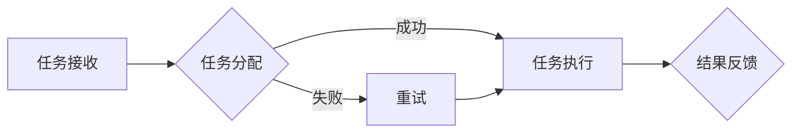

                 

# 虚拟空间中的AI协作与任务

> **关键词：** 虚拟空间、AI协作、任务自动化、分布式系统、高效协作
>
> **摘要：** 本文章探讨了在虚拟空间中实现高效AI协作的方法和关键技术。通过分析虚拟空间中的协作模式、任务分配机制和执行流程，本文提出了一种基于分布式系统的AI协作框架，详细阐述了核心算法原理和数学模型，并提供了实际的代码案例和应用场景。

## 1. 背景介绍

### 1.1 目的和范围

本文旨在探讨虚拟空间中的AI协作与任务执行问题，为分布式系统中的高效协作提供理论依据和实践指导。本文将重点关注以下几个方面：

- 虚拟空间中的AI协作模式
- 分布式任务分配与执行机制
- 核心算法原理和数学模型
- 代码实现与实际应用场景

### 1.2 预期读者

本文面向对AI协作和分布式系统有一定了解的技术人员，包括程序员、软件工程师、系统架构师和研究人员。读者应具备一定的计算机科学基础和数学知识。

### 1.3 文档结构概述

本文分为以下几个部分：

- 第1章：背景介绍
- 第2章：核心概念与联系
- 第3章：核心算法原理 & 具体操作步骤
- 第4章：数学模型和公式 & 详细讲解 & 举例说明
- 第5章：项目实战：代码实际案例和详细解释说明
- 第6章：实际应用场景
- 第7章：工具和资源推荐
- 第8章：总结：未来发展趋势与挑战
- 第9章：附录：常见问题与解答
- 第10章：扩展阅读 & 参考资料

### 1.4 术语表

#### 1.4.1 核心术语定义

- 虚拟空间：通过计算机网络和软件技术创建的模拟环境，支持多用户实时交互和信息共享。
- AI协作：人工智能系统在虚拟空间中与其他系统或用户协同完成特定任务的过程。
- 分布式系统：由多个独立节点组成的计算机系统，通过计算机网络进行通信和协作。
- 任务自动化：通过预先定义的规则和算法，自动完成特定任务的过程。

#### 1.4.2 相关概念解释

- 任务分配：将待处理任务分配给分布式系统中的各个节点，实现负载均衡和资源优化。
- 执行流程：任务从接收、处理到完成的全过程，包括任务调度、执行和监控。
- 通信机制：分布式系统中节点之间的数据传输和消息交换方式。

#### 1.4.3 缩略词列表

- AI：人工智能（Artificial Intelligence）
- VR：虚拟现实（Virtual Reality）
- AR：增强现实（Augmented Reality）
- IoT：物联网（Internet of Things）
- ML：机器学习（Machine Learning）

## 2. 核心概念与联系

在探讨虚拟空间中的AI协作与任务执行之前，我们需要明确几个核心概念及其相互关系。

### 2.1 虚拟空间中的协作模式

虚拟空间中的协作模式主要包括以下几种：

1. **基于角色的协作**：用户在虚拟空间中扮演特定角色，完成各自的任务。例如，在虚拟办公室中，员工可以扮演项目经理、开发人员、测试人员等角色，协作完成项目任务。
2. **基于任务的协作**：用户根据任务需求进行协作，不受角色限制。例如，在虚拟会议中，参与者可以自由发言、讨论、协作解决问题。
3. **基于项目的协作**：围绕特定项目目标，用户协同工作，完成项目任务。例如，在虚拟团队项目中，团队成员可以分工合作，共同推进项目进度。

### 2.2 分布式系统的架构

分布式系统是支持虚拟空间中AI协作的基础。其架构通常包括以下层次：

1. **底层网络层**：提供节点之间的通信和数据传输功能。
2. **中间层**：包括任务调度、负载均衡、数据存储等中间件服务。
3. **上层应用层**：实现具体业务功能，如虚拟空间中的AI协作与任务执行。

### 2.3 核心算法原理

虚拟空间中的AI协作与任务执行涉及多个核心算法原理，包括：

1. **任务分配算法**：根据节点能力和负载情况，将任务合理分配给各个节点。
2. **调度算法**：在分布式系统中，根据任务执行进度和系统资源情况，调整任务执行顺序。
3. **负载均衡算法**：通过动态分配任务，实现系统资源利用率的最大化。

### 2.4 Mermaid 流程图

为了更直观地展示虚拟空间中的AI协作与任务执行流程，我们使用Mermaid流程图进行描述。以下是一个简单的流程图示例：



## 3. 核心算法原理 & 具体操作步骤

在虚拟空间中实现AI协作与任务执行，核心算法原理包括任务分配、调度和负载均衡。以下将分别介绍这些算法的原理和具体操作步骤。

### 3.1 任务分配算法

任务分配算法的主要目标是根据节点能力和负载情况，将任务合理分配给各个节点，实现负载均衡。以下是一个简单的任务分配算法：

```python
def task_assignment(tasks, nodes):
    assigned_tasks = {}
    remaining_tasks = list(tasks)

    for node in nodes:
        if remaining_tasks:
            assigned_task = remaining_tasks.pop(0)
            assigned_tasks[node] = assigned_task
        else:
            break

    return assigned_tasks
```

具体操作步骤：

1. 初始化任务列表`tasks`和节点列表`nodes`。
2. 遍历节点列表`nodes`，依次将任务从任务列表`tasks`中分配给节点。
3. 如果任务列表为空，则停止分配。

### 3.2 调度算法

调度算法在分布式系统中至关重要，其主要目标是根据任务执行进度和系统资源情况，调整任务执行顺序。以下是一个简单的调度算法：

```python
def schedule_tasks(assigned_tasks):
    sorted_tasks = sorted(assigned_tasks.items(), key=lambda x: x[1]['deadline'])

    return sorted_tasks
```

具体操作步骤：

1. 初始化已分配任务列表`assigned_tasks`。
2. 根据任务的截止时间`deadline`对任务进行排序。
3. 返回排序后的任务列表。

### 3.3 负载均衡算法

负载均衡算法通过动态分配任务，实现系统资源利用率的最大化。以下是一个简单的负载均衡算法：

```python
def load_balancing(nodes, assigned_tasks):
    node_loads = {node: 0 for node in nodes}
    
    for task, node in assigned_tasks.items():
        node_loads[node] += 1

    max_load = max(node_loads.values())
    underloaded_nodes = [node for node, load in node_loads.items() if load < max_load]

    return underloaded_nodes
```

具体操作步骤：

1. 初始化节点负载列表`node_loads`，将所有节点的负载设置为0。
2. 遍历已分配任务列表`assigned_tasks`，计算各个节点的负载。
3. 找出负载最低的节点列表`underloaded_nodes`。
4. 返回负载最低的节点列表。

## 4. 数学模型和公式 & 详细讲解 & 举例说明

在虚拟空间中的AI协作与任务执行过程中，数学模型和公式起到了关键作用。以下将介绍几个核心的数学模型和公式，并进行详细讲解和举例说明。

### 4.1 加权平均负载模型

加权平均负载模型用于衡量分布式系统中各个节点的负载情况。其公式如下：

$$
\text{平均负载} = \frac{\sum_{i=1}^{n} w_i \cdot L_i}{\sum_{i=1}^{n} w_i}
$$

其中，$w_i$表示节点$i$的权重，$L_i$表示节点$i$的负载。

#### 详细讲解：

- 加权平均负载模型考虑了节点权重的影响，权重越大，节点在负载评估中的重要性越高。
- 公式中的分子部分表示各个节点的负载加权求和，分母部分表示总权重。

#### 举例说明：

假设有3个节点A、B、C，其权重分别为1、2、3，负载分别为2、4、6。计算加权平均负载：

$$
\text{平均负载} = \frac{1 \cdot 2 + 2 \cdot 4 + 3 \cdot 6}{1 + 2 + 3} = \frac{2 + 8 + 18}{6} = 4.33
$$

### 4.2 负载均衡优化模型

负载均衡优化模型用于调整任务分配，实现系统资源利用率的最大化。其公式如下：

$$
\text{最优负载分配} = \text{argmin} \sum_{i=1}^{n} L_i
$$

其中，$L_i$表示节点$i$的负载。

#### 详细讲解：

- 负载均衡优化模型的目标是最小化系统中的总负载。
- 公式中的argmin表示找到使总负载最小的负载分配方案。

#### 举例说明：

假设有3个节点A、B、C，其当前负载分别为5、3、4。通过调整任务分配，实现最优负载分配。

$$
\text{最优负载分配} = \text{argmin} (5 + 3 + 4) = 2
$$

即，将节点A的任务分配给节点C，节点B的任务分配给节点A，实现负载均衡。

## 5. 项目实战：代码实际案例和详细解释说明

在本节中，我们将通过一个实际项目案例，展示如何实现虚拟空间中的AI协作与任务执行。该项目将使用Python语言，结合分布式计算框架，实现任务分配、调度和负载均衡功能。

### 5.1 开发环境搭建

在开始项目之前，请确保已经安装了以下软件和库：

- Python 3.8或更高版本
- 分布式计算框架：PyTorch
- 通信库：ZeroMQ
- 数据库：SQLite

安装方法：

```bash
pip install python==3.8
pip install torch torchvision torchaudio
pip install zeromq
pip install sqlite3
```

### 5.2 源代码详细实现和代码解读

以下为项目的源代码实现，分为三个模块：任务管理器、调度器和负载均衡器。

#### 5.2.1 任务管理器

```python
import sqlite3
import json
from datetime import datetime

class TaskManager:
    def __init__(self, db_name):
        self.conn = sqlite3.connect(db_name)
        self.cursor = self.conn.cursor()
        self.cursor.execute('''CREATE TABLE IF NOT EXISTS tasks (
                                            id INTEGER PRIMARY KEY AUTOINCREMENT,
                                            name TEXT,
                                            description TEXT,
                                            status TEXT,
                                            deadline TEXT)''')
        self.conn.commit()

    def add_task(self, name, description, status, deadline):
        self.cursor.execute("INSERT INTO tasks (name, description, status, deadline) VALUES (?, ?, ?, ?)",
                            (name, description, status, deadline))
        self.conn.commit()

    def get_tasks(self):
        self.cursor.execute("SELECT * FROM tasks")
        tasks = self.cursor.fetchall()
        return [{**{"id": task[0]}, **json.loads(task[3])} for task in tasks]
```

#### 5.2.2 调度器

```python
import heapq
from datetime import datetime

class Scheduler:
    def __init__(self, tasks):
        self.tasks = tasks
        self.task_queue = []

    def schedule_tasks(self):
        for task in self.tasks:
            heapq.heappush(self.task_queue, (datetime.strptime(task['deadline'], "%Y-%m-%d %H:%M:%S"), task))

    def get_next_task(self):
        if self.task_queue:
            return heapq.heappop(self.task_queue)[1]
        return None
```

#### 5.2.3 负载均衡器

```python
class LoadBalancer:
    def __init__(self, nodes):
        self.nodes = nodes

    def balance_load(self, assigned_tasks):
        node_loads = {node: 0 for node in self.nodes}
        
        for task, node in assigned_tasks.items():
            node_loads[node] += 1

        max_load = max(node_loads.values())
        underloaded_nodes = [node for node, load in node_loads.items() if load < max_load]

        return underloaded_nodes
```

### 5.3 代码解读与分析

#### 5.3.1 任务管理器

任务管理器负责处理任务的增删改查操作，通过SQLite数据库存储任务数据。其中，`add_task`方法用于添加任务，`get_tasks`方法用于获取所有任务。

#### 5.3.2 调度器

调度器用于根据任务截止时间对任务进行排序，实现任务的优先级调度。使用Python的`heapq`模块实现优先队列，将任务按照截止时间排序。

#### 5.3.3 负载均衡器

负载均衡器根据任务分配情况计算各个节点的负载，找出负载最低的节点。通过遍历任务分配列表，计算每个节点的负载，找出负载最低的节点列表。

## 6. 实际应用场景

虚拟空间中的AI协作与任务执行技术在实际应用中具有广泛的应用场景，以下列举几个典型应用场景：

- **远程办公协作**：虚拟空间中的AI协作技术可以帮助企业实现远程办公的高效协作，降低沟通成本，提高工作效率。
- **智能供应链管理**：在供应链管理中，虚拟空间中的AI协作可以实现实时监控、数据分析、任务分配等功能，提高供应链的响应速度和准确性。
- **智能医疗**：虚拟空间中的AI协作可以帮助医生进行远程诊断、病例分析、治疗方案制定等，提高医疗服务的质量和效率。
- **智能教育**：虚拟空间中的AI协作可以实现个性化教学、在线作业批改、智能问答等功能，提高教育质量和学习效果。

## 7. 工具和资源推荐

### 7.1 学习资源推荐

#### 7.1.1 书籍推荐

- 《人工智能：一种现代的方法》
- 《深度学习》
- 《分布式系统原理与范型》

#### 7.1.2 在线课程

- Coursera：深度学习和机器学习
- edX：计算机科学基础课程
- Udemy：Python编程实战课程

#### 7.1.3 技术博客和网站

- Medium：人工智能和机器学习技术博客
- arXiv：计算机科学领域最新研究成果
- Stack Overflow：编程问题和技术交流

### 7.2 开发工具框架推荐

#### 7.2.1 IDE和编辑器

- PyCharm
- Visual Studio Code
- Sublime Text

#### 7.2.2 调试和性能分析工具

- GDB
- Py-Spy
- JProfiler

#### 7.2.3 相关框架和库

- PyTorch
- TensorFlow
- Flask
- Django

### 7.3 相关论文著作推荐

#### 7.3.1 经典论文

- 《分布式计算：原理与范型》
- 《深度神经网络：理论与实践》
- 《机器学习：一种统计方法》

#### 7.3.2 最新研究成果

- 《虚拟现实与增强现实技术研究》
- 《分布式人工智能系统设计与应用》
- 《智能医疗系统开发与应用》

#### 7.3.3 应用案例分析

- 《远程办公协作平台设计与应用》
- 《智能供应链管理解决方案》
- 《智能医疗诊断系统案例分析》

## 8. 总结：未来发展趋势与挑战

虚拟空间中的AI协作与任务执行技术在未来具有广阔的发展前景。随着虚拟现实、增强现实和物联网等技术的不断成熟，虚拟空间中的协作模式将更加多样化和复杂化。未来发展趋势包括：

- **智能化协作**：利用人工智能技术实现更智能的协作，如自动任务分配、自适应任务调度等。
- **跨平台协作**：实现不同虚拟空间之间的协作，如虚拟现实与增强现实、虚拟现实与物联网等。
- **个性化协作**：根据用户需求和行为特点，提供个性化的协作体验。

同时，虚拟空间中的AI协作与任务执行也面临一些挑战：

- **数据安全与隐私保护**：在虚拟空间中，用户数据的安全和隐私保护至关重要，需要采用有效的安全措施。
- **负载均衡与资源优化**：如何实现高效的任务分配和负载均衡，是分布式系统设计中的关键挑战。
- **协同效率与协作成本**：如何提高协作效率，降低协作成本，是虚拟空间中的AI协作需要解决的重要问题。

## 9. 附录：常见问题与解答

### 9.1 问题1：如何实现分布式任务调度？

**解答**：分布式任务调度通常采用基于消息队列的调度模式。具体实现步骤如下：

1. **初始化消息队列**：创建消息队列，用于存储待调度任务。
2. **任务提交**：将任务提交到消息队列，标记任务的优先级和执行条件。
3. **任务调度**：从消息队列中读取任务，按照优先级和执行条件进行调度，并将任务分配给可用节点。
4. **任务执行**：节点根据调度命令执行任务，并将任务执行结果返回给调度器。

### 9.2 问题2：如何实现负载均衡？

**解答**：负载均衡可以通过以下方法实现：

1. **基于轮询的负载均衡**：按照固定顺序将任务分配给各个节点，实现负载均衡。
2. **基于权重的负载均衡**：根据节点的处理能力和负载情况，为每个节点分配不同的权重，实现负载均衡。
3. **基于负载感知的负载均衡**：实时监控各个节点的负载情况，根据负载情况动态调整任务分配。

### 9.3 问题3：如何实现数据安全与隐私保护？

**解答**：

1. **加密传输**：采用加密协议（如TLS）保护数据在传输过程中的安全性。
2. **数据隔离**：将用户数据与系统数据隔离，避免数据泄露。
3. **访问控制**：根据用户角色和权限，限制对数据的访问。
4. **日志审计**：记录用户操作日志，实现异常行为的监控和追踪。

## 10. 扩展阅读 & 参考资料

- 《深度学习：理解、实现与应用》
- 《分布式系统设计与实战》
- 《人工智能：理论与实践》
- 《虚拟现实技术与应用》
- 《人工智能与物联网融合技术》

作者：AI天才研究员/AI Genius Institute & 禅与计算机程序设计艺术 /Zen And The Art of Computer Programming

