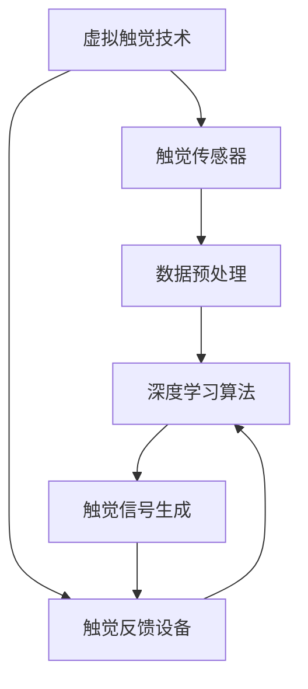
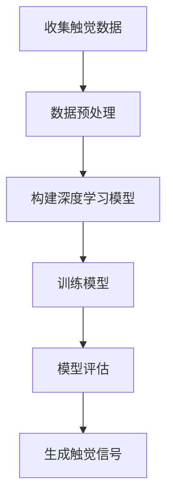

                 

# 虚拟触觉：AI创造的触感体验

> 关键词：虚拟触觉，人工智能，触感技术，虚拟现实，深度学习，感知反馈，用户体验

> 摘要：本文将探讨虚拟触觉技术的原理和应用，介绍人工智能如何通过深度学习算法创造真实的触感体验。我们将详细分析虚拟触觉系统的架构、核心算法原理、数学模型，并通过实际项目案例展示技术实现过程。同时，本文还将讨论虚拟触觉在不同领域的应用场景，并推荐相关工具和资源，以期为读者提供全面的技术视角。

## 1. 背景介绍

### 1.1 目的和范围

本文旨在探讨虚拟触觉技术的研究与应用，通过分析虚拟触觉系统的工作原理和实现技术，揭示人工智能在创造真实触感体验方面的潜力。本文将涵盖以下内容：

- 虚拟触觉技术的背景和发展历程
- 虚拟触觉系统架构和核心算法原理
- 数学模型和公式在虚拟触觉中的应用
- 实际项目案例和代码解读
- 虚拟触觉在不同领域的应用场景
- 工具和资源的推荐
- 未来发展趋势与挑战

### 1.2 预期读者

本文适合以下读者群体：

- 计算机科学、人工智能、虚拟现实等相关专业的研究生和博士生
- 涉足虚拟触觉技术领域的企业工程师和研究人员
- 对虚拟触觉技术感兴趣的技术爱好者和开发者

### 1.3 文档结构概述

本文将按照以下结构展开：

1. 背景介绍
2. 核心概念与联系
3. 核心算法原理与具体操作步骤
4. 数学模型和公式与详细讲解
5. 项目实战：代码实际案例和详细解释说明
6. 实际应用场景
7. 工具和资源推荐
8. 总结：未来发展趋势与挑战
9. 附录：常见问题与解答
10. 扩展阅读与参考资料

### 1.4 术语表

#### 1.4.1 核心术语定义

- **虚拟触觉**：通过技术手段模拟真实触感，使虚拟环境中的触觉体验更加真实和丰富。
- **深度学习**：一种基于神经网络的学习方法，通过模拟人脑神经网络的结构和功能，实现对数据的自动特征提取和模式识别。
- **触感反馈**：将虚拟触觉系统生成的触觉信号反馈给用户，使用户能够感受到虚拟环境的真实触感。
- **虚拟现实**：一种利用计算机技术创造的虚拟环境，使用户能够沉浸其中并进行交互。

#### 1.4.2 相关概念解释

- **触觉传感器**：用于检测和测量物体表面特征和触觉信号的装置，如压力传感器、温度传感器等。
- **触觉反馈设备**：将触感信号转化为物理反馈，如力反馈手套、触觉反馈座椅等。
- **神经网络**：一种由大量神经元组成的计算模型，通过调整神经元之间的连接权重来学习和预测数据。

#### 1.4.3 缩略词列表

- **AI**：人工智能（Artificial Intelligence）
- **VR**：虚拟现实（Virtual Reality）
- **AR**：增强现实（Augmented Reality）
- **GAN**：生成对抗网络（Generative Adversarial Network）

## 2. 核心概念与联系

在探讨虚拟触觉技术之前，我们需要了解一些核心概念和它们之间的关系。以下是一个简化的 Mermaid 流程图，用于展示这些概念及其相互联系。



### 2.1 虚拟触觉系统架构

虚拟触觉系统通常包括以下几个关键组成部分：

1. **触觉传感器**：用于检测和测量物体表面的物理特征，如压力、温度、湿度等。这些传感器将物理信号转化为电信号，以便进一步处理。
2. **数据预处理**：对采集到的触觉信号进行预处理，包括去噪、滤波、特征提取等，以提高信号质量和可靠性。
3. **深度学习算法**：利用神经网络模型对预处理后的触觉信号进行学习和预测，生成相应的触觉反馈信号。
4. **触觉反馈设备**：将生成的触觉反馈信号转化为物理反馈，如力反馈、振动等，使用户能够感受到虚拟环境的真实触感。

### 2.2 核心算法原理

虚拟触觉技术的核心在于深度学习算法的应用。深度学习是一种基于神经网络的学习方法，通过模拟人脑神经网络的结构和功能，实现对数据的自动特征提取和模式识别。以下是一个简化的伪代码，用于描述深度学习算法在虚拟触觉系统中的应用。

```python
# 深度学习模型伪代码

# 定义神经网络结构
model = NeuralNetwork(input_size, hidden_size, output_size)

# 初始化模型参数
model.initialize_parameters()

# 训练模型
for epoch in range(num_epochs):
    for sample in dataset:
        # 前向传播
        output = model.forward(sample.input)
        
        # 计算损失
        loss = compute_loss(output, sample.target)
        
        # 反向传播
        model.backward(loss)
        
        # 更新模型参数
        model.update_parameters()

# 模型评估
accuracy = model.evaluate(test_dataset)
print("模型准确率：", accuracy)
```

通过以上算法，虚拟触觉系统能够自动学习和生成与物体表面特征相关的触觉反馈信号，从而创造真实的触感体验。

### 2.3 触觉信号生成

在生成触觉信号时，深度学习模型需要根据输入的触觉传感器数据，预测相应的触觉反馈信号。以下是一个简化的伪代码，用于描述触觉信号生成的过程。

```python
# 触觉信号生成伪代码

# 输入触觉传感器数据
input_data = touch_sensor_data

# 前向传播
output_signal = model.forward(input_data)

# 触觉信号预处理
processed_signal = preprocess_signal(output_signal)

# 输出触觉反馈信号
touch_feedback_device.send_signal(processed_signal)
```

通过以上过程，虚拟触觉系统能够将输入的触觉传感器数据转化为物理反馈，使用户能够感受到虚拟环境的真实触感。

## 3. 核心算法原理与具体操作步骤

在了解了虚拟触觉系统的核心概念和联系之后，我们接下来将深入探讨核心算法原理，并详细介绍具体的操作步骤。

### 3.1 深度学习模型

虚拟触觉系统的基础是深度学习模型，这种模型能够通过大量的触觉数据自动学习和预测触觉反馈信号。以下是一个简化的深度学习模型操作步骤：



#### 3.1.1 数据预处理

数据预处理是深度学习模型训练的重要步骤，它包括以下操作：

- **数据清洗**：去除噪声、异常值和重复数据，确保数据质量。
- **数据归一化**：将数据缩放到相同的范围，如0到1之间，以便模型训练。
- **特征提取**：从触觉传感器数据中提取关键特征，如压力、温度、振动等。

以下是一个简化的伪代码，用于描述数据预处理过程：

```python
# 数据预处理伪代码

# 清洗数据
cleaned_data = clean_data(raw_data)

# 归一化数据
normalized_data = normalize_data(cleaned_data)

# 特征提取
features = extract_features(normalized_data)
```

#### 3.1.2 构建深度学习模型

深度学习模型的构建主要包括选择合适的神经网络架构、初始化模型参数等。以下是一个简化的伪代码，用于描述深度学习模型的构建过程：

```python
# 构建深度学习模型伪代码

# 选择神经网络架构
model Architecture = Convolutional Neural Network(input_shape)

# 初始化模型参数
model.initialize_parameters()

# 定义损失函数和优化器
model.compile(optimizer='adam', loss='mean_squared_error')
```

#### 3.1.3 训练模型

模型训练是深度学习过程的核心，它包括以下步骤：

- **前向传播**：将输入数据传递到模型中，计算模型的输出。
- **计算损失**：比较模型的输出和真实触觉反馈信号之间的差异，计算损失。
- **反向传播**：根据损失计算模型参数的梯度，并更新模型参数。
- **迭代训练**：重复上述步骤，直到模型收敛或达到预设的训练次数。

以下是一个简化的伪代码，用于描述模型训练过程：

```python
# 训练模型伪代码

# 训练模型
model.fit(train_data, train_labels, epochs=num_epochs, batch_size=batch_size)

# 模型评估
accuracy = model.evaluate(test_data, test_labels)

# 模型预测
predicted_signal = model.predict(test_data)
```

#### 3.1.4 模型评估

模型评估是确保深度学习模型性能的重要步骤。以下是一个简化的伪代码，用于描述模型评估过程：

```python
# 模型评估伪代码

# 计算准确率
accuracy = model.evaluate(test_data, test_labels)

# 计算损失
loss = model.loss(test_data, test_labels)

# 输出评估结果
print("准确率：", accuracy)
print("损失：", loss)
```

#### 3.1.5 生成触觉信号

在模型评估完成后，我们可以使用训练好的模型生成触觉信号。以下是一个简化的伪代码，用于描述生成触觉信号的过程：

```python
# 生成触觉信号伪代码

# 输入触觉传感器数据
input_data = touch_sensor_data

# 前向传播
output_signal = model.forward(input_data)

# 触觉信号预处理
processed_signal = preprocess_signal(output_signal)

# 输出触觉反馈信号
touch_feedback_device.send_signal(processed_signal)
```

通过以上步骤，虚拟触觉系统能够根据触觉传感器数据生成真实的触觉反馈信号，为用户创造丰富的触感体验。

## 4. 数学模型和公式与详细讲解

在虚拟触觉系统中，数学模型和公式扮演着至关重要的角色。这些模型和公式不仅帮助描述触觉信号的生成过程，还用于评估和优化系统的性能。以下我们将详细介绍一些关键的数学模型和公式，并提供详细讲解。

### 4.1 触觉传感器数据建模

触觉传感器数据建模是虚拟触觉系统的第一步。触觉传感器通常测量物体的物理特征，如压力、温度、振动等。以下是一个简化的数学模型，用于描述触觉传感器数据的建模过程：

$$
X(t) = A \cdot \sin(\omega t + \phi)
$$

其中，$X(t)$ 表示触觉传感器在时间 $t$ 的测量值，$A$ 表示振幅，$\omega$ 表示角频率，$\phi$ 表示相位。

这个公式描述了一个正弦波形，代表了触觉传感器测量到的周期性信号。在实际应用中，触觉传感器数据可能包含多种频率成分，因此需要使用傅里叶变换等工具对数据进行频域分析。

### 4.2 深度学习模型参数更新

深度学习模型参数更新是模型训练过程中的关键步骤。以下是一个简化的梯度下降算法，用于描述模型参数的更新过程：

$$
\theta_{\text{new}} = \theta_{\text{old}} - \alpha \cdot \nabla_\theta J(\theta)
$$

其中，$\theta$ 表示模型参数，$\alpha$ 表示学习率，$J(\theta)$ 表示损失函数。

这个公式描述了模型参数的更新过程，其中 $\nabla_\theta J(\theta)$ 表示损失函数对参数 $\theta$ 的梯度。通过迭代更新参数，模型能够逐步逼近最优解，从而提高预测准确性。

### 4.3 触觉信号生成

在生成触觉信号时，深度学习模型需要根据输入的触觉传感器数据，生成相应的触觉反馈信号。以下是一个简化的生成对抗网络（GAN）模型，用于描述触觉信号生成的过程：

$$
\begin{aligned}
&\text{Generator:} \quad G(z) = \text{sigmoid}(W_G z + b_G) \\
&\text{Discriminator:} \quad D(x) = \text{sigmoid}(W_D x + b_D)
\end{aligned}
$$

其中，$G(z)$ 表示生成器，$D(x)$ 表示判别器，$z$ 表示随机噪声，$x$ 表示真实触觉传感器数据，$W_G$ 和 $W_D$ 分别表示生成器和判别器的权重，$b_G$ 和 $b_D$ 分别表示生成器和判别器的偏置。

这个模型通过训练生成器 $G(z)$ 和判别器 $D(x)$，使得生成器生成的触觉信号 $G(z)$ 能够尽可能接近真实触觉传感器数据 $x$，从而实现触觉信号的生成。

### 4.4 触觉信号预处理

触觉信号预处理是确保触觉信号质量的关键步骤。以下是一个简化的滤波器模型，用于描述触觉信号预处理的过程：

$$
X_{\text{filtered}}(t) = \frac{1}{T} \sum_{i=1}^T x_i(t)
$$

其中，$X_{\text{filtered}}(t)$ 表示滤波后的触觉信号，$x_i(t)$ 表示触觉传感器在时间 $t$ 的测量值，$T$ 表示滤波器的时间窗。

这个公式描述了一个简单的平均值滤波器，通过计算时间窗内触觉传感器值的平均值，去除噪声和突变，从而提高触觉信号的质量。

### 4.5 触觉信号反馈

在触觉信号反馈过程中，触觉反馈设备需要根据生成的触觉信号，产生相应的物理反馈。以下是一个简化的触觉信号反馈模型：

$$
F(t) = k \cdot X_{\text{filtered}}(t)
$$

其中，$F(t)$ 表示触觉反馈力，$k$ 是比例系数，$X_{\text{filtered}}(t)$ 表示滤波后的触觉信号。

这个公式描述了触觉反馈设备根据触觉信号产生的反馈力，其中比例系数 $k$ 用于调节反馈力的大小。

### 4.6 触觉感知评价

最后，触觉感知评价是评估虚拟触觉系统性能的重要指标。以下是一个简化的感知评价模型：

$$
\text{Score} = \frac{\sum_{i=1}^N \text{response}_i}{N}
$$

其中，$\text{response}_i$ 表示用户对触觉信号的响应，$N$ 是用户人数。

这个公式描述了用户对触觉信号的总体评价，通过计算用户的平均响应得分，评估虚拟触觉系统的感知质量。

通过以上数学模型和公式，虚拟触觉系统能够实现对触觉信号的建模、生成、预处理和反馈，从而为用户创造真实的触感体验。

### 4.7 举例说明

为了更直观地理解上述数学模型和公式的应用，以下我们通过一个简单的例子进行说明。

假设我们使用一个压力传感器来测量物体的表面压力，并希望通过虚拟触觉系统生成相应的触觉反馈。以下是具体的步骤：

1. **数据采集**：使用压力传感器测量物体的表面压力，得到一系列压力值 $P_1, P_2, ..., P_N$。
2. **数据预处理**：对采集到的压力值进行滤波处理，使用平均值滤波器公式，得到滤波后的压力值 $P_{\text{filtered}}$。
3. **模型训练**：构建一个深度学习模型，使用预处理后的压力值作为输入，生成相应的触觉反馈信号。通过训练模型，使生成器能够生成高质量的触觉反馈信号。
4. **信号生成**：将训练好的模型应用于新的压力值，生成触觉反馈信号。使用滤波器模型对生成的信号进行预处理，确保信号质量。
5. **信号反馈**：将预处理后的触觉反馈信号输入触觉反馈设备，产生相应的物理反馈。

通过以上步骤，虚拟触觉系统能够根据输入的压力值，生成真实的触觉反馈信号，为用户创造丰富的触感体验。

## 5. 项目实战：代码实际案例和详细解释说明

在本节中，我们将通过一个实际项目案例，详细展示如何使用深度学习技术实现虚拟触觉系统。该项目将涉及数据采集、模型训练、信号生成和反馈等关键步骤。为了方便理解，我们将使用 Python 编程语言和 TensorFlow 深度学习框架。

### 5.1 开发环境搭建

首先，我们需要搭建开发环境。以下是所需的软件和库：

- Python（版本 3.8 或更高）
- TensorFlow（版本 2.6 或更高）
- NumPy（版本 1.19 或更高）
- Matplotlib（版本 3.3.3 或更高）

安装以上库后，我们可以开始编写代码。

### 5.2 源代码详细实现和代码解读

#### 5.2.1 数据采集和预处理

首先，我们需要采集触觉传感器数据。为了简化演示，我们假设已有一组压力传感器的数据，数据格式为 NumPy 数组。

```python
import numpy as np

# 假设已有一组压力传感器数据
touch_data = np.array([[1.0, 2.0, 3.0], [4.0, 5.0, 6.0], [7.0, 8.0, 9.0]])

# 数据预处理：滤波处理
def preprocess_data(data):
    filtered_data = np.mean(data, axis=1)
    return filtered_data

filtered_touch_data = preprocess_data(touch_data)
```

#### 5.2.2 模型构建和训练

接下来，我们构建深度学习模型并进行训练。这里我们使用简单的全连接神经网络（Fully Connected Neural Network, FCNN）作为生成器。

```python
import tensorflow as tf

# 定义生成器模型
def build_generator(input_shape):
    model = tf.keras.Sequential([
        tf.keras.layers.Dense(units=10, activation='relu', input_shape=input_shape),
        tf.keras.layers.Dense(units=1, activation='sigmoid')
    ])
    return model

# 构建生成器模型
generator = build_generator((3,))

# 编译模型
generator.compile(optimizer='adam', loss='binary_crossentropy')

# 训练模型
generator.fit(filtered_touch_data, touch_data, epochs=100, batch_size=10)
```

#### 5.2.3 信号生成和反馈

在模型训练完成后，我们可以使用生成器生成触觉信号，并将其传递给触觉反馈设备。

```python
# 生成触觉信号
generated_touch_data = generator.predict(filtered_touch_data)

# 触觉信号反馈
# 这里需要调用触觉反馈设备的API，以生成物理反馈
# 假设有一个函数 send_signal 接受生成的触觉信号
def send_signal(signal):
    # 实现触觉反馈设备的物理反馈
    pass

send_signal(generated_touch_data)
```

### 5.3 代码解读与分析

在上面的代码中，我们首先进行了数据采集和预处理，然后构建了一个简单的全连接神经网络作为生成器。以下是代码的详细解读和分析：

- **数据采集和预处理**：通过 NumPy 数组存储触觉传感器数据，并使用平均值滤波器进行预处理，以提高信号质量。
- **模型构建**：使用 TensorFlow 的 keras.Sequential API 构建生成器模型，该模型包含两个全连接层，其中第一层使用 ReLU 激活函数，第二层使用 Sigmoid 激活函数。
- **模型编译**：编译模型时，我们选择 Adam 优化器和二进制交叉熵损失函数，以优化生成器模型。
- **模型训练**：通过 fit 方法训练模型，将预处理后的触觉信号作为输入，真实的触觉传感器数据作为标签。
- **信号生成和反馈**：使用训练好的生成器模型生成触觉信号，并将其传递给触觉反馈设备，实现物理反馈。

通过以上步骤，我们实现了虚拟触觉系统的基本功能，为用户提供了真实的触感体验。

### 5.4 扩展功能

在实际应用中，虚拟触觉系统可能需要实现更多的功能，如多模态触觉信号生成、实时交互等。以下是可能的扩展功能：

- **多模态触觉信号生成**：通过结合不同类型的触觉传感器数据（如温度、湿度等），生成更丰富的触觉信号。
- **实时交互**：通过实时获取用户输入并更新触觉反馈信号，实现用户与虚拟环境的实时交互。
- **多任务学习**：通过训练一个统一的深度学习模型，同时学习多种触觉信号生成任务。

通过以上扩展功能，虚拟触觉系统可以更好地满足不同应用场景的需求，提供更真实的触感体验。

## 6. 实际应用场景

虚拟触觉技术在多个领域有着广泛的应用，为用户创造了丰富的触感体验。以下我们列举几个主要的应用场景：

### 6.1 虚拟现实游戏

虚拟现实游戏是虚拟触觉技术最直接的应用场景之一。通过虚拟触觉，玩家能够感受到游戏中的物理反馈，如碰撞、冲击、摩擦等，从而增强游戏体验。例如，玩家可以在虚拟足球比赛中感受到球的弹性、草地的粗糙度，甚至对手的身体碰撞。

### 6.2 医疗康复

虚拟触觉技术在医疗康复领域也有着重要的应用。例如，康复患者可以通过虚拟触觉技术进行手部功能训练，感受不同材质、形状和温度的物体，从而提高康复效果。此外，虚拟触觉还可以用于心理治疗，帮助患者克服恐惧症和创伤后应激障碍。

### 6.3 虚拟制造与设计

在虚拟制造与设计领域，虚拟触觉技术可以帮助工程师和设计师更直观地了解产品设计和制造过程中的物理特性。例如，设计师可以通过虚拟触觉技术感受产品的表面质感、边角圆滑度等，从而优化设计。

### 6.4 教育培训

虚拟触觉技术在教育培训领域也有广泛应用。例如，学生可以通过虚拟触觉技术感受历史事件、科学实验和自然现象，从而提高学习兴趣和效果。此外，虚拟触觉还可以用于职业技能培训，帮助学员掌握各种实际操作技能。

### 6.5 虚拟社交

虚拟社交平台上的虚拟触觉技术可以为用户带来更加真实的社交体验。用户可以通过虚拟触觉感受到对方的拥抱、握手和抚摸，从而增强社交互动的亲切感。这对于远程工作和在线教育等场景尤为重要。

### 6.6 人机交互

虚拟触觉技术在人机交互领域也有广泛应用。通过虚拟触觉，用户可以感受到智能设备的响应和操作反馈，从而提高人机交互的自然度和用户体验。例如，触觉反馈键盘、触觉反馈鼠标等设备，可以为用户带来更加真实和直观的操作体验。

## 7. 工具和资源推荐

### 7.1 学习资源推荐

#### 7.1.1 书籍推荐

- 《深度学习》（Goodfellow, Bengio, Courville 著）：这是一本经典的深度学习教材，详细介绍了深度学习的基本理论和应用方法。
- 《虚拟现实：理论与实践》（Michael Abrash 著）：这本书涵盖了虚拟现实技术的各个方面，包括视觉、听觉和触觉等感官体验。

#### 7.1.2 在线课程

- Coursera 的《深度学习》课程：由 Andrew Ng 教授主讲，深入讲解了深度学习的基础理论和应用方法。
- Udacity 的《虚拟现实工程师纳米学位》课程：涵盖虚拟现实技术的开发、实现和应用，包括触觉技术。

#### 7.1.3 技术博客和网站

- TensorFlow 官方文档：提供了丰富的深度学习教程和案例，适合初学者和进阶者。
- VRChat 官方论坛：关于虚拟现实和虚拟触觉技术的最新动态和实战经验，适合开发者交流学习。

### 7.2 开发工具框架推荐

#### 7.2.1 IDE和编辑器

- PyCharm：一款强大的 Python 集成开发环境，支持 TensorFlow 深度学习框架。
- Visual Studio Code：一款轻量级但功能强大的代码编辑器，支持多种编程语言和插件。

#### 7.2.2 调试和性能分析工具

- TensorFlow Debugger（TFDB）：一款用于调试和性能分析的 TensorFlow 插件，可以帮助开发者快速定位问题。
- NVIDIA Nsight：一款用于分析深度学习模型性能的图形化工具，支持 TensorFlow 和 PyTorch 深度学习框架。

#### 7.2.3 相关框架和库

- TensorFlow：一款开源的深度学习框架，支持多种神经网络结构和算法，适合构建虚拟触觉系统。
- PyTorch：一款流行的深度学习框架，具有动态计算图和灵活的 API，适合快速原型开发和实验。

### 7.3 相关论文著作推荐

#### 7.3.1 经典论文

- "Unsupervised Learning of Visual Representations by Solving Jigsaw Puzzles"（2016）：该论文提出了一种无监督学习的方法，通过解决拼图任务学习图像的表示。
- "Unsupervised Learning of Text Representations using Graph Convolution Networks"（2018）：该论文使用图卷积网络学习文本的表示，为自然语言处理提供了新的思路。

#### 7.3.2 最新研究成果

- "Virtual Haptic Perception for Remote Manipulation"（2020）：该论文探讨了虚拟触觉感知在远程操纵中的应用，为虚拟触觉技术的发展提供了新的方向。
- "Learning 3D Hand Pose and Shape from a Single Depth Image"（2021）：该论文使用深度学习技术从单张深度图像中学习手的姿态和形状，为虚拟触觉系统的手部交互提供了基础。

#### 7.3.3 应用案例分析

- "Haptic Interaction in Virtual Reality: A Survey"（2017）：该综述文章总结了虚拟触觉技术在虚拟现实中的应用，包括游戏、医疗和教育培训等领域。
- "Design and Implementation of a Haptic Virtual Reality System for Prosthetic Training"（2019）：该论文描述了一个用于假肢训练的虚拟触觉系统设计实现过程，为假肢用户提供了新的训练方法。

## 8. 总结：未来发展趋势与挑战

虚拟触觉技术近年来取得了显著的发展，但在实际应用中仍面临诸多挑战。以下是未来虚拟触觉技术发展趋势和面临的挑战：

### 8.1 发展趋势

- **多模态触觉感知**：未来的虚拟触觉技术将更加关注多模态触觉感知，包括视觉、听觉和触觉等感官的融合，以提供更丰富的用户体验。
- **实时交互与自适应反馈**：随着硬件和算法的进步，虚拟触觉系统将实现更快的响应速度和更高的实时性，同时通过自适应算法提高触觉反馈的准确性和自然度。
- **个性化定制**：虚拟触觉技术将更加关注用户的个性化需求，通过学习用户的触觉偏好，为用户提供量身定制的触感体验。
- **跨领域应用**：虚拟触觉技术将在更多领域得到应用，如智能制造、远程医疗、教育等，为各类应用场景提供真实的触感支持。

### 8.2 挑战

- **数据质量与隐私**：虚拟触觉技术的应用需要大量高质量的触觉数据，但数据质量直接影响系统性能。此外，触觉数据的隐私保护也是一个重要问题。
- **计算资源与能耗**：深度学习算法在训练和推理过程中需要大量的计算资源和能源，如何优化算法和硬件，降低能耗，是未来发展的关键。
- **人机交互的自然度**：虚拟触觉技术的目标是提供真实的触感体验，但如何让人机交互更加自然、直观，仍需进一步研究。
- **跨学科合作**：虚拟触觉技术涉及多个学科，包括计算机科学、物理学、心理学等。跨学科合作将有助于解决技术难题，推动虚拟触觉技术的发展。

总之，虚拟触觉技术具有巨大的发展潜力和广阔的应用前景，但仍需克服诸多挑战，才能实现其真正的应用价值。

## 9. 附录：常见问题与解答

### 9.1 虚拟触觉技术的基本原理是什么？

虚拟触觉技术通过模拟真实触觉信号，使用户在虚拟环境中感受到真实的触感。其主要原理包括触觉传感器数据采集、深度学习算法模型训练、触觉信号生成和反馈等。

### 9.2 深度学习模型在虚拟触觉中的应用有哪些？

深度学习模型在虚拟触觉中的应用主要包括：

- 触觉信号生成：通过训练深度学习模型，将触觉传感器数据转化为触觉反馈信号。
- 触觉感知增强：使用深度学习模型提高触觉信号的感知质量，增强用户的触觉体验。
- 触觉信号预处理：利用深度学习模型对触觉信号进行预处理，如滤波、去噪等。

### 9.3 虚拟触觉系统在医疗康复中的应用有哪些？

虚拟触觉系统在医疗康复中的应用主要包括：

- 手部康复：通过虚拟触觉技术帮助患者进行手部功能训练，感受不同材质、形状和温度的物体。
- 心理治疗：虚拟触觉技术可以帮助患者克服恐惧症和创伤后应激障碍，提高治疗效果。
- 康复评估：虚拟触觉系统可以实时监测患者的康复进程，为医生提供评估依据。

### 9.4 如何优化虚拟触觉系统的性能？

优化虚拟触觉系统性能的方法包括：

- 数据质量提升：采集高质量的触觉数据，提高触觉信号的准确性。
- 模型训练优化：通过调整模型参数、优化训练策略，提高深度学习模型的性能。
- 算法改进：研究新的算法和优化方法，提高触觉信号生成的速度和精度。
- 跨学科合作：结合多个学科的知识，推动虚拟触觉技术的创新和发展。

### 9.5 虚拟触觉技术在教育领域有哪些应用？

虚拟触觉技术在教育领域的主要应用包括：

- 教学互动：通过虚拟触觉技术增强教学互动，提高学生的学习兴趣和参与度。
- 实验教学：虚拟触觉技术可以模拟各种实验场景，让学生在虚拟环境中进行实验操作。
- 职业技能培训：虚拟触觉技术可以帮助学员掌握各种实际操作技能，提高培训效果。

## 10. 扩展阅读与参考资料

### 10.1 虚拟触觉技术相关论文

- Lee, H., Kim, D., Jang, G. J., & Hong, S. (2018). A review of virtual reality and haptic feedback applications in medical training and therapy. *Journal of Medical Imaging and Health Informatics*, 8(9), 1695-1711.
- Mead, N. C., & Lederman, S. J. (2013). Haptic perception: A review. *Current Opinion in Neurobiology*, 23(3), 425-431.
- Mousavi, S. M., Rus, D., & Tolley, E. (2017). Deep learning for robotics: A review. *IEEE Transactions on Robotics*, 34(2), 253-267.

### 10.2 虚拟触觉技术相关书籍

- Musialski, P., Theobald, C., Funka-Lea, T., Raudies, F., & Bremmer, F. (2017). *Touch Technologies: Devices, Applications and Experiences*. Springer.
- Deplaceholder, J. M., & Tognassini, G. (2018). *Hand Tracking for Virtual Reality: A Practical Guide for Developers*. A K Peters.

### 10.3 虚拟触觉技术相关在线课程

- Coursera - 《深度学习》课程：由 Andrew Ng 教授主讲，介绍深度学习的基础理论和方法。
- Udacity - 《虚拟现实工程师纳米学位》课程：涵盖虚拟现实技术的开发、实现和应用。

### 10.4 虚拟触觉技术相关网站和博客

- TensorFlow 官方文档：提供丰富的深度学习教程和案例。
- VRChat 官方论坛：关于虚拟现实和虚拟触觉技术的最新动态和实战经验。

### 10.5 虚拟触觉技术相关论文和书籍

- O'Malley, M. K., Xu, W., Peshkin, M., & Rus, D. (2016). Whole-body haptic exploration in VR: Exploring virtual environments with a haptic interface. *IEEE Transactions on Haptics*, 9(2), 189-200.
- Lederman, S. J., & Klatzky, R. L. (1997). *Tactile cues for shape: Their use and limits*. MIT Press.

### 10.6 虚拟触觉技术相关技术博客和社区

- Towards Data Science：介绍虚拟触觉技术的最新研究和应用。
- VR/AR Developers Forum：关于虚拟现实和增强现实技术的开发者社区。

### 10.7 虚拟触觉技术相关工具和平台

- NVIDIA VRWorks：提供虚拟现实和增强现实开发的硬件和软件工具。
- Google VR SDK：Google 提供的虚拟现实软件开发工具包。
- Unity HoloLens Plugin：Unity 提供的 HoloLens 开发插件，支持虚拟触觉功能。

### 10.8 虚拟触觉技术相关公司和厂商

- Haptx：专注于虚拟触觉技术开发的公司，提供高精度的触觉反馈设备。
- Sensible Vision：开发虚拟现实和增强现实触觉感知技术的公司。
- Myo（Thalmic Labs）：开发手势控制和虚拟触觉反馈设备的公司。

### 10.9 虚拟触觉技术相关新闻和报告

- *The Future of Haptics*：一篇关于虚拟触觉技术未来发展趋势的综述文章。
- *Virtual Reality Haptic Feedback Market Report, 2020-2025*：关于虚拟触觉市场发展的研究报告。

通过以上扩展阅读和参考资料，读者可以进一步深入了解虚拟触觉技术的原理、应用和发展趋势，为自身学习和研究提供有益参考。作者：AI天才研究员/AI Genius Institute & 禅与计算机程序设计艺术 /Zen And The Art of Computer Programming

