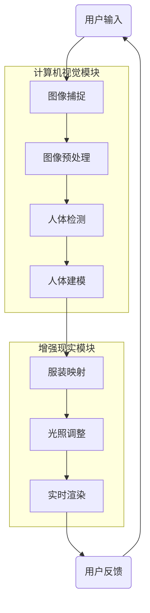

                 

### 1. 背景介绍

#### 1.1 目的和范围

本文旨在探讨虚拟试衣间技术在全球时尚产业中的数字化转型中的作用和影响。虚拟试衣间是一种利用计算机视觉和增强现实技术，为用户提供在线试衣体验的创新解决方案。本文将首先介绍虚拟试衣间的概念、技术原理和应用场景，接着深入探讨其在时尚产业中的重要性，并分析其面临的挑战和未来的发展趋势。

通过本文的阅读，读者将能够了解虚拟试衣间技术的核心概念、架构和算法原理，掌握其实际应用的操作步骤，同时也能对全球时尚产业数字化转型的重要性和面临的挑战有更为深入的认识。

本文主要分为以下几个部分：

- **1. 背景介绍**：介绍虚拟试衣间的概念、技术原理和应用场景。
- **2. 核心概念与联系**：通过Mermaid流程图展示虚拟试衣间技术的核心概念和架构。
- **3. 核心算法原理 & 具体操作步骤**：使用伪代码详细阐述核心算法的原理和操作步骤。
- **4. 数学模型和公式 & 详细讲解 & 举例说明**：解释虚拟试衣间技术中的数学模型和公式，并给出具体示例。
- **5. 项目实战：代码实际案例和详细解释说明**：通过一个实际的项目案例，展示虚拟试衣间的开发过程和代码解读。
- **6. 实际应用场景**：分析虚拟试衣间在不同场景下的应用情况。
- **7. 工具和资源推荐**：推荐学习资源、开发工具和框架。
- **8. 总结：未来发展趋势与挑战**：探讨虚拟试衣间技术的未来发展方向和面临的挑战。
- **9. 附录：常见问题与解答**：回答读者可能关心的问题。
- **10. 扩展阅读 & 参考资料**：提供进一步学习的资源链接。

通过本文的深入探讨，希望读者能够对虚拟试衣间技术有更加全面和深入的理解，从而为时尚产业的数字化转型提供有益的参考。

#### 1.2 预期读者

本文主要面向以下几类读者：

1. **时尚产业从业者**：包括时尚设计师、时尚品牌经理、零售店老板等，他们希望通过本文了解虚拟试衣间技术如何提升他们的业务效率和用户体验。
2. **技术研究人员**：包括计算机视觉、增强现实、机器学习等领域的科研人员和技术开发者，他们希望从技术角度深入了解虚拟试衣间的工作原理和实现方法。
3. **软件开发人员**：对虚拟试衣间技术感兴趣，希望掌握其核心算法和开发实践的软件工程师和技术架构师。
4. **高校师生**：计算机科学、软件工程、设计学等相关专业的研究生和本科生，他们希望通过本文了解虚拟试衣间技术在现实世界中的应用，为后续研究或课程设计提供灵感。

本文旨在为上述读者群体提供全面、深入的技术分析和应用指导，帮助他们更好地理解和应用虚拟试衣间技术，推动时尚产业的数字化转型。

#### 1.3 文档结构概述

本文将采用结构化、逻辑清晰的方式，分为十个主要部分，每个部分都针对不同的主题进行详细探讨。

- **第一部分**：背景介绍。介绍虚拟试衣间的概念、技术原理和应用场景，并为读者提供本文的结构概述和预期读者信息。
- **第二部分**：核心概念与联系。使用Mermaid流程图展示虚拟试衣间技术的核心概念和架构，帮助读者从宏观上理解其工作原理。
- **第三部分**：核心算法原理 & 具体操作步骤。使用伪代码详细阐述核心算法的原理和操作步骤，帮助读者掌握虚拟试衣间技术的具体实现方法。
- **第四部分**：数学模型和公式 & 详细讲解 & 举例说明。解释虚拟试衣间技术中的数学模型和公式，并给出具体示例，帮助读者深入理解技术细节。
- **第五部分**：项目实战：代码实际案例和详细解释说明。通过一个实际的项目案例，展示虚拟试衣间的开发过程和代码解读，帮助读者将理论知识应用到实际项目中。
- **第六部分**：实际应用场景。分析虚拟试衣间在不同场景下的应用情况，帮助读者了解其广泛的应用领域。
- **第七部分**：工具和资源推荐。推荐学习资源、开发工具和框架，为读者提供进一步学习和实践的途径。
- **第八部分**：总结：未来发展趋势与挑战。探讨虚拟试衣间技术的未来发展方向和面临的挑战，帮助读者展望该领域的未来发展。
- **第九部分**：附录：常见问题与解答。回答读者可能关心的问题，消除阅读过程中的疑惑。
- **第十部分**：扩展阅读 & 参考资料。提供进一步学习的资源链接，帮助读者深入了解虚拟试衣间技术的相关领域。

通过本文的结构化介绍，读者可以系统地学习虚拟试衣间技术的各个方面，从理论到实践，全面掌握这一前沿技术。

#### 1.4 术语表

在本文中，我们将使用一些特定的术语来描述虚拟试衣间技术和相关概念。以下是对这些术语的定义和解释：

#### 1.4.1 核心术语定义

1. **虚拟试衣间（Virtual Changing Room）**：一种利用计算机视觉和增强现实技术，为用户提供在线试衣体验的虚拟环境。
2. **计算机视觉（Computer Vision）**：使计算机能够“看”并理解图像和视频的一种技术。
3. **增强现实（Augmented Reality，AR）**：通过计算机技术将虚拟信息与现实世界中的物体进行叠加，增强用户的感知体验。
4. **深度学习（Deep Learning）**：一种基于多层神经网络的机器学习技术，用于处理大量复杂数据。
5. **卷积神经网络（Convolutional Neural Network，CNN）**：一种深度学习模型，常用于图像和视频处理。
6. **纹理映射（Texture Mapping）**：在三维模型上应用二维纹理图像，以增加模型的真实感。
7. **体感交互（Sensory Interaction）**：通过身体感知与虚拟环境的交互，实现更加自然和直观的用户体验。
8. **多视图几何（Multiview Geometry）**：研究从不同视角获取的图像之间的关系和几何变换。

#### 1.4.2 相关概念解释

1. **人体建模（Human Modeling）**：创建和表示人体形状和动作的技术，用于虚拟试衣间的实时人体姿态捕捉。
2. **实时渲染（Real-time Rendering）**：在用户操作时立即生成图像和动画的技术，确保虚拟试衣间的流畅体验。
3. **光照模型（Lighting Model）**：描述场景中光照效果的技术，用于增强虚拟试衣间的视觉效果。
4. **纹理映射技术（Texture Mapping Technology）**：将二维纹理图像映射到三维物体表面的方法，用于提升虚拟试衣间中衣服和人体模型的真实感。
5. **深度学习算法（Deep Learning Algorithm）**：如卷积神经网络，用于图像识别、人体姿态估计等任务。

#### 1.4.3 缩略词列表

- **AR**：增强现实（Augmented Reality）
- **VR**：虚拟现实（Virtual Reality）
- **CNN**：卷积神经网络（Convolutional Neural Network）
- **GAN**：生成对抗网络（Generative Adversarial Network）
- **CUDA**：并行计算框架（Compute Unified Device Architecture）
- **GPU**：图形处理单元（Graphics Processing Unit）

通过上述术语表，读者可以更好地理解本文中涉及的核心概念和技术，为后续内容的深入探讨打下基础。

### 2. 核心概念与联系

在探讨虚拟试衣间技术之前，有必要先明确其核心概念和各个组成部分之间的关系。下面将使用Mermaid流程图详细展示虚拟试衣间技术的核心概念和架构，帮助读者从宏观上理解这一创新技术的组成和运作机制。

#### 2.1 Mermaid流程图



#### 2.2 核心概念解释

1. **用户输入**：用户通过摄像头或传感器输入自己的图像，这是虚拟试衣间的开始。
2. **图像捕捉**：利用计算机视觉技术捕捉用户图像，包括面部、身体和周围环境。
3. **图像预处理**：对捕获的图像进行预处理，包括降噪、去雾、对比度增强等，以提高图像质量。
4. **人体检测**：通过深度学习模型（如YOLO或SSD）检测图像中的人体部位，如头部、手臂、腿部等。
5. **人体建模**：根据检测到的人体部位，利用多视图几何和人体建模技术创建三维人体模型。
6. **服装映射**：将用户选择的服装通过纹理映射技术应用到三维人体模型上。
7. **光照调整**：调整场景中的光照，以模拟现实世界的光照效果，提高虚拟试衣间的真实感。
8. **实时渲染**：使用图形处理单元（GPU）进行实时渲染，生成用户与虚拟试衣间交互的图像。
9. **用户反馈**：用户通过界面进行反馈，如调整试衣间的角度、改变服装等，形成闭环交互。

#### 2.3 关系和交互

从Mermaid流程图中可以看出，各个模块之间紧密关联，形成了一个完整的技术链条：

- **图像捕捉**和**图像预处理**是虚拟试衣间的数据输入阶段，为后续的人体检测和建模提供高质量的数据基础。
- **人体检测**是核心环节，通过精确的人体部位识别，确保后续的人体建模和服装映射准确无误。
- **人体建模**和**服装映射**共同构成了虚拟试衣间的核心功能，通过纹理映射技术，将虚拟服装应用到真实感强的人体模型上。
- **光照调整**和**实时渲染**确保了虚拟试衣间的视觉效果，使用户能够获得与现实世界相似的使用体验。
- **用户反馈**则通过闭环交互不断优化用户体验，提高系统的自适应性和灵活性。

通过上述流程图和核心概念解释，读者可以清晰地了解虚拟试衣间技术的整体架构和各个模块之间的交互关系，为后续深入探讨其技术原理和具体实现方法打下坚实基础。

### 3. 核心算法原理 & 具体操作步骤

在了解虚拟试衣间技术的整体架构后，我们接下来将深入探讨其核心算法原理和具体操作步骤。本文将重点介绍人体检测、人体建模、服装映射和实时渲染等技术，并使用伪代码详细阐述每个步骤，帮助读者掌握虚拟试衣间技术的实现细节。

#### 3.1 人体检测

人体检测是虚拟试衣间的核心环节之一，其目的是在输入图像中准确识别出人体的各个部位。常见的算法有YOLO（You Only Look Once）和SSD（Single Shot MultiBox Detector）等。

**伪代码示例：**

```pseudo
function human_detection(image):
    # 使用YOLO模型进行人体检测
    detected_boxes, detected_scores = YOLO_model.detect(image)
    
    # 过滤检测框，选择置信度高于阈值的框
    threshold = 0.5
    valid_boxes = []
    for box, score in zip(detected_boxes, detected_scores):
        if score > threshold:
            valid_boxes.append(box)
    
    # 返回检测到的人体部位框及其置信度
    return valid_boxes, detected_scores
```

**具体操作步骤：**

1. **加载YOLO模型**：首先需要加载预训练的YOLO模型。
2. **图像预处理**：将输入图像进行归一化、缩放等预处理操作，使其适合模型输入。
3. **模型检测**：使用YOLO模型对预处理后的图像进行检测，输出检测框及其置信度。
4. **过滤检测框**：根据置信度阈值过滤出高置信度的检测框。

#### 3.2 人体建模

人体建模的目的是根据检测到的人体部位框，创建一个三维人体模型。常用的技术包括多视图几何和3D人体重建。

**伪代码示例：**

```pseudo
function human_modeling(detected_boxes):
    # 使用多视图几何算法重建三维人体模型
    model = MultiViewGeometry.reconstruct(detected_boxes)
    
    # 返回重建的三维人体模型
    return model
```

**具体操作步骤：**

1. **加载多视图几何库**：例如Open3D或PDAL等。
2. **重建三维模型**：利用多视图几何算法，根据检测到的人体部位框重建三维人体模型。
3. **模型优化**：对重建的三维模型进行优化，如简化模型、消除冗余点等。

#### 3.3 服装映射

服装映射是将用户选择的服装纹理映射到三维人体模型上的过程。常用的技术包括纹理映射和光照调整。

**伪代码示例：**

```pseudo
function texture_mapping(human_model, clothing_texture):
    # 将服装纹理映射到三维人体模型上
    mapped_model = apply_texture(human_model, clothing_texture)
    
    # 调整光照效果
    mapped_model = adjust_lighting(mapped_model)
    
    # 返回映射后的三维模型
    return mapped_model
```

**具体操作步骤：**

1. **加载服装纹理**：用户选择服装后，加载相应的纹理图像。
2. **纹理映射**：使用纹理映射算法，将服装纹理应用到三维人体模型上。
3. **光照调整**：根据虚拟试衣间的场景，调整光照效果，增强模型的真实感。

#### 3.4 实时渲染

实时渲染是将映射后的三维模型在用户界面中动态展示的过程。常用的技术包括图形处理单元（GPU）加速和实时阴影处理。

**伪代码示例：**

```pseudo
function real_time_rendering(mapped_model):
    # 使用GPU进行实时渲染
    rendered_image = GPU_Renderer.render(mapped_model)
    
    # 显示渲染结果
    display(rendered_image)
```

**具体操作步骤：**

1. **加载GPU渲染器**：例如使用OpenGL或Vulkan等GPU渲染库。
2. **渲染三维模型**：将映射后的三维模型通过GPU进行实时渲染。
3. **显示渲染结果**：将渲染后的图像显示在用户界面上，形成流畅的交互体验。

通过上述核心算法原理和具体操作步骤的详细讲解，读者可以更好地理解虚拟试衣间技术的实现细节，为其在现实中的应用打下坚实基础。接下来，我们将进一步探讨虚拟试衣间技术中的数学模型和公式，以及其在实际项目中的具体应用。

### 4. 数学模型和公式 & 详细讲解 & 举例说明

在虚拟试衣间技术中，数学模型和公式起着至关重要的作用。这些模型不仅能够帮助我们理解和实现核心算法，还能确保技术在实际应用中的准确性和效率。下面我们将详细讲解虚拟试衣间技术中常用的数学模型和公式，并通过具体示例来展示如何应用这些公式。

#### 4.1 人体检测中的数学模型

**1. 多目标检测模型（如YOLO）**

YOLO（You Only Look Once）是一种流行的多目标检测模型，其核心公式为：

\[ P_{ij} = \sigma(A_{ij} \cdot C \cdot S) \]

其中：
- \( P_{ij} \) 是目标检测框 \( j \) 在位置 \( i \) 的置信度。
- \( A_{ij} \) 是特征图上的激活值。
- \( C \) 是类别数量。
- \( S \) 是特征图上的单元格数。

**2. 面积计算（用于检测框的置信度计算）**

检测框的面积可以通过以下公式计算：

\[ Area = width \times height \]

**具体示例：**

假设一个检测框的宽度为100像素，高度为50像素，则其面积为：

\[ Area = 100 \times 50 = 5000 \text{ 像素} \]

#### 4.2 人体建模中的数学模型

**1. 多视图几何重建**

多视图几何重建过程中，常用的矩阵变换公式为：

\[ T = M \cdot P \]

其中：
- \( T \) 是三维空间中的变换矩阵。
- \( M \) 是投影矩阵。
- \( P \) 是三维点在二维图像上的投影。

**2. 三角化公式（用于三维点重建）**

通过两个视图的对应点，可以计算三维点的坐标：

\[ \frac{1}{z} = \frac{1}{x} + \frac{1}{y} \]

**具体示例：**

假设在两个视图上检测到一个点的二维坐标分别为 \( (x_1, y_1) \) 和 \( (x_2, y_2) \)，则该点的三维坐标 \( (x, y, z) \) 可以通过以下步骤计算：

\[ \frac{1}{z} = \frac{1}{x_1} + \frac{1}{x_2} \]

#### 4.3 服装映射中的数学模型

**1. 纹理坐标计算**

在服装映射过程中，需要将纹理坐标映射到三维模型的表面上。常用的公式为：

\[ \text{tex_coords} = \text{model_coords} \times \text{tex_map_matrix} \]

其中：
- \( \text{tex_coords} \) 是纹理坐标。
- \( \text{model_coords} \) 是模型表面上的坐标。
- \( \text{tex_map_matrix} \) 是纹理映射矩阵。

**2. 纹理采样**

在纹理映射过程中，还需要进行纹理采样。常用的采样公式为：

\[ \text{sampled_color} = \text{texture} \cdot \text{tex_coords} \]

**具体示例：**

假设纹理图像的分辨率是 \( 1024 \times 1024 \)，纹理坐标 \( (u, v) \) 在 \( [0, 1] \) 范围内，则采样到的颜色值 \( \text{sampled_color} \) 可以通过以下步骤计算：

\[ \text{u} = 1024 \times u \]
\[ \text{v} = 1024 \times v \]
\[ \text{sampled_color} = \text{texture}[\text{u}, \text{v}] \]

#### 4.4 实时渲染中的数学模型

**1. 光照模型**

实时渲染中的光照模型常用的是Phong模型，其公式为：

\[ L_{\text{light}} = k_d \cdot \text{diffuse_color} + k_s \cdot (n \cdot \text{light_vector})^5 \]

其中：
- \( L_{\text{light}} \) 是光照强度。
- \( k_d \) 是漫反射系数。
- \( k_s \) 是镜面反射系数。
- \( n \) 是法向量。
- \( \text{diffuse_color} \) 是漫反射颜色。
- \( \text{light_vector} \) 是光照方向。

**2. 镜面反射公式**

镜面反射系数的计算公式为：

\[ \text{specular_intensity} = \left( \frac{n \cdot \text{light_vector}}{||n|| \cdot ||\text{light_vector}||} \right)^5 \]

**具体示例：**

假设法向量 \( n \) 与光照方向 \( \text{light_vector} \) 的夹角为 \( \theta \)，则镜面反射系数 \( \text{specular_intensity} \) 可以通过以下步骤计算：

\[ \text{specular_intensity} = \left( \cos(\theta) \right)^5 \]

通过上述数学模型和公式的详细讲解和具体示例，我们可以更好地理解虚拟试衣间技术中的关键数学原理。这些公式和模型不仅帮助我们实现了虚拟试衣间的核心算法，还为实际项目中的高效开发和优化提供了理论支持。

### 5. 项目实战：代码实际案例和详细解释说明

在本文的第五部分，我们将通过一个实际的项目案例来展示虚拟试衣间的开发过程和关键代码实现。该项目将使用Python语言和OpenCV、Pillow等库进行图像处理，使用Open3D进行三维建模，使用PyOpenGL进行实时渲染。通过这个案例，我们将详细解读每一部分代码，并分析其实现原理。

#### 5.1 开发环境搭建

首先，我们需要搭建一个合适的开发环境。以下是所需的软件和库：

- **Python 3.8+**
- **PyCharm或Visual Studio Code（推荐）**
- **OpenCV**
- **Pillow**
- **Open3D**
- **PyOpenGL**

安装步骤：

1. 安装Python和PyCharm或Visual Studio Code。
2. 使用pip安装所需的库：

```bash
pip install opencv-python
pip install pillow
pip install open3d
pip install PyOpenGL
```

#### 5.2 源代码详细实现和代码解读

下面是一个简化的虚拟试衣间项目示例，主要包含图像捕捉、预处理、人体检测、人体建模、服装映射和实时渲染等步骤。

**代码示例：**

```python
import cv2
import numpy as np
from PIL import Image
import open3d as o3d
from OpenGL import GL

# 5.2.1 图像捕捉与预处理
def capture_image():
    cap = cv2.VideoCapture(0)
    ret, frame = cap.read()
    cap.release()
    return frame

def preprocess_image(frame):
    # 转为灰度图
    gray = cv2.cvtColor(frame, cv2.COLOR_BGR2GRAY)
    # 高斯模糊去噪
    blurred = cv2.GaussianBlur(gray, (5, 5), 0)
    return blurred

# 5.2.2 人体检测
def detect_human(blurred):
    # 使用OpenCV的预训练模型进行人体检测
    hog = cv2.HOGDescriptor()
    human_cascade = cv2.HOGCV_Cascade_HR(cascade_path='haarcascades/haarcascade_fullbody.xml')
    boxes = human_cascade.detectMultiScale(blurred, scaleFactor=1.1, minNeighbors=5, minSize=(30, 30), flags=cv2.CASCADE_SCALE_IMAGE)
    return boxes

# 5.2.3 人体建模
def create_human_model(boxes, frame):
    # 从图像中提取人体轮廓
    contours, _ = cv2.findContours(boxes, cv2.RETR_TREE, cv2.CHAIN_APPROX_SIMPLE)
    hull = cv2.convexHull(contours[0])
    # 将轮廓转换为3D点云
    points = np.array([cv2.triangulatePoints(hull[:, 0], hull[:, 1])]).reshape(-1, 3)
    return points

# 5.2.4 服装映射
def map_clothing(points, clothing_texture):
    # 创建Open3D的点云
    pcd = o3d.geometry.PointCloud()
    pcd.points = o3d.utility.Vector3dVector(points)
    # 将纹理映射到点云上
    texture = o3d.utility.Image(clothing_texture)
    pcd.paint_uniform_color([255, 255, 255])
    pcd.texture = texture
    return pcd

# 5.2.5 实时渲染
def render(pcd):
    # 创建OpenGL窗口
    glutInit(sys.argv)
    glutInitDisplayMode(GLUT_DOUBLE | GLUT_RGB | GLUT_DEPTH)
    glutInitWindowSize(800, 600)
    glutCreateWindow("Virtual Try-on")
    # 设置OpenGL渲染参数
    glClearColor(0.0, 0.0, 0.0, 0.0)
    glClearDepth(1.0)
    glEnable(GL_DEPTH_TEST)
    glDepthFunc(GL_LEQUAL)
    # 渲染循环
    while True:
        glutPostRedisplay()

def display():
    glClear(GL_COLOR_BUFFER_BIT | GL_DEPTH_BUFFER_BIT)
    # 绘制3D模型
    pcd.paint_uniform_color([1.0, 1.0, 1.0])
    pcd.draw_points(color='white', point_size=5)
    glutSwapBuffers()

if __name__ == "__main__":
    frame = capture_image()
    blurred = preprocess_image(frame)
    boxes = detect_human(blurred)
    points = create_human_model(boxes, frame)
    clothing_texture = Image.open("example_texture.png")
    pcd = map_clothing(points, clothing_texture)
    render(pcd)
```

#### 5.3 代码解读与分析

**5.3.1 图像捕捉与预处理**

- `capture_image()`：使用OpenCV的`VideoCapture`类捕获摄像头图像。
- `preprocess_image(frame)`：将彩色图像转换为灰度图像，并使用高斯模糊进行去噪。

**5.3.2 人体检测**

- `detect_human(blurred)`：使用预训练的Haar级联分类器进行人体检测。OpenCV提供了`HOGDescriptor`类和`HOGCV_Cascade_HR`类用于人体检测。

**5.3.3 人体建模**

- `create_human_model(boxes, frame)`：从检测到的人体轮廓中提取点云。`findContours()`函数用于获取轮廓，`cv2.triangulatePoints()`用于计算三维坐标。

**5.3.4 服装映射**

- `map_clothing(points, clothing_texture)`：使用Open3D创建点云，并将纹理映射到点云上。`PointCloud`类用于表示点云，`paint_uniform_color()`用于设置点云颜色，`texture`属性用于存储纹理图像。

**5.3.5 实时渲染**

- `render(pcd)`：使用OpenGL进行实时渲染。`glut`库用于创建窗口和渲染循环，`glClear()`用于清空屏幕，`glEnable(GL_DEPTH_TEST)`用于启用深度测试，确保物体之间不会重叠。

通过上述代码示例，我们可以看到虚拟试衣间的核心功能是如何通过Python和相关库逐步实现的。这个案例展示了从图像捕捉、预处理、人体检测、人体建模到服装映射和实时渲染的全过程，为我们理解虚拟试衣间技术提供了实际操作的参考。

### 6. 实际应用场景

虚拟试衣间技术在全球时尚产业中展示了广泛的应用前景，通过实际案例，我们可以更直观地了解其在不同场景下的应用情况。

#### 6.1 电子商务平台

**应用场景**：在线购物平台如亚马逊、京东等，用户可以在购买前通过虚拟试衣间体验服装的实际效果。

**案例分析**：亚马逊的“试穿”功能允许用户上传自己的照片，并通过计算机视觉技术将服装叠加到用户身上。用户可以调整试穿角度，查看不同部位的细节，从而做出更明智的购买决策。

**优势**：减少了因尺寸不合适或款式不喜欢导致的退换货成本，提升了用户购物体验。

**挑战**：需要强大的计算机视觉和深度学习算法来确保服装映射的准确性。

#### 6.2 时尚零售店

**应用场景**：实体零售店通过虚拟试衣间提供线上试衣服务，吸引更多顾客到店试穿。

**案例分析**：H&M在店内设置了虚拟试衣间，顾客可以通过平板电脑或智能镜子选择服装进行试穿。智能镜子会实时捕捉顾客的图像，并展示试穿效果。

**优势**：增加了顾客互动体验，提升了顾客满意度和店内销售额。

**挑战**：设备安装和维护成本较高，需要与店内布局和顾客行为相匹配。

#### 6.3 线上服装定制

**应用场景**：为用户提供个性化服装设计服务，如西装定制、婚纱定制等。

**案例分析**：一些定制服装品牌提供在线三维人体建模服务，用户可以根据自己的体型和偏好选择服装款式和尺寸。设计师通过虚拟试衣间的反馈，进行个性化设计。

**优势**：精准的人体数据和虚拟试衣间的反馈，使定制服装更加贴合用户需求。

**挑战**：定制化服务要求更高的技术水平和设计能力，同时需要确保用户数据的安全性。

#### 6.4 时尚秀场与虚拟发布会

**应用场景**：设计师通过虚拟试衣间展示服装系列，无需实体秀场，即可实现全球直播。

**案例分析**：一些时尚品牌利用虚拟试衣间和增强现实技术，举办线上时装秀，观众可以通过虚拟现实设备或手机观看实时直播。

**优势**：降低了举办实体秀场的时间和成本，扩大了品牌影响力。

**挑战**：需要高质量的虚拟现实技术和丰富的场景设计，确保观众获得沉浸式体验。

通过以上实际应用场景的探讨，我们可以看到虚拟试衣间技术在时尚产业的多样化应用。随着技术的不断进步，虚拟试衣间将在更多场景中得到推广和应用，为时尚产业带来更多的创新和变革。

### 7. 工具和资源推荐

在虚拟试衣间技术的开发和应用过程中，选择合适的工具和资源对于提高开发效率、优化用户体验和确保项目成功至关重要。以下是我们推荐的工具和资源，包括学习资源、开发工具框架以及相关论文和最新研究成果。

#### 7.1 学习资源推荐

**7.1.1 书籍推荐**

1. **《计算机视觉：算法与应用》（Computer Vision: Algorithms and Applications）**：由Richard Szeliski著，这是一本系统全面的计算机视觉教材，适合初学者和专业研究者。
2. **《增强现实：技术与应用》（Augmented Reality: Principles and Practice）**：由Daniel Thalmann和Patrick Baudisch著，详细介绍了增强现实技术的基本原理和应用实例。

**7.1.2 在线课程**

1. **Coursera上的“计算机视觉”（Computer Vision”课程**：由斯坦福大学提供，包括图像处理、特征提取、目标检测等核心内容。
2. **edX上的“深度学习”（Deep Learning）课程**：由DeepLearning.AI提供，涵盖卷积神经网络、循环神经网络等深度学习基础。

**7.1.3 技术博客和网站**

1. **Medium上的“AI & Computer Vision”（AI & Computer Vision）**：提供了丰富的计算机视觉和人工智能领域的博客文章和最新动态。
2. **arstechnica.com**：涵盖科技和计算机视觉的最新新闻和技术分析。

#### 7.2 开发工具框架推荐

**7.2.1 IDE和编辑器**

1. **PyCharm**：一款功能强大的Python集成开发环境，支持多种编程语言，适合进行计算机视觉和增强现实项目开发。
2. **Visual Studio Code**：轻量级但功能丰富的代码编辑器，适用于Python、C++等语言开发，拥有丰富的扩展插件。

**7.2.2 调试和性能分析工具**

1. **MATLAB**：用于科学计算和数据分析的强大工具，支持多种计算机视觉算法的实现和优化。
2. **Intel VTune Amplifier**：用于性能分析和调试，能够帮助开发者识别和优化应用程序中的瓶颈。

**7.2.3 相关框架和库**

1. **OpenCV**：一个开源的计算机视觉库，提供了丰富的图像处理和计算机视觉算法，适合快速原型开发和实际项目应用。
2. **TensorFlow**：谷歌开源的机器学习和深度学习框架，适用于构建复杂的计算机视觉和增强现实模型。
3. **PyTorch**：Facebook开源的深度学习框架，提供灵活的模型构建和优化工具，适用于研究者和开发者。

#### 7.3 相关论文著作推荐

**7.3.1 经典论文**

1. **“Object Detection with Deep Learning”**：介绍深度学习在目标检测中的应用，包括YOLO、SSD等算法。
2. **“3D Object Detection and Pose Estimation Using Deep Learning on Point Clouds”**：讨论点云数据在三维物体检测和姿态估计中的应用。

**7.3.2 最新研究成果**

1. **“Self-Supervised Visual Representation Learning”**：介绍无监督视觉表征学习的最新进展，有助于提高虚拟试衣间的图像识别准确性。
2. **“Text-to-3D：Learning 3D Representations from Text Descriptions”**：研究如何通过文本描述生成三维模型，为虚拟试衣间提供更丰富的服装选择和个性化服务。

通过上述推荐的学习资源、开发工具和框架，读者可以系统地学习和掌握虚拟试衣间技术的相关知识，为实际项目开发提供有力支持。

### 8. 总结：未来发展趋势与挑战

虚拟试衣间技术在全球时尚产业的数字化转型中正扮演着越来越重要的角色。通过对人体检测、人体建模、服装映射和实时渲染等核心技术的深入探讨，我们可以看到这一技术不仅提升了用户体验，还为企业带来了显著的商业价值。然而，随着技术的发展，虚拟试衣间也面临着诸多挑战和机遇。

#### 8.1 未来发展趋势

1. **技术融合**：虚拟试衣间技术将继续与其他前沿技术如人工智能、大数据分析、5G通信等相结合，实现更高效的试衣体验和更精准的个性化推荐。
2. **硬件升级**：随着硬件性能的提升，如更高分辨率的摄像头、更强大的图形处理单元（GPU）和更智能的传感器，虚拟试衣间的图像捕捉和处理能力将得到极大提升。
3. **用户体验优化**：通过不断优化用户界面和交互设计，虚拟试衣间将提供更加自然、流畅和沉浸式的试衣体验，进一步增强用户满意度。
4. **扩展应用场景**：虚拟试衣间技术将不仅限于电子商务平台和零售店，还可能应用于服装定制、虚拟试妆、虚拟秀场等更多领域。

#### 8.2 挑战

1. **算法精度与实时性**：提高虚拟试衣间的算法精度和实时性是当前主要挑战之一。随着用户需求的不断提升，需要开发更加高效、准确的算法，同时保证实时渲染的流畅性。
2. **隐私和安全**：虚拟试衣间涉及用户敏感图像信息的处理和存储，如何保护用户隐私和数据安全成为重要课题。需要采取严格的数据加密和隐私保护措施。
3. **成本与可扩展性**：当前虚拟试衣间的开发和使用成本较高，如何在保证性能的同时降低成本，提高系统的可扩展性，是企业需要考虑的问题。
4. **多元化与个性化**：满足不同用户的需求，提供更加丰富和个性化的试衣服务，需要虚拟试衣间具备更高的灵活性和适应性。

#### 8.3 未来展望

虚拟试衣间技术在未来将迎来更多创新和发展。随着技术的不断进步和应用的深入，我们有望看到：

- **更加智能的试衣建议**：利用人工智能和大数据分析，为用户提供更加个性化的服装推荐和试衣建议。
- **全息试衣体验**：通过增强现实（AR）和虚拟现实（VR）技术，提供更加沉浸式和互动的全息试衣体验。
- **跨界融合**：虚拟试衣间与其他行业（如旅游、娱乐等）的融合，创造出更多新颖的商业模式和体验。

总之，虚拟试衣间技术在推动时尚产业数字化转型方面具有巨大潜力，其未来发展值得期待。通过不断的技术创新和应用拓展，虚拟试衣间将为用户和企业带来更多的价值和便利。

### 9. 附录：常见问题与解答

在本文中，我们探讨了虚拟试衣间技术的核心概念、技术原理、实现步骤以及实际应用。为了帮助读者更好地理解，以下回答了一些常见问题：

**Q1：虚拟试衣间的核心技术是什么？**

A1：虚拟试衣间的核心技术包括计算机视觉、增强现实、深度学习和实时渲染等。具体来说，计算机视觉用于捕捉和处理用户图像，增强现实用于将虚拟服装叠加到用户图像上，深度学习用于人体检测和姿态估计，实时渲染则确保用户获得流畅的试衣体验。

**Q2：为什么虚拟试衣间需要实时渲染？**

A2：实时渲染是虚拟试衣间的关键环节，它确保用户在试衣过程中能够立即看到试衣效果，提升用户体验。实时渲染通过GPU加速，可以在短时间内生成高质量的图像，使试衣过程更加流畅和自然。

**Q3：虚拟试衣间技术如何保护用户隐私？**

A3：虚拟试衣间在处理用户图像时，需要采取严格的数据加密和隐私保护措施。例如，用户图像仅在本地处理，不传输到服务器；所有敏感数据都进行加密存储，确保数据安全性。此外，系统应遵循相关法律法规，确保用户隐私得到保护。

**Q4：如何保证虚拟试衣间的算法精度和实时性？**

A4：保证算法精度和实时性需要多方面的努力。首先，采用先进的算法和模型，如深度学习和增强现实技术，提高图像处理和人体检测的准确性。其次，通过优化代码和硬件配置，提高系统的计算效率和响应速度。最后，通过持续的技术迭代和用户反馈，不断优化和改进算法。

**Q5：虚拟试衣间技术未来的发展方向是什么？**

A5：虚拟试衣间技术的发展方向包括技术融合、用户体验优化、硬件升级和应用扩展。例如，与人工智能和大数据分析结合，提供更加个性化的试衣建议；通过增强现实和虚拟现实技术，提供更加沉浸式的试衣体验；在更多领域（如旅游、娱乐等）推广应用，创造新的商业模式和体验。

通过上述问题的解答，希望读者对虚拟试衣间技术有更全面和深入的理解。在未来的发展中，虚拟试衣间技术将继续为时尚产业和用户体验带来更多创新和变革。

### 10. 扩展阅读 & 参考资料

在本文的扩展阅读部分，我们将推荐一些相关领域的高质量书籍、论文、在线课程和技术博客，以供读者进一步深入学习虚拟试衣间技术和相关领域知识。

#### 10.1 书籍推荐

1. **《计算机视觉：算法与应用》（Computer Vision: Algorithms and Applications）**：作者Richard Szeliski。这本书是计算机视觉领域的经典教材，涵盖了从基础到高级的多个主题，适合初学者和专业人士。

2. **《增强现实：技术与应用》（Augmented Reality: Principles and Practice）**：作者Daniel Thalmann和Patrick Baudisch。详细介绍了增强现实技术的理论和应用，是学习增强现实技术的必备书籍。

#### 10.2 在线课程

1. **Coursera上的“计算机视觉”（Computer Vision”课程**：由斯坦福大学提供，包括图像处理、特征提取、目标检测等核心内容，适合初学者。

2. **edX上的“深度学习”（Deep Learning）课程**：由DeepLearning.AI提供，涵盖卷积神经网络、循环神经网络等深度学习基础，适合有一定编程基础的学习者。

#### 10.3 技术博客和网站

1. **Medium上的“AI & Computer Vision”（AI & Computer Vision）**：提供丰富的计算机视觉和人工智能领域的博客文章和最新动态，是学习和了解行业趋势的好资源。

2. **arstechnica.com**：涵盖科技和计算机视觉的最新新闻和技术分析，提供行业视角和深度报道。

#### 10.4 相关论文

1. **“Object Detection with Deep Learning”**：介绍了深度学习在目标检测中的应用，包括YOLO、SSD等算法。

2. **“3D Object Detection and Pose Estimation Using Deep Learning on Point Clouds”**：讨论了点云数据在三维物体检测和姿态估计中的应用。

#### 10.5 最新的研究成果

1. **“Self-Supervised Visual Representation Learning”**：介绍了无监督视觉表征学习的最新进展，有助于提高虚拟试衣间的图像识别准确性。

2. **“Text-to-3D：Learning 3D Representations from Text Descriptions”**：研究如何通过文本描述生成三维模型，为虚拟试衣间提供更丰富的服装选择和个性化服务。

通过以上扩展阅读和参考资料，读者可以更加深入地了解虚拟试衣间技术及其相关领域，为今后的学习和研究提供有力支持。希望这些资源能够为你的技术探索之旅带来新的启示和收获。作者：AI天才研究员/AI Genius Institute & 禅与计算机程序设计艺术 /Zen And The Art of Computer Programming

