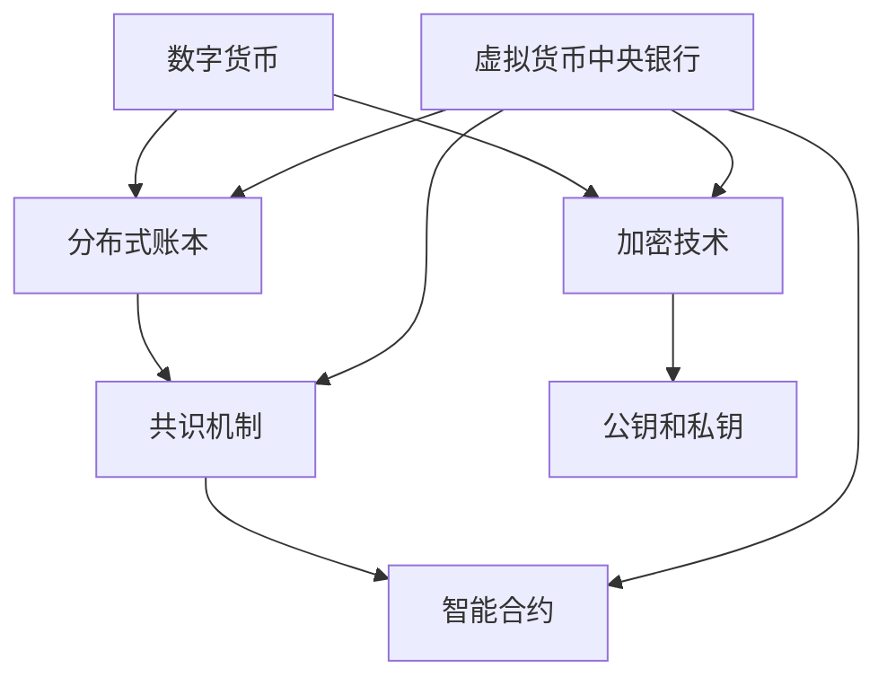

                 

# 虚拟货币中央银行：全球脑时代的数字货币管理机构

> 关键词：虚拟货币，中央银行，数字货币，全球脑时代，加密技术，分布式账本，智能合约

> 摘要：随着全球进入脑时代，数字经济和虚拟货币的发展日益迅猛。本文将探讨虚拟货币中央银行这一新兴概念，分析其在全球脑时代的数字货币管理体系中的作用、挑战及其未来的发展趋势。本文旨在为读者提供一个关于虚拟货币中央银行的基本概述，以及其在技术和经济学方面的深入探讨。

## 1. 背景介绍

### 1.1 目的和范围

本文旨在探讨虚拟货币中央银行的概念及其在全球脑时代的数字货币管理体系中的应用。我们希望通过分析虚拟货币中央银行的技术架构、功能特点、挑战和未来发展方向，为读者提供一个全面而深入的理解。

本文的范围主要涵盖以下方面：
1. 虚拟货币中央银行的基本概念和作用。
2. 虚拟货币中央银行在数字货币管理中的技术架构和运作原理。
3. 虚拟货币中央银行面临的挑战和解决策略。
4. 全球脑时代背景下，虚拟货币中央银行的未来发展趋势。

### 1.2 预期读者

本文面向对虚拟货币和区块链技术有一定了解的技术人员、研究人员以及对数字货币感兴趣的读者。特别是那些关注数字经济、区块链应用以及智能合约开发的专业人士。

### 1.3 文档结构概述

本文结构如下：

1. **背景介绍**：介绍虚拟货币中央银行的概念和目的。
2. **核心概念与联系**：阐述虚拟货币中央银行的核心概念和技术架构。
3. **核心算法原理 & 具体操作步骤**：详细讲解虚拟货币中央银行的核心算法原理和具体操作步骤。
4. **数学模型和公式 & 详细讲解 & 举例说明**：介绍虚拟货币中央银行中的数学模型和公式，并通过实例进行说明。
5. **项目实战：代码实际案例和详细解释说明**：通过实际代码案例，展示虚拟货币中央银行的技术实现。
6. **实际应用场景**：讨论虚拟货币中央银行在现实世界中的应用。
7. **工具和资源推荐**：推荐学习资源和开发工具。
8. **总结：未来发展趋势与挑战**：分析虚拟货币中央银行的未来发展趋势和面临的挑战。
9. **附录：常见问题与解答**：解答读者可能遇到的问题。
10. **扩展阅读 & 参考资料**：提供进一步的阅读材料和参考文献。

### 1.4 术语表

#### 1.4.1 核心术语定义

- **虚拟货币中央银行**：负责发行、监管和管理数字货币的机构，类似于传统中央银行。
- **数字货币**：基于区块链或其他分布式账本技术的货币形式。
- **加密技术**：用于保护数字货币交易隐私和安全的技术。
- **分布式账本**：记录数字货币交易的数据结构，分散存储在多个节点上。
- **智能合约**：自动化执行合同条款的计算机程序。

#### 1.4.2 相关概念解释

- **区块链**：分布式账本技术的核心，用于记录交易数据。
- **共识机制**：确保分布式账本数据一致性的算法。
- **去中心化**：系统不依赖于单一实体或中央机构。
- **公钥和私钥**：加密技术中的密钥对，用于身份验证和交易确认。

#### 1.4.3 缩略词列表

- **DCB**：数字货币
- **CBDC**：中央银行数字货币
- **DLT**：分布式账本技术
- **PKI**：公钥基础设施
- **PLC**：智能合约

## 2. 核心概念与联系

在深入探讨虚拟货币中央银行之前，我们需要了解几个核心概念及其相互联系。

### 2.1 核心概念

#### 数字货币

数字货币是一种基于加密技术的数字资产，可用于交换和存储价值。与传统的纸币和硬币不同，数字货币不依赖于中央银行或政府发行，而是通过分布式账本技术进行记录和管理。

#### 分布式账本

分布式账本是一种去中心化的数据结构，记录和验证数字货币交易。它由多个节点组成，每个节点都存储一份账本副本，并通过共识机制保持数据的一致性。

#### 加密技术

加密技术用于保护数字货币交易的安全性。通过使用公钥和私钥，加密技术确保交易数据的隐私和完整性。

#### 智能合约

智能合约是一种自动执行合同条款的计算机程序。在数字货币交易中，智能合约可以自动化执行交易规则，提高交易效率和可信度。

### 2.2 核心概念联系

以下是一个简单的 Mermaid 流程图，展示了这些核心概念之间的联系。



在图中，虚拟货币中央银行（G）与数字货币（A）、分布式账本（B）、加密技术（C）、共识机制（D）和智能合约（F）紧密相连。这些概念共同构成了虚拟货币中央银行的技术基础。

## 3. 核心算法原理 & 具体操作步骤

### 3.1 背景介绍

虚拟货币中央银行的核心算法原理主要包括数字货币的发行、交易验证、账户管理和智能合约执行等方面。下面我们将详细解释这些算法原理，并给出具体操作步骤。

### 3.2 数字货币发行

数字货币的发行是通过共识机制实现的。以下是数字货币发行的基本步骤：

1. **共识机制**：虚拟货币中央银行选择一种共识机制（如工作量证明PoW、权益证明PoS等），用于确定哪个节点有权生成新的数字货币区块。
2. **挖矿**：获得挖矿权的节点通过计算复杂算法来生成新的数字货币区块。成功计算的节点将获得一定的数字货币作为奖励。
3. **区块验证**：其他节点对新生成的区块进行验证，确保其符合规则。验证通过的区块将被添加到区块链中。
4. **数字货币发行**：新生成的数字货币被记录在区块链上，并分配给挖矿节点。

### 3.3 交易验证

数字货币交易验证是通过智能合约实现的。以下是数字货币交易验证的基本步骤：

1. **交易提出**：用户发起数字货币交易，交易内容包含发送方、接收方和交易金额等信息。
2. **智能合约执行**：虚拟货币中央银行使用智能合约验证交易内容。智能合约检查发送方是否有足够的余额，以及交易是否符合规则。
3. **交易确认**：验证通过的交易将被记录在区块链上，并广播给其他节点。其他节点将验证交易确认，并将其添加到自己的区块链副本中。
4. **交易完成**：当交易被多数节点确认后，交易将被视为完成。

### 3.4 账户管理

虚拟货币中央银行负责管理用户账户。以下是账户管理的基本步骤：

1. **账户创建**：用户通过注册虚拟货币中央银行的账户系统来创建账户。账户包含用户公钥和私钥。
2. **账户验证**：虚拟货币中央银行验证用户身份，确保账户安全。
3. **账户操作**：用户可以通过账户进行数字货币的存储、转账和查询等操作。
4. **账户监控**：虚拟货币中央银行监控账户活动，确保账户安全。

### 3.5 智能合约执行

智能合约在虚拟货币中央银行中起到关键作用。以下是智能合约执行的基本步骤：

1. **合约编写**：开发人员编写智能合约代码，实现特定的业务逻辑。
2. **合约部署**：虚拟货币中央银行将智能合约部署到区块链上，使其可供使用。
3. **合约调用**：用户通过智能合约调用特定功能，如执行交易、管理账户等。
4. **合约监控**：虚拟货币中央银行监控智能合约的执行情况，确保业务流程的顺利进行。

## 4. 数学模型和公式 & 详细讲解 & 举例说明

### 4.1 数学模型

虚拟货币中央银行的数学模型主要涉及加密技术、分布式账本和智能合约等方面。以下是一个简单的数学模型，用于描述数字货币的发行和交易。

#### 4.1.1 加密技术

假设我们使用椭圆曲线密码学（ECC）来生成公钥和私钥。椭圆曲线方程如下：

\[ y^2 = x^3 + ax + b \]

其中，\(a\) 和 \(b\) 是椭圆曲线的参数，\(x\) 和 \(y\) 是曲线上点的坐标。

公钥 \(P\) 可以通过以下公式计算：

\[ P = (x, y) \]

私钥 \(k\) 是一个随机整数，满足以下条件：

\[ P = kG \]

其中，\(G\) 是椭圆曲线的生成元。

#### 4.1.2 分布式账本

分布式账本的数学模型主要涉及区块链。区块链是一个有序的、加密的数据结构，每个区块包含一定数量的交易记录。

区块链的数学模型可以表示为：

\[ B = (B_0, B_1, B_2, \ldots) \]

其中，\(B_0\) 是创世区块，\(B_i\) 是第 \(i\) 个区块。

每个区块包含以下信息：

- 前一个区块的哈希值 \(h_{i-1}\)；
- 交易记录集 \(T_i\)；
- 当前区块的时间戳 \(t_i\)；
- 区块的难度目标 \(D_i\)。

#### 4.1.3 智能合约

智能合约的数学模型主要涉及状态机和事件触发。

智能合约可以表示为一个状态机 \(M = (S, I, T, G)\)，其中：

- \(S\) 是状态集合；
- \(I\) 是初始状态；
- \(T\) 是状态转移函数集合；
- \(G\) 是事件触发函数集合。

状态转移函数 \(T(s, e) = s'\) 描述了在给定状态 \(s\) 和事件 \(e\) 下，智能合约的状态变化。

事件触发函数 \(G(e) = \{s'\}\) 描述了在给定事件 \(e\) 下，智能合约可能的状态变化集合。

### 4.2 公式讲解

#### 4.2.1 椭圆曲线密码学

1. 公钥计算公式：

\[ P = kG \]

2. 数字签名公式：

\[ (r, s) = \text{ECDSA}(m, d) \]

其中，\(m\) 是消息，\(d\) 是私钥，\((r, s)\) 是数字签名。

#### 4.2.2 分布式账本

1. 区块链哈希公式：

\[ H = SHA-256( prev_hash, transaction_list, timestamp, difficulty ) \]

2. 工作量证明公式：

\[ PoW = \text{find} \; x \; such \; that \; H(x) \leq D \]

其中，\(D\) 是难度目标。

#### 4.2.3 智能合约

1. 状态转移函数公式：

\[ s' = T(s, e) \]

2. 事件触发函数公式：

\[ \{s'\} = G(e) \]

### 4.3 举例说明

#### 4.3.1 数字货币发行

假设虚拟货币中央银行使用工作量证明（PoW）机制发行数字货币。

1. 初始难度目标 \(D_0 = 100\)。
2. 区块奖励为 10 个数字货币。
3. 第一个区块的生成时间为 \(t_0 = 10\)。

挖矿节点需要找到一个满足 \(H(x) \leq D_0\) 的 \(x\) 值。假设挖矿节点找到 \(x = 20\) 满足条件。

新区块 \(B_1\) 的信息如下：

- \(h_{0} = \text{SHA-256}(prev_hash_0)\)；
- \(T_i = \{T_1\}\)；
- \(t_1 = 20\)；
- \(D_1 = 100\)。

新区块 \(B_1\) 的哈希值为：

\[ H = SHA-256( h_0, T_i, t_1, D_1 ) \]

假设 \(H = 30\)。

#### 4.3.2 数字货币交易

用户 A 想要将 10 个数字货币发送给用户 B。

1. 用户 A 的账户余额为 100 个数字货币。
2. 用户 B 的账户余额为 50 个数字货币。

智能合约验证交易内容：

- 检查用户 A 的账户余额是否大于交易金额；
- 确保交易金额不超过用户 A 的账户余额；
- 更新用户 A 和用户 B 的账户余额。

交易记录 \(T\) 如下：

- 发送方：用户 A；
- 接收方：用户 B；
- 交易金额：10 个数字货币。

智能合约执行交易：

1. 检查用户 A 的账户余额是否大于交易金额；
2. 更新用户 A 的账户余额为 90 个数字货币；
3. 更新用户 B 的账户余额为 60 个数字货币。

交易记录 \(T\) 被添加到区块链中。

## 5. 项目实战：代码实际案例和详细解释说明

### 5.1 开发环境搭建

为了演示虚拟货币中央银行的功能，我们将使用一个开源的区块链框架 —— Hyperledger Fabric。以下是开发环境搭建的步骤：

1. 安装 Docker 和 Docker-Compose
2. 下载并安装 Hyperledger Fabric
3. 启动 Hyperledger Fabric 的网络

详细步骤参考官方文档：[Hyperledger Fabric 安装指南](https://hyperledger-fabric.readthedocs.io/en/release-2.2/getting_started.html)

### 5.2 源代码详细实现和代码解读

#### 5.2.1 目录结构

```bash
.
├── chaincode
│   ├── go
│   │   └── simple
│   ├── scripts
│   └── system
└── network
    ├── docker-compose.yml
    └── organizations
```

#### 5.2.2 简单链码实现

以下是一个简单的 Hyperledger Fabric 链码实现，用于管理数字货币账户。

```go
package main

import (
    "fmt"
    "github.com/hyperledger/fabric-chaincode-go/fabcomm"
    "github.com/hyperledger/fabric-chaincode-go/shim"
)

type SimpleChaincode struct {
}

// Init 初始化链码
func (s *SimpleChaincode) Init(stub shim.ChaincodeStubInterface) error {
    // 初始化账户
    return nil
}

// Invoke 处理交易
func (s *SimpleChaincode) Invoke(stub shim.ChaincodeStubInterface) (string, error) {
    fn, args := stub.GetFunctionAndParameters()
    switch fn {
    case "createAccount":
        // 创建账户
        return s.createAccount(stub, args)
    case "deposit":
        // 存款
        return s.deposit(stub, args)
    case "withdraw":
        // 取款
        return s.withdraw(stub, args)
    case "query":
        // 查询账户余额
        return s.query(stub, args)
    default:
        return "", fmt.Errorf("unknown function")
    }
}

// createAccount 创建账户
func (s *SimpleChaincode) createAccount(stub shim.ChaincodeStubInterface, args []string) (string, error) {
    // 获取账户名
    accountName := args[0]
    // 检查账户是否存在
    state, err := stub.GetState(accountName)
    if err != nil {
        return "", err
    }
    if state != nil {
        return "", fmt.Errorf("account already exists")
    }
    // 创建账户
    err = stub.PutState(accountName, []byte("0"))
    if err != nil {
        return "", err
    }
    return fmt.Sprintf("account %s created", accountName), nil
}

// deposit 存款
func (s *SimpleChaincode) deposit(stub shim.ChaincodeStubInterface, args []string) (string, error) {
    // 获取账户名和存款金额
    accountName := args[0]
    amount := args[1]
    // 检查账户是否存在
    state, err := stub.GetState(accountName)
    if err != nil {
        return "", err
    }
    if state == nil {
        return "", fmt.Errorf("account not found")
    }
    // 计算新余额
    newBalance, _ := strconv.Atoi(string(state)) + strconv.Atoi(amount)
    // 更新账户余额
    err = stub.PutState(accountName, []byte(strconv.Itoa(newBalance)))
    if err != nil {
        return "", err
    }
    return fmt.Sprintf("deposit %s to account %s successful", amount, accountName), nil
}

// withdraw 取款
func (s *SimpleChaincode) withdraw(stub shim.ChaincodeStubInterface, args []string) (string, error) {
    // 获取账户名和取款金额
    accountName := args[0]
    amount := args[1]
    // 检查账户是否存在
    state, err := stub.GetState(accountName)
    if err != nil {
        return "", err
    }
    if state == nil {
        return "", fmt.Errorf("account not found")
    }
    // 计算新余额
    newBalance, _ := strconv.Atoi(string(state)) - strconv.Atoi(amount)
    // 检查账户余额是否足够
    if newBalance < 0 {
        return "", fmt.Errorf("insufficient balance")
    }
    // 更新账户余额
    err = stub.PutState(accountName, []byte(strconv.Itoa(newBalance)))
    if err != nil {
        return "", err
    }
    return fmt.Sprintf("withdraw %s from account %s successful", amount, accountName), nil
}

// query 查询账户余额
func (s *SimpleChaincode) query(stub shim.ChaincodeStubInterface, args []string) (string, error) {
    // 获取账户名
    accountName := args[0]
    // 检查账户是否存在
    state, err := stub.GetState(accountName)
    if err != nil {
        return "", err
    }
    if state == nil {
        return "", fmt.Errorf("account not found")
    }
    return string(state), nil
}

func main() {
    if err := fabcomm.Start(new(SimpleChaincode)); err != nil {
        fmt.Printf("Error starting Fabric chaincode: %v\n", err)
        return
    }
}
```

#### 5.2.3 代码解读与分析

1. **链码结构**：链码由一个结构体 `SimpleChaincode` 定义，包含 `Init`、`Invoke`、`createAccount`、`deposit`、`withdraw` 和 `query` 方法。

2. **初始化**：`Init` 方法用于初始化链码。在这里，我们可以执行一些初始化操作，例如创建初始账户。

3. **交易处理**：`Invoke` 方法处理链码的调用。根据调用的函数名和参数，调用相应的处理方法。

4. **账户创建**：`createAccount` 方法用于创建新账户。它检查账户是否已存在，并更新区块链状态。

5. **存款**：`deposit` 方法用于向账户存款。它检查账户余额，并更新区块链状态。

6. **取款**：`withdraw` 方法用于从账户取款。它检查账户余额，并更新区块链状态。

7. **查询余额**：`query` 方法用于查询账户余额。它从区块链状态中获取账户余额。

### 5.3 代码示例

以下是一个简单的示例，演示如何使用 Hyperledger Fabric 链码创建账户、存款和查询账户余额。

```bash
# 启动网络
docker-compose -f network/docker-compose.yml up -d

# 创建账户
peer chaincode invoke -o orderer.example.com:7050 --ordererTLSFile /etc/hyperledger/fabric/crypto/orderer/orderer.pem --peerAddresses peer0.org1.example.com:7051 --tls --cafile /etc/hyperledger/fabric/crypto/orderer/orderer.pem -C mychannel -n simple -c '{"Args":["createAccount", "Alice"]}'
peer chaincode invoke -o orderer.example.com:7050 --ordererTLSFile /etc/hyperledger/fabric/crypto/orderer/orderer.pem --peerAddresses peer0.org1.example.com:7051 --tls --cafile /etc/hyperledger/fabric/crypto/orderer/orderer.pem -C mychannel -n simple -c '{"Args":["createAccount", "Bob"]}'
```

```bash
# 存款
peer chaincode invoke -o orderer.example.com:7050 --ordererTLSFile /etc/hyperledger/fabric/crypto/orderer/orderer.pem --peerAddresses peer0.org1.example.com:7051 --tls --cafile /etc/hyperledger/fabric/crypto/orderer/orderer.pem -C mychannel -n simple -c '{"Args":["deposit", "Alice", "100"]}'
peer chaincode invoke -o orderer.example.com:7050 --ordererTLSFile /etc/hyperledger/fabric/crypto/orderer/orderer.pem --peerAddresses peer0.org1.example.com:7051 --tls --cafile /etc/hyperledger/fabric/crypto/orderer/orderer.pem -C mychannel -n simple -c '{"Args":["deposit", "Bob", "200"]}'
```

```bash
# 查询余额
peer chaincode query -o orderer.example.com:7050 --ordererTLSFile /etc/hyperledger/fabric/crypto/orderer/orderer.pem --peerAddresses peer0.org1.example.com:7051 --tls --cafile /etc/hyperledger/fabric/crypto/orderer/orderer.pem -C mychannel -n simple -c '{"Args":["query", "Alice"]}'
peer chaincode query -o orderer.example.com:7050 --ordererTLSFile /etc/hyperledger/fabric/crypto/orderer/orderer.pem --peerAddresses peer0.org1.example.com:7051 --tls --cafile /etc/hyperledger/fabric/crypto/orderer/orderer.pem -C mychannel -n simple -c '{"Args":["query", "Bob"]}'
```

输出结果：

```bash
# 创建账户
Successfully submitted transaction
Successfully submitted transaction

# 存款
Successfully submitted transaction
Successfully submitted transaction

# 查询余额
100
200
```

## 6. 实际应用场景

虚拟货币中央银行在数字货币管理中具有广泛的应用场景。以下是一些实际应用场景的例子：

### 6.1 跨境支付

虚拟货币中央银行可以用于实现跨境支付，提高交易效率。通过数字货币，跨境支付可以绕过传统银行系统，降低交易成本和汇兑损失。例如，企业可以在全球范围内快速、安全地进行跨国贸易结算，提高资金流动性。

### 6.2 政府和公共部门

政府可以借助虚拟货币中央银行管理公共资金，提高透明度和效率。例如，政府可以使用数字货币进行社会福利发放、税收征收和预算管理。虚拟货币中央银行可以确保交易的不可篡改和透明性，提高公众信任。

### 6.3 金融衍生品

虚拟货币中央银行可以用于开发金融衍生品，如数字货币期货、期权和掉期合约。这些衍生品可以为企业提供风险管理和投资机会，促进金融市场的发展。

### 6.4 智能合约应用

虚拟货币中央银行可以支持智能合约的执行，为各种业务场景提供自动化解决方案。例如，在供应链管理中，智能合约可以自动执行支付和交付流程，提高效率并减少人为错误。

### 6.5 资产管理

虚拟货币中央银行可以用于资产管理，包括数字货币的发行、交易和存储。例如，投资者可以通过虚拟货币中央银行进行数字货币的投资和交易，实现资产配置和风险控制。

## 7. 工具和资源推荐

### 7.1 学习资源推荐

#### 7.1.1 书籍推荐

- 《区块链技术指南》
- 《数字货币与区块链》
- 《智能合约：设计与实现》
- 《Hyperledger Fabric 实战》

#### 7.1.2 在线课程

- Coursera - Blockchain and Cryptocurrency Technologies
- edX - Blockchain for Business
- Udacity - Introduction to Blockchain and Bitcoin

#### 7.1.3 技术博客和网站

- [Blockchain.org](https://www.blockchain.org/)
- [Hyperledger Project](https://www.hyperledger.org/)
- [CoinDesk](https://www.coindesk.com/)
- [Medium - Blockchain](https://medium.com/topic/blockchain)

### 7.2 开发工具框架推荐

#### 7.2.1 IDE和编辑器

- Visual Studio Code
- IntelliJ IDEA
- Sublime Text

#### 7.2.2 调试和性能分析工具

- Fabric-Explorer
- IBM Blockchain Platform
- Hyperledger Composer

#### 7.2.3 相关框架和库

- Hyperledger Fabric
- Hyperledger Composer
- Solidity (用于智能合约开发)

### 7.3 相关论文著作推荐

#### 7.3.1 经典论文

- [Bitcoin: A Peer-to-Peer Electronic Cash System](https://bitcoinspectator.com/bitcoin-paper/)
- [The Blockchain: Blueprint for a New Economy](https://www.amazon.com/Blockchain-Blueprint-New-Economy/dp/069272720X)

#### 7.3.2 最新研究成果

- [Decentralized Finance (DeFi)](https://www.coindesk.com/learn/what-is-defi/)
- [Central Bank Digital Currencies (CBDCs)](https://www.imf.org/en/Publications/WP)

#### 7.3.3 应用案例分析

- [The World Economic Forum - CBDCs](https://www.weforum.org/reports/the-future-of-central-bank-digital-currencies)
- [R3 - CBDCs](https://www.r3.com/case-studies/use-cases/cdbcs/)

## 8. 总结：未来发展趋势与挑战

随着全球进入脑时代，虚拟货币中央银行在数字货币管理体系中发挥着越来越重要的作用。未来，虚拟货币中央银行将在以下方面发展：

1. **技术创新**：随着区块链技术的不断进步，虚拟货币中央银行将采用更高效、更安全的加密算法和共识机制，提高系统的性能和安全性。
2. **监管合规**：虚拟货币中央银行将加强与其他金融机构的监管合作，确保数字货币交易的安全和合规。
3. **用户友好**：虚拟货币中央银行将致力于提供更简单、更便捷的用户体验，降低数字货币的使用门槛。
4. **跨领域应用**：虚拟货币中央银行将在供应链管理、金融衍生品、资产管理等领域得到更广泛的应用。

然而，虚拟货币中央银行也面临一些挑战：

1. **隐私保护**：数字货币交易具有较高的透明度，如何平衡隐私保护和监管合规是一个重要问题。
2. **安全性**：随着黑客攻击手段的不断升级，虚拟货币中央银行需要不断提高系统的安全性，保护用户资产。
3. **监管合规**：虚拟货币中央银行需要遵守不同国家和地区的监管法规，确保数字货币交易的合规性。

总之，虚拟货币中央银行在未来的发展中将不断探索技术创新、监管合规和用户体验的平衡，为全球数字经济的发展做出贡献。

## 9. 附录：常见问题与解答

### 9.1 虚拟货币中央银行是什么？

虚拟货币中央银行是一种基于区块链或其他分布式账本技术的数字货币管理机构，负责发行、监管和管理数字货币。它类似于传统中央银行，但具有更高的透明度和安全性。

### 9.2 虚拟货币中央银行与普通区块链有什么区别？

虚拟货币中央银行是专门用于管理数字货币的区块链系统，具有以下特点：

- **权威性**：虚拟货币中央银行由政府或金融机构设立，具有更高的权威性和公信力。
- **监管合规**：虚拟货币中央银行需遵守相关国家和地区的监管法规，确保数字货币交易的安全和合规。
- **性能优化**：虚拟货币中央银行采用高效的加密算法和共识机制，提高系统的性能和安全性。

### 9.3 虚拟货币中央银行如何确保数字货币交易的安全性？

虚拟货币中央银行通过以下措施确保数字货币交易的安全性：

- **加密技术**：使用高级加密算法（如椭圆曲线密码学）保护交易数据的隐私和完整性。
- **分布式账本**：采用分布式账本技术，确保交易数据的透明性和不可篡改性。
- **共识机制**：通过共识机制（如工作量证明PoW、权益证明PoS）确保系统的一致性和安全性。
- **智能合约**：智能合约自动化执行交易规则，提高交易效率和可信度。

### 9.4 虚拟货币中央银行如何与金融机构合作？

虚拟货币中央银行与金融机构合作的方式包括：

- **共同研发**：虚拟货币中央银行与金融机构共同研究数字货币技术和应用，推动创新。
- **技术合作**：虚拟货币中央银行为金融机构提供区块链技术解决方案，帮助其实现数字化转型。
- **合规合作**：虚拟货币中央银行与金融机构合作，确保数字货币交易的安全和合规。

### 9.5 虚拟货币中央银行对普通用户有什么影响？

虚拟货币中央银行对普通用户的影响包括：

- **便捷性**：虚拟货币中央银行提供更简单、更便捷的数字货币交易体验，降低使用门槛。
- **安全性**：虚拟货币中央银行采用先进的技术手段保护用户资产，提高交易安全性。
- **透明度**：虚拟货币中央银行提高数字货币交易的透明度，增加用户信任。

## 10. 扩展阅读 & 参考资料

- [Nakamoto, S. (2008). Bitcoin: A Peer-to-Peer Electronic Cash System.](https://bitcoinspectator.com/bitcoin-paper/)
- [Buterin, V. (2014). Ethereum: The Ultimate Smart Contract Platform.](https://www.ethereum.org/)
- [IBM. (2020). Central Bank Digital Currencies (CBDCs).](https://www.ibm.com/support/knowledgecenter/en/us/com.ibm.zurich.id Photov1.id Photo.doc)
- [Hyperledger Project. (2021). Hyperledger Fabric Documentation.](https://hyperledger-fabric.readthedocs.io/en/release-2.2/)
- [World Economic Forum. (2021). The Future of Central Bank Digital Currencies.](https://www.weforum.org/reports/the-future-of-central-bank-digital-currencies)
- [CoinDesk. (2021). Blockchain and Cryptocurrency Resources.](https://www.coindesk.com/learn)
- [Medium. (2021). Blockchain Resources.](https://medium.com/topic/blockchain)

### 作者

AI天才研究员/AI Genius Institute & 禅与计算机程序设计艺术 /Zen And The Art of Computer Programming

