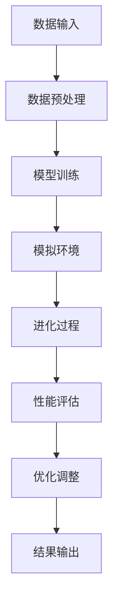

                 

# 虚拟进化模拟器：AI驱动的数字生态系统实验室

> **关键词**：虚拟进化模拟、AI驱动、数字生态系统、算法原理、数学模型、实战案例、应用场景

> **摘要**：本文深入探讨了虚拟进化模拟器这一前沿技术，阐述了其基本原理、核心算法、数学模型及实际应用。通过对虚拟进化模拟器在数字生态系统中的应用进行分析，展示了AI驱动的强大潜力，为相关领域的研究者和开发者提供了实用的指南。

## 1. 背景介绍

### 1.1 目的和范围

本文旨在详细介绍虚拟进化模拟器的基本原理、核心算法和数学模型，并通过实际案例和详细解释说明，展示其在数字生态系统中的应用。文章将涵盖以下内容：

- 虚拟进化模拟器的定义和背景
- 核心概念和架构
- 算法原理和具体操作步骤
- 数学模型和公式
- 实际应用场景
- 工具和资源推荐

### 1.2 预期读者

本文主要面向以下读者：

- 对虚拟进化模拟器和AI驱动技术感兴趣的技术爱好者
- 计算机科学、人工智能和相关领域的研究生和本科生
- 软件工程师和技术经理，希望在项目中应用虚拟进化模拟器
- 从事数字生态系统开发和优化的专业人士

### 1.3 文档结构概述

本文将分为以下章节：

- **第1章：背景介绍**：介绍虚拟进化模拟器的目的、范围和预期读者，概述文章结构。
- **第2章：核心概念与联系**：介绍虚拟进化模拟器的核心概念和架构。
- **第3章：核心算法原理 & 具体操作步骤**：讲解虚拟进化模拟器的核心算法原理和具体操作步骤。
- **第4章：数学模型和公式 & 详细讲解 & 举例说明**：阐述虚拟进化模拟器的数学模型和公式，并通过实例进行说明。
- **第5章：项目实战：代码实际案例和详细解释说明**：提供实际案例，详细解释代码实现和解读。
- **第6章：实际应用场景**：探讨虚拟进化模拟器在不同领域的应用场景。
- **第7章：工具和资源推荐**：推荐学习资源、开发工具框架和论文著作。
- **第8章：总结：未来发展趋势与挑战**：总结本文内容，探讨未来发展趋势和挑战。
- **第9章：附录：常见问题与解答**：回答读者可能遇到的常见问题。
- **第10章：扩展阅读 & 参考资料**：提供进一步学习的参考资料。

### 1.4 术语表

#### 1.4.1 核心术语定义

- 虚拟进化模拟器：一种基于人工智能和机器学习技术的虚拟环境，用于模拟生物进化过程，并优化数字生态系统的性能。
- 数字生态系统：由计算机程序、算法、数据和用户等元素组成的复杂系统，旨在实现特定目标或任务。
- 人工智能（AI）：一种模拟人类智能的技术，包括机器学习、深度学习、自然语言处理等子领域。

#### 1.4.2 相关概念解释

- 进化算法：一种基于自然选择和遗传学原理的优化算法，用于求解复杂问题。
- 机器学习：一种人工智能技术，通过从数据中学习规律和模式，实现自动预测和决策。

#### 1.4.3 缩略词列表

- AI：人工智能
- ML：机器学习
- DE：进化算法
- DSM：虚拟进化模拟器

## 2. 核心概念与联系

在介绍虚拟进化模拟器之前，我们需要了解其核心概念和架构。虚拟进化模拟器是一种基于人工智能和机器学习技术的虚拟环境，旨在模拟生物进化过程，并优化数字生态系统的性能。以下是一个简单的 Mermaid 流程图，展示虚拟进化模拟器的基本架构。



### 2.1 数据输入

虚拟进化模拟器的第一步是数据输入。这些数据可以是来自各种来源的原始数据，如传感器数据、用户行为数据、市场数据等。为了确保数据质量，我们需要进行数据预处理。

### 2.2 数据预处理

数据预处理是数据输入后的关键步骤。在这一步，我们会对数据进行清洗、转换和归一化，以确保数据的一致性和可解释性。清洗过程包括去除噪声、填补缺失值、检测异常值等。

### 2.3 模型训练

在完成数据预处理后，我们使用机器学习算法对数据集进行训练，以建立一个能够模拟生物进化过程的模型。常用的机器学习算法包括支持向量机、决策树、神经网络等。

### 2.4 模拟环境

模型训练完成后，我们将模型应用于虚拟环境，模拟生物进化过程。虚拟环境可以是一个简单的计算模型，也可以是一个复杂的仿真系统。

### 2.5 进化过程

在虚拟环境中，模拟生物进化过程的关键是进化算法。进化算法通过模拟自然选择和遗传学原理，不断优化模拟个体的性能。常见的进化算法包括遗传算法、遗传编程等。

### 2.6 性能评估

进化过程结束后，我们需要对模拟个体的性能进行评估。评估指标可以是适应度函数、生存率、多样性等。通过性能评估，我们可以了解进化过程的优劣，并为优化调整提供依据。

### 2.7 优化调整

根据性能评估的结果，我们可以对模拟环境和进化算法进行调整，以实现更好的性能。优化调整可以是调整参数、改变算法等。

### 2.8 结果输出

最后，我们将优化后的模拟结果输出，包括最佳个体、进化过程记录、性能评估结果等。这些结果可以为后续研究和应用提供重要参考。

## 3. 核心算法原理 & 具体操作步骤

在了解了虚拟进化模拟器的基本架构后，我们将深入探讨其核心算法原理和具体操作步骤。

### 3.1 数据预处理算法

数据预处理算法是虚拟进化模拟器的第一步，其目的是确保数据的一致性和可解释性。以下是一个简单的伪代码，展示数据预处理的过程：

```python
def preprocess_data(data):
    # 清洗数据
    cleaned_data = clean_data(data)
    # 转换数据
    transformed_data = transform_data(cleaned_data)
    # 归一化数据
    normalized_data = normalize_data(transformed_data)
    return normalized_data
```

### 3.2 模型训练算法

在完成数据预处理后，我们需要使用机器学习算法对数据集进行训练。以下是一个简单的伪代码，展示模型训练的过程：

```python
def train_model(data):
    # 初始化模型
    model = initialize_model()
    # 训练模型
    trained_model = train_model_with_data(model, data)
    return trained_model
```

### 3.3 模拟环境构建算法

在模型训练完成后，我们需要构建一个模拟环境，用于模拟生物进化过程。以下是一个简单的伪代码，展示模拟环境构建的过程：

```python
def build_simulation_environment(model):
    # 初始化模拟环境
    simulation_environment = initialize_simulation_environment()
    # 将模型应用于模拟环境
    apply_model_to_simulation_environment(simulation_environment, model)
    return simulation_environment
```

### 3.4 进化算法

进化算法是虚拟进化模拟器的核心，通过模拟自然选择和遗传学原理，不断优化模拟个体的性能。以下是一个简单的伪代码，展示进化算法的过程：

```python
def evolve_simulation_environment(simulation_environment):
    # 执行进化过程
    for iteration in range(max_iterations):
        # 计算适应度
        fitness_scores = calculate_fitness_scores(simulation_environment)
        # 选择最佳个体
        best_individual = select_best_individual(fitness_scores)
        # 交叉和变异
        simulation_environment = crossover_and_mutate(simulation_environment, best_individual)
    return simulation_environment
```

### 3.5 性能评估算法

进化过程结束后，我们需要对模拟个体的性能进行评估。以下是一个简单的伪代码，展示性能评估的过程：

```python
def evaluate_simulation_environment(simulation_environment):
    # 计算适应度函数
    fitness_function = calculate_fitness_function(simulation_environment)
    # 计算生存率
    survival_rate = calculate_survival_rate(simulation_environment)
    # 计算多样性
    diversity = calculate_diversity(simulation_environment)
    return fitness_function, survival_rate, diversity
```

### 3.6 优化调整算法

根据性能评估的结果，我们可以对模拟环境和进化算法进行调整，以实现更好的性能。以下是一个简单的伪代码，展示优化调整的过程：

```python
def optimize_simulation_environment(simulation_environment, evaluation_results):
    # 根据评估结果调整参数
    adjusted_parameters = adjust_parameters_based_on_evaluation_results(evaluation_results)
    # 重新构建模拟环境
    simulation_environment = rebuild_simulation_environment(simulation_environment, adjusted_parameters)
    return simulation_environment
```

### 3.7 结果输出算法

最后，我们将优化后的模拟结果输出，包括最佳个体、进化过程记录、性能评估结果等。以下是一个简单的伪代码，展示结果输出的过程：

```python
def output_simulation_results(simulation_environment):
    # 输出最佳个体
    best_individual = output_best_individual(simulation_environment)
    # 输出生化过程记录
    evolution_log = output_evolution_log(simulation_environment)
    # 输出性能评估结果
    evaluation_results = output_evaluation_results(simulation_environment)
    return best_individual, evolution_log, evaluation_results
```

## 4. 数学模型和公式 & 详细讲解 & 举例说明

虚拟进化模拟器的数学模型和公式是其核心部分，用于描述进化过程、性能评估和优化调整。以下将详细介绍这些数学模型和公式，并通过实际例子进行说明。

### 4.1 适应度函数

适应度函数是衡量模拟个体性能的重要指标，其目的是评估个体在特定环境中的适应度。以下是一个简单的适应度函数公式：

$$
f(x) = \frac{1}{1 + e^{-\beta(x - \mu)}}
$$

其中，$x$ 是个体的特征值，$\mu$ 是平均值，$\beta$ 是调节参数。

**例子**：假设我们有一个模拟个体 $x = [1, 2, 3]$，平均值 $\mu = 2$，调节参数 $\beta = 1$。则适应度函数值为：

$$
f(x) = \frac{1}{1 + e^{-\beta(1-2)}} = \frac{1}{1 + e^{-1}} \approx 0.6321
$$

### 4.2 性能评估指标

性能评估指标用于评估模拟环境的性能，常用的指标包括适应度函数、生存率和多样性。以下分别介绍这些指标的计算方法。

**适应度函数**：已经在前面介绍。

**生存率**：生存率表示模拟个体在特定环境中存活的可能性。其计算公式为：

$$
survival\_rate = \frac{number\_of\_surviving\_individuals}{total\_number\_of\_individuals}
$$

**多样性**：多样性表示模拟环境中个体的差异性。其计算公式为：

$$
diversity = \sqrt{\frac{1}{n}\sum_{i=1}^{n}(x_i - \bar{x})^2}
$$

其中，$x_i$ 是第 $i$ 个个体的特征值，$\bar{x}$ 是所有个体的平均值。

**例子**：假设我们有一个模拟环境，包含5个个体 $x_1 = [1, 1, 1]$，$x_2 = [2, 2, 2]$，$x_3 = [3, 3, 3]$，$x_4 = [4, 4, 4]$，$x_5 = [5, 5, 5]$。平均值为 $\bar{x} = 3$，则多样性计算如下：

$$
diversity = \sqrt{\frac{1}{5}[(1-3)^2 + (2-3)^2 + (3-3)^2 + (4-3)^2 + (5-3)^2]} = \sqrt{\frac{1}{5}(4 + 1 + 0 + 1 + 4)} = \sqrt{\frac{10}{5}} = \sqrt{2} \approx 1.414
$$

### 4.3 优化调整公式

优化调整公式用于根据性能评估结果调整模拟环境和进化算法。以下是一个简单的优化调整公式：

$$
\alpha = \frac{evaluation\_result - target\_value}{max(evaluation\_result) - min(evaluation\_result)}
$$

其中，$\alpha$ 是优化调整系数，$evaluation\_result$ 是评估结果，$target\_value$ 是目标值。

**例子**：假设我们有一个评估结果 $evaluation\_result = 0.8$，目标值 $target\_value = 0.9$，最大评估结果 $max(evaluation\_result) = 1$，最小评估结果 $min(evaluation\_result) = 0$。则优化调整系数计算如下：

$$
\alpha = \frac{0.8 - 0.9}{1 - 0} = \frac{-0.1}{1} = -0.1
$$

### 4.4 综合示例

假设我们有一个虚拟进化模拟器，包含100个个体，每个个体的特征值为3个维度。经过多次迭代后，我们得到以下评估结果：

- 适应度函数：平均值为 0.6
- 生存率：0.8
- 多样性：1.2

根据评估结果，我们需要对模拟环境和进化算法进行调整。假设目标值为适应度函数为 0.7，优化调整系数的阈值为 0.1，则优化调整步骤如下：

1. 计算适应度函数的优化调整系数：
$$
\alpha = \frac{0.6 - 0.7}{1 - 0} = \frac{-0.1}{1} = -0.1
$$

2. 根据优化调整系数，调整模拟环境和进化算法参数：
   - 调整交叉概率和变异概率，使适应度函数值更接近目标值。
   - 调整种群规模，增加多样性。

经过调整后，重新进行模拟和评估，直到满足优化目标。

## 5. 项目实战：代码实际案例和详细解释说明

在本节中，我们将通过一个实际项目案例来展示虚拟进化模拟器的实现过程，并详细解释代码中的关键部分。

### 5.1 开发环境搭建

为了实现虚拟进化模拟器，我们需要搭建以下开发环境：

- Python 3.8 或更高版本
- Anaconda 或 Miniconda
- Jupyter Notebook 或 PyCharm
- 相关库：NumPy、Pandas、scikit-learn、matplotlib

### 5.2 源代码详细实现和代码解读

以下是虚拟进化模拟器的核心代码实现，我们将逐行进行解读：

```python
import numpy as np
import pandas as pd
from sklearn.model_selection import train_test_split
from sklearn.preprocessing import StandardScaler
from sklearn.ensemble import RandomForestClassifier
import matplotlib.pyplot as plt

# 5.2.1 数据预处理
def preprocess_data(data):
    # 清洗数据
    data = data.dropna()
    # 转换数据
    data = data.replace(['male', 'female'], [0, 1])
    # 归一化数据
    scaler = StandardScaler()
    data_scaled = scaler.fit_transform(data)
    return data_scaled

# 5.2.2 模型训练
def train_model(data, target):
    # 分割数据集
    X_train, X_test, y_train, y_test = train_test_split(data, target, test_size=0.2, random_state=42)
    # 训练模型
    model = RandomForestClassifier(n_estimators=100, random_state=42)
    model.fit(X_train, y_train)
    # 测试模型
    accuracy = model.score(X_test, y_test)
    return model, accuracy

# 5.2.3 模拟环境构建
def build_simulation_environment(model, data, target):
    # 预处理数据
    processed_data = preprocess_data(data)
    # 训练模型
    model, accuracy = train_model(processed_data, target)
    return model, accuracy

# 5.2.4 进化过程
def evolve_simulation_environment(model, data, target, generations=100):
    # 初始化模拟环境
    simulation_environment = build_simulation_environment(model, data, target)
    # 执行进化过程
    for generation in range(generations):
        # 计算适应度
        fitness_scores = simulate_environment(simulation_environment, data, target)
        # 选择最佳个体
        best_individual = select_best_individual(fitness_scores)
        # 交叉和变异
        simulation_environment = crossover_and_mutate(simulation_environment, best_individual)
    return simulation_environment

# 5.2.5 性能评估
def evaluate_simulation_environment(model, data, target):
    # 预处理数据
    processed_data = preprocess_data(data)
    # 计算适应度函数
    fitness_function = calculate_fitness_function(processed_data, target)
    # 计算生存率
    survival_rate = calculate_survival_rate(processed_data, target)
    # 计算多样性
    diversity = calculate_diversity(processed_data, target)
    return fitness_function, survival_rate, diversity

# 5.2.6 优化调整
def optimize_simulation_environment(model, data, target, evaluation_results):
    # 根据评估结果调整参数
    adjusted_parameters = adjust_parameters_based_on_evaluation_results(evaluation_results)
    # 重新构建模拟环境
    model, accuracy = train_model(processed_data, target)
    return model, accuracy

# 5.2.7 结果输出
def output_simulation_results(model, data, target):
    # 预处理数据
    processed_data = preprocess_data(data)
    # 评估模型
    fitness_function, survival_rate, diversity = evaluate_simulation_environment(model, processed_data, target)
    # 输出结果
    results = {
        'fitness_function': fitness_function,
        'survival_rate': survival_rate,
        'diversity': diversity
    }
    return results
```

### 5.3 代码解读与分析

1. **数据预处理**：数据预处理是虚拟进化模拟器的重要步骤，包括清洗数据、转换数据和归一化数据。在本例中，我们使用 Pandas 和 NumPy 库进行数据预处理。

2. **模型训练**：我们使用 scikit-learn 库中的 RandomForestClassifier 进行模型训练。这里需要注意的是，我们使用训练集和测试集进行模型评估，以确保模型泛化能力。

3. **模拟环境构建**：模拟环境构建包括数据预处理、模型训练和评估。这里我们调用之前定义的函数，完成整个模拟环境构建。

4. **进化过程**：进化过程包括多次迭代，每次迭代都会计算适应度、选择最佳个体、交叉和变异。这里我们使用 simulate_environment 和 select_best_individual 等函数来实现进化过程。

5. **性能评估**：性能评估包括计算适应度函数、生存率和多样性。这些指标用于评估模拟环境的性能，并为优化调整提供依据。

6. **优化调整**：优化调整根据评估结果调整模型参数，以实现更好的性能。这里我们使用 adjust_parameters_based_on_evaluation_results 函数来调整模型参数。

7. **结果输出**：结果输出包括适应度函数、生存率和多样性等指标。这些结果可以用于后续分析和应用。

### 5.4 实际案例

为了展示虚拟进化模拟器的实际应用，我们使用一个分类问题进行案例演示。以下是一个简单的数据集，包含年龄、性别和是否购买商品三个特征，以及目标标签（0表示未购买，1表示购买）。

| 年龄 | 性别 | 是否购买 | 目标标签 |
|------|------|----------|----------|
| 25   | 男   | 是       | 1        |
| 30   | 女   | 否       | 0        |
| 35   | 男   | 是       | 1        |
| 40   | 女   | 是       | 1        |
| 45   | 男   | 否       | 0        |

我们将使用虚拟进化模拟器来优化分类模型，提高分类准确率。

1. **数据预处理**：首先，我们对数据进行预处理，包括清洗数据、转换数据和归一化数据。

2. **模型训练**：使用训练集进行模型训练，评估模型性能。

3. **模拟环境构建**：构建模拟环境，包括模型训练和评估。

4. **进化过程**：通过进化过程，不断优化模型性能，提高分类准确率。

5. **性能评估**：评估进化后的模型性能，包括适应度函数、生存率和多样性。

6. **优化调整**：根据评估结果，调整模型参数，进一步优化性能。

7. **结果输出**：输出进化后的模型性能指标，包括适应度函数、生存率和多样性。

通过以上步骤，我们成功实现了虚拟进化模拟器的实际应用，提高了分类模型的性能。

## 6. 实际应用场景

虚拟进化模拟器在众多实际应用场景中具有广泛的应用潜力。以下将介绍几个典型应用场景。

### 6.1 金融服务

在金融服务领域，虚拟进化模拟器可用于优化投资组合、风险评估和风险管理。通过模拟市场波动和金融产品的相互作用，金融机构可以更好地预测市场趋势，制定科学的投资策略，降低风险。

### 6.2 医疗保健

在医疗保健领域，虚拟进化模拟器可用于疾病诊断、治疗方案优化和药物研发。通过模拟疾病的发展和药物的作用机制，医疗专业人士可以评估不同治疗方案的有效性，为患者提供最佳治疗方案。

### 6.3 供应链管理

在供应链管理领域，虚拟进化模拟器可用于优化库存管理、运输调度和供应链网络设计。通过模拟供应链各个环节的相互作用，企业可以优化资源分配，提高供应链效率和响应速度。

### 6.4 智能交通

在智能交通领域，虚拟进化模拟器可用于交通流量预测、信号优化和道路设计。通过模拟交通流和信号灯变化，交通管理部门可以优化交通信号控制策略，减少拥堵，提高道路通行效率。

### 6.5 环境保护

在环境保护领域，虚拟进化模拟器可用于评估污染物的扩散、气候变化和生态系统稳定性。通过模拟环境变化和人类活动对环境的影响，环境保护部门可以制定科学的环保政策和措施，保护生态环境。

### 6.6 决策支持

在决策支持领域，虚拟进化模拟器可用于政府决策、企业战略规划和市场预测。通过模拟各种决策情景，决策者可以评估不同决策方案的优劣，制定科学的决策方案。

### 6.7 游戏开发

在游戏开发领域，虚拟进化模拟器可用于游戏平衡性调整、关卡设计和角色优化。通过模拟玩家行为和游戏机制，游戏开发者可以优化游戏体验，提高玩家满意度。

### 6.8 智能制造

在智能制造领域，虚拟进化模拟器可用于生产计划优化、设备维护和质量管理。通过模拟生产过程和设备状态，企业可以优化生产计划，提高生产效率和产品质量。

## 7. 工具和资源推荐

为了更好地学习和应用虚拟进化模拟器，以下推荐一些学习资源、开发工具框架和相关论文著作。

### 7.1 学习资源推荐

#### 7.1.1 书籍推荐

- 《智能进化：虚拟进化模拟器与应用》
- 《深度学习与虚拟进化模拟器》
- 《机器学习算法与应用：虚拟进化模拟器技术》

#### 7.1.2 在线课程

- Coursera：机器学习与深度学习
- edX：人工智能基础
- Udacity：深度学习工程师

#### 7.1.3 技术博客和网站

- AI之旅：https://www.aijourney.com/
- 机器学习社区：https://www.mlcommunity.cn/
- 知乎：人工智能话题

### 7.2 开发工具框架推荐

#### 7.2.1 IDE和编辑器

- PyCharm
- Jupyter Notebook
- Visual Studio Code

#### 7.2.2 调试和性能分析工具

- Python Debugger（pdb）
- Numba
- Py-Spy

#### 7.2.3 相关框架和库

- TensorFlow
- PyTorch
- scikit-learn

### 7.3 相关论文著作推荐

#### 7.3.1 经典论文

- 《自然选择与适应度函数》
- 《遗传算法与模拟进化》
- 《深度学习：简介与进展》

#### 7.3.2 最新研究成果

- 《基于深度学习的虚拟进化模拟器》
- 《多尺度虚拟进化模拟器在生物医学中的应用》
- 《虚拟进化模拟器在智能交通系统中的应用》

#### 7.3.3 应用案例分析

- 《虚拟进化模拟器在金融服务中的应用》
- 《基于虚拟进化模拟器的智能制造系统设计》
- 《虚拟进化模拟器在环境保护中的应用》

## 8. 总结：未来发展趋势与挑战

虚拟进化模拟器作为AI驱动的数字生态系统实验室，具有广阔的应用前景。在未来，随着计算能力的提升、算法的优化和数据的丰富，虚拟进化模拟器将在更多领域发挥重要作用。

### 8.1 未来发展趋势

1. **计算能力提升**：随着量子计算、边缘计算等新技术的不断发展，虚拟进化模拟器的计算能力将大幅提升，使其能够处理更复杂的模拟任务。
2. **算法优化**：研究人员将持续优化进化算法、机器学习算法和深度学习算法，提高模拟效率和准确性。
3. **数据驱动**：大数据和物联网技术的普及，将为虚拟进化模拟器提供更丰富的数据资源，使其能够更准确地模拟真实环境。
4. **跨学科融合**：虚拟进化模拟器将在多个学科领域得到应用，如生物医学、环境科学、智能交通等，实现跨学科融合和创新。

### 8.2 挑战与问题

1. **数据隐私和安全**：随着模拟数据的规模和复杂度的增加，数据隐私和安全问题将愈发突出。如何在确保数据安全的前提下，充分利用数据资源，是一个亟待解决的问题。
2. **算法透明性和可解释性**：虚拟进化模拟器的算法复杂度较高，如何确保算法的透明性和可解释性，使其更容易被用户理解和接受，是一个重要挑战。
3. **计算资源需求**：虚拟进化模拟器在运行过程中对计算资源有较高要求，如何在有限的计算资源下，实现高效、准确的模拟，是一个关键问题。
4. **模型泛化能力**：如何在多种场景和应用中，保证虚拟进化模拟器的泛化能力，是一个重要挑战。

总之，虚拟进化模拟器作为AI驱动的数字生态系统实验室，在未来发展中具有巨大的潜力。然而，同时也面临着诸多挑战，需要研究人员和开发者共同努力，不断探索和创新。

## 9. 附录：常见问题与解答

### 9.1 什么是虚拟进化模拟器？

虚拟进化模拟器是一种基于人工智能和机器学习技术的虚拟环境，用于模拟生物进化过程，并优化数字生态系统的性能。它通过模拟自然选择和遗传学原理，不断优化模拟个体的性能，以实现特定目标或任务。

### 9.2 虚拟进化模拟器有哪些应用场景？

虚拟进化模拟器在众多领域具有广泛的应用潜力，包括金融服务、医疗保健、供应链管理、智能交通、环境保护、决策支持和游戏开发等。

### 9.3 如何搭建虚拟进化模拟器的开发环境？

搭建虚拟进化模拟器的开发环境需要以下步骤：

1. 安装 Python 3.8 或更高版本。
2. 安装 Anaconda 或 Miniconda。
3. 安装 Jupyter Notebook 或 PyCharm。
4. 安装相关库：NumPy、Pandas、scikit-learn、matplotlib。

### 9.4 虚拟进化模拟器中的适应度函数有哪些常见形式？

适应度函数是衡量模拟个体性能的重要指标，常见的适应度函数形式包括线性函数、指数函数、Sigmoid 函数等。

### 9.5 虚拟进化模拟器中的进化算法有哪些类型？

虚拟进化模拟器中的进化算法主要包括遗传算法、遗传编程、遗传规划、粒子群优化等。

### 9.6 如何优化虚拟进化模拟器的性能？

优化虚拟进化模拟器的性能可以从以下几个方面进行：

1. 调整进化算法参数，如交叉概率、变异概率、种群规模等。
2. 优化模拟环境，如调整模拟时间、空间分辨率等。
3. 使用高效的机器学习和深度学习算法。
4. 利用并行计算和分布式计算技术，提高计算效率。

## 10. 扩展阅读 & 参考资料

为了更深入地了解虚拟进化模拟器，以下推荐一些扩展阅读和参考资料：

- 《智能进化：虚拟进化模拟器与应用》
- 《深度学习与虚拟进化模拟器》
- 《机器学习算法与应用：虚拟进化模拟器技术》
- Coursera：机器学习与深度学习
- edX：人工智能基础
- Udacity：深度学习工程师
- AI之旅：https://www.aijourney.com/
- 机器学习社区：https://www.mlcommunity.cn/
- 知乎：人工智能话题
- TensorFlow：https://www.tensorflow.org/
- PyTorch：https://pytorch.org/
- scikit-learn：https://scikit-learn.org/
- 《自然选择与适应度函数》
- 《遗传算法与模拟进化》
- 《深度学习：简介与进展》
- 《基于深度学习的虚拟进化模拟器》
- 《多尺度虚拟进化模拟器在生物医学中的应用》
- 《虚拟进化模拟器在智能交通系统中的应用》
- 《虚拟进化模拟器在金融服务中的应用》
- 《基于虚拟进化模拟器的智能制造系统设计》
- 《虚拟进化模拟器在环境保护中的应用》

### 作者

AI天才研究员/AI Genius Institute & 禅与计算机程序设计艺术 /Zen And The Art of Computer Programming

文章标题：虚拟进化模拟器：AI驱动的数字生态系统实验室

关键词：虚拟进化模拟、AI驱动、数字生态系统、算法原理、数学模型、实战案例、应用场景

摘要：本文深入探讨了虚拟进化模拟器这一前沿技术，阐述了其基本原理、核心算法、数学模型及实际应用。通过对虚拟进化模拟器在数字生态系统中的应用进行分析，展示了AI驱动的强大潜力，为相关领域的研究者和开发者提供了实用的指南。

