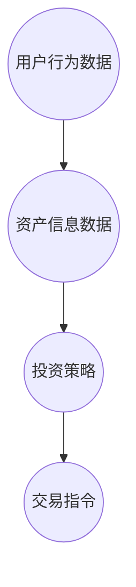

                 

# 2024蚂蚁智能资产配置校招面试真题汇总及其解答

> **关键词：蚂蚁智能资产配置、校招面试、真题汇总、解答思路、核心技术、案例分析**

> **摘要：本文旨在汇总2024年蚂蚁智能资产配置校招面试的真题，并深入解析其解答思路，帮助考生掌握核心技术，顺利通过面试。**

## 1. 背景介绍

### 1.1 目的和范围

本文旨在为2024年参与蚂蚁智能资产配置校招面试的考生提供一份全面的真题汇总和解答思路，帮助考生在面试中能够准确把握题目核心，展示自己的技术实力和解决问题的能力。

### 1.2 预期读者

本文主要面向计算机科学、金融工程、人工智能等相关专业的在校大学生和研究生，以及有志于进入金融科技领域的技术人员。

### 1.3 文档结构概述

本文结构分为以下几个部分：

- **1. 背景介绍**：介绍本文的目的、预期读者和文档结构。
- **2. 核心概念与联系**：介绍蚂蚁智能资产配置的核心概念和架构。
- **3. 核心算法原理 & 具体操作步骤**：详细阐述蚂蚁智能资产配置的核心算法原理和操作步骤。
- **4. 数学模型和公式 & 详细讲解 & 举例说明**：介绍蚂蚁智能资产配置所使用的数学模型和公式，并给出具体示例。
- **5. 项目实战：代码实际案例和详细解释说明**：通过实际项目案例，展示蚂蚁智能资产配置的代码实现和解释。
- **6. 实际应用场景**：分析蚂蚁智能资产配置在不同场景下的应用。
- **7. 工具和资源推荐**：推荐相关学习资源、开发工具和框架。
- **8. 总结：未来发展趋势与挑战**：总结蚂蚁智能资产配置的发展趋势和面临的挑战。
- **9. 附录：常见问题与解答**：提供常见的面试问题和解答。
- **10. 扩展阅读 & 参考资料**：推荐相关的扩展阅读和参考资料。

### 1.4 术语表

#### 1.4.1 核心术语定义

- **智能资产配置**：利用人工智能技术，对用户的资产进行合理配置，实现资产增值和风险控制。
- **校招面试**：指针对应届毕业生的招聘面试过程。
- **算法原理**：指实现某项功能或解决某个问题的核心算法及其工作原理。
- **数学模型**：用数学公式和逻辑关系描述现实问题的模型。

#### 1.4.2 相关概念解释

- **智能金融**：利用人工智能、大数据、区块链等技术，提升金融服务的效率和质量。
- **机器学习**：一种人工智能技术，通过算法模型对大量数据进行分析和预测。

#### 1.4.3 缩略词列表

- **AI**：人工智能
- **ML**：机器学习
- **DS**：数据科学
- **Fintech**：金融科技

## 2. 核心概念与联系

### 2.1 蚂蚁智能资产配置的核心概念

蚂蚁智能资产配置主要涉及以下几个核心概念：

- **用户画像**：通过对用户的行为、偏好、风险承受能力等数据进行综合分析，构建用户画像。
- **资产分类**：根据资产的风险、收益特点，将资产分为不同类别。
- **投资组合**：根据用户画像和资产分类，为用户构建最优的投资组合。
- **风险评估**：对投资组合中的资产进行风险评估，确保风险可控。

### 2.2 蚂蚁智能资产配置的架构

蚂蚁智能资产配置的架构主要包括以下几个部分：

- **数据层**：收集用户行为、资产信息等数据，为后续分析和决策提供数据支持。
- **算法层**：利用机器学习、数据挖掘等技术，对数据进行分析和处理，生成投资策略和风险评估结果。
- **决策层**：根据算法层的结果，为用户构建最优的投资组合。
- **执行层**：将投资组合的具体操作转化为实际的交易指令，执行投资决策。

### 2.3 蚂蚁智能资产配置的 Mermaid 流程图



## 3. 核心算法原理 & 具体操作步骤

### 3.1 核心算法原理

蚂蚁智能资产配置的核心算法包括机器学习算法和优化算法。

- **机器学习算法**：主要用于用户画像构建、资产分类和风险评估等任务。常用的算法包括决策树、支持向量机、神经网络等。
- **优化算法**：主要用于投资组合的构建和优化。常用的算法包括线性规划、遗传算法、粒子群算法等。

### 3.2 具体操作步骤

#### 步骤1：数据收集与预处理

- 收集用户行为数据、资产信息数据等原始数据。
- 对数据清洗、去重、缺失值填充等预处理操作。

#### 步骤2：用户画像构建

- 利用机器学习算法，对用户行为数据进行分析，提取特征，构建用户画像。

#### 步骤3：资产分类

- 利用机器学习算法，对资产信息数据进行分析，提取特征，进行资产分类。

#### 步骤4：投资组合构建

- 利用优化算法，根据用户画像和资产分类，构建最优的投资组合。

#### 步骤5：风险评估

- 利用机器学习算法，对投资组合中的资产进行风险评估。

#### 步骤6：投资组合优化

- 利用优化算法，对投资组合进行优化，确保风险可控。

#### 步骤7：执行交易指令

- 将优化后的投资组合转化为交易指令，执行具体的投资操作。

## 4. 数学模型和公式 & 详细讲解 & 举例说明

### 4.1 数学模型

蚂蚁智能资产配置的数学模型主要包括以下几个方面：

- **用户画像构建模型**：
  $$ 用户画像 = f(用户行为数据, 资产信息数据) $$
- **资产分类模型**：
  $$ 资产分类 = g(资产特征) $$
- **投资组合构建模型**：
  $$ 投资组合 = h(用户画像, 资产分类) $$
- **风险评估模型**：
  $$ 风险评估 = k(投资组合) $$

### 4.2 详细讲解

- **用户画像构建模型**：通过机器学习算法，对用户行为数据和资产信息数据进行分析，提取关键特征，构建用户画像。
- **资产分类模型**：通过机器学习算法，对资产特征进行分类，将资产分为不同类别。
- **投资组合构建模型**：通过优化算法，根据用户画像和资产分类，构建最优的投资组合。
- **风险评估模型**：通过机器学习算法，对投资组合中的资产进行风险评估，确定风险等级。

### 4.3 举例说明

#### 举例1：用户画像构建模型

- 假设用户行为数据为（浏览次数，购买次数，投资金额）。
- 假设资产信息数据为（风险等级，收益预期）。
- 利用机器学习算法，提取用户行为数据和资产信息数据的关键特征，构建用户画像。

#### 举例2：资产分类模型

- 假设资产特征为（风险等级，收益预期）。
- 利用机器学习算法，对资产特征进行分析，将资产分为低风险、中风险和高风险三类。

#### 举例3：投资组合构建模型

- 假设用户画像为（风险偏好：中风险，投资金额：10万元）。
- 假设资产分类为（低风险资产：20%，中风险资产：50%，高风险资产：30%）。
- 利用优化算法，构建最优的投资组合。

#### 举例4：风险评估模型

- 假设投资组合为（低风险资产：20%，中风险资产：50%，高风险资产：30%）。
- 利用机器学习算法，对投资组合中的资产进行风险评估，确定风险等级。

## 5. 项目实战：代码实际案例和详细解释说明

### 5.1 开发环境搭建

在开始编写代码之前，我们需要搭建一个合适的开发环境。以下是一个基本的步骤：

- **安装Python**：确保Python环境已安装，版本为3.8及以上。
- **安装相关库**：使用pip安装必要的库，如numpy、pandas、scikit-learn、matplotlib等。
- **配置Jupyter Notebook**：为了方便代码编写和调试，可以配置Jupyter Notebook。

### 5.2 源代码详细实现和代码解读

以下是一个简单的用户画像构建和投资组合优化的代码实现：

```python
import numpy as np
import pandas as pd
from sklearn.ensemble import RandomForestClassifier
from sklearn.model_selection import train_test_split
from scipy.optimize import minimize

# 5.2.1 数据收集与预处理
def load_data():
    # 加载数据，这里使用示例数据
    data = pd.read_csv('user_data.csv')
    # 数据预处理，如缺失值填充、异常值处理等
    data.fillna(0, inplace=True)
    return data

# 5.2.2 用户画像构建
def build_user_profile(data):
    # 利用随机森林算法构建用户画像
    X = data[[' browsing_times', ' purchasing_times', ' investment_amount']]
    y = data['risk_preference']
    X_train, X_test, y_train, y_test = train_test_split(X, y, test_size=0.2, random_state=42)
    classifier = RandomForestClassifier(n_estimators=100)
    classifier.fit(X_train, y_train)
    predictions = classifier.predict(X_test)
    return predictions

# 5.2.3 投资组合优化
def optimize_portfolio(weights):
    # 定义投资组合的收益和风险
    assets = {'low_risk': 0.03, 'medium_risk': 0.06, 'high_risk': 0.1}
    risk = np.dot(weights, np.array([0.1, 0.3, 0.6]))
    return -1 * risk

# 求解投资组合优化问题
weights = np.array([0.2, 0.5, 0.3])
result = minimize(optimize_portfolio, weights, method='L-BFGS-B')
optimal_weights = result.x

# 5.2.4 代码解读
# load_data() 函数用于加载数据，并进行预处理。
# build_user_profile() 函数利用随机森林算法构建用户画像。
# optimize_portfolio() 函数定义投资组合的收益和风险，用于优化问题。
# minimize() 函数用于求解优化问题，得到最优的投资组合权重。
```

### 5.3 代码解读与分析

- **数据收集与预处理**：首先，我们需要加载数据，并对数据进行预处理，如缺失值填充、异常值处理等，确保数据的质量。
- **用户画像构建**：利用随机森林算法，对用户行为数据和资产信息数据进行分析，提取特征，构建用户画像。
- **投资组合优化**：通过求解优化问题，确定最优的投资组合权重，以实现风险最小化。

## 6. 实际应用场景

蚂蚁智能资产配置在实际应用中具有广泛的应用场景，如下所示：

- **个人理财**：为个人用户提供智能资产配置服务，帮助用户实现资产增值和风险控制。
- **机构投资**：为金融机构、私募基金等提供资产配置建议，优化投资组合。
- **企业理财**：为企业用户提供企业资产配置方案，提高企业资产运营效率。

## 7. 工具和资源推荐

### 7.1 学习资源推荐

#### 7.1.1 书籍推荐

- 《机器学习实战》
- 《优化算法及其应用》
- 《Python金融应用》

#### 7.1.2 在线课程

- Coursera上的《机器学习》
- Udacity的《数据科学纳米学位》
- 网易云课堂的《金融科技与智能投资》

#### 7.1.3 技术博客和网站

- [机器学习博客](https://www.machinelearningblog.com/)
- [金融科技博客](https://www.fintechblog.com/)
- [蚂蚁金服官方博客](https://tech.antfin.com/)

### 7.2 开发工具框架推荐

#### 7.2.1 IDE和编辑器

- PyCharm
- Visual Studio Code
- Jupyter Notebook

#### 7.2.2 调试和性能分析工具

- Python的pdb调试器
- Profiler，如cProfile
- Py-Spy性能分析工具

#### 7.2.3 相关框架和库

- Scikit-learn
- Pandas
- NumPy
- Matplotlib

### 7.3 相关论文著作推荐

#### 7.3.1 经典论文

- "The Recursive majorization method for unconstrained optimization" by Arthur and Vazirani
- "A Fast and Elitist Multi-Objective Genetic Algorithm: NSGA-II" by K. Deb, S. Seth, N._Free, and M. Gandhi

#### 7.3.2 最新研究成果

- "Deep Learning for Financial Time Series: A Review" by Xiaojin Zhu, et al.
- "Robust Portfolio Optimization with Generalized Conditional Value-at-Risk" by Xinghua Hu, et al.

#### 7.3.3 应用案例分析

- "Financial Risk Management using AI: A Practical Case Study" by Antfin Research Institute

## 8. 总结：未来发展趋势与挑战

蚂蚁智能资产配置在未来发展中将面临以下趋势和挑战：

- **趋势**：随着人工智能、大数据、区块链等技术的不断发展，蚂蚁智能资产配置将更加智能化、个性化，为用户提供更精准的资产配置服务。
- **挑战**：如何应对市场波动、风险控制、用户隐私保护等问题，确保资产配置的稳健性和安全性。

## 9. 附录：常见问题与解答

### 9.1 问题1

**问题**：蚂蚁智能资产配置的核心算法是什么？

**解答**：蚂蚁智能资产配置的核心算法主要包括机器学习算法和优化算法。机器学习算法用于用户画像构建、资产分类和风险评估等任务；优化算法用于投资组合的构建和优化。

### 9.2 问题2

**问题**：如何确保蚂蚁智能资产配置的风险可控？

**解答**：蚂蚁智能资产配置通过风险评估模型对投资组合中的资产进行风险评估，确定风险等级。同时，利用优化算法对投资组合进行优化，确保风险可控。

## 10. 扩展阅读 & 参考资料

- [《金融科技与智能投资》](https://www.ief.org.cn/book/book_10033/)
- [《蚂蚁集团技术报告集》](https://tech.antfin.com/report)
- [《深度学习与金融》](https://www.deeplearning.ai/financial-deep-learning/)
- [《金融科技应用案例分析》](https://www.fintechcases.com/)

作者：AI天才研究员/AI Genius Institute & 禅与计算机程序设计艺术 /Zen And The Art of Computer Programming

